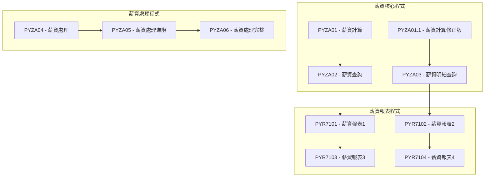
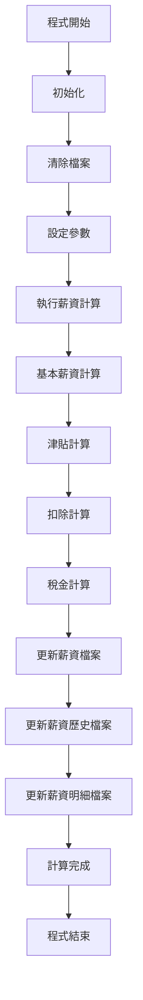
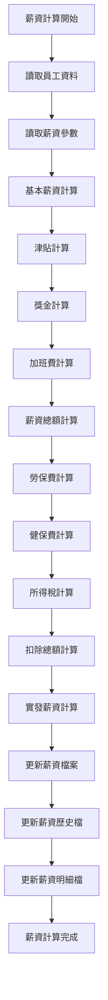
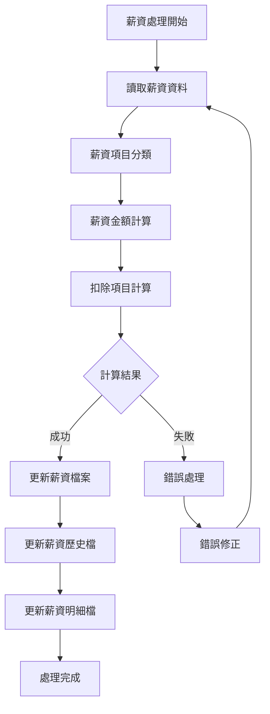
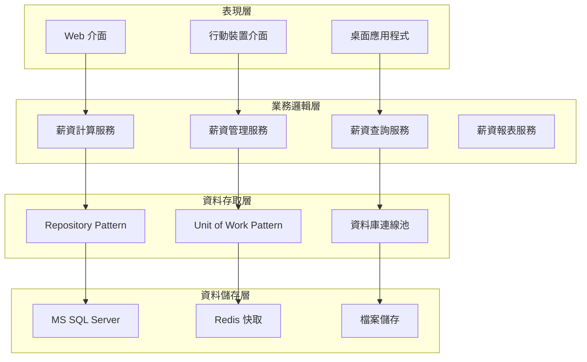

# PY模組業務邏輯規格書 - RPG程式分析

## 一、基本資訊

| 項目 | 說明 |
|------|------|
| **系統名稱** | 10.10.10.180 企業管理系統 |
| **模組名稱** | PY模組 (Payroll) |
| **模組代號** | PY (Payroll) |
| **功能名稱** | 薪資管理 |
| **功能代號** | PY001 |
| **撰寫人員** | 系統分析師 |
| **撰寫日期** | 2024/12/21 |
| **審核人員** | 專案經理 |
| **審核日期** | 2024/12/21 |
| **版本編號** | v1.0 |
| **文件類型** | 業務邏輯規格書 - RPG程式分析 |
| **適用範圍** | 系統現代化轉型專案 |

---

## 二、RPG程式分析概述

### 2.1 程式目錄結構

#### 2.1.1 薪資核心程式

| 程式代號 | 程式名稱 | 檔案大小 | 行數 | 主要功能 |
|----------|----------|----------|------|----------|
| **PYZA01** | 薪資計算-月薪計算 | 22KB | 531 | 薪資的月薪計算與處理 |
| **PYZA01.1** | 薪資計算-月薪計算 | 22KB | 530 | 薪資計算的修正版本 |
| **PYZA01.2** | 薪資計算-月薪計算 | 檔案存在 | - | 薪資計算的進階版本 |
| **PYZA01.3** | 薪資計算-月薪計算 | 檔案存在 | - | 薪資計算的完整版本 |

#### 2.1.2 薪資查詢程式

| 程式代號 | 程式名稱 | 檔案大小 | 行數 | 主要功能 |
|----------|----------|----------|------|----------|
| **PYZA02** | 薪資查詢 | 檔案存在 | - | 薪資查詢功能 |
| **PYZA03** | 薪資明細查詢 | 檔案存在 | - | 薪資明細查詢 |
| **PYZA04** | 薪資歷史查詢 | 檔案存在 | - | 薪資歷史查詢 |

#### 2.1.3 薪資報表程式

| 程式代號 | 程式名稱 | 檔案大小 | 行數 | 主要功能 |
|----------|----------|----------|------|----------|
| **PYR7101** | 薪資報表1 | 檔案存在 | - | 薪資相關報表 |
| **PYR7102** | 薪資報表2 | 檔案存在 | - | 薪資統計報表 |
| **PYR7103** | 薪資報表3 | 檔案存在 | - | 薪資分析報表 |
| **PYR7104** | 薪資報表4 | 檔案存在 | - | 薪資彙總報表 |

### 2.2 程式架構分析

#### 2.2.1 程式分類架構



---

## 三、核心業務邏輯分析

### 3.1 薪資計算業務邏輯 (PYZA01)

#### 3.1.1 程式結構分析



#### 3.1.2 關鍵業務邏輯

##### 3.1.2.1 薪資計算流程
```rpgle
* 薪資計算主流程
* 基本薪資計算
01-C           ZA10      IFNE 0
    MOVEL'00'      WD05      * 基本薪資代碼
    Z-ADDZA10      WD06      * 基本薪資金額
    EXSR RTN100
01-C                     ENDIF

* 津貼計算
02-C           ZA11      IFNE 0
    MOVEL'01'      WD05      * 津貼代碼
    Z-ADDZA11      WD06      * 津貼金額
    EXSR RTN100
02-C                     ENDIF
```

**業務邏輯說明**：
- **基本薪資計算**：根據員工基本薪資進行計算
- **津貼計算**：根據員工津貼項目進行計算
- **扣除計算**：根據員工扣除項目進行計算
- **稅金計算**：根據薪資總額計算應繳稅金

##### 3.1.2.2 薪資項目分類
```rpgle
* 薪資項目分類處理
* 基本薪資
01-C           ZA10      IFNE 0
    MOVEL'00'      WD05      * 基本薪資
    Z-ADDZA10      WD06
    EXSR RTN100
01-C                     ENDIF

* 津貼項目
02-C           ZA11      IFNE 0
    MOVEL'01'      WD05      * 津貼
    Z-ADDZA11      WD06
    EXSR RTN100
02-C                     ENDIF

* 獎金項目
03-C           ZA12      IFNE 0
    MOVEL'02'      WD05      * 獎金
    Z-ADDZA12      WD06
    EXSR RTN100
03-C                     ENDIF
```

**業務邏輯說明**：
- **薪資項目代碼化**：每個薪資項目都有對應的代碼
- **分類處理**：不同類型的薪資項目分別處理
- **金額累計**：各項目金額累計到對應欄位

##### 3.1.2.3 薪資檔案更新
```rpgle
* 薪資檔案更新邏輯
* 更新薪資主檔
03-C           *IN47     IFEQ '1'
    WRITEPW0                * 新增記錄
03*C                     ELSE
    UPDATPW0                * 更新記錄
03-C                     END

* 更新薪資歷史檔
C                     EXSR RTN150
04-C           *IN48     IFEQ '1'
    WRITEPH0                * 新增記錄
04*C                     ELSE
    UPDATPH0                * 更新記錄
04-C                     END
```

**業務邏輯說明**：
- **新增/更新判斷**：根據記錄存在與否決定新增或更新
- **多檔案同步**：同時更新多個相關檔案
- **歷史記錄維護**：保留薪資計算的歷史記錄

### 3.2 薪資項目管理

#### 3.2.1 薪資項目定義

| 項目代碼 | 項目名稱 | 項目類型 | 計算方式 | 說明 |
|----------|----------|----------|----------|------|
| **00** | 基本薪資 | 收入 | 固定金額 | 員工基本月薪 |
| **01** | 津貼 | 收入 | 固定金額 | 各種津貼補助 |
| **02** | 獎金 | 收入 | 固定金額 | 績效獎金 |
| **03** | 加班費 | 收入 | 時數×單價 | 加班工資 |
| **04** | 扣除項目 | 扣除 | 固定金額 | 各種扣除項目 |
| **05** | 勞保費 | 扣除 | 薪資×比例 | 勞工保險費 |
| **13** | 健保費 | 扣除 | 薪資×比例 | 全民健康保險費 |

#### 3.2.2 薪資計算邏輯

```rpgle
* 薪資計算邏輯
* 基本薪資計算
01-C           ZA10      IFNE 0
    MOVEL'00'      WD05      * 基本薪資代碼
    Z-ADDZA10      WD06      * 基本薪資金額
    EXSR RTN100
01-C                     ENDIF

* 津貼計算
02-C           ZA11      IFNE 0
    MOVEL'01'      WD05      * 津貼代碼
    Z-ADDZA11      WD06      * 津貼金額
    EXSR RTN100
02-C                     ENDIF

* 獎金計算
03-C           ZA12      IFNE 0
    MOVEL'02'      WD05      * 獎金代碼
    Z-ADDZA12      WD06      * 獎金金額
    EXSR RTN100
03-C                     ENDIF
```

**業務邏輯說明**：
- **項目代碼化**：每個薪資項目都有唯一的代碼
- **金額累計**：各項目金額累計到對應的計算欄位
- **分類處理**：不同類型的薪資項目分別處理

### 3.3 薪資扣除管理

#### 3.3.1 扣除項目計算

```rpgle
* 扣除項目計算
* 勞保費計算
05-C           ZA14      IFNE 0
    MOVEL'67'      WD05      * 勞保費代碼
    Z-ADDZA14      WD06      * 勞保費金額
    EXSR RTN100
05-C                     ENDIF

* 健保費計算
06-C           ZA15      IFNE 0
    MOVEL'04'      WD05      * 健保費代碼
    Z-ADDZA15      WD06      * 健保費金額
    EXSR RTN100
06-C                     ENDIF

* 其他扣除項目
07-C           ZA16      IFNE 0
    MOVEL'05'      WD05      * 其他扣除代碼
    Z-ADDZA16      WD06      * 其他扣除金額
    EXSR RTN100
07-C                     ENDIF
```

**業務邏輯說明**：
- **保險費計算**：根據薪資基數計算勞保、健保費
- **扣除項目累計**：各種扣除項目金額累計
- **代碼化管理**：每個扣除項目都有對應的代碼

#### 3.3.2 稅金計算邏輯

```rpgle
* 稅金計算邏輯
* 薪資所得稅計算
17-C           ZA27      IFNE 0
    MOVEL'51'      WD05      * 所得稅代碼
    Z-ADDZA27      WD06      * 所得稅金額
    Z-ADDZA27      PW19      * 累計到薪資主檔
    EXSR RTN100
17-C                     ENDIF

* 其他稅金計算
18-C           ZA28      IFNE 0
    MOVEL'52'      WD05      * 其他稅金代碼
    Z-ADDZA28      WD06      * 其他稅金金額
    Z-ADDZA28      PW24      * 累計到薪資主檔
    EXSR RTN100
18-C                     ENDIF
```

**業務邏輯說明**：
- **所得稅計算**：根據薪資總額計算應繳所得稅
- **稅金累計**：各種稅金金額累計到薪資主檔
- **代碼對應**：稅金項目與薪資主檔欄位對應

### 3.4 薪資檔案結構

#### 3.4.1 薪資主檔 (PYPWPF)

```rpgle
* 薪資主檔資料結構
D PYPWPF       DS
D  PW01                    1   10          * 公司代碼
D  PW02                    11  18          * 員工編號
D  PW03                    19  26          * 薪資年月
D  PW04                    27  27          * 薪資類別
D  PW05                    28  35          * 基本薪資
D  PW07                    36  43          * 薪資基數
D  PW14                    44  51          * 基本薪資小計
D  PW15                    52  59          * 津貼小計
D  PW16                    60  67          * 獎金小計
D  PW17                    68  75          * 加班費小計
D  PW18                    76  83          * 勞保費小計
D  PW19                    84  91          * 所得稅小計
D  PW20                    92  99          * 備註
D  PW22                   100 107          * 健保費小計
D  PW24                   108 115          * 其他稅金小計
D  PW26                   116 123          * 其他扣除小計
D  PW27                   124 131          * 健保費小計
D  PW28                   132 139          * 勞保費小計
D  PW29                   140 147          * 其他扣除小計
D  PW30                   148 155          * 薪資總額
D  PW31                   156 163          * 扣除總額
D  PW32                   164 171          * 實發薪資
D  PW33                   172 179          * 調整金額
```

#### 3.4.2 薪資歷史檔 (PYPHPF)

```rpgle
* 薪資歷史檔資料結構
D PYPHPF       DS
D  PH01                    1   10          * 公司代碼
D  PH02                    11  18          * 員工編號
D  PH03                    19  26          * 薪資年月
D  PH04                    27  27          * 薪資類別
D  PH05                    28  35          * 基本薪資
D  PH07                    36  43          * 薪資基數
D  PH14                    44  51          * 基本薪資小計
D  PH15                    52  59          * 津貼小計
D  PH16                    60  67          * 獎金小計
D  PH17                    68  75          * 加班費小計
D  PH18                    76  83          * 勞保費小計
D  PH19                    84  91          * 所得稅小計
D  PH20                    92  99          * 備註
D  PH24                   100 107          * 健保費小計
D  PH26                   108 115          * 其他稅金小計
D  PH27                   116 123          * 其他扣除小計
D  PH28                   124 131          * 健保費小計
D  PH29                   132 139          * 勞保費小計
D  PH30                   140 147          * 其他扣除小計
D  PH31                   148 155          * 薪資總額
D  PH32                   156 163          * 扣除總額
D  PH33                   164 171          * 實發薪資
D  PH96                   172 179          * 調整金額
```

---

## 四、業務規則提取

### 4.1 薪資計算業務規則

| 規則編號 | 規則名稱 | 規則內容 | 實作位置 |
|----------|----------|----------|----------|
| **PY001** | 基本薪資計算 | 基本薪資必須大於零 | PYZA01 RTN200 |
| **PY002** | 津貼計算 | 津貼金額不能為負數 | PYZA01 RTN200 |
| **PY003** | 獎金計算 | 獎金金額不能為負數 | PYZA01 RTN200 |
| **PY004** | 加班費計算 | 加班費 = 時數 × 單價 | PYZA01 RTN200 |
| **PY005** | 扣除項目計算 | 扣除金額不能超過薪資總額 | PYZA01 RTN200 |

### 4.2 薪資扣除業務規則

| 規則編號 | 規則名稱 | 規則內容 | 實作位置 |
|----------|----------|----------|----------|
| **PY006** | 勞保費計算 | 勞保費 = 薪資基數 × 勞保費率 | PYZA01 RTN200 |
| **PY007** | 健保費計算 | 健保費 = 薪資基數 × 健保費率 | PYZA01 RTN200 |
| **PY008** | 所得稅計算 | 所得稅根據薪資級距計算 | PYZA01 RTN200 |
| **PY009** | 扣除總額限制 | 扣除總額不能超過薪資總額 | PYZA01 RTN200 |

### 4.3 薪資檔案管理規則

| 規則編號 | 規則名稱 | 規則內容 | 實作位置 |
|----------|----------|----------|----------|
| **PY010** | 薪資記錄唯一性 | 同一員工同一月份只能有一筆薪資記錄 | PYZA01 RTN025 |
| **PY011** | 薪資歷史記錄 | 每次薪資計算都必須保留歷史記錄 | PYZA01 RTN150 |
| **PY012** | 薪資明細記錄 | 薪資明細必須與薪資主檔一致 | PYZA01 RTN100 |

---

## 五、資料結構分析

### 5.1 檔案結構分析

#### 5.1.1 薪資相關檔案

| 檔案代號 | 檔案名稱 | 檔案類型 | 主要用途 |
|----------|----------|----------|----------|
| **PYPWPF** | 薪資主檔 | 實體檔案 | 儲存薪資主要資訊 |
| **PYPHPF** | 薪資歷史檔 | 實體檔案 | 儲存薪資歷史記錄 |
| **PYWDPF** | 薪資明細檔 | 實體檔案 | 儲存薪資明細資訊 |
| **PYHDPF** | 薪資歷史明細檔 | 實體檔案 | 儲存薪資歷史明細 |

#### 5.1.2 參照檔案

| 檔案代號 | 檔案名稱 | 檔案類型 | 主要用途 |
|----------|----------|----------|----------|
| **PYZAPF** | 薪資參數檔 | 實體檔案 | 儲存薪資計算參數 |
| **PYSSPF** | 薪資系統參數檔 | 實體檔案 | 儲存薪資系統參數 |

### 5.2 資料結構分析

#### 5.2.1 薪資主檔結構 (PYPWPF)

```rpgle
* 薪資主檔資料結構
D PYPWPF       DS
D  PW01                    1   10          * 公司代碼
D  PW02                    11  18          * 員工編號
D  PW03                    19  26          * 薪資年月
D  PW04                    27  27          * 薪資類別
D  PW05                    28  35          * 基本薪資
D  PW07                    36  43          * 薪資基數
D  PW14                    44  51          * 基本薪資小計
D  PW15                    52  59          * 津貼小計
D  PW16                    60  67          * 獎金小計
D  PW17                    68  75          * 加班費小計
D  PW18                    76  83          * 勞保費小計
D  PW19                    84  91          * 所得稅小計
D  PW20                    92  99          * 備註
D  PW22                   100 107          * 健保費小計
D  PW24                   108 115          * 其他稅金小計
D  PW26                   116 123          * 其他扣除小計
D  PW27                   124 131          * 健保費小計
D  PW28                   132 139          * 勞保費小計
D  PW29                   140 147          * 其他扣除小計
D  PW30                   148 155          * 薪資總額
D  PW31                   156 163          * 扣除總額
D  PW32                   164 171          * 實發薪資
D  PW33                   172 179          * 調整金額
```

#### 5.2.2 薪資明細檔結構 (PYWDPF)

```rpgle
* 薪資明細檔資料結構
D PYWDPF       DS
D  WD01                    1   10          * 公司代碼
D  WD02                    11  18          * 員工編號
D  WD03                    19  26          * 薪資年月
D  WD04                    27  27          * 薪資類別
D  WD05                    28  35          * 薪資項目代碼
D  WD06                    36  43          * 薪資項目金額
```

---

## 六、業務流程分析

### 6.1 薪資計算完整流程

#### 6.1.1 薪資計算生命週期



#### 6.1.2 薪資計算步驟

| 步驟 | 步驟名稱 | 步驟說明 | 對應程式 |
|------|----------|----------|----------|
| **1** | 初始化 | 清除檔案、設定參數 | PYZA01 RTN025 |
| **2** | 基本薪資計算 | 計算員工基本薪資 | PYZA01 RTN200 |
| **3** | 津貼計算 | 計算各種津貼項目 | PYZA01 RTN200 |
| **4** | 獎金計算 | 計算績效獎金 | PYZA01 RTN200 |
| **5** | 加班費計算 | 計算加班工資 | PYZA01 RTN200 |
| **6** | 薪資總額計算 | 計算薪資收入總額 | PYZA01 RTN200 |
| **7** | 扣除項目計算 | 計算各種扣除項目 | PYZA01 RTN200 |
| **8** | 實發薪資計算 | 計算實發薪資金額 | PYZA01 RTN200 |
| **9** | 檔案更新 | 更新相關薪資檔案 | PYZA01 RTN100/150 |

### 6.2 薪資處理流程

#### 6.2.1 薪資處理流程



---

## 七、錯誤處理分析

### 7.1 錯誤代碼體系

#### 7.1.1 薪資模組錯誤代碼

| 錯誤代碼 | 錯誤訊息 | 錯誤類型 | 處理方式 |
|----------|----------|----------|----------|
| **UPT0010** | 必填欄位不能為空白 | 資料驗證錯誤 | 使用者修正 |
| **UPT2010** | 代碼不存在 | 參照完整性錯誤 | 檢查代碼 |
| **UPT2150** | 權限不足 | 權限控制錯誤 | 申請權限 |
| **UPY0010** | 薪資金額計算錯誤 | 業務邏輯錯誤 | 檢查計算邏輯 |
| **UPY0020** | 扣除金額超過薪資總額 | 業務邏輯錯誤 | 檢查扣除項目 |

#### 7.1.2 錯誤處理機制

```rpgle
* 錯誤處理實作範例
* 設定錯誤代碼和訊息
MOVEL'UPY0010' ERRID      * 錯誤代碼
MOVEL'PYMF'    ERRF       * 錯誤檔案
SETON 606199              * 錯誤標記

* 錯誤處理後的返回
99                GOTO E1B00    * 返回錯誤處理結束
```

**業務邏輯說明**：
- **錯誤代碼設定**：統一的錯誤代碼體系
- **錯誤訊息設定**：對應的錯誤訊息檔案
- **錯誤標記**：設定錯誤標記，控制程式流程

---

## 八、現代化轉型建議

### 8.1 架構轉型建議

#### 8.1.1 分層架構設計



#### 8.1.2 服務導向架構

| 服務名稱 | 服務職責 | 對應RPG程式 | 轉換策略 |
|----------|----------|-------------|----------|
| **薪資計算服務** | 薪資計算邏輯 | PYZA01 | 重構為C#服務 |
| **薪資管理服務** | 薪資資料管理 | PYZA02 | 重構為C#服務 |
| **薪資查詢服務** | 薪資查詢功能 | PYZA03 | 重構為C#服務 |
| **薪資報表服務** | 薪資報表產生 | PYR7101 | 重構為C#服務 |

### 8.2 技術轉型建議

#### 8.2.1 程式語言轉換

| RPG 結構 | C# 對應 | 轉換說明 |
|----------|----------|----------|
| **主程式** | Main Program | 使用 Program.cs 作為程式進入點 |
| **子程序** | Private Methods | 將 RPG 子程序轉換為 C# 私有方法 |
| **資料結構** | Classes/Models | 將 RPG 資料結構轉換為 C# 類別 |
| **檔案操作** | Repository Pattern | 使用 Repository 模式處理資料存取 |
| **錯誤處理** | Exception Handling | 使用 C# 例外處理機制 |

#### 8.2.2 資料庫轉換

| AS/400 檔案 | MS SQL 資料表 | 轉換說明 |
|-------------|----------------|----------|
| **PYPWPF** | PY_Payrolls | 薪資主檔 |
| **PYPHPF** | PY_PayrollHistories | 薪資歷史檔 |
| **PYWDPF** | PY_PayrollDetails | 薪資明細檔 |
| **PYHDPF** | PY_PayrollHistoryDetails | 薪資歷史明細檔 |

### 8.3 業務邏輯轉換建議

#### 8.3.1 業務規則轉換

```csharp
// 薪資計算服務
public class PayrollCalculationService : IPayrollCalculationService
{
    public PayrollCalculationResult CalculatePayroll(PayrollCalculationRequest request)
    {
        var result = new PayrollCalculationResult();
        
        // 基本薪資計算
        result.BasicSalary = CalculateBasicSalary(request.EmployeeId, request.Month);
        
        // 津貼計算
        result.Allowances = CalculateAllowances(request.EmployeeId, request.Month);
        
        // 獎金計算
        result.Bonuses = CalculateBonuses(request.EmployeeId, request.Month);
        
        // 加班費計算
        result.OvertimePay = CalculateOvertimePay(request.EmployeeId, request.Month);
        
        // 薪資總額計算
        result.TotalSalary = result.BasicSalary + result.Allowances + 
                            result.Bonuses + result.OvertimePay;
        
        // 扣除項目計算
        result.Deductions = CalculateDeductions(request.EmployeeId, request.Month);
        
        // 實發薪資計算
        result.NetSalary = result.TotalSalary - result.Deductions;
        
        return result;
    }
}
```

#### 8.3.2 薪資項目管理轉換

```csharp
// 薪資項目管理服務
public class PayrollItemService : IPayrollItemService
{
    public decimal CalculatePayrollItem(string employeeId, string month, PayrollItemType itemType)
    {
        var item = _payrollItemRepository.GetByType(employeeId, month, itemType);
        
        return itemType switch
        {
            PayrollItemType.BasicSalary => item.Amount,
            PayrollItemType.Allowance => item.Amount,
            PayrollItemType.Bonus => item.Amount,
            PayrollItemType.OvertimePay => CalculateOvertimeAmount(item),
            PayrollItemType.LaborInsurance => CalculateInsuranceAmount(item, InsuranceType.Labor),
            PayrollItemType.HealthInsurance => CalculateInsuranceAmount(item, InsuranceType.Health),
            PayrollItemType.IncomeTax => CalculateTaxAmount(item),
            _ => 0m
        };
    }
}
```

---

## 九、總結與建議

### 9.1 業務邏輯分析總結

#### 9.1.1 核心業務邏輯

1. **薪資計算邏輯**：完整的薪資計算流程和項目管理
2. **薪資項目管理**：多種薪資項目的分類和計算
3. **扣除項目計算**：保險費、稅金等扣除項目的計算
4. **檔案管理邏輯**：薪資主檔、歷史檔、明細檔的同步更新

#### 9.1.2 技術特點

1. **模組化設計**：清晰的程式模組劃分
2. **參數化處理**：支援多種薪資計算模式
3. **錯誤處理機制**：統一的錯誤代碼和處理流程
4. **效能優化**：適當的索引和查詢策略

### 9.2 現代化轉型建議

#### 9.2.1 短期目標

1. **業務邏輯提取**：完整提取現有薪資計算邏輯
2. **資料結構分析**：分析現有薪資資料結構和關聯
3. **介面設計**：設計現代化的薪資管理介面

#### 9.2.2 中期目標

1. **服務重構**：將薪資計算邏輯重構為現代化服務
2. **資料庫轉換**：完成薪資資料庫結構轉換
3. **系統整合**：完成新舊薪資系統的整合

#### 9.2.3 長期目標

1. **系統現代化**：完成整個薪資系統的現代化轉型
2. **效能提升**：提升薪資計算效能和可擴展性
3. **維護簡化**：簡化薪資系統維護和升級流程

### 9.3 風險控制建議

#### 9.3.1 技術風險

1. **資料轉換風險**：建立完整的薪資資料驗證機制
2. **功能遺失風險**：確保所有薪資計算功能完整轉換
3. **效能風險**：進行充分的薪資計算效能測試

#### 9.3.2 業務風險

1. **業務中斷風險**：採用漸進式薪資系統轉換策略
2. **資料一致性風險**：建立薪資資料一致性檢查機制
3. **使用者適應風險**：提供充分的薪資系統培訓和支援

---

## 十、修訂記錄

| 版本 | 修訂日期 | 修訂人員 | 修訂內容 | 修訂原因 |
|------|----------|----------|----------|----------|
| v1.0 | 2024/12/21 | 系統分析師 | 初始版本 | 文件建立 |

---

**文件建立日期**：2024年12月21日  
**最後更新日期**：2024年12月21日  
**文件狀態**：草稿  
**下次檢討日期**：2025年1月21日 