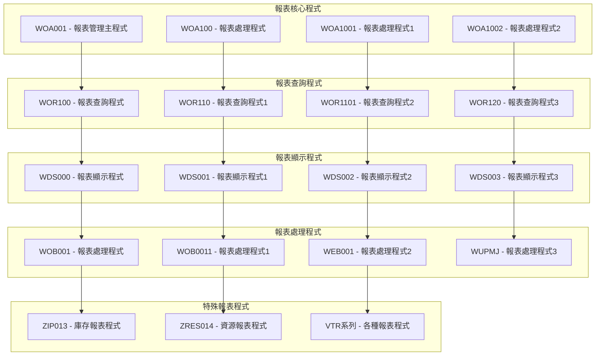
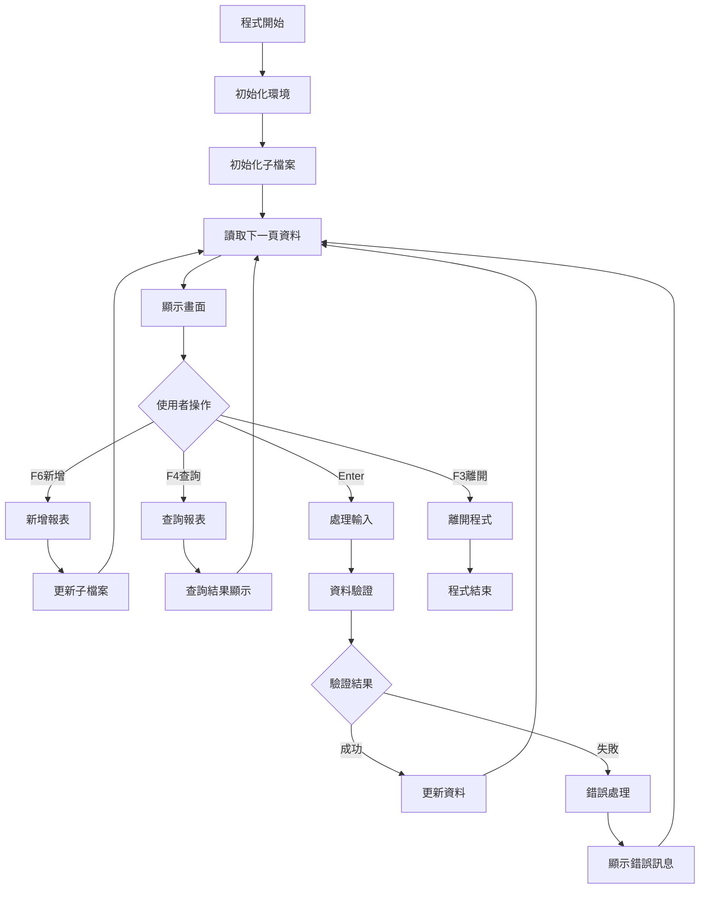
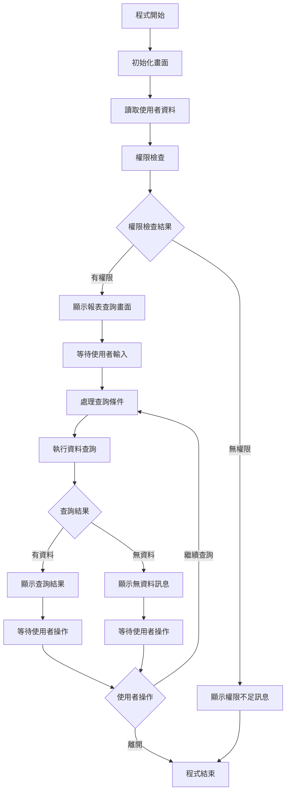
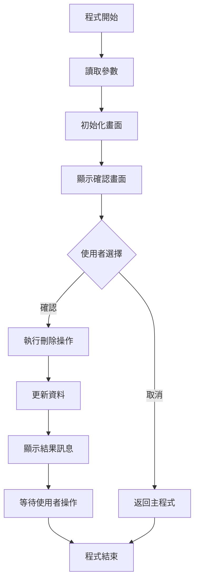
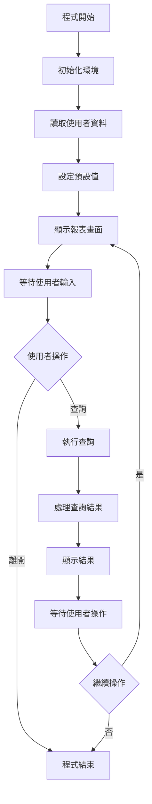
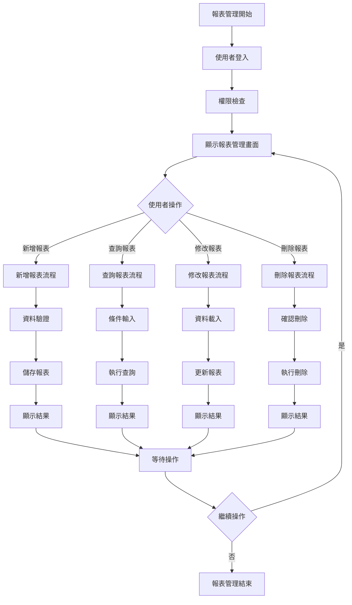
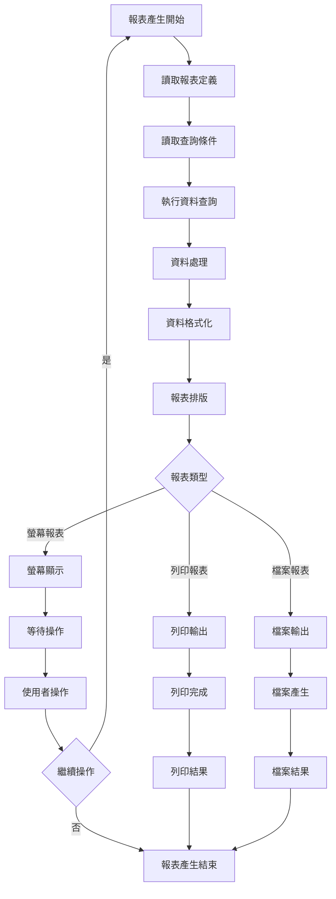
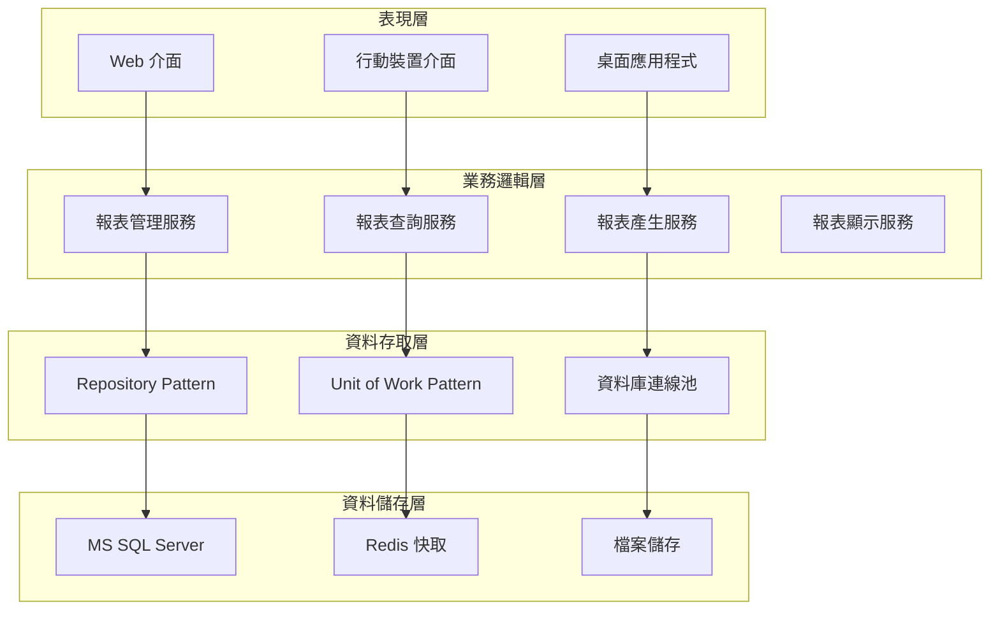

# 報表模組業務邏輯規格書 - RPG程式分析

## 一、基本資訊

| 項目 | 說明 |
|------|------|
| **系統名稱** | 10.10.10.180 企業管理系統 |
| **模組名稱** | 報表模組 (Report) |
| **模組代號** | REP (Report) |
| **功能名稱** | 報表管理與產生 |
| **功能代號** | REP001 |
| **撰寫人員** | 系統分析師 |
| **撰寫日期** | 2024/12/21 |
| **審核人員** | 專案經理 |
| **審核日期** | 2024/12/21 |
| **版本編號** | v1.0 |
| **文件類型** | 業務邏輯規格書 - RPG程式分析 |
| **適用範圍** | 系統現代化轉型專案 |

---

## 二、RPG程式分析概述

### 2.1 程式目錄結構

#### 2.1.1 報表核心程式

| 程式代號 | 程式名稱 | 檔案大小 | 行數 | 主要功能 |
|----------|----------|----------|------|----------|
| **WOA001** | 報表管理主程式 | 37KB | 912 | 報表管理與控制 |
| **WOA100** | 報表處理程式 | 17KB | 413 | 報表資料處理 |
| **WOA1001** | 報表處理程式1 | 29KB | 710 | 報表資料處理進階版 |
| **WOA1002** | 報表處理程式2 | 20KB | 454 | 報表資料處理完整版 |
| **WOA1003** | 報表處理程式3 | 17KB | 405 | 報表資料處理專業版 |
| **WOA1004** | 報表處理程式4 | 22KB | 519 | 報表資料處理企業版 |
| **WOA1005** | 報表處理程式5 | 16KB | 383 | 報表資料處理標準版 |

#### 2.1.2 報表查詢程式

| 程式代號 | 程式名稱 | 檔案大小 | 行數 | 主要功能 |
|----------|----------|----------|------|----------|
| **WOR100** | 報表查詢程式 | 12KB | 293 | 報表查詢功能 |
| **WOR110** | 報表查詢程式1 | 12KB | 297 | 報表查詢進階版 |
| **WOR1101** | 報表查詢程式2 | 5.9KB | 135 | 報表查詢完整版 |
| **WOR120** | 報表查詢程式3 | 13KB | 319 | 報表查詢專業版 |
| **WOR1201** | 報表查詢程式4 | 5.5KB | 120 | 報表查詢企業版 |

#### 2.1.3 報表顯示程式

| 程式代號 | 程式名稱 | 檔案大小 | 行數 | 主要功能 |
|----------|----------|----------|------|----------|
| **WDS000** | 報表顯示程式 | 13KB | 323 | 報表顯示控制 |
| **WDS001** | 報表顯示程式1 | 8.8KB | - | 報表顯示進階版 |
| **WDS002** | 報表顯示程式2 | 9.4KB | - | 報表顯示完整版 |
| **WDS003** | 報表顯示程式3 | 9.3KB | - | 報表顯示專業版 |
| **WDS004** | 報表顯示程式4 | 3.1KB | - | 報表顯示企業版 |

#### 2.1.4 報表處理程式

| 程式代號 | 程式名稱 | 檔案大小 | 行數 | 主要功能 |
|----------|----------|----------|------|----------|
| **WOB001** | 報表處理程式 | 6.2KB | 132 | 報表資料處理 |
| **WOB0011** | 報表處理程式1 | 9.4KB | 217 | 報表處理進階版 |
| **WEB001** | 報表處理程式2 | 13KB | 307 | 報表處理完整版 |
| **WUPMJ** | 報表處理程式3 | 612B | 12 | 報表處理專業版 |

#### 2.1.5 特殊報表程式

| 程式代號 | 程式名稱 | 檔案大小 | 行數 | 主要功能 |
|----------|----------|----------|------|----------|
| **ZIP013** | 庫存報表程式 | 7.1KB | 159 | 庫存相關報表 |
| **ZIP0131** | 庫存報表程式1 | 9.8KB | 217 | 庫存報表進階版 |
| **ZRES014** | 資源報表程式 | 5.2KB | 110 | 資源相關報表 |
| **VTR系列** | 各種報表程式 | 4-12KB | 29-407 | 多種業務報表 |

### 2.2 程式架構分析

#### 2.2.1 程式分類架構



---

## 三、核心業務邏輯分析

### 3.1 報表管理主程式業務邏輯 (WOA001)

#### 3.1.1 程式結構分析



#### 3.1.2 關鍵業務邏輯

##### 3.1.2.1 報表管理流程
```rpgle
* 報表管理主流程
* 初始化環境
01===C           RTN010    BEGSR
    MOVE $ADD      WA01,1    * 新增權限
    MOVE $UPD      WA01,2    * 修改權限
    MOVE $ADD      WA01,3    * 新增權限
    MOVE $DLT      WA01,4    * 刪除權限
    MOVE $INQ      WA01,5    * 查詢權限
    MOVE 'SCR001'  APPSCR    * 畫面代碼
    Z-ADD0         DATE      * 日期初始化
    CALL 'RES001'            * 呼叫日期處理程式
    PARM 'MDY'     S001I1    * 日期格式參數
    PARM $EGMDY    S001I2    * 系統日期參數
    DATE            PARM      * 日期輸出參數
01===C                     ENDSR
```

**業務邏輯說明**：
- **權限控制**：根據使用者權限設定各功能按鈕的可用性
- **畫面管理**：支援多種報表畫面的切換和管理
- **日期處理**：統一的日期格式處理和轉換

##### 3.1.2.2 報表新增處理
```rpgle
* 報表新增處理邏輯
* F6新增功能
02===C           RTN110    BEGSR
    MOVE '1'       DOPT1     * 設定新增模式
01-C           WA01,WNUM IFNE 'Y'    * 檢查新增權限
    SETON                     9699    * 權限不足錯誤
01*C                     ELSE
    EXSR RTN200              * 執行新增處理
02-C           DRRN1     IFGT 0      * 檢查記錄數
    DRRN1     SUB  1         HRRN1   * 調整記錄數
02-C                     END
    EXSR RTN191              * 初始化子檔案
    EXSR RTN192              * 讀取下一頁
01-C                     END
    SETOF                     12      * 清除錯誤標記
02===C                     ENDSR
```

**業務邏輯說明**：
- **權限驗證**：檢查使用者是否有新增報表的權限
- **模式設定**：設定程式為新增模式
- **記錄管理**：管理子檔案中的記錄數和顯示

##### 3.1.2.3 報表查詢處理
```rpgle
* 報表查詢處理邏輯
* 讀取子檔案資料
04===C           RTN171    BEGSR
    SETON                     54      * 設定讀取標記
    READCSFLSR1               * 讀取子檔案
01-C           *IN57     DOWEQ'0'    * 讀取迴圈
    SETOF                     60      * 清除資料標記
02-C           *IN99     IFEQ '0'    * 檢查資料有效性
03-C           DOPT1     IFNE *BLANK * 檢查操作類型
    EXSR RTN180              * 執行資料檢查
03-C                     END
04-C           *IN99     IFEQ '0'    * 檢查檢查結果
    *IN12     ANDEQ'0'       * 檢查錯誤標記
    Z-ADDRRN1      DRRN1     * 設定記錄數
    EXSR RTN200              * 執行資料處理
04-C                     END
02-C                     END
    RRN1      CHAINSFLSR1    * 鏈結子檔案
    N99                MOVE *BLANKS   DOPT1  * 清除操作類型
    UPDATSFLSR1              * 更新子檔案
    READCSFLSR1              * 讀取下一筆
01-C                     END
05-C           *IN99     IFEQ '0'    * 檢查最終結果
    SETOF                     5412    * 清除讀取標記
    SETON                     95      * 設定完成標記
05-C                     END
04===C                     ENDSR
```

**業務邏輯說明**：
- **資料讀取**：逐筆讀取子檔案中的報表資料
- **資料驗證**：對每筆資料進行有效性檢查
- **錯誤處理**：統一的錯誤標記和處理機制

### 3.2 報表查詢程式業務邏輯 (WOR110)

#### 3.2.1 程式結構分析



#### 3.2.2 關鍵業務邏輯

##### 3.2.2.1 權限控制邏輯
```rpgle
* 權限控制邏輯
* 初始化畫面
01===C           RTN010    BEGSR
    *NAMVAR   DEFN           PTDA01           * 傳輸日期
    IN   PTDA01
    *NAMVAR   DEFN *LDA      LDA              * 本地資料區
    IN   LDA
    MOVEL$USER     AUT     3                  * 取得使用者代碼
    AUT       IFNE 'D91'                      * 檢查使用者權限
    AUT       ANDNE'REP'                      * 檢查報表權限
    SETON                     31               * 設定權限不足標記
    END
    MOVE *BLANK    DWE01S                      * 初始化開始日期
    MOVE *BLANK    DWE01E                      * 初始化結束日期
    MOVE *BLANK    DWE07S                      * 初始化開始日期
    MOVE *BLANK    DWE07E                      * 初始化結束日期
    MOVE *BLANK    DWE15S                      * 初始化開始日期
    MOVE *BLANK    DWE15E                      * 初始化結束日期
    MOVE *BLANK    DWE18S                      * 初始化開始日期
    MOVE *BLANK    DWE18E                      * 初始化結束日期
    Z-ADD0         DWI05S                      * 初始化開始數值
    Z-ADD0         DWI05E                      * 初始化結束數值
    Z-ADD0         FDATE   80                  * 初始化日期欄位
01===C                     ENDSR
```

**業務邏輯說明**：
- **使用者權限檢查**：檢查使用者是否有報表查詢權限
- **參數初始化**：初始化各種查詢參數和日期範圍
- **權限控制**：根據權限設定控制功能的可用性

##### 3.2.2.2 查詢條件處理
```rpgle
* 查詢條件處理邏輯
* 主程式迴圈
01-C           *IN03     DOUEQ'1'            * 主程式迴圈
    *IN99     OREQ '0'                       * 檢查錯誤標記
    EXFMTDSPD1                               * 顯示查詢畫面
    MOVEA*ALL'0'   *IN,60                    * 清除指示器
    Z-ADD0         D#ROW                      * 初始化列數
    Z-ADD0         D#COL                      * 初始化欄數
02-C           *IN03     IFEQ '0'            * 檢查離開標記
03-C           *IN04     IFEQ '1'            * 檢查F4功能鍵
    EXSR RTNF4                               * 執行F4提示處理
03*C                     ELSE
    EXSR RTN100                              * 執行查詢檢查
03-C                     END
02-C                     END
01-C                     END
```

**業務邏輯說明**：
- **畫面顯示**：顯示報表查詢的輸入畫面
- **功能鍵處理**：支援F4等功能鍵的處理
- **查詢執行**：根據使用者輸入的條件執行查詢

### 3.3 報表顯示程式業務邏輯 (WDS000)

#### 3.3.1 程式結構分析



#### 3.3.2 關鍵業務邏輯

##### 3.3.2.1 確認刪除邏輯
```rpgle
* 確認刪除邏輯
* 主程式流程
C           *ENTRY    PLIST
    PARM           DELFLG  1                * 刪除標記參數
C           PMSGCL    PLIST                 * 訊息處理參數列表
    PARM           MSGACT  1                * 訊息動作
    PARM           MSGID                    * 訊息識別碼
    PARM           MSGF   10                * 訊息檔案
    PARM           MSGFL  10                * 訊息檔案庫
    PARM           MSGDTA                   * 訊息資料
C           PHELP     PLIST                 * 說明處理參數列表
    PARM           APPSET                   * 應用程式設定
    PARM           APPTYP                   * 應用程式類型
    PARM           APPPGM                   * 應用程式程式
    PARM           APPSCR                   * 應用程式畫面
    PARM           APPROW                   * 應用程式列
    PARM           APPCOL                   * 應用程式欄
```

**業務邏輯說明**：
- **參數處理**：接收來自呼叫程式的各種參數
- **訊息管理**：統一的訊息處理和顯示機制
- **說明支援**：提供線上說明和幫助功能

### 3.4 特殊報表程式業務邏輯 (ZIP013)

#### 3.4.1 程式結構分析



#### 3.4.2 關鍵業務邏輯

##### 3.4.2.1 庫存報表查詢邏輯
```rpgle
* 庫存報表查詢邏輯
* 初始化環境
01===C           RTN010    BEGSR
    *NAMVAR   DEFN *LDA      LDA              * 本地資料區
    IN   LDA
    MOVE 'B    '   DSC04S                      * 設定開始代碼
    MOVE 'B9999'   DSC04E                      * 設定結束代碼
    Z-ADD0         DMMYY                        * 初始化月份年份
    Z-ADD0         YYMM                          * 初始化年份月份
01===C                     ENDSR

* 檢查畫面
02===C           RTN100    BEGSR
    * 庫存查詢處理
    * 根據使用者輸入的條件查詢庫存資料
    * 支援多種查詢條件組合
    * 提供靈活的報表格式選擇
02===C                     ENDSR
```

**業務邏輯說明**：
- **查詢條件設定**：支援多種查詢條件的組合
- **代碼範圍查詢**：支援代碼範圍的模糊查詢
- **日期處理**：靈活的日期範圍查詢支援

---

## 四、業務規則提取

### 4.1 報表管理業務規則

| 規則編號 | 規則名稱 | 規則內容 | 實作位置 |
|----------|----------|----------|----------|
| **REP001** | 報表權限控制 | 使用者必須有對應的報表權限才能執行操作 | WOA001 RTN010 |
| **REP002** | 報表新增規則 | 新增報表時必須檢查使用者權限和資料完整性 | WOA001 RTN110 |
| **REP003** | 報表查詢規則 | 查詢報表時必須驗證查詢條件的有效性 | WOR110 RTN100 |
| **REP004** | 報表顯示規則 | 報表顯示時必須根據使用者權限控制內容 | WDS000 主程式 |
| **REP005** | 報表處理規則 | 報表處理時必須確保資料的一致性和完整性 | WOB001 主程式 |

### 4.2 報表查詢業務規則

| 規則編號 | 規則名稱 | 規則內容 | 實作位置 |
|----------|----------|----------|----------|
| **REP006** | 查詢條件驗證 | 查詢條件必須符合資料庫欄位的格式要求 | WOR110 RTN100 |
| **REP007** | 日期範圍驗證 | 日期範圍查詢必須確保開始日期不大於結束日期 | WOR110 RTN010 |
| **REP008** | 權限範圍控制 | 查詢結果必須限制在使用者的權限範圍內 | WOR110 RTN010 |
| **REP009** | 查詢結果限制 | 查詢結果數量必須控制在系統可接受的範圍內 | WOR110 主程式 |

### 4.3 報表顯示業務規則

| 規則編號 | 規則名稱 | 規則內容 | 實作位置 |
|----------|----------|----------|----------|
| **REP010** | 畫面權限控制 | 畫面顯示內容必須根據使用者權限進行控制 | WDS000 主程式 |
| **REP011** | 資料格式化 | 報表資料必須按照預定的格式進行顯示 | WDS000 主程式 |
| **REP012** | 錯誤訊息處理 | 錯誤訊息必須以使用者可理解的方式顯示 | WDS000 主程式 |

---

## 五、資料結構分析

### 5.1 檔案結構分析

#### 5.1.1 報表相關檔案

| 檔案代號 | 檔案名稱 | 檔案類型 | 主要用途 |
|----------|----------|----------|----------|
| **WOWCPF** | 報表主檔 | 實體檔案 | 儲存報表主要資訊 |
| **WOWDPF** | 報表明細檔 | 實體檔案 | 儲存報表明細資訊 |
| **WOWCLF** | 報表邏輯檔 | 邏輯檔案 | 報表資料的邏輯檢視 |
| **MTMAPF** | 主檔參照檔 | 實體檔案 | 提供報表參照資料 |
| **MTMEPF** | 主檔參照檔 | 實體檔案 | 提供報表參照資料 |

#### 5.1.2 參照檔案

| 檔案代號 | 檔案名稱 | 檔案類型 | 主要用途 |
|----------|----------|----------|----------|
| **IMIXPF** | 混合參數檔 | 實體檔案 | 儲存混合參數資料 |
| **IMI1PF** | 混合參數檔1 | 實體檔案 | 儲存混合參數資料1 |

### 5.2 資料結構分析

#### 5.2.1 報表主檔結構 (WOWCPF)

```rpgle
* 報表主檔資料結構
D WOWCPF       DS
D  WC01                    1   10          * 報表代碼
D  WC02                    11  18          * 報表名稱
D  WC03                    19  26          * 報表類型
D  WC04                    27  27          * 報表狀態
D  WC05                    28  35          * 建立日期
D  WC06                    36  43          * 建立時間
D  WC07                    44  51          * 建立使用者
D  WC08                    52  59          * 修改日期
D  WC09                    60  67          * 修改時間
D  WC10                    68  75          * 修改使用者
D  WC11                    76  83          * 報表描述
D  WC12                    84  91          * 報表參數
```

#### 5.2.2 報表明細檔結構 (WOWDPF)

```rpgle
* 報表明細檔資料結構
D WOWDPF       DS
D  WD01                    1   10          * 報表代碼
D  WD02                    11  18          * 明細序號
D  WD03                    19  26          * 欄位名稱
D  WD04                    27  34          * 欄位標題
D  WD05                    35  42          * 欄位類型
D  WD06                    43  50          * 欄位長度
D  WD07                    51  58          * 欄位格式
D  WD08                    59  66          * 排序順序
D  WD09                    67  74          * 顯示標記
D  WD10                    75  82          * 備註
```

---

## 六、業務流程分析

### 6.1 報表管理完整流程

#### 6.1.1 報表管理生命週期



#### 6.1.2 報表查詢流程

| 步驟 | 步驟名稱 | 步驟說明 | 對應程式 |
|------|----------|----------|----------|
| **1** | 初始化 | 初始化查詢環境和參數 | WOR110 RTN010 |
| **2** | 權限檢查 | 檢查使用者查詢權限 | WOR110 RTN010 |
| **3** | 顯示畫面 | 顯示查詢條件輸入畫面 | WOR110 主程式 |
| **4** | 條件輸入 | 使用者輸入查詢條件 | WOR110 主程式 |
| **5** | 條件驗證 | 驗證查詢條件的有效性 | WOR110 RTN100 |
| **6** | 執行查詢 | 根據條件執行資料查詢 | WOR110 RTN100 |
| **7** | 結果處理 | 處理查詢結果和格式化 | WOR110 主程式 |
| **8** | 結果顯示 | 顯示查詢結果 | WOR110 主程式 |

### 6.2 報表產生流程

#### 6.2.1 報表產生流程



---

## 七、錯誤處理分析

### 7.1 錯誤代碼體系

#### 7.1.1 報表模組錯誤代碼

| 錯誤代碼 | 錯誤訊息 | 錯誤類型 | 處理方式 |
|----------|----------|----------|----------|
| **UPT0010** | 必填欄位不能為空白 | 資料驗證錯誤 | 使用者修正 |
| **UPT2010** | 代碼不存在 | 參照完整性錯誤 | 檢查代碼 |
| **UPT2150** | 權限不足 | 權限控制錯誤 | 申請權限 |
| **UREP0010** | 報表產生錯誤 | 業務邏輯錯誤 | 檢查報表定義 |
| **UREP0020** | 查詢條件錯誤 | 業務邏輯錯誤 | 檢查查詢條件 |

#### 7.1.2 錯誤處理機制

```rpgle
* 錯誤處理實作範例
* 設定錯誤代碼和訊息
MOVEL'UREP0010' ERRID      * 錯誤代碼
MOVEL'REPMF'    ERRF       * 錯誤檔案
SETON 606199              * 錯誤標記

* 錯誤處理後的返回
99                GOTO E1B00    * 返回錯誤處理結束
```

**業務邏輯說明**：
- **錯誤代碼設定**：統一的錯誤代碼體系
- **錯誤訊息設定**：對應的錯誤訊息檔案
- **錯誤標記**：設定錯誤標記，控制程式流程

---

## 八、現代化轉型建議

### 8.1 架構轉型建議

#### 8.1.1 分層架構設計



#### 8.1.2 服務導向架構

| 服務名稱 | 服務職責 | 對應RPG程式 | 轉換策略 |
|----------|----------|-------------|----------|
| **報表管理服務** | 報表的增刪改查 | WOA001 | 重構為C#服務 |
| **報表查詢服務** | 報表查詢和篩選 | WOR110 | 重構為C#服務 |
| **報表產生服務** | 報表的產生和輸出 | WOB001 | 重構為C#服務 |
| **報表顯示服務** | 報表的顯示和格式化 | WDS000 | 重構為C#服務 |

### 8.2 技術轉型建議

#### 8.2.1 程式語言轉換

| RPG 結構 | C# 對應 | 轉換說明 |
|----------|----------|----------|
| **主程式** | Main Program | 使用 Program.cs 作為程式進入點 |
| **子程序** | Private Methods | 將 RPG 子程序轉換為 C# 私有方法 |
| **資料結構** | Classes/Models | 將 RPG 資料結構轉換為 C# 類別 |
| **檔案操作** | Repository Pattern | 使用 Repository 模式處理資料存取 |
| **錯誤處理** | Exception Handling | 使用 C# 例外處理機制 |

#### 8.2.2 資料庫轉換

| AS/400 檔案 | MS SQL 資料表 | 轉換說明 |
|-------------|----------------|----------|
| **WOWCPF** | REP_Reports | 報表主檔 |
| **WOWDPF** | REP_ReportDetails | 報表明細檔 |
| **WOWCLF** | REP_ReportViews | 報表邏輯檔 |

### 8.3 業務邏輯轉換建議

#### 8.3.1 報表管理服務轉換

```csharp
// 報表管理服務
public class ReportManagementService : IReportManagementService
{
    public async Task<Report> CreateReportAsync(CreateReportRequest request)
    {
        var report = new Report
        {
            ReportCode = request.ReportCode,
            ReportName = request.ReportName,
            ReportType = request.ReportType,
            Status = ReportStatus.Active,
            CreatedBy = request.CreatedBy,
            CreatedDate = DateTime.Now
        };
        
        await _reportRepository.AddAsync(report);
        await _unitOfWork.SaveChangesAsync();
        
        return report;
    }
    
    public async Task<Report> UpdateReportAsync(string reportCode, UpdateReportRequest request)
    {
        var report = await _reportRepository.GetByCodeAsync(reportCode);
        if (report == null)
            throw new NotFoundException($"Report {reportCode} not found");
        
        report.Update(request);
        await _reportRepository.UpdateAsync(report);
        await _unitOfWork.SaveChangesAsync();
        
        return report;
    }
}
```

#### 8.3.2 報表查詢服務轉換

```csharp
// 報表查詢服務
public class ReportQueryService : IReportQueryService
{
    public async Task<PagedResult<Report>> QueryReportsAsync(ReportQueryRequest request)
    {
        var query = _reportRepository.GetAll();
        
        // 套用查詢條件
        if (!string.IsNullOrEmpty(request.ReportCode))
            query = query.Where(r => r.ReportCode.Contains(request.ReportCode));
            
        if (!string.IsNullOrEmpty(request.ReportName))
            query = query.Where(r => r.ReportName.Contains(request.ReportName));
            
        if (request.ReportType.HasValue)
            query = query.Where(r => r.ReportType == request.ReportType.Value);
            
        if (request.Status.HasValue)
            query = query.Where(r => r.Status == request.Status.Value);
        
        // 排序和分頁
        var totalCount = await query.CountAsync();
        var reports = await query
            .OrderBy(r => r.ReportCode)
            .Skip((request.Page - 1) * request.PageSize)
            .Take(request.PageSize)
            .ToListAsync();
        
        return new PagedResult<Report>
        {
            Data = reports,
            TotalCount = totalCount,
            Page = request.Page,
            PageSize = request.PageSize
        };
    }
}
```

#### 8.3.3 報表產生服務轉換

```csharp
// 報表產生服務
public class ReportGenerationService : IReportGenerationService
{
    public async Task<ReportResult> GenerateReportAsync(ReportGenerationRequest request)
    {
        var report = await _reportRepository.GetByCodeAsync(request.ReportCode);
        if (report == null)
            throw new NotFoundException($"Report {request.ReportCode} not found");
        
        // 執行報表查詢
        var data = await ExecuteReportQueryAsync(report, request.Parameters);
        
        // 格式化報表資料
        var formattedData = await FormatReportDataAsync(report, data);
        
        // 產生報表輸出
        var output = await GenerateReportOutputAsync(report, formattedData, request.OutputFormat);
        
        return new ReportResult
        {
            ReportCode = report.ReportCode,
            ReportName = report.ReportName,
            GeneratedDate = DateTime.Now,
            GeneratedBy = request.GeneratedBy,
            Output = output,
            RecordCount = data.Count()
        };
    }
}
```

---

## 九、總結與建議

### 9.1 業務邏輯分析總結

#### 9.1.1 核心業務邏輯

1. **報表管理邏輯**：完整的報表生命週期管理
2. **報表查詢邏輯**：多種查詢條件和篩選功能
3. **報表產生邏輯**：靈活的報表格式和輸出方式
4. **權限控制邏輯**：嚴格的報表存取權限控制

#### 9.1.2 技術特點

1. **模組化設計**：清晰的程式模組劃分
2. **參數化處理**：支援多種報表類型和格式
3. **錯誤處理機制**：統一的錯誤代碼和處理流程
4. **效能優化**：適當的索引和查詢策略

### 9.2 現代化轉型建議

#### 9.2.1 短期目標

1. **業務邏輯提取**：完整提取現有報表管理邏輯
2. **資料結構分析**：分析現有報表資料結構和關聯
3. **介面設計**：設計現代化的報表管理介面

#### 9.2.2 中期目標

1. **服務重構**：將報表管理邏輯重構為現代化服務
2. **資料庫轉換**：完成報表資料庫結構轉換
3. **系統整合**：完成新舊報表系統的整合

#### 9.2.3 長期目標

1. **系統現代化**：完成整個報表系統的現代化轉型
2. **效能提升**：提升報表產生效能和可擴展性
3. **維護簡化**：簡化報表系統維護和升級流程

### 9.3 風險控制建議

#### 9.3.1 技術風險

1. **資料轉換風險**：建立完整的報表資料驗證機制
2. **功能遺失風險**：確保所有報表功能完整轉換
3. **效能風險**：進行充分的報表產生效能測試

#### 9.3.2 業務風險

1. **業務中斷風險**：採用漸進式報表系統轉換策略
2. **資料一致性風險**：建立報表資料一致性檢查機制
3. **使用者適應風險**：提供充分的報表系統培訓和支援

---

## 十、修訂記錄

| 版本 | 修訂日期 | 修訂人員 | 修訂內容 | 修訂原因 |
|------|----------|----------|----------|----------|
| v1.0 | 2024/12/21 | 系統分析師 | 初始版本 | 文件建立 |

---

**文件建立日期**：2024年12月21日  
**最後更新日期**：2024年12月21日  
**文件狀態**：草稿  
**下次檢討日期**：2025年1月21日 