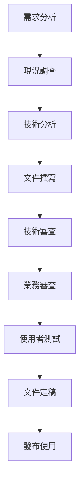
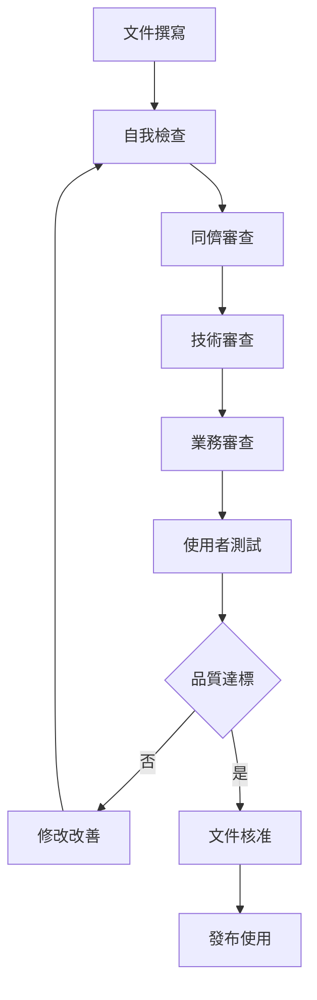

# 專案守則

## 一、專案基本資訊

| 項目 | 說明 |
|------|------|
| **專案名稱** | 10.10.180 企業管理系統文件建立專案 |
| **專案目標** | 建立完整、準確、詳細的系統文件體系 |
| **專案範圍** | 總帳、銷貨、採購、產品、報表等五大模組 |
| **專案期間** | 2024年12月 - 2025年2月 |
| **專案負責人** | 專案經理 |
| **文件負責人** | 系統分析師 |

---

## 二、核心守則

### 2.1 真實性原則
- **絕對真實**：所有文件內容必須基於實際系統的真實資訊
- **無推估內容**：禁止任何推測、假設或虛構的內容
- **實證基礎**：所有技術規格必須有實際程式碼或系統配置作為依據
- **事實查證**：每個技術細節都必須經過實際驗證

### 2.2 完整性原則
- **全面涵蓋**：涵蓋系統的所有功能模組和技術細節
- **深度說明**：提供足夠詳細的技術實現說明
- **實用導向**：確保文件能實際支援開發和維護工作
- **持續更新**：根據系統變更持續更新文件內容

### 2.3 準確性原則
- **技術準確**：所有技術規格必須準確無誤
- **版本一致**：文件版本必須與實際系統版本保持一致
- **資料精確**：所有資料庫結構、欄位定義必須精確
- **流程正確**：所有業務流程和技術流程必須正確

---

## 三、技術文件要求

### 3.1 資料庫文件要求
- **完整結構**：包含所有資料表、欄位、索引、約束的完整定義
- **存取方式**：詳細說明欄位的存取方式、權限控制
- **關聯關係**：清楚描述資料表間的關聯關係和完整性約束
- **效能考量**：提供索引策略、查詢優化建議

### 3.2 程式規格要求
- **實作細節**：詳細說明程式的實作邏輯和演算法
- **介面定義**：完整定義所有 API 介面和參數
- **錯誤處理**：詳細說明錯誤處理機制和異常情況
- **效能指標**：提供具體的效能指標和測試結果

### 3.3 操作手冊要求
- **操作步驟**：提供詳細、準確的操作步驟說明
- **畫面說明**：包含完整的畫面截圖和欄位說明
- **常見問題**：基於實際使用經驗提供問題解決方案
- **最佳實踐**：提供經過驗證的操作技巧和建議

---

## 四、品質控制標準

### 4.1 內容審查標準
- **技術審查**：由資深技術人員進行技術內容審查
- **業務審查**：由業務專家進行業務邏輯審查
- **使用者審查**：由實際使用者進行實用性審查
- **一致性檢查**：確保各文件間的一致性

### 4.2 驗證要求
- **實作驗證**：所有技術規格必須經過實際實作驗證
- **測試驗證**：所有功能說明必須經過實際測試驗證
- **使用者驗證**：所有操作說明必須經過實際使用者驗證
- **效能驗證**：所有效能指標必須經過實際測試驗證

### 4.3 更新機制
- **變更追蹤**：追蹤所有系統變更對文件的影響
- **版本控制**：建立完整的文件版本控制機制
- **變更通知**：及時通知相關人員文件變更
- **定期檢討**：定期檢討文件品質和完整性

---

## 五、專案執行流程

### 5.1 文件建立流程

### 5.2 品質控制流程

---

## 六、文件標準

### 6.1 格式標準
- **統一格式**：使用統一的文件格式和樣式
- **結構一致**：保持各文件間結構的一致性
- **圖表標準**：使用標準化的圖表格式和符號
- **命名規範**：遵循統一的命名規範

### 6.2 內容標準
- **詳細程度**：提供足夠詳細的技術說明
- **實用性**：確保內容對實際工作有幫助
- **可讀性**：使用清晰、易懂的語言表達
- **完整性**：涵蓋所有必要的技術細節

### 6.3 維護標準
- **即時更新**：系統變更時即時更新文件
- **版本管理**：建立完整的版本管理機制
- **變更記錄**：記錄所有文件變更的歷史
- **品質監控**：持續監控文件品質

---

## 七、專案里程碑

### 7.1 第一階段：總帳模組 (2024年12月)
- [x] 建立文件範本
- [x] 建立總帳模組程式功能規格書
- [x] 建立總帳模組操作手冊
- [x] 建立總帳模組技術文件
- [ ] 文件審查和修正
- [ ] 使用者測試和驗證

### 7.2 第二階段：銷貨模組 (2025年1月)
- [ ] 建立銷貨模組程式功能規格書
- [ ] 建立銷貨模組操作手冊
- [ ] 建立銷貨模組技術文件
- [ ] 文件審查和修正
- [ ] 使用者測試和驗證

### 7.3 第三階段：採購模組 (2025年1月)
- [ ] 建立採購模組程式功能規格書
- [ ] 建立採購模組操作手冊
- [ ] 建立採購模組技術文件
- [ ] 文件審查和修正
- [ ] 使用者測試和驗證

### 7.4 第四階段：產品模組 (2025年2月)
- [ ] 建立產品模組程式功能規格書
- [ ] 建立產品模組操作手冊
- [ ] 建立產品模組技術文件
- [ ] 文件審查和修正
- [ ] 使用者測試和驗證

### 7.5 第五階段：整合與完成 (2025年2月)
- [ ] 建立系統整合文件
- [ ] 建立使用者指南
- [ ] 建立維護手冊
- [ ] 最終文件審查
- [ ] 專案完成報告

---

## 八、專案團隊

### 8.1 核心團隊
| 角色 | 姓名 | 職責 | 聯絡方式 |
|------|------|------|----------|
| 專案經理 | [姓名] | 專案統籌、進度控制 | [聯絡方式] |
| 系統分析師 | [姓名] | 技術分析、文件撰寫 | [聯絡方式] |
| 技術專家 | [姓名] | 技術審查、品質控制 | [聯絡方式] |
| 業務專家 | [姓名] | 業務審查、需求確認 | [聯絡方式] |

### 8.2 支援團隊
| 角色 | 姓名 | 職責 | 聯絡方式 |
|------|------|------|----------|
| 資料庫專家 | [姓名] | 資料庫設計審查 | [聯絡方式] |
| 使用者代表 | [姓名] | 使用者需求確認 | [聯絡方式] |
| 品質保證 | [姓名] | 品質控制、測試 | [聯絡方式] |

---

## 九、風險管理

### 9.1 主要風險
- **技術風險**：系統複雜度高，技術細節難以完全掌握
- **時間風險**：專案時程緊湊，可能影響文件品質
- **人員風險**：關鍵人員異動可能影響專案進度
- **需求風險**：需求變更可能影響文件穩定性

### 9.2 風險對策
- **技術風險**：加強技術培訓，建立專家諮詢機制
- **時間風險**：合理安排時程，建立緩衝時間
- **人員風險**：建立知識轉移機制，避免單點依賴
- **需求風險**：建立需求變更控制機制

---

## 十、專案成功標準

### 10.1 品質標準
- **技術準確性**：100% 的技術規格準確無誤
- **內容完整性**：涵蓋系統 100% 的功能和技術細節
- **實用性**：90% 以上的使用者認為文件實用
- **一致性**：各文件間 100% 的一致性

### 10.2 時程標準
- **準時完成**：按照專案時程準時完成各階段
- **品質達標**：在時程內達到品質標準
- **使用者滿意**：獲得使用者的高度滿意

---

## 十一、專案守則承諾

### 11.1 團隊承諾
我們承諾：
- 嚴格遵守真實性原則，絕不包含任何推估或虛構內容
- 提供最詳細、最準確的技術說明
- 確保所有內容都經過實際驗證
- 持續改善文件品質和實用性

### 11.2 品質承諾
我們承諾：
- 建立最高品質的技術文件
- 提供最實用的操作指南
- 確保文件的準確性和完整性
- 持續更新和維護文件內容

---

**專案守則建立日期**：2024年12月19日  
**專案經理簽署**：[簽名]  
**專案團隊確認**：[全體簽名] 