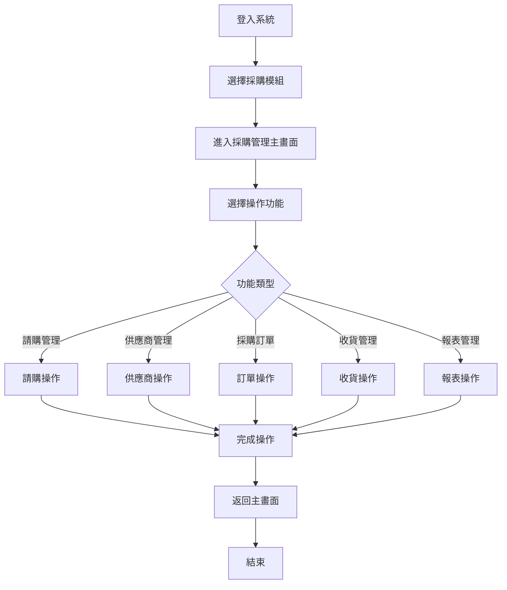
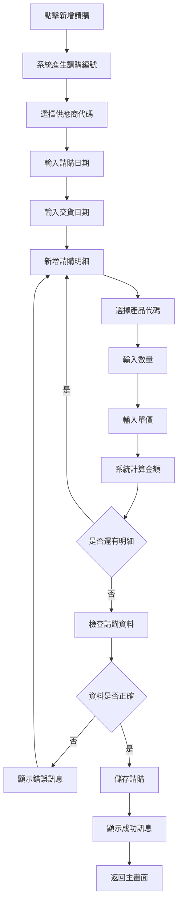
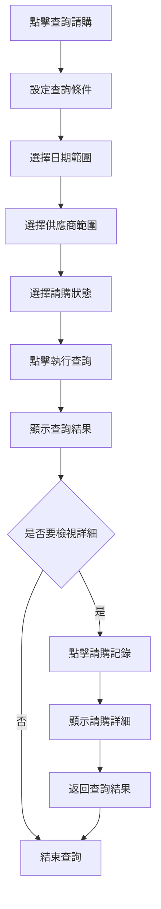
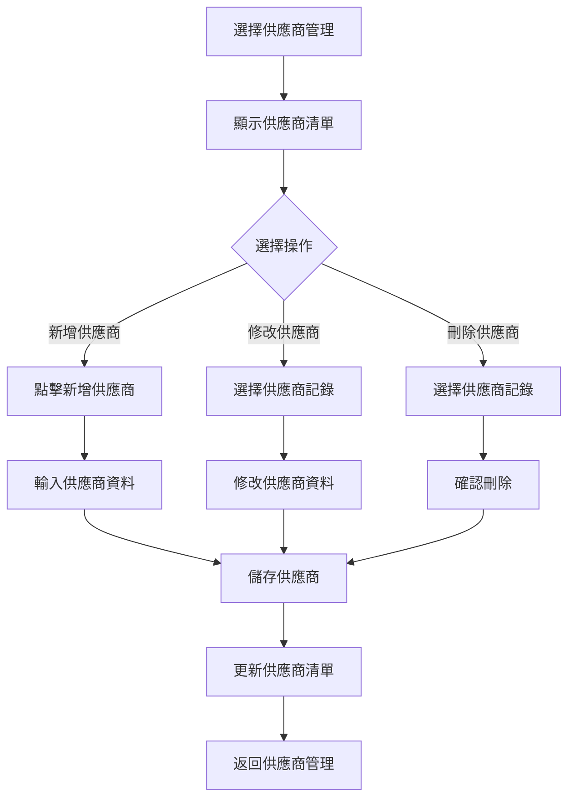
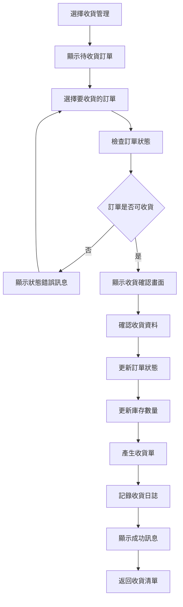

# 採購模組操作手冊

## 一、基本資訊

| 項目 | 說明 |
|------|------|
| **系統名稱** | 10.10.10.180 企業管理系統 |
| **模組名稱** | 採購模組 |
| **模組代號** | PC (Purchase) |
| **功能名稱** | 採購管理 |
| **功能代號** | PC001 |
| **撰寫人員** | 系統分析師 |
| **撰寫日期** | 2024/12/20 |
| **審核人員** | 專案經理 |
| **審核日期** | 2024/12/20 |
| **版本編號** | v1.0 |
| **適用對象** | 採購人員、倉管人員、財務人員、系統使用者 |

---

## 二、功能概述

### 2.1 功能目的
採購模組是企業採購管理的核心，主要用於管理供應商資料、處理請購需求、管理採購訂單、處理收貨流程、產生採購報表，確保採購業務的順利進行，為企業成本控制提供完整的資料基礎。

### 2.2 功能範圍
- **主要功能**：請購管理、供應商管理、採購訂單、收貨管理、報表管理
- **輔助功能**：資料查詢、資料匯出、資料備份、系統監控
- **限制功能**：已收貨訂單不能修改、已取消訂單不能恢復

### 2.3 使用時機
- **日常使用**：每日請購處理、供應商資料維護、收貨處理
- **特殊情況**：月底結帳、年度結帳、採購報表產生
- **不適用情況**：系統維護期間、資料庫備份期間

---

## 三、操作流程

### 3.1 整體操作流程圖



### 3.2 請購管理操作流程

#### 3.2.1 新增請購流程


#### 3.2.2 查詢請購流程


### 3.3 供應商管理操作流程



### 3.4 收貨管理操作流程



---

## 四、畫面說明

### 4.1 採購管理主畫面

#### 4.1.1 主畫面配置圖
```
┌─────────────────────────────────────────────────────────────┐
│                    採購管理系統 - 主畫面                      │
├─────────────────────────────────────────────────────────────┤
│ 功能選單區域                                                │
│ ┌─────────────────────────────────────────────────────────┐ │
│ │ [採購管理] [請購管理] [供應商管理] [採購訂單] [收貨管理] │ │
│ └─────────────────────────────────────────────────────────┘ │
├─────────────────────────────────────────────────────────────┤
│ 查詢條件區域                                                │
│ ┌─────────────────────────────────────────────────────────┐ │
│ │ 日期範圍: [2024/01/01] 至 [2024/12/31]                │ │
│ │ 供應商範圍: [全部供應商 ▼]  訂單狀態: [全部狀態 ▼]      │ │
│ └─────────────────────────────────────────────────────────┘ │
├─────────────────────────────────────────────────────────────┤
│ 功能按鈕區域                                                │
│ [新增請購] [查詢訂單] [供應商維護] [收貨處理] [報表產生]  │ │
├─────────────────────────────────────────────────────────────┤
│ 請購資料顯示區域                                            │
│ ┌─────────────────────────────────────────────────────────┐ │
│ │ 請購編號 │ 供應商名稱 │ 請購日期 │ 請購金額 │ 狀態 │ 交貨日期 │
│ ├─────────────────────────────────────────────────────────┤ │
│ │ PC001    │ 供應商A   │ 2024/12/20│ 50,000   │ 確認 │ 2024/12/25│
│ │ PC002    │ 供應商B   │ 2024/12/20│ 75,000   │ 草稿 │ 2024/12/26│
│ └─────────────────────────────────────────────────────────┘ │
└─────────────────────────────────────────────────────────────┘
```

#### 4.1.2 區域說明
| 區域名稱 | 位置 | 功能說明 | 操作方式 |
|----------|------|----------|----------|
| **功能選單區域** | 畫面頂部 | 選擇主要功能模組 | 點擊對應功能選單 |
| **查詢條件區域** | 畫面上部 | 設定查詢條件 | 選擇或輸入查詢條件 |
| **功能按鈕區域** | 畫面中部 | 執行各種功能 | 點擊對應功能按鈕 |
| **資料顯示區域** | 畫面底部 | 顯示查詢結果 | 點擊記錄檢視詳細 |

### 4.2 請購輸入畫面

#### 4.2.1 請購輸入配置圖
```
┌─────────────────────────────────────────────────────────────┐
│                    請購輸入 - 新增請購                      │
├─────────────────────────────────────────────────────────────┤
│ 請購標頭區域                                                │
│ ┌─────────────────────────────────────────────────────────┐ │
│ │ 請購編號: [PC001        ] (系統自動產生)                │ │
│ │ 供應商代碼: [S001 ▼]    供應商名稱: [供應商A            ] │ │
│ │ 請購日期: [2024/12/20 ▼]                               │ │
│ │ 交貨日期: [2024/12/25 ▼]                               │ │
│ └─────────────────────────────────────────────────────────┘ │
├─────────────────────────────────────────────────────────────┤
│ 請購明細區域                                                │
│ ┌─────────────────────────────────────────────────────────┐ │
│ │ 序號 │ 產品代碼 │ 產品名稱 │ 數量 │ 單價 │ 金額 │ 備註 │
│ ├─────────────────────────────────────────────────────────┤ │
│ │  1   │ [P001 ▼] │ [產品A  ] │ [100] │ [500] │ [50,000] │ [    ] │
│ │  2   │ [P002 ▼] │ [產品B  ] │ [ 50] │ [500] │ [25,000] │ [    ] │
│ └─────────────────────────────────────────────────────────┘ │
├─────────────────────────────────────────────────────────────┤
│ 請購總計: 75,000                                           │
│ 功能按鈕區域                                                │
│ [新增明細] [儲存請購] [取消]                              │
└─────────────────────────────────────────────────────────────┘
```

---

## 五、功能鍵說明

### 5.1 功能鍵清單
| 功能鍵 | 功能名稱 | 使用時機 | 操作說明 |
|--------|----------|----------|----------|
| **F1** | 線上說明 | 需要協助時 | 顯示線上說明文件 |
| **F2** | 查詢 | 要執行查詢時 | 執行查詢作業 |
| **F3** | 新增 | 要新增資料時 | 進入新增畫面 |
| **F4** | 修改 | 要修改資料時 | 進入修改畫面 |
| **F5** | 刪除 | 要刪除資料時 | 執行刪除作業 |
| **F6** | 儲存 | 要儲存資料時 | 儲存輸入的資料 |
| **F7** | 取消 | 要取消操作時 | 取消當前操作 |
| **F8** | 列印 | 要列印資料時 | 執行列印作業 |
| **F9** | 匯出 | 要匯出資料時 | 執行資料匯出 |
| **F10** | 離開 | 要離開功能時 | 離開當前功能 |

### 5.2 常用功能鍵操作

#### 5.2.1 新增請購 (F3)
- **使用時機**：需要新增採購請購時
- **操作步驟**：
  1. 按 F3 鍵或點擊 [新增請購] 按鈕
  2. 系統顯示請購輸入畫面
  3. 輸入請購標頭資料
  4. 輸入請購明細資料
  5. 按 F6 儲存請購

#### 5.2.2 查詢請購 (F2)
- **使用時機**：需要查詢請購資料時
- **操作步驟**：
  1. 設定查詢條件
  2. 按 F2 鍵或點擊 [查詢請購] 按鈕
  3. 系統執行查詢並顯示結果

---

## 六、常見問題與解答

### 6.1 請購相關問題

#### 6.1.1 供應商代碼不存在
**問題描述**：輸入供應商代碼時顯示供應商不存在錯誤

**可能原因**：
- 供應商代碼輸入錯誤
- 供應商尚未建立
- 供應商已停用

**解決方案**：
1. 檢查供應商代碼是否正確
2. 使用供應商查詢功能確認供應商存在
3. 聯絡管理員新增供應商或啟用停用供應商

#### 6.1.2 請購數量不合理
**問題描述**：儲存請購時顯示數量不合理錯誤

**可能原因**：
- 請購數量超過合理需求範圍
- 庫存需求計算錯誤
- 需求預測資料不準確

**解決方案**：
1. 檢查實際需求數量
2. 調整請購數量至合理範圍
3. 聯絡倉管人員確認庫存需求

### 6.2 系統相關問題

#### 6.2.1 無法進入請購功能
**問題描述**：點擊請購管理後無法進入功能畫面

**可能原因**：
- 使用者權限不足
- 系統連線異常
- 功能暫時停用

**解決方案**：
1. 檢查使用者權限設定
2. 重新登入系統
3. 聯絡系統管理員

---

## 七、錯誤處理

### 7.1 錯誤訊息說明

#### 7.1.1 業務錯誤訊息
| 錯誤代碼 | 錯誤訊息 | 錯誤原因 | 解決方案 |
|----------|----------|----------|----------|
| PC101 | 供應商代碼不存在，請檢查供應商代碼 | 輸入的供應商代碼在系統中不存在 | 查詢正確的供應商代碼，或聯絡管理員新增供應商 |
| PC102 | 供應商已停用，無法建立請購 | 選擇的供應商狀態為停用 | 選擇其他有效供應商，或聯絡管理員啟用供應商 |

#### 7.1.2 使用者錯誤訊息
| 錯誤代碼 | 錯誤訊息 | 錯誤原因 | 解決方案 |
|----------|----------|----------|----------|
| PC201 | 請購日期格式錯誤，請使用YYYYMMDD格式 | 日期輸入格式不正確 | 使用正確的日期格式，如：20241220 |
| PC202 | 交貨日期不能早於請購日期 | 交貨日期設定錯誤 | 設定正確的交貨日期，不能早於請購日期 |

### 7.2 錯誤處理步驟

#### 7.2.1 一般錯誤處理流程
1. **記錄錯誤訊息**：記下錯誤代碼和錯誤訊息
2. **嘗試基本解決方案**：根據錯誤訊息嘗試解決
3. **尋求協助**：如無法解決，聯絡系統管理員

---

## 八、使用技巧

### 8.1 操作效率提升

#### 8.1.1 快速輸入技巧
- **使用供應商代碼**：直接輸入供應商代碼比選擇供應商名稱快
- **複製請購**：相似請購可使用複製功能
- **使用範本**：建立常用請購範本

#### 8.1.2 查詢技巧
- **組合查詢條件**：使用多個條件組合查詢
- **儲存查詢條件**：將常用查詢條件儲存起來
- **使用進階查詢**：利用進階查詢功能進行複雜查詢

### 8.2 資料庫操作技巧

#### 8.2.1 資料庫查詢優化
```sql
-- 基本查詢（推薦使用）
SELECT AH02, AH03, AH04, AH06, AH05, AH08
FROM PCAHPF
WHERE AH04 BETWEEN '20240101' AND '20241231'
  AND AH15 = 'A'
ORDER BY AH04 DESC, AH02;

-- 使用索引的查詢（效能最佳）
SELECT /*+ INDEX(PCAHPF PCH002) */
    AH02, AH03, AH04, AH06, AH05, AH08
FROM PCAHPF
WHERE AH03 = 'S001' 
  AND AH04 = '20241220'
  AND AH15 = 'A';

-- 統計查詢（用於報表）
SELECT 
    AH03 AS SUPPLIER_CODE,
    COUNT(*) AS REQUEST_COUNT,
    SUM(AH06) AS TOTAL_AMOUNT
FROM PCAHPF
WHERE AH04 BETWEEN '20240101' AND '20241231'
  AND AH15 = 'A'
GROUP BY AH03
HAVING COUNT(*) > 0
ORDER BY TOTAL_AMOUNT DESC;
```

#### 8.2.2 資料庫維護操作
```sql
-- 檢查請購資料完整性
SELECT 
    AH05 AS REQUEST_STATUS,
    COUNT(*) AS REQUEST_COUNT,
    SUM(AH06) AS TOTAL_AMOUNT
FROM PCAHPF
WHERE AH15 = 'A'
GROUP BY AH05
ORDER BY AH05;

-- 檢查供應商請購統計
SELECT 
    AH03 AS SUPPLIER_CODE,
    COUNT(*) AS REQUEST_COUNT,
    SUM(AH06) AS TOTAL_AMOUNT,
    MAX(AH04) AS LAST_REQUEST_DATE
FROM PCAHPF
WHERE AH15 = 'A'
GROUP BY AH03
HAVING COUNT(*) > 0
ORDER BY TOTAL_AMOUNT DESC;

-- 清理無效資料
DELETE FROM PCWF01 
WHERE WF0103 = 'E' 
  AND WF0106 < CURRENT_DATE - 30;
```

#### 8.2.3 資料庫效能監控
```sql
-- 監控請購查詢效能
SELECT 
    SUBSTR(EXECUTION_TIME, 1, 10) AS EXEC_DATE,
    COUNT(*) AS QUERY_COUNT,
    AVG(ELAPSED_TIME) AS AVG_ELAPSED_TIME,
    MAX(ELAPSED_TIME) AS MAX_ELAPSED_TIME
FROM PC_QUERY_LOG
WHERE EXECUTION_TIME >= CURRENT_DATE - 7
GROUP BY SUBSTR(EXECUTION_TIME, 1, 10)
ORDER BY EXEC_DATE DESC;

-- 監控資料表大小
SELECT 
    TABLE_NAME,
    TABLE_SCHEMA,
    ROUND(TABLE_SIZE/1024/1024, 2) AS SIZE_MB,
    ROW_COUNT
FROM PC_TABLE_STATS
WHERE TABLE_SCHEMA = 'PCDATA'
ORDER BY TABLE_SIZE DESC;
```

### 8.3 進階操作技巧

#### 8.3.1 批次處理操作
```sql
-- 批次更新請購狀態
UPDATE PCAHPF 
SET AH05 = '3', 
    AH13 = 'BATCH_USER', 
    AH14 = CURRENT_TIMESTAMP
WHERE AH05 = '2' 
  AND AH08 <= CURRENT_DATE
  AND AH15 = 'A';

-- 批次產生請購編號
INSERT INTO PCWF01 (WF0101, WF0102, WF0103, WF0106)
SELECT 
    'WF' || RIGHT('0000000000' || ROW_NUMBER() OVER(), 10),
    'PC' || RIGHT('000000000000' || ROW_NUMBER() OVER(), 12),
    'P',
    CURRENT_TIMESTAMP
FROM SYSIBM.SYSDUMMY1
CONNECT BY LEVEL <= 1000;
```

#### 8.3.2 資料匯出操作
```sql
-- 匯出請購資料到CSV格式
SELECT 
    AH02 || ',' ||
    AH03 || ',' ||
    AH04 || ',' ||
    AH06 || ',' ||
    AH05 || ',' ||
    AH08 || ',' ||
    AH11 || ',' ||
    AH12
FROM PCAHPF
WHERE AH15 = 'A'
ORDER BY AH04, AH02;

-- 匯出供應商請購統計
SELECT 
    AC01 || ',' ||
    AC02 || ',' ||
    AC03 || ',' ||
    AC07 || ',' ||
    AC08
FROM PCACPF
WHERE AC10 = 'A'
ORDER BY AC01;
```

---

## 九、相關功能

### 9.1 相關功能清單
| 功能名稱 | 功能代號 | 關聯性 | 說明 |
|----------|----------|--------|------|
| 總帳模組 | GL | 後置 | 採購請購會產生應付帳款 |
| 產品模組 | PT | 前置 | 需要產品資料和庫存資訊 |
| 銷貨模組 | NP | 相關 | 影響庫存數量 |

---

## 十、聯絡資訊

### 10.1 技術支援聯絡方式
| 支援類型 | 聯絡方式 | 聯絡時間 | 回應時間 |
|----------|----------|----------|----------|
| **一般問題** | 系統管理員 | 上班時間 | 2小時內 |
| **技術問題** | 技術支援 | 上班時間 | 4小時內 |
| **緊急問題** | 專案經理 | 24小時 | 立即回應 |

---

**文件建立日期**：2024年12月20日  
**最後更新日期**：2024年12月20日  
**文件狀態**：草稿  
**下次檢討日期**：2025年1月20日 