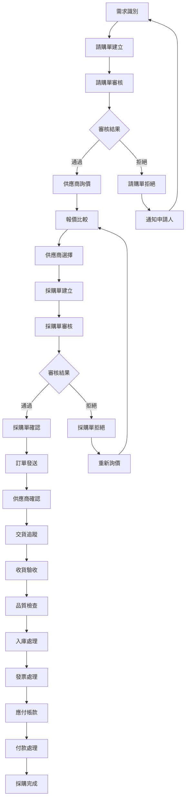
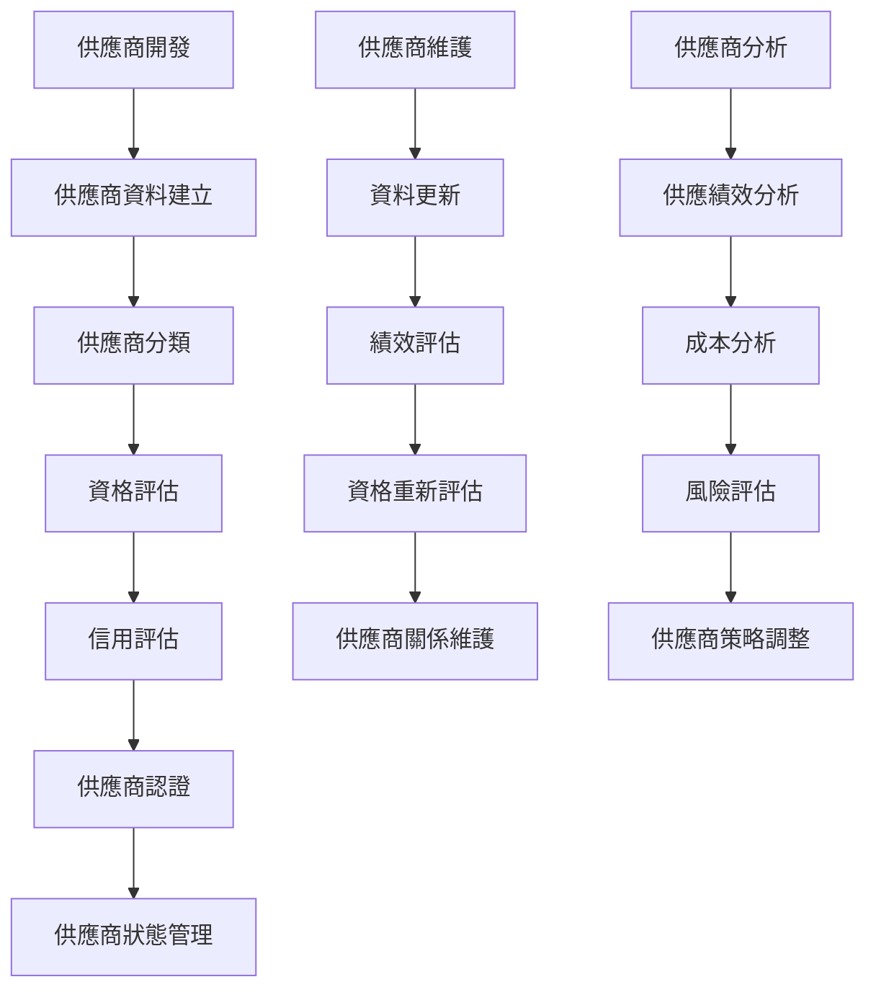
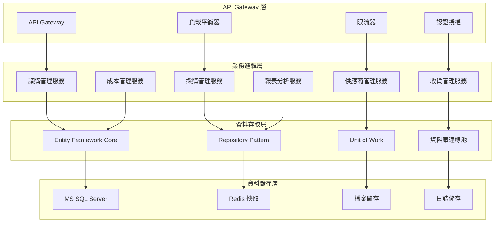

# 採購模組業務邏輯分析與API設計文件

## 一、基本資訊

| 項目 | 說明 |
|------|------|
| **系統名稱** | 10.10.10.180 企業管理系統 |
| **模組名稱** | 採購模組 |
| **模組代號** | PC (Purchase) |
| **功能名稱** | 採購管理 |
| **功能代號** | PC001 |
| **撰寫人員** | 系統分析師 |
| **撰寫日期** | 2024/12/21 |
| **審核人員** | 專案經理 |
| **審核日期** | 2024/12/21 |
| **版本編號** | v1.0 |
| **文件類型** | 業務邏輯分析與API設計 |
| **適用範圍** | 系統現代化轉型專案 |

---

## 二、業務邏輯分析

### 2.1 業務流程分析

#### 2.1.1 採購管理核心業務流程



#### 2.1.2 供應商管理業務流程



### 2.2 業務規則分析

#### 2.2.1 請購管理業務規則

| 業務規則編號 | 規則名稱 | 規則內容 | 業務影響 |
|-------------|----------|----------|----------|
| **PC001** | 請購單編號唯一性 | 每個請購單必須有唯一的請購單編號 | 確保請購單識別的唯一性 |
| **PC002** | 申請人有效性檢查 | 請購單中的申請人必須存在且狀態有效 | 防止無效申請人的請購單 |
| **PC003** | 需求合理性檢查 | 請購數量必須符合業務需求合理性 | 控制採購成本 |
| **PC004** | 預算控制規則 | 請購金額不能超過部門預算 | 控制部門支出 |
| **PC005** | 審核流程規則 | 請購單必須經過指定層級的審核 | 確保採購決策的合理性 |

#### 2.2.2 採購管理業務規則

| 業務規則編號 | 規則名稱 | 規則內容 | 業務影響 |
|-------------|----------|----------|----------|
| **PC006** | 採購單編號唯一性 | 採購單編號必須唯一 | 確保採購單識別的唯一性 |
| **PC007** | 供應商有效性檢查 | 採購單中的供應商必須存在且狀態有效 | 防止無效供應商的採購單 |
| **PC008** | 價格合理性檢查 | 採購價格不能超過市場合理價格範圍 | 控制採購成本 |
| **PC009** | 交貨期合理性 | 交貨期必須符合業務需求時程 | 確保業務連續性 |
| **PC010** | 採購審核規則 | 採購單必須經過財務和業務雙重審核 | 確保採購決策的合理性 |

#### 2.2.3 供應商管理業務規則

| 業務規則編號 | 規則名稱 | 規則內容 | 業務影響 |
|-------------|----------|----------|----------|
| **PC011** | 供應商代碼唯一性 | 供應商代碼必須唯一 | 確保供應商識別的唯一性 |
| **PC012** | 供應商分類規則 | 供應商必須按業務規則進行分類 | 便於供應商管理和分析 |
| **PC013** | 供應商績效評估 | 供應商績效必須定期評估和記錄 | 提升供應商管理品質 |
| **PC014** | 供應商狀態管理 | 供應商狀態變更必須經過審核 | 確保供應商資料的準確性 |
| **PC015** | 供應商關係維護 | 重要供應商必須定期維護關係 | 提升供應商合作品質 |

### 2.3 業務邏輯複雜度分析

#### 2.3.1 業務邏輯複雜度矩陣

| 業務功能 | 邏輯複雜度 | 資料複雜度 | 整合複雜度 | 總體複雜度 |
|----------|------------|------------|------------|------------|
| **請購管理** | 中 | 中 | 中 | 中 |
| **採購管理** | 高 | 高 | 高 | 高 |
| **供應商管理** | 中 | 中 | 中 | 中 |
| **收貨管理** | 中 | 中 | 高 | 高 |
| **成本管理** | 高 | 中 | 中 | 高 |
| **報表分析** | 中 | 高 | 中 | 中 |

---

## 三、API 設計

### 3.1 API 架構設計

#### 3.1.1 API 分層架構



### 3.2 API 端點設計

#### 3.2.1 請購管理 API

##### 3.2.1.1 查詢請購單列表
```http
# 查詢請購單列表
GET /api/pc/v1/requisitions
Authorization: Bearer {token}
Content-Type: application/json

Query Parameters:
- company_code: string (required)
- applicant_code: string (optional)
- requisition_date_from: string (optional)
- requisition_date_to: string (optional)
- requisition_status: string (optional)
- page: integer (optional, default: 1)
- page_size: integer (optional, default: 20)
```

**回應格式**：
```json
{
  "status": "success",
  "data": {
    "requisitions": [
      {
        "requisition_id": "PC20241221001",
        "applicant_code": "U001",
        "applicant_name": "張三",
        "requisition_date": "2024-12-21",
        "requisition_status": "PENDING",
        "total_amount": 25000.00,
        "currency": "TWD",
        "created_by": "USER001",
        "created_time": "2024-12-21T10:00:00Z"
      }
    ],
    "pagination": {
      "current_page": 1,
      "total_pages": 3,
      "total_records": 50,
      "page_size": 20
    }
  }
}
```

##### 3.2.1.2 新增請購單
```http
# 新增請購單
POST /api/pc/v1/requisitions
Authorization: Bearer {token}
Content-Type: application/json

Request Body:
{
  "company_code": "001",
  "applicant_code": "U001",
  "requisition_date": "2024-12-21",
  "required_date": "2024-12-25",
  "currency": "TWD",
  "remarks": "急件處理",
  "items": [
    {
      "product_code": "P001",
      "product_name": "產品A",
      "quantity": 100,
      "unit_price": 250.00,
      "remarks": "標準規格"
    }
  ]
}
```

#### 3.2.2 採購管理 API

##### 3.2.2.1 查詢採購單列表
```http
# 查詢採購單列表
GET /api/pc/v1/purchase-orders
Authorization: Bearer {token}
Content-Type: application/json

Query Parameters:
- company_code: string (required)
- supplier_code: string (optional)
- order_date_from: string (optional)
- order_date_to: string (optional)
- order_status: string (optional)
```

##### 3.2.2.2 建立採購單
```http
# 建立採購單
POST /api/pc/v1/purchase-orders
Authorization: Bearer {token}
Content-Type: application/json

Request Body:
{
  "company_code": "001",
  "supplier_code": "S001",
  "requisition_id": "PC20241221001",
  "order_date": "2024-12-21",
  "delivery_date": "2024-12-25",
  "currency": "TWD",
  "payment_terms": "NET30",
  "items": [
    {
      "requisition_item_id": "RI001",
      "product_code": "P001",
      "quantity": 100,
      "unit_price": 250.00,
      "line_amount": 25000.00
    }
  ]
}
```

#### 3.2.3 供應商管理 API

##### 3.2.3.1 查詢供應商列表
```http
# 查詢供應商列表
GET /api/pc/v1/suppliers
Authorization: Bearer {token}
Content-Type: application/json

Query Parameters:
- company_code: string (required)
- supplier_type: string (optional)
- supplier_status: string (optional)
- performance_rating: string (optional)
```

##### 3.2.3.2 新增供應商
```http
# 新增供應商
POST /api/pc/v1/suppliers
Authorization: Bearer {token}
Content-Type: application/json

Request Body:
{
  "company_code": "001",
  "supplier_name": "新供應商B",
  "supplier_type": "MANUFACTURER",
  "supplier_status": "ACTIVE",
  "contact_person": "李四",
  "contact_phone": "02-87654321",
  "contact_email": "contact@newsupplier.com",
  "address": "台北市信義區信義路五段7號",
  "tax_id": "87654321"
}
```

### 3.3 API 資料模型設計

#### 3.3.1 請購單資料模型

```csharp
// 請購單主檔
public class Requisition
{
    public string RequisitionId { get; set; }
    public string CompanyCode { get; set; }
    public string ApplicantCode { get; set; }
    public DateTime RequisitionDate { get; set; }
    public DateTime RequiredDate { get; set; }
    public string RequisitionStatus { get; set; }
    public string Currency { get; set; }
    public decimal TotalAmount { get; set; }
    public string Remarks { get; set; }
    public string CreatedBy { get; set; }
    public DateTime CreatedTime { get; set; }
    public string UpdatedBy { get; set; }
    public DateTime? UpdatedTime { get; set; }
    
    // 導航屬性
    public virtual User Applicant { get; set; }
    public virtual ICollection<RequisitionItem> RequisitionItems { get; set; }
    public virtual ICollection<PurchaseOrder> PurchaseOrders { get; set; }
}

// 請購單明細
public class RequisitionItem
{
    public string RequisitionItemId { get; set; }
    public string RequisitionId { get; set; }
    public string ProductCode { get; set; }
    public string ProductName { get; set; }
    public int Quantity { get; set; }
    public decimal UnitPrice { get; set; }
    public decimal LineAmount { get; set; }
    public string Remarks { get; set; }
    
    // 導航屬性
    public virtual Requisition Requisition { get; set; }
    public virtual Product Product { get; set; }
}
```

#### 3.3.2 採購單資料模型

```csharp
// 採購單主檔
public class PurchaseOrder
{
    public string PurchaseOrderId { get; set; }
    public string CompanyCode { get; set; }
    public string SupplierCode { get; set; }
    public string RequisitionId { get; set; }
    public DateTime OrderDate { get; set; }
    public DateTime DeliveryDate { get; set; }
    public string OrderStatus { get; set; }
    public string Currency { get; set; }
    public decimal TotalAmount { get; set; }
    public string PaymentTerms { get; set; }
    public string CreatedBy { get; set; }
    public DateTime CreatedTime { get; set; }
    public string UpdatedBy { get; set; }
    public DateTime? UpdatedTime { get; set; }
    
    // 導航屬性
    public virtual Supplier Supplier { get; set; }
    public virtual Requisition Requisition { get; set; }
    public virtual ICollection<PurchaseOrderItem> PurchaseOrderItems { get; set; }
    public virtual ICollection<Receipt> Receipts { get; set; }
}

// 採購單明細
public class PurchaseOrderItem
{
    public string PurchaseOrderItemId { get; set; }
    public string PurchaseOrderId { get; set; }
    public string RequisitionItemId { get; set; }
    public string ProductCode { get; set; }
    public string ProductName { get; set; }
    public int Quantity { get; set; }
    public decimal UnitPrice { get; set; }
    public decimal LineAmount { get; set; }
    
    // 導航屬性
    public virtual PurchaseOrder PurchaseOrder { get; set; }
    public virtual RequisitionItem RequisitionItem { get; set; }
    public virtual Product Product { get; set; }
}
```

---

## 四、業務邏輯轉換策略

### 4.1 RPG 到 C# 轉換策略

#### 4.1.1 程式結構轉換

| RPG 結構 | C# 對應 | 轉換說明 |
|----------|----------|----------|
| **主程式** | Main Program | 使用 Program.cs 作為程式進入點 |
| **子程序** | Private Methods | 將 RPG 子程序轉換為 C# 私有方法 |
| **資料結構** | Classes/Models | 將 RPG 資料結構轉換為 C# 類別 |
| **檔案操作** | Repository Pattern | 使用 Repository 模式處理資料存取 |
| **錯誤處理** | Exception Handling | 使用 C# 例外處理機制 |

#### 4.1.2 業務邏輯轉換範例

**RPG 原始碼**：
```rpgle
     C     ProcessRequisition BEGSR
     C                   EVAL      RequisitionStatus = 'A'
     C                   EVAL      ProcessedBy = %USER
     C                   EVAL      ProcessedTime = %TIMESTAMP
     C                   UPDATE     PCAHPF
     C                   EXSR      UpdateBudget
     C                   EXSR      GeneratePurchaseOrder
     C                   EXSR      LogRequisitionProcessing
     C                   ENDSR
```

**C# 轉換後**：
```csharp
private async Task ProcessRequisitionAsync(string requisitionId, string processedBy)
{
    try
    {
        var requisition = await _requisitionRepository.GetByIdAsync(requisitionId);
        if (requisition == null)
            throw new NotFoundException($"Requisition {requisitionId} not found");
        
        requisition.Process(processedBy);
        await _requisitionRepository.UpdateAsync(requisition);
        
        await UpdateBudgetAsync(requisition);
        await GeneratePurchaseOrderAsync(requisition);
        await LogRequisitionProcessingAsync(requisition, processedBy);
        
        await _unitOfWork.SaveChangesAsync();
    }
    catch (Exception ex)
    {
        _logger.LogError(ex, "Error processing requisition {RequisitionId}", requisitionId);
        throw;
    }
}
```

### 4.2 資料庫轉換策略

#### 4.2.1 資料表結構轉換

| AS/400 檔案 | MS SQL 資料表 | 轉換說明 |
|-------------|----------------|----------|
| **PCAHPF** | PC_Requisitions | 請購單主檔 |
| **PCACPF** | PC_RequisitionItems | 請購單明細 |
| **PCACPF** | PC_Suppliers | 供應商主檔 |
| **PCAIPF** | PC_PurchaseOrders | 採購單主檔 |
| **PCWF01** | PC_WorkFiles | 工作檔案 |

---

## 五、API 效能優化策略

### 5.1 快取策略

#### 5.1.1 Redis 快取設計

```csharp
// 快取服務介面
public interface ICacheService
{
    Task<T> GetAsync<T>(string key);
    Task SetAsync<T>(string key, T value, TimeSpan? expiry = null);
    Task RemoveAsync(string key);
    Task RemoveByPatternAsync(string pattern);
}

// 在服務中使用快取
public class RequisitionService : IRequisitionService
{
    private readonly ICacheService _cacheService;
    
    public async Task<RequisitionDto> GetRequisitionAsync(string requisitionId)
    {
        var cacheKey = $"requisition:{requisitionId}";
        var cachedRequisition = await _cacheService.GetAsync<RequisitionDto>(cacheKey);
        
        if (cachedRequisition != null)
            return cachedRequisition;
        
        var requisition = await _requisitionRepository.GetByIdAsync(requisitionId);
        var requisitionDto = _mapper.Map<RequisitionDto>(requisition);
        
        await _cacheService.SetAsync(cacheKey, requisitionDto, TimeSpan.FromMinutes(30));
        return requisitionDto;
    }
}
```

### 5.2 分頁查詢優化

#### 5.2.1 分頁查詢實作

```csharp
public async Task<PagedResult<RequisitionDto>> GetRequisitionsAsync(RequisitionQueryParameters parameters)
{
    var query = _context.Requisitions.AsQueryable();
    
    // 套用查詢條件
    if (!string.IsNullOrEmpty(parameters.CompanyCode))
        query = query.Where(r => r.CompanyCode == parameters.CompanyCode);
    
    if (!string.IsNullOrEmpty(parameters.ApplicantCode))
        query = query.Where(r => r.ApplicantCode == parameters.ApplicantCode);
    
    if (parameters.RequisitionDateFrom.HasValue)
        query = query.Where(r => r.RequisitionDate >= parameters.RequisitionDateFrom.Value);
    
    // 取得總數
    var totalCount = await query.CountAsync();
    
    // 分頁查詢
    var requisitions = await query
        .OrderByDescending(r => r.RequisitionDate)
        .ThenBy(r => r.RequisitionId)
        .Skip(parameters.Skip)
        .Take(parameters.PageSize)
        .Include(r => r.RequisitionItems)
        .Include(r => r.Applicant)
        .ToListAsync();
    
    var requisitionDtos = _mapper.Map<List<RequisitionDto>>(requisitions);
    
    return new PagedResult<RequisitionDto>
    {
        Items = requisitionDtos,
        TotalCount = totalCount,
        Page = parameters.Page,
        PageSize = parameters.PageSize
    };
}
```

---

## 六、錯誤處理與日誌記錄

### 6.1 統一錯誤處理

#### 6.1.1 業務邏輯例外

```csharp
// 自訂例外類別
public class RequisitionValidationException : Exception
{
    public List<string> ValidationErrors { get; }
    
    public RequisitionValidationException(string message, List<string> errors = null) 
        : base(message)
    {
        ValidationErrors = errors ?? new List<string>();
    }
}

public class BudgetExceededException : Exception
{
    public string DepartmentCode { get; }
    public decimal RequisitionAmount { get; }
    public decimal AvailableBudget { get; }
    
    public BudgetExceededException(string departmentCode, decimal requisitionAmount, decimal availableBudget)
        : base($"Budget exceeded for department {departmentCode}")
    {
        DepartmentCode = departmentCode;
        RequisitionAmount = requisitionAmount;
        AvailableBudget = availableBudget;
    }
}
```

### 6.2 結構化日誌記錄

#### 6.2.1 日誌記錄實作

```csharp
public class LoggingService : ILoggingService
{
    private readonly ILogger<LoggingService> _logger;
    
    public void LogRequisitionOperation(string operation, string requisitionId, string userId, object data = null)
    {
        _logger.LogInformation("Requisition operation: {Operation} for requisition {RequisitionId} by user {UserId}",
            operation, requisitionId, userId);
        
        if (data != null)
        {
            _logger.LogDebug("Requisition operation data: {@Data}", data);
        }
    }
}
```

---

## 七、修訂記錄

| 版本 | 修訂日期 | 修訂人員 | 修訂內容 | 修訂原因 |
|------|----------|----------|----------|----------|
| v1.0 | 2024/12/21 | 系統分析師 | 初始版本 | 文件建立 |

---

**文件建立日期**：2024年12月21日  
**最後更新日期**：2024年12月21日  
**文件狀態**：草稿  
**下次檢討日期**：2025年1月21日 