# 採購模組程式功能規格書

## 一、基本資料

| 項目 | 說明 |
|------|------|
| **系統名稱** | 10.10.10.180 企業管理系統 |
| **模組名稱** | 採購模組 |
| **模組代號** | PC (Purchase) |
| **程式名稱** | 採購管理系統 |
| **程式代號** | PCMGT |
| **功能名稱** | 採購管理 |
| **功能代號** | PC001 |
| **撰寫人員** | 系統分析師 |
| **撰寫日期** | 2024/12/20 |
| **審核人員** | 專案經理 |
| **審核日期** | 2024/12/20 |
| **版本編號** | v1.0 |
| **文件狀態** | 草稿 |

---

## 二、檔案架構與關聯圖

### 2.1 採購模組檔案架構圖

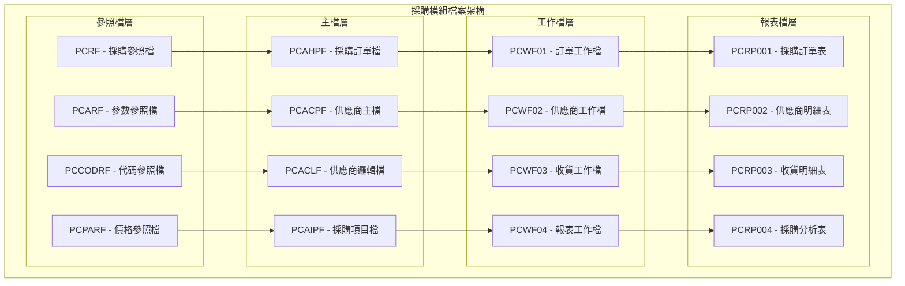

### 2.2 採購模組系統架構圖

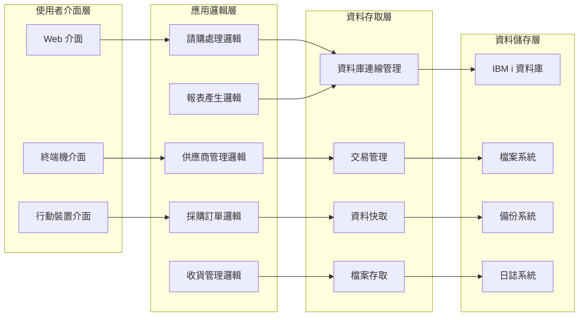

### 2.3 檔案關聯圖

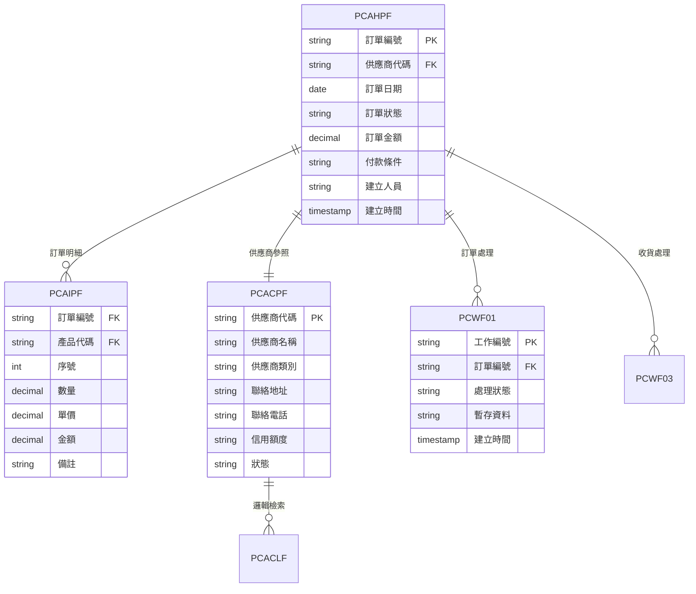

### 2.4 檔案清單

| 檔案類型 | 檔案名稱 | 檔案代號 | 用途說明 |
|----------|----------|----------|----------|
| 主檔 | 採購訂單檔 | PCAHPF | 儲存所有採購訂單的主檔資料 |
| 主檔 | 供應商主檔 | PCACPF | 儲存供應商基本資料的主檔 |
| 主檔 | 採購項目檔 | PCAIPF | 儲存訂單明細項目的資料 |
| 邏輯檔 | 供應商邏輯檔 | PCACLF | 提供供應商查詢和排序的邏輯檔案 |
| 工作檔 | 訂單工作檔 | PCWF01 | 訂單處理過程中的暫存資料 |
| 工作檔 | 供應商工作檔 | PCWF02 | 供應商管理過程中的暫存資料 |
| 工作檔 | 收貨工作檔 | PCWF03 | 收貨處理過程中的暫存資料 |
| 工作檔 | 報表工作檔 | PCWF04 | 報表產生過程中的暫存資料 |
| 參照檔 | 採購參照檔 | PCRF | 採購模組的參照資料 |
| 參照檔 | 參數參照檔 | PCARF | 採購模組的參數設定 |
| 參照檔 | 代碼參照檔 | PCCODRF | 採購模組的代碼對照 |
| 參照檔 | 價格參照檔 | PCPARF | 產品價格的參照資料 |

---

## 三、檔案名稱，欄位代號、名稱、位置、長度、型態、屬性、檢核說明

### 3.1 採購訂單檔 (PCAHPF) 欄位規格

#### 3.1.1 記錄格式：PCAHPR
| 欄位代號 | 欄位名稱 | 位置 | 長度 | 型態 | 屬性 | 檢核說明 |
|----------|----------|------|------|------|------|----------|
| AH01 | 公司代碼 | 1-3 | 3 | CHAR | PK | 必填，參照公司主檔 |
| AH02 | 訂單編號 | 4-15 | 12 | CHAR | PK | 必填，系統自動產生 |
| AH03 | 供應商代碼 | 16-20 | 5 | CHAR | FK | 必填，參照供應商主檔 |
| AH04 | 訂單日期 | 21-28 | 8 | DATE | - | 必填，格式：YYYYMMDD |
| AH05 | 訂單狀態 | 29-29 | 1 | CHAR | - | 必填，1:草稿 2:確認 3:收貨 4:完成 5:取消 |
| AH06 | 訂單金額 | 30-39 | 10 | DECIMAL | - | 必填，金額格式 |
| AH07 | 付款條件 | 40-41 | 2 | CHAR | - | 必填，參照付款條件檔 |
| AH08 | 交貨日期 | 42-49 | 8 | DATE | - | 必填，不能早於訂單日期 |
| AH09 | 交貨地址 | 50-89 | 40 | CHAR | - | 必填，最多40字元 |
| AH10 | 備註 | 90-129 | 40 | CHAR | - | 可選，最多40字元 |
| AH11 | 建立人員 | 130-134 | 5 | CHAR | - | 必填，參照使用者檔 |
| AH12 | 建立時間 | 135-142 | 8 | TIMESTAMP | - | 系統自動產生 |
| AH13 | 修改人員 | 143-147 | 5 | CHAR | - | 可選，參照使用者檔 |
| AH14 | 修改時間 | 148-155 | 8 | TIMESTAMP | - | 系統自動產生 |
| AH15 | 狀態 | 156-156 | 1 | CHAR | - | 必填，A:有效 D:刪除 |

#### 3.1.2 主鍵欄位
- **主鍵1**：AH01 - 公司代碼 (CHAR(3))
- **主鍵2**：AH02 - 訂單編號 (CHAR(12))

#### 3.1.3 索引資料
| 索引名稱 | 索引類型 | 索引欄位 | 說明 |
|----------|----------|----------|------|
| PCH001 | 主鍵索引 | AH01, AH02 | 主要查詢索引 |
| PCH002 | 一般索引 | AH03, AH04 | 供應商日期查詢索引 |
| PCH003 | 一般索引 | AH05, AH04 | 狀態日期查詢索引 |
| PCH004 | 一般索引 | AH11, AH12 | 建立人員時間索引 |

### 3.2 供應商主檔 (PCACPF) 欄位規格

#### 3.2.1 記錄格式：PCACPR
| 欄位代號 | 欄位名稱 | 位置 | 長度 | 型態 | 屬性 | 檢核說明 |
|----------|----------|------|------|------|------|----------|
| AC01 | 供應商代碼 | 1-5 | 5 | CHAR | PK | 必填，唯一值 |
| AC02 | 供應商名稱 | 6-35 | 30 | CHAR | - | 必填，最多30字元 |
| AC03 | 供應商類別 | 36-36 | 1 | CHAR | - | 必填，1:一般 2:策略 3:經銷商 |
| AC04 | 聯絡地址 | 37-76 | 40 | CHAR | - | 必填，最多40字元 |
| AC05 | 聯絡電話 | 77-86 | 10 | CHAR | - | 必填，電話格式 |
| AC06 | 聯絡人員 | 87-96 | 10 | CHAR | - | 必填，最多10字元 |
| AC07 | 信用額度 | 97-106 | 10 | DECIMAL | - | 必填，金額格式 |
| AC08 | 付款條件 | 107-108 | 2 | CHAR | - | 必填，參照付款條件檔 |
| AC09 | 稅籍編號 | 109-118 | 10 | CHAR | - | 可選，統一編號格式 |
| AC10 | 狀態 | 119-119 | 1 | CHAR | - | 必填，A:有效 D:停用 |
| AC11 | 建立人員 | 120-124 | 5 | CHAR | - | 必填，參照使用者檔 |
| AC12 | 建立時間 | 125-132 | 8 | TIMESTAMP | - | 系統自動產生 |

#### 3.2.2 主鍵欄位
- **主鍵1**：AC01 - 供應商代碼 (CHAR(5))

#### 3.2.3 索引資料
| 索引名稱 | 索引類型 | 索引欄位 | 說明 |
|----------|----------|----------|------|
| PCC001 | 主鍵索引 | AC01 | 主要查詢索引 |
| PCC002 | 一般索引 | AC02 | 供應商名稱查詢索引 |
| PCC003 | 一般索引 | AC03, AC10 | 類別狀態查詢索引 |
| PCC004 | 一般索引 | AC09 | 稅籍編號查詢索引 |

### 3.3 採購項目檔 (PCAIPF) 欄位規格

#### 3.3.1 記錄格式：PCAIPR
| 欄位代號 | 欄位名稱 | 位置 | 長度 | 型態 | 屬性 | 檢核說明 |
|----------|----------|------|------|------|------|----------|
| AI01 | 訂單編號 | 1-12 | 12 | CHAR | FK | 必填，參照採購訂單檔 |
| AI02 | 序號 | 13-15 | 3 | INTEGER | PK | 必填，1-999 |
| AI03 | 產品代碼 | 16-20 | 5 | CHAR | FK | 必填，參照產品主檔 |
| AI04 | 產品名稱 | 21-50 | 30 | CHAR | - | 必填，最多30字元 |
| AI05 | 規格 | 51-80 | 30 | CHAR | - | 可選，最多30字元 |
| AI06 | 數量 | 81-88 | 8 | DECIMAL | - | 必填，正數 |
| AI07 | 單位 | 89-90 | 2 | CHAR | - | 必填，參照單位檔 |
| AI08 | 單價 | 91-100 | 10 | DECIMAL | - | 必填，金額格式 |
| AI09 | 折扣率 | 101-103 | 3 | DECIMAL | - | 可選，0-100% |
| AI10 | 金額 | 104-113 | 10 | DECIMAL | - | 必填，數量×單價×(1-折扣率) |
| AI11 | 備註 | 114-143 | 30 | CHAR | - | 可選，最多30字元 |

#### 3.3.2 主鍵欄位
- **主鍵1**：AI01 - 訂單編號 (CHAR(12))
- **主鍵2**：AI02 - 序號 (INTEGER)

#### 3.3.3 外鍵關聯
- **關聯主檔1**：採購訂單檔 (PCAHPF)
- **關聯欄位1**：AI01 → AH02
- **關聯主檔2**：產品主檔 (PTAPF)
- **關聯欄位2**：AI03 → PT01

### 3.4 訂單工作檔 (PCWF01) 欄位規格

#### 3.4.1 記錄格式：PCWF01R
| 欄位代號 | 欄位名稱 | 位置 | 長度 | 型態 | 屬性 | 檢核說明 |
|----------|----------|------|------|------|------|----------|
| WF0101 | 工作編號 | 1-10 | 10 | CHAR | PK | 必填，系統自動產生 |
| WF0102 | 訂單編號 | 11-22 | 12 | CHAR | FK | 必填，參照採購訂單檔 |
| WF0103 | 處理狀態 | 23-23 | 1 | CHAR | - | 必填，P:處理中 C:完成 E:錯誤 |
| WF0104 | 處理類型 | 24-24 | 1 | CHAR | - | 必填，1:新增 2:修改 3:刪除 |
| WF0105 | 暫存資料 | 25-124 | 100 | CHAR | - | 可選，處理中的暫存資料 |
| WF0106 | 建立時間 | 125-132 | 8 | TIMESTAMP | - | 系統自動產生 |
| WF0107 | 完成時間 | 133-140 | 8 | TIMESTAMP | - | 可選，處理完成時間 |

#### 3.4.2 主鍵欄位
- **主鍵1**：WF0101 - 工作編號 (CHAR(10))

#### 3.4.3 外鍵關聯
- **關聯主檔**：採購訂單檔 (PCAHPF)
- **關聯欄位**：WF0102 → AH02

---

## 四、輸出/入螢幕布局與說明

### 4.1 採購管理主畫面布局

#### 4.1.1 主畫面配置圖

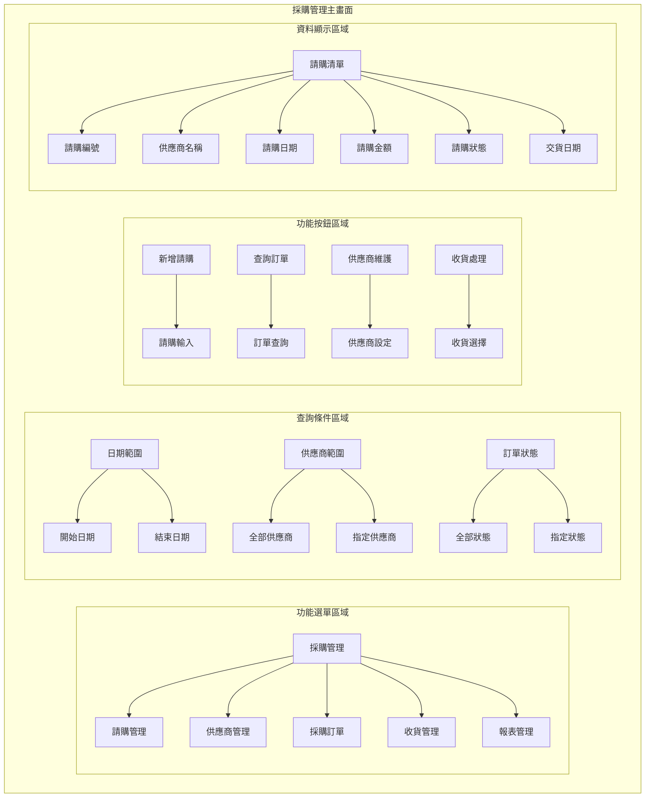

#### 4.1.2 主畫面詳細配置
```
┌─────────────────────────────────────────────────────────────┐
│                    採購管理系統 - 主畫面                      │
├─────────────────────────────────────────────────────────────┤
│ 功能選單區域                                                │
│ ┌─────────────────────────────────────────────────────────┐ │
│ │ [採購管理] [請購管理] [供應商管理] [採購訂單] [收貨管理] │ │
│ └─────────────────────────────────────────────────────────┘ │
├─────────────────────────────────────────────────────────────┤
│ 查詢條件區域                                                │
│ ┌─────────────────────────────────────────────────────────┐ │
│ │ 日期範圍: [2024/01/01] 至 [2024/12/31]                │ │
│ │ 供應商範圍: [全部供應商 ▼]  訂單狀態: [全部狀態 ▼]      │ │
│ └─────────────────────────────────────────────────────────┘ │
├─────────────────────────────────────────────────────────────┤
│ 功能按鈕區域                                                │
│ [新增請購] [查詢訂單] [供應商維護] [收貨處理] [報表產生]  │ │
├─────────────────────────────────────────────────────────────┤
│ 請購資料顯示區域                                            │
│ ┌─────────────────────────────────────────────────────────┐ │
│ │ 請購編號 │ 供應商名稱 │ 請購日期 │ 請購金額 │ 狀態 │ 交貨日期 │
│ ├─────────────────────────────────────────────────────────┤ │
│ │ PC001    │ 供應商A   │ 2024/12/20│ 50,000   │ 確認 │ 2024/12/25│
│ │ PC002    │ 供應商B   │ 2024/12/20│ 75,000   │ 草稿 │ 2024/12/26│
│ └─────────────────────────────────────────────────────────┘ │
└─────────────────────────────────────────────────────────────┘
```

#### 4.1.3 欄位說明
| 欄位標籤 | 欄位名稱 | 欄位類型 | 必填 | 預設值 | 說明 |
|----------|----------|----------|------|--------|------|
| 開始日期 | 開始日期 | 日期選擇器 | 否 | 年度開始日 | 查詢的開始日期 |
| 結束日期 | 結束日期 | 日期選擇器 | 否 | 年度結束日 | 查詢的結束日期 |
| 供應商範圍 | 供應商範圍 | 下拉選單 | 否 | 全部供應商 | 選擇要查詢的供應商範圍 |
| 訂單狀態 | 訂單狀態 | 下拉選單 | 否 | 全部狀態 | 選擇要查詢的訂單狀態 |

### 4.2 請購輸入畫面布局

#### 4.2.1 請購輸入畫面配置圖

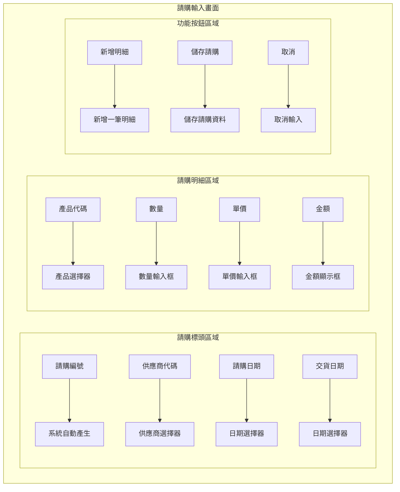

#### 4.2.2 請購輸入詳細配置
```
┌─────────────────────────────────────────────────────────────┐
│                    請購輸入 - 新增請購                      │
├─────────────────────────────────────────────────────────────┤
│ 請購標頭區域                                                │
│ ┌─────────────────────────────────────────────────────────┐ │
│ │ 請購編號: [PC001        ] (系統自動產生)                │ │
│ │ 供應商代碼: [S001 ▼]    供應商名稱: [供應商A            ] │ │
│ │ 請購日期: [2024/12/20 ▼]                               │ │
│ │ 交貨日期: [2024/12/25 ▼]                               │ │
│ └─────────────────────────────────────────────────────────┘ │
├─────────────────────────────────────────────────────────────┤
│ 請購明細區域                                                │
│ ┌─────────────────────────────────────────────────────────┐ │
│ │ 序號 │ 產品代碼 │ 產品名稱 │ 數量 │ 單價 │ 金額 │ 備註 │
│ ├─────────────────────────────────────────────────────────┤ │
│ │  1   │ [P001 ▼] │ [產品A  ] │ [100] │ [500] │ [50,000] │ [    ] │
│ │  2   │ [P002 ▼] │ [產品B  ] │ [ 50] │ [500] │ [25,000] │ [    ] │
│ └─────────────────────────────────────────────────────────┘ │
├─────────────────────────────────────────────────────────────┤
│ 請購總計: 75,000                                           │
│ 功能按鈕區域                                                │
│ [新增明細] [儲存請購] [取消]                              │
└─────────────────────────────────────────────────────────────┘
```

---

## 五、處理流程程序說明

### 5.1 採購管理主要處理流程

#### 5.1.1 請購處理流程圖

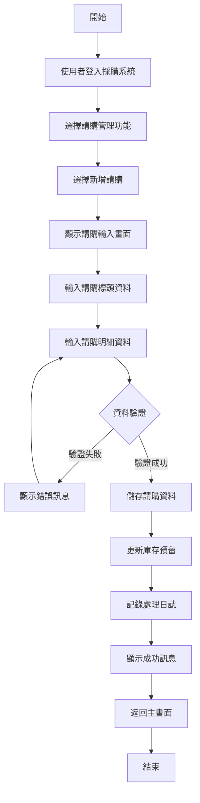

#### 5.1.2 供應商管理流程圖

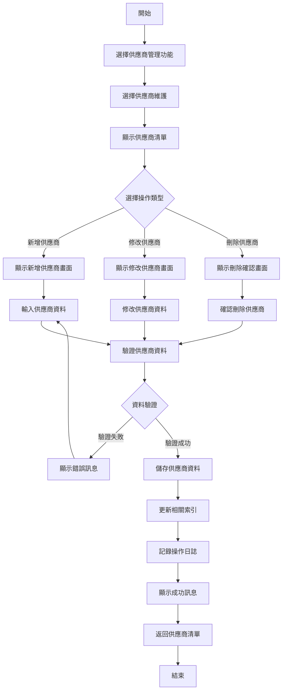

#### 5.1.3 收貨處理流程圖

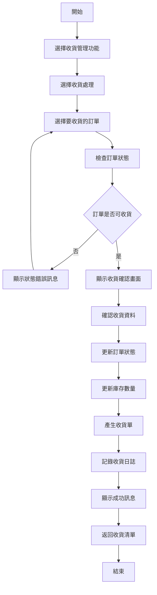

### 5.2 資料驗證流程

#### 5.2.1 請購資料驗證流程

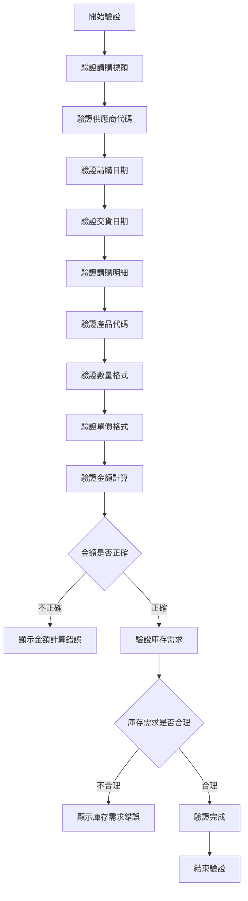

#### 5.2.2 欄位驗證規則
| 欄位名稱 | 驗證類型 | 驗證規則 | 錯誤訊息 |
|----------|----------|----------|----------|
| 供應商代碼 | 存在性驗證 | 供應商代碼必須存在於供應商主檔中 | 供應商代碼不存在 |
| 請購日期 | 日期驗證 | 日期格式：YYYYMMDD，不能超過當前日期 | 請購日期格式錯誤或超過當前日期 |
| 交貨日期 | 日期驗證 | 交貨日期不能早於請購日期 | 交貨日期不能早於請購日期 |
| 產品代碼 | 存在性驗證 | 產品代碼必須存在於產品主檔中 | 產品代碼不存在 |
| 數量 | 數量驗證 | 數量必須為正數 | 數量格式錯誤 |
| 單價 | 金額驗證 | 單價必須為正數，最多10位整數，2位小數 | 單價格式錯誤 |

#### 5.2.3 業務邏輯驗證
| 驗證項目 | 驗證邏輯 | 錯誤訊息 |
|----------|----------|----------|
| 請購金額 | 明細金額總和 = 請購金額 | 請購金額計算錯誤，請檢查明細 |
| 庫存需求 | 請購數量應基於實際需求 | 請購數量不合理，請檢查需求 |
| 供應商狀態 | 供應商狀態必須為有效(A) | 供應商已停用，無法建立請購 |
| 預算控制 | 請購金額 ≤ 部門預算 | 請購金額超過部門預算 |

---

## 六、子程序處理邏輯說明

### 6.1 子程序清單
| 子程序名稱 | 子程序代號 | 功能說明 | 呼叫時機 |
|------------|------------|----------|----------|
| 請購編號產生 | PC001 | 自動產生請購編號 | 新增請購時 |
| 供應商信用檢查 | PC002 | 檢查供應商信用額度 | 儲存請購前 |
| 庫存需求檢查 | PC003 | 檢查產品庫存需求 | 儲存請購前 |
| 請購金額計算 | PC004 | 計算請購總金額 | 儲存請購前 |
| 收貨狀態更新 | PC005 | 更新請購收貨狀態 | 收貨處理時 |

### 6.2 子程序詳細說明

#### 6.2.1 請購編號產生 (PC001)

**功能說明**：自動產生唯一的請購編號，確保請購編號的唯一性和連續性

**輸入參數**：
- 公司代碼 (COMPANY_CODE) - CHAR(3) - 公司代碼
- 請購日期 (REQUEST_DATE) - DATE - 請購日期

**輸出參數**：
- 請購編號 (REQUEST_NO) - CHAR(12) - 產生的請購編號
- 狀態碼 (STATUS) - CHAR(1) - 處理狀態：S成功，E失敗

**處理邏輯**：
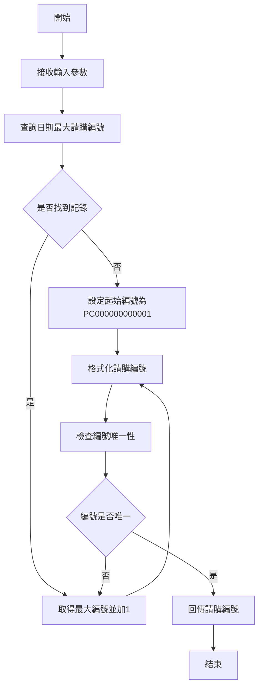

**錯誤處理**：
- 資料庫連線失敗：記錄錯誤日誌，回傳錯誤狀態
- 編號重複：自動重新產生編號
- 參數錯誤：回傳參數錯誤訊息

#### 6.2.2 供應商信用檢查 (PC002)

**功能說明**：檢查供應商的信用額度是否足夠支付請購金額

**輸入參數**：
- 供應商代碼 (SUPPLIER_CODE) - CHAR(5) - 供應商代碼
- 請購金額 (REQUEST_AMOUNT) - DECIMAL(12,2) - 請購金額

**輸出參數**：
- 檢查結果 (CHECK_RESULT) - CHAR(1) - 檢查結果：P通過，F失敗
- 錯誤訊息 (ERROR_MESSAGE) - VARCHAR(200) - 錯誤訊息內容

**處理邏輯**：
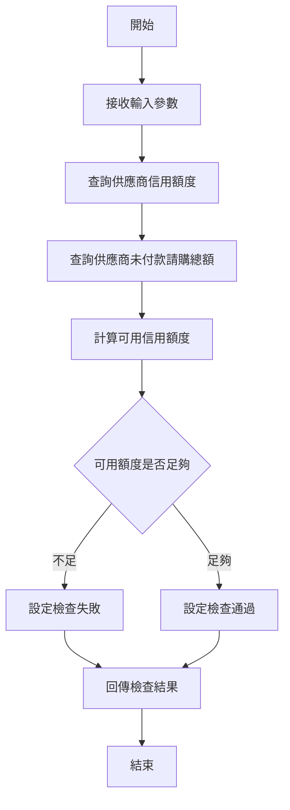

**錯誤處理**：
- 供應商資料不存在：回傳供應商不存在錯誤
- 信用額度查詢失敗：回傳查詢失敗錯誤
- 計算錯誤：回傳計算錯誤訊息

#### 6.2.3 庫存需求檢查 (PC003)

**功能說明**：檢查產品的庫存需求是否合理

**輸入參數**：
- 產品代碼 (PRODUCT_CODE) - CHAR(5) - 產品代碼
- 請購數量 (REQUEST_QUANTITY) - DECIMAL(8,0) - 請購數量

**輸出參數**：
- 檢查結果 (CHECK_RESULT) - CHAR(1) - 檢查結果：P通過，F失敗
- 建議數量 (SUGGESTED_QUANTITY) - DECIMAL(8,0) - 建議請購數量
- 錯誤訊息 (ERROR_MESSAGE) - VARCHAR(200) - 錯誤訊息內容

**處理邏輯**：
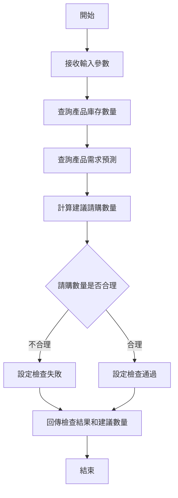

**錯誤處理**：
- 產品資料不存在：回傳產品不存在錯誤
- 庫存查詢失敗：回傳查詢失敗錯誤
- 計算錯誤：回傳計算錯誤訊息

---

## 七、錯誤處理程序說明與訊息清冊

### 7.1 錯誤處理流程

#### 7.1.1 錯誤處理架構圖

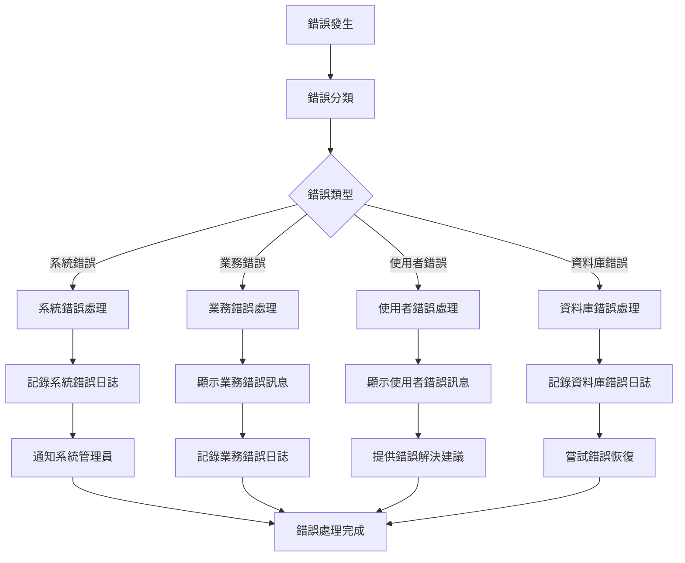

#### 7.1.2 錯誤處理策略
| 錯誤類型 | 處理策略 | 使用者通知 | 日誌記錄 |
|----------|----------|------------|----------|
| 系統錯誤 | 記錄錯誤日誌，通知管理員 | 顯示系統維護訊息 | 記錄詳細錯誤資訊 |
| 業務錯誤 | 顯示具體錯誤訊息，提供解決建議 | 顯示業務錯誤說明 | 記錄業務邏輯錯誤 |
| 使用者錯誤 | 顯示輸入錯誤，提供正確格式 | 顯示輸入格式說明 | 記錄使用者操作錯誤 |
| 資料庫錯誤 | 記錄資料庫錯誤，嘗試恢復 | 顯示系統忙碌訊息 | 記錄資料庫錯誤詳情 |

### 7.2 錯誤訊息清冊

#### 7.2.1 系統錯誤訊息
| 錯誤代碼 | 錯誤訊息 | 錯誤原因 | 解決方案 |
|----------|----------|----------|----------|
| PC001 | 系統連線失敗，請稍後再試 | 資料庫連線異常 | 檢查網路連線，聯絡系統管理員 |
| PC002 | 系統資源不足，請稍後再試 | 系統記憶體或CPU不足 | 等待系統負載降低，聯絡系統管理員 |
| PC003 | 系統維護中，請稍後再試 | 系統正在進行維護 | 等待維護完成，查看系統公告 |

#### 7.2.2 業務錯誤訊息
| 錯誤代碼 | 錯誤訊息 | 錯誤原因 | 解決方案 |
|----------|----------|----------|----------|
| PC101 | 供應商代碼不存在，請檢查供應商代碼 | 輸入的供應商代碼在系統中不存在 | 查詢正確的供應商代碼，或聯絡管理員新增供應商 |
| PC102 | 供應商已停用，無法建立請購 | 選擇的供應商狀態為停用 | 選擇其他有效供應商，或聯絡管理員啟用供應商 |
| PC103 | 請購金額超過供應商信用額度 | 請購金額超過供應商的信用額度限制 | 減少請購數量或金額，或聯絡管理員調整信用額度 |
| PC104 | 請購數量不合理，請檢查需求 | 請購數量超過合理需求範圍 | 檢查實際需求，調整請購數量 |

#### 7.2.3 使用者錯誤訊息
| 錯誤代碼 | 錯誤訊息 | 錯誤原因 | 解決方案 |
|----------|----------|----------|----------|
| PC201 | 請購日期格式錯誤，請使用YYYYMMDD格式 | 日期輸入格式不正確 | 使用正確的日期格式，如：20241220 |
| PC202 | 交貨日期不能早於請購日期 | 交貨日期設定錯誤 | 設定正確的交貨日期，不能早於請購日期 |
| PC203 | 數量格式錯誤，請輸入正確的數字格式 | 數量輸入格式不正確 | 輸入正數，最多8位整數 |
| PC204 | 單價格式錯誤，請輸入正確的金額格式 | 單價輸入格式不正確 | 輸入正數，最多10位整數，2位小數 |

#### 7.2.4 資料庫錯誤訊息
| 錯誤代碼 | 錯誤訊息 | 錯誤原因 | 解決方案 |
|----------|----------|----------|----------|
| PC301 | 資料庫連線逾時，請稍後再試 | 資料庫連線超過時間限制 | 等待系統恢復，或聯絡系統管理員 |
| PC302 | 資料庫鎖定衝突，請稍後再試 | 資料被其他使用者鎖定 | 等待其他使用者完成操作，或聯絡系統管理員 |
| PC303 | 資料庫空間不足，無法儲存資料 | 資料庫磁碟空間不足 | 聯絡系統管理員清理資料庫空間 |
| PC304 | 資料庫索引損壞，請聯絡管理員 | 資料庫索引檔案損壞 | 立即聯絡系統管理員進行修復 |

---

## 八、備註

### 8.1 特殊說明
- **請購編號規則**：請購編號格式為 PC + 10位序號，每年重新開始編號
- **供應商代碼規則**：供應商代碼為5位字元，前2位為供應商類別，後3位為序號
- **金額精度**：所有金額欄位支援到小數點後2位，超過部分自動四捨五入
- **日期格式**：系統使用 YYYYMMDD 格式儲存日期，顯示時轉換為 YYYY/MM/DD 格式

### 8.2 限制條件
- **請購數量限制**：每個公司每年最多可建立 999,999,999 張請購單
- **供應商數量限制**：每個公司最多可建立 99,999 個供應商
- **明細數量限制**：每張請購單最多可包含 999 筆明細
- **備註長度限制**：請購備註最多 40 個字元，明細備註最多 30 個字元

### 8.3 未來擴充
- **電子採購整合**：未來版本將支援電子採購平台整合
- **行動裝置支援**：未來版本將提供行動裝置專用介面
- **多幣別支援**：未來版本將支援多幣別請購處理
- **智慧採購**：未來版本將整合 AI 技術，提供智慧化採購建議

### 8.4 相關文件
- **採購模組操作手冊**：詳細的操作步驟和畫面說明
- **採購模組技術文件**：系統架構和技術實現細節
- **供應商管理使用指南**：供應商資料的設定和管理說明
- **收貨處理使用手冊**：收貨流程和相關操作說明

---

## 九、文件修訂記錄

| 版本 | 修訂日期 | 修訂人員 | 修訂內容 | 修訂原因 |
|------|----------|----------|----------|----------|
| v1.0 | 2024/12/20 | 系統分析師 | 初始版本 | 文件建立 |

---

**文件建立日期**：2024年12月20日  
**最後更新日期**：2024年12月20日  
**文件狀態**：草稿  
**下次檢討日期**：2025年1月20日 