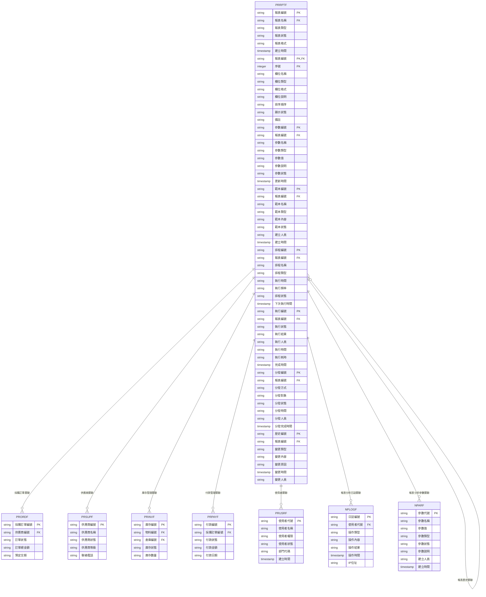

# 採購模組 程式功能規格書 - 報表分析

## 文件基本資訊

| 項目 | 說明 |
|------|------|
| **文件名稱** | 採購模組程式功能規格書 - 報表分析 |
| **模組代號** | PR |
| **版本** | v1.0 |
| **建立日期** | 2024年12月21日 |
| **建立人員** | 系統分析師 |
| **審核人員** | 專案經理 |
| **文件狀態** | 初稿 |
| **最後更新** | 2024年12月21日 |

---

## 目錄

1. [基本資料](#基本資料)
2. [檔案架構與關聯圖](#檔案架構與關聯圖)
3. [檔案名稱與欄位規格](#檔案名稱與欄位規格)
4. [輸出/入螢幕布局與說明](#輸出入螢幕布局與說明)
5. [處理流程程序說明](#處理流程程序說明)
6. [子程序處理邏輯說明](#子程序處理邏輯說明)
7. [錯誤處理程序說明與訊息清冊](#錯誤處理程序說明與訊息清冊)
8. [備註](#備註)

---

## 基本資料

### 1.1 模組概述

#### 1.1.1 模組功能說明
採購模組的報表分析功能主要負責管理企業的採購分析、成本分析、供應商分析、庫存分析、趨勢分析等業務。此功能為企業提供完整的採購數據分析能力，從數據收集、數據處理、數據分析到報表產出，確保決策者能夠獲得準確、即時、有價值的採購相關資訊，支援企業的採購策略制定和營運優化目標。

#### 1.1.2 模組特色
- **多維度採購分析**：供應商、物料、時間、成本等多維度分析
- **智慧化數據處理**：自動化數據收集、清洗、轉換和載入
- **即時報表產出**：支援即時查詢和定期報表產出
- **互動式分析介面**：提供鑽取、篩選、排序等互動分析功能
- **多格式輸出支援**：PDF、Excel、HTML、CSV等多種格式
- **預測分析能力**：採購趨勢預測、成本預測、需求預測等

#### 1.1.3 適用範圍
適用於採購系統的報表分析作業，包括採購分析、成本分析、供應商分析、庫存分析、趨勢分析、績效分析、決策支援等各類報表分析相關業務功能。

### 1.2 技術架構

#### 1.2.1 開發技術
- **程式語言**：RPG、CL、SQL
- **資料庫**：DB2 for i (IBM i)
- **開發工具**：IBM i 開發環境
- **報表工具**：IBM Cognos、Crystal Reports
- **部署環境**：IBM i 7.4

#### 1.2.2 系統需求
- **硬體需求**：IBM i 伺服器、終端機、印表機、報表伺服器
- **軟體需求**：IBM i 作業系統、DB2 for i、IBM i 開發環境、報表工具
- **網路需求**：企業內部網路連線、終端機連線

---

## 檔案架構與關聯圖

### 2.1 資料庫檔案架構

#### 2.1.1 主要資料表


#### 2.1.2 檔案關聯說明
- **PRRPTF (報表分析主檔)**：儲存報表的基本資料和狀態資訊
- **PRRPTF (報表分析明細檔)**：儲存報表的欄位定義和顯示設定
- **PRRPTF (報表分析參數檔)**：儲存報表的參數設定
- **PRRPTF (報表分析範本檔)**：儲存報表的範本定義
- **PRRPTF (報表分析排程檔)**：儲存報表的排程設定
- **PRRPTF (報表分析執行檔)**：儲存報表的執行記錄
- **PRRPTF (報表分析分發檔)**：儲存報表的分發記錄
- **PRRPTF (報表分析歷史檔)**：儲存報表的變更歷史記錄
- **PRORDF (採購訂單檔)**：儲存採購訂單的基本資料
- **PRSUPF (供應商檔)**：儲存供應商的基本資料
- **PRINVF (庫存管理檔)**：儲存庫存管理的基本資料
- **PRPAYF (付款管理檔)**：儲存付款管理的基本資料
- **PRUSRF (使用者檔)**：儲存使用者的基本資料和權限資訊
- **NPLOGF (報表分析日誌檔)**：儲存報表分析相關的操作日誌記錄
- **NPARF (報表分析參數檔)**：儲存報表分析相關的系統參數

### 2.2 系統架構圖

#### 2.2.1 報表分析系統架構


---

## 檔案名稱與欄位規格

### 3.1 主要檔案規格

#### 3.1.1 PRRPTF - 報表分析主檔

| 欄位代號 | 欄位名稱 | 位置 | 長度 | 型態 | 屬性 | 檢核說明 |
|----------|----------|------|------|------|------|----------|
| RPT01 | 公司代碼 | 1-3 | 3 | A | PK | 必填，公司唯一識別碼 |
| RPT02 | 報表編號 | 4-19 | 16 | A | PK | 必填，報表記錄唯一識別碼 |
| RPT03 | 報表名稱 | 20-69 | 50 | A | M | 必填，報表中文名稱 |
| RPT04 | 報表類型 | 70-71 | 2 | A | M | 必填，值：01-採購分析、02-成本分析、03-供應商分析、04-庫存分析、05-趨勢分析、06-績效分析 |
| RPT05 | 報表狀態 | 72-72 | 1 | A | M | 必填，值：A-啟用、I-停用、D-已刪除 |
| RPT06 | 報表格式 | 73-74 | 2 | A | M | 必填，值：01-PDF、02-Excel、03-HTML、04-CSV、05-文字檔 |
| RPT07 | 報表分類 | 75-76 | 2 | A | M | 必填，值：01-營運報表、02-管理報表、03-決策報表、04-分析報表 |
| RPT08 | 報表週期 | 77-78 | 2 | A | M | 必填，值：01-即時、02-日報、03-週報、04-月報、05-季報、06-年報 |
| RPT09 | 報表描述 | 79-178 | 100 | A | O | 選填，報表功能描述 |
| RPT10 | 報表版本 | 179-182 | 4 | A | M | 必填，報表版本號碼 |
| RPT11 | 建立人員 | 183-187 | 5 | A | M | 必填，建立報表的使用者代號 |
| RPT12 | 建立時間 | 188-195 | 8 | T | M | 必填，系統自動產生 |
| RPT13 | 修改人員 | 196-200 | 5 | A | O | 選填，最後修改報表的使用者代號 |
| RPT14 | 修改時間 | 201-208 | 8 | T | O | 選填，最後修改時間 |

#### 3.1.2 PRRPTF - 報表分析明細檔

| 欄位代號 | 欄位名稱 | 位置 | 長度 | 型態 | 屬性 | 檢核說明 |
|----------|----------|------|------|------|------|----------|
| RPTD01 | 報表編號 | 1-16 | 16 | A | PK,FK | 必填，參照PRRPTF.RPT02 |
| RPTD02 | 序號 | 17-19 | 3 | I | PK | 必填，1-999 |
| RPTD03 | 欄位名稱 | 20-49 | 30 | A | M | 必填，欄位英文名稱 |
| RPTD04 | 欄位標題 | 50-79 | 30 | A | M | 必填，欄位中文標題 |
| RPTD05 | 欄位類型 | 80-81 | 2 | A | M | 必填，值：01-文字、02-數字、03-日期、04-時間、05-布林值 |
| RPTD06 | 欄位格式 | 82-91 | 10 | A | O | 選填，欄位顯示格式 |
| RPTD07 | 欄位說明 | 92-141 | 50 | A | O | 選填，欄位功能說明 |
| RPTD08 | 排序順序 | 142-144 | 3 | I | M | 必填，欄位排序順序 |
| RPTD09 | 顯示狀態 | 145-145 | 1 | A | M | 必填，值：Y-顯示、N-隱藏 |
| RPTD10 | 欄位寬度 | 146-148 | 3 | I | M | 必填，欄位顯示寬度 |
| RPTD11 | 對齊方式 | 149-149 | 1 | A | M | 必填，值：L-靠左、C-置中、R-靠右 |
| RPTD12 | 備註 | 150-179 | 30 | A | O | 選填，最多30字元 |

#### 3.1.3 PRRPTF - 報表分析參數檔

| 欄位代號 | 欄位名稱 | 位置 | 長度 | 型態 | 屬性 | 檢核說明 |
|----------|----------|------|------|------|------|----------|
| RPTP01 | 參數編號 | 1-15 | 15 | A | PK | 必填，參數記錄唯一識別碼 |
| RPTP02 | 公司代碼 | 16-18 | 3 | A | M | 必填，公司代碼 |
| RPTP03 | 報表編號 | 19-34 | 16 | A | FK | 必填，參照報表分析主檔 |
| RPTP04 | 參數名稱 | 35-64 | 30 | A | M | 必填，參數名稱 |
| RPTP05 | 參數類型 | 65-66 | 2 | A | M | 必填，值：01-文字、02-數字、03-日期、04-下拉選單、05-複選框 |
| RPTP06 | 參數值 | 67-116 | 50 | A | M | 必填，參數預設值 |
| RPTP07 | 參數說明 | 117-166 | 50 | A | O | 選填，參數功能說明 |
| RPTP08 | 參數狀態 | 167-167 | 1 | A | M | 必填，值：A-啟用、I-停用 |
| RPTP09 | 必填標記 | 168-168 | 1 | A | M | 必填，值：Y-必填、N-選填 |
| RPTP10 | 更新人員 | 169-173 | 5 | A | M | 必填，更新參數的使用者代號 |
| RPTP11 | 更新時間 | 174-181 | 8 | T | M | 必填，系統自動產生 |
| RPTP12 | 備註 | 182-211 | 30 | A | O | 選填，最多30字元 |

#### 3.1.4 PRRPTF - 報表分析範本檔

| 欄位代號 | 欄位名稱 | 位置 | 長度 | 型態 | 屬性 | 檢核說明 |
|----------|----------|------|------|------|------|----------|
| RPTT01 | 範本編號 | 1-15 | 15 | A | PK | 必填，範本記錄唯一識別碼 |
| RPTT02 | 公司代碼 | 16-18 | 3 | A | M | 必填，公司代碼 |
| RPTT03 | 報表編號 | 19-34 | 16 | A | FK | 必填，參照報表分析主檔 |
| RPTT04 | 範本名稱 | 35-64 | 30 | A | M | 必填，範本名稱 |
| RPTT05 | 範本類型 | 65-66 | 2 | A | M | 必填，值：01-標準範本、02-自訂範本、03-系統範本 |
| RPTT06 | 範本內容 | 67-266 | 200 | A | M | 必填，範本內容定義 |
| RPTT07 | 範本狀態 | 267-267 | 1 | A | M | 必填，值：A-啟用、I-停用、D-已刪除 |
| RPTT08 | 範本版本 | 268-271 | 4 | A | M | 必填，範本版本號碼 |
| RPTT09 | 建立人員 | 272-276 | 5 | A | M | 必填，建立範本的使用者代號 |
| RPTT10 | 建立時間 | 277-284 | 8 | T | M | 必填，系統自動產生 |
| RPTT11 | 備註 | 285-314 | 30 | A | O | 選填，最多30字元 |

#### 3.1.5 PRRPTF - 報表分析排程檔

| 欄位代號 | 欄位名稱 | 位置 | 長度 | 型態 | 屬性 | 檢核說明 |
|----------|----------|------|------|------|------|----------|
| RPTS01 | 排程編號 | 1-15 | 15 | A | PK | 必填，排程記錄唯一識別碼 |
| RPTS02 | 公司代碼 | 16-18 | 3 | A | M | 必填，公司代碼 |
| RPTS03 | 報表編號 | 19-34 | 16 | A | FK | 必填，參照報表分析主檔 |
| RPTS04 | 排程名稱 | 35-64 | 30 | A | M | 必填，排程名稱 |
| RPTS05 | 排程類型 | 65-66 | 2 | A | M | 必填，值：01-一次性、02-週期性、03-觸發式 |
| RPTS06 | 執行時間 | 67-74 | 8 | T | M | 必填，排程執行時間 |
| RPTS07 | 執行頻率 | 75-76 | 2 | A | M | 必填，值：01-每分鐘、02-每小時、03-每日、04-每週、05-每月 |
| RPTS08 | 排程狀態 | 77-77 | 1 | A | M | 必填，值：A-啟用、I-停用、P-暫停 |
| RPTS09 | 下次執行時間 | 78-85 | 8 | T | M | 必填，下次執行時間 |
| RPTS10 | 建立人員 | 86-90 | 5 | A | M | 必填，建立排程的使用者代號 |
| RPTS11 | 建立時間 | 91-98 | 8 | T | M | 必填，系統自動產生 |
| RPTS12 | 備註 | 99-128 | 30 | A | O | 選填，最多30字元 |

### 3.2 索引資料

#### 3.2.1 主要索引
- **PRRPTF 主鍵索引**：RPT01 + RPT02 (公司代碼 + 報表編號)
- **PRRPTF 報表名稱索引**：RPT03 (報表名稱)
- **PRRPTF 報表類型索引**：RPT04 (報表類型)
- **PRRPTF 報表狀態索引**：RPT05 (報表狀態)
- **PRRPTF 報表分類索引**：RPT07 (報表分類)

#### 3.2.2 次要索引
- **PRRPTF 主鍵索引**：RPTD01 + RPTD02 (報表編號 + 序號)
- **PRRPTF 報表編號索引**：RPTD01 (報表編號)
- **PRRPTF 欄位名稱索引**：RPTD03 (欄位名稱)
- **RPTP 主鍵索引**：RPTP01 (參數編號)
- **RPTP 報表編號索引**：RPTP03 (報表編號)
- **RPTT 主鍵索引**：RPTT01 (範本編號)
- **RPTT 報表編號索引**：RPTT03 (報表編號)
- **RPTS 主鍵索引**：RPTS01 (排程編號)
- **RPTS 報表編號索引**：RPTS03 (報表編號)

---

## 輸出/入螢幕布局與說明

### 4.1 報表分析主畫面

#### 4.1.1 畫面布局
```
┌─────────────────────────────────────────────────────────────┐
│                    報表分析系統                            │
├─────────────────────────────────────────────────────────────┤
│ 功能選項：                                                  │
│  [1]報表查詢作業  [2]報表設計管理  [3]報表排程管理  [4]報表執行│
│  [5]報表分發  [6]報表範本  [7]系統設定  [8]離開            │
├─────────────────────────────────────────────────────────────┤
│ 系統狀態：                                                  │
│  報表總數：[89] 啟用：[67] 停用：[18] 已刪除：[4]           │
│  今日執行：[23] 排程中：[12] 執行中：[5]                    │
│  最後更新：[2024/12/21 14:30:00] 更新人員：[ADMIN]        │
├─────────────────────────────────────────────────────────────┤
│ 快速功能：                                                  │
│  [報表查詢] [報表設計] [報表排程] [報表執行]                │
├─────────────────────────────────────────────────────────────┤
│ 功能鍵：F1=說明  F3=離開  F4=查詢  F6=設計  F8=執行  F12=取消│
└─────────────────────────────────────────────────────────────┘
```

#### 4.1.2 畫面說明
- **功能選項區**：提供報表分析的主要功能選項
- **系統狀態區**：顯示當前報表的狀態和統計資訊
- **快速功能區**：提供常用的快速操作功能
- **功能鍵區**：說明可使用的功能鍵

### 4.2 報表查詢作業畫面

#### 4.2.1 畫面布局
```
┌─────────────────────────────────────────────────────────────┐
│                      報表查詢作業                          │
├─────────────────────────────────────────────────────────────┤
│ 查詢條件：                                                  │
│  報表名稱：[                ] 報表類型：[全部 ▼]            │
│  報表分類：[全部 ▼] 報表狀態：[全部 ▼] [查詢] [清除]        │
├─────────────────────────────────────────────────────────────┤
│ 報表清單：                                                  │
│ ┌─────┬────────────────┬──────────┬──────────┬──────────┬────────┐ │
│ │序號 │報表名稱        │報表類型  │報表分類  │報表狀態  │建立時間 │ │
│ ├─────┼────────────────┼──────────┼──────────┼──────────┼────────┤ │
│ │  1  │採購分析報表    │採購分析  │分析報表  │啟用      │2024/12/21│ │
│ │  2  │成本分析報表    │成本分析  │分析報表  │啟用      │2024/12/21│ │
│ └─────┴────────────────┴──────────┴──────────┴──────────┴────────┘ │
├─────────────────────────────────────────────────────────────┤
│ 操作：[報表查詢] [報表設計] [報表執行] [報表分發]            │
│ 功能鍵：F1=說明  F3=離開  F4=查詢  F6=設計  F8=執行  F12=取消│
└─────────────────────────────────────────────────────────────┘
```

---

## 處理流程程序說明

### 5.1 報表查詢流程

#### 5.1.1 主要處理流程


#### 5.1.2 資料驗證規則
1. **查詢條件驗證**：檢查查詢條件是否有效
2. **權限驗證**：檢查使用者是否有報表查詢權限
3. **資料範圍驗證**：檢查查詢資料範圍是否合理
4. **系統狀態驗證**：檢查系統是否正常運行

### 5.2 報表設計流程

#### 5.2.1 主要處理流程


### 5.3 報表執行流程

#### 5.3.1 主要處理流程


### 5.4 報表分發流程

#### 5.4.1 主要處理流程


---

## 子程序處理邏輯說明

### 6.1 報表編號產生子程序

#### 6.1.1 編號產生邏輯


#### 6.1.2 編號格式說明
- **報表編號格式**：RPT + 報表類型(2位) + 日期(8位) + 序號(4位)
- **範例**：RPT + 01 + 20241221 + 0001 = RPT01202412210001

### 6.2 報表分析子程序

#### 6.2.1 報表分析邏輯


### 6.3 報表產出子程序

#### 6.3.1 報表產出邏輯


### 6.4 報表分發子程序

#### 6.4.1 報表分發邏輯


---

## 錯誤處理程序說明與訊息清冊

### 7.1 錯誤處理程序

#### 7.1.1 錯誤處理流程


### 7.2 錯誤訊息清冊

#### 7.2.1 資料驗證錯誤訊息

| 錯誤代碼 | 錯誤訊息 | 錯誤原因 | 解決方法 |
|----------|----------|----------|----------|
| **PR701** | 報表編號不能為空 | 報表編號為必填欄位 | 請輸入報表編號 |
| **PR702** | 報表名稱不能為空 | 報表名稱為必填欄位 | 請輸入報表名稱 |
| **PR703** | 報表類型不能為空 | 報表類型為必填欄位 | 請選擇報表類型 |
| **PR704** | 報表狀態不能為空 | 報表狀態為必填欄位 | 請選擇報表狀態 |
| **PR705** | 報表格式不能為空 | 報表格式為必填欄位 | 請選擇報表格式 |

#### 7.2.2 報表查詢錯誤訊息

| 錯誤代碼 | 錯誤訊息 | 錯誤原因 | 解決方法 |
|----------|----------|----------|----------|
| **PR801** | 查詢條件無效 | 查詢條件設定不正確 | 請檢查查詢條件 |
| **PR802** | 查詢權限不足 | 使用者沒有查詢權限 | 請聯繫系統管理員 |
| **PR803** | 查詢結果為空 | 沒有符合條件的報表記錄 | 請調整查詢條件 |
| **PR804** | 查詢執行失敗 | 查詢操作執行失敗 | 請聯繫系統管理員 |
| **PR805** | 查詢超時 | 查詢執行時間過長 | 請縮小查詢範圍 |

#### 7.2.3 報表執行錯誤訊息

| 錯誤代碼 | 錯誤訊息 | 錯誤原因 | 解決方法 |
|----------|----------|----------|----------|
| **PR901** | 報表記錄不存在 | 報表記錄未建立 | 請先建立報表記錄 |
| **PR902** | 報表範本不存在 | 報表範本未設定 | 請先設定報表範本 |
| **PR903** | 報表執行失敗 | 報表執行操作失敗 | 請聯繫系統管理員 |
| **PR904** | 報表資料不足 | 報表資料不足以產出 | 請檢查報表資料 |
| **PR905** | 報表產出失敗 | 報表產出操作失敗 | 請聯繫系統管理員 |

### 7.3 錯誤處理建議

#### 7.3.1 使用者操作建議
1. **檢查必填欄位**：確保所有必填欄位都已填寫
2. **驗證資料格式**：檢查資料格式是否符合要求
3. **檢查權限設定**：確認有執行該操作的權限
4. **檢查系統狀態**：確認系統運行正常

#### 7.3.2 系統管理建議
1. **監控系統錯誤**：定期檢查系統錯誤日誌
2. **檢查報表設定**：定期檢查報表相關設定
3. **檢查排程設定**：定期檢查報表排程設定
4. **備份重要資料**：定期備份報表分析相關資料

---

## 備註

### 8.1 開發注意事項

#### 8.1.1 程式開發注意事項
1. **資料完整性**：確保報表分析資料的完整性和一致性
2. **報表準確性**：實作準確的報表計算和產出機制
3. **效能優化**：提供高效的報表查詢和產出功能
4. **格式支援**：支援多種報表格式和輸出方式
5. **日誌記錄**：記錄詳細的操作日誌，便於問題診斷

#### 8.1.2 測試注意事項
1. **單元測試**：每個功能模組都必須進行單元測試
2. **整合測試**：測試各模組間的整合情況
3. **報表準確性測試**：測試報表計算的準確性
4. **效能測試**：測試報表查詢和產出的效能
5. **使用者接受度測試**：進行使用者接受度測試

### 8.2 維護注意事項

#### 8.2.1 日常維護注意事項
1. **監控系統狀態**：定期監控系統的運行狀態
2. **檢查報表設定**：定期檢查報表相關設定
3. **檢查排程設定**：定期檢查報表排程設定
4. **清理過期資料**：定期清理過期的歷史資料
5. **備份重要資料**：定期備份重要的報表分析資料

#### 8.2.2 版本更新注意事項
1. **相容性檢查**：更新前必須檢查與現有系統的相容性
2. **資料遷移**：制定詳細的資料遷移計畫
3. **使用者通知**：提前通知使用者版本更新計畫
4. **回滾計畫**：制定詳細的回滾計畫
5. **測試驗證**：更新後必須進行充分的測試驗證

### 8.3 未來擴充建議

#### 8.3.1 功能擴充建議
1. **智慧化報表分析**：整合AI功能，提供智慧化報表分析建議
2. **行動化支援**：支援行動裝置報表查詢和檢視
3. **自動化報表產出**：實作自動化報表產出機制
4. **預測分析**：增加採購趨勢預測分析功能
5. **即時儀表板**：提供即時採購績效儀表板

#### 8.3.2 技術改進建議
1. **雲端部署**：考慮採用雲端部署模式
2. **微服務架構**：考慮採用微服務架構
3. **API整合**：提供標準化的API介面
4. **資料分析**：整合資料分析功能
5. **大數據處理**：整合大數據處理技術，提升報表分析能力

---

## 附錄

### A.1 相關文件清單
- 採購模組程式功能規格書 - 採購管理
- 採購模組程式功能規格書 - 供應商管理
- 採購模組程式功能規格書 - 採購申請
- 採購模組程式功能規格書 - 採購訂單
- 採購模組程式功能規格書 - 收貨管理
- 採購模組程式功能規格書 - 付款管理
- 採購模組程式功能規格書 - 庫存管理
- 採購模組程式功能規格書 - 系統管理
- 採購模組業務邏輯分析與API設計
- 採購模組操作手冊 - 報表分析

### A.2 修訂記錄

| 版本 | 修訂日期 | 修訂人員 | 修訂內容 | 修訂原因 |
|------|----------|----------|----------|----------|
| v1.0 | 2024/12/21 | 系統分析師 | 初始版本建立 | 新功能開發 |

### A.3 聯絡資訊
- **專案經理**：[專案經理姓名]
- **系統分析師**：[系統分析師姓名]
- **技術支援**：[技術支援聯絡方式]
- **專案信箱**：[專案信箱地址]
