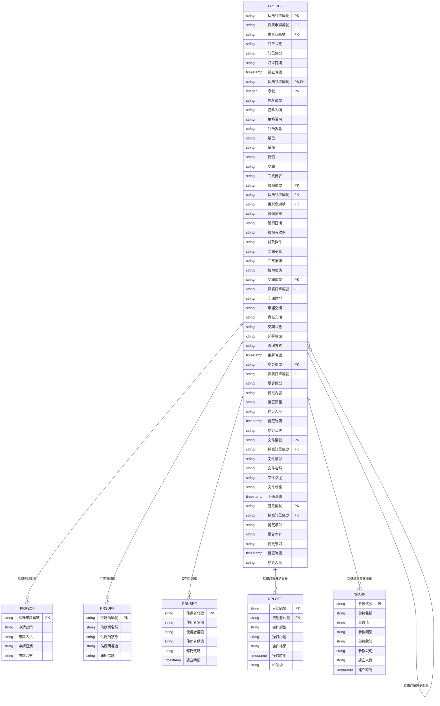
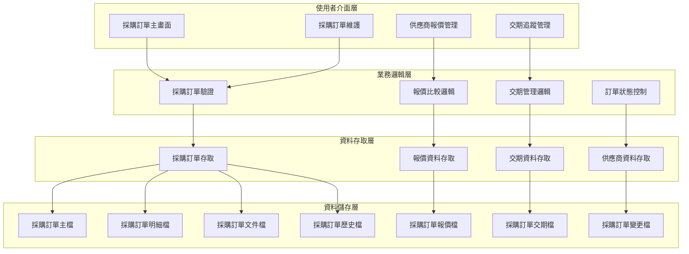
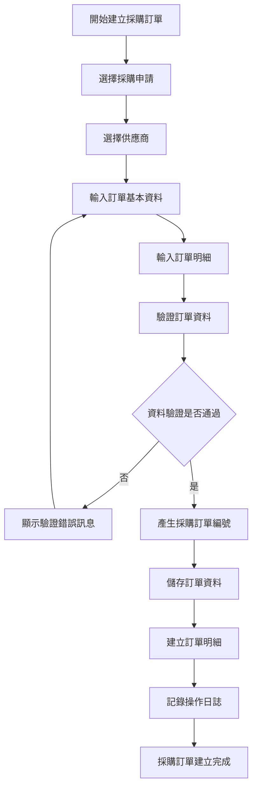
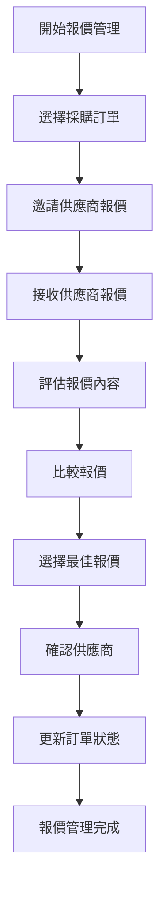
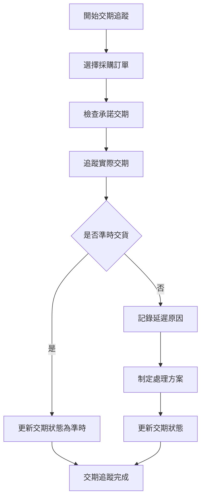
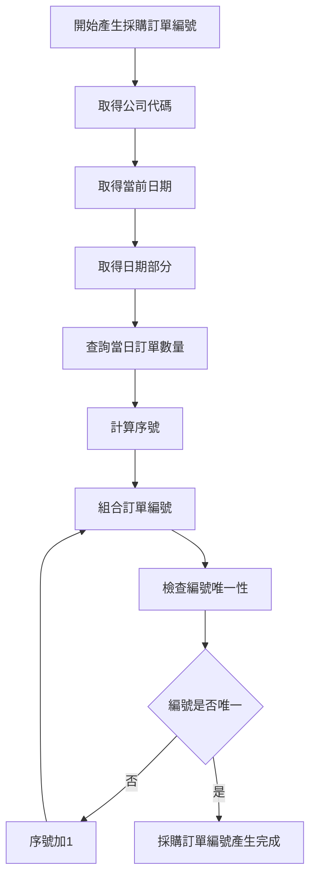
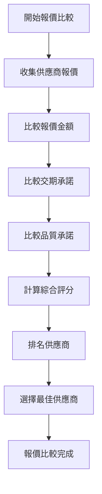
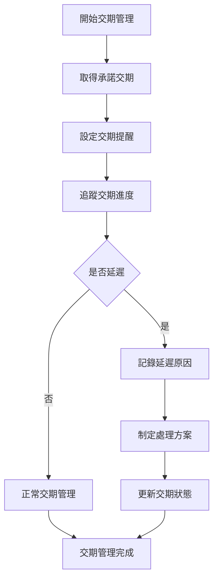
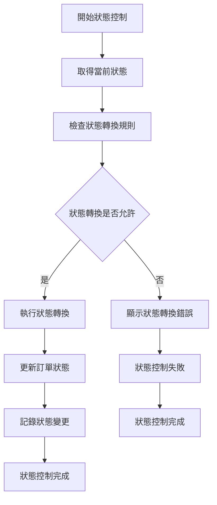
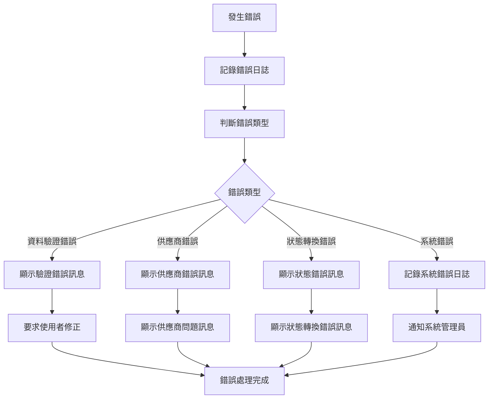

# 採購模組 程式功能規格書 - 採購訂單

## 文件基本資訊

| 項目 | 說明 |
|------|------|
| **文件名稱** | 採購模組程式功能規格書 - 採購訂單 |
| **模組代號** | PR |
| **版本** | v1.0 |
| **建立日期** | 2024年12月21日 |
| **建立人員** | 系統分析師 |
| **審核人員** | 專案經理 |
| **文件狀態** | 初稿 |
| **最後更新** | 2024年12月21日 |

---

## 目錄

1. [基本資料](#基本資料)
2. [檔案架構與關聯圖](#檔案架構與關聯圖)
3. [檔案名稱與欄位規格](#檔案名稱與欄位規格)
4. [輸出/入螢幕布局與說明](#輸出入螢幕布局與說明)
5. [處理流程程序說明](#處理流程程序說明)
6. [子程序處理邏輯說明](#子程序處理邏輯說明)
7. [錯誤處理程序說明與訊息清冊](#錯誤處理程序說明與訊息清冊)
8. [備註](#備註)

---

## 基本資料

### 1.1 模組概述

#### 1.1.1 模組功能說明
採購模組的採購訂單功能主要負責管理企業的採購訂單建立、供應商選擇、價格談判、訂單追蹤、交期管理等業務。此功能為企業提供完整的採購訂單生命週期管理，從訂單建立、供應商報價、價格比較、訂單確認、交期追蹤到訂單完成，確保採購流程的效率和成本控制，支援企業的採購策略和營運目標。

#### 1.1.2 模組特色
- **完整採購訂單生命週期管理**：從訂單建立到訂單完成的完整流程
- **多供應商報價比較**：支援多供應商報價、價格比較、最佳供應商選擇
- **訂單狀態追蹤**：即時追蹤訂單狀態、交期管理、異常處理
- **價格談判支援**：價格歷史分析、成本分析、談判策略支援
- **交期管理**：交期承諾、交期追蹤、延遲預警
- **品質控制**：品質要求、檢驗標準、品質追蹤

#### 1.1.3 適用範圍
適用於採購系統的採購訂單作業，包括採購訂單建立、供應商報價管理、價格談判、訂單確認、交期追蹤、訂單變更、訂單取消等各類採購訂單相關業務功能。

### 1.2 技術架構

#### 1.2.1 開發技術
- **程式語言**：RPG、CL、SQL
- **資料庫**：DB2 for i (IBM i)
- **開發工具**：IBM i 開發環境
- **報表工具**：IBM Cognos、Crystal Reports
- **部署環境**：IBM i 7.4

#### 1.2.2 系統需求
- **硬體需求**：IBM i 伺服器、終端機、印表機
- **軟體需求**：IBM i 作業系統、DB2 for i、IBM i 開發環境
- **網路需求**：企業內部網路連線、終端機連線

---

## 檔案架構與關聯圖

### 2.1 資料庫檔案架構

#### 2.1.1 主要資料表


#### 2.1.2 檔案關聯說明
- **PRORDF (採購訂單主檔)**：儲存採購訂單的基本資料和狀態資訊
- **PRORDF (採購訂單明細檔)**：儲存採購訂單的詳細物料資訊
- **PRORDF (採購訂單報價檔)**：儲存供應商的報價資料
- **PRORDF (採購訂單交期檔)**：儲存交期承諾和實際交期資料
- **PRORDF (採購訂單變更檔)**：儲存訂單變更記錄
- **PRORDF (採購訂單文件檔)**：儲存訂單相關文件
- **PRORDF (採購訂單歷史檔)**：儲存訂單變更歷史記錄
- **PRREQF (採購申請檔)**：儲存採購申請的基本資料
- **PRSUPF (供應商檔)**：儲存供應商的基本資料
- **PRUSRF (使用者檔)**：儲存使用者的基本資料和權限資訊
- **NPLOGF (採購訂單日誌檔)**：儲存採購訂單相關的操作日誌記錄
- **NPARF (採購訂單參數檔)**：儲存採購訂單相關的系統參數

### 2.2 系統架構圖

#### 2.2.1 採購訂單系統架構


---

## 檔案名稱與欄位規格

### 3.1 主要檔案規格

#### 3.1.1 PRORDF - 採購訂單主檔

| 欄位代號 | 欄位名稱 | 位置 | 長度 | 型態 | 屬性 | 檢核說明 |
|----------|----------|------|------|------|------|----------|
| ORD01 | 公司代碼 | 1-3 | 3 | A | PK | 必填，公司唯一識別碼 |
| ORD02 | 採購訂單編號 | 4-19 | 16 | A | PK | 必填，採購訂單唯一識別碼 |
| ORD03 | 採購申請編號 | 20-35 | 16 | A | FK | 必填，參照採購申請檔 |
| ORD04 | 供應商編號 | 36-50 | 15 | A | FK | 必填，參照供應商檔 |
| ORD05 | 訂單狀態 | 51-51 | 1 | A | M | 必填，值：D-草稿、S-已送出、C-已確認、P-已核准、I-執行中、F-已完成、X-已取消 |
| ORD06 | 訂單類型 | 52-53 | 2 | A | M | 必填，值：01-一般訂單、02-緊急訂單、03-策略訂單、04-框架訂單 |
| ORD07 | 訂單日期 | 54-61 | 8 | D | M | 必填，訂單建立日期 |
| ORD08 | 預定交期 | 62-69 | 8 | D | M | 必填，預定交貨日期 |
| ORD09 | 訂單總金額 | 70-79 | 10 | I | M | 必填，訂單總金額（元） |
| ORD10 | 付款條件 | 80-84 | 5 | A | M | 必填，付款條件代碼 |
| ORD11 | 交貨地點 | 85-144 | 60 | A | M | 必填，交貨地點 |
| ORD12 | 聯絡人員 | 145-149 | 5 | A | M | 必填，聯絡人員代號 |
| ORD13 | 聯絡電話 | 150-164 | 15 | A | M | 必填，聯絡電話 |
| ORD14 | 品質要求 | 165-214 | 50 | A | O | 選填，品質要求說明 |
| ORD15 | 包裝要求 | 215-264 | 50 | A | O | 選填，包裝要求說明 |
| ORD16 | 運輸要求 | 265-314 | 50 | A | O | 選填，運輸要求說明 |
| ORD17 | 特殊要求 | 315-364 | 50 | A | O | 選填，特殊要求說明 |
| ORD18 | 備註 | 365-404 | 40 | A | O | 選填，訂單相關備註 |
| ORD19 | 建立人員 | 405-409 | 5 | A | M | 必填，建立訂單的使用者代號 |
| ORD20 | 建立時間 | 410-417 | 8 | T | M | 必填，系統自動產生 |
| ORD21 | 修改人員 | 418-422 | 5 | A | O | 選填，最後修改訂單的使用者代號 |
| ORD22 | 修改時間 | 423-430 | 8 | T | O | 選填，最後修改時間 |

#### 3.1.2 PRORDF - 採購訂單明細檔

| 欄位代號 | 欄位名稱 | 位置 | 長度 | 型態 | 屬性 | 檢核說明 |
|----------|----------|------|------|------|------|----------|
| ORDD01 | 採購訂單編號 | 1-16 | 16 | A | PK,FK | 必填，參照PRORDF.ORD02 |
| ORDD02 | 序號 | 17-19 | 3 | I | PK | 必填，1-999 |
| ORDD03 | 物料編號 | 20-39 | 20 | A | M | 必填，物料編號 |
| ORDD04 | 物料名稱 | 40-69 | 30 | A | M | 必填，物料中文名稱 |
| ORDD05 | 規格說明 | 70-119 | 50 | A | O | 選填，物料規格說明 |
| ORDD06 | 訂購數量 | 120-129 | 10 | I | M | 必填，訂購數量 |
| ORDD07 | 單位 | 130-134 | 5 | A | M | 必填，計量單位 |
| ORDD08 | 單價 | 135-144 | 10 | I | M | 必填，單價（元） |
| ORDD09 | 總價 | 145-154 | 10 | I | M | 必填，總價（元） |
| ORDD10 | 交期 | 155-162 | 8 | D | M | 必填，物料交期 |
| ORDD11 | 品質要求 | 163-212 | 50 | A | O | 選填，品質要求說明 |
| ORDD12 | 備註 | 213-242 | 30 | A | O | 選填，最多30字元 |

#### 3.1.3 PRORDF - 採購訂單報價檔

| 欄位代號 | 欄位名稱 | 位置 | 長度 | 型態 | 屬性 | 檢核說明 |
|----------|----------|------|------|------|------|----------|
| ORDQ01 | 報價編號 | 1-15 | 15 | A | PK | 必填，報價記錄唯一識別碼 |
| ORDQ02 | 公司代碼 | 16-18 | 3 | A | M | 必填，公司代碼 |
| ORDQ03 | 採購訂單編號 | 19-34 | 16 | A | FK | 必填，參照採購訂單主檔 |
| ORDQ04 | 供應商編號 | 35-49 | 15 | A | FK | 必填，參照供應商檔 |
| ORDQ05 | 報價金額 | 50-59 | 10 | I | M | 必填，報價總金額（元） |
| ORDQ06 | 報價日期 | 60-67 | 8 | D | M | 必填，報價日期 |
| ORDQ07 | 報價有效期 | 68-75 | 8 | D | M | 必填，報價有效期 |
| ORDQ08 | 付款條件 | 76-80 | 5 | A | M | 必填，付款條件代碼 |
| ORDQ09 | 交期承諾 | 81-88 | 8 | D | M | 必填，承諾交期 |
| ORDQ10 | 品質承諾 | 89-138 | 50 | A | O | 選填，品質承諾說明 |
| ORDQ11 | 報價狀態 | 139-139 | 1 | A | M | 必填，值：P-待評估、A-已接受、R-已拒絕、E-已過期 |
| ORDQ12 | 報價備註 | 140-189 | 50 | A | O | 選填，報價相關備註 |
| ORDQ13 | 更新人員 | 190-194 | 5 | A | M | 必填，更新報價資料的使用者代號 |
| ORDQ14 | 更新時間 | 195-202 | 8 | T | M | 必填，系統自動產生 |
| ORDQ15 | 備註 | 203-232 | 30 | A | O | 選填，最多30字元 |

#### 3.1.4 PRORDF - 採購訂單交期檔

| 欄位代號 | 欄位名稱 | 位置 | 長度 | 型態 | 屬性 | 檢核說明 |
|----------|----------|------|------|------|------|----------|
| ORDDT01 | 交期編號 | 1-15 | 15 | A | PK | 必填，交期記錄唯一識別碼 |
| ORDDT02 | 公司代碼 | 16-18 | 3 | A | M | 必填，公司代碼 |
| ORDDT03 | 採購訂單編號 | 19-34 | 16 | A | FK | 必填，參照採購訂單主檔 |
| ORDDT04 | 交期類型 | 35-36 | 2 | A | M | 必填，值：01-承諾交期、02-實際交期、03-調整交期 |
| ORDDT05 | 承諾交期 | 37-44 | 8 | D | M | 必填，承諾交貨日期 |
| ORDDT06 | 實際交期 | 45-52 | 8 | D | O | 選填，實際交貨日期 |
| ORDDT07 | 交期狀態 | 53-53 | 1 | A | M | 必填，值：P-待交貨、O-準時、L-延遲、C-已完成 |
| ORDDT08 | 延遲原因 | 54-103 | 50 | A | O | 選填，延遲原因說明 |
| ORDDT09 | 處理方式 | 104-153 | 50 | A | O | 選填，處理方式說明 |
| ORDDT10 | 更新人員 | 154-158 | 5 | A | M | 必填，更新交期資料的使用者代號 |
| ORDDT11 | 更新時間 | 159-166 | 8 | T | M | 必填，系統自動產生 |
| ORDDT12 | 備註 | 167-196 | 30 | A | O | 選填，最多30字元 |

#### 3.1.5 PRORDF - 採購訂單變更檔

| 欄位代號 | 欄位名稱 | 位置 | 長度 | 型態 | 屬性 | 檢核說明 |
|----------|----------|------|------|------|------|----------|
| ORDC01 | 變更編號 | 1-15 | 15 | A | PK | 必填，變更記錄唯一識別碼 |
| ORDC02 | 公司代碼 | 16-18 | 3 | A | M | 必填，公司代碼 |
| ORDC03 | 採購訂單編號 | 19-34 | 16 | A | FK | 必填，參照採購訂單主檔 |
| ORDC04 | 變更類型 | 35-36 | 2 | A | M | 必填，值：01-數量變更、02-價格變更、03-交期變更、04-規格變更、05-取消訂單 |
| ORDC05 | 變更內容 | 37-86 | 50 | A | M | 必填，變更內容說明 |
| ORDC06 | 變更原因 | 87-136 | 50 | A | M | 必填，變更原因說明 |
| ORDC07 | 變更人員 | 137-141 | 5 | A | M | 必填，變更人員代號 |
| ORDC08 | 變更時間 | 142-149 | 8 | T | M | 必填，系統自動產生 |
| ORDC09 | 變更狀態 | 150-150 | 1 | A | M | 必填，值：P-待審核、A-已核准、R-已拒絕 |
| ORDC10 | 審核人員 | 151-155 | 5 | A | O | 選填，審核人員代號 |
| ORDC11 | 審核時間 | 156-163 | 8 | T | O | 選填，審核時間 |
| ORDC12 | 備註 | 164-193 | 30 | A | O | 選填，最多30字元 |

### 3.2 索引資料

#### 3.2.1 主要索引
- **PRORDF 主鍵索引**：ORD01 + ORD02 (公司代碼 + 採購訂單編號)
- **PRORDF 採購申請編號索引**：ORD03 (採購申請編號)
- **PRORDF 供應商編號索引**：ORD04 (供應商編號)
- **PRORDF 訂單狀態索引**：ORD05 (訂單狀態)
- **PRORDF 訂單類型索引**：ORD06 (訂單類型)

#### 3.2.2 次要索引
- **PRORDF 主鍵索引**：ORDD01 + ORDD02 (採購訂單編號 + 序號)
- **PRORDF 採購訂單編號索引**：ORDD01 (採購訂單編號)
- **PRORDF 物料編號索引**：ORDD03 (物料編號)
- **PRORDQ 主鍵索引**：ORDQ01 (報價編號)
- **PRORDQ 採購訂單編號索引**：ORDQ03 (採購訂單編號)
- **PRORDQ 供應商編號索引**：ORDQ04 (供應商編號)
- **PRORDT 主鍵索引**：ORDT01 (交期編號)
- **PRORDT 採購訂單編號索引**：ORDT03 (採購訂單編號)
- **PRORDC 主鍵索引**：ORDC01 (變更編號)
- **PRORDC 採購訂單編號索引**：ORDC03 (採購訂單編號)

---

## 輸出/入螢幕布局與說明

### 4.1 採購訂單主畫面

#### 4.1.1 畫面布局
```
┌─────────────────────────────────────────────────────────────┐
│                    採購訂單系統                            │
├─────────────────────────────────────────────────────────────┤
│ 功能選項：                                                  │
│  [1]採購訂單維護  [2]供應商報價管理  [3]交期追蹤管理  [4]訂單變更│
│  [5]採購訂單查詢  [6]報表分析  [7]系統設定  [8]離開        │
├─────────────────────────────────────────────────────────────┤
│ 系統狀態：                                                  │
│  採購訂單總數：[456] 草稿中：[23] 已送出：[67] 已確認：[89]   │
│  已核准：[123] 執行中：[78] 已完成：[56] 已取消：[20]        │
│  最後更新：[2024/12/21 14:30:00] 更新人員：[ADMIN]        │
├─────────────────────────────────────────────────────────────┤
│ 快速功能：                                                  │
│  [新增訂單] [訂單查詢] [報價管理] [交期追蹤]                │
├─────────────────────────────────────────────────────────────┤
│ 功能鍵：F1=說明  F3=離開  F4=新增  F6=查詢  F8=報價  F12=取消│
└─────────────────────────────────────────────────────────────┘
```

#### 4.1.2 畫面說明
- **功能選項區**：提供採購訂單的主要功能選項
- **系統狀態區**：顯示當前採購訂單的狀態和統計資訊
- **快速功能區**：提供常用的快速操作功能
- **功能鍵區**：說明可使用的功能鍵

### 4.2 採購訂單維護畫面

#### 4.2.1 畫面布局
```
┌─────────────────────────────────────────────────────────────┐
│                      採購訂單維護                          │
├─────────────────────────────────────────────────────────────┤
│ 查詢條件：                                                  │
│  訂單編號：[                ] 供應商：[               ▼]    │
│  訂單狀態：[全部 ▼] 訂單類型：[全部 ▼] [查詢] [清除]        │
├─────────────────────────────────────────────────────────────┤
│ 採購訂單清單：                                              │
│ ┌─────┬────────────────┬──────────┬──────────┬──────────┬────────┐ │
│ │序號 │訂單編號        │供應商    │訂單狀態  │訂單金額  │交期    │ │
│ ├─────┼────────────────┼──────────┼──────────┼──────────┼────────┤ │
│ │  1  │PO202412210001  │ABC供應商 │已核准    │$50,000   │2024/12/25│ │
│ │  2  │PO202412210002  │XYZ供應商 │執行中    │$25,000   │2024/12/30│ │
│ └─────┴────────────────┴──────────┴──────────┴──────────┴────────┘ │
├─────────────────────────────────────────────────────────────┤
│ 操作：[新增訂單] [修改訂單] [取消訂單] [複製訂單]            │
│ 功能鍵：F1=說明  F3=離開  F4=新增  F6=修改  F8=取消  F12=取消│
└─────────────────────────────────────────────────────────────┘
```

---

## 處理流程程序說明

### 5.1 採購訂單建立流程

#### 5.1.1 主要處理流程


#### 5.1.2 資料驗證規則
1. **必填欄位驗證**：供應商編號、訂單日期、預定交期、訂單總金額、付款條件、交貨地點等必填欄位
2. **供應商驗證**：檢查供應商是否為啟用狀態
3. **採購申請驗證**：檢查採購申請是否已核准
4. **金額驗證**：訂單總金額必須大於0
5. **日期驗證**：預定交期不能早於訂單日期

### 5.2 供應商報價管理流程

#### 5.2.1 主要處理流程


### 5.3 交期追蹤管理流程

#### 5.3.1 主要處理流程


---

## 子程序處理邏輯說明

### 6.1 採購訂單編號產生子程序

#### 6.1.1 編號產生邏輯


#### 6.1.2 編號格式說明
- **採購訂單編號格式**：PO + 日期(8位) + 序號(4位)
- **範例**：PO + 20241221 + 0001 = PO202412210001

### 6.2 報價比較子程序

#### 6.2.1 報價比較邏輯


### 6.3 交期管理子程序

#### 6.3.1 交期管理邏輯


### 6.4 訂單狀態控制子程序

#### 6.4.1 狀態控制邏輯


---

## 錯誤處理程序說明與訊息清冊

### 7.1 錯誤處理程序

#### 7.1.1 錯誤處理流程


### 7.2 錯誤訊息清冊

#### 7.2.1 資料驗證錯誤訊息

| 錯誤代碼 | 錯誤訊息 | 錯誤原因 | 解決方法 |
|----------|----------|----------|----------|
| **PR701** | 供應商編號不能為空 | 供應商編號為必填欄位 | 請選擇供應商 |
| **PR702** | 訂單日期不能為空 | 訂單日期為必填欄位 | 請輸入訂單日期 |
| **PR703** | 預定交期不能早於訂單日期 | 交期設定錯誤 | 請調整預定交期 |
| **PR704** | 訂單總金額必須大於0 | 訂單總金額設定錯誤 | 請輸入正確的金額 |
| **PR705** | 付款條件不能為空 | 付款條件為必填欄位 | 請選擇付款條件 |

#### 7.2.2 供應商錯誤訊息

| 錯誤代碼 | 錯誤訊息 | 錯誤原因 | 解決方法 |
|----------|----------|----------|----------|
| **PR801** | 供應商不存在 | 供應商編號錯誤 | 請檢查供應商編號 |
| **PR802** | 供應商已停用 | 供應商狀態為停用 | 請選擇其他供應商 |
| **PR803** | 供應商等級不符合要求 | 供應商等級過低 | 請選擇符合等級要求的供應商 |
| **PR804** | 供應商報價已過期 | 報價有效期已過 | 請重新取得報價 |
| **PR805** | 供應商交期承諾不當 | 交期承諾不合理 | 請與供應商重新協商 |

#### 7.2.3 狀態轉換錯誤訊息

| 錯誤代碼 | 錯誤訊息 | 錯誤原因 | 解決方法 |
|----------|----------|----------|----------|
| **PR901** | 狀態轉換不允許 | 當前狀態不允許轉換 | 請檢查訂單狀態 |
| **PR902** | 缺少必要審核 | 需要審核才能轉換狀態 | 請完成必要審核 |
| **PR903** | 供應商未確認 | 供應商尚未確認 | 請先確認供應商 |
| **PR904** | 報價未評估 | 報價尚未評估完成 | 請先完成報價評估 |
| **PR905** | 訂單已鎖定 | 訂單已被鎖定 | 請聯繫系統管理員 |

### 7.3 錯誤處理建議

#### 7.3.1 使用者操作建議
1. **檢查必填欄位**：確保所有必填欄位都已填寫
2. **驗證資料格式**：檢查資料格式是否符合要求
3. **檢查供應商狀態**：確認供應商為啟用狀態
4. **檢查狀態轉換**：確認狀態轉換符合業務規則

#### 7.3.2 系統管理建議
1. **監控系統錯誤**：定期檢查系統錯誤日誌
2. **檢查供應商資料**：定期檢查供應商狀態和等級
3. **檢查狀態轉換規則**：定期檢查狀態轉換設定
4. **備份重要資料**：定期備份採購訂單相關資料

---

## 備註

### 8.1 開發注意事項

#### 8.1.1 程式開發注意事項
1. **資料完整性**：確保採購訂單資料的完整性和一致性
2. **狀態控制**：實作完整的訂單狀態控制機制
3. **供應商管理**：實作供應商選擇和評估機制
4. **錯誤處理**：提供完整的錯誤處理機制
5. **日誌記錄**：記錄詳細的操作日誌，便於問題診斷

#### 8.1.2 測試注意事項
1. **單元測試**：每個功能模組都必須進行單元測試
2. **整合測試**：測試各模組間的整合情況
3. **狀態轉換測試**：測試訂單狀態轉換的完整性
4. **供應商管理測試**：測試供應商選擇和評估功能
5. **使用者接受度測試**：進行使用者接受度測試

### 8.2 維護注意事項

#### 8.2.1 日常維護注意事項
1. **監控系統狀態**：定期監控系統的運行狀態
2. **檢查供應商資料**：定期檢查供應商狀態和等級
3. **檢查狀態轉換規則**：定期檢查狀態轉換設定
4. **清理過期資料**：定期清理過期的歷史資料
5. **備份重要資料**：定期備份重要的採購訂單資料

#### 8.2.2 版本更新注意事項
1. **相容性檢查**：更新前必須檢查與現有系統的相容性
2. **資料遷移**：制定詳細的資料遷移計畫
3. **使用者通知**：提前通知使用者版本更新計畫
4. **回滾計畫**：制定詳細的回滾計畫
5. **測試驗證**：更新後必須進行充分的測試驗證

### 8.3 未來擴充建議

#### 8.3.1 功能擴充建議
1. **電子化採購**：實作電子化採購流程
2. **行動化支援**：支援行動裝置存取
3. **供應商門戶**：建立供應商自助服務門戶
4. **自動化採購**：實作自動化採購決策
5. **採購分析**：增加採購分析功能

#### 8.3.2 技術改進建議
1. **雲端部署**：考慮採用雲端部署模式
2. **微服務架構**：考慮採用微服務架構
3. **API整合**：提供標準化的API介面
4. **資料分析**：整合資料分析功能
5. **人工智慧**：整合AI功能，提供智慧化建議

---

## 附錄

### A.1 相關文件清單
- 採購模組程式功能規格書 - 採購管理
- 採購模組程式功能規格書 - 供應商管理
- 採購模組程式功能規格書 - 採購申請
- 採購模組程式功能規格書 - 收貨管理
- 採購模組程式功能規格書 - 付款管理
- 採購模組程式功能規格書 - 庫存管理
- 採購模組程式功能規格書 - 報表分析
- 採購模組程式功能規格書 - 系統管理
- 採購模組業務邏輯分析與API設計
- 採購模組操作手冊 - 採購訂單

### A.2 修訂記錄

| 版本 | 修訂日期 | 修訂人員 | 修訂內容 | 修訂原因 |
|------|----------|----------|----------|----------|
| v1.0 | 2024/12/21 | 系統分析師 | 初始版本建立 | 新功能開發 |

### A.3 聯絡資訊
- **專案經理**：[專案經理姓名]
- **系統分析師**：[系統分析師姓名]
- **技術支援**：[技術支援聯絡方式]
- **專案信箱**：[專案信箱地址]
