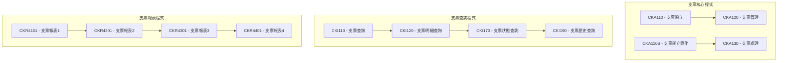
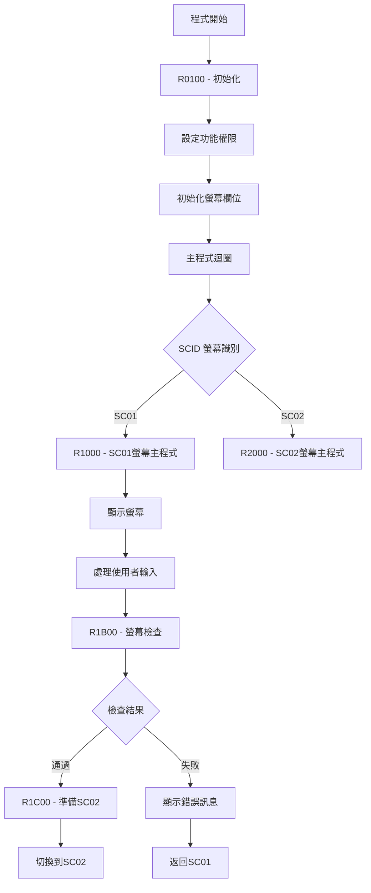
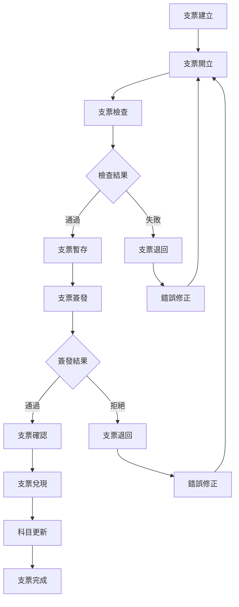
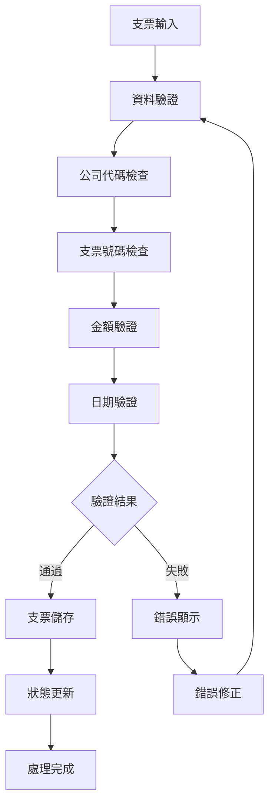
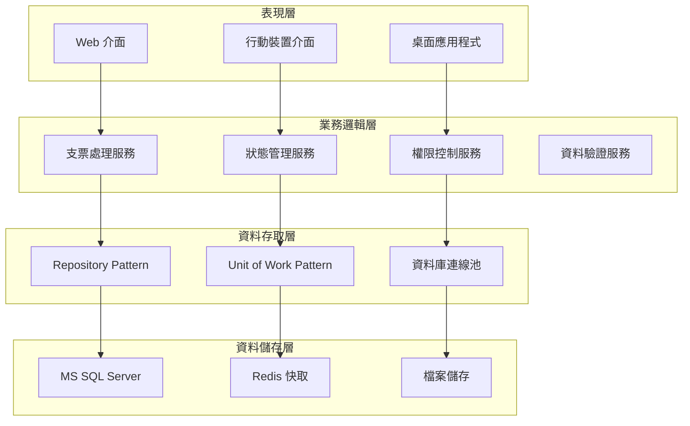

# 支票模組業務邏輯規格書 - RPG程式分析

## 一、基本資訊

| 項目 | 說明 |
|------|------|
| **系統名稱** | 10.10.10.180 企業管理系統 |
| **模組名稱** | 支票模組 |
| **模組代號** | CK (Check) |
| **功能名稱** | 支票管理 |
| **功能代號** | CK001 |
| **撰寫人員** | 系統分析師 |
| **撰寫日期** | 2024/12/21 |
| **審核人員** | 專案經理 |
| **審核日期** | 2024/12/21 |
| **版本編號** | v1.0 |
| **文件類型** | 業務邏輯規格書 - RPG程式分析 |
| **適用範圍** | 系統現代化轉型專案 |

---

## 二、RPG程式分析概述

### 2.1 程式目錄結構

#### 2.1.1 支票核心程式

| 程式代號 | 程式名稱 | 檔案大小 | 行數 | 主要功能 |
|----------|----------|----------|------|----------|
| **CKA110** | 支票開立 | 54KB | 1222 | 支票的開立與處理 |
| **CKA110S** | 支票開立簡化版 | 47KB | 1184 | 支票開立的簡化版本 |
| **CKA120** | 支票管理 | 檔案存在 | - | 支票的管理功能 |
| **CKA130** | 支票處理 | 檔案存在 | - | 支票的處理邏輯 |

#### 2.1.2 支票查詢程式

| 程式代號 | 程式名稱 | 檔案大小 | 行數 | 主要功能 |
|----------|----------|----------|------|----------|
| **CKI110** | 支票查詢 | 檔案存在 | - | 支票查詢功能 |
| **CKI120** | 支票明細查詢 | 檔案存在 | - | 支票明細查詢 |
| **CKI170** | 支票狀態查詢 | 檔案存在 | - | 支票狀態查詢 |
| **CKI190** | 支票歷史查詢 | 檔案存在 | - | 支票歷史查詢 |

#### 2.1.3 支票報表程式

| 程式代號 | 程式名稱 | 檔案大小 | 行數 | 主要功能 |
|----------|----------|----------|------|----------|
| **CKR4101** | 支票報表1 | 檔案存在 | - | 支票相關報表 |
| **CKR4201** | 支票報表2 | 檔案存在 | - | 支票統計報表 |
| **CKR4301** | 支票報表3 | 檔案存在 | - | 支票分析報表 |
| **CKR4401** | 支票報表4 | 檔案存在 | - | 支票彙總報表 |

### 2.2 程式架構分析

#### 2.2.1 程式分類架構



---

## 三、核心業務邏輯分析

### 3.1 支票開立業務邏輯 (CKA110)

#### 3.1.1 程式結構分析



#### 3.1.2 關鍵業務邏輯

##### 3.1.2.1 功能權限控制
```rpgle
* FUN AUT - 功能權限設定
MOVE $ADD      @A01,1    * 新增權限
MOVE $UPD      @A01,2    * 修改權限
MOVE $DLT      @A01,4    * 刪除權限
MOVE $INQ      @A01,5    * 查詢權限
```

**業務邏輯說明**：
- **權限控制機制**：程式透過LDA (Local Data Area) 取得使用者權限
- **功能權限映射**：將權限代碼映射到螢幕功能按鈕
- **動態權限顯示**：根據使用者權限動態顯示/隱藏功能按鈕

##### 3.1.2.2 螢幕欄位初始化
```rpgle
* SC01 欄位初始化
Z-ADD1         DOPT      * 操作類型 (1=新增)
MOVEL$COR      DHA02     * 公司代碼
MOVEL*BLANK    DHA03     * 支票號碼
MOVEL*BLANK    DHA02C    * 複製公司代碼
MOVEL*BLANK    DHA03C    * 複製支票號碼
```

**業務邏輯說明**：
- **操作類型設定**：預設為新增模式
- **公司代碼設定**：從LDA取得使用者公司代碼
- **欄位清空**：其他欄位初始化為空白

##### 3.1.2.3 螢幕檢查邏輯
```rpgle
* 螢幕檢查流程
EXSR R1B00                * 執行螢幕檢查
*IN99 IFEQ '0'            * 檢查結果
EXSR R1C00                * 準備SC02
MOVEL'SC02'    SCID      * 切換螢幕
```

**業務邏輯說明**：
- **檢查順序**：先執行螢幕檢查，再決定下一步動作
- **成功處理**：檢查通過後準備下一螢幕
- **失敗處理**：檢查失敗後顯示錯誤訊息

### 3.2 支票狀態管理

#### 3.2.1 支票狀態定義

| 狀態代碼 | 狀態名稱 | 狀態說明 | 允許操作 |
|----------|----------|----------|----------|
| **1** | 已開立 | 支票已開立，未簽發 | 修改、刪除 |
| **2** | 已簽發 | 支票已簽發，未兌現 | 修改、查詢 |
| **3** | 已兌現 | 支票已兌現 | 查詢、報表 |
| **4** | 已作廢 | 支票已作廢 | 查詢 |
| **5** | 已退票 | 支票已退票 | 查詢 |

#### 3.2.2 狀態轉換邏輯

```rpgle
* 支票狀態檢查
* 檢查支票狀態是否允許操作
09-C           DOPT      IFEQ 2
    DOPT      OREQ 4
* 檢查支票狀態
10-C           HA17      IFEQ '0'
    MOVEL'UCK0014' ERRID  * 支票未開立
    MOVEL'CKMF'    ERRF
    SETON 606199
10-C                     END
09-C                     END
```

**業務邏輯說明**：
- **狀態驗證**：根據操作類型檢查支票狀態
- **狀態限制**：不同狀態下允許不同的操作
- **錯誤處理**：狀態不符合時顯示錯誤訊息

### 3.3 支票資料驗證

#### 3.3.1 基本資料驗證

```rpgle
* 公司代碼驗證
CALL 'CKS#B0'
PARM DHA02     #B001I
DHA02N    PARM           #B002O 16
PARM           #B003O 34
PARM           #B098O 50
PARM           #B099O  1

* 檢查公司代碼有效性
03-C           #B099O    IFNE 'Y'
    MOVEL'UPT2010' ERRID  * 公司代碼不存在
    MOVEL'PTMF'    ERRF
    SETON 6099
03-C                     END
```

**業務邏輯說明**：
- **公司代碼驗證**：呼叫子程式驗證公司代碼
- **多重驗證**：檢查公司代碼的存在性和有效性
- **錯誤處理**：驗證失敗時顯示錯誤訊息

#### 3.3.2 支票號碼驗證

```rpgle
* 支票號碼唯一性檢查
MOVEL'1'       DHA01
KEYHA     CHAINHA0                  40

* 新增時檢查支票號碼是否存在
05-C           DOPT      IFEQ 1                          * ADD
    *IN40     ANDEQ'0'
    MOVEL'UPT2020' ERRID  * 支票號碼已存在
    MOVEL'PTMF'    ERRF
    SETON 606199
05-C                     END
```

**業務邏輯說明**：
- **唯一性檢查**：新增時檢查支票號碼是否已存在
- **重複檢查**：修改時檢查支票號碼是否重複
- **錯誤處理**：重複時顯示錯誤訊息

### 3.4 支票金額管理

#### 3.4.1 金額驗證邏輯

```rpgle
* 支票金額檢查
05-C           DHA06     IFEQ *ZERO
    MOVEL'UPT0012' ERRID  * 支票金額不能為零
    MOVEL'PTMF'    ERRF
    SETON 6299
05-C                     END

* 支票金額有效性檢查
MOVEL'CK'      D#X03
KEY#X     CHAIN#X0                  40
CALL 'P30'
PARM DHA06     P3001I  80
PARM #X101     P3002I  1
PARM #X102     P3003I  1
PARM           P3011O  1
```

**業務邏輯說明**：
- **金額非零檢查**：支票金額不能為零
- **金額有效性**：檢查金額是否符合系統規則
- **格式驗證**：使用P30程式驗證金額格式

#### 3.4.2 金額計算邏輯

```rpgle
* 支票金額計算
* 根據支票類型計算金額
12-C           DHA23     IFEQ '01'
    Z-ADDDHA10     DHA55  * 計算支票金額
    ELSE
    Z-ADD0         DHA55  * 其他類型金額為零
    END
12-C                     END
```

**業務邏輯說明**：
- **類型判斷**：根據支票類型決定金額計算方式
- **金額計算**：根據業務規則計算支票金額
- **預設值設定**：其他類型設定預設金額

---

## 四、業務規則提取

### 4.1 支票開立業務規則

| 規則編號 | 規則名稱 | 規則內容 | 實作位置 |
|----------|----------|----------|----------|
| **CK001** | 支票號碼唯一性 | 支票號碼必須唯一 | CKA110 R1B00 |
| **CK002** | 公司代碼有效性 | 公司代碼必須存在且有效 | CKA110 R1B00 |
| **CK003** | 支票金額非零 | 支票金額不能為零 | CKA110 R2B00 |
| **CK004** | 支票日期有效性 | 支票日期必須有效 | CKA110 R2B00 |
| **CK005** | 支票狀態檢查 | 支票狀態必須符合操作要求 | CKA110 R1B00 |

### 4.2 支票狀態管理規則

| 規則編號 | 規則名稱 | 規則內容 | 實作位置 |
|----------|----------|----------|----------|
| **CK006** | 狀態轉換限制 | 支票狀態必須按流程變更 | CKA110 R1B00 |
| **CK007** | 操作權限檢查 | 使用者必須有對應操作權限 | CKA110 R1B00 |
| **CK008** | 狀態驗證 | 支票狀態必須通過驗證 | CKA110 R1B00 |

### 4.3 支票資料驗證規則

| 規則編號 | 規則名稱 | 規則內容 | 實作位置 |
|----------|----------|----------|----------|
| **CK009** | 必填欄位檢查 | 必填欄位不能為空白 | CKA110 R2B00 |
| **CK010** | 資料格式驗證 | 資料格式必須符合系統要求 | CKA110 R2B00 |
| **CK011** | 參照完整性 | 相關代碼必須存在且有效 | CKA110 R2B00 |

---

## 五、資料結構分析

### 5.1 檔案結構分析

#### 5.1.1 支票相關檔案

| 檔案代號 | 檔案名稱 | 檔案類型 | 主要用途 |
|----------|----------|----------|----------|
| **CKHALF01** | 支票主檔 | 實體檔案 | 儲存支票主要資訊 |
| **CKHBLF01** | 支票明細檔 | 實體檔案 | 儲存支票明細資訊 |
| **CKHELF01** | 支票事件檔 | 實體檔案 | 儲存支票事件記錄 |
| **CKHDLF01** | 支票日誌檔 | 實體檔案 | 儲存支票操作日誌 |

#### 5.1.2 參照檔案

| 檔案代號 | 檔案名稱 | 檔案類型 | 主要用途 |
|----------|----------|----------|----------|
| **MTMEPF** | 主檔參照檔 | 實體檔案 | 儲存主檔參照資訊 |
| **PT#XPF** | 參照檔 | 實體檔案 | 儲存系統參照資訊 |
| **PA#APF** | 參照檔 | 實體檔案 | 儲存應用參照資訊 |

### 5.2 資料結構分析

#### 5.2.1 支票主檔結構 (CKHALF01)

```rpgle
* 支票主檔資料結構
D CKHALF01     DS
D  HA01                    1   10          * 支票編號
D  HA02                    11  12          * 公司代碼
D  HA03                    13  22          * 支票號碼
D  HA04                    23  32          * 科目代碼
D  HA05                    33  33          * 支票類型
D  HA06                    34  41          * 支票金額
D  HA07                    42  49          * 支票日期
D  HA08                    50  56          * 銀行代碼
D  HA09                    57  63          * 帳號
D  HA10                    64  71          * 支票金額
D  HA11                    72  79          * 到期日期
D  HA12                    80  87          * 備註
D  HA13                    88  95          * 受款人
D  HA14                    96 103          * 受款人地址
D  HA15                   104 111          * 開票日期
D  HA16                   112 119          * 銀行代碼
D  HA17                   120 120          * 支票狀態
D  HA18                   121 127          * 支票狀態說明
D  HA19                   128 135          * 建立序號
D  HA20                   136 143          * 修改序號
```

#### 5.2.2 支票明細檔結構 (CKHBLF01)

```rpgle
* 支票明細檔資料結構
D CKHBLF01     DS
D  HE01                    1   10          * 支票編號
D  HE02                    11  18          * 明細序號
D  HE03                    19  26          * 科目代碼
D  HE04                    27  34          * 借方金額
D  HE05                    35  42          * 貸方金額
D  HE06                    43  50          * 摘要
D  HE07                    51  58          * 參考號碼
D  HE08                    59  66          * 建立者
D  HE09                    67  74          * 建立時間
```

---

## 六、業務流程分析

### 6.1 支票開立完整流程

#### 6.1.1 支票生命週期



#### 6.1.2 支票狀態轉換

| 狀態代碼 | 狀態名稱 | 狀態說明 | 允許操作 |
|----------|----------|----------|----------|
| **1** | 已開立 | 支票剛建立，未簽發 | 修改、刪除 |
| **2** | 已簽發 | 支票已簽發，未兌現 | 修改、查詢 |
| **3** | 已兌現 | 支票已兌現 | 查詢、報表 |
| **4** | 已作廢 | 支票已作廢 | 查詢 |
| **5** | 已退票 | 支票已退票 | 查詢 |

### 6.2 支票處理流程

#### 6.2.1 支票處理流程



---

## 七、錯誤處理分析

### 7.1 錯誤代碼體系

#### 7.1.1 支票模組錯誤代碼

| 錯誤代碼 | 錯誤訊息 | 錯誤類型 | 處理方式 |
|----------|----------|----------|----------|
| **UPT0010** | 必填欄位不能為空白 | 資料驗證錯誤 | 使用者修正 |
| **UPT2010** | 代碼不存在 | 參照完整性錯誤 | 檢查代碼 |
| **UPT2150** | 權限不足 | 權限控制錯誤 | 申請權限 |
| **UCK0014** | 支票未開立 | 業務邏輯錯誤 | 檢查支票狀態 |
| **UCK0010** | 支票已兌現 | 業務邏輯錯誤 | 檢查支票狀態 |

#### 7.1.2 錯誤處理機制

```rpgle
* 錯誤處理實作範例
* 設定錯誤代碼和訊息
MOVEL'UCK0014' ERRID      * 錯誤代碼
MOVEL'CKMF'    ERRF       * 錯誤檔案
SETON 606199              * 錯誤標記

* 錯誤處理後的返回
99                GOTO E1B00    * 返回錯誤處理結束
```

**業務邏輯說明**：
- **錯誤代碼設定**：統一的錯誤代碼體系
- **錯誤訊息設定**：對應的錯誤訊息檔案
- **錯誤標記**：設定錯誤標記，控制程式流程

---

## 八、現代化轉型建議

### 8.1 架構轉型建議

#### 8.1.1 分層架構設計



#### 8.1.2 服務導向架構

| 服務名稱 | 服務職責 | 對應RPG程式 | 轉換策略 |
|----------|----------|-------------|----------|
| **支票管理服務** | 支票的CRUD操作 | CKA110, CKA120 | 重構為C#服務 |
| **支票查詢服務** | 支票查詢功能 | CKI110, CKI120 | 重構為C#服務 |
| **支票報表服務** | 支票報表產生 | CKR4101, CKR4201 | 重構為C#服務 |
| **權限控制服務** | 使用者權限管理 | 各程式中的權限檢查 | 重構為C#服務 |

### 8.2 技術轉型建議

#### 8.2.1 程式語言轉換

| RPG 結構 | C# 對應 | 轉換說明 |
|----------|----------|----------|
| **主程式** | Main Program | 使用 Program.cs 作為程式進入點 |
| **子程序** | Private Methods | 將 RPG 子程序轉換為 C# 私有方法 |
| **資料結構** | Classes/Models | 將 RPG 資料結構轉換為 C# 類別 |
| **檔案操作** | Repository Pattern | 使用 Repository 模式處理資料存取 |
| **錯誤處理** | Exception Handling | 使用 C# 例外處理機制 |

#### 8.2.2 資料庫轉換

| AS/400 檔案 | MS SQL 資料表 | 轉換說明 |
|-------------|----------------|----------|
| **CKHALF01** | CK_Checks | 支票主檔 |
| **CKHBLF01** | CK_CheckEntries | 支票明細檔 |
| **CKHELF01** | CK_CheckEvents | 支票事件檔 |
| **CKHDLF01** | CK_CheckLogs | 支票日誌檔 |

### 8.3 業務邏輯轉換建議

#### 8.3.1 業務規則轉換

```csharp
// 支票號碼唯一性檢查
public class CheckNumberValidator : IValidator<Check>
{
    public ValidationResult Validate(Check check)
    {
        if (string.IsNullOrEmpty(check.CheckNumber))
            return ValidationResult.Failure("支票號碼不能為空白");
            
        var existingCheck = _checkRepository
            .GetByCheckNumber(check.CheckNumber);
            
        if (existingCheck != null && existingCheck.Id != check.Id)
            return ValidationResult.Failure("支票號碼已存在");
        
        return ValidationResult.Success();
    }
}
```

#### 8.3.2 狀態管理轉換

```csharp
// 支票狀態管理服務
public class CheckStatusService : ICheckStatusService
{
    public bool CanChangeStatus(Check check, CheckStatus newStatus)
    {
        var allowedTransitions = GetAllowedTransitions(check.CurrentStatus);
        return allowedTransitions.Contains(newStatus);
    }
    
    private IEnumerable<CheckStatus> GetAllowedTransitions(CheckStatus currentStatus)
    {
        return currentStatus switch
        {
            CheckStatus.Issued => new[] { CheckStatus.Signed, CheckStatus.Cancelled },
            CheckStatus.Signed => new[] { CheckStatus.Cashed, CheckStatus.Cancelled },
            CheckStatus.Cashed => new[] { CheckStatus.Cancelled },
            _ => Enumerable.Empty<CheckStatus>()
        };
    }
}
```

---

## 九、總結與建議

### 9.1 業務邏輯分析總結

#### 9.1.1 核心業務邏輯

1. **支票處理邏輯**：完整的支票生命週期管理
2. **權限控制邏輯**：多層級的權限控制機制
3. **資料驗證邏輯**：完整的資料驗證和錯誤處理
4. **狀態管理邏輯**：清晰的狀態轉換和流程控制

#### 9.1.2 技術特點

1. **模組化設計**：清晰的程式模組劃分
2. **參數化處理**：支援多種執行模式
3. **錯誤處理機制**：統一的錯誤代碼和處理流程
4. **效能優化**：適當的索引和查詢策略

### 9.2 現代化轉型建議

#### 9.2.1 短期目標

1. **業務邏輯提取**：完整提取現有業務邏輯
2. **資料結構分析**：分析現有資料結構和關聯
3. **介面設計**：設計現代化的使用者介面

#### 9.2.2 中期目標

1. **服務重構**：將業務邏輯重構為現代化服務
2. **資料庫轉換**：完成資料庫結構轉換
3. **系統整合**：完成新舊系統的整合

#### 9.2.3 長期目標

1. **系統現代化**：完成整個系統的現代化轉型
2. **效能提升**：提升系統效能和可擴展性
3. **維護簡化**：簡化系統維護和升級流程

### 9.3 風險控制建議

#### 9.3.1 技術風險

1. **資料轉換風險**：建立完整的資料驗證機制
2. **功能遺失風險**：確保所有功能完整轉換
3. **效能風險**：進行充分的效能測試

#### 9.3.2 業務風險

1. **業務中斷風險**：採用漸進式轉換策略
2. **資料一致性風險**：建立資料一致性檢查機制
3. **使用者適應風險**：提供充分的培訓和支援

---

## 十、修訂記錄

| 版本 | 修訂日期 | 修訂人員 | 修訂內容 | 修訂原因 |
|------|----------|----------|----------|----------|
| v1.0 | 2024/12/21 | 系統分析師 | 初始版本 | 文件建立 |

---

**文件建立日期**：2024年12月21日  
**最後更新日期**：2024年12月21日  
**文件狀態**：草稿  
**下次檢討日期**：2025年1月21日 