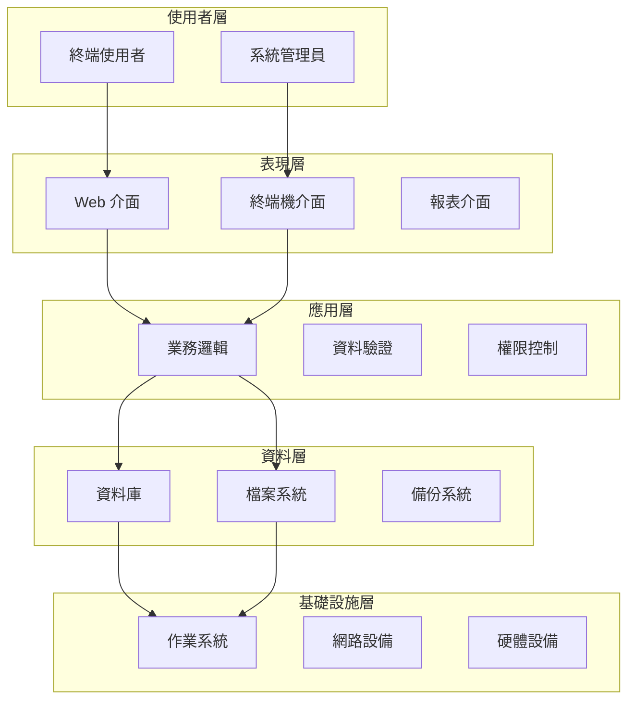
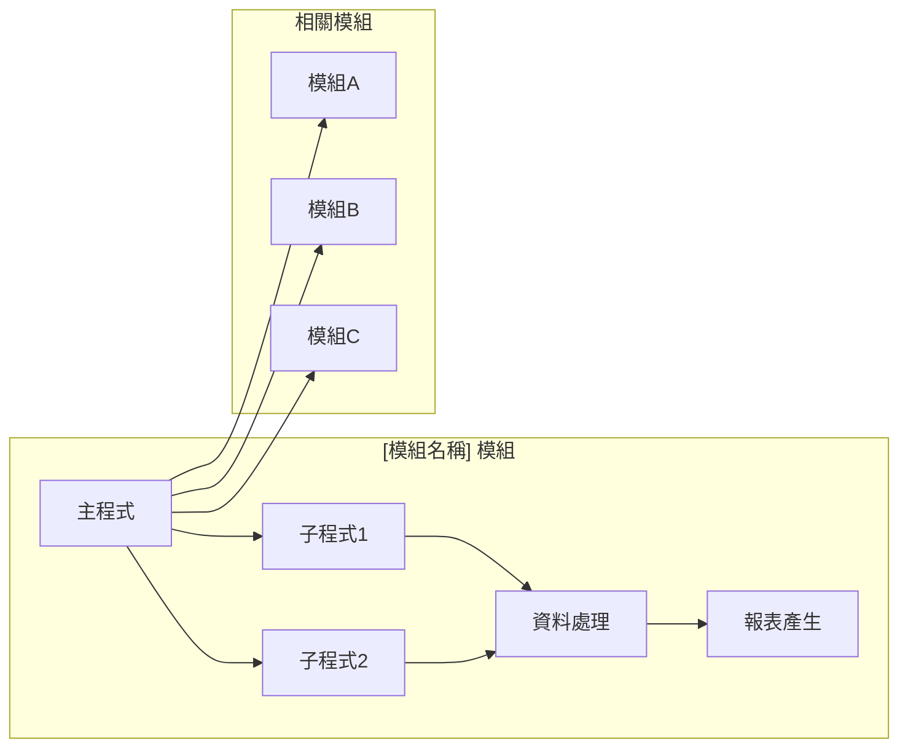

# 技術文件範本

## 一、基本資訊

| 項目 | 說明 |
|------|------|
| **系統名稱** | 10.10.10.180 企業管理系統 |
| **模組名稱** | [模組中文名稱] |
| **模組代號** | [模組英文代號] |
| **文件類型** | 技術文件 |
| **撰寫人員** | [撰寫人員姓名] |
| **撰寫日期** | [YYYY/MM/DD] |
| **審核人員** | [審核人員姓名] |
| **審核日期** | [YYYY/MM/DD] |
| **版本編號** | v1.0 |
| **適用對象** | 系統開發人員、技術支援人員 |

---

## 二、系統架構

### 2.1 整體架構圖



### 2.2 模組架構圖



### 2.3 技術架構說明

#### 2.3.1 開發技術
- **程式語言**：[使用的程式語言]
- **開發平台**：[開發平台說明]
- **資料庫系統**：[資料庫系統說明]
- **作業系統**：[作業系統說明]

#### 2.3.2 架構特點
- **模組化設計**：[模組化設計說明]
- **分層架構**：[分層架構說明]
- **可擴展性**：[可擴展性說明]
- **可維護性**：[可維護性說明]

---

## 三、資料庫設計

### 3.1 資料庫架構

#### 3.1.1 資料庫類型
- **主要資料庫**：[資料庫名稱] - [資料庫類型]
- **備份資料庫**：[備份資料庫名稱] - [資料庫類型]
- **測試資料庫**：[測試資料庫名稱] - [資料庫類型]

#### 3.1.2 資料庫配置
```sql
-- 資料庫配置範例
CREATE DATABASE [資料庫名稱]
    ON PRIMARY (
        NAME = [資料檔案名稱],
        FILENAME = '[檔案路徑]',
        SIZE = [初始大小],
        MAXSIZE = [最大大小],
        FILEGROWTH = [成長大小]
    )
    LOG ON (
        NAME = [日誌檔案名稱],
        FILENAME = '[日誌檔案路徑]',
        SIZE = [日誌初始大小],
        MAXSIZE = [日誌最大大小],
        FILEGROWTH = [日誌成長大小]
    );
```

### 3.2 資料表設計

#### 3.2.1 主要資料表
| 資料表名稱 | 資料表代號 | 用途說明 | 記錄數量 | 主要索引 |
|------------|------------|----------|----------|----------|
| [資料表名稱1] | [資料表代號1] | [用途說明] | [記錄數量] | [主要索引] |
| [資料表名稱2] | [資料表代號2] | [用途說明] | [記錄數量] | [主要索引] |

#### 3.2.2 資料表結構
```sql
-- [資料表名稱] 資料表結構
CREATE TABLE [資料表名稱] (
    [欄位名稱1] [資料型態1] [約束條件1],
    [欄位名稱2] [資料型態2] [約束條件2],
    [欄位名稱3] [資料型態3] [約束條件3],
    CONSTRAINT [主鍵約束名稱] PRIMARY KEY ([主鍵欄位]),
    CONSTRAINT [外鍵約束名稱] FOREIGN KEY ([外鍵欄位]) REFERENCES [參照資料表]([參照欄位])
);
```

### 3.3 索引設計

#### 3.3.1 索引策略
- **主鍵索引**：自動建立，確保資料唯一性
- **唯一索引**：確保特定欄位的唯一性
- **一般索引**：提升查詢效能
- **複合索引**：多欄位組合查詢優化

#### 3.3.2 索引清單
| 索引名稱 | 索引類型 | 索引欄位 | 用途說明 |
|----------|----------|----------|----------|
| [索引名稱1] | [索引類型1] | [索引欄位1] | [用途說明] |
| [索引名稱2] | [索引類型2] | [索引欄位2] | [用途說明] |

### 3.4 資料關聯

#### 3.4.1 關聯圖
```mermaid
erDiagram
    [主檔A] ||--o{ [明細檔B] : "1對多"
    [主檔A] ||--|| [參照檔C] : "參照"
    [工作檔D] }o--|| [主檔A] : "暫存"
    
    [主檔A] {
        string 主鍵欄位1
        string 主鍵欄位2
        string 一般欄位1
        string 一般欄位2
    }
    
    [明細檔B] {
        string 主鍵欄位1
        string 主鍵欄位2
        string 明細欄位1
        string 明細欄位2
    }
```

#### 3.4.2 關聯說明
| 關聯類型 | 主檔 | 明細檔 | 關聯欄位 | 說明 |
|----------|------|--------|----------|------|
| [關聯類型1] | [主檔名稱1] | [明細檔名稱1] | [關聯欄位1] | [關聯說明] |
| [關聯類型2] | [主檔名稱2] | [明細檔名稱2] | [關聯欄位2] | [關聯說明] |

---

## 四、API 規格

### 4.1 API 概述

#### 4.1.1 API 類型
- **REST API**：提供標準的 HTTP 介面
- **內部 API**：模組間的內部呼叫介面
- **批次 API**：處理大量資料的批次介面

#### 4.1.2 API 版本
- **當前版本**：v1.0
- **支援版本**：v1.0, v0.9
- **棄用版本**：v0.8 及以下

### 4.2 API 端點

#### 4.2.1 查詢 API
```http
GET /api/[模組代號]/[功能代號]/query
```

**請求參數**：
| 參數名稱 | 參數類型 | 必填 | 說明 |
|----------|----------|------|------|
| [參數名稱1] | [參數類型1] | [是/否] | [參數說明] |
| [參數名稱2] | [參數類型2] | [是/否] | [參數說明] |

**回應格式**：
```json
{
    "status": "success",
    "data": [
        {
            "[欄位名稱1]": "[欄位值1]",
            "[欄位名稱2]": "[欄位值2]"
        }
    ],
    "total": 100,
    "page": 1,
    "pageSize": 20
}
```

#### 4.2.2 新增 API
```http
POST /api/[模組代號]/[功能代號]/create
```

**請求參數**：
```json
{
    "[欄位名稱1]": "[欄位值1]",
    "[欄位名稱2]": "[欄位值2]",
    "details": [
        {
            "[明細欄位1]": "[明細值1]",
            "[明細欄位2]": "[明細值2]"
        }
    ]
}
```

**回應格式**：
```json
{
    "status": "success",
    "message": "新增成功",
    "data": {
        "id": "[新增記錄ID]",
        "code": "[新增記錄代碼]"
    }
}
```

#### 4.2.3 修改 API
```http
PUT /api/[模組代號]/[功能代號]/update/{id}
```

**請求參數**：
```json
{
    "[欄位名稱1]": "[新欄位值1]",
    "[欄位名稱2]": "[新欄位值2]"
}
```

**回應格式**：
```json
{
    "status": "success",
    "message": "修改成功",
    "data": {
        "id": "[修改記錄ID]",
        "updateTime": "[更新時間]"
    }
}
```

#### 4.2.4 刪除 API
```http
DELETE /api/[模組代號]/[功能代號]/delete/{id}
```

**回應格式**：
```json
{
    "status": "success",
    "message": "刪除成功",
    "data": {
        "id": "[刪除記錄ID]",
        "deleteTime": "[刪除時間]"
    }
}
```

### 4.3 錯誤處理

#### 4.3.1 錯誤回應格式
```json
{
    "status": "error",
    "errorCode": "[錯誤代碼]",
    "errorMessage": "[錯誤訊息]",
    "details": "[詳細錯誤資訊]"
}
```

#### 4.3.2 常見錯誤代碼
| 錯誤代碼 | HTTP 狀態碼 | 錯誤訊息 | 說明 |
|----------|-------------|----------|------|
| [錯誤代碼1] | [HTTP狀態碼1] | [錯誤訊息1] | [說明1] |
| [錯誤代碼2] | [HTTP狀態碼2] | [錯誤訊息2] | [說明2] |

---

## 五、開發指南

### 5.1 開發環境設定

#### 5.1.1 必要軟體
- **開發工具**：[開發工具名稱] - [版本要求]
- **程式語言**：[程式語言名稱] - [版本要求]
- **資料庫**：[資料庫名稱] - [版本要求]
- **作業系統**：[作業系統名稱] - [版本要求]

#### 5.1.2 環境變數設定
```bash
# 環境變數設定範例
export [變數名稱1]=[變數值1]
export [變數名稱2]=[變數值2]
export [變數名稱3]=[變數值3]
```

#### 5.1.3 專案結構
```
[專案名稱]/
├── src/                    # 原始碼目錄
│   ├── main/              # 主要程式碼
│   │   ├── [模組名稱1]/   # 模組1
│   │   ├── [模組名稱2]/   # 模組2
│   │   └── common/        # 共用程式碼
│   └── test/              # 測試程式碼
├── docs/                  # 文件目錄
├── config/                # 設定檔目錄
├── scripts/               # 腳本目錄
└── README.md              # 專案說明
```

### 5.2 程式碼規範

#### 5.2.1 命名規範
- **檔案命名**：使用 PascalCase，如 `UserManagement.java`
- **類別命名**：使用 PascalCase，如 `UserService`
- **方法命名**：使用 camelCase，如 `getUserById`
- **變數命名**：使用 camelCase，如 `userName`
- **常數命名**：使用 UPPER_SNAKE_CASE，如 `MAX_RETRY_COUNT`

#### 5.2.2 程式碼格式
```java
// 程式碼格式範例
public class UserService {
    
    private static final int MAX_RETRY_COUNT = 3;
    
    /**
     * 根據使用者ID查詢使用者資訊
     * @param userId 使用者ID
     * @return 使用者資訊
     */
    public User getUserById(String userId) {
        if (StringUtils.isEmpty(userId)) {
            throw new IllegalArgumentException("使用者ID不能為空");
        }
        
        try {
            return userRepository.findById(userId);
        } catch (Exception e) {
            logger.error("查詢使用者失敗: {}", userId, e);
            throw new ServiceException("查詢使用者失敗", e);
        }
    }
}
```

#### 5.2.3 註解規範
- **類別註解**：說明類別的用途和職責
- **方法註解**：說明方法的功能、參數和返回值
- **複雜邏輯註解**：說明複雜業務邏輯的處理步驟
- **TODO 註解**：標記需要後續處理的部分

### 5.3 測試規範

#### 5.3.1 測試類型
- **單元測試**：測試個別方法或類別的功能
- **整合測試**：測試模組間的整合功能
- **端對端測試**：測試完整的業務流程

#### 5.3.2 測試範例
```java
// 單元測試範例
@Test
public void testGetUserById_WithValidId_ShouldReturnUser() {
    // Arrange
    String userId = "USER001";
    User expectedUser = new User(userId, "測試使用者");
    when(userRepository.findById(userId)).thenReturn(expectedUser);
    
    // Act
    User actualUser = userService.getUserById(userId);
    
    // Assert
    assertThat(actualUser).isNotNull();
    assertThat(actualUser.getId()).isEqualTo(userId);
    assertThat(actualUser.getName()).isEqualTo("測試使用者");
}
```

#### 5.3.3 測試覆蓋率
- **目標覆蓋率**：80% 以上
- **必要覆蓋**：核心業務邏輯必須 100% 覆蓋
- **測試報告**：定期產生測試覆蓋率報告

---

## 六、部署指南

### 6.1 部署環境

#### 6.1.1 環境需求
| 環境類型 | 作業系統 | 記憶體 | 磁碟空間 | 網路頻寬 |
|----------|----------|--------|----------|----------|
| **開發環境** | [作業系統1] | [記憶體1] | [磁碟空間1] | [網路頻寬1] |
| **測試環境** | [作業系統2] | [記憶體2] | [磁碟空間2] | [網路頻寬2] |
| **正式環境** | [作業系統3] | [記憶體3] | [磁碟空間3] | [網路頻寬3] |

#### 6.1.2 相依套件
- **資料庫驅動程式**：[驅動程式名稱] - [版本要求]
- **應用程式伺服器**：[伺服器名稱] - [版本要求]
- **其他套件**：[套件名稱] - [版本要求]

### 6.2 部署步驟

#### 6.2.1 準備階段
1. **環境檢查**
   - 確認作業系統版本
   - 確認相依套件已安裝
   - 確認網路連線正常

2. **資料庫準備**
   - 建立資料庫
   - 執行資料庫初始化腳本
   - 設定資料庫連線參數

3. **檔案準備**
   - 準備部署檔案
   - 準備設定檔案
   - 準備啟動腳本

#### 6.2.2 部署執行
1. **停止舊版本**
   ```bash
   # 停止舊版本服務
   systemctl stop [服務名稱]
   ```

2. **備份現有資料**
   ```bash
   # 備份資料庫
   pg_dump [資料庫名稱] > backup_$(date +%Y%m%d_%H%M%S).sql
   ```

3. **部署新版本**
   ```bash
   # 複製新版本檔案
   cp -r [新版本目錄]/* [部署目錄]/
   
   # 更新設定檔案
   cp [設定檔案] [部署目錄]/config/
   ```

4. **啟動新版本**
   ```bash
   # 啟動新版本服務
   systemctl start [服務名稱]
   
   # 檢查服務狀態
   systemctl status [服務名稱]
   ```

#### 6.2.3 驗證階段
1. **功能驗證**
   - 執行基本功能測試
   - 檢查系統日誌
   - 驗證資料庫連線

2. **效能驗證**
   - 檢查系統資源使用
   - 執行效能測試
   - 監控系統回應時間

3. **回滾準備**
   - 準備回滾腳本
   - 確認回滾點
   - 準備回滾通知

### 6.3 監控與維護

#### 6.3.1 監控項目
- **系統監控**：CPU、記憶體、磁碟使用率
- **應用監控**：回應時間、錯誤率、吞吐量
- **資料庫監控**：連線數、查詢效能、鎖定狀態
- **網路監控**：網路延遲、頻寬使用、連線狀態

#### 6.3.2 維護作業
- **日誌清理**：定期清理系統日誌
- **資料備份**：定期執行資料備份
- **效能調優**：根據監控結果調整系統參數
- **安全更新**：定期更新安全修補程式

---

## 七、安全考量

### 7.1 安全架構

#### 7.1.1 安全層級
- **網路層安全**：防火牆、VPN、網路隔離
- **應用層安全**：身份驗證、授權、資料加密
- **資料層安全**：資料加密、存取控制、審計日誌

#### 7.1.2 安全機制
- **身份驗證**：多因子認證、單一登入
- **授權控制**：角色基礎存取控制、最小權限原則
- **資料保護**：傳輸加密、靜態加密、資料遮罩

### 7.2 安全最佳實踐

#### 7.2.1 程式碼安全
- **輸入驗證**：驗證所有使用者輸入
- **SQL 注入防護**：使用參數化查詢
- **XSS 防護**：輸出編碼、內容安全政策
- **CSRF 防護**：使用 CSRF Token

#### 7.2.2 資料安全
- **敏感資料加密**：加密儲存敏感資料
- **資料傳輸安全**：使用 HTTPS、TLS
- **資料備份安全**：加密備份資料
- **資料銷毀**：安全刪除不再需要的資料

---

## 八、效能優化

### 8.1 效能指標

#### 8.1.1 回應時間
- **頁面載入時間**：目標 < 3 秒
- **API 回應時間**：目標 < 1 秒
- **資料庫查詢時間**：目標 < 500 毫秒

#### 8.1.2 吞吐量
- **同時使用者數**：目標支援 100 個同時使用者
- **請求處理能力**：目標每秒處理 100 個請求
- **資料處理能力**：目標每秒處理 1000 筆記錄

### 8.2 優化策略

#### 8.2.1 資料庫優化
- **索引優化**：建立適當的資料庫索引
- **查詢優化**：優化 SQL 查詢語句
- **連線池管理**：使用連線池管理資料庫連線
- **分頁查詢**：實作分頁查詢避免大量資料傳輸

#### 8.2.2 應用程式優化
- **快取機制**：實作多層級快取
- **非同步處理**：使用非同步處理提升回應速度
- **資源池化**：使用資源池管理系統資源
- **負載平衡**：實作負載平衡分散系統負載

---

## 九、故障排除

### 9.1 常見問題

#### 9.1.1 系統問題
| 問題現象 | 可能原因 | 解決方案 |
|----------|----------|----------|
| [問題現象1] | [可能原因1] | [解決方案1] |
| [問題現象2] | [可能原因2] | [解決方案2] |

#### 9.1.2 資料庫問題
| 問題現象 | 可能原因 | 解決方案 |
|----------|----------|----------|
| [問題現象1] | [可能原因1] | [解決方案1] |
| [問題現象2] | [可能原因2] | [解決方案2] |

### 9.2 診斷工具

#### 9.2.1 系統診斷
- **系統監控工具**：[工具名稱] - [用途說明]
- **效能分析工具**：[工具名稱] - [用途說明]
- **日誌分析工具**：[工具名稱] - [用途說明]

#### 9.2.2 資料庫診斷
- **查詢分析工具**：[工具名稱] - [用途說明]
- **效能監控工具**：[工具名稱] - [用途說明]
- **連線監控工具**：[工具名稱] - [用途說明]

---

## 十、文件修訂記錄

| 版本 | 修訂日期 | 修訂人員 | 修訂內容 | 修訂原因 |
|------|----------|----------|----------|----------|
| v1.0 | [YYYY/MM/DD] | [修訂人員] | 初始版本 | 文件建立 |
| v1.1 | [YYYY/MM/DD] | [修訂人員] | [修訂內容] | [修訂原因] |

---

**文件建立日期**：[YYYY/MM/DD]  
**最後更新日期**：[YYYY/MM/DD]  
**文件狀態**：[草稿/審核中/已核准]  
**下次檢討日期**：[YYYY/MM/DD] 