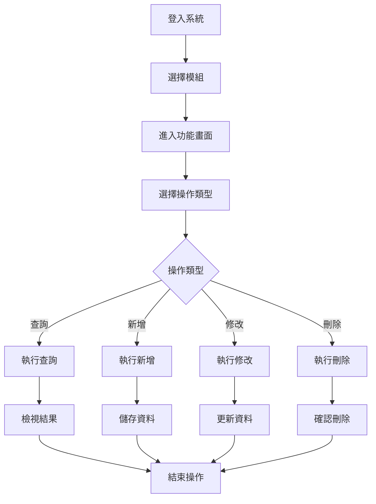

# 操作手冊範本

## 一、基本資訊

| 項目 | 說明 |
|------|------|
| **系統名稱** | 10.10.10.180 企業管理系統 |
| **模組名稱** | [模組中文名稱] |
| **模組代號** | [模組英文代號] |
| **功能名稱** | [功能中文名稱] |
| **功能代號** | [功能英文代號] |
| **撰寫人員** | [撰寫人員姓名] |
| **撰寫日期** | [YYYY/MM/DD] |
| **審核人員** | [審核人員姓名] |
| **審核日期** | [YYYY/MM/DD] |
| **版本編號** | v1.0 |
| **適用對象** | [使用者角色說明] |

---

## 二、功能概述

### 2.1 功能目的
[詳細說明此功能的目的和用途，包含業務價值和解決的問題]

### 2.2 功能範圍
- **主要功能**：[列出主要功能項目]
- **輔助功能**：[列出輔助功能項目]
- **限制功能**：[列出限制或無法執行的功能]

### 2.3 使用時機
- **日常使用**：[日常業務使用時機]
- **特殊情況**：[特殊業務情況使用時機]
- **不適用情況**：[不適合使用的情況]

### 2.4 前置條件
- **系統權限**：[需要的系統權限]
- **資料準備**：[需要預先準備的資料]
- **相關設定**：[需要預先完成的設定]

---

## 三、操作流程

### 3.1 整體操作流程圖



### 3.2 詳細操作步驟

#### 3.2.1 查詢操作流程
1. **進入查詢畫面**
   - 點擊 [查詢] 按鈕
   - 系統顯示查詢條件輸入區域

2. **輸入查詢條件**
   - 在 [欄位名稱1] 輸入 [查詢值1]
   - 在 [欄位名稱2] 輸入 [查詢值2]
   - 選擇 [欄位名稱3] 的 [選項值]

3. **執行查詢**
   - 點擊 [執行查詢] 按鈕
   - 系統顯示查詢結果

4. **檢視查詢結果**
   - 瀏覽查詢結果清單
   - 使用分頁功能檢視更多結果
   - 點擊記錄檢視詳細資料

#### 3.2.2 新增操作流程
1. **進入新增畫面**
   - 點擊 [新增] 按鈕
   - 系統顯示空白的新增畫面

2. **輸入基本資料**
   - 在 [欄位名稱1] 輸入 [資料值1]
   - 在 [欄位名稱2] 輸入 [資料值2]
   - 選擇 [欄位名稱3] 的 [選項值]

3. **輸入明細資料**
   - 點擊 [新增明細] 按鈕
   - 輸入明細欄位資料
   - 重複步驟直到所有明細輸入完成

4. **儲存資料**
   - 點擊 [儲存] 按鈕
   - 系統驗證資料並儲存
   - 顯示儲存成功訊息

#### 3.2.3 修改操作流程
1. **選擇要修改的記錄**
   - 在查詢結果清單中點擊要修改的記錄
   - 系統顯示修改畫面並載入現有資料

2. **修改資料**
   - 修改需要變更的欄位值
   - 保持其他欄位不變

3. **儲存修改**
   - 點擊 [儲存] 按鈕
   - 系統驗證修改後的資料並更新
   - 顯示更新成功訊息

#### 3.2.4 刪除操作流程
1. **選擇要刪除的記錄**
   - 在查詢結果清單中點擊要刪除的記錄
   - 系統顯示確認刪除訊息

2. **確認刪除**
   - 點擊 [確認刪除] 按鈕
   - 系統執行刪除作業
   - 顯示刪除成功訊息

---

## 四、畫面說明

### 4.1 主畫面說明

#### 4.1.1 畫面配置
```
┌─────────────────────────────────────────────────────────────┐
│                    [功能名稱] - 主畫面                        │
├─────────────────────────────────────────────────────────────┤
│ 查詢條件區域                                                │
│ ┌─────────────────────────────────────────────────────────┐ │
│ │ [欄位標籤1]: [輸入欄位1]    [欄位標籤2]: [輸入欄位2]   │ │
│ │ [欄位標籤3]: [輸入欄位3]    [欄位標籤4]: [輸入欄位4]   │ │
│ └─────────────────────────────────────────────────────────┘ │
├─────────────────────────────────────────────────────────────┤
│ 功能按鈕區域                                                │
│ [查詢] [新增] [修改] [刪除] [列印] [匯出] [離開]          │
├─────────────────────────────────────────────────────────────┤
│ 資料顯示區域                                                │
│ ┌─────────────────────────────────────────────────────────┐ │
│ │ [欄位標題1] │ [欄位標題2] │ [欄位標題3] │ [欄位標題4] │ │
│ ├─────────────────────────────────────────────────────────┤ │
│ │ [資料1-1]   │ [資料1-2]   │ [資料1-3]   │ [資料1-4]   │ │
│ │ [資料2-1]   │ [資料2-2]   │ [資料2-3]   │ [資料2-4]   │ │
│ └─────────────────────────────────────────────────────────┘ │
└─────────────────────────────────────────────────────────────┘
```

#### 4.1.2 區域說明
| 區域名稱 | 位置 | 功能說明 | 操作方式 |
|----------|------|----------|----------|
| **查詢條件區域** | 畫面頂部 | 輸入查詢條件 | 在對應欄位輸入查詢值 |
| **功能按鈕區域** | 畫面中部 | 執行各種功能 | 點擊對應按鈕 |
| **資料顯示區域** | 畫面底部 | 顯示查詢結果 | 點擊記錄檢視詳細資料 |

#### 4.1.3 欄位說明
| 欄位標籤 | 欄位名稱 | 輸入類型 | 必填 | 預設值 | 說明 |
|----------|----------|----------|------|--------|------|
| [欄位標籤1] | [欄位名稱1] | [輸入類型] | [是/否] | [預設值] | [欄位說明] |
| [欄位標籤2] | [欄位名稱2] | [輸入類型] | [是/否] | [預設值] | [欄位說明] |
| [欄位標籤3] | [欄位名稱3] | [輸入類型] | [是/否] | [預設值] | [欄位說明] |

### 4.2 明細畫面說明

#### 4.2.1 明細畫面配置
```
┌─────────────────────────────────────────────────────────────┐
│                    [功能名稱] - 明細畫面                      │
├─────────────────────────────────────────────────────────────┤
│ 主檔資料區域                                                │
│ ┌─────────────────────────────────────────────────────────┐ │
│ │ [欄位標籤1]: [顯示欄位1]    [欄位標籤2]: [顯示欄位2]   │ │
│ │ [欄位標籤3]: [顯示欄位3]    [欄位標籤4]: [顯示欄位4]   │ │
│ └─────────────────────────────────────────────────────────┘ │
├─────────────────────────────────────────────────────────────┤
│ 明細資料區域                                                │
│ ┌─────────────────────────────────────────────────────────┐ │
│ │ [欄位標籤5] │ [欄位標籤6] │ [欄位標籤7] │ [欄位標籤8] │ │
│ ├─────────────────────────────────────────────────────────┤ │
│ │ [資料5-1]   │ [資料6-1]   │ [資料7-1]   │ [資料8-1]   │ │
│ │ [資料5-2]   │ [資料6-2]   │ [資料7-2]   │ [資料8-2]   │ │
│ └─────────────────────────────────────────────────────────┘ │
├─────────────────────────────────────────────────────────────┤
│ 功能按鈕區域                                                │
│ [儲存] [取消] [新增明細] [刪除明細] [離開]                │
└─────────────────────────────────────────────────────────────┘
```

#### 4.2.2 明細欄位說明
| 欄位標籤 | 欄位名稱 | 輸入類型 | 必填 | 預設值 | 說明 |
|----------|----------|----------|------|--------|------|
| [欄位標籤5] | [欄位名稱5] | [輸入類型] | [是/否] | [預設值] | [欄位說明] |
| [欄位標籤6] | [欄位名稱6] | [輸入類型] | [是/否] | [預設值] | [欄位說明] |
| [欄位標籤7] | [欄位名稱7] | [輸入類型] | [是/否] | [預設值] | [欄位說明] |

---

## 五、功能鍵說明

### 5.1 功能鍵清單
| 功能鍵 | 功能名稱 | 使用時機 | 操作說明 |
|--------|----------|----------|----------|
| **F1** | 線上說明 | 需要協助時 | 顯示線上說明文件 |
| **F2** | 查詢 | 要執行查詢時 | 執行查詢作業 |
| **F3** | 新增 | 要新增資料時 | 進入新增畫面 |
| **F4** | 修改 | 要修改資料時 | 進入修改畫面 |
| **F5** | 刪除 | 要刪除資料時 | 執行刪除作業 |
| **F6** | 儲存 | 要儲存資料時 | 儲存輸入的資料 |
| **F7** | 取消 | 要取消操作時 | 取消當前操作 |
| **F8** | 列印 | 要列印資料時 | 執行列印作業 |
| **F9** | 匯出 | 要匯出資料時 | 執行資料匯出 |
| **F10** | 離開 | 要離開功能時 | 離開當前功能 |
| **F11** | 新增明細 | 要新增明細時 | 新增一筆明細記錄 |
| **F12** | 刪除明細 | 要刪除明細時 | 刪除選中的明細記錄 |

### 5.2 功能鍵操作說明

#### 5.2.1 查詢功能 (F2)
- **使用時機**：需要查詢資料時
- **操作步驟**：
  1. 輸入查詢條件
  2. 按 F2 鍵或點擊 [查詢] 按鈕
  3. 系統執行查詢並顯示結果

#### 5.2.2 新增功能 (F3)
- **使用時機**：需要新增資料時
- **操作步驟**：
  1. 按 F3 鍵或點擊 [新增] 按鈕
  2. 系統顯示新增畫面
  3. 輸入必要資料
  4. 按 F6 儲存

#### 5.2.3 修改功能 (F4)
- **使用時機**：需要修改現有資料時
- **操作步驟**：
  1. 選擇要修改的記錄
  2. 按 F4 鍵或點擊 [修改] 按鈕
  3. 系統顯示修改畫面
  4. 修改資料後按 F6 儲存

#### 5.2.4 儲存功能 (F6)
- **使用時機**：需要儲存輸入或修改的資料時
- **操作步驟**：
  1. 確認資料輸入完整
  2. 按 F6 鍵或點擊 [儲存] 按鈕
  3. 系統驗證資料並儲存
  4. 顯示儲存結果訊息

---

## 六、常見問題與解答

### 6.1 操作相關問題

#### 6.1.1 無法進入功能畫面
**問題描述**：點擊功能選單後無法進入功能畫面

**可能原因**：
- 使用者權限不足
- 系統連線異常
- 功能暫時停用

**解決方案**：
1. 檢查使用者權限設定
2. 重新登入系統
3. 聯絡系統管理員

#### 6.1.2 查詢無結果
**問題描述**：執行查詢後沒有顯示任何結果

**可能原因**：
- 查詢條件設定錯誤
- 資料庫中沒有符合條件的資料
- 查詢條件過於嚴格

**解決方案**：
1. 檢查查詢條件是否正確
2. 放寬查詢條件
3. 確認資料是否存在

#### 6.1.3 無法儲存資料
**問題描述**：點擊儲存按鈕後無法儲存資料

**可能原因**：
- 必填欄位未輸入
- 資料格式錯誤
- 系統驗證失敗

**解決方案**：
1. 檢查必填欄位是否已輸入
2. 確認資料格式是否正確
3. 查看錯誤訊息並修正

### 6.2 系統相關問題

#### 6.2.1 系統回應緩慢
**問題描述**：系統操作回應速度很慢

**可能原因**：
- 系統負載過重
- 網路連線延遲
- 資料庫效能問題

**解決方案**：
1. 稍後再試
2. 檢查網路連線
3. 聯絡系統管理員

#### 6.2.2 畫面顯示異常
**問題描述**：畫面顯示不完整或格式錯誤

**可能原因**：
- 瀏覽器版本不支援
- 畫面解析度設定問題
- 系統顯示設定錯誤

**解決方案**：
1. 重新整理畫面
2. 調整瀏覽器設定
3. 聯絡系統管理員

---

## 七、錯誤處理

### 7.1 錯誤訊息說明

#### 7.1.1 系統錯誤訊息
| 錯誤代碼 | 錯誤訊息 | 錯誤原因 | 解決方案 |
|----------|----------|----------|----------|
| [錯誤代碼1] | [錯誤訊息內容] | [錯誤原因說明] | [解決方案說明] |
| [錯誤代碼2] | [錯誤訊息內容] | [錯誤原因說明] | [解決方案說明] |

#### 7.1.2 業務錯誤訊息
| 錯誤代碼 | 錯誤訊息 | 錯誤原因 | 解決方案 |
|----------|----------|----------|----------|
| [錯誤代碼1] | [錯誤訊息內容] | [錯誤原因說明] | [解決方案說明] |
| [錯誤代碼2] | [錯誤訊息內容] | [錯誤原因說明] | [解決方案說明] |

### 7.2 錯誤處理步驟

#### 7.2.1 一般錯誤處理流程
1. **記錄錯誤訊息**
   - 記下錯誤代碼和錯誤訊息
   - 記錄錯誤發生的操作步驟

2. **嘗試基本解決方案**
   - 重新執行操作
   - 檢查輸入資料是否正確
   - 重新登入系統

3. **尋求協助**
   - 查看線上說明文件
   - 聯絡系統管理員
   - 記錄問題報告

#### 7.2.2 嚴重錯誤處理流程
1. **立即停止操作**
   - 不要繼續執行可能造成問題的操作
   - 記錄當前操作狀態

2. **聯絡技術支援**
   - 立即聯絡系統管理員
   - 提供詳細的錯誤資訊
   - 等待技術支援處理

3. **記錄詳細資訊**
   - 記錄錯誤發生的時間
   - 記錄執行的操作步驟
   - 記錄錯誤的詳細訊息

---

## 八、使用技巧

### 8.1 操作效率提升

#### 8.1.1 快速查詢技巧
- **使用常用查詢條件**：建立常用的查詢條件組合
- **善用模糊查詢**：使用部分關鍵字進行查詢
- **儲存查詢條件**：將常用的查詢條件儲存起來

#### 8.1.2 資料輸入技巧
- **使用複製貼上**：重複性資料使用複製貼上功能
- **善用預設值**：利用系統的預設值減少輸入時間
- **批次輸入**：大量資料使用批次輸入功能

#### 8.1.3 畫面操作技巧
- **使用功能鍵**：熟悉功能鍵操作提升操作速度
- **善用滑鼠右鍵**：使用滑鼠右鍵選單快速執行功能
- **調整畫面大小**：調整畫面大小以顯示更多資訊

### 8.2 資料管理技巧

#### 8.2.1 資料查詢技巧
- **建立查詢條件組合**：將常用的查詢條件組合儲存起來
- **使用進階查詢**：利用進階查詢功能進行複雜查詢
- **匯出查詢結果**：將查詢結果匯出進行進一步分析

#### 8.2.2 資料維護技巧
- **定期備份重要資料**：定期備份重要的業務資料
- **建立資料檢查機制**：建立定期檢查資料正確性的機制
- **記錄資料異動**：記錄重要的資料異動以便追蹤

---

## 九、相關功能

### 9.1 相關功能清單
| 功能名稱 | 功能代號 | 關聯性 | 說明 |
|----------|----------|--------|------|
| [相關功能1] | [功能代號1] | [關聯性說明] | [功能說明] |
| [相關功能2] | [功能代號2] | [關聯性說明] | [功能說明] |
| [相關功能3] | [功能代號3] | [關聯性說明] | [功能說明] |

### 9.2 功能關聯說明

#### 9.2.1 [相關功能1] 關聯說明
- **關聯類型**：[前置/後續/平行/相依]
- **關聯說明**：[詳細說明兩個功能之間的關聯]
- **使用建議**：[建議的使用順序或注意事項]

#### 9.2.2 [相關功能2] 關聯說明
- **關聯類型**：[前置/後續/平行/相依]
- **關聯說明**：[詳細說明兩個功能之間的關聯]
- **使用建議**：[建議的使用順序或注意事項]

---

## 十、聯絡資訊

### 10.1 技術支援聯絡方式
| 支援類型 | 聯絡方式 | 聯絡時間 | 回應時間 |
|----------|----------|----------|----------|
| **一般問題** | [聯絡方式] | [支援時間] | [回應時間] |
| **技術問題** | [聯絡方式] | [支援時間] | [回應時間] |
| **緊急問題** | [聯絡方式] | [24小時] | [立即回應] |

### 10.2 聯絡窗口清單
| 職位 | 姓名 | 聯絡電話 | Email | 負責範圍 |
|------|------|----------|-------|----------|
| [職位1] | [姓名1] | [電話1] | [Email1] | [負責範圍1] |
| [職位2] | [姓名2] | [電話2] | [Email2] | [負責範圍2] |

### 10.3 問題回報流程
1. **問題記錄**：詳細記錄問題現象和操作步驟
2. **初步診斷**：嘗試基本解決方案
3. **尋求協助**：聯絡相關技術支援人員
4. **問題追蹤**：追蹤問題解決進度
5. **結果確認**：確認問題是否已解決

---

## 十一、附錄

### 11.1 常用術語說明
| 術語 | 英文 | 說明 |
|------|------|------|
| [術語1] | [英文1] | [說明1] |
| [術語2] | [英文2] | [說明2] |

### 11.2 快捷鍵清單
| 功能 | 快捷鍵 | 說明 |
|------|--------|------|
| [功能1] | [快捷鍵1] | [說明1] |
| [功能2] | [快捷鍵2] | [說明2] |

### 11.3 相關文件清單
| 文件名稱 | 文件類型 | 說明 |
|----------|----------|------|
| [文件1] | [類型1] | [說明1] |
| [文件2] | [類型2] | [說明2] |

---

## 十二、文件修訂記錄

| 版本 | 修訂日期 | 修訂人員 | 修訂內容 | 修訂原因 |
|------|----------|----------|----------|----------|
| v1.0 | [YYYY/MM/DD] | [修訂人員] | 初始版本 | 文件建立 |
| v1.1 | [YYYY/MM/DD] | [修訂人員] | [修訂內容] | [修訂原因] |

---

**文件建立日期**：[YYYY/MM/DD]  
**最後更新日期**：[YYYY/MM/DD]  
**文件狀態**：[草稿/審核中/已核准]  
**下次檢討日期**：[YYYY/MM/DD] 