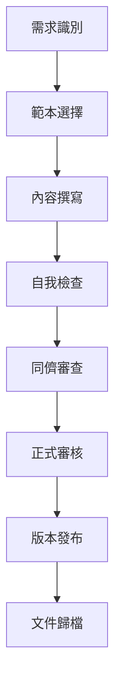
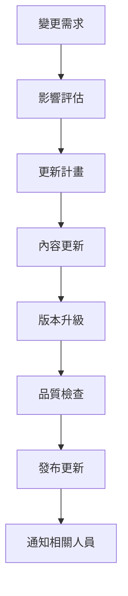
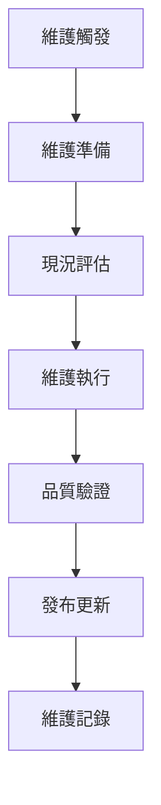

# 文件管理指南

## 一、文件管理概述

### 1.1 文件管理目的
本指南旨在建立標準化的文件管理體系，確保系統文件的完整性、一致性和可維護性，為系統開發、維護和使用提供完整的文件支援。

### 1.2 文件管理範圍
- **技術文件**：系統架構、設計規格、開發指南
- **功能文件**：功能規格書、操作手冊、使用說明
- **管理文件**：專案計畫、維護計畫、效能報告
- **支援文件**：範本、檢查清單、參考資料

### 1.3 文件管理原則
- **標準化**：使用統一的文件格式和結構
- **完整性**：確保文件內容完整且準確
- **一致性**：保持文件風格和格式一致
- **可維護性**：便於文件的更新和維護
- **可追溯性**：建立文件的版本控制和修訂記錄

---

## 二、文件分類與架構

### 2.1 文件分類體系

#### 2.1.1 按文件類型分類
```
文件體系
├── 技術文件
│   ├── 系統架構文件
│   ├── 設計規格文件
│   ├── 開發指南文件
│   └── API 規格文件
├── 功能文件
│   ├── 功能規格書
│   ├── 操作手冊
│   ├── 使用說明
│   └── 錯誤處理文件
├── 管理文件
│   ├── 專案計畫
│   ├── 維護計畫
│   ├── 效能報告
│   └── 風險評估
└── 支援文件
    ├── 文件範本
    ├── 檢查清單
    ├── 參考資料
    └── 工具說明
```

#### 2.1.2 按模組分類
```
模組文件架構
├── 總帳模組 (GL)
│   ├── 程式功能規格書
│   ├── 操作手冊
│   └── 技術文件
├── 銷貨模組 (NP)
│   ├── 程式功能規格書
│   ├── 操作手冊
│   └── 技術文件
├── 採購模組 (PC)
│   ├── 程式功能規格書
│   ├── 操作手冊
│   └── 技術文件
└── 產品模組 (PT)
    ├── 程式功能規格書
    ├── 操作手冊
    └── 技術文件
```

### 2.2 文件架構設計

#### 2.2.1 目錄結構
```
10.10.10.180/
├── 文件範本/                    # 標準化範本
│   ├── 程式功能規格書範本.md
│   ├── 操作手冊範本.md
│   ├── 技術文件範本.md
│   └── 文件管理指南.md
├── 總帳模組/                    # GL 模組文件
│   ├── 程式功能規格書/
│   ├── 操作手冊/
│   └── 技術文件/
├── 銷貨模組/                    # NP 模組文件
│   ├── 程式功能規格書/
│   ├── 操作手冊/
│   └── 技術文件/
├── 採購模組/                    # PC 模組文件
│   ├── 程式功能規格書/
│   ├── 操作手冊/
│   └── 技術文件/
├── 產品模組/                    # PT 模組文件
│   ├── 程式功能規格書/
│   ├── 操作手冊/
│   └── 技術文件/
└── 系統文件/                    # 系統級文件
    ├── 系統分析報告.md
    ├── 系統維護計畫書.md
    └── 系統效能優化建議書.md
```

---

## 三、文件命名規範

### 3.1 基本命名規則

#### 3.1.1 檔案命名格式
```
[模組代號]_[文件類型]_[功能代號]_[版本號].md
```

#### 3.1.2 命名範例
| 文件類型 | 模組代號 | 功能代號 | 完整檔名 |
|----------|----------|----------|----------|
| 程式功能規格書 | GL | WF01 | GL_程式功能規格書_WF01_v1.0.md |
| 操作手冊 | NP | WF01 | NP_操作手冊_WF01_v1.0.md |
| 技術文件 | PC | WF01 | PC_技術文件_WF01_v1.0.md |

### 3.2 特殊命名規則

#### 3.2.1 系統級文件
```
[文件類型]_[日期]_[序號].md
```

**範例**：
- `系統分析報告_20241219_001.md`
- `系統維護計畫書_20241219_001.md`
- `系統效能優化建議書_20241219_001.md`

#### 3.2.2 範本文件
```
[文件類型]範本.md
```

**範例**：
- `程式功能規格書範本.md`
- `操作手冊範本.md`
- `技術文件範本.md`

### 3.3 目錄命名規範

#### 3.3.1 模組目錄
```
[模組中文名稱]/
```

**範例**：
- `總帳模組/`
- `銷貨模組/`
- `採購模組/`

#### 3.3.2 文件類型目錄
```
[文件類型]/
```

**範例**：
- `程式功能規格書/`
- `操作手冊/`
- `技術文件/`

---

## 四、文件範本使用指南

### 4.1 範本選擇原則

#### 4.1.1 根據文件類型選擇
| 文件類型 | 適用範本 | 使用時機 |
|----------|----------|----------|
| 程式功能規格書 | 程式功能規格書範本.md | 開發新功能或修改現有功能時 |
| 操作手冊 | 操作手冊範本.md | 為使用者建立操作說明時 |
| 技術文件 | 技術文件範本.md | 建立技術架構或開發指南時 |

#### 4.1.2 根據使用對象選擇
| 使用對象 | 適用範本 | 文件重點 |
|----------|----------|----------|
| 開發人員 | 程式功能規格書範本.md | 技術細節、程式邏輯、資料結構 |
| 使用者 | 操作手冊範本.md | 操作步驟、畫面說明、常見問題 |
| 技術人員 | 技術文件範本.md | 系統架構、API規格、部署指南 |

### 4.2 範本使用步驟

#### 4.2.1 準備階段
1. **選擇適當範本**
   - 根據文件類型選擇對應範本
   - 確認範本版本是否最新
   - 檢查範本是否符合需求

2. **複製範本檔案**
   - 複製範本到目標目錄
   - 重新命名為目標文件名
   - 確認檔案權限設定

#### 4.2.2 內容填寫階段
1. **基本資訊填寫**
   - 填寫系統名稱、模組名稱等基本資訊
   - 設定撰寫人員、審核人員等責任資訊
   - 設定版本編號和文件狀態

2. **內容結構調整**
   - 根據實際需求調整章節結構
   - 移除不需要的章節
   - 新增必要的章節

3. **具體內容撰寫**
   - 根據範本提示填寫具體內容
   - 使用實際的資料和範例
   - 確保內容準確且完整

#### 4.2.3 審查與定稿階段
1. **自我檢查**
   - 檢查內容完整性
   - 檢查格式一致性
   - 檢查邏輯正確性

2. **同儕審查**
   - 邀請同事進行技術審查
   - 收集審查意見和建議
   - 根據審查結果進行修改

3. **正式審核**
   - 提交給主管或專案經理審核
   - 根據審核意見進行最終修改
   - 確認文件狀態為「已核准」

### 4.3 範本自訂原則

#### 4.3.1 可自訂項目
- **章節標題**：根據實際需求調整章節標題
- **內容範例**：使用實際的資料和範例
- **格式樣式**：在保持一致性的前提下調整格式
- **附錄內容**：根據需要新增或移除附錄

#### 4.3.2 不可自訂項目
- **基本結構**：保持範本的基本章節結構
- **命名規範**：遵循既定的命名規範
- **格式標準**：保持與其他文件的一致性
- **版本控制**：遵循版本控制規範

---

## 五、版本控制管理

### 5.1 版本編號規則

#### 5.1.1 版本格式
```
v[主版本號].[次版本號].[修訂版本號]
```

**範例**：
- `v1.0.0` - 初始版本
- `v1.1.0` - 功能增強版本
- `v1.1.1` - 錯誤修正版本

#### 5.1.2 版本升級規則
| 版本類型 | 升級條件 | 版本號變化 |
|----------|----------|------------|
| 主版本 | 重大功能變更、架構調整 | 主版本號 +1 |
| 次版本 | 新功能增加、功能優化 | 次版本號 +1 |
| 修訂版本 | 錯誤修正、內容更新 | 修訂版本號 +1 |

### 5.2 版本控制流程

#### 5.2.1 版本建立流程
1. **初始版本**
   - 文件完成初稿後建立 v1.0.0
   - 設定文件狀態為「草稿」
   - 記錄建立日期和人員

2. **版本升級**
   - 根據變更內容決定版本類型
   - 更新版本編號
   - 記錄變更內容和原因

3. **版本發布**
   - 完成審核後發布新版本
   - 更新文件狀態為「已核准」
   - 通知相關人員版本更新

#### 5.2.2 版本追蹤管理
1. **修訂記錄**
   - 在文件中記錄所有版本變更
   - 包含變更日期、人員、內容和原因
   - 建立完整的版本變更歷史

2. **版本比較**
   - 定期比較不同版本的差異
   - 識別重要的變更內容
   - 確保版本間的一致性

### 5.3 版本管理工具

#### 5.3.1 檔案系統管理
- **目錄結構**：使用目錄結構管理不同版本
- **檔案命名**：在檔名中包含版本資訊
- **備份管理**：定期備份重要版本

#### 5.3.2 版本控制系統
- **Git**：使用 Git 進行版本控制
- **分支管理**：建立主分支和開發分支
- **標籤管理**：為重要版本建立標籤

---

## 六、文件品質控制

### 6.1 品質標準

#### 6.1.1 內容品質標準
- **準確性**：內容必須準確且與實際系統一致
- **完整性**：涵蓋所有必要的資訊和細節
- **清晰性**：表達清楚、易於理解
- **實用性**：提供實用的資訊和指導

#### 6.1.2 格式品質標準
- **一致性**：格式和風格保持一致
- **可讀性**：版面清晰、易於閱讀
- **專業性**：呈現專業的文件品質
- **標準化**：遵循既定的格式標準

### 6.2 品質檢查流程

#### 6.2.1 自我檢查清單
- [ ] 基本資訊是否完整
- [ ] 內容結構是否合理
- [ ] 技術細節是否準確
- [ ] 格式是否一致
- [ ] 語言是否清晰

#### 6.2.2 同儕審查清單
- [ ] 技術內容是否正確
- [ ] 邏輯是否合理
- [ ] 範例是否適當
- [ ] 說明是否清楚
- [ ] 是否有遺漏內容

#### 6.2.3 正式審核清單
- [ ] 文件是否符合需求
- [ ] 內容是否完整準確
- [ ] 格式是否符合標準
- [ ] 是否通過品質檢查
- [ ] 是否可以正式發布

### 6.3 品質改善措施

#### 6.3.1 持續改善
- **定期檢討**：定期檢討文件品質
- **收集回饋**：收集使用者的回饋意見
- **更新優化**：根據回饋持續改善文件

#### 6.3.2 標準化提升
- **範本優化**：持續優化文件範本
- **流程改善**：改善文件管理流程
- **工具升級**：升級文件管理工具

---

## 七、文件維護管理

### 7.1 維護計畫

#### 7.1.1 定期維護項目
| 維護項目 | 維護頻率 | 負責人員 | 維護內容 |
|----------|----------|----------|----------|
| 內容更新 | 每月 | 文件負責人 | 更新過時內容、修正錯誤 |
| 格式檢查 | 每季 | 文件管理員 | 檢查格式一致性、更新範本 |
| 版本檢討 | 每半年 | 專案經理 | 檢討版本策略、更新版本規範 |
| 全面檢討 | 每年 | 文件委員會 | 全面檢討文件體系、制定改善計畫 |

#### 7.1.2 事件驅動維護
- **系統變更**：系統功能變更時更新相關文件
- **錯誤發現**：發現文件錯誤時立即修正
- **使用者回饋**：收到使用者回饋時進行改善
- **法規變更**：相關法規變更時更新文件

### 7.2 維護執行流程

#### 7.2.1 維護準備
1. **維護通知**
   - 提前通知相關人員維護計畫
   - 準備維護所需的資源和工具
   - 確認維護的時間和範圍

2. **現況評估**
   - 評估當前文件狀況
   - 識別需要維護的文件
   - 制定詳細的維護計畫

#### 7.2.2 維護執行
1. **內容更新**
   - 更新過時的內容
   - 修正發現的錯誤
   - 新增必要的資訊

2. **格式統一**
   - 檢查格式一致性
   - 更新過時的格式
   - 統一風格和標準

3. **版本管理**
   - 更新版本編號
   - 記錄維護內容
   - 更新修訂記錄

#### 7.2.3 維護驗證
1. **品質檢查**
   - 執行品質檢查流程
   - 確認維護效果
   - 驗證文件品質

2. **發布更新**
   - 發布更新後的版本
   - 通知相關人員
   - 更新文件狀態

---

## 八、文件使用指南

### 8.1 文件查詢

#### 8.1.1 查詢方式
- **目錄瀏覽**：按照目錄結構瀏覽文件
- **關鍵字搜尋**：使用搜尋功能查找特定內容
- **標籤分類**：按照標籤分類查找相關文件
- **版本比較**：比較不同版本的差異

#### 8.1.2 查詢技巧
- **使用精確關鍵字**：使用精確的關鍵字進行搜尋
- **組合查詢條件**：組合多個查詢條件縮小範圍
- **利用分類體系**：利用文件分類體系快速定位
- **參考相關文件**：查看相關文件獲取更多資訊

### 8.2 文件使用

#### 8.2.1 開發階段使用
- **需求分析**：參考功能規格書了解需求
- **系統設計**：參考技術文件進行設計
- **程式開發**：參考開發指南進行開發
- **測試驗證**：參考測試文件進行測試

#### 8.2.2 維護階段使用
- **問題診斷**：參考故障排除文件診斷問題
- **功能修改**：參考功能規格書了解修改範圍
- **系統優化**：參考效能優化文件進行優化
- **版本升級**：參考升級指南進行升級

#### 8.2.3 使用階段使用
- **功能學習**：參考操作手冊學習功能使用
- **問題解決**：參考常見問題文件解決問題
- **進階使用**：參考使用技巧文件提升使用效率
- **問題回報**：參考聯絡資訊進行問題回報

---

## 九、文件安全與備份

### 9.1 文件安全

#### 9.1.1 存取控制
- **權限管理**：根據角色設定文件存取權限
- **身份驗證**：要求使用者進行身份驗證
- **操作記錄**：記錄所有文件存取和操作
- **安全審計**：定期進行安全審計

#### 9.1.2 資料保護
- **敏感資訊保護**：保護包含敏感資訊的文件
- **傳輸加密**：加密文件傳輸過程
- **儲存加密**：加密重要文件的儲存
- **備份加密**：加密文件備份

### 9.2 文件備份

#### 9.2.1 備份策略
- **定期備份**：定期執行文件備份
- **增量備份**：只備份變更的文件
- **異地備份**：在異地建立備份副本
- **版本備份**：保留重要版本的備份

#### 9.2.2 備份管理
- **備份檢查**：定期檢查備份的完整性
- **備份測試**：定期測試備份的可用性
- **備份清理**：清理過期的備份檔案
- **備份記錄**：記錄所有備份操作

---

## 十、文件管理工具

### 10.1 工具選擇

#### 10.1.1 文件編輯工具
- **Markdown 編輯器**：支援 Markdown 語法的編輯器
- **版本控制工具**：Git 等版本控制系統
- **協作平台**：支援多人協作的平台
- **自動化工具**：文件生成和更新工具

#### 10.1.2 工具評估標準
- **易用性**：工具是否易於使用
- **功能性**：工具功能是否滿足需求
- **整合性**：工具是否能與現有系統整合
- **成本效益**：工具的性價比是否合理

### 10.2 工具使用

#### 10.2.1 基本操作
- **文件建立**：使用工具建立新文件
- **內容編輯**：使用工具編輯文件內容
- **格式設定**：使用工具設定文件格式
- **版本控制**：使用工具管理文件版本

#### 10.2.2 進階功能
- **自動化生成**：使用工具自動生成文件
- **格式轉換**：使用工具轉換文件格式
- **內容搜尋**：使用工具搜尋文件內容
- **協作編輯**：使用工具進行協作編輯

---

## 十一、文件管理流程

### 11.1 文件建立流程



### 11.2 文件更新流程



### 11.3 文件維護流程



---

## 十二、文件管理檢查清單

### 12.1 文件建立檢查清單

#### 12.1.1 內容檢查
- [ ] 基本資訊是否完整
- [ ] 內容結構是否合理
- [ ] 技術細節是否準確
- [ ] 範例是否適當
- [ ] 說明是否清楚

#### 12.1.2 格式檢查
- [ ] 格式是否一致
- [ ] 版面是否清晰
- [ ] 語言是否規範
- [ ] 標點符號是否正確
- [ ] 編號是否連續

#### 12.1.3 品質檢查
- [ ] 是否通過自我檢查
- [ ] 是否通過同儕審查
- [ ] 是否通過正式審核
- [ ] 是否完成版本控制
- [ ] 是否完成文件歸檔

### 12.2 文件維護檢查清單

#### 12.2.1 定期維護檢查
- [ ] 是否按計畫執行維護
- [ ] 維護內容是否完整
- [ ] 維護品質是否達標
- [ ] 是否完成版本升級
- [ ] 是否更新維護記錄

#### 12.2.2 事件驅動維護檢查
- [ ] 是否及時響應維護需求
- [ ] 維護範圍是否適當
- [ ] 維護效果是否滿意
- [ ] 是否完成影響評估
- [ ] 是否通知相關人員

---

## 十三、文件管理最佳實踐

### 13.1 建立階段最佳實踐

#### 13.1.1 需求分析
- **深入了解需求**：充分了解文件的使用需求
- **確定目標讀者**：明確文件的目標讀者群體
- **分析使用場景**：分析文件的使用場景和環境
- **評估影響範圍**：評估文件對系統的影響範圍

#### 13.1.2 內容規劃
- **制定內容大綱**：制定詳細的內容大綱
- **確定重點內容**：確定文件的重點和核心內容
- **設計內容結構**：設計合理的內容結構和流程
- **準備參考資料**：準備必要的參考資料和範例

#### 13.1.3 撰寫執行
- **遵循撰寫規範**：嚴格遵循撰寫規範和標準
- **保持內容一致**：保持內容的一致性和準確性
- **注重可讀性**：注重文件的可讀性和易理解性
- **及時檢查修正**：及時檢查和修正發現的問題

### 13.2 維護階段最佳實踐

#### 13.2.1 定期維護
- **建立維護計畫**：建立詳細的維護計畫和時程
- **執行品質檢查**：定期執行文件品質檢查
- **收集使用者回饋**：積極收集使用者的回饋意見
- **持續改善優化**：根據回饋持續改善和優化文件

#### 13.2.2 變更管理
- **評估變更影響**：充分評估變更對系統的影響
- **制定變更計畫**：制定詳細的變更計畫和步驟
- **執行變更作業**：按照計畫執行變更作業
- **驗證變更結果**：驗證變更的結果和效果

### 13.3 使用階段最佳實踐

#### 13.3.1 文件推廣
- **培訓使用者**：培訓使用者正確使用文件
- **建立使用指南**：建立詳細的使用指南和說明
- **提供支援服務**：提供文件使用的支援服務
- **收集使用數據**：收集文件使用的數據和統計

#### 13.3.2 效果評估
- **評估使用效果**：定期評估文件的使用效果
- **分析使用數據**：分析文件使用的數據和趨勢
- **識別改善機會**：識別文件改善的機會和方向
- **制定改善計畫**：制定詳細的改善計畫和措施

---

## 十四、文件管理常見問題

### 14.1 文件建立問題

#### 14.1.1 內容問題
**問題**：文件內容不完整或不準確

**解決方案**：
1. 建立詳細的內容檢查清單
2. 執行多層級的內容審查
3. 邀請專家進行技術審查
4. 建立內容品質標準

#### 14.1.2 格式問題
**問題**：文件格式不一致或不規範

**解決方案**：
1. 使用標準化的文件範本
2. 建立格式檢查機制
3. 培訓人員使用正確格式
4. 定期檢查格式一致性

### 14.2 文件維護問題

#### 14.2.1 更新不及時
**問題**：文件更新不及時或遺漏

**解決方案**：
1. 建立文件更新通知機制
2. 設定文件更新提醒
3. 指派專人負責文件更新
4. 建立文件更新檢查流程

#### 14.2.2 版本管理混亂
**問題**：文件版本管理混亂或遺失

**解決方案**：
1. 使用版本控制系統
2. 建立版本管理規範
3. 定期備份重要版本
4. 建立版本追蹤機制

### 14.3 文件使用問題

#### 14.3.1 查找困難
**問題**：使用者難以找到需要的文件

**解決方案**：
1. 建立清晰的文件分類體系
2. 提供多種搜尋方式
3. 建立文件索引和目錄
4. 提供文件使用指南

#### 14.3.2 內容理解困難
**問題**：使用者難以理解文件內容

**解決方案**：
1. 使用簡單明瞭的語言
2. 提供豐富的範例和說明
3. 建立常見問題解答
4. 提供培訓和支援服務

---

## 十五、文件管理未來發展

### 15.1 技術發展趨勢

#### 15.1.1 數位化轉型
- **雲端文件管理**：使用雲端平台管理文件
- **行動化存取**：支援行動設備存取文件
- **智慧化搜尋**：使用 AI 技術提升搜尋效果
- **自動化生成**：自動生成和更新文件

#### 15.1.2 協作化發展
- **即時協作**：支援多人即時協作編輯
- **版本控制**：更強大的版本控制功能
- **審核流程**：數位化的審核流程
- **通知機制**：智慧化的通知和提醒

### 15.2 管理發展方向

#### 15.2.1 標準化提升
- **國際標準**：採用國際文件管理標準
- **行業標準**：遵循行業最佳實踐
- **企業標準**：建立企業內部標準
- **持續改善**：持續改善和優化標準

#### 15.2.2 品質管理
- **品質體系**：建立完整的品質管理體系
- **品質監控**：實時監控文件品質
- **品質改善**：持續改善文件品質
- **品質認證**：獲得相關品質認證

---

## 十六、結論與建議

### 16.1 文件管理重要性

#### 16.1.1 對系統開發的重要性
- **需求明確**：明確系統需求和功能規格
- **設計指導**：指導系統設計和開發
- **品質保證**：保證系統開發品質
- **維護支援**：支援系統維護和升級

#### 16.1.2 對系統使用的重要性
- **操作指導**：指導使用者正確操作系統
- **問題解決**：幫助使用者解決使用問題
- **效率提升**：提升使用者使用效率
- **培訓支援**：支援使用者培訓和教育

### 16.2 關鍵成功因素

#### 16.2.1 管理因素
- **領導支持**：獲得管理層的充分支持
- **資源投入**：投入足夠的人力物力資源
- **流程建立**：建立完整的文件管理流程
- **持續改善**：持續改善文件管理體系

#### 16.2.2 技術因素
- **工具選擇**：選擇合適的文件管理工具
- **標準建立**：建立標準化的文件格式
- **自動化實作**：實作文件管理自動化
- **整合優化**：優化工具整合和協作

### 16.3 後續建議

#### 16.3.1 短期建議
1. **建立文件管理體系**：建立完整的文件管理體系
2. **培訓相關人員**：培訓文件管理相關人員
3. **建立檢查機制**：建立文件品質檢查機制
4. **開始文件建立**：開始建立系統文件

#### 16.3.2 長期建議
1. **持續改善優化**：持續改善和優化文件管理
2. **技術升級更新**：升級和更新文件管理技術
3. **標準化提升**：提升文件管理標準化水準
4. **國際化發展**：向國際化文件管理標準發展

---

## 十七、附錄

### 17.1 相關文件清單
| 文件名稱 | 文件類型 | 說明 |
|----------|----------|------|
| [文件1] | [類型1] | [說明1] |
| [文件2] | [類型2] | [說明2] |

### 17.2 工具清單
| 工具名稱 | 工具類型 | 用途說明 |
|----------|----------|----------|
| [工具1] | [類型1] | [用途說明1] |
| [工具2] | [類型2] | [用途說明2] |

### 17.3 聯絡資訊
| 職位 | 姓名 | 聯絡電話 | Email | 負責範圍 |
|------|------|----------|-------|----------|
| [職位1] | [姓名1] | [電話1] | [Email1] | [負責範圍1] |
| [職位2] | [姓名2] | [電話2] | [Email2] | [負責範圍2] |

---

## 十八、文件修訂記錄

| 版本 | 修訂日期 | 修訂人員 | 修訂內容 | 修訂原因 |
|------|----------|----------|----------|----------|
| v1.0 | [YYYY/MM/DD] | [修訂人員] | 初始版本 | 文件建立 |
| v1.1 | [YYYY/MM/DD] | [修訂人員] | [修訂內容] | [修訂原因] |

---

**文件建立日期**：[YYYY/MM/DD]  
**最後更新日期**：[YYYY/MM/DD]  
**文件狀態**：[草稿/審核中/已核准]  
**下次檢討日期**：[YYYY/MM/DD] 