# [模組名稱] 程式功能規格書

## 文件基本資訊

| 項目 | 說明 |
|------|------|
| **文件名稱** | [模組名稱] 程式功能規格書 |
| **模組代號** | [模組代號] |
| **版本** | v1.0 |
| **建立日期** | [建立日期] |
| **建立人員** | [建立人員姓名] |
| **審核人員** | [審核人員姓名] |
| **文件狀態** | 初稿/審查中/已核准 |
| **最後更新** | [最後更新日期] |

---

## 目錄

1. [基本資料](#基本資料)
2. [檔案架構與關聯圖](#檔案架構與關聯圖)
3. [檔案名稱與欄位規格](#檔案名稱與欄位規格)
4. [輸出/入螢幕布局與說明](#輸出入螢幕布局與說明)
5. [處理流程程序說明](#處理流程程序說明)
6. [子程序處理邏輯說明](#子程序處理邏輯說明)
7. [錯誤處理程序說明與訊息清冊](#錯誤處理程序說明與訊息清冊)
8. [備註](#備註)

---

## 基本資料

### 1.1 模組概述

#### 1.1.1 模組功能說明
[在此描述模組的主要功能和用途]

#### 1.1.2 模組特色
- **特色1**：[描述模組的特色]
- **特色2**：[描述模組的特色]
- **特色3**：[描述模組的特色]

#### 1.1.3 適用範圍
[描述模組適用的業務範圍和場景]

### 1.2 技術架構

#### 1.2.1 開發技術
- **程式語言**：[使用的程式語言]
- **資料庫**：[使用的資料庫系統]
- **開發工具**：[使用的開發工具]
- **部署環境**：[部署的環境]

#### 1.2.2 系統需求
- **硬體需求**：[硬體需求說明]
- **軟體需求**：[軟體需求說明]
- **網路需求**：[網路需求說明]

---

## 檔案架構與關聯圖

### 2.1 資料庫檔案架構

#### 2.1.1 主要資料表
```mermaid
erDiagram
    [主表1] ||--o{ [子表1] : "關聯關係"
    [主表1] ||--o{ [子表2] : "關聯關係"
    [主表2] ||--o{ [子表3] : "關聯關係"
    
    [主表1] {
        [主鍵欄位] [資料型態]
        [欄位1] [資料型態]
        [欄位2] [資料型態]
    }
    
    [子表1] {
        [主鍵欄位] [資料型態]
        [外鍵欄位] [資料型態]
        [欄位1] [資料型態]
    }
```

#### 2.1.2 資料表關聯說明
| 主表 | 子表 | 關聯類型 | 關聯欄位 | 關聯說明 |
|------|------|----------|----------|----------|
| [主表名稱] | [子表名稱] | 一對多 | [主鍵]:[外鍵] | [關聯說明] |
| [主表名稱] | [子表名稱] | 一對多 | [主鍵]:[外鍵] | [關聯說明] |

### 2.2 程式檔案架構

#### 2.2.1 程式檔案清單
| 檔案名稱 | 檔案類型 | 功能說明 | 備註 |
|----------|----------|----------|------|
| [檔案名稱] | [檔案類型] | [功能說明] | [備註] |
| [檔案名稱] | [檔案類型] | [功能說明] | [備註] |

#### 2.2.2 程式架構圖
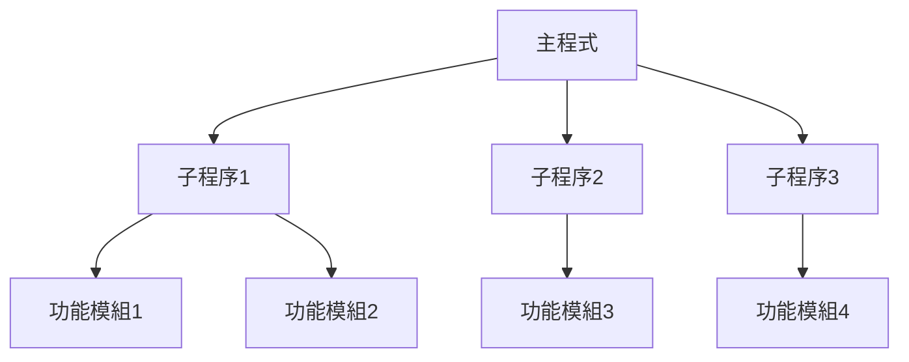

### 2.3 模組間關聯圖

#### 2.3.1 系統關聯圖
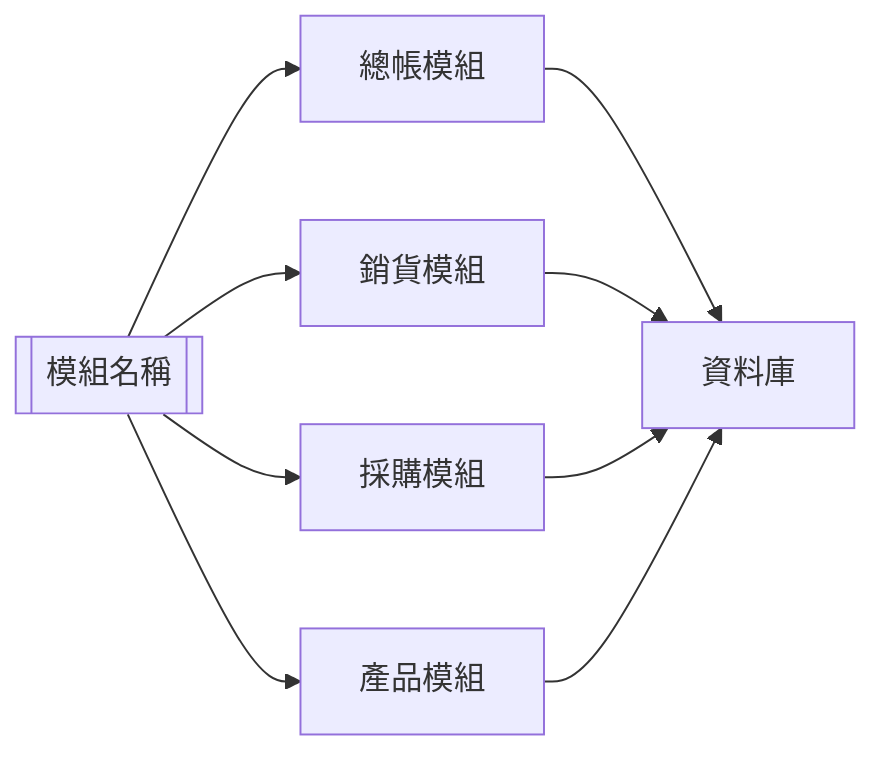

#### 2.3.2 資料流圖
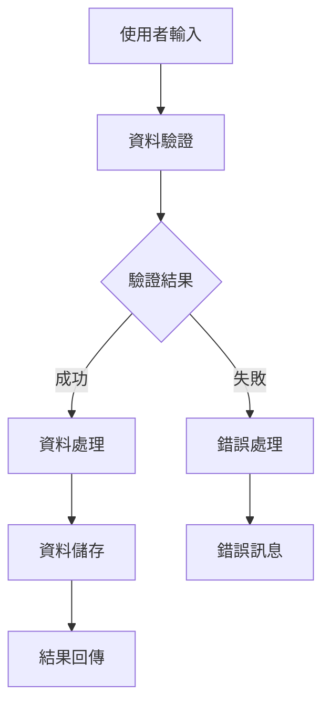

---

## 檔案名稱與欄位規格

### 3.1 資料庫檔案清單

#### 3.1.1 主要資料表
| 檔案名稱 | 檔案說明 | 記錄筆數 | 主要用途 |
|----------|----------|----------|----------|
| [檔案名稱] | [檔案說明] | [記錄筆數] | [主要用途] |
| [檔案名稱] | [檔案說明] | [記錄筆數] | [主要用途] |

#### 3.1.2 索引檔案
| 索引名稱 | 索引欄位 | 索引類型 | 說明 |
|----------|----------|----------|------|
| [索引名稱] | [索引欄位] | [索引類型] | [說明] |
| [索引名稱] | [索引欄位] | [索引類型] | [說明] |

### 3.2 欄位規格詳細說明

#### 3.2.1 [檔案名稱] 欄位規格
| 欄位代號 | 欄位名稱 | 位置 | 長度 | 型態 | 屬性 | 檢核說明 |
|----------|----------|------|------|------|------|----------|
| [欄位代號] | [欄位名稱] | [位置] | [長度] | [型態] | [屬性] | [檢核說明] |
| [欄位代號] | [欄位名稱] | [位置] | [長度] | [型態] | [屬性] | [檢核說明] |

#### 3.2.2 主鍵欄位說明
- **主鍵欄位**：[主鍵欄位名稱]
- **主鍵類型**：[主鍵類型說明]
- **主鍵規則**：[主鍵規則說明]

#### 3.2.3 外鍵欄位說明
- **外鍵欄位**：[外鍵欄位名稱]
- **參照主表**：[參照的主表名稱]
- **參照欄位**：[參照的主表欄位]
- **關聯規則**：[關聯規則說明]

---

## 輸出/入螢幕布局與說明

### 4.1 主畫面布局

#### 4.1.1 主畫面配置圖
```
┌─────────────────────────────────────────────────────────────┐
│                    [模組名稱] 主畫面                        │
├─────────────────────────────────────────────────────────────┤
│  功能選單: [新增] [查詢] [修改] [刪除] [列印] [離開]      │
├─────────────────────────────────────────────────────────────┤
│  查詢條件:                                                 │
│  [日期範圍] [編號範圍] [狀態] [關鍵字]                    │
├─────────────────────────────────────────────────────────────┤
│  資料列表:                                                 │
│  ┌─────────────────────────────────────────────────────┐   │
│  │ [編號] [日期] [狀態] [金額] [備註]                │   │
│  │ [001] [2024/12/19] [正常] [1000] [測試資料]      │   │
│  │ [002] [2024/12/19] [正常] [2000] [測試資料]      │   │
│  └─────────────────────────────────────────────────────┘   │
├─────────────────────────────────────────────────────────────┤
│  狀態列: 共 [筆數] 筆資料                                │
└─────────────────────────────────────────────────────────────┘
```

#### 4.1.2 主畫面欄位說明
| 欄位名稱 | 欄位類型 | 長度限制 | 驗證規則 | 說明 |
|----------|----------|----------|----------|------|
| [欄位名稱] | [欄位類型] | [長度限制] | [驗證規則] | [說明] |
| [欄位名稱] | [欄位類型] | [長度限制] | [驗證規則] | [說明] |

### 4.2 明細畫面布局

#### 4.2.1 明細畫面配置圖
```
┌─────────────────────────────────────────────────────────────┐
│                    [模組名稱] 明細畫面                      │
├─────────────────────────────────────────────────────────────┤
│  基本資料:                                                 │
│  [編號] [日期] [狀態]                                     │
│  [名稱] [類型] [金額]                                     │
│  [備註]                                                   │
├─────────────────────────────────────────────────────────────┤
│  明細資料:                                                 │
│  ┌─────────────────────────────────────────────────────┐   │
│  │ [項目] [數量] [單價] [小計] [備註]                │   │
│  │ [項目1] [10] [100] [1000] [說明]                  │   │
│  │ [項目2] [20] [100] [2000] [說明]                  │   │
│  └─────────────────────────────────────────────────────┘   │
├─────────────────────────────────────────────────────────────┤
│  功能按鈕: [儲存] [取消] [新增明細] [刪除明細]            │
└─────────────────────────────────────────────────────────────┘
```

#### 4.2.2 明細畫面欄位說明
| 欄位名稱 | 欄位類型 | 長度限制 | 驗證規則 | 說明 |
|----------|----------|----------|----------|------|
| [欄位名稱] | [欄位類型] | [長度限制] | [驗證規則] | [說明] |
| [欄位名稱] | [欄位類型] | [長度限制] | [驗證規則] | [說明] |

### 4.3 功能鍵說明

#### 4.3.1 主要功能鍵
| 功能鍵 | 功能說明 | 使用時機 | 注意事項 |
|--------|----------|----------|----------|
| F1 | 線上說明 | 任何時候 | 提供操作說明 |
| F3 | 新增資料 | 主畫面 | 需要新增權限 |
| F4 | 查詢資料 | 主畫面 | 可設定查詢條件 |
| F6 | 修改資料 | 選中資料後 | 需要修改權限 |
| F8 | 刪除資料 | 選中資料後 | 需要刪除權限 |
| F12 | 離開程式 | 任何時候 | 會提示儲存 |

#### 4.3.2 特殊功能鍵
| 功能鍵 | 功能說明 | 使用時機 | 注意事項 |
|--------|----------|----------|----------|
| Ctrl+S | 快速儲存 | 編輯中 | 等同於儲存按鈕 |
| Ctrl+Z | 復原操作 | 編輯中 | 可復原最近操作 |
| Ctrl+F | 快速查詢 | 主畫面 | 開啟查詢視窗 |

---

## 處理流程程序說明

### 5.1 主要業務流程

#### 5.1.1 新增資料流程
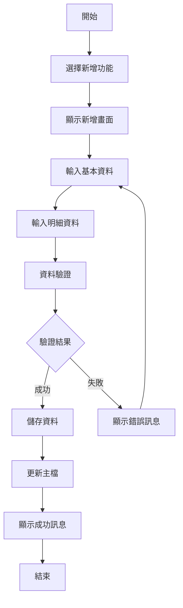

#### 5.1.2 查詢資料流程
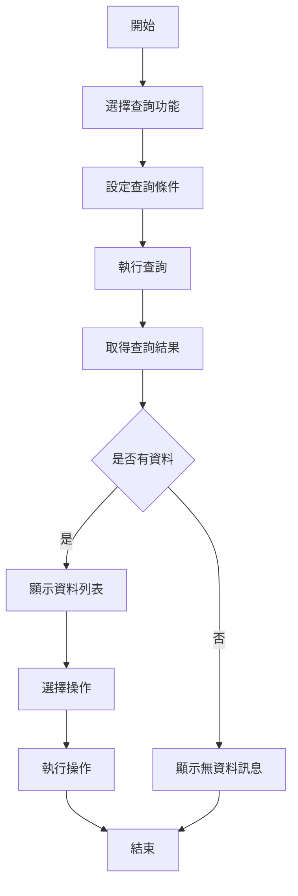

#### 5.1.3 修改資料流程
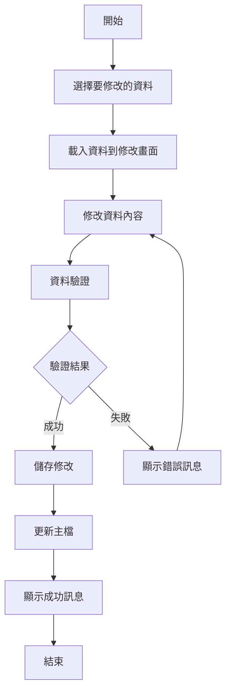

### 5.2 資料處理流程

#### 5.2.1 資料驗證流程
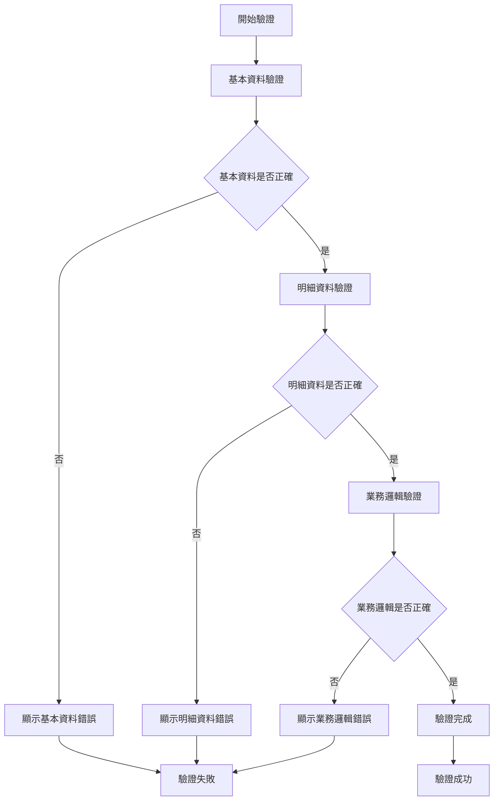

#### 5.2.2 資料儲存流程
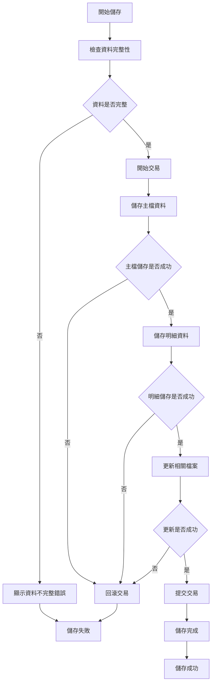

---

## 子程序處理邏輯說明

### 6.1 資料驗證子程序

#### 6.1.1 基本資料驗證邏輯
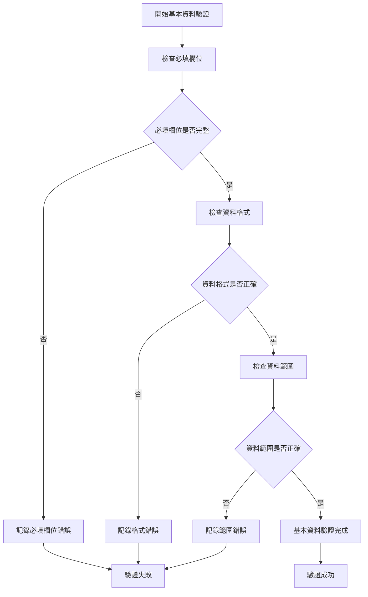

#### 6.1.2 明細資料驗證邏輯
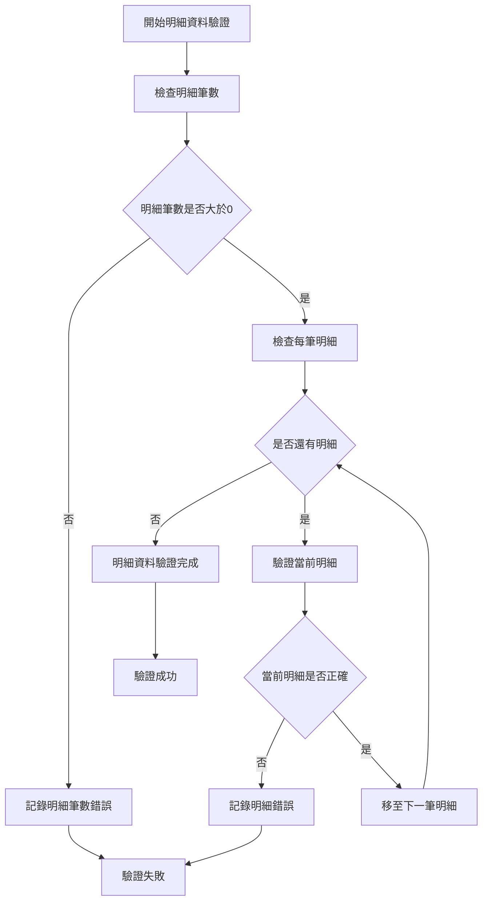

### 6.2 資料處理子程序

#### 6.2.1 資料計算邏輯
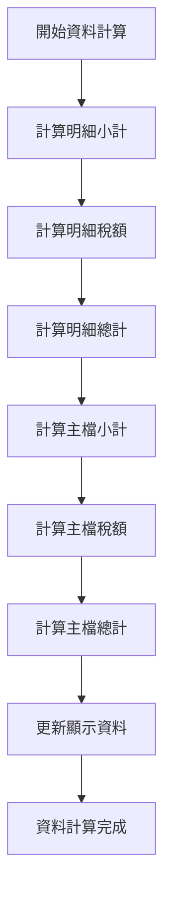

#### 6.2.2 資料更新邏輯
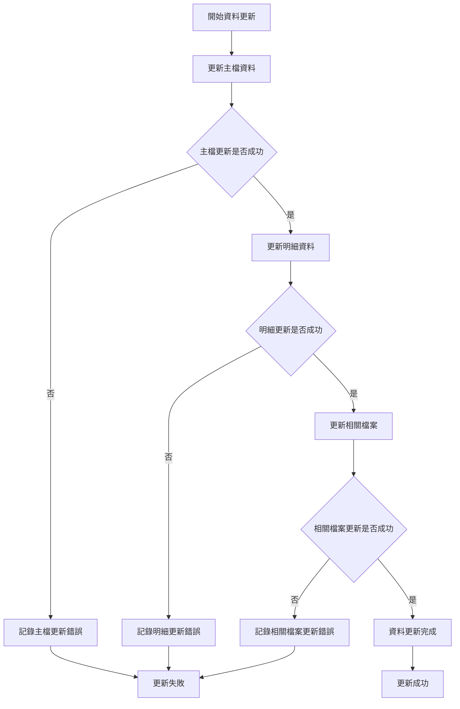

---

## 錯誤處理程序說明與訊息清冊

### 7.1 錯誤類型分類

#### 7.1.1 系統錯誤
- **資料庫錯誤**：資料庫連線、查詢、儲存等相關錯誤
- **程式錯誤**：程式執行、邏輯、記憶體等相關錯誤
- **網路錯誤**：網路連線、傳輸、逾時等相關錯誤

#### 7.1.2 業務錯誤
- **資料驗證錯誤**：資料格式、範圍、邏輯等相關錯誤
- **業務規則錯誤**：業務邏輯、權限、狀態等相關錯誤
- **使用者操作錯誤**：操作步驟、輸入、選擇等相關錯誤

#### 7.1.3 環境錯誤
- **硬體錯誤**：設備、記憶體、磁碟等相關錯誤
- **軟體錯誤**：作業系統、應用程式、驅動程式等相關錯誤
- **設定錯誤**：系統設定、參數、配置等相關錯誤

### 7.2 錯誤處理程序

#### 7.2.1 錯誤偵測流程
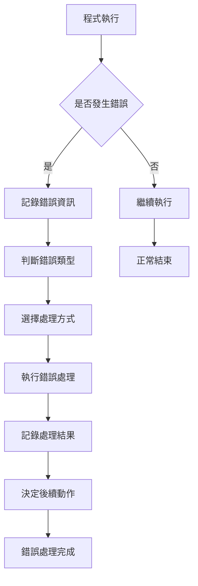

#### 7.2.2 錯誤處理方式
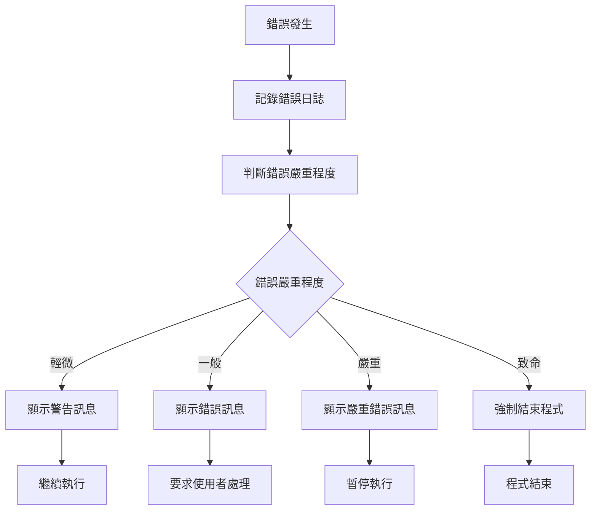

### 7.3 錯誤訊息清冊

#### 7.3.1 系統錯誤訊息
| 錯誤代碼 | 錯誤訊息 | 錯誤說明 | 處理方式 | 預防措施 |
|----------|----------|----------|----------|----------|
| SYS001 | 資料庫連線失敗 | 無法連接到資料庫 | 檢查網路和資料庫狀態 | 定期檢查網路連線 |
| SYS002 | 記憶體不足 | 系統記憶體不足 | 關閉其他程式或重啟 | 定期清理記憶體 |
| SYS003 | 檔案存取錯誤 | 無法存取檔案 | 檢查檔案權限和路徑 | 定期檢查檔案權限 |

#### 7.3.2 業務錯誤訊息
| 錯誤代碼 | 錯誤訊息 | 錯誤說明 | 處理方式 | 預防措施 |
|----------|----------|----------|----------|----------|
| BUS001 | 必填欄位未填寫 | 必填欄位為空白 | 填寫必填欄位 | 加強欄位驗證 |
| BUS002 | 資料格式錯誤 | 資料格式不符合規定 | 修正資料格式 | 提供格式說明 |
| BUS003 | 資料範圍錯誤 | 資料超出允許範圍 | 修正資料範圍 | 設定合理範圍 |

#### 7.3.3 使用者操作錯誤訊息
| 錯誤代碼 | 錯誤訊息 | 錯誤說明 | 處理方式 | 預防措施 |
|----------|----------|----------|----------|----------|
| USR001 | 權限不足 | 使用者沒有操作權限 | 聯絡系統管理員 | 定期檢查權限設定 |
| USR002 | 操作步驟錯誤 | 操作步驟不正確 | 按照正確步驟操作 | 提供操作說明 |
| USR003 | 資料選擇錯誤 | 選擇的資料不正確 | 重新選擇正確資料 | 加強資料驗證 |

### 7.4 錯誤預防措施

#### 7.4.1 程式層面預防
- **輸入驗證**：加強所有輸入資料的驗證
- **異常處理**：完善所有可能的異常情況處理
- **日誌記錄**：詳細記錄所有操作和錯誤資訊
- **定期檢查**：定期檢查系統狀態和效能

#### 7.4.2 使用者層面預防
- **操作培訓**：提供完整的操作培訓
- **操作說明**：提供詳細的操作說明文件
- **錯誤提示**：提供即時的錯誤提示和建議
- **操作確認**：重要操作前要求使用者確認

---

## 備註

### 8.1 特殊說明

#### 8.1.1 技術注意事項
- [在此說明技術相關的特殊注意事項]
- [在此說明技術相關的特殊注意事項]
- [在此說明技術相關的特殊注意事項]

#### 8.1.2 業務注意事項
- [在此說明業務相關的特殊注意事項]
- [在此說明業務相關的特殊注意事項]
- [在此說明業務相關的特殊注意事項]

#### 8.1.3 維護注意事項
- [在此說明維護相關的特殊注意事項]
- [在此說明維護相關的特殊注意事項]
- [在此說明維護相關的特殊注意事項]

### 8.2 相關文件

#### 8.2.1 技術文件
- [相關技術文件連結]
- [相關技術文件連結]
- [相關技術文件連結]

#### 8.2.2 業務文件
- [相關業務文件連結]
- [相關業務文件連結]
- [相關業務文件連結]

#### 8.2.3 操作文件
- [相關操作文件連結]
- [相關操作文件連結]
- [相關操作文件連結]

### 8.3 更新記錄

| 版本 | 更新日期 | 更新人員 | 更新內容 | 審核人員 |
|------|----------|----------|----------|----------|
| v1.0 | [日期] | [姓名] | 初始版本 | [姓名] |
| v1.1 | [日期] | [姓名] | [更新內容] | [姓名] |

---

**文件建立日期**：[建立日期]  
**建立人員簽署**：[簽名]  
**審核人員簽署**：[簽名]  
**品質管理確認**：[簽名]
