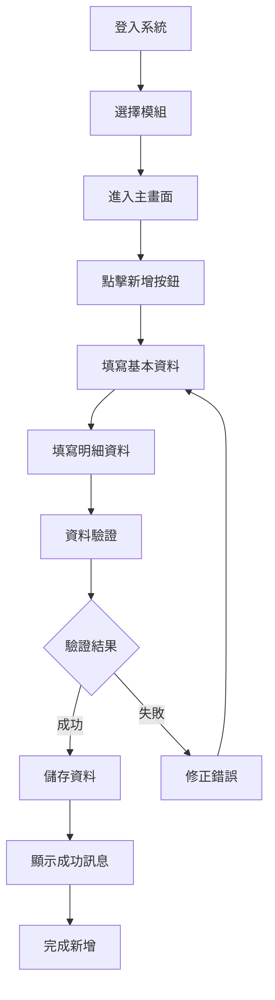
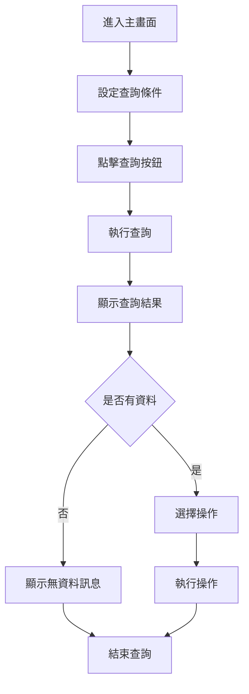
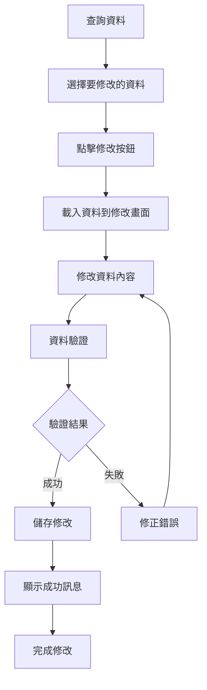
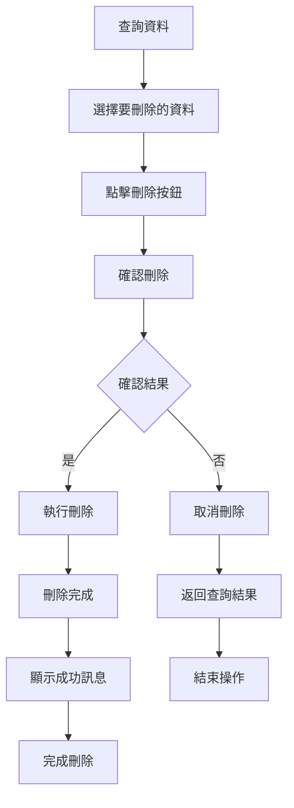

# [模組名稱] 操作手冊

## 文件基本資訊

| 項目 | 說明 |
|------|------|
| **文件名稱** | [模組名稱] 操作手冊 |
| **模組代號** | [模組代號] |
| **版本** | v1.0 |
| **建立日期** | [建立日期] |
| **建立人員** | [建立人員姓名] |
| **審核人員** | [審核人員姓名] |
| **適用對象** | [適用對象說明] |
| **前置條件** | [前置條件說明] |
| **文件狀態** | 初稿/審查中/已核准 |
| **最後更新** | [最後更新日期] |

---

## 目錄

1. [系統概述](#系統概述)
2. [操作前準備](#操作前準備)
3. [基本操作流程](#基本操作流程)
4. [功能操作說明](#功能操作說明)
5. [畫面配置說明](#畫面配置說明)
6. [操作技巧與最佳實踐](#操作技巧與最佳實踐)
7. [常見問題與解決方案](#常見問題與解決方案)
8. [故障排除](#故障排除)
9. [聯絡支援](#聯絡支援)
10. [附錄](#附錄)

---

## 系統概述

### 1.1 模組功能說明

#### 1.1.1 主要功能
[在此描述模組的主要功能和用途]

#### 1.1.2 功能特色
- **特色1**：[描述模組的特色]
- **特色2**：[描述模組的特色]
- **特色3**：[描述模組的特色]

#### 1.1.3 適用場景
[描述模組適用的業務場景和情況]

### 1.2 系統需求

#### 1.2.1 硬體需求
- **處理器**：[處理器需求]
- **記憶體**：[記憶體需求]
- **硬碟空間**：[硬碟空間需求]
- **網路**：[網路需求]

#### 1.2.2 軟體需求
- **作業系統**：[作業系統需求]
- **瀏覽器**：[瀏覽器需求]
- **其他軟體**：[其他軟體需求]

#### 1.2.3 權限需求
- **使用者權限**：[使用者權限說明]
- **角色權限**：[角色權限說明]
- **功能權限**：[功能權限說明]

---

## 操作前準備

### 2.1 登入系統

#### 2.1.1 登入步驟
1. **開啟瀏覽器**
   - 開啟支援的網頁瀏覽器
   - 建議使用 Chrome、Firefox 或 Edge

2. **輸入網址**
   - 在網址列輸入系統網址
   - 按 Enter 鍵進入系統

3. **輸入帳號密碼**
   - 輸入使用者帳號
   - 輸入使用者密碼
   - 點擊「登入」按鈕

4. **選擇模組**
   - 登入成功後，選擇要使用的模組
   - 點擊模組名稱進入

#### 2.1.2 登入注意事項
- **帳號安全**：請妥善保管帳號密碼，不要與他人分享
- **登出習慣**：使用完畢後請務必登出系統
- **密碼定期更換**：建議定期更換密碼以確保安全

### 2.2 系統環境設定

#### 2.2.1 瀏覽器設定
- **啟用 JavaScript**：確保瀏覽器已啟用 JavaScript
- **啟用 Cookie**：確保瀏覽器已啟用 Cookie
- **彈出視窗**：允許系統彈出視窗

#### 2.2.2 螢幕解析度
- **建議解析度**：1920x1080 或以上
- **最小解析度**：1366x768
- **字體大小**：建議使用預設字體大小

### 2.3 權限確認

#### 2.3.1 權限檢查
- **功能權限**：確認是否有使用該模組的權限
- **資料權限**：確認是否有存取相關資料的權限
- **操作權限**：確認是否有新增、修改、刪除的權限

#### 2.3.2 權限不足處理
- **聯絡管理員**：如發現權限不足，請聯絡系統管理員
- **申請權限**：填寫權限申請表，說明需要的權限和原因
- **等待核准**：等待管理員核准後即可使用

---

## 基本操作流程

### 3.1 新增資料流程

#### 3.1.1 操作步驟


#### 3.1.2 詳細操作說明
1. **進入新增畫面**
   - 在主畫面點擊「新增」按鈕或按 F3 鍵
   - 系統會開啟新增資料畫面

2. **填寫基本資料**
   - 依序填寫各欄位資料
   - 必填欄位會以紅色星號標示
   - 系統會即時驗證資料格式

3. **填寫明細資料**
   - 點擊「新增明細」按鈕
   - 填寫明細欄位資料
   - 可重複新增多筆明細

4. **儲存資料**
   - 點擊「儲存」按鈕或按 Ctrl+S
   - 系統會進行完整驗證
   - 驗證成功後儲存資料

### 3.2 查詢資料流程

#### 3.2.1 操作步驟


#### 3.2.2 詳細操作說明
1. **設定查詢條件**
   - 在查詢條件區域輸入查詢條件
   - 可設定日期範圍、編號範圍等
   - 支援模糊查詢和精確查詢

2. **執行查詢**
   - 點擊「查詢」按鈕或按 F4 鍵
   - 系統會根據條件執行查詢
   - 查詢結果會顯示在資料列表中

3. **查看查詢結果**
   - 查詢結果以列表形式顯示
   - 可使用分頁功能瀏覽大量資料
   - 支援排序和篩選功能

### 3.3 修改資料流程

#### 3.3.1 操作步驟


#### 3.3.2 詳細操作說明
1. **選擇要修改的資料**
   - 在查詢結果中點選要修改的資料
   - 點擊「修改」按鈕或按 F6 鍵

2. **修改資料內容**
   - 系統會載入原始資料
   - 修改需要變更的欄位
   - 保持其他欄位不變

3. **儲存修改**
   - 點擊「儲存」按鈕
   - 系統會驗證修改後的資料
   - 驗證成功後儲存修改

### 3.4 刪除資料流程

#### 3.4.1 操作步驟


#### 3.4.2 詳細操作說明
1. **選擇要刪除的資料**
   - 在查詢結果中點選要刪除的資料
   - 點擊「刪除」按鈕或按 F8 鍵

2. **確認刪除**
   - 系統會顯示確認對話框
   - 確認要刪除的資料是否正確
   - 點擊「確定」執行刪除

3. **刪除完成**
   - 系統會執行刪除操作
   - 刪除成功後顯示成功訊息
   - 資料會從系統中移除

---

## 功能操作說明

### 4.1 主要功能操作

#### 4.1.1 新增功能
- **功能說明**：新增一筆新的資料記錄
- **使用時機**：需要建立新資料時使用
- **操作方式**：點擊新增按鈕或按 F3 鍵
- **注意事項**：新增前請確認資料的正確性

#### 4.1.2 查詢功能
- **功能說明**：根據條件查詢資料
- **使用時機**：需要查看或搜尋資料時使用
- **操作方式**：設定查詢條件後點擊查詢按鈕
- **注意事項**：查詢條件越精確，查詢結果越準確

#### 4.1.3 修改功能
- **功能說明**：修改現有資料的內容
- **使用時機**：需要更新資料內容時使用
- **操作方式**：選擇資料後點擊修改按鈕
- **注意事項**：修改後請務必儲存，否則修改會遺失

#### 4.1.4 刪除功能
- **功能說明**：刪除不需要的資料記錄
- **使用時機**：需要移除錯誤或過期資料時使用
- **操作方式**：選擇資料後點擊刪除按鈕
- **注意事項**：刪除後無法復原，請謹慎操作

### 4.2 進階功能操作

#### 4.2.1 批次處理
- **功能說明**：一次處理多筆資料
- **使用時機**：需要大量處理資料時使用
- **操作方式**：選擇多筆資料後執行批次操作
- **注意事項**：批次處理前請確認選擇的資料正確

#### 4.2.2 資料匯出
- **功能說明**：將查詢結果匯出為檔案
- **使用時機**：需要將資料用於其他用途時使用
- **操作方式**：查詢完成後點擊匯出按鈕
- **支援格式**：Excel、CSV、PDF 等格式

#### 4.2.3 資料列印
- **功能說明**：列印查詢結果或報表
- **使用時機**：需要紙本資料時使用
- **操作方式**：選擇要列印的資料後點擊列印按鈕
- **列印設定**：可設定列印範圍和格式

### 4.3 輔助功能操作

#### 4.3.1 線上說明
- **功能說明**：查看操作說明和幫助資訊
- **使用時機**：操作遇到問題時使用
- **操作方式**：按 F1 鍵或點擊說明按鈕
- **內容包括**：操作步驟、欄位說明、常見問題等

#### 4.3.2 資料重新整理
- **功能說明**：重新載入最新資料
- **使用時機**：資料可能已更新時使用
- **操作方式**：按 F5 鍵或點擊重新整理按鈕
- **注意事項**：重新整理會清除未儲存的修改

#### 4.3.3 畫面設定
- **功能說明**：自訂畫面顯示方式
- **使用時機**：需要調整畫面配置時使用
- **操作方式**：點擊設定按鈕進行畫面設定
- **設定項目**：欄位顯示、排序方式、分頁大小等

---

## 畫面配置說明

### 5.1 主畫面配置

#### 5.1.1 主畫面配置圖
```
┌─────────────────────────────────────────────────────────────┐
│                    [模組名稱] 主畫面                        │
├─────────────────────────────────────────────────────────────┤
│  功能選單: [新增] [查詢] [修改] [刪除] [列印] [離開]      │
├─────────────────────────────────────────────────────────────┤
│  查詢條件:                                                 │
│  [日期範圍] [編號範圍] [狀態] [關鍵字]                    │
├─────────────────────────────────────────────────────────────┤
│  資料列表:                                                 │
│  ┌─────────────────────────────────────────────────────┐   │
│  │ [編號] [日期] [狀態] [金額] [備註]                │   │
│  │ [001] [2024/12/19] [正常] [1000] [測試資料]      │   │
│  │ [002] [2024/12/19] [正常] [2000] [測試資料]      │   │
│  └─────────────────────────────────────────────────────┘   │
├─────────────────────────────────────────────────────────────┤
│  狀態列: 共 [筆數] 筆資料                                │
└─────────────────────────────────────────────────────────────┘
```

#### 5.1.2 主畫面區域說明
| 區域名稱 | 位置 | 功能說明 | 使用方式 |
|----------|------|----------|----------|
| 功能選單 | 上方 | 提供主要功能按鈕 | 點擊按鈕執行對應功能 |
| 查詢條件 | 中上方 | 設定查詢條件 | 輸入查詢條件後執行查詢 |
| 資料列表 | 中央 | 顯示查詢結果 | 點選資料進行操作 |
| 狀態列 | 下方 | 顯示系統狀態 | 查看資料筆數和系統訊息 |

### 5.2 新增/修改畫面配置

#### 5.2.1 新增/修改畫面配置圖
```
┌─────────────────────────────────────────────────────────────┐
│                    [模組名稱] 新增/修改畫面                │
├─────────────────────────────────────────────────────────────┤
│  基本資料:                                                 │
│  [編號] [日期] [狀態]                                     │
│  [名稱] [類型] [金額]                                     │
│  [備註]                                                   │
├─────────────────────────────────────────────────────────────┤
│  明細資料:                                                 │
│  ┌─────────────────────────────────────────────────────┐   │
│  │ [項目] [數量] [單價] [小計] [備註]                │   │
│  │ [項目1] [10] [100] [1000] [說明]                  │   │
│  │ [項目2] [20] [100] [2000] [說明]                  │   │
│  └─────────────────────────────────────────────────────┘   │
├─────────────────────────────────────────────────────────────┤
│  功能按鈕: [儲存] [取消] [新增明細] [刪除明細]            │
└─────────────────────────────────────────────────────────────┘
```

#### 5.2.2 新增/修改畫面區域說明
| 區域名稱 | 位置 | 功能說明 | 使用方式 |
|----------|------|----------|----------|
| 基本資料 | 上方 | 輸入主要資料 | 依序填寫各欄位資料 |
| 明細資料 | 中央 | 輸入明細資料 | 點擊新增明細按鈕新增 |
| 功能按鈕 | 下方 | 執行相關操作 | 點擊按鈕執行對應功能 |

### 5.3 欄位說明

#### 5.3.1 基本資料欄位
| 欄位名稱 | 欄位類型 | 長度限制 | 驗證規則 | 說明 |
|----------|----------|----------|----------|------|
| 編號 | 文字 | 20字元 | 必填，不可重複 | 系統自動產生或手動輸入 |
| 日期 | 日期 | 10字元 | 必填，格式：YYYY/MM/DD | 選擇或輸入日期 |
| 狀態 | 下拉選單 | - | 必填 | 從預設選項中選擇 |
| 名稱 | 文字 | 100字元 | 必填 | 輸入名稱或描述 |
| 類型 | 下拉選單 | - | 必填 | 從預設選項中選擇 |
| 金額 | 數字 | 15位數 | 必填，大於0 | 輸入金額，支援小數點 |
| 備註 | 文字 | 500字元 | 選填 | 輸入額外說明 |

#### 5.3.2 明細資料欄位
| 欄位名稱 | 欄位類型 | 長度限制 | 驗證規則 | 說明 |
|----------|----------|----------|----------|------|
| 項目 | 文字 | 100字元 | 必填 | 輸入項目名稱 |
| 數量 | 數字 | 10位數 | 必填，大於0 | 輸入數量 |
| 單價 | 數字 | 15位數 | 必填，大於等於0 | 輸入單價 |
| 小計 | 數字 | 15位數 | 自動計算 | 數量 × 單價 |
| 備註 | 文字 | 200字元 | 選填 | 輸入項目說明 |

---

## 操作技巧與最佳實踐

### 6.1 快捷操作技巧

#### 6.1.1 鍵盤快捷鍵
| 功能 | 快捷鍵 | 使用時機 | 說明 |
|------|--------|----------|------|
| 新增 | F3 | 主畫面 | 快速新增資料 |
| 查詢 | F4 | 主畫面 | 快速執行查詢 |
| 修改 | F6 | 選中資料後 | 快速修改資料 |
| 刪除 | F8 | 選中資料後 | 快速刪除資料 |
| 儲存 | Ctrl+S | 編輯中 | 快速儲存資料 |
| 取消 | Esc | 編輯中 | 取消當前操作 |
| 說明 | F1 | 任何時候 | 開啟線上說明 |

#### 6.1.2 滑鼠操作技巧
- **雙擊**：雙擊資料項目可快速進入修改模式
- **右鍵選單**：右鍵點擊可顯示相關操作選單
- **拖曳**：可拖曳欄位標題調整欄位順序
- **滾輪**：使用滑鼠滾輪可快速瀏覽長列表

### 6.2 資料輸入技巧

#### 6.2.1 快速輸入技巧
- **複製貼上**：使用 Ctrl+C 和 Ctrl+V 快速複製貼上
- **自動完成**：系統會記憶常用輸入，提供自動完成建議
- **預設值**：系統會自動填入常用預設值
- **批次輸入**：可使用 Excel 匯入功能批次輸入資料

#### 6.2.2 資料驗證技巧
- **即時驗證**：輸入時系統會即時驗證資料格式
- **錯誤提示**：錯誤欄位會以紅色標示並顯示錯誤訊息
- **修正建議**：系統會提供修正建議和正確格式說明
- **驗證報告**：可查看完整的驗證報告

### 6.3 查詢優化技巧

#### 6.3.1 查詢條件設定
- **精確查詢**：使用精確條件可提高查詢效率
- **範圍查詢**：使用日期範圍、編號範圍等可縮小查詢範圍
- **關鍵字查詢**：使用關鍵字可快速找到相關資料
- **組合查詢**：組合多個條件可提高查詢準確性

#### 6.3.2 查詢結果處理
- **分頁瀏覽**：大量資料可使用分頁功能瀏覽
- **排序功能**：可依不同欄位排序查看資料
- **篩選功能**：可使用篩選功能進一步縮小結果範圍
- **匯出功能**：查詢結果可匯出為檔案供其他用途使用

### 6.4 效能優化建議

#### 6.4.1 系統效能
- **定期清理**：定期清理瀏覽器快取和暫存檔案
- **關閉其他程式**：使用系統時關閉不必要的其他程式
- **網路優化**：確保網路連線穩定，避免網路延遲
- **硬體升級**：如效能不足可考慮硬體升級

#### 6.4.2 操作效能
- **批次操作**：盡量使用批次操作處理大量資料
- **避免重複查詢**：查詢結果可暫存，避免重複查詢
- **使用快捷鍵**：熟練使用快捷鍵可提高操作效率
- **預先準備**：操作前先準備好所需資料和資訊

---

## 常見問題與解決方案

### 7.1 登入相關問題

#### 7.1.1 無法登入系統
**問題描述**：輸入帳號密碼後無法登入系統

**可能原因**：
- 帳號或密碼錯誤
- 帳號已被鎖定
- 系統維護中
- 網路連線問題

**解決方案**：
1. 檢查帳號密碼是否正確
2. 確認帳號是否被鎖定
3. 聯絡系統管理員確認系統狀態
4. 檢查網路連線是否正常

#### 7.1.2 登入後權限不足
**問題描述**：登入成功但無法使用某些功能

**可能原因**：
- 使用者權限設定不足
- 角色權限未正確設定
- 功能權限被停用

**解決方案**：
1. 聯絡系統管理員申請權限
2. 確認角色權限設定
3. 檢查功能權限狀態

### 7.2 資料操作問題

#### 7.2.1 無法新增資料
**問題描述**：點擊新增按鈕後無法新增資料

**可能原因**：
- 沒有新增權限
- 必填欄位未填寫
- 資料格式錯誤
- 系統錯誤

**解決方案**：
1. 確認是否有新增權限
2. 檢查必填欄位是否已填寫
3. 檢查資料格式是否正確
4. 重新整理頁面或聯絡技術支援

#### 7.2.2 無法修改資料
**問題描述**：選擇資料後無法修改

**可能原因**：
- 沒有修改權限
- 資料已被鎖定
- 資料狀態不允許修改
- 系統錯誤

**解決方案**：
1. 確認是否有修改權限
2. 檢查資料是否被鎖定
3. 確認資料狀態是否允許修改
4. 重新整理頁面或聯絡技術支援

#### 7.2.3 無法刪除資料
**問題描述**：選擇資料後無法刪除

**可能原因**：
- 沒有刪除權限
- 資料已被使用
- 資料狀態不允許刪除
- 系統錯誤

**解決方案**：
1. 確認是否有刪除權限
2. 檢查資料是否被其他功能使用
3. 確認資料狀態是否允許刪除
4. 重新整理頁面或聯絡技術支援

### 7.3 查詢相關問題

#### 7.3.1 查詢無結果
**問題描述**：執行查詢後沒有顯示任何結果

**可能原因**：
- 查詢條件設定錯誤
- 資料庫中沒有符合條件的資料
- 查詢條件過於嚴格
- 系統錯誤

**解決方案**：
1. 檢查查詢條件是否正確
2. 放寬查詢條件重新查詢
3. 確認資料是否存在
4. 聯絡技術支援

#### 7.3.2 查詢結果不正確
**問題描述**：查詢結果與預期不符

**可能原因**：
- 查詢條件理解錯誤
- 資料已更新但未重新查詢
- 系統快取問題
- 資料不一致

**解決方案**：
1. 重新確認查詢條件
2. 重新整理查詢結果
3. 清除瀏覽器快取
4. 聯絡技術支援

### 7.4 系統效能問題

#### 7.4.1 系統反應緩慢
**問題描述**：系統操作反應緩慢

**可能原因**：
- 網路連線緩慢
- 系統負載過重
- 瀏覽器效能問題
- 硬體效能不足

**解決方案**：
1. 檢查網路連線速度
2. 關閉其他不必要的程式
3. 清除瀏覽器快取
4. 考慮硬體升級

#### 7.4.2 畫面顯示異常
**問題描述**：畫面顯示不正確或異常

**可能原因**：
- 瀏覽器相容性問題
- 螢幕解析度不支援
- 瀏覽器設定問題
- 系統錯誤

**解決方案**：
1. 使用建議的瀏覽器
2. 調整螢幕解析度
3. 檢查瀏覽器設定
4. 重新整理頁面

---

## 故障排除

### 8.1 系統故障排除

#### 8.1.1 系統無法連線
**故障現象**：無法連接到系統

**排除步驟**：
1. **檢查網路連線**
   - 確認網路連線是否正常
   - 測試其他網站是否可正常連線

2. **檢查系統狀態**
   - 聯絡系統管理員確認系統狀態
   - 確認是否有系統維護通知

3. **檢查瀏覽器設定**
   - 確認瀏覽器設定是否正確
   - 清除瀏覽器快取和 Cookie

4. **嘗試其他瀏覽器**
   - 使用不同的瀏覽器測試
   - 確認是否為瀏覽器相容性問題

#### 8.1.2 系統功能異常
**故障現象**：系統功能無法正常使用

**排除步驟**：
1. **重新整理頁面**
   - 按 F5 鍵重新整理頁面
   - 清除瀏覽器快取

2. **重新登入系統**
   - 登出系統後重新登入
   - 確認權限設定是否正確

3. **檢查系統訊息**
   - 查看系統是否有錯誤訊息
   - 記錄錯誤訊息內容

4. **聯絡技術支援**
   - 提供詳細的故障描述
   - 提供錯誤訊息和操作步驟

### 8.2 資料故障排除

#### 8.2.1 資料顯示異常
**故障現象**：資料顯示不正確或異常

**排除步驟**：
1. **重新查詢資料**
   - 重新執行查詢操作
   - 確認查詢條件是否正確

2. **檢查資料完整性**
   - 確認資料是否完整
   - 檢查是否有資料損壞

3. **清除快取**
   - 清除瀏覽器快取
   - 重新載入資料

4. **聯絡資料管理員**
   - 確認資料是否正確
   - 檢查資料庫狀態

#### 8.2.2 資料操作失敗
**故障現象**：資料操作（新增、修改、刪除）失敗

**排除步驟**：
1. **檢查操作權限**
   - 確認是否有操作權限
   - 檢查角色權限設定

2. **檢查資料狀態**
   - 確認資料狀態是否允許操作
   - 檢查資料是否被鎖定

3. **檢查資料驗證**
   - 確認資料是否符合驗證規則
   - 檢查必填欄位是否已填寫

4. **聯絡技術支援**
   - 提供詳細的錯誤訊息
   - 提供操作步驟和資料內容

### 8.3 效能故障排除

#### 8.3.1 系統效能下降
**故障現象**：系統操作效能明顯下降

**排除步驟**：
1. **檢查網路狀況**
   - 測試網路連線速度
   - 確認網路是否有延遲

2. **檢查系統負載**
   - 聯絡系統管理員檢查系統負載
   - 確認是否有大量使用者同時使用

3. **優化瀏覽器設定**
   - 清除瀏覽器快取
   - 關閉不必要的瀏覽器分頁

4. **檢查硬體效能**
   - 確認電腦硬體效能是否足夠
   - 關閉其他不必要的程式

#### 8.3.2 查詢效能問題
**故障現象**：查詢操作執行緩慢

**排除步驟**：
1. **優化查詢條件**
   - 使用更精確的查詢條件
   - 避免使用過於寬鬆的查詢條件

2. **分批查詢**
   - 將大量資料分批查詢
   - 使用分頁功能瀏覽結果

3. **使用索引欄位**
   - 優先使用有索引的欄位查詢
   - 避免使用非索引欄位進行模糊查詢

4. **聯絡資料庫管理員**
   - 檢查資料庫效能
   - 優化查詢語句和索引

---

## 聯絡支援

### 9.1 技術支援

#### 9.1.1 支援範圍
- **系統功能**：系統功能使用和操作問題
- **技術問題**：系統技術問題和故障排除
- **效能問題**：系統效能和回應速度問題
- **相容性問題**：瀏覽器和系統相容性問題

#### 9.1.2 支援方式
- **線上支援**：透過系統內建的支援功能
- **電話支援**：撥打技術支援專線
- **電子郵件**：發送電子郵件至技術支援信箱
- **即時通訊**：使用即時通訊軟體聯絡支援人員

#### 9.1.3 支援時間
- **工作日**：週一至週五 9:00-18:00
- **緊急支援**：24小時緊急支援服務
- **假日支援**：假日提供有限度支援服務

### 9.2 業務支援

#### 9.2.1 支援範圍
- **業務流程**：業務流程和規則說明
- **權限申請**：使用者權限申請和設定
- **資料問題**：業務資料相關問題
- **報表需求**：報表和統計資料需求

#### 9.2.2 支援方式
- **業務諮詢**：聯絡業務部門進行諮詢
- **權限申請**：填寫權限申請表
- **業務培訓**：參加業務操作培訓課程
- **文件查詢**：查詢相關業務文件

#### 9.2.3 支援時間
- **工作日**：週一至週五 8:30-17:30
- **業務時間**：配合業務部門工作時間
- **預約服務**：可預約時間進行業務諮詢

### 9.3 緊急處理

#### 9.3.1 緊急情況定義
- **系統當機**：系統完全無法使用
- **資料遺失**：重要資料遺失或損壞
- **安全漏洞**：發現系統安全漏洞
- **效能嚴重下降**：系統效能嚴重下降影響業務

#### 9.3.2 緊急聯絡方式
- **緊急專線**：24小時緊急支援專線
- **緊急信箱**：緊急事件專用信箱
- **即時通訊**：緊急事件即時通訊群組
- **簡訊通知**：重要事件簡訊通知服務

#### 9.3.3 緊急處理流程
1. **立即通報**
   - 立即聯絡緊急支援人員
   - 提供詳細的故障描述

2. **初步評估**
   - 支援人員進行初步評估
   - 決定處理優先級

3. **緊急處理**
   - 執行緊急處理程序
   - 恢復系統正常運作

4. **後續追蹤**
   - 追蹤處理結果
   - 進行事後分析和改善

---

## 附錄

### A.1 常用功能對照表

| 功能名稱 | 功能說明 | 使用時機 | 操作方式 |
|----------|----------|----------|----------|
| 新增 | 建立新的資料記錄 | 需要新增資料時 | 點擊新增按鈕或按 F3 |
| 查詢 | 搜尋符合條件的資料 | 需要查看資料時 | 設定條件後點擊查詢 |
| 修改 | 更新現有資料內容 | 需要修改資料時 | 選擇資料後點擊修改 |
| 刪除 | 移除不需要的資料 | 需要刪除資料時 | 選擇資料後點擊刪除 |
| 列印 | 列印資料或報表 | 需要紙本資料時 | 選擇資料後點擊列印 |
| 匯出 | 匯出資料為檔案 | 需要資料檔案時 | 查詢後點擊匯出 |

### A.2 錯誤代碼對照表

| 錯誤代碼 | 錯誤訊息 | 錯誤說明 | 處理方式 |
|----------|----------|----------|----------|
| E001 | 必填欄位未填寫 | 必填欄位為空白 | 填寫必填欄位 |
| E002 | 資料格式錯誤 | 資料格式不符合規定 | 修正資料格式 |
| E003 | 資料範圍錯誤 | 資料超出允許範圍 | 修正資料範圍 |
| E004 | 權限不足 | 使用者沒有操作權限 | 聯絡管理員申請權限 |
| E005 | 資料已被使用 | 資料被其他功能使用 | 確認資料使用狀況 |
| E006 | 系統錯誤 | 系統發生內部錯誤 | 聯絡技術支援 |

### A.3 常用操作步驟

#### A.3.1 新增資料步驟
1. 點擊新增按鈕
2. 填寫基本資料
3. 新增明細資料
4. 驗證資料正確性
5. 儲存資料

#### A.3.2 查詢資料步驟
1. 設定查詢條件
2. 點擊查詢按鈕
3. 查看查詢結果
4. 選擇要操作的資料
5. 執行相關操作

#### A.3.3 修改資料步驟
1. 查詢要修改的資料
2. 選擇資料後點擊修改
3. 修改資料內容
4. 驗證修改結果
5. 儲存修改

#### A.3.4 刪除資料步驟
1. 查詢要刪除的資料
2. 選擇資料後點擊刪除
3. 確認刪除操作
4. 執行刪除
5. 確認刪除結果

### A.4 更新記錄

| 版本 | 更新日期 | 更新人員 | 更新內容 | 審核人員 |
|------|----------|----------|----------|----------|
| v1.0 | [日期] | [姓名] | 初始版本 | [姓名] |
| v1.1 | [日期] | [姓名] | [更新內容] | [姓名] |

---

**文件建立日期**：[建立日期]  
**建立人員簽署**：[簽名]  
**審核人員簽署**：[簽名]  
**品質管理確認**：[簽名]
