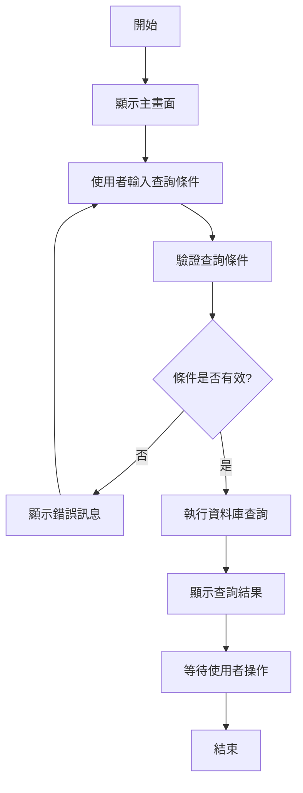
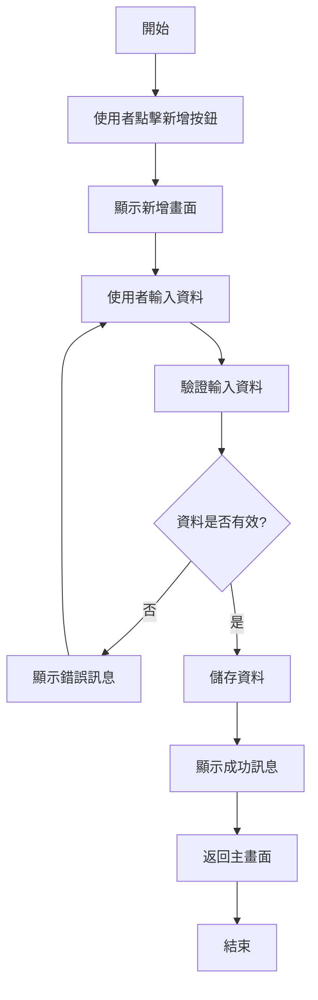
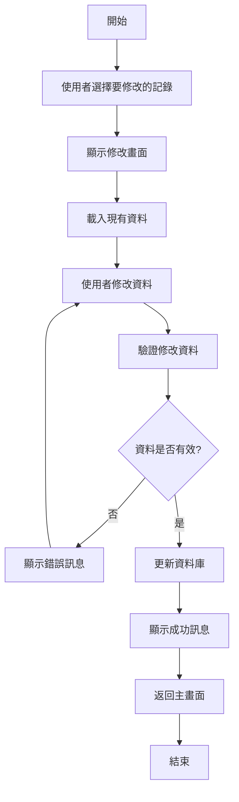
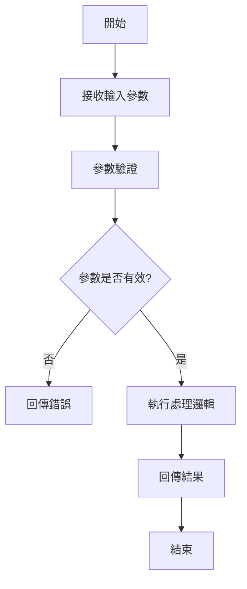
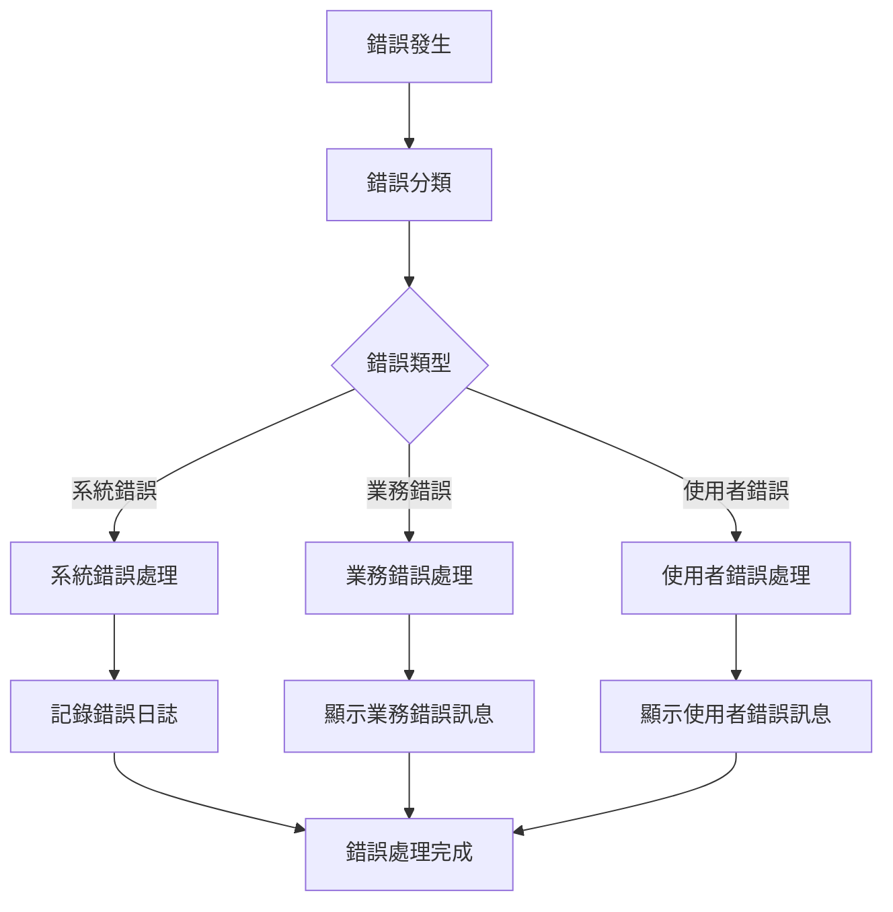

# 程式功能規格書範本

## 一、基本資料

| 項目 | 說明 |
|------|------|
| **系統名稱** | 10.10.10.180 企業管理系統 |
| **模組名稱** | [模組中文名稱] |
| **模組代號** | [模組英文代號] |
| **程式名稱** | [程式中文名稱] |
| **程式代號** | [程式英文代號] |
| **功能名稱** | [功能中文名稱] |
| **功能代號** | [功能英文代號] |
| **撰寫人員** | [撰寫人員姓名] |
| **撰寫日期** | [YYYY/MM/DD] |
| **審核人員** | [審核人員姓名] |
| **審核日期** | [YYYY/MM/DD] |
| **版本編號** | v1.0 |
| **文件狀態** | 草稿 / 審核中 / 已核准 |

---

## 二、檔案架構與關聯圖

### 2.1 檔案架構圖
```
[模組名稱] 檔案架構
├── [主檔名稱] ([檔案代號])
│   ├── 主要資料表
│   ├── 索引檔案
│   └── 邏輯檔案
├── [工作檔名稱] ([檔案代號])
│   ├── 暫存資料
│   └── 處理中資料
└── [參照檔名稱] ([檔案代號])
    ├── 參數設定
    └── 代碼對照
```

### 2.2 檔案關聯圖
```mermaid
erDiagram
    [主檔A] ||--o{ [明細檔B] : "1對多"
    [主檔A] ||--|| [參照檔C] : "參照"
    [工作檔D] }o--|| [主檔A] : "暫存"
    
    [主檔A] {
        string 主鍵欄位1
        string 主鍵欄位2
        string 一般欄位1
        string 一般欄位2
    }
    
    [明細檔B] {
        string 主鍵欄位1
        string 主鍵欄位2
        string 明細欄位1
        string 明細欄位2
    }
```

### 2.3 檔案清單
| 檔案類型 | 檔案名稱 | 檔案代號 | 用途說明 |
|----------|----------|----------|----------|
| 主檔 | [主檔中文名稱] | [主檔代號] | [主要用途說明] |
| 明細檔 | [明細檔中文名稱] | [明細檔代號] | [明細用途說明] |
| 工作檔 | [工作檔中文名稱] | [工作檔代號] | [工作用途說明] |
| 參照檔 | [參照檔中文名稱] | [參照檔代號] | [參照用途說明] |

---

## 三、檔案名稱，欄位代號、名稱、位置、長度、屬性、檢核說明

### 3.1 [主檔名稱] ([檔案代號]) 欄位規格

#### 3.1.1 記錄格式：[記錄格式名稱]
| 欄位代號 | 欄位名稱 | 位置 | 長度 | 型態 | 屬性 | 檢核說明 |
|----------|----------|------|------|------|------|----------|
| [欄位代號1] | [欄位名稱1] | [起始位置] | [欄位長度] | [資料型態] | [屬性說明] | [檢核規則說明] |
| [欄位代號2] | [欄位名稱2] | [起始位置] | [欄位長度] | [資料型態] | [屬性說明] | [檢核規則說明] |
| [欄位代號3] | [欄位名稱3] | [起始位置] | [欄位長度] | [資料型態] | [屬性說明] | [檢核規則說明] |

#### 3.1.2 主鍵欄位
- **主鍵1**：[欄位代號] - [欄位名稱] ([資料型態])
- **主鍵2**：[欄位代號] - [欄位名稱] ([資料型態])
- **主鍵3**：[欄位代號] - [欄位名稱] ([資料型態])

#### 3.1.3 索引資料
| 索引名稱 | 索引類型 | 索引欄位 | 說明 |
|----------|----------|----------|------|
| [索引名稱1] | [索引類型] | [欄位代號1, 欄位代號2] | [索引用途說明] |
| [索引名稱2] | [索引類型] | [欄位代號3] | [索引用途說明] |

### 3.2 [明細檔名稱] ([檔案代號]) 欄位規格

#### 3.2.1 記錄格式：[記錄格式名稱]
| 欄位代號 | 欄位名稱 | 位置 | 長度 | 型態 | 屬性 | 檢核說明 |
|----------|----------|------|------|------|------|----------|
| [欄位代號1] | [欄位名稱1] | [起始位置] | [欄位長度] | [資料型態] | [屬性說明] | [檢核規則說明] |
| [欄位代號2] | [欄位名稱2] | [起始位置] | [欄位長度] | [資料型態] | [屬性說明] | [檢核規則說明] |

#### 3.2.2 外鍵關聯
- **關聯主檔**：[主檔名稱] ([主檔代號])
- **關聯欄位**：[明細檔欄位] → [主檔欄位]

---

## 四、輸出/入螢幕布局與說明

### 4.1 主畫面布局

#### 4.1.1 畫面配置圖
```
┌─────────────────────────────────────────────────────────────┐
│                    [功能名稱] - 主畫面                        │
├─────────────────────────────────────────────────────────────┤
│ 查詢條件區域                                                │
│ ┌─────────────────────────────────────────────────────────┐ │
│ │ [欄位標籤1]: [輸入欄位1]    [欄位標籤2]: [輸入欄位2]   │ │
│ │ [欄位標籤3]: [輸入欄位3]    [欄位標籤4]: [輸入欄位4]   │ │
│ └─────────────────────────────────────────────────────────┘ │
├─────────────────────────────────────────────────────────────┤
│ 功能按鈕區域                                                │
│ [查詢] [新增] [修改] [刪除] [列印] [匯出] [離開]          │
├─────────────────────────────────────────────────────────────┤
│ 資料顯示區域                                                │
│ ┌─────────────────────────────────────────────────────────┐ │
│ │ [欄位標題1] │ [欄位標題2] │ [欄位標題3] │ [欄位標題4] │ │
│ ├─────────────────────────────────────────────────────────┤ │
│ │ [資料1-1]   │ [資料1-2]   │ [資料1-3]   │ [資料1-4]   │ │
│ │ [資料2-1]   │ [資料2-2]   │ [資料2-3]   │ [資料2-4]   │ │
│ └─────────────────────────────────────────────────────────┘ │
└─────────────────────────────────────────────────────────────┘
```

#### 4.1.2 欄位說明
| 欄位標籤 | 欄位名稱 | 欄位類型 | 必填 | 預設值 | 說明 |
|----------|----------|----------|------|--------|------|
| [欄位標籤1] | [欄位名稱1] | [輸入類型] | [是/否] | [預設值] | [欄位說明] |
| [欄位標籤2] | [欄位名稱2] | [輸入類型] | [是/否] | [預設值] | [欄位說明] |

### 4.2 明細畫面布局

#### 4.2.1 明細畫面配置圖
```
┌─────────────────────────────────────────────────────────────┐
│                    [功能名稱] - 明細畫面                      │
├─────────────────────────────────────────────────────────────┤
│ 主檔資料區域                                                │
│ ┌─────────────────────────────────────────────────────────┐ │
│ │ [欄位標籤1]: [顯示欄位1]    [欄位標籤2]: [顯示欄位2]   │ │
│ │ [欄位標籤3]: [顯示欄位3]    [欄位標籤4]: [顯示欄位4]   │ │
│ └─────────────────────────────────────────────────────────┘ │
├─────────────────────────────────────────────────────────────┤
│ 明細資料區域                                                │
│ ┌─────────────────────────────────────────────────────────┐ │
│ │ [欄位標籤5] │ [欄位標籤6] │ [欄位標籤7] │ [欄位標籤8] │ │
│ ├─────────────────────────────────────────────────────────┤ │
│ │ [資料5-1]   │ [資料6-1]   │ [資料7-1]   │ [資料8-1]   │ │
│ │ [資料5-2]   │ [資料6-2]   │ [資料7-2]   │ [資料8-2]   │ │
│ └─────────────────────────────────────────────────────────┘ │
├─────────────────────────────────────────────────────────────┤
│ 功能按鈕區域                                                │
│ [儲存] [取消] [新增明細] [刪除明細] [離開]                │
└─────────────────────────────────────────────────────────────┘
```

---

## 五、處理流程程序說明

### 5.1 主要處理流程

#### 5.1.1 查詢流程


#### 5.1.2 新增流程


#### 5.1.3 修改流程


### 5.2 資料驗證流程

#### 5.2.1 欄位驗證規則
| 欄位名稱 | 驗證類型 | 驗證規則 | 錯誤訊息 |
|----------|----------|----------|----------|
| [欄位名稱1] | [驗證類型] | [驗證規則說明] | [錯誤訊息內容] |
| [欄位名稱2] | [驗證類型] | [驗證規則說明] | [錯誤訊息內容] |

#### 5.2.2 業務邏輯驗證
| 驗證項目 | 驗證邏輯 | 錯誤訊息 |
|----------|----------|----------|
| [驗證項目1] | [驗證邏輯說明] | [錯誤訊息內容] |
| [驗證項目2] | [驗證邏輯說明] | [錯誤訊息內容] |

---

## 六、子程序處理邏輯說明

### 6.1 子程序清單
| 子程序名稱 | 子程序代號 | 功能說明 | 呼叫時機 |
|------------|------------|----------|----------|
| [子程序名稱1] | [子程序代號1] | [功能說明] | [呼叫時機說明] |
| [子程序名稱2] | [子程序代號2] | [功能說明] | [呼叫時機說明] |

### 6.2 子程序詳細說明

#### 6.2.1 [子程序名稱1] ([子程序代號1])

**功能說明**：[詳細功能說明]

**輸入參數**：
- [參數名稱1] ([參數型態]) - [參數說明]
- [參數名稱2] ([參數型態]) - [參數說明]

**輸出參數**：
- [參數名稱3] ([參數型態]) - [參數說明]
- [參數名稱4] ([參數型態]) - [參數說明]

**處理邏輯**：


**錯誤處理**：
- [錯誤情況1]：[處理方式]
- [錯誤情況2]：[處理方式]

#### 6.2.2 [子程序名稱2] ([子程序代號2])

**功能說明**：[詳細功能說明]

**輸入參數**：[參數說明]

**輸出參數**：[參數說明]

**處理邏輯**：[處理邏輯說明]

**錯誤處理**：[錯誤處理說明]

---

## 七、錯誤處理程序說明與訊息清冊

### 7.1 錯誤處理流程

#### 7.1.1 錯誤處理架構


#### 7.1.2 錯誤處理策略
| 錯誤類型 | 處理策略 | 使用者通知 | 日誌記錄 |
|----------|----------|------------|----------|
| 系統錯誤 | [處理策略說明] | [通知方式] | [記錄內容] |
| 業務錯誤 | [處理策略說明] | [通知方式] | [記錄內容] |
| 使用者錯誤 | [處理策略說明] | [通知方式] | [記錄內容] |

### 7.2 錯誤訊息清冊

#### 7.2.1 系統錯誤訊息
| 錯誤代碼 | 錯誤訊息 | 錯誤原因 | 解決方案 |
|----------|----------|----------|----------|
| [錯誤代碼1] | [錯誤訊息內容] | [錯誤原因說明] | [解決方案說明] |
| [錯誤代碼2] | [錯誤訊息內容] | [錯誤原因說明] | [解決方案說明] |

#### 7.2.2 業務錯誤訊息
| 錯誤代碼 | 錯誤訊息 | 錯誤原因 | 解決方案 |
|----------|----------|----------|----------|
| [錯誤代碼1] | [錯誤訊息內容] | [錯誤原因說明] | [解決方案說明] |
| [錯誤代碼2] | [錯誤訊息內容] | [錯誤原因說明] | [解決方案說明] |

#### 7.2.3 使用者錯誤訊息
| 錯誤代碼 | 錯誤訊息 | 錯誤原因 | 解決方案 |
|----------|----------|----------|----------|
| [錯誤代碼1] | [錯誤訊息內容] | [錯誤原因說明] | [解決方案說明] |
| [錯誤代碼2] | [錯誤訊息內容] | [錯誤原因說明] | [解決方案說明] |

---

## 八、備註

### 8.1 特殊說明
- [特殊情況1]：[說明內容]
- [特殊情況2]：[說明內容]

### 8.2 限制條件
- [限制條件1]：[說明內容]
- [限制條件2]：[說明內容]

### 8.3 未來擴充
- [擴充項目1]：[說明內容]
- [擴充項目2]：[說明內容]

### 8.4 相關文件
- [相關文件1]：[文件名稱與路徑]
- [相關文件2]：[文件名稱與路徑]

---

## 九、文件修訂記錄

| 版本 | 修訂日期 | 修訂人員 | 修訂內容 | 修訂原因 |
|------|----------|----------|----------|----------|
| v1.0 | [YYYY/MM/DD] | [修訂人員] | 初始版本 | 文件建立 |
| v1.1 | [YYYY/MM/DD] | [修訂人員] | [修訂內容] | [修訂原因] |

---

**文件建立日期**：[YYYY/MM/DD]  
**最後更新日期**：[YYYY/MM/DD]  
**文件狀態**：[草稿/審核中/已核准]  
**下次檢討日期**：[YYYY/MM/DD] 