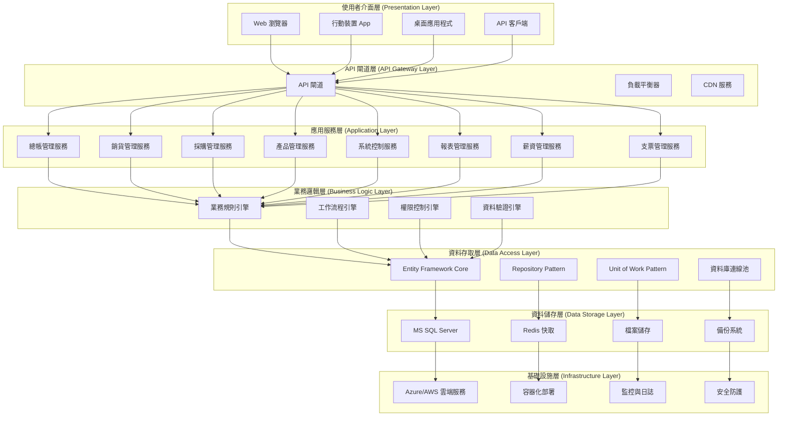
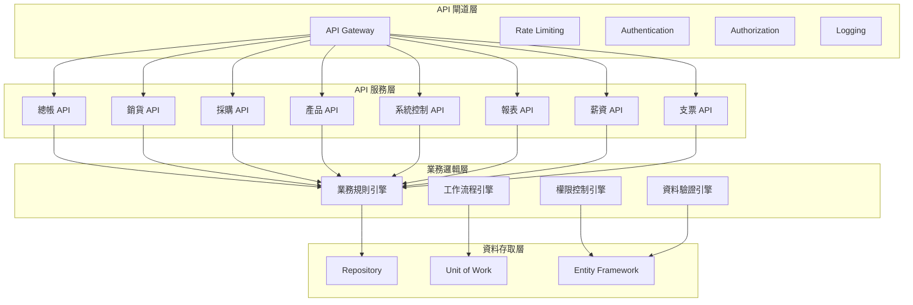
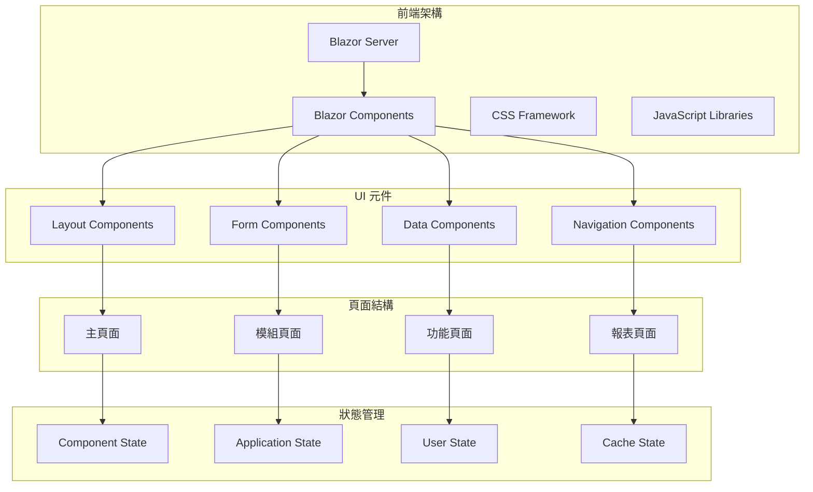
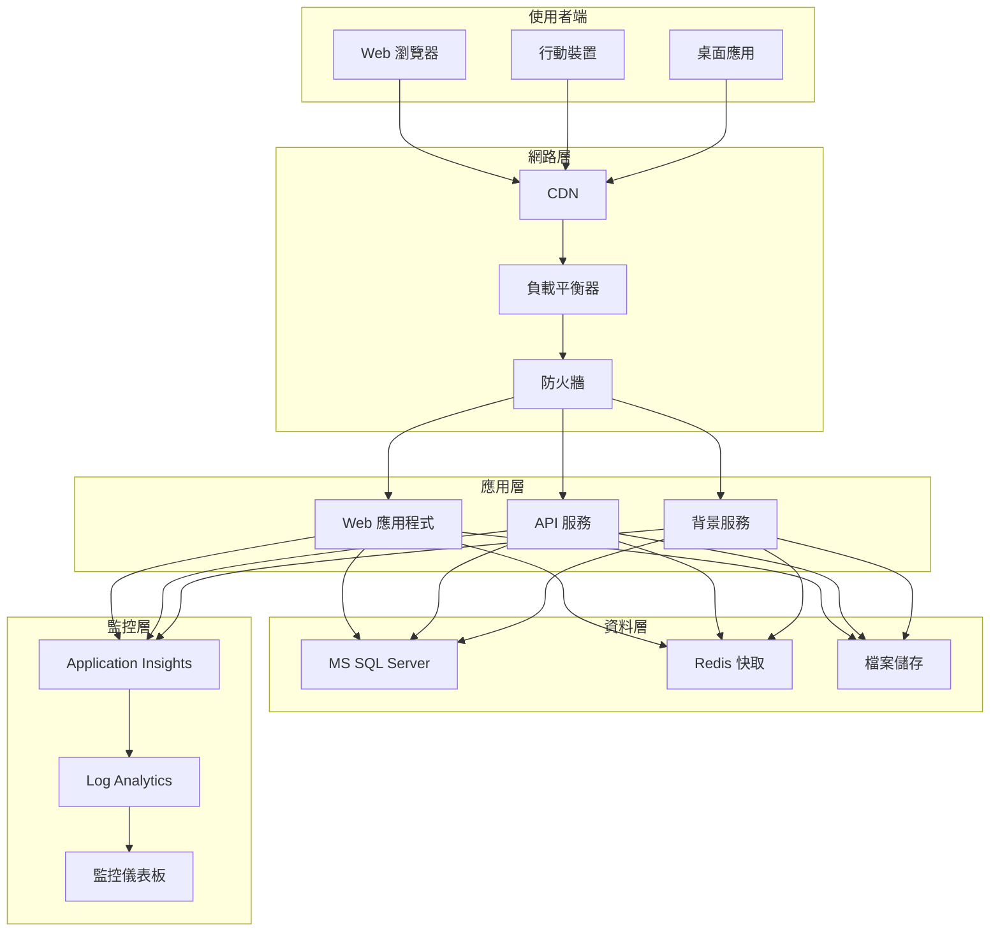

# 新系統設計計畫與範本

## 一、專案概述

| 項目 | 說明 |
|------|------|
| **專案名稱** | 10.10.10.180 企業管理系統現代化轉型 |
| **專案目標** | 從 AS/400 平台轉型為現代化 C# .NET MVC + MS SQL 架構 |
| **專案範圍** | 完整系統重構，包含所有業務模組和系統控制功能 |
| **專案時程** | 預計 18-24 個月完成 |
| **專案預算** | 待定 |
| **專案負責人** | 專案經理 |
| **技術負責人** | 技術架構師 |
| **文件版本** | v1.0 |
| **建立日期** | 2024/12/21 |

---

## 二、系統設計目標

### 2.1 主要目標

1. **技術現代化**：從 AS/400 RPG 轉型為 C# .NET 技術棧
2. **架構優化**：建立分層式、模組化的現代化架構
3. **效能提升**：提升系統處理效能和回應速度
4. **維護簡化**：簡化系統維護和升級流程
5. **擴展性增強**：提升系統的可擴展性和可維護性
6. **使用者體驗改善**：提供現代化的 Web 和行動裝置介面

### 2.2 次要目標

1. **資料整合**：整合現有系統資料，確保資料完整性
2. **安全性提升**：建立現代化的安全防護機制
3. **監控能力**：建立完善的系統監控和日誌記錄
4. **備份恢復**：建立可靠的資料備份和災難恢復機制
5. **文件完整**：建立完整的系統文件和操作手冊

---

## 三、系統架構設計

### 3.1 整體架構圖



### 3.2 分層架構說明

#### 3.2.1 使用者介面層
- **Web 瀏覽器**：支援現代化瀏覽器的響應式設計
- **行動裝置 App**：iOS 和 Android 原生應用程式
- **桌面應用程式**：Windows 桌面應用程式
- **API 客戶端**：第三方系統整合介面

#### 3.2.2 API 閘道層
- **API 閘道**：統一 API 入口點，處理認證、授權、限流
- **負載平衡器**：分散系統負載，提升可用性
- **CDN 服務**：靜態資源快取，提升存取速度

#### 3.2.3 應用服務層
- **模組化服務**：每個業務模組獨立部署
- **微服務架構**：支援獨立擴展和維護
- **服務發現**：自動服務註冊和發現

#### 3.2.4 業務邏輯層
- **業務規則引擎**：集中管理業務規則
- **工作流程引擎**：處理複雜業務流程
- **權限控制引擎**：統一權限管理
- **資料驗證引擎**：確保資料完整性

#### 3.2.5 資料存取層
- **ORM 框架**：Entity Framework Core
- **Repository Pattern**：資料存取抽象化
- **Unit of Work**：交易管理
- **連線池管理**：資料庫連線最佳化

#### 3.2.6 資料儲存層
- **主要資料庫**：MS SQL Server
- **快取系統**：Redis
- **檔案儲存**：Azure Blob Storage
- **備份系統**：自動化備份和恢復

#### 3.2.7 基礎設施層
- **雲端服務**：Azure 或 AWS
- **容器化**：Docker + Kubernetes
- **監控系統**：Application Insights
- **安全防護**：防火牆、入侵偵測

---

## 四、技術選型

### 4.1 開發技術棧

| 技術類別 | 技術選擇 | 版本 | 說明 |
|----------|----------|------|------|
| **程式語言** | C# | 12.0 | 主要開發語言 |
| **框架** | .NET 8 | 8.0 | 最新穩定版本 |
| **Web 框架** | ASP.NET Core | 8.0 | Web API 和 MVC |
| **前端框架** | Blazor Server | 8.0 | 伺服器端渲染 |
| **UI 元件庫** | MudBlazor | 6.0 | Material Design 風格 |
| **資料庫 ORM** | Entity Framework Core | 8.0 | 資料存取框架 |
| **快取系統** | Redis | 7.0 | 分散式快取 |
| **資料庫** | MS SQL Server | 2022 | 主要資料庫 |
| **容器化** | Docker | 24.0 | 應用程式容器化 |
| **編排工具** | Kubernetes | 1.28 | 容器編排管理 |

### 4.2 開發工具

| 工具類別 | 工具名稱 | 版本 | 說明 |
|----------|----------|------|------|
| **IDE** | Visual Studio 2022 | 17.8 | 主要開發環境 |
| **程式碼管理** | Git | 2.40 | 版本控制 |
| **CI/CD** | Azure DevOps | 最新 | 持續整合部署 |
| **API 測試** | Postman | 10.0 | API 測試工具 |
| **資料庫管理** | SQL Server Management Studio | 19.0 | 資料庫管理工具 |
| **監控工具** | Application Insights | 最新 | 應用程式監控 |

### 4.3 第三方套件

| 套件類別 | 套件名稱 | 版本 | 說明 |
|----------|----------|------|------|
| **日誌記錄** | Serilog | 3.1 | 結構化日誌記錄 |
| **驗證** | FluentValidation | 11.0 | 資料驗證 |
| **映射** | AutoMapper | 12.0 | 物件映射 |
| **API 文件** | Swagger/OpenAPI | 6.0 | API 文件生成 |
| **快取** | Microsoft.Extensions.Caching | 8.0 | 記憶體快取 |
| **認證** | Microsoft.AspNetCore.Authentication | 8.0 | 身份認證 |

---

## 五、資料庫設計

### 5.1 資料庫架構圖

```mermaid
erDiagram
    %% 系統控制模組
    SCP_Users {
        string UserId PK
        string UserName
        string Email
        string PasswordHash
        boolean IsActive
        datetime CreatedDate
        datetime LastLoginDate
    }
    
    SCP_Roles {
        string RoleId PK
        string RoleName
        string Description
        boolean IsActive
    }
    
    SCP_UserRoles {
        string UserId FK
        string RoleId FK
        datetime AssignedDate
    }
    
    SCP_Permissions {
        string PermissionId PK
        string PermissionName
        string ModuleCode
        string FunctionCode
        string Description
    }
    
    SCP_RolePermissions {
        string RoleId FK
        string PermissionId FK
        boolean IsGranted
    }
    
    SCP_SystemSettings {
        string SettingKey PK
        string SettingValue
        string Description
        datetime LastModified
    }
    
    %% 總帳模組
    GL_Companies {
        string CompanyCode PK
        string CompanyName
        string TaxId
        string Address
        boolean IsActive
    }
    
    GL_ChartOfAccounts {
        string AccountCode PK
        string CompanyCode FK
        string AccountName
        string AccountType
        string ParentAccountCode FK
        boolean IsActive
    }
    
    GL_Vouchers {
        string VoucherId PK
        string CompanyCode FK
        string VoucherNumber
        datetime VoucherDate
        string Description
        decimal TotalAmount
        string Status
        string CreatedBy FK
        datetime CreatedDate
    }
    
    GL_VoucherEntries {
        string EntryId PK
        string VoucherId FK
        string AccountCode FK
        decimal DebitAmount
        decimal CreditAmount
        string Description
        int EntryOrder
    }
    
    %% 銷貨模組
    NP_Customers {
        string CustomerCode PK
        string CompanyCode FK
        string CustomerName
        string ContactPerson
        string Phone
        string Email
        boolean IsActive
    }
    
    NP_Orders {
        string OrderId PK
        string CompanyCode FK
        string CustomerCode FK
        string OrderNumber
        datetime OrderDate
        decimal TotalAmount
        string Status
        string CreatedBy FK
        datetime CreatedDate
    }
    
    NP_OrderItems {
        string ItemId PK
        string OrderId FK
        string ProductCode FK
        int Quantity
        decimal UnitPrice
        decimal TotalPrice
    }
    
    %% 採購模組
    PC_Suppliers {
        string SupplierCode PK
        string CompanyCode FK
        string SupplierName
        string ContactPerson
        string Phone
        string Email
        boolean IsActive
    }
    
    PC_Requisitions {
        string RequisitionId PK
        string CompanyCode FK
        string RequesterId FK
        string RequisitionNumber
        datetime RequisitionDate
        decimal TotalAmount
        string Status
        string CreatedBy FK
        datetime CreatedDate
    }
    
    %% 產品模組
    PT_Products {
        string ProductCode PK
        string CompanyCode FK
        string ProductName
        string CategoryCode FK
        decimal StandardCost
        decimal StandardPrice
        int MinStock
        int MaxStock
        boolean IsActive
    }
    
    PT_ProductCategories {
        string CategoryCode PK
        string CompanyCode FK
        string CategoryName
        string Description
        boolean IsActive
    }
    
    %% 薪資模組
    PY_Employees {
        string EmployeeId PK
        string CompanyCode FK
        string EmployeeName
        string DepartmentCode FK
        decimal BasicSalary
        datetime HireDate
        boolean IsActive
    }
    
    PY_PayrollPeriods {
        string PeriodId PK
        string CompanyCode FK
        int Year
        int Month
        datetime StartDate
        datetime EndDate
        string Status
    }
    
    %% 支票模組
    CK_BankAccounts {
        string AccountId PK
        string CompanyCode FK
        string BankCode
        string AccountNumber
        string AccountName
        decimal Balance
        boolean IsActive
    }
    
    CK_Checks {
        string CheckId PK
        string CompanyCode FK
        string BankAccountId FK
        string CheckNumber
        decimal Amount
        datetime IssueDate
        string PayeeName
        string Status
        string CreatedBy FK
        datetime CreatedDate
    }
    
    %% 關聯關係
    SCP_Users ||--o{ SCP_UserRoles : has
    SCP_Roles ||--o{ SCP_UserRoles : assigned_to
    SCP_Roles ||--o{ SCP_RolePermissions : has
    SCP_Permissions ||--o{ SCP_RolePermissions : granted_to
    
    GL_Companies ||--o{ GL_ChartOfAccounts : owns
    GL_Companies ||--o{ GL_Vouchers : has
    GL_Vouchers ||--o{ GL_VoucherEntries : contains
    GL_ChartOfAccounts ||--o{ GL_VoucherEntries : debited_credited
    GL_ChartOfAccounts ||--o{ GL_ChartOfAccounts : parent_child
    
    GL_Companies ||--o{ NP_Customers : has
    GL_Companies ||--o{ NP_Orders : has
    NP_Orders ||--o{ NP_OrderItems : contains
    NP_Customers ||--o{ NP_Orders : places
    
    GL_Companies ||--o{ PC_Suppliers : has
    GL_Companies ||--o{ PC_Requisitions : has
    PC_Suppliers ||--o{ PC_Requisitions : supplies
    
    GL_Companies ||--o{ PT_Products : has
    GL_Companies ||--o{ PT_ProductCategories : has
    PT_ProductCategories ||--o{ PT_Products : categorizes
    
    GL_Companies ||--o{ PY_Employees : employs
    GL_Companies ||--o{ PY_PayrollPeriods : has
    
    GL_Companies ||--o{ CK_BankAccounts : owns
    GL_Companies ||--o{ CK_Checks : issues
    CK_BankAccounts ||--o{ CK_Checks : drawn_on
```



### 5.2 資料庫設計原則

#### 5.2.1 命名規範
- **資料表命名**：`模組代號_實體名稱`（如：`GL_Vouchers`）
- **欄位命名**：PascalCase（如：`VoucherNumber`）
- **主鍵命名**：`實體名稱 + Id`（如：`VoucherId`）
- **外鍵命名**：`關聯實體名稱 + Id`（如：`CompanyCode`）

#### 5.2.2 資料類型規範
- **識別碼**：`string` 或 `Guid`，避免使用 `int` 自增
- **金額欄位**：`decimal(18,2)`，確保精確度
- **日期時間**：`datetime2`，支援時區和更高精度
- **布林值**：`bit`，使用 0/1 或 true/false
- **文字欄位**：根據實際需求選擇 `varchar` 或 `nvarchar`

#### 5.2.3 索引設計原則
- **主鍵索引**：自動建立叢集索引
- **外鍵索引**：為所有外鍵建立非叢集索引
- **查詢索引**：為常用查詢條件建立複合索引
- **覆蓋索引**：包含查詢所需的所有欄位

### 5.3 資料遷移策略

#### 5.3.1 遷移階段
1. **準備階段**：資料清理、結構對應、工具準備
2. **測試階段**：小量資料遷移測試、驗證資料完整性
3. **正式遷移**：分批遷移、即時驗證、錯誤處理
4. **驗證階段**：資料完整性檢查、業務邏輯驗證
5. **切換階段**：新舊系統並行、逐步切換、監控穩定性

#### 5.3.2 遷移工具
- **ETL 工具**：SQL Server Integration Services (SSIS)
- **雲端服務**：Azure Data Factory
- **自訂工具**：C# 遷移程式
- **驗證工具**：資料比對和完整性檢查程式

---

## 六、API 設計

### 6.1 API 架構設計



### 6.2 API 設計原則

#### 6.2.1 RESTful API 設計
- **資源導向**：以業務實體為中心的 API 設計
- **HTTP 方法**：GET（查詢）、POST（新增）、PUT（更新）、DELETE（刪除）
- **狀態碼**：標準 HTTP 狀態碼，如 200、201、400、404、500
- **版本控制**：URL 路徑版本控制，如 `/api/v1/gl/vouchers`

#### 6.2.2 API 端點設計

| 模組 | 資源 | 端點 | HTTP 方法 | 說明 |
|------|------|------|------------|------|
| **總帳** | 傳票 | `/api/v1/gl/vouchers` | GET | 查詢傳票列表 |
| **總帳** | 傳票 | `/api/v1/gl/vouchers` | POST | 新增傳票 |
| **總帳** | 傳票 | `/api/v1/gl/vouchers/{id}` | GET | 查詢單一傳票 |
| **總帳** | 傳票 | `/api/v1/gl/vouchers/{id}` | PUT | 更新傳票 |
| **總帳** | 傳票 | `/api/v1/gl/vouchers/{id}` | DELETE | 刪除傳票 |
| **銷貨** | 訂單 | `/api/v1/np/orders` | GET | 查詢訂單列表 |
| **採購** | 請購單 | `/api/v1/pc/requisitions` | GET | 查詢請購單列表 |
| **產品** | 產品 | `/api/v1/pt/products` | GET | 查詢產品列表 |
| **系統控制** | 使用者 | `/api/v1/scp/users` | GET | 查詢使用者列表 |

#### 6.2.3 請求/回應格式

**請求格式範例**：
```json
{
  "companyCode": "001",
  "voucherNumber": "GL202412001",
  "voucherDate": "2024-12-21T00:00:00Z",
  "description": "月結調整傳票",
  "entries": [
    {
      "accountCode": "1101",
      "debitAmount": 10000.00,
      "creditAmount": 0.00,
      "description": "現金增加"
    },
    {
      "accountCode": "4101",
      "debitAmount": 0.00,
      "creditAmount": 10000.00,
      "description": "營業收入"
    }
  ]
}
```

**回應格式範例**：
```json
{
  "success": true,
  "data": {
    "voucherId": "GL202412001",
    "companyCode": "001",
    "voucherNumber": "GL202412001",
    "voucherDate": "2024-12-21T00:00:00Z",
    "description": "月結調整傳票",
    "totalAmount": 10000.00,
    "status": "Draft",
    "createdBy": "USER001",
    "createdDate": "2024-12-21T10:30:00Z"
  },
  "message": "傳票建立成功",
  "timestamp": "2024-12-21T10:30:00Z"
}
```

### 6.3 API 安全設計

#### 6.3.1 認證機制
- **JWT Token**：無狀態認證，支援分散式部署
- **Refresh Token**：自動更新存取權杖
- **OAuth 2.0**：支援第三方系統整合
- **API Key**：機器對機器通訊認證

#### 6.3.2 授權機制
- **角色基礎存取控制 (RBAC)**：基於角色的權限控制
- **屬性基礎存取控制 (ABAC)**：基於屬性的細粒度權限控制
- **資源層級權限**：控制特定資源的存取權限
- **功能層級權限**：控制特定功能的執行權限

#### 6.3.3 安全防護
- **HTTPS**：強制使用 HTTPS 加密傳輸
- **API 限流**：防止 API 濫用和 DDoS 攻擊
- **輸入驗證**：防止 SQL 注入和 XSS 攻擊
- **日誌記錄**：記錄所有 API 存取和操作

---

## 七、前端設計

### 7.1 前端架構設計



### 7.2 頁面設計原則

#### 7.2.1 響應式設計
- **行動優先**：優先考慮行動裝置的使用體驗
- **斷點設計**：支援多種螢幕尺寸和解析度
- **觸控友善**：優化觸控裝置的操作體驗
- **鍵盤支援**：支援鍵盤快捷鍵和無障礙操作

#### 7.2.2 使用者體驗設計
- **一致性**：統一的設計語言和操作模式
- **直觀性**：簡潔明瞭的介面設計
- **效率性**：減少操作步驟，提升工作效率
- **可訪問性**：支援無障礙使用和螢幕閱讀器

#### 7.2.3 頁面佈局設計

**主頁面佈局**：
```
┌─────────────────────────────────────┐
│ Header (Logo, Navigation, User)    │
├─────────────────────────────────────┤
│ Sidebar (Module Menu)              │
│ ┌─────────────────────────────────┐ │
│ │ Main Content Area               │ │
│ │                                 │ │
│ │                                 │ │
│ │                                 │ │
│ └─────────────────────────────────┘ │
├─────────────────────────────────────┤
│ Footer (Copyright, Links)          │
└─────────────────────────────────────┘
```

**模組頁面佈局**：
```
┌─────────────────────────────────────┐
│ Breadcrumb Navigation              │
├─────────────────────────────────────┤
│ Page Title + Action Buttons        │
├─────────────────────────────────────┤
│ Search/Filter Panel                │
├─────────────────────────────────────┤
│ Data Grid/Table                    │
│ ┌─────────────────────────────────┐ │
│ │ Columns: ID, Name, Status, ... │ │
│ │ Rows: Data Items               │ │
│ │ Pagination Controls            │ │
│ └─────────────────────────────────┘ │
└─────────────────────────────────────┘
```

### 7.3 元件設計

#### 7.3.1 基礎元件
- **按鈕元件**：主要按鈕、次要按鈕、危險按鈕
- **表單元件**：文字輸入、下拉選單、日期選擇器
- **資料元件**：資料表格、分頁控制、搜尋框
- **導航元件**：選單、麵包屑、分頁標籤

#### 7.3.2 業務元件
- **傳票元件**：傳票表單、傳票列表、傳票詳情
- **訂單元件**：訂單表單、訂單列表、訂單流程
- **報表元件**：報表參數、報表預覽、報表匯出
- **儀表板元件**：圖表、統計卡片、趨勢分析

---

## 八、部署架構

### 8.1 部署架構圖



### 8.2 部署策略

#### 8.2.1 容器化部署
- **Docker 映像**：建立標準化的應用程式容器
- **Kubernetes 編排**：自動化部署、擴展和管理
- **服務網格**：Istio 或 Linkerd 用於服務間通訊
- **配置管理**：使用 ConfigMaps 和 Secrets 管理配置

#### 8.2.2 雲端部署
- **Azure 服務**：Azure App Service、Azure SQL Database
- **AWS 服務**：ECS、RDS、S3
- **混合雲**：支援混合雲部署模式
- **多區域部署**：提升系統可用性和效能

#### 8.2.3 CI/CD 流程
- **程式碼管理**：Git 分支策略和程式碼審查
- **自動化測試**：單元測試、整合測試、端到端測試
- **自動化部署**：開發、測試、生產環境自動部署
- **監控和回滾**：部署後監控和自動回滾機制

---

## 九、測試策略

### 9.1 測試層級

#### 9.1.1 單元測試
- **測試範圍**：業務邏輯、資料存取、工具類別
- **測試框架**：xUnit、NUnit 或 MSTest
- **測試覆蓋率**：目標 80% 以上的程式碼覆蓋率
- **測試資料**：使用 Mock 物件和測試資料

#### 9.1.2 整合測試
- **測試範圍**：API 端點、資料庫操作、外部服務整合
- **測試環境**：獨立的測試資料庫和測試環境
- **測試資料**：使用測試資料庫和測試資料
- **測試工具**：Postman、RestSharp 等 API 測試工具

#### 9.1.3 端到端測試
- **測試範圍**：完整的使用者操作流程
- **測試環境**：模擬生產環境的測試環境
- **測試工具**：Selenium、Playwright 等自動化測試工具
- **測試腳本**：自動化的測試腳本和測試案例

### 9.2 測試案例設計

#### 9.2.1 功能測試案例
- **正常流程測試**：測試正常業務流程
- **異常流程測試**：測試錯誤處理和邊界條件
- **權限測試**：測試不同權限等級的存取控制
- **資料驗證測試**：測試資料輸入驗證和業務規則

#### 9.2.2 非功能測試案例
- **效能測試**：測試系統回應時間和吞吐量
- **負載測試**：測試系統在高負載下的表現
- **安全性測試**：測試系統安全防護機制
- **可用性測試**：測試系統的可用性和穩定性

### 9.3 測試環境管理

#### 9.3.1 環境配置
- **開發環境**：開發人員本地開發環境
- **測試環境**：功能測試和整合測試環境
- **預生產環境**：模擬生產環境的測試環境
- **生產環境**：正式營運環境

#### 9.3.2 資料管理
- **測試資料**：使用模擬資料進行測試
- **資料隔離**：不同測試環境使用不同的資料
- **資料清理**：測試完成後自動清理測試資料
- **資料備份**：定期備份測試環境資料

---

## 十、專案時程規劃

### 10.1 專案階段劃分

#### 10.1.1 第一階段：基礎建設（1-3個月）
- **系統架構設計**：完成系統架構和技術選型
- **開發環境建立**：建立開發、測試、部署環境
- **基礎框架開發**：建立基礎框架和共用元件
- **資料庫設計**：完成資料庫設計和建立

#### 10.1.2 第二階段：核心模組開發（4-12個月）
- **總帳模組**：開發總帳管理功能
- **銷貨模組**：開發銷貨管理功能
- **採購模組**：開發採購管理功能
- **產品模組**：開發產品管理功能
- **系統控制模組**：開發系統控制功能

#### 10.1.3 第三階段：進階功能開發（13-18個月）
- **報表模組**：開發報表管理功能
- **薪資模組**：開發薪資管理功能
- **支票模組**：開發支票管理功能
- **整合測試**：進行系統整合測試
- **效能優化**：進行系統效能優化

#### 10.1.4 第四階段：部署和上線（19-24個月）
- **使用者驗收測試**：進行使用者驗收測試
- **資料遷移**：完成資料遷移和驗證
- **系統部署**：部署到生產環境
- **使用者培訓**：進行使用者培訓和支援
- **系統上線**：正式系統上線營運

### 10.2 里程碑規劃

| 里程碑 | 預計完成時間 | 主要交付物 | 成功標準 |
|--------|--------------|-------------|----------|
| **M1** | 第3個月 | 基礎架構完成 | 開發環境可正常運作 |
| **M2** | 第6個月 | 核心模組原型 | 核心功能可正常運作 |
| **M3** | 第12個月 | 核心模組完成 | 所有核心功能完成 |
| **M4** | 第18個月 | 系統功能完成 | 所有功能開發完成 |
| **M5** | 第24個月 | 系統上線 | 系統正式營運 |

### 10.3 風險管理

#### 10.3.1 技術風險
- **技術複雜性**：新技術學習曲線和整合挑戰
- **效能問題**：系統效能不達預期
- **相容性問題**：與現有系統的相容性問題

#### 10.3.2 業務風險
- **需求變更**：業務需求頻繁變更
- **資源不足**：開發資源和技能不足
- **時程延遲**：專案時程無法按計畫執行

#### 10.3.3 風險緩解策略
- **技術風險**：提前技術驗證、建立技術專家團隊
- **業務風險**：建立變更控制流程、加強專案管理
- **時程風險**：建立里程碑檢查、調整資源配置

---

## 十一、品質保證

### 11.1 程式碼品質標準

#### 11.1.1 程式碼規範
- **命名規範**：統一的命名規則和慣例
- **程式碼結構**：清晰的程式碼結構和組織
- **註解規範**：完整的程式碼註解和文件
- **錯誤處理**：統一的錯誤處理和日誌記錄

#### 11.1.2 程式碼審查
- **審查流程**：強制性的程式碼審查流程
- **審查標準**：明確的程式碼審查標準和檢查清單
- **審查工具**：使用 SonarQube 等程式碼品質工具
- **審查記錄**：完整的程式碼審查記錄和追蹤

### 11.2 測試品質標準

#### 11.2.1 測試覆蓋率
- **程式碼覆蓋率**：單元測試覆蓋率不低於 80%
- **功能覆蓋率**：功能測試覆蓋率不低於 90%
- **業務流程覆蓋率**：端到端測試覆蓋率不低於 95%

#### 11.2.2 測試品質指標
- **缺陷密度**：每千行程式碼的缺陷數量
- **缺陷逃逸率**：測試後發現的缺陷比例
- **測試執行時間**：測試執行的時間和效率
- **測試穩定性**：測試執行的穩定性和可靠性

### 11.3 文件品質標準

#### 11.3.1 文件完整性
- **技術文件**：完整的技術設計和實作文件
- **使用者文件**：詳細的使用者操作手冊
- **維護文件**：系統維護和故障排除文件
- **培訓文件**：使用者培訓和系統管理文件

#### 11.3.2 文件品質指標
- **文件準確性**：文件內容的準確性和一致性
- **文件完整性**：文件內容的完整性和全面性
- **文件可讀性**：文件的可讀性和易理解性
- **文件維護性**：文件的維護和更新便利性

---

## 十二、總結與建議

### 12.1 設計總結

#### 12.1.1 架構優勢
1. **現代化技術棧**：使用最新的 .NET 8 和相關技術
2. **分層式架構**：清晰的職責分離和模組化設計
3. **微服務架構**：支援獨立部署和擴展
4. **雲端原生**：支援容器化和雲端部署
5. **安全性設計**：完善的安全防護和權限控制

#### 12.1.2 技術特點
1. **高效能**：使用 Entity Framework Core 和 Redis 快取
2. **高可用性**：支援負載平衡和故障轉移
3. **易維護性**：清晰的程式碼結構和完整的文件
4. **易擴展性**：模組化設計和服務導向架構
5. **易整合性**：標準化的 API 設計和整合介面

### 12.2 實施建議

#### 12.2.1 短期建議
1. **建立開發團隊**：組建具備 .NET 技術能力的開發團隊
2. **技術培訓**：進行新技術棧的培訓和學習
3. **環境準備**：建立開發、測試、部署環境
4. **原型開發**：開發系統原型驗證技術可行性

#### 12.2.2 中期建議
1. **模組化開發**：按照模組順序逐步開發
2. **持續整合**：建立 CI/CD 流程和自動化測試
3. **品質控制**：建立程式碼審查和測試流程
4. **文件管理**：建立完整的技術和使用者文件

#### 12.2.3 長期建議
1. **效能優化**：持續進行系統效能優化
2. **功能擴展**：根據業務需求擴展系統功能
3. **技術升級**：跟隨技術發展進行系統升級
4. **運維自動化**：建立自動化的運維和監控系統

### 12.3 成功關鍵因素

#### 12.3.1 技術因素
1. **技術選型正確性**：選擇適合的技術棧和架構
2. **開發團隊能力**：具備必要的技術能力和經驗
3. **技術架構合理性**：建立合理的系統架構和設計
4. **品質控制有效性**：建立有效的品質控制機制

#### 12.3.2 管理因素
1. **專案管理有效性**：有效的專案管理和控制
2. **資源配置合理性**：合理的資源配置和時程安排
3. **風險管理及時性**：及時識別和處理專案風險
4. **溝通協調順暢性**：順暢的溝通協調和團隊合作

#### 12.3.3 業務因素
1. **需求理解準確性**：準確理解業務需求和目標
2. **使用者參與積極性**：使用者的積極參與和支援
3. **變更控制有效性**：有效的需求變更控制
4. **驗收標準明確性**：明確的系統驗收標準

---

## 十三、附錄

### 13.1 技術參考資料

#### 13.1.1 官方文件
- [.NET 8 官方文件](https://docs.microsoft.com/en-us/dotnet/)
- [ASP.NET Core 官方文件](https://docs.microsoft.com/en-us/aspnet/core/)
- [Entity Framework Core 官方文件](https://docs.microsoft.com/en-us/ef/core/)
- [Blazor 官方文件](https://docs.microsoft.com/en-us/aspnet/core/blazor/)

#### 13.1.2 最佳實踐
- [Microsoft 架構最佳實踐](https://docs.microsoft.com/en-us/azure/architecture/)
- [.NET 開發最佳實踐](https://docs.microsoft.com/en-us/dotnet/architecture/)
- [API 設計最佳實踐](https://docs.microsoft.com/en-us/azure/architecture/best-practices/api-design/)

### 13.2 工具和資源

#### 13.2.1 開發工具
- [Visual Studio 2022](https://visualstudio.microsoft.com/)
- [Visual Studio Code](https://code.visualstudio.com/)
- [SQL Server Management Studio](https://docs.microsoft.com/en-us/sql/ssms/)

#### 13.2.2 測試工具
- [Postman](https://www.postman.com/)
- [Selenium](https://www.selenium.dev/)
- [xUnit](https://xunit.net/)

#### 13.2.3 監控工具
- [Application Insights](https://docs.microsoft.com/en-us/azure/azure-monitor/app/app-insights-overview)
- [Azure Monitor](https://docs.microsoft.com/en-us/azure/azure-monitor/)

---

## 十四、修訂記錄

| 版本 | 修訂日期 | 修訂人員 | 修訂內容 | 修訂原因 |
|------|----------|----------|----------|----------|
| v1.0 | 2024/12/21 | 系統架構師 | 初始版本 | 文件建立 |

---

**文件建立日期**：2024年12月21日  
**最後更新日期**：2024年12月21日  
**文件狀態**：草稿  
**下次檢討日期**：2025年1月21日  
**文件審核**：專案經理、技術架構師 