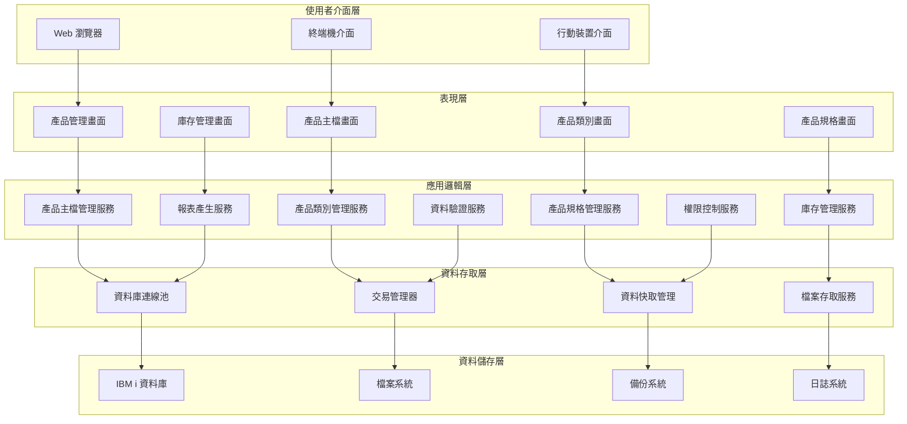
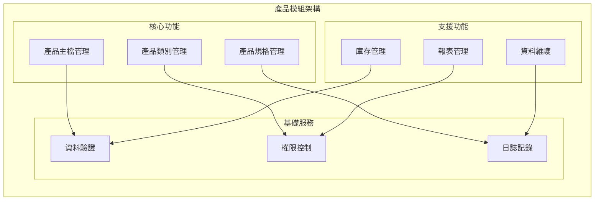

# 產品模組技術文件

## 一、基本資訊

| 項目 | 說明 |
|------|------|
| **系統名稱** | 10.10.10.180 企業管理系統 |
| **模組名稱** | 產品模組 |
| **模組代號** | PT (Product) |
| **功能名稱** | 產品管理 |
| **功能代號** | PT001 |
| **撰寫人員** | 系統分析師 |
| **撰寫日期** | 2024/12/21 |
| **審核人員** | 專案經理 |
| **審核日期** | 2024/12/21 |
| **版本編號** | v1.0 |
| **技術架構** | IBM i (AS/400) + RPG/CL + DB2 for i |

---

## 二、系統架構

### 2.1 整體系統架構圖



### 2.2 模組架構圖



### 2.3 技術架構詳細說明

#### 2.3.1 技術棧組成
| 層級 | 技術選擇 | 版本 | 說明 |
|------|----------|------|------|
| **前端介面** | 5250 終端機 | IBM i 原生 | 傳統終端機介面 |
| **後端程式** | RPG/CL | IBM i 原生 | 業務邏輯處理 |
| **資料庫** | DB2 for i | IBM i 原生 | 資料儲存和查詢 |
| **作業系統** | IBM i | 最新版本 | 企業級伺服器作業系統 |

#### 2.3.2 系統整合架構
- **與採購模組整合**：提供產品資料和庫存資訊
- **與銷貨模組整合**：提供產品資料和價格資訊
- **與總帳模組整合**：影響庫存成本計算
- **與報表模組整合**：提供產品資料來源

---

## 三、資料庫設計

### 3.1 資料庫類型與配置

#### 3.1.1 資料庫類型
- **資料庫系統**：DB2 for i (IBM i 內建關聯式資料庫)
- **資料庫版本**：與 IBM i 作業系統版本同步
- **連線方式**：原生 IBM i 連線，支援 ODBC/JDBC

#### 3.1.2 資料庫配置
```sql
-- 資料庫連線設定
CREATE DATABASE PTDATA
    WITH ENCODING = 'UTF-8'
    COLLATION = 'UTF8_GENERAL_CI';

-- 產品模組專用 Schema
CREATE SCHEMA PT_PRODUCT;

-- 使用者權限設定
GRANT ALL ON SCHEMA PT_PRODUCT TO PT_USER;
GRANT SELECT ON SCHEMA PT_PRODUCT TO PT_READER;
```

### 3.2 資料表結構

#### 3.2.1 產品主檔 (PTAPF) 結構
```sql
-- 產品主檔
CREATE TABLE PTAPF (
    PT01 CHAR(3) NOT NULL,           -- 公司代碼
    PT02 CHAR(5) NOT NULL,           -- 產品代碼
    PT03 VARCHAR(30) NOT NULL,       -- 產品名稱
    PT04 CHAR(3) NOT NULL,           -- 產品類別
    PT05 CHAR(1) NOT NULL,           -- 產品狀態
    PT06 DECIMAL(12,2) NOT NULL,     -- 標準成本
    PT07 DECIMAL(12,2) NOT NULL,     -- 標準售價
    PT08 DECIMAL(8,2) NOT NULL,      -- 最小庫存
    PT09 DECIMAL(8,2) NOT NULL,      -- 最大庫存
    PT10 DECIMAL(8,2) NOT NULL,      -- 安全庫存
    PT11 CHAR(2) NOT NULL,           -- 庫存單位
    PT12 VARCHAR(40),                -- 產品描述
    PT13 CHAR(5) NOT NULL,           -- 建立人員
    PT14 TIMESTAMP NOT NULL,         -- 建立時間
    PT15 CHAR(5),                    -- 修改人員
    PT16 TIMESTAMP,                  -- 修改時間
    PRIMARY KEY (PT01, PT02),
    FOREIGN KEY (PT04) REFERENCES PTACPF(AC01),
    CHECK (PT05 IN ('A','D')),
    CHECK (PT06 > 0),
    CHECK (PT07 >= PT06),
    CHECK (PT08 <= PT10 AND PT10 <= PT09)
);

-- 建立索引
CREATE INDEX PTP002 ON PTAPF(PT04, PT05);
CREATE INDEX PTP003 ON PTAPF(PT03);
CREATE INDEX PTP004 ON PTAPF(PT13, PT14);
```

#### 3.2.2 產品類別檔 (PTACPF) 結構
```sql
-- 產品類別檔
CREATE TABLE PTACPF (
    AC01 CHAR(3) NOT NULL,           -- 類別代碼
    AC02 VARCHAR(30) NOT NULL,       -- 類別名稱
    AC03 CHAR(1) NOT NULL,           -- 類別層級
    AC04 CHAR(3),                    -- 上層類別
    AC05 VARCHAR(40),                -- 類別描述
    AC06 CHAR(1) NOT NULL DEFAULT 'A', -- 狀態
    AC07 CHAR(5) NOT NULL,           -- 建立人員
    AC08 TIMESTAMP NOT NULL,         -- 建立時間
    PRIMARY KEY (AC01),
    FOREIGN KEY (AC04) REFERENCES PTACPF(AC01),
    CHECK (AC03 IN ('1','2','3')),
    CHECK (AC06 IN ('A','D'))
);

-- 建立索引
CREATE INDEX PTC002 ON PTACPF(AC02);
CREATE INDEX PTC003 ON PTACPF(AC03, AC04);
CREATE INDEX PTC004 ON PTACPF(AC06);
```

#### 3.2.3 產品規格檔 (PTAIPF) 結構
```sql
-- 產品規格檔
CREATE TABLE PTAIPF (
    AI01 CHAR(5) NOT NULL,           -- 產品代碼
    AI02 CHAR(3) NOT NULL,           -- 規格代碼
    AI03 VARCHAR(30) NOT NULL,       -- 規格名稱
    AI04 VARCHAR(30) NOT NULL,       -- 規格值
    AI05 CHAR(2),                    -- 單位
    AI06 CHAR(1) NOT NULL,           -- 規格類型
    AI07 CHAR(1) NOT NULL,           -- 是否必填
    AI08 INTEGER NOT NULL,           -- 排序順序
    AI09 VARCHAR(30),                -- 備註
    PRIMARY KEY (AI01, AI02),
    FOREIGN KEY (AI01) REFERENCES PTAPF(PT02),
    CHECK (AI06 IN ('1','2','3')),
    CHECK (AI07 IN ('Y','N')),
    CHECK (AI08 BETWEEN 1 AND 999)
);
```

### 3.3 索引策略

#### 3.3.1 主要索引
| 索引名稱 | 索引類型 | 索引欄位 | 說明 |
|----------|----------|----------|------|
| PTP001 | 主鍵索引 | PT01, PT02 | 主要查詢索引 |
| PTP002 | 一般索引 | PT04, PT05 | 類別狀態查詢索引 |
| PTP003 | 一般索引 | PT03 | 產品名稱查詢索引 |
| PTP004 | 一般索引 | PT13, PT14 | 建立人員時間索引 |

#### 3.3.2 索引優化策略
```sql
-- 統計索引（用於查詢優化）
CREATE INDEX PTP_PERF_IDX ON PTAPF(PT04, PT05, PT06)
    WHERE PT05 = 'A';

-- 複合索引（用於複雜查詢）
CREATE INDEX PTP_COMPLEX_IDX ON PTAPF(PT04, PT05, PT06, PT08)
    WHERE PT05 = 'A';

-- 部分索引（用於特定狀態查詢）
CREATE INDEX PTP_STATUS_IDX ON PTAPF(PT04, PT06)
    WHERE PT05 = 'A' AND PT06 BETWEEN 100 AND 1000;
```

### 3.4 資料關聯設計

#### 3.4.1 實體關聯圖 (ER Diagram)
```mermaid
erDiagram
    PTAPF ||--o{ PTAIPF : "產品規格"
    PTAPF ||--|| PTACPF : "產品類別參照"
    PTACPF ||--o{ PTACLF : "邏輯檢索"
    PTAPF ||--o{ PTWF01 : "產品處理"
    PTAPF ||--o{ PTWF03 : "庫存處理"
    
    PTAPF {
        char(3) company_code PK
        char(5) product_code PK
        varchar(30) product_name
        char(3) product_category FK
        char(1) product_status
        decimal(12,2) standard_cost
        decimal(12,2) standard_price
        decimal(8,2) min_stock
        decimal(8,2) max_stock
        decimal(8,2) safety_stock
        char(2) stock_unit
        varchar(40) description
        char(5) created_by
        timestamp created_time
        char(5) modified_by
        timestamp modified_time
    }
    
    PTACPF {
        char(3) category_code PK
        varchar(30) category_name
        char(1) category_level
        char(3) parent_category FK
        varchar(40) category_description
        char(1) status
        char(5) created_by
        timestamp created_time
    }
    
    PTAIPF {
        char(5) product_code FK
        char(3) spec_code PK
        varchar(30) spec_name
        varchar(30) spec_value
        char(2) unit
        char(1) spec_type
        char(1) is_required
        int sort_order
        varchar(30) remarks
    }
    
    PTWF01 {
        char(10) work_number PK
        char(5) product_code FK
        char(1) process_status
        char(1) process_type
        varchar(100) temp_data
        timestamp created_time
        timestamp completed_time
    }
```

---

## 四、API 規格

### 4.1 API 概述

#### 4.1.1 API 設計原則
- **RESTful 設計**：遵循 REST 架構原則
- **標準化回應**：統一的回應格式和錯誤處理
- **版本控制**：支援 API 版本管理
- **安全性**：完整的認證和授權機制

#### 4.1.2 API 基礎資訊
| 項目 | 說明 |
|------|------|
| **基礎 URL** | `/api/pt/v1` |
| **認證方式** | JWT Token |
| **資料格式** | JSON |
| **編碼方式** | UTF-8 |
| **API 版本** | v1.0 |

### 4.2 API 端點規格

#### 4.2.1 產品管理 API

##### 4.2.1.1 查詢產品列表
```http
GET /api/pt/v1/products
```

**請求參數**：
```json
{
  "company_code": "001",
  "category_code": "電子類",
  "product_status": "A",
  "keyword": "產品A",
  "page": 1,
  "page_size": 20
}
```

**回應格式**：
```json
{
  "status": "success",
  "data": {
    "products": [
      {
        "product_code": "P001",
        "product_name": "產品A",
        "category_code": "電子類",
        "standard_cost": 500.00,
        "standard_price": 800.00,
        "product_status": "A",
        "min_stock": 10.00,
        "max_stock": 1000.00
      }
    ],
    "pagination": {
      "current_page": 1,
      "total_pages": 5,
      "total_records": 100
    }
  }
}
```

##### 4.2.1.2 新增產品
```http
POST /api/pt/v1/products
```

**請求格式**：
```json
{
  "company_code": "001",
  "product_name": "產品A",
  "category_code": "電子類",
  "product_status": "A",
  "standard_cost": 500.00,
  "standard_price": 800.00,
  "min_stock": 10.00,
  "max_stock": 1000.00,
  "safety_stock": 50.00,
  "stock_unit": "個",
  "description": "電子產品",
  "specifications": [
    {
      "spec_name": "顏色",
      "spec_value": "紅色",
      "unit": "個",
      "spec_type": "1",
      "is_required": "Y",
      "sort_order": 1
    }
  ]
}
```

**回應格式**：
```json
{
  "status": "success",
  "data": {
    "product_code": "P001",
    "message": "產品建立成功"
  }
}
```

#### 4.2.2 產品類別管理 API

##### 4.2.2.1 查詢類別列表
```http
GET /api/pt/v1/categories
```

**請求參數**：
```json
{
  "category_level": "1",
  "status": "A",
  "page": 1,
  "page_size": 20
}
```

**回應格式**：
```json
{
  "status": "success",
  "data": {
    "categories": [
      {
        "category_code": "電子類",
        "category_name": "電子產品",
        "category_level": "1",
        "parent_category": null,
        "status": "A"
      }
    ]
  }
}
```

### 4.3 錯誤處理

#### 4.3.1 錯誤回應格式
```json
{
  "status": "error",
  "error_code": "PT001",
  "error_message": "產品代碼已存在",
  "error_details": {
    "field": "product_code",
    "value": "P001",
    "suggestion": "請使用其他產品代碼或聯絡管理員檢查"
  }
}
```

#### 4.3.2 常見錯誤代碼
| 錯誤代碼 | HTTP 狀態碼 | 錯誤訊息 | 說明 |
|----------|-------------|----------|------|
| PT001 | 400 | 產品代碼已存在 | 請求的產品代碼在系統中已存在 |
| PT002 | 400 | 產品類別不存在 | 請求的產品類別在系統中不存在 |
| PT003 | 400 | 產品規格名稱重複 | 同一產品中規格名稱重複 |
| PT004 | 400 | 庫存數量設定不合理 | 庫存數量設定不符合邏輯 |
| PT005 | 500 | 系統內部錯誤 | 系統處理過程中發生錯誤 |

---

## 五、開發指南

### 5.1 環境設定

#### 5.1.1 開發環境需求
| 項目 | 版本 | 說明 |
|------|------|------|
| **IBM i 作業系統** | 7.4 或更新 | 支援最新的 RPG/CL 功能 |
| **IBM i Access Client Solutions** | 最新版本 | 開發和測試工具 |
| **RPG 編譯器** | 內建 | IBM i 系統內建 |
| **CL 編譯器** | 內建 | IBM i 系統內建 |

#### 5.1.2 開發工具設定
```bash
# 設定 IBM i 連線
# 在 ACS 中設定連線參數
HOST=10.10.10.180
USER=DEVELOPER
PASSWORD=****
LIBRARY=PTDEV

# 設定開發環境
CRTLIB LIB(PTDEV)
CRTSRCPF FILE(PTDEV/SOURCE)
CRTLIB LIB(PTTEST)
CRTSRCPF FILE(PTTEST/SOURCE)
```

### 5.2 程式碼標準

#### 5.2.1 RPG 程式碼標準
```rpgle
     H DATEDIT(*YMD)
     H OPTION(*SRCSTMT)
     H COPYRIGHT('Copyright 2024')
      
     FPTAPF   UF A E           K DISK
     FPTACPF   UF A E           K DISK
      
     D ProductData    DS
     D  ProductCode             1      5
     D  ProductName             6     35
     D  CategoryCode           36     38
     D  ProductStatus          39     39
     D  StandardCost           40     49
     D  StandardPrice          50     59
     D  MinStock               60     67
     D  MaxStock               68     75
     D  SafetyStock            76     83
     D  StockUnit              84     85
     D  Description            86    125
     D  CreatedBy              126    130
     D  CreatedTime            131    138
      
     C     *ENTRY        PLIST
     C                   PARM                    PCompanyCode
     C                   PARM                    PProductCode
     C                   PARM                    PAction
      
     C                   SELECT
     C                   WHEN      PAction = 'Q'
     C                   EXSR      QueryProduct
     C                   WHEN      PAction = 'A'
     C                   EXSR      AddProduct
     C                   WHEN      PAction = 'U'
     C                   EXSR      UpdateProduct
     C                   WHEN      PAction = 'D'
     C                   EXSR      DeleteProduct
     C                   OTHER
     C                   EXSR      InvalidAction
     C                   ENDSL
      
     C                   EVAL      *INLR = *ON
     C                   RETURN
      
     C     QueryProduct BEGSR
     C                   CHAIN     (PCompanyCode:PProductCode) PTAPF
     C                   IF        %FOUND
     C                   EVAL      ProductData = PTAPF
     C                   ELSE
     C                   EVAL      *INLR = *ON
     C                   ENDIF
     C                   ENDSR
```

#### 5.2.2 CL 程式碼標準
```cl
PGM        PARM(&COMPANY &PRODUCT &ACTION)
            
            DCL        VAR(&COMPANY) TYPE(*CHAR) LEN(3)
            DCL        VAR(&PRODUCT) TYPE(*CHAR) LEN(5)
            DCL        VAR(&ACTION) TYPE(*CHAR) LEN(1)
            DCL        VAR(&MSGID) TYPE(*CHAR) LEN(7)
            DCL        VAR(&MSGF) TYPE(*CHAR) LEN(10)
            DCL        VAR(&MSGLIB) TYPE(*CHAR) LEN(10)
            DCL        VAR(&MSGTXT) TYPE(*CHAR) LEN(132)
            
            SELECT
                WHEN    COND(&ACTION *EQ 'Q') THEN(DO)
                    CALL       PGM(PTSLPR) PARM(&COMPANY &PRODUCT 'Q')
                ENDDO
                WHEN    COND(&ACTION *EQ 'A') THEN(DO)
                    CALL       PGM(PTSLPR) PARM(&COMPANY &PRODUCT 'A')
                ENDDO
                WHEN    COND(&ACTION *EQ 'U') THEN(DO)
                    CALL       PGM(PTSLPR) PARM(&COMPANY &PRODUCT 'U')
                ENDDO
                WHEN    COND(&ACTION *EQ 'D') THEN(DO)
                    CALL       PGM(PTSLPR) PARM(&COMPANY &PRODUCT 'D')
                ENDDO
                OTHERWISE
                    SNDPGMMSG  MSGID(CPF9898) MSGF(QCPFMSG) MSGTYPE(*DIAG)
                    GOTO       CMDLBL(END)
            ENDSELECT
            
END:
            ENDPGM
```

### 5.3 測試標準

#### 5.3.1 單元測試
```rpgle
     C     TestProductQuery BEGSR
     C                   EVAL      PCompanyCode = '001'
     C                   EVAL      PProductCode = 'P001'
     C                   EVAL      PAction = 'Q'
     C                   EXSR      QueryProduct
     C                   IF        %FOUND
     C                   EVAL      TestResult = 'PASS'
     C                   ELSE
     C                   EVAL      TestResult = 'FAIL'
     C                   ENDIF
     C                   ENDSR
```

#### 5.3.2 整合測試
- **資料庫連線測試**：測試與 DB2 for i 的連線
- **業務邏輯測試**：測試產品管理的完整流程
- **效能測試**：測試大量資料的處理效能

---

## 六、部署指南

### 6.1 環境需求

#### 6.1.1 硬體需求
| 項目 | 最低需求 | 建議需求 | 說明 |
|------|----------|----------|------|
| **CPU** | Power7+ | Power9+ | IBM Power 處理器 |
| **記憶體** | 8GB | 16GB+ | 系統記憶體 |
| **磁碟空間** | 100GB | 500GB+ | 系統和資料儲存 |
| **網路** | 1Gbps | 10Gbps | 網路連線速度 |

#### 6.1.2 軟體需求
| 項目 | 版本 | 說明 |
|------|------|------|
| **IBM i 作業系統** | 7.4+ | 企業級伺服器作業系統 |
| **DB2 for i** | 內建 | 關聯式資料庫系統 |
| **IBM i Access** | 最新 | 系統管理和開發工具 |

### 6.2 部署步驟

#### 6.2.1 系統準備
```bash
# 1. 建立產品模組專用程式庫
CRTLIB LIB(PTPROD)
CRTSRCPF FILE(PTPROD/SOURCE)

# 2. 建立產品模組專用資料庫
CRTLIB LIB(PTDATA)
CRTSRCPF FILE(PTDATA/SOURCE)

# 3. 設定使用者權限
GRTOBJAUT OBJ(PTPROD) OBJTYPE(*LIB) USER(PTUSER) AUT(*ALL)
GRTOBJAUT OBJ(PTDATA) OBJTYPE(*LIB) USER(PTUSER) AUT(*ALL)
```

#### 6.2.2 程式部署
```bash
# 1. 編譯 RPG 程式
CRTRPGMOD MODULE(PTPROD/PTSLPR) SRCFILE(PTPROD/SOURCE) SRCMBR(PTSLPR)
CRTPGM PGM(PTPROD/PTSLPR) MODULE(PTPROD/PTSLPR)

# 2. 編譯 CL 程式
CRTCLMOD MODULE(PTPROD/PTCL) SRCFILE(PTPROD/SOURCE) SRCMBR(PTCL)
CRTPGM PGM(PTPROD/PTCL) MODULE(PTPROD/PTCL)

# 3. 建立服務程式
CRTSRVPGM SRVPGM(PTPROD/PTSRV) MODULE(PTPROD/PTSLPR)
```

#### 6.2.3 資料庫部署
```sql
-- 1. 建立資料表
CREATE TABLE PTDATA.PTAPF (...);
CREATE TABLE PTDATA.PTACPF (...);
CREATE TABLE PTDATA.PTAIPF (...);

-- 2. 建立索引
CREATE INDEX PTDATA.PTP001 ON PTDATA.PTAPF(PT01, PT02);
CREATE INDEX PTDATA.PTP002 ON PTDATA.PTAPF(PT04, PT05);

-- 3. 建立外鍵約束
ALTER TABLE PTDATA.PTAPF 
ADD CONSTRAINT FK_PTAPF_CATEGORY 
FOREIGN KEY (PT04) REFERENCES PTDATA.PTACPF(AC01);
```

### 6.3 監控與維護

#### 6.3.1 系統監控
```bash
# 監控產品模組程式執行狀態
WRKACTJOB SBS(QINTER)
WRKUSRJOB USER(PTUSER)

# 監控資料庫效能
WRKSYSSTS
WRKDBF PTDATA/PTAPF
```

#### 6.3.2 備份策略
```bash
# 每日備份產品資料
SAVLIB LIB(PTDATA) DEV(*SAVF) SAVF(PTDATA/DAILY_SAVE)
SAVOBJ OBJ(*ALL) LIB(PTPROD) DEV(*SAVF) SAVF(PTPROD/DAILY_SAVE)

# 每週完整備份
SAVLIB LIB(PTDATA) DEV(*SAVF) SAVF(PTDATA/WEEKLY_SAVE)
SAVLIB LIB(PTPROD) DEV(*SAVF) SAVF(PTPROD/WEEKLY_SAVE)
```

---

## 七、安全性考量

### 7.1 存取控制

#### 7.1.1 使用者權限管理
```sql
-- 建立產品模組專用角色
CREATE ROLE PT_READER;
CREATE ROLE PT_USER;
CREATE ROLE PT_ADMIN;

-- 設定資料表存取權限
GRANT SELECT ON PTDATA.PTAPF TO PT_READER;
GRANT SELECT, INSERT, UPDATE ON PTDATA.PTAPF TO PT_USER;
GRANT ALL ON PTDATA.PTAPF TO PT_ADMIN;

-- 設定程式執行權限
GRTOBJAUT OBJ(PTPROD/PTSLPR) OBJTYPE(*PGM) USER(PTUSER) AUT(*EXECUTE)
```

#### 7.1.2 資料加密
- **敏感資料加密**：產品成本、價格等敏感資料
- **傳輸加密**：使用 SSL/TLS 加密網路傳輸
- **儲存加密**：資料庫層級的資料加密

### 7.2 審計與日誌

#### 7.2.1 操作日誌
```rpgle
     C     LogOperation BEGSR
     C                   WRITE      PT_LOG
     C                   EVAL      LogTime = %TIMESTAMP
     C                   EVAL      LogUser = %USER
     C                   EVAL      LogAction = PAction
     C                   EVAL      LogData = LogData
     C                   ENDSR
```

#### 7.2.2 安全監控
- **登入記錄**：記錄所有使用者登入嘗試
- **操作記錄**：記錄所有重要業務操作
- **異常偵測**：偵測異常的存取模式

---

## 八、效能優化策略

### 8.1 資料庫優化

#### 8.1.1 查詢優化
```sql
-- 使用統計資訊優化查詢
RUNSTATS ON TABLE PTDATA.PTAPF WITH DISTRIBUTION AND DETAILED INDEXES ALL;

-- 建立覆蓋索引
CREATE INDEX PTP_COVER_IDX ON PTDATA.PTAPF(PT04, PT05, PT06)
    INCLUDE (PT02, PT03, PT08);

-- 使用查詢提示
SELECT /*+ INDEX(PTAPF PTP002) */
    PT02, PT03, PT04, PT06
FROM PTDATA.PTAPF
WHERE PT04 = '電子類' AND PT05 = 'A';
```

#### 8.1.2 資料分割
```sql
-- 按類別分割產品資料
CREATE TABLE PTDATA.PTAPF_ELECTRONIC 
PARTITION OF PTDATA.PTAPF
FOR VALUES IN ('電子類');

CREATE TABLE PTDATA.PTAPF_MECHANICAL 
PARTITION OF PTDATA.PTAPF
FOR VALUES IN ('機械類');
```

### 8.2 應用程式優化

#### 8.2.1 程式碼優化
- **減少資料庫存取**：使用批次處理減少資料庫連線
- **快取機制**：實作記憶體快取減少重複查詢
- **非同步處理**：使用背景作業處理耗時操作

#### 8.2.2 資源管理
- **連線池管理**：管理資料庫連線池大小
- **記憶體管理**：優化記憶體使用和垃圾回收
- **CPU 使用**：平衡 CPU 負載分配

---

## 九、故障排除

### 9.1 常見問題

#### 9.1.1 資料庫連線問題
**問題描述**：無法連接到資料庫

**可能原因**：
- 資料庫服務未啟動
- 網路連線異常
- 使用者權限不足

**解決方案**：
1. 檢查資料庫服務狀態
2. 檢查網路連線
3. 檢查使用者權限設定

#### 9.1.2 程式執行錯誤
**問題描述**：程式執行時發生錯誤

**可能原因**：
- 程式編譯錯誤
- 資料庫結構變更
- 系統資源不足

**解決方案**：
1. 檢查程式編譯日誌
2. 檢查資料庫結構
3. 檢查系統資源使用

### 9.2 診斷工具

#### 9.2.1 系統診斷
```bash
# 檢查系統狀態
WRKSYSSTS
WRKACTJOB
WRKSPLF

# 檢查資料庫狀態
WRKDBF PTDATA/PTAPF
WRKDBF PTDATA/PTACPF
```

#### 9.2.2 程式診斷
```rpgle
     C                   DUMP(A)
     C                   EVAL      *INLR = *ON
     C                   RETURN
```

---

## 十、修訂記錄

| 版本 | 修訂日期 | 修訂人員 | 修訂內容 | 修訂原因 |
|------|----------|----------|----------|----------|
| v1.0 | 2024/12/21 | 系統分析師 | 初始版本 | 文件建立 |

---

**文件建立日期**：2024年12月21日  
**最後更新日期**：2024年12月21日  
**文件狀態**：草稿  
**下次檢討日期**：2025年1月21日 