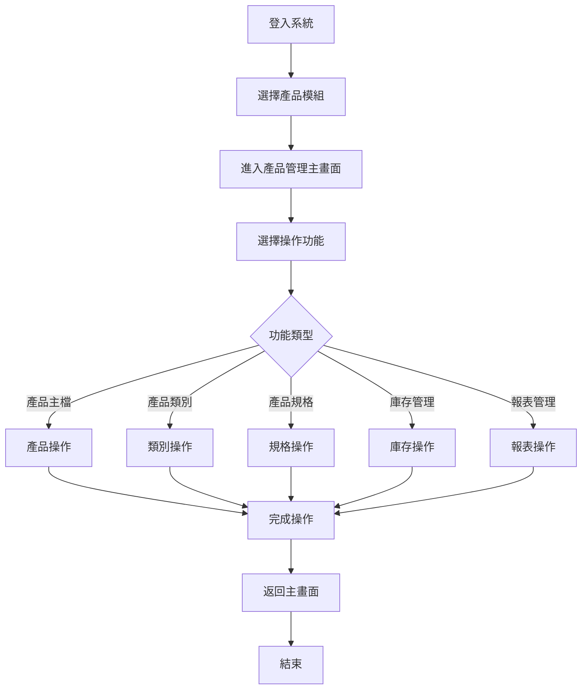
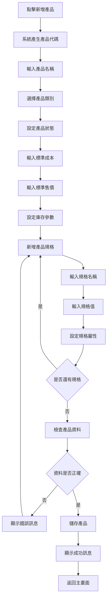
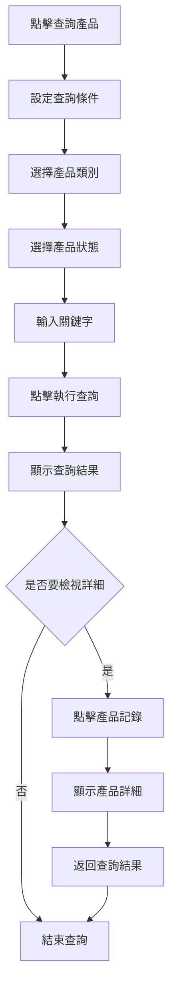
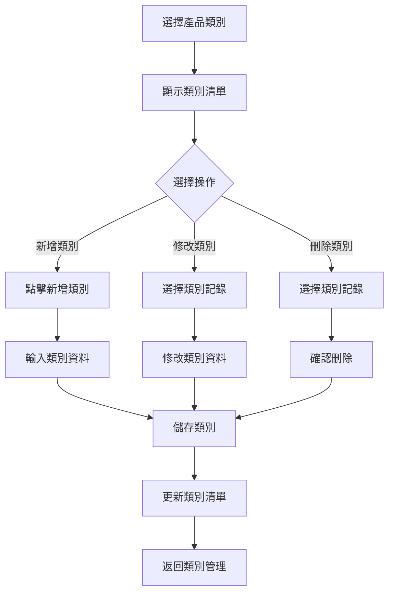
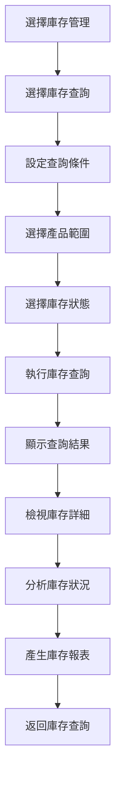

# 產品模組操作手冊

## 一、基本資訊

| 項目 | 說明 |
|------|------|
| **系統名稱** | 10.10.10.180 企業管理系統 |
| **模組名稱** | 產品模組 |
| **模組代號** | PT (Product) |
| **功能名稱** | 產品管理 |
| **功能代號** | PT001 |
| **撰寫人員** | 系統分析師 |
| **撰寫日期** | 2024/12/21 |
| **審核人員** | 專案經理 |
| **審核日期** | 2024/12/21 |
| **版本編號** | v1.0 |
| **適用對象** | 產品管理員、倉管人員、採購人員、銷售人員、系統使用者 |

---

## 二、功能概述

### 2.1 功能目的
產品模組是企業產品管理的核心，主要用於管理產品基本資料、產品類別、產品規格、庫存資訊，為採購、銷售、庫存等模組提供產品基礎資料，確保產品資訊的準確性和一致性，為企業營運提供完整的產品資料基礎。

### 2.2 功能範圍
- **主要功能**：產品主檔管理、產品類別管理、產品規格管理、庫存管理、報表管理
- **輔助功能**：資料查詢、資料匯出、資料備份、系統監控
- **限制功能**：已停用產品不能修改、已刪除產品不能恢復

### 2.3 使用時機
- **日常使用**：每日產品資料維護、類別管理、規格設定
- **特殊情況**：新產品上架、產品下架、類別調整
- **不適用情況**：系統維護期間、資料庫備份期間

---

## 三、操作流程

### 3.1 整體操作流程圖



### 3.2 產品主檔管理操作流程

#### 3.2.1 新增產品流程


#### 3.2.2 查詢產品流程


### 3.3 產品類別管理操作流程



### 3.4 庫存查詢操作流程



---

## 四、畫面說明

### 4.1 產品管理主畫面

#### 4.1.1 主畫面配置圖
```
┌─────────────────────────────────────────────────────────────┐
│                    產品管理系統 - 主畫面                      │
├─────────────────────────────────────────────────────────────┤
│ 功能選單區域                                                │
│ ┌─────────────────────────────────────────────────────────┐ │
│ │ [產品管理] [產品主檔] [產品類別] [產品規格] [庫存管理]   │ │
│ └─────────────────────────────────────────────────────────┘ │
├─────────────────────────────────────────────────────────────┤
│ 查詢條件區域                                                │
│ ┌─────────────────────────────────────────────────────────┐ │
│ │ 產品類別: [全部類別 ▼]    產品狀態: [全部狀態 ▼]        │ │
│ │ 關鍵字: [產品名稱 ▼] [                    ] [查詢]      │ │
│ └─────────────────────────────────────────────────────────┘ │
├─────────────────────────────────────────────────────────────┤
│ 功能按鈕區域                                                │
│ [新增產品] [查詢產品] [類別維護] [庫存查詢] [報表產生]    │
├─────────────────────────────────────────────────────────────┤
│ 產品資料顯示區域                                            │
│ ┌─────────────────────────────────────────────────────────┐ │
│ │ 產品代碼 │ 產品名稱 │ 產品類別 │ 標準成本 │ 狀態 │ 庫存數量 │
│ ├─────────────────────────────────────────────────────────┤ │
│ │ P001     │ 產品A   │ 電子類   │ 500      │ 有效 │ 100      │
│ │ P002     │ 產品B   │ 機械類   │ 800      │ 有效 │ 50       │
│ └─────────────────────────────────────────────────────────┘ │
└─────────────────────────────────────────────────────────────┘
```

#### 4.1.2 區域說明
| 區域名稱 | 位置 | 功能說明 | 操作方式 |
|----------|------|----------|----------|
| **功能選單區域** | 畫面頂部 | 選擇主要功能模組 | 點擊對應功能選單 |
| **查詢條件區域** | 畫面上部 | 設定查詢條件 | 選擇或輸入查詢條件 |
| **功能按鈕區域** | 畫面中部 | 執行各種功能 | 點擊對應功能按鈕 |
| **資料顯示區域** | 畫面底部 | 顯示查詢結果 | 點擊記錄檢視詳細 |

### 4.2 產品輸入畫面

#### 4.2.1 產品輸入配置圖
```
┌─────────────────────────────────────────────────────────────┐
│                    產品輸入 - 新增產品                      │
├─────────────────────────────────────────────────────────────┤
│ 產品標頭區域                                                │
│ ┌─────────────────────────────────────────────────────────┐ │
│ │ 產品代碼: [P001        ] (系統自動產生)                │ │
│ │ 產品名稱: [產品A                                    ] │ │
│ │ 產品類別: [電子類 ▼]    產品狀態: [有效 ▼]            │ │
│ │ 標準成本: [500.00    ]  標準售價: [800.00    ]        │ │
│ │ 最小庫存: [10         ]  最大庫存: [1000      ]        │
│ │ 安全庫存: [50         ]  庫存單位: [個 ▼]              │
│ └─────────────────────────────────────────────────────────┘ │
├─────────────────────────────────────────────────────────────┤
│ 產品規格區域                                                │
│ ┌─────────────────────────────────────────────────────────┐ │
│ │ 規格代碼 │ 規格名稱 │ 規格值 │ 單位 │ 必填 │ 排序 │ 備註 │
│ ├─────────────────────────────────────────────────────────┤ │
│ │  1       │ [顏色  ] │ [紅色 ] │ [個 ] │ [Y]  │ [1]  │ [    ] │
│ │  2       │ [尺寸  ] │ [大   ] │ [cm] │ [Y]  │ [2]  │ [    ] │
│ └─────────────────────────────────────────────────────────┘ │
├─────────────────────────────────────────────────────────────┤
│ 功能按鈕區域                                                │
│ [新增規格] [儲存產品] [取消]                              │
└─────────────────────────────────────────────────────────────┘
```

---

## 五、功能鍵說明

### 5.1 功能鍵清單
| 功能鍵 | 功能名稱 | 使用時機 | 操作說明 |
|--------|----------|----------|----------|
| **F1** | 線上說明 | 需要協助時 | 顯示線上說明文件 |
| **F2** | 查詢 | 要執行查詢時 | 執行查詢作業 |
| **F3** | 新增 | 要新增資料時 | 進入新增畫面 |
| **F4** | 修改 | 要修改資料時 | 進入修改畫面 |
| **F5** | 刪除 | 要刪除資料時 | 執行刪除作業 |
| **F6** | 儲存 | 要儲存資料時 | 儲存輸入的資料 |
| **F7** | 取消 | 要取消操作時 | 取消當前操作 |
| **F8** | 列印 | 要列印資料時 | 執行列印作業 |
| **F9** | 匯出 | 要匯出資料時 | 執行資料匯出 |
| **F10** | 離開 | 要離開功能時 | 離開當前功能 |

### 5.2 常用功能鍵操作

#### 5.2.1 新增產品 (F3)
- **使用時機**：需要新增產品時
- **操作步驟**：
  1. 按 F3 鍵或點擊 [新增產品] 按鈕
  2. 系統顯示產品輸入畫面
  3. 輸入產品基本資料
  4. 輸入產品規格資料
  5. 按 F6 儲存產品

#### 5.2.2 查詢產品 (F2)
- **使用時機**：需要查詢產品資料時
- **操作步驟**：
  1. 設定查詢條件
  2. 按 F2 鍵或點擊 [查詢產品] 按鈕
  3. 系統執行查詢並顯示結果

---

## 六、常見問題與解答

### 6.1 產品相關問題

#### 6.1.1 產品代碼已存在
**問題描述**：輸入產品代碼時顯示產品代碼已存在錯誤

**可能原因**：
- 產品代碼輸入錯誤
- 產品代碼已被使用
- 系統編號產生錯誤

**解決方案**：
1. 檢查產品代碼是否正確
2. 使用產品查詢功能確認產品存在
3. 聯絡管理員檢查系統編號設定

#### 6.1.2 產品類別不存在
**問題描述**：選擇產品類別時顯示類別不存在錯誤

**可能原因**：
- 產品類別尚未建立
- 產品類別已停用
- 類別代碼輸入錯誤

**解決方案**：
1. 檢查產品類別代碼是否正確
2. 使用類別查詢功能確認類別存在
3. 聯絡管理員新增產品類別或啟用停用類別

### 6.2 系統相關問題

#### 6.2.1 無法進入產品功能
**問題描述**：點擊產品管理後無法進入功能畫面

**可能原因**：
- 使用者權限不足
- 系統連線異常
- 功能暫時停用

**解決方案**：
1. 檢查使用者權限設定
2. 重新登入系統
3. 聯絡系統管理員

---

## 七、錯誤處理

### 7.1 錯誤訊息說明

#### 7.1.1 業務錯誤訊息
| 錯誤代碼 | 錯誤訊息 | 錯誤原因 | 解決方案 |
|----------|----------|----------|----------|
| PT101 | 產品代碼已存在，請使用其他代碼 | 輸入的產品代碼在系統中已存在 | 使用其他產品代碼，或聯絡管理員檢查 |
| PT102 | 產品類別不存在，請檢查類別代碼 | 選擇的產品類別在系統中不存在 | 選擇正確的產品類別，或聯絡管理員新增類別 |

#### 7.1.2 使用者錯誤訊息
| 錯誤代碼 | 錯誤訊息 | 錯誤原因 | 解決方案 |
|----------|----------|----------|----------|
| PT201 | 產品名稱長度超過限制，請縮短名稱 | 產品名稱超過30字元限制 | 縮短產品名稱至30字元以內 |
| PT202 | 標準成本格式錯誤，請輸入正確金額 | 標準成本輸入格式不正確 | 輸入正確的金額格式，如：500.00 |

### 7.2 錯誤處理步驟

#### 7.2.1 一般錯誤處理流程
1. **記錄錯誤訊息**：記下錯誤代碼和錯誤訊息
2. **嘗試基本解決方案**：根據錯誤訊息嘗試解決
3. **尋求協助**：如無法解決，聯絡系統管理員

---

## 八、使用技巧

### 8.1 操作效率提升

#### 8.1.1 快速輸入技巧
- **使用產品代碼**：直接輸入產品代碼比選擇產品名稱快
- **複製產品**：相似產品可使用複製功能
- **使用範本**：建立常用產品範本

#### 8.1.2 查詢技巧
- **組合查詢條件**：使用多個條件組合查詢
- **儲存查詢條件**：將常用查詢條件儲存起來
- **使用進階查詢**：利用進階查詢功能進行複雜查詢

### 8.2 資料庫操作技巧

#### 8.2.1 資料庫查詢優化
```sql
-- 基本查詢（推薦使用）
SELECT PT02, PT03, PT04, PT06, PT05, PT08
FROM PTAPF
WHERE PT05 = 'A'
  AND PT04 = '電子類'
ORDER BY PT03;

-- 使用索引的查詢（效能最佳）
SELECT /*+ INDEX(PTAPF PTP002) */
    PT02, PT03, PT04, PT06, PT05, PT08
FROM PTAPF
WHERE PT04 = '電子類' 
  AND PT05 = 'A'
  AND PT06 BETWEEN 100 AND 1000;

-- 統計查詢（用於報表）
SELECT 
    PT04 AS PRODUCT_CATEGORY,
    COUNT(*) AS PRODUCT_COUNT,
    AVG(PT06) AS AVG_COST,
    SUM(PT08) AS TOTAL_MIN_STOCK
FROM PTAPF
WHERE PT05 = 'A'
GROUP BY PT04
HAVING COUNT(*) > 0
ORDER BY PRODUCT_COUNT DESC;
```

#### 8.2.2 資料庫維護操作
```sql
-- 檢查產品資料完整性
SELECT 
    PT05 AS PRODUCT_STATUS,
    COUNT(*) AS PRODUCT_COUNT,
    AVG(PT06) AS AVG_COST
FROM PTAPF
GROUP BY PT05
ORDER BY PT05;

-- 檢查產品類別統計
SELECT 
    PT04 AS PRODUCT_CATEGORY,
    COUNT(*) AS PRODUCT_COUNT,
    AVG(PT06) AS AVG_COST,
    MAX(PT14) AS LAST_CREATED_DATE
FROM PTAPF
WHERE PT05 = 'A'
GROUP BY PT04
HAVING COUNT(*) > 0
ORDER BY PRODUCT_COUNT DESC;

-- 清理無效資料
DELETE FROM PTWF01 
WHERE WF0103 = 'E' 
  AND WF0106 < CURRENT_DATE - 30;
```

#### 8.2.3 資料庫效能監控
```sql
-- 監控產品查詢效能
SELECT 
    SUBSTR(EXECUTION_TIME, 1, 10) AS EXEC_DATE,
    COUNT(*) AS QUERY_COUNT,
    AVG(ELAPSED_TIME) AS AVG_ELAPSED_TIME,
    MAX(ELAPSED_TIME) AS MAX_ELAPSED_TIME
FROM PT_QUERY_LOG
WHERE EXECUTION_TIME >= CURRENT_DATE - 7
GROUP BY SUBSTR(EXECUTION_TIME, 1, 10)
ORDER BY EXEC_DATE DESC;

-- 監控資料表大小
SELECT 
    TABLE_NAME,
    TABLE_SCHEMA,
    ROUND(TABLE_SIZE/1024/1024, 2) AS SIZE_MB,
    ROW_COUNT
FROM PT_TABLE_STATS
WHERE TABLE_SCHEMA = 'PTDATA'
ORDER BY TABLE_SIZE DESC;
```

### 8.3 進階操作技巧

#### 8.3.1 批次處理操作
```sql
-- 批次更新產品狀態
UPDATE PTAPF 
SET PT05 = 'D', 
    PT15 = 'BATCH_USER', 
    PT16 = CURRENT_TIMESTAMP
WHERE PT05 = 'A' 
  AND PT14 < CURRENT_DATE - 365
  AND PT08 = 0;

-- 批次產生產品代碼
INSERT INTO PTWF01 (WF0101, WF0102, WF0103, WF0106)
SELECT 
    'WF' || RIGHT('0000000000' || ROW_NUMBER() OVER(), 10),
    'P' || RIGHT('00000' || ROW_NUMBER() OVER(), 5),
    'P',
    CURRENT_TIMESTAMP
FROM SYSIBM.SYSDUMMY1
CONNECT BY LEVEL <= 1000;
```

#### 8.3.2 資料匯出操作
```sql
-- 匯出產品資料到CSV格式
SELECT 
    PT02 || ',' ||
    PT03 || ',' ||
    PT04 || ',' ||
    PT06 || ',' ||
    PT05 || ',' ||
    PT08 || ',' ||
    PT13 || ',' ||
    PT14
FROM PTAPF
WHERE PT05 = 'A'
ORDER BY PT04, PT03;

-- 匯出產品類別統計
SELECT 
    AC01 || ',' ||
    AC02 || ',' ||
    AC03 || ',' ||
    AC06
FROM PTACPF
WHERE AC06 = 'A'
ORDER BY AC01;
```

---

## 九、相關功能

### 9.1 相關功能清單
| 功能名稱 | 功能代號 | 關聯性 | 說明 |
|----------|----------|--------|------|
| 採購模組 | PC | 前置 | 需要產品資料進行請購 |
| 銷貨模組 | NP | 前置 | 需要產品資料進行銷售 |
| 總帳模組 | GL | 相關 | 影響庫存成本計算 |

---

## 十、聯絡資訊

### 10.1 技術支援聯絡方式
| 支援類型 | 聯絡方式 | 聯絡時間 | 回應時間 |
|----------|----------|----------|----------|
| **一般問題** | 系統管理員 | 上班時間 | 2小時內 |
| **技術問題** | 技術支援 | 上班時間 | 4小時內 |
| **緊急問題** | 專案經理 | 24小時 | 立即回應 |

---

**文件建立日期**：2024年12月21日  
**最後更新日期**：2024年12月21日  
**文件狀態**：草稿  
**下次檢討日期**：2025年1月21日 