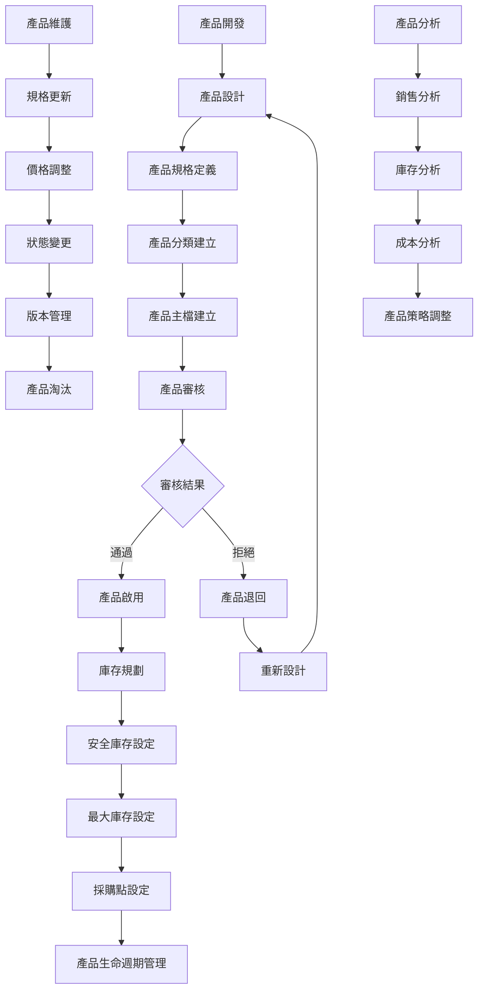
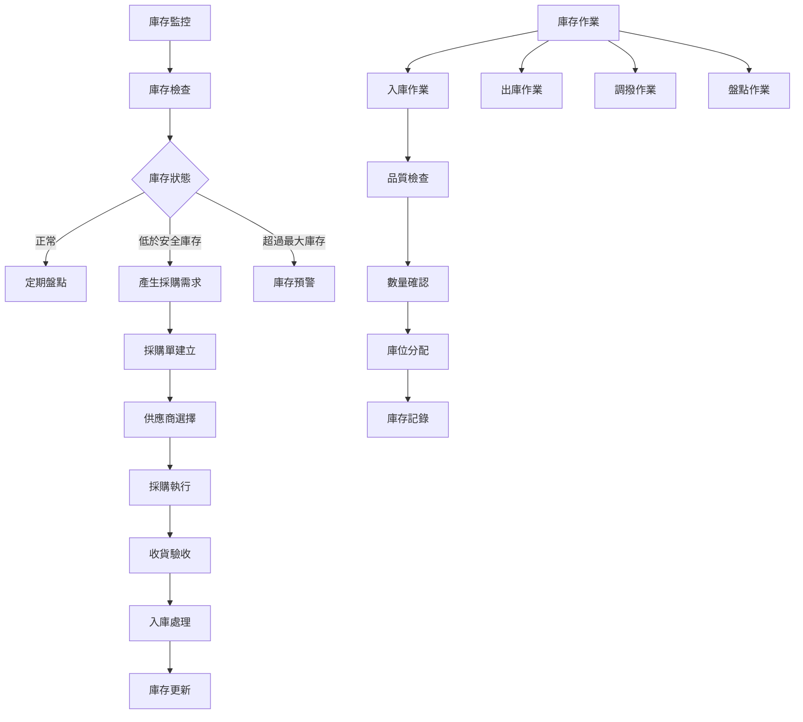
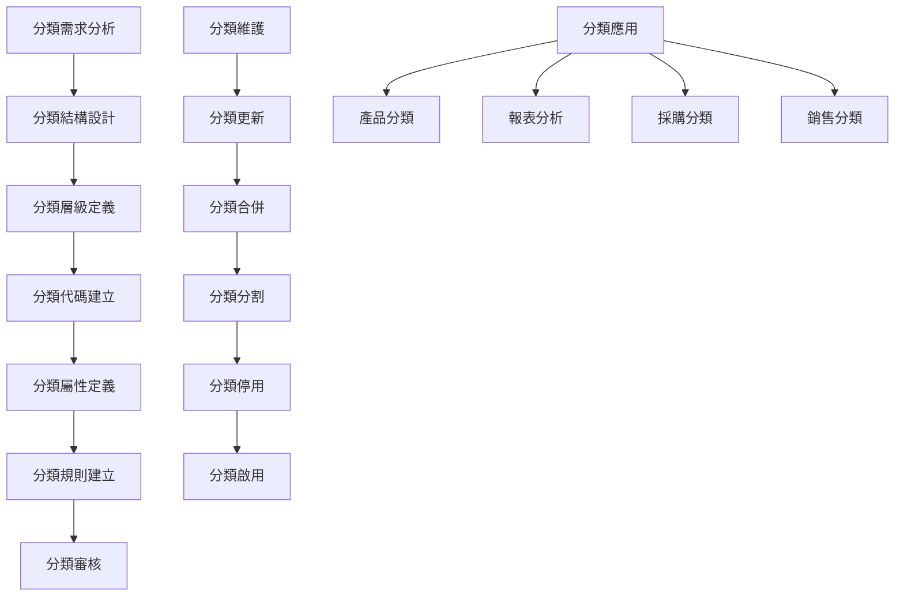
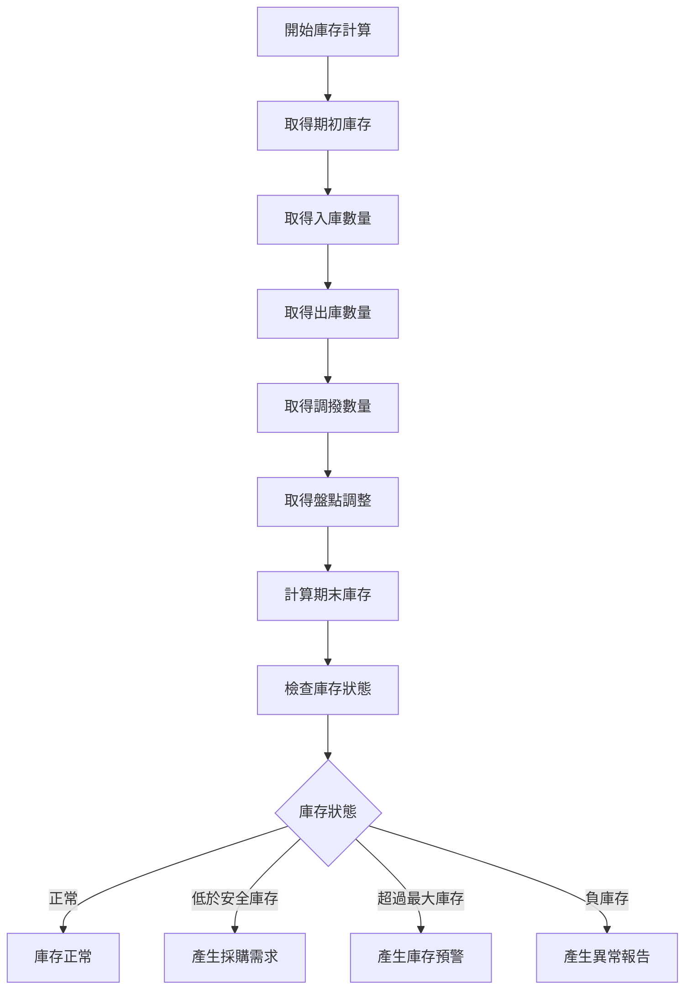
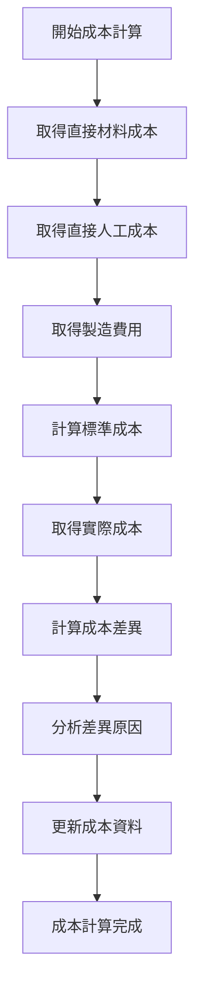
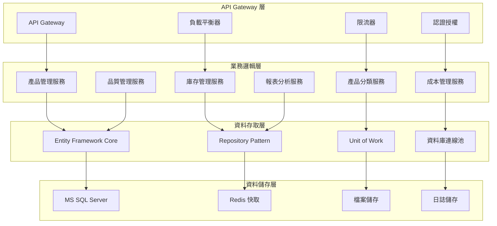

# 產品模組業務邏輯分析與API設計文件

## 一、基本資訊

| 項目 | 說明 |
|------|------|
| **系統名稱** | 10.10.10.180 企業管理系統 |
| **模組名稱** | 產品模組 |
| **模組代號** | PT (Product) |
| **功能名稱** | 產品管理 |
| **功能代號** | PT001 |
| **撰寫人員** | 系統分析師 |
| **撰寫日期** | 2024/12/21 |
| **審核人員** | 專案經理 |
| **審核日期** | 2024/12/21 |
| **版本編號** | v1.0 |
| **文件類型** | 業務邏輯分析與API設計 |
| **適用範圍** | 系統現代化轉型專案 |

---

## 二、業務邏輯分析

### 2.1 業務流程分析

#### 2.1.1 產品管理核心業務流程



#### 2.1.2 庫存管理業務流程



#### 2.1.3 產品分類管理業務流程



### 2.2 業務規則分析

#### 2.2.1 產品管理業務規則

| 業務規則編號 | 規則名稱 | 規則內容 | 業務影響 |
|-------------|----------|----------|----------|
| **PT001** | 產品代碼唯一性 | 每個產品必須有唯一的產品代碼 | 確保產品識別的唯一性 |
| **PT002** | 產品分類有效性 | 產品必須歸屬於有效的產品分類 | 便於產品管理和分析 |
| **PT003** | 產品規格完整性 | 產品必須包含完整的規格資訊 | 確保產品資訊的完整性 |
| **PT004** | 產品狀態管理 | 產品狀態變更必須經過審核 | 確保產品資料的準確性 |
| **PT005** | 產品版本控制 | 產品規格變更必須建立新版本 | 追蹤產品變更歷史 |

#### 2.2.2 庫存管理業務規則

| 業務規則編號 | 規則名稱 | 規則內容 | 業務影響 |
|-------------|----------|----------|----------|
| **PT006** | 庫存數量非負性 | 庫存數量不能為負數 | 確保庫存資料的合理性 |
| **PT007** | 安全庫存控制 | 庫存低於安全庫存時必須產生預警 | 防止庫存不足 |
| **PT008** | 最大庫存控制 | 庫存超過最大庫存時必須產生預警 | 控制庫存成本 |
| **PT009** | 庫存移動追蹤 | 所有庫存移動都必須記錄 | 確保庫存追蹤的完整性 |
| **PT010** | 庫存盤點規則 | 庫存盤點必須定期執行 | 確保庫存資料的準確性 |

#### 2.2.3 產品分類業務規則

| 業務規則編號 | 規則名稱 | 規則內容 | 業務影響 |
|-------------|----------|----------|----------|
| **PT011** | 分類代碼唯一性 | 分類代碼必須唯一 | 確保分類識別的唯一性 |
| **PT012** | 分類層級限制 | 分類層級不能超過預設的最大層級 | 控制分類結構的複雜度 |
| **PT013** | 分類屬性一致性 | 同級分類必須具有一致的屬性 | 確保分類的邏輯性 |
| **PT014** | 分類使用檢查 | 停用分類前必須檢查是否有產品使用 | 防止資料不一致 |
| **PT015** | 分類繼承規則 | 子分類必須繼承父分類的基本屬性 | 確保分類的邏輯性 |

### 2.3 業務邏輯複雜度分析

#### 2.3.1 業務邏輯複雜度矩陣

| 業務功能 | 邏輯複雜度 | 資料複雜度 | 整合複雜度 | 總體複雜度 |
|----------|------------|------------|------------|------------|
| **產品管理** | 中 | 中 | 中 | 中 |
| **庫存管理** | 高 | 高 | 高 | 高 |
| **產品分類** | 中 | 中 | 低 | 中 |
| **成本管理** | 高 | 中 | 中 | 高 |
| **品質管理** | 中 | 中 | 中 | 中 |
| **報表分析** | 中 | 高 | 中 | 中 |

#### 2.3.2 關鍵業務邏輯分析

##### 2.3.2.1 庫存計算邏輯


##### 2.3.2.2 產品成本計算邏輯


---

## 三、API 設計

### 3.1 API 架構設計

#### 3.1.1 API 分層架構



#### 3.1.2 API 設計原則

| 設計原則 | 說明 | 實作方式 |
|----------|------|----------|
| **RESTful 設計** | 遵循 REST 架構原則 | 使用標準 HTTP 方法和狀態碼 |
| **版本控制** | 支援 API 版本管理 | URL 路徑版本控制 |
| **標準化回應** | 統一的回應格式 | 標準化的 JSON 回應結構 |
| **錯誤處理** | 完整的錯誤處理機制 | HTTP 狀態碼 + 錯誤訊息 |
| **安全性** | 完整的認證授權 | JWT Token + Role-based Access Control |
| **效能優化** | 支援快取和分頁 | Redis 快取 + 分頁查詢 |

### 3.2 API 端點設計

#### 3.2.1 產品管理 API

##### 3.2.1.1 查詢產品列表
```http
# 查詢產品列表
GET /api/pt/v1/products
Authorization: Bearer {token}
Content-Type: application/json

Query Parameters:
- company_code: string (required)
- category_code: string (optional)
- product_status: string (optional)
- product_type: string (optional)
- page: integer (optional, default: 1)
- page_size: integer (optional, default: 20)
```

**回應格式**：
```json
{
  "status": "success",
  "data": {
    "products": [
      {
        "product_code": "P001",
        "product_name": "產品A",
        "category_code": "CAT001",
        "category_name": "電子類",
        "product_status": "ACTIVE",
        "standard_cost": 500.00,
        "standard_price": 800.00,
        "min_stock": 100,
        "max_stock": 1000,
        "current_stock": 250,
        "created_by": "USER001",
        "created_time": "2024-12-21T10:00:00Z"
      }
    ],
    "pagination": {
      "current_page": 1,
      "total_pages": 5,
      "total_records": 100,
      "page_size": 20
    }
  }
}
```

##### 3.2.1.2 新增產品
```http
# 新增產品
POST /api/pt/v1/products
Authorization: Bearer {token}
Content-Type: application/json

Request Body:
{
  "company_code": "001",
  "product_name": "新產品B",
  "category_code": "CAT001",
  "product_type": "FINISHED_GOODS",
  "product_status": "ACTIVE",
  "standard_cost": 300.00,
  "standard_price": 500.00,
  "min_stock": 50,
  "max_stock": 500,
  "safety_stock": 100,
  "unit_of_measure": "PCS",
  "description": "高品質產品",
  "specifications": {
    "dimensions": "100x50x25mm",
    "weight": "150g",
    "material": "塑膠"
  }
}
```

##### 3.2.1.3 更新產品
```http
# 更新產品
PUT /api/pt/v1/products/{product_code}
Authorization: Bearer {token}
Content-Type: application/json

Request Body:
{
  "product_name": "更新產品名稱",
  "standard_cost": 350.00,
  "standard_price": 550.00,
  "min_stock": 75,
  "max_stock": 600,
  "updated_by": "USER001",
  "updated_time": "2024-12-21T10:05:00Z"
}
```

#### 3.2.2 庫存管理 API

##### 3.2.2.1 查詢庫存狀態
```http
# 查詢庫存狀態
GET /api/pt/v1/inventory
Authorization: Bearer {token}
Content-Type: application/json

Query Parameters:
- company_code: string (required)
- product_code: string (optional)
- warehouse_code: string (optional)
- stock_status: string (optional)
```

##### 3.2.2.2 庫存移動
```http
# 庫存移動
POST /api/pt/v1/inventory/movements
Authorization: Bearer {token}
Content-Type: application/json

Request Body:
{
  "company_code": "001",
  "movement_type": "IN",
  "product_code": "P001",
  "warehouse_code": "WH001",
  "quantity": 100,
  "unit_cost": 500.00,
  "reference_type": "PURCHASE_ORDER",
  "reference_id": "PO001",
  "movement_date": "2024-12-21",
  "remarks": "採購入庫"
}
```

#### 3.2.3 產品分類 API

##### 3.2.3.1 查詢產品分類
```http
# 查詢產品分類
GET /api/pt/v1/categories
Authorization: Bearer {token}
Content-Type: application/json

Query Parameters:
- company_code: string (required)
- parent_category_code: string (optional)
- category_level: integer (optional)
- category_status: string (optional)
```

##### 3.2.3.2 新增產品分類
```http
# 新增產品分類
POST /api/pt/v1/categories
Authorization: Bearer {token}
Content-Type: application/json

Request Body:
{
  "company_code": "001",
  "category_code": "CAT002",
  "category_name": "新分類",
  "parent_category_code": "CAT001",
  "category_level": 2,
  "category_status": "ACTIVE",
  "description": "新產品分類",
  "attributes": ["尺寸", "顏色", "材質"]
}
```

### 3.3 API 資料模型設計

#### 3.3.1 產品資料模型

```csharp
// 產品主檔
public class Product
{
    public string ProductCode { get; set; }
    public string CompanyCode { get; set; }
    public string ProductName { get; set; }
    public string CategoryCode { get; set; }
    public string ProductType { get; set; }
    public string ProductStatus { get; set; }
    public decimal StandardCost { get; set; }
    public decimal StandardPrice { get; set; }
    public int MinStock { get; set; }
    public int MaxStock { get; set; }
    public int SafetyStock { get; set; }
    public string UnitOfMeasure { get; set; }
    public string Description { get; set; }
    public string Specifications { get; set; }
    public string CreatedBy { get; set; }
    public DateTime CreatedTime { get; set; }
    public string UpdatedBy { get; set; }
    public DateTime? UpdatedTime { get; set; }
    
    // 導航屬性
    public virtual ProductCategory Category { get; set; }
    public virtual ICollection<Inventory> Inventories { get; set; }
    public virtual ICollection<ProductCost> ProductCosts { get; set; }
}

// 產品分類
public class ProductCategory
{
    public string CategoryCode { get; set; }
    public string CompanyCode { get; set; }
    public string CategoryName { get; set; }
    public string ParentCategoryCode { get; set; }
    public int CategoryLevel { get; set; }
    public string CategoryStatus { get; set; }
    public string Description { get; set; }
    public string Attributes { get; set; }
    public string CreatedBy { get; set; }
    public DateTime CreatedTime { get; set; }
    
    // 導航屬性
    public virtual ProductCategory ParentCategory { get; set; }
    public virtual ICollection<ProductCategory> SubCategories { get; set; }
    public virtual ICollection<Product> Products { get; set; }
}
```

#### 3.3.2 庫存資料模型

```csharp
// 庫存主檔
public class Inventory
{
    public string InventoryId { get; set; }
    public string CompanyCode { get; set; }
    public string ProductCode { get; set; }
    public string WarehouseCode { get; set; }
    public int CurrentStock { get; set; }
    public int ReservedStock { get; set; }
    public int AvailableStock { get; set; }
    public decimal AverageCost { get; set; }
    public DateTime LastMovementDate { get; set; }
    public string LastMovementType { get; set; }
    public string CreatedBy { get; set; }
    public DateTime CreatedTime { get; set; }
    public string UpdatedBy { get; set; }
    public DateTime? UpdatedTime { get; set; }
    
    // 導航屬性
    public virtual Product Product { get; set; }
    public virtual Warehouse Warehouse { get; set; }
    public virtual ICollection<InventoryMovement> Movements { get; set; }
}

// 庫存移動
public class InventoryMovement
{
    public string MovementId { get; set; }
    public string CompanyCode { get; set; }
    public string MovementType { get; set; }
    public string ProductCode { get; set; }
    public string WarehouseCode { get; set; }
    public int Quantity { get; set; }
    public decimal UnitCost { get; set; }
    public string ReferenceType { get; set; }
    public string ReferenceId { get; set; }
    public DateTime MovementDate { get; set; }
    public string Remarks { get; set; }
    public string CreatedBy { get; set; }
    public DateTime CreatedTime { get; set; }
    
    // 導航屬性
    public virtual Product Product { get; set; }
    public virtual Warehouse Warehouse { get; set; }
}
```

---

## 四、業務邏輯轉換策略

### 4.1 RPG 到 C# 轉換策略

#### 4.1.1 程式結構轉換

| RPG 結構 | C# 對應 | 轉換說明 |
|----------|----------|----------|
| **主程式** | Main Program | 使用 Program.cs 作為程式進入點 |
| **子程序** | Private Methods | 將 RPG 子程序轉換為 C# 私有方法 |
| **資料結構** | Classes/Models | 將 RPG 資料結構轉換為 C# 類別 |
| **檔案操作** | Repository Pattern | 使用 Repository 模式處理資料存取 |
| **錯誤處理** | Exception Handling | 使用 C# 例外處理機制 |

#### 4.1.2 業務邏輯轉換範例

**RPG 原始碼**：
```rpgle
     C     ProcessInventory BEGSR
     C                   EVAL      CurrentStock = CurrentStock + Quantity
     C                   EVAL      AverageCost = (AverageCost * OldStock + UnitCost * Quantity) / CurrentStock
     C                   EVAL      LastMovementDate = %DATE
     C                   EVAL      LastMovementType = MovementType
     C                   UPDATE     PTAIPF
     C                   EXSR      LogInventoryMovement
     C                   EXSR      CheckStockLevel
     C                   ENDSR
```

**C# 轉換後**：
```csharp
private async Task ProcessInventoryAsync(string productCode, string warehouseCode, int quantity, decimal unitCost, string movementType)
{
    try
    {
        var inventory = await _inventoryRepository.GetByProductAndWarehouseAsync(productCode, warehouseCode);
        if (inventory == null)
            throw new NotFoundException($"Inventory not found for product {productCode} in warehouse {warehouseCode}");
        
        var oldStock = inventory.CurrentStock;
        inventory.UpdateStock(quantity, unitCost, movementType);
        await _inventoryRepository.UpdateAsync(inventory);
        
        await LogInventoryMovementAsync(inventory, quantity, unitCost, movementType);
        await CheckStockLevelAsync(inventory);
        
        await _unitOfWork.SaveChangesAsync();
    }
    catch (Exception ex)
    {
        _logger.LogError(ex, "Error processing inventory for product {ProductCode}", productCode);
        throw;
    }
}
```

### 4.2 資料庫轉換策略

#### 4.2.1 資料表結構轉換

| AS/400 檔案 | MS SQL 資料表 | 轉換說明 |
|-------------|----------------|----------|
| **PTAPF** | PT_Products | 產品主檔 |
| **PTACPF** | PT_ProductCategories | 產品分類 |
| **PTAIPF** | PT_Inventory | 庫存主檔 |
| **PTWF01** | PT_WorkFiles | 工作檔案 |

---

## 五、API 效能優化策略

### 5.1 快取策略

#### 5.1.1 Redis 快取設計

```csharp
// 快取服務介面
public interface ICacheService
{
    Task<T> GetAsync<T>(string key);
    Task SetAsync<T>(string key, T value, TimeSpan? expiry = null);
    Task RemoveAsync(string key);
    Task RemoveByPatternAsync(string pattern);
}

// 在服務中使用快取
public class ProductService : IProductService
{
    private readonly ICacheService _cacheService;
    
    public async Task<ProductDto> GetProductAsync(string productCode)
    {
        var cacheKey = $"product:{productCode}";
        var cachedProduct = await _cacheService.GetAsync<ProductDto>(cacheKey);
        
        if (cachedProduct != null)
            return cachedProduct;
        
        var product = await _productRepository.GetByIdAsync(productCode);
        var productDto = _mapper.Map<ProductDto>(product);
        
        await _cacheService.SetAsync(cacheKey, productDto, TimeSpan.FromMinutes(30));
        return productDto;
    }
}
```

### 5.2 分頁查詢優化

#### 5.2.1 分頁查詢實作

```csharp
public async Task<PagedResult<ProductDto>> GetProductsAsync(ProductQueryParameters parameters)
{
    var query = _context.Products.AsQueryable();
    
    // 套用查詢條件
    if (!string.IsNullOrEmpty(parameters.CompanyCode))
        query = query.Where(p => p.CompanyCode == parameters.CompanyCode);
    
    if (!string.IsNullOrEmpty(parameters.CategoryCode))
        query = query.Where(p => p.CategoryCode == parameters.CategoryCode);
    
    if (!string.IsNullOrEmpty(parameters.ProductStatus))
        query = query.Where(p => p.ProductStatus == parameters.ProductStatus);
    
    // 取得總數
    var totalCount = await query.CountAsync();
    
    // 分頁查詢
    var products = await query
        .OrderBy(p => p.ProductCode)
        .Skip(parameters.Skip)
        .Take(parameters.PageSize)
        .Include(p => p.Category)
        .Include(p => p.Inventories)
        .ToListAsync();
    
    var productDtos = _mapper.Map<List<ProductDto>>(products);
    
    return new PagedResult<ProductDto>
    {
        Items = productDtos,
        TotalCount = totalCount,
        Page = parameters.Page,
        PageSize = parameters.PageSize
    };
}
```

---

## 六、錯誤處理與日誌記錄

### 6.1 統一錯誤處理

#### 6.1.1 業務邏輯例外

```csharp
// 自訂例外類別
public class ProductValidationException : Exception
{
    public List<string> ValidationErrors { get; }
    
    public ProductValidationException(string message, List<string> errors = null) 
        : base(message)
    {
        ValidationErrors = errors ?? new List<string>();
    }
}

public class InsufficientStockException : Exception
{
    public string ProductCode { get; }
    public int RequiredQuantity { get; }
    public int AvailableQuantity { get; }
    
    public InsufficientStockException(string productCode, int requiredQuantity, int availableQuantity)
        : base($"Insufficient stock for product {productCode}")
    {
        ProductCode = productCode;
        RequiredQuantity = requiredQuantity;
        AvailableQuantity = availableQuantity;
    }
}

public class InvalidCategoryException : Exception
{
    public string CategoryCode { get; }
    public string Reason { get; }
    
    public InvalidCategoryException(string categoryCode, string reason)
        : base($"Invalid category {categoryCode}: {reason}")
    {
        CategoryCode = categoryCode;
        Reason = reason;
    }
}
```

### 6.2 結構化日誌記錄

#### 6.2.1 日誌記錄實作

```csharp
public class LoggingService : ILoggingService
{
    private readonly ILogger<LoggingService> _logger;
    
    public void LogProductOperation(string operation, string productCode, string userId, object data = null)
    {
        _logger.LogInformation("Product operation: {Operation} for product {ProductCode} by user {UserId}",
            operation, productCode, userId);
        
        if (data != null)
        {
            _logger.LogDebug("Product operation data: {@Data}", data);
        }
    }
    
    public void LogInventoryOperation(string operation, string productCode, string warehouseCode, string userId, object data = null)
    {
        _logger.LogInformation("Inventory operation: {Operation} for product {ProductCode} in warehouse {WarehouseCode} by user {UserId}",
            operation, productCode, warehouseCode, userId);
        
        if (data != null)
        {
            _logger.LogDebug("Inventory operation data: {@Data}", data);
        }
    }
}
```

---

## 七、修訂記錄

| 版本 | 修訂日期 | 修訂人員 | 修訂內容 | 修訂原因 |
|------|----------|----------|----------|----------|
| v1.0 | 2024/12/21 | 系統分析師 | 初始版本 | 文件建立 |

---

**文件建立日期**：2024年12月21日  
**最後更新日期**：2024年12月21日  
**文件狀態**：草稿  
**下次檢討日期**：2025年1月21日 