# 產品模組程式功能規格書

## 一、基本資料

| 項目 | 說明 |
|------|------|
| **系統名稱** | 10.10.10.180 企業管理系統 |
| **模組名稱** | 產品模組 |
| **模組代號** | PT (Product) |
| **程式名稱** | 產品管理系統 |
| **程式代號** | PTMGT |
| **功能名稱** | 產品管理 |
| **功能代號** | PT001 |
| **撰寫人員** | 系統分析師 |
| **撰寫日期** | 2024/12/21 |
| **審核人員** | 專案經理 |
| **審核日期** | 2024/12/21 |
| **版本編號** | v1.0 |
| **文件狀態** | 草稿 |

---

## 二、檔案架構與關聯圖

### 2.1 產品模組檔案架構圖

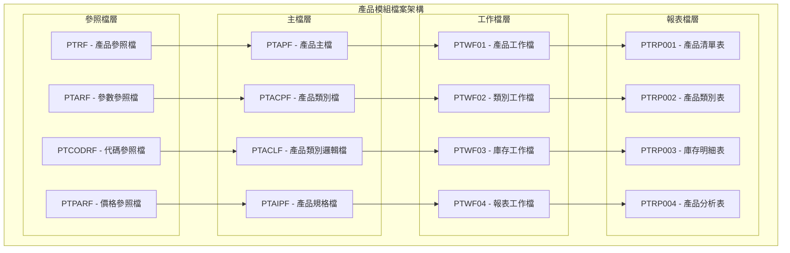

### 2.2 產品模組系統架構圖

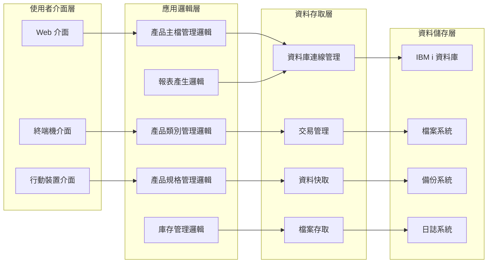

### 2.3 檔案關聯圖

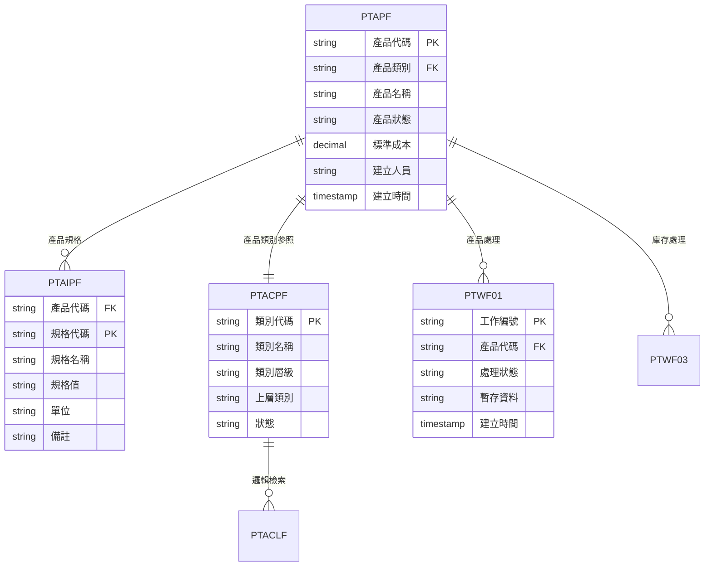

### 2.4 檔案清單

| 檔案類型 | 檔案名稱 | 檔案代號 | 用途說明 |
|----------|----------|----------|----------|
| 主檔 | 產品主檔 | PTAPF | 儲存所有產品的基本資料 |
| 主檔 | 產品類別檔 | PTACPF | 儲存產品類別的主檔 |
| 主檔 | 產品規格檔 | PTAIPF | 儲存產品規格的資料 |
| 邏輯檔 | 產品類別邏輯檔 | PTACLF | 提供產品類別查詢和排序的邏輯檔案 |
| 工作檔 | 產品工作檔 | PTWF01 | 產品處理過程中的暫存資料 |
| 工作檔 | 類別工作檔 | PTWF02 | 類別管理過程中的暫存資料 |
| 工作檔 | 庫存工作檔 | PTWF03 | 庫存處理過程中的暫存資料 |
| 工作檔 | 報表工作檔 | PTWF04 | 報表產生過程中的暫存資料 |
| 參照檔 | 產品參照檔 | PTRF | 產品模組的參照資料 |
| 參照檔 | 參數參照檔 | PTARF | 產品模組的參數設定 |
| 參照檔 | 代碼參照檔 | PTCODRF | 產品模組的代碼對照 |
| 參照檔 | 價格參照檔 | PTPARF | 產品價格的參照資料 |

---

## 三、檔案名稱，欄位代號、名稱、位置、長度、型態、屬性、檢核說明

### 3.1 產品主檔 (PTAPF) 欄位規格

#### 3.1.1 記錄格式：PTAPR
| 欄位代號 | 欄位名稱 | 位置 | 長度 | 型態 | 屬性 | 檢核說明 |
|----------|----------|------|------|------|------|----------|
| PT01 | 公司代碼 | 1-3 | 3 | CHAR | PK | 必填，參照公司主檔 |
| PT02 | 產品代碼 | 4-8 | 5 | CHAR | PK | 必填，唯一值 |
| PT03 | 產品名稱 | 9-38 | 30 | CHAR | - | 必填，最多30字元 |
| PT04 | 產品類別 | 39-41 | 3 | CHAR | FK | 必填，參照產品類別檔 |
| PT05 | 產品狀態 | 42-42 | 1 | CHAR | - | 必填，A:有效 D:停用 |
| PT06 | 標準成本 | 43-52 | 10 | DECIMAL | - | 必填，金額格式 |
| PT07 | 標準售價 | 53-62 | 10 | DECIMAL | - | 必填，金額格式 |
| PT08 | 最小庫存 | 63-70 | 8 | DECIMAL | - | 必填，數量格式 |
| PT09 | 最大庫存 | 71-78 | 8 | DECIMAL | - | 必填，數量格式 |
| PT10 | 安全庫存 | 79-86 | 8 | DECIMAL | - | 必填，數量格式 |
| PT11 | 庫存單位 | 87-88 | 2 | CHAR | - | 必填，參照單位檔 |
| PT12 | 產品描述 | 89-128 | 40 | CHAR | - | 可選，最多40字元 |
| PT13 | 建立人員 | 129-133 | 5 | CHAR | - | 必填，參照使用者檔 |
| PT14 | 建立時間 | 134-141 | 8 | TIMESTAMP | - | 系統自動產生 |
| PT15 | 修改人員 | 142-146 | 5 | CHAR | - | 可選，參照使用者檔 |
| PT16 | 修改時間 | 147-154 | 8 | TIMESTAMP | - | 系統自動產生 |

#### 3.1.2 主鍵欄位
- **主鍵1**：PT01 - 公司代碼 (CHAR(3))
- **主鍵2**：PT02 - 產品代碼 (CHAR(5))

#### 3.1.3 索引資料
| 索引名稱 | 索引類型 | 索引欄位 | 說明 |
|----------|----------|----------|------|
| PTP001 | 主鍵索引 | PT01, PT02 | 主要查詢索引 |
| PTP002 | 一般索引 | PT04, PT05 | 類別狀態查詢索引 |
| PTP003 | 一般索引 | PT03 | 產品名稱查詢索引 |
| PTP004 | 一般索引 | PT13, PT14 | 建立人員時間索引 |

### 3.2 產品類別檔 (PTACPF) 欄位規格

#### 3.2.1 記錄格式：PTACPR
| 欄位代號 | 欄位名稱 | 位置 | 長度 | 型態 | 屬性 | 檢核說明 |
|----------|----------|------|------|------|------|----------|
| AC01 | 類別代碼 | 1-3 | 3 | CHAR | PK | 必填，唯一值 |
| AC02 | 類別名稱 | 4-33 | 30 | CHAR | - | 必填，最多30字元 |
| AC03 | 類別層級 | 34-34 | 1 | CHAR | - | 必填，1:大類 2:中類 3:小類 |
| AC04 | 上層類別 | 35-37 | 3 | CHAR | FK | 可選，參照上層類別 |
| AC05 | 類別描述 | 38-77 | 40 | CHAR | - | 可選，最多40字元 |
| AC06 | 類別狀態 | 78-78 | 1 | CHAR | - | 必填，A:有效 D:停用 |
| AC07 | 建立人員 | 79-83 | 5 | CHAR | - | 必填，參照使用者檔 |
| AC08 | 建立時間 | 84-91 | 8 | TIMESTAMP | - | 系統自動產生 |

#### 3.2.2 主鍵欄位
- **主鍵1**：AC01 - 類別代碼 (CHAR(3))

#### 3.2.3 索引資料
| 索引名稱 | 索引類型 | 索引欄位 | 說明 |
|----------|----------|----------|------|
| PTC001 | 主鍵索引 | AC01 | 主要查詢索引 |
| PTC002 | 一般索引 | AC02 | 類別名稱查詢索引 |
| PTC003 | 一般索引 | AC03, AC04 | 層級上層查詢索引 |
| PTC004 | 一般索引 | AC06 | 狀態查詢索引 |

### 3.3 產品規格檔 (PTAIPF) 欄位規格

#### 3.3.1 記錄格式：PTAIPR
| 欄位代號 | 欄位名稱 | 位置 | 長度 | 型態 | 屬性 | 檢核說明 |
|----------|----------|------|------|------|------|----------|
| AI01 | 產品代碼 | 1-5 | 5 | CHAR | FK | 必填，參照產品主檔 |
| AI02 | 規格代碼 | 6-8 | 3 | CHAR | PK | 必填，1-999 |
| AI03 | 規格名稱 | 9-38 | 30 | CHAR | - | 必填，最多30字元 |
| AI04 | 規格值 | 39-68 | 30 | CHAR | - | 必填，最多30字元 |
| AI05 | 單位 | 69-70 | 2 | CHAR | - | 可選，參照單位檔 |
| AI06 | 規格類型 | 71-71 | 1 | CHAR | - | 必填，1:文字 2:數字 3:日期 |
| AI07 | 是否必填 | 72-72 | 1 | CHAR | - | 必填，Y:是 N:否 |
| AI08 | 排序順序 | 73-75 | 3 | INTEGER | - | 必填，1-999 |
| AI09 | 備註 | 76-105 | 30 | CHAR | - | 可選，最多30字元 |

#### 3.3.2 主鍵欄位
- **主鍵1**：AI01 - 產品代碼 (CHAR(5))
- **主鍵2**：AI02 - 規格代碼 (CHAR(3))

#### 3.3.3 外鍵關聯
- **關聯主檔1**：產品主檔 (PTAPF)
- **關聯欄位1**：AI01 → PT02
- **關聯主檔2**：產品類別檔 (PTACPF)
- **關聯欄位2**：PT04 → AC01

### 3.4 產品工作檔 (PTWF01) 欄位規格

#### 3.4.1 記錄格式：PTWF01R
| 欄位代號 | 欄位名稱 | 位置 | 長度 | 型態 | 屬性 | 檢核說明 |
|----------|----------|------|------|------|------|----------|
| WF0101 | 工作編號 | 1-10 | 10 | CHAR | PK | 必填，系統自動產生 |
| WF0102 | 產品代碼 | 11-15 | 5 | CHAR | FK | 必填，參照產品主檔 |
| WF0103 | 處理狀態 | 16-16 | 1 | CHAR | - | 必填，P:處理中 C:完成 E:錯誤 |
| WF0104 | 處理類型 | 17-17 | 1 | CHAR | - | 必填，1:新增 2:修改 3:刪除 |
| WF0105 | 暫存資料 | 18-117 | 100 | CHAR | - | 可選，處理中的暫存資料 |
| WF0106 | 建立時間 | 118-125 | 8 | TIMESTAMP | - | 系統自動產生 |
| WF0107 | 完成時間 | 126-133 | 8 | TIMESTAMP | - | 可選，處理完成時間 |

#### 3.4.2 主鍵欄位
- **主鍵1**：WF0101 - 工作編號 (CHAR(10))

#### 3.4.3 外鍵關聯
- **關聯主檔**：產品主檔 (PTAPF)
- **關聯欄位**：WF0102 → PT02

---

## 四、輸出/入螢幕布局與說明

### 4.1 產品管理主畫面布局

#### 4.1.1 主畫面配置圖

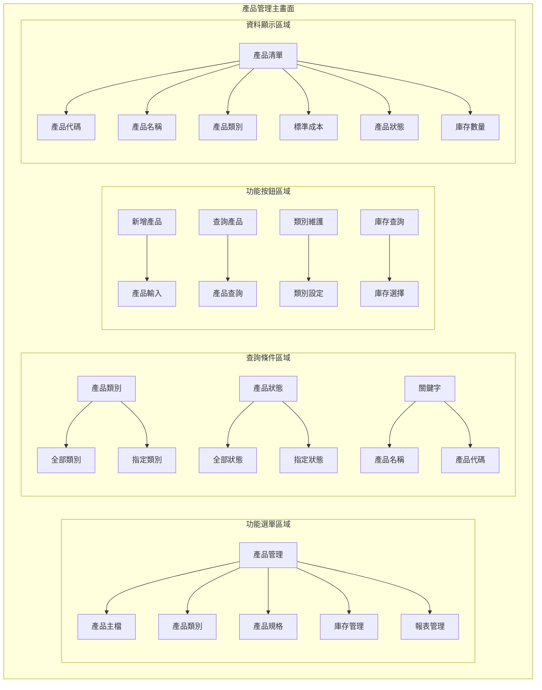

#### 4.1.2 主畫面詳細配置
```
┌─────────────────────────────────────────────────────────────┐
│                    產品管理系統 - 主畫面                      │
├─────────────────────────────────────────────────────────────┤
│ 功能選單區域                                                │
│ ┌─────────────────────────────────────────────────────────┐ │
│ │ [產品管理] [產品主檔] [產品類別] [產品規格] [庫存管理]   │ │
│ └─────────────────────────────────────────────────────────┘ │
├─────────────────────────────────────────────────────────────┤
│ 查詢條件區域                                                │
│ ┌─────────────────────────────────────────────────────────┐ │
│ │ 產品類別: [全部類別 ▼]    產品狀態: [全部狀態 ▼]        │ │
│ │ 關鍵字: [產品名稱 ▼] [                    ] [查詢]      │ │
│ └─────────────────────────────────────────────────────────┘ │
├─────────────────────────────────────────────────────────────┤
│ 功能按鈕區域                                                │
│ [新增產品] [查詢產品] [類別維護] [庫存查詢] [報表產生]    │
├─────────────────────────────────────────────────────────────┤
│ 產品資料顯示區域                                            │
│ ┌─────────────────────────────────────────────────────────┐ │
│ │ 產品代碼 │ 產品名稱 │ 產品類別 │ 標準成本 │ 狀態 │ 庫存數量 │
│ ├─────────────────────────────────────────────────────────┤ │
│ │ P001     │ 產品A   │ 電子類   │ 500      │ 有效 │ 100      │
│ │ P002     │ 產品B   │ 機械類   │ 800      │ 有效 │ 50       │
│ └─────────────────────────────────────────────────────────┘ │
└─────────────────────────────────────────────────────────────┘
```

#### 4.1.3 欄位說明
| 欄位標籤 | 欄位名稱 | 欄位類型 | 必填 | 預設值 | 說明 |
|----------|----------|----------|------|--------|------|
| 產品類別 | 產品類別 | 下拉選單 | 否 | 全部類別 | 選擇要查詢的產品類別 |
| 產品狀態 | 產品狀態 | 下拉選單 | 否 | 全部狀態 | 選擇要查詢的產品狀態 |
| 關鍵字 | 關鍵字 | 文字輸入框 | 否 | 空白 | 輸入產品名稱或代碼進行搜尋 |

### 4.2 產品輸入畫面布局

#### 4.2.1 產品輸入畫面配置圖

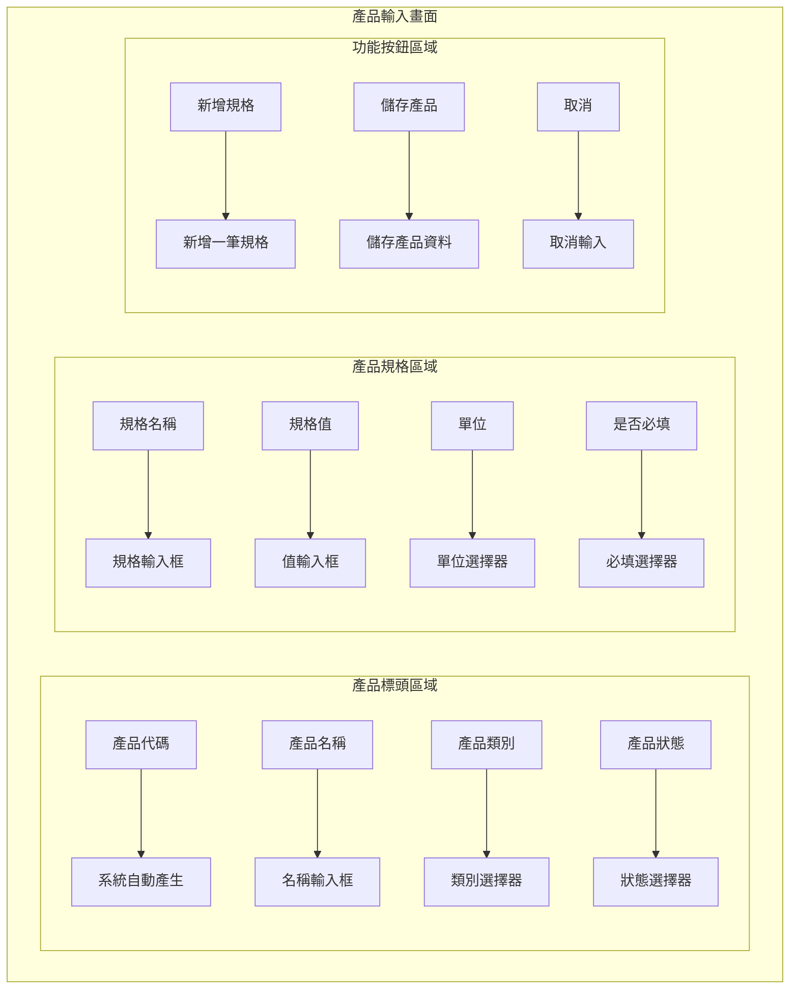

#### 4.2.2 產品輸入詳細配置
```
┌─────────────────────────────────────────────────────────────┐
│                    產品輸入 - 新增產品                      │
├─────────────────────────────────────────────────────────────┤
│ 產品標頭區域                                                │
│ ┌─────────────────────────────────────────────────────────┐ │
│ │ 產品代碼: [P001        ] (系統自動產生)                │ │
│ │ 產品名稱: [產品A                                    ] │ │
│ │ 產品類別: [電子類 ▼]    產品狀態: [有效 ▼]            │ │
│ │ 標準成本: [500.00    ]  標準售價: [800.00    ]        │ │
│ │ 最小庫存: [10         ]  最大庫存: [1000      ]        │
│ │ 安全庫存: [50         ]  庫存單位: [個 ▼]              │
│ └─────────────────────────────────────────────────────────┘ │
├─────────────────────────────────────────────────────────────┤
│ 產品規格區域                                                │
│ ┌─────────────────────────────────────────────────────────┐ │
│ │ 規格代碼 │ 規格名稱 │ 規格值 │ 單位 │ 必填 │ 排序 │ 備註 │
│ ├─────────────────────────────────────────────────────────┤ │
│ │  1       │ [顏色  ] │ [紅色 ] │ [個 ] │ [Y]  │ [1]  │ [    ] │
│ │  2       │ [尺寸  ] │ [大   ] │ [cm] │ [Y]  │ [2]  │ [    ] │
│ └─────────────────────────────────────────────────────────┘ │
├─────────────────────────────────────────────────────────────┤
│ 功能按鈕區域                                                │
│ [新增規格] [儲存產品] [取消]                              │
└─────────────────────────────────────────────────────────────┘
```

---

## 五、處理流程程序說明

### 5.1 產品管理主要處理流程

#### 5.1.1 產品新增流程圖

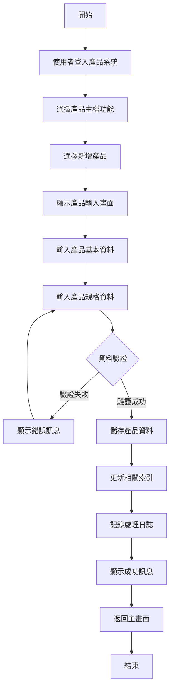

#### 5.1.2 產品類別管理流程圖

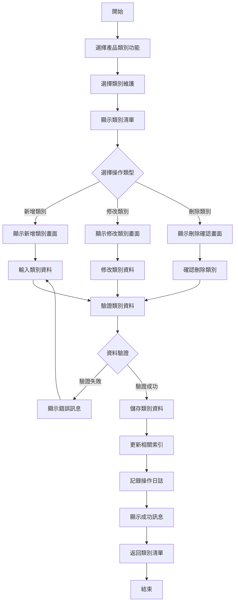

#### 5.1.3 庫存查詢流程圖

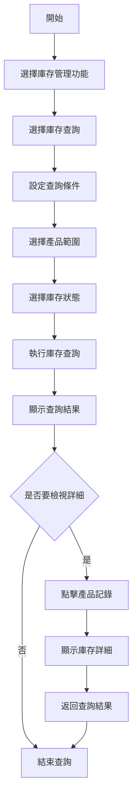

### 5.2 資料驗證流程

#### 5.2.1 產品資料驗證流程

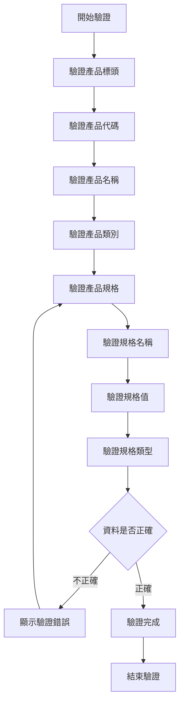

#### 5.2.2 欄位驗證規則
| 欄位名稱 | 驗證類型 | 驗證規則 | 錯誤訊息 |
|----------|----------|----------|----------|
| 產品代碼 | 唯一性驗證 | 產品代碼必須唯一 | 產品代碼已存在 |
| 產品名稱 | 長度驗證 | 產品名稱不能超過30字元 | 產品名稱長度超過限制 |
| 產品類別 | 存在性驗證 | 產品類別必須存在於類別檔中 | 產品類別不存在 |
| 標準成本 | 金額驗證 | 標準成本必須為正數 | 標準成本格式錯誤 |
| 規格名稱 | 長度驗證 | 規格名稱不能超過30字元 | 規格名稱長度超過限制 |

#### 5.2.3 業務邏輯驗證
| 驗證項目 | 驗證邏輯 | 錯誤訊息 |
|----------|----------|----------|
| 庫存數量 | 最小庫存 ≤ 安全庫存 ≤ 最大庫存 | 庫存數量設定不合理 |
| 產品價格 | 標準成本 ≤ 標準售價 | 標準售價不能低於標準成本 |
| 類別層級 | 類別層級必須符合層級規則 | 類別層級設定錯誤 |
| 規格必填 | 必填規格必須有值 | 必填規格不能為空 |

---

## 六、子程序處理邏輯說明

### 6.1 子程序清單
| 子程序名稱 | 子程序代號 | 功能說明 | 呼叫時機 |
|------------|------------|----------|----------|
| 產品代碼產生 | PT001 | 自動產生產品代碼 | 新增產品時 |
| 產品類別檢查 | PT002 | 檢查產品類別有效性 | 儲存產品前 |
| 產品規格驗證 | PT003 | 驗證產品規格資料 | 儲存產品前 |
| 庫存數量計算 | PT004 | 計算產品庫存數量 | 查詢庫存時 |
| 產品狀態更新 | PT005 | 更新產品狀態 | 產品維護時 |

### 6.2 子程序詳細說明

#### 6.2.1 產品代碼產生 (PT001)

**功能說明**：自動產生唯一的產品代碼，確保產品代碼的唯一性和連續性

**輸入參數**：
- 公司代碼 (COMPANY_CODE) - CHAR(3) - 公司代碼
- 產品類別 (PRODUCT_CATEGORY) - CHAR(3) - 產品類別

**輸出參數**：
- 產品代碼 (PRODUCT_CODE) - CHAR(5) - 產生的產品代碼
- 狀態碼 (STATUS) - CHAR(1) - 處理狀態：S成功，E失敗

**處理邏輯**：
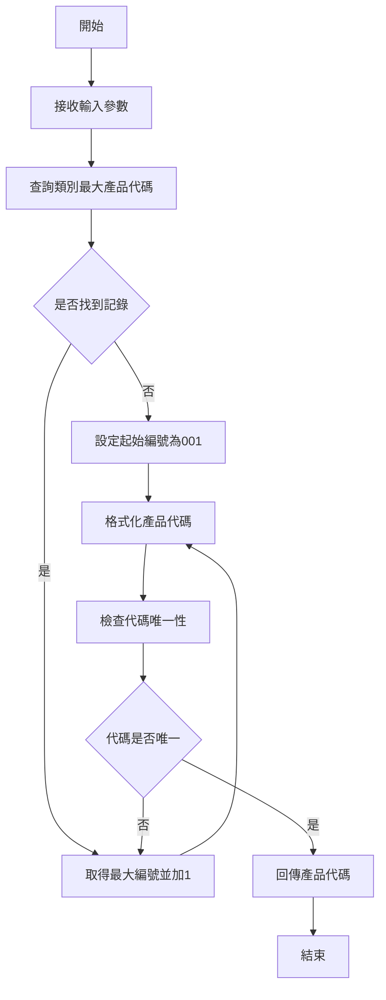

**錯誤處理**：
- 資料庫連線失敗：記錄錯誤日誌，回傳錯誤狀態
- 代碼重複：自動重新產生代碼
- 參數錯誤：回傳參數錯誤訊息

#### 6.2.2 產品類別檢查 (PT002)

**功能說明**：檢查產品類別的有效性和層級關係

**輸入參數**：
- 產品類別 (PRODUCT_CATEGORY) - CHAR(3) - 產品類別
- 上層類別 (PARENT_CATEGORY) - CHAR(3) - 上層類別

**輸出參數**：
- 檢查結果 (CHECK_RESULT) - CHAR(1) - 檢查結果：P通過，F失敗
- 錯誤訊息 (ERROR_MESSAGE) - VARCHAR(200) - 錯誤訊息內容

**處理邏輯**：
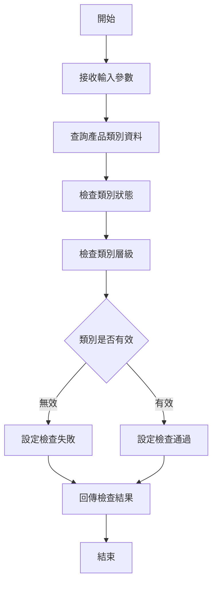

**錯誤處理**：
- 產品類別不存在：回傳類別不存在錯誤
- 類別狀態無效：回傳類別狀態錯誤
- 層級關係錯誤：回傳層級關係錯誤

#### 6.2.3 產品規格驗證 (PT003)

**功能說明**：驗證產品規格資料的完整性和正確性

**輸入參數**：
- 產品規格清單 (SPECIFICATION_LIST) - ARRAY - 產品規格資料陣列

**輸出參數**：
- 驗證結果 (VALIDATION_RESULT) - CHAR(1) - 驗證結果：P通過，F失敗
- 錯誤清單 (ERROR_LIST) - ARRAY - 錯誤訊息清單

**處理邏輯**：
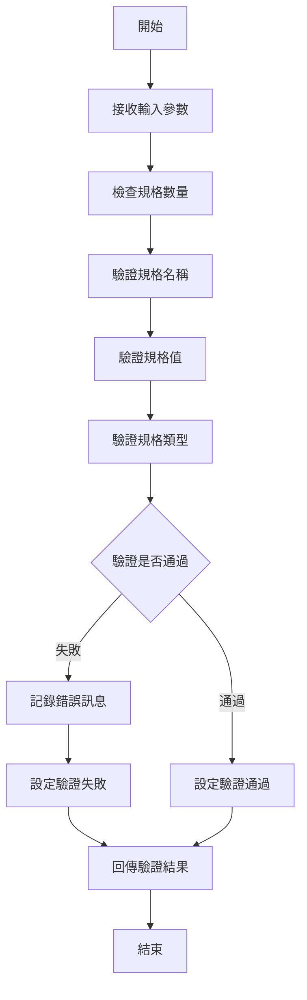

**錯誤處理**：
- 規格名稱重複：回傳名稱重複錯誤
- 規格值格式錯誤：回傳值格式錯誤
- 必填規格為空：回傳必填規格錯誤

---

## 七、錯誤處理程序說明與訊息清冊

### 7.1 錯誤處理流程

#### 7.1.1 錯誤處理架構圖

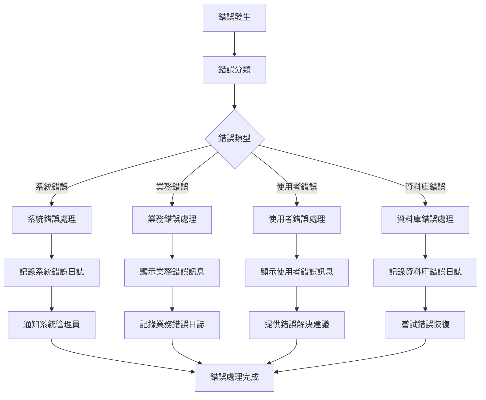

#### 7.1.2 錯誤處理策略
| 錯誤類型 | 處理策略 | 使用者通知 | 日誌記錄 |
|----------|----------|------------|----------|
| 系統錯誤 | 記錄錯誤日誌，通知管理員 | 顯示系統維護訊息 | 記錄詳細錯誤資訊 |
| 業務錯誤 | 顯示具體錯誤訊息，提供解決建議 | 顯示業務錯誤說明 | 記錄業務邏輯錯誤 |
| 使用者錯誤 | 顯示輸入錯誤，提供正確格式 | 顯示輸入格式說明 | 記錄使用者操作錯誤 |
| 資料庫錯誤 | 記錄資料庫錯誤，嘗試恢復 | 顯示系統忙碌訊息 | 記錄資料庫錯誤詳情 |

### 7.2 錯誤訊息清冊

#### 7.2.1 系統錯誤訊息
| 錯誤代碼 | 錯誤訊息 | 錯誤原因 | 解決方案 |
|----------|----------|----------|----------|
| PT001 | 系統連線失敗，請稍後再試 | 資料庫連線異常 | 檢查網路連線，聯絡系統管理員 |
| PT002 | 系統資源不足，請稍後再試 | 系統記憶體或CPU不足 | 等待系統負載降低，聯絡系統管理員 |
| PT003 | 系統維護中，請稍後再試 | 系統正在進行維護 | 等待維護完成，查看系統公告 |

#### 7.2.2 業務錯誤訊息
| 錯誤代碼 | 錯誤訊息 | 錯誤原因 | 解決方案 |
|----------|----------|----------|----------|
| PT101 | 產品代碼已存在，請使用其他代碼 | 輸入的產品代碼在系統中已存在 | 使用其他產品代碼，或聯絡管理員檢查 |
| PT102 | 產品類別不存在，請檢查類別代碼 | 選擇的產品類別在系統中不存在 | 選擇正確的產品類別，或聯絡管理員新增類別 |
| PT103 | 產品規格名稱重複，請使用其他名稱 | 同一產品中規格名稱重複 | 使用不同的規格名稱 |
| PT104 | 庫存數量設定不合理，請檢查數量 | 庫存數量設定不符合邏輯 | 調整庫存數量設定 |

#### 7.2.3 使用者錯誤訊息
| 錯誤代碼 | 錯誤訊息 | 錯誤原因 | 解決方案 |
|----------|----------|----------|----------|
| PT201 | 產品名稱長度超過限制，請縮短名稱 | 產品名稱超過30字元限制 | 縮短產品名稱至30字元以內 |
| PT202 | 標準成本格式錯誤，請輸入正確金額 | 標準成本輸入格式不正確 | 輸入正確的金額格式，如：500.00 |
| PT203 | 規格名稱不能為空，請輸入規格名稱 | 規格名稱為空 | 輸入規格名稱 |
| PT204 | 規格值格式錯誤，請檢查輸入格式 | 規格值格式不符合類型要求 | 根據規格類型輸入正確的格式 |

#### 7.2.4 資料庫錯誤訊息
| 錯誤代碼 | 錯誤訊息 | 錯誤原因 | 解決方案 |
|----------|----------|----------|----------|
| PT301 | 資料庫連線逾時，請稍後再試 | 資料庫連線超過時間限制 | 等待系統恢復，或聯絡系統管理員 |
| PT302 | 資料庫鎖定衝突，請稍後再試 | 資料被其他使用者鎖定 | 等待其他使用者完成操作，或聯絡系統管理員 |
| PT303 | 資料庫空間不足，無法儲存資料 | 資料庫磁碟空間不足 | 聯絡系統管理員清理資料庫空間 |
| PT304 | 資料庫索引損壞，請聯絡管理員 | 資料庫索引檔案損壞 | 立即聯絡系統管理員進行修復 |

---

## 八、備註

### 8.1 特殊說明
- **產品代碼規則**：產品代碼格式為 P + 4位序號，每年重新開始編號
- **類別代碼規則**：類別代碼為3位字元，按層級編碼
- **金額精度**：所有金額欄位支援到小數點後2位，超過部分自動四捨五入
- **數量精度**：所有數量欄位支援到小數點後2位，超過部分自動四捨五入

### 8.2 限制條件
- **產品數量限制**：每個公司每年最多可建立 99,999 個產品
- **類別數量限制**：每個公司最多可建立 999 個產品類別
- **規格數量限制**：每個產品最多可包含 999 筆規格
- **名稱長度限制**：產品名稱最多 30 個字元，規格名稱最多 30 個字元

### 8.3 未來擴充
- **產品圖片管理**：未來版本將支援產品圖片上傳和管理
- **產品版本控制**：未來版本將支援產品版本管理和追蹤
- **產品生命週期**：未來版本將支援產品生命週期管理
- **智慧產品推薦**：未來版本將整合 AI 技術，提供智慧化產品推薦

### 8.4 相關文件
- **產品模組操作手冊**：詳細的操作步驟和畫面說明
- **產品模組技術文件**：系統架構和技術實現細節
- **產品類別管理使用指南**：產品類別的設定和管理說明
- **庫存管理使用手冊**：庫存查詢和相關操作說明

---

## 九、文件修訂記錄

| 版本 | 修訂日期 | 修訂人員 | 修訂內容 | 修訂原因 |
|------|----------|----------|----------|----------|
| v1.0 | 2024/12/21 | 系統分析師 | 初始版本 | 文件建立 |

---

**文件建立日期**：2024年12月21日  
**最後更新日期**：2024年12月21日  
**文件狀態**：草稿  
**下次檢討日期**：2025年1月21日 