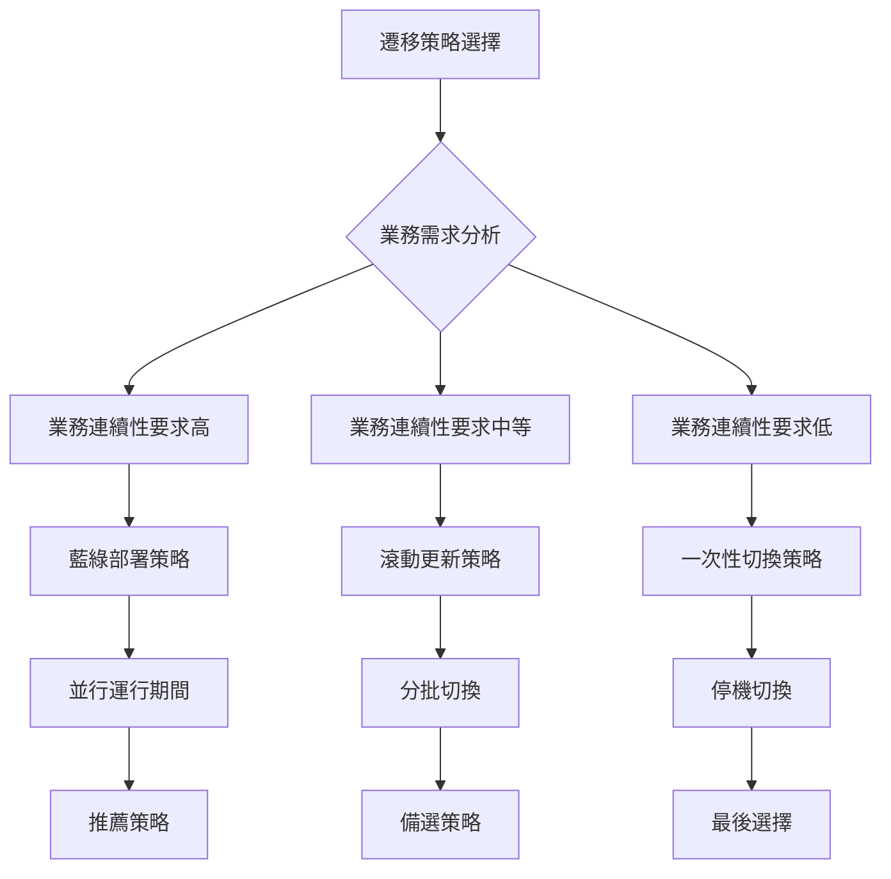
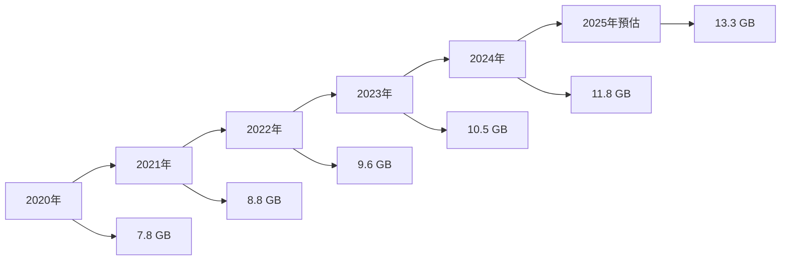
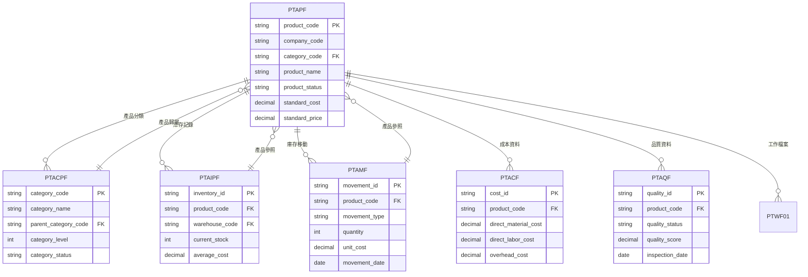
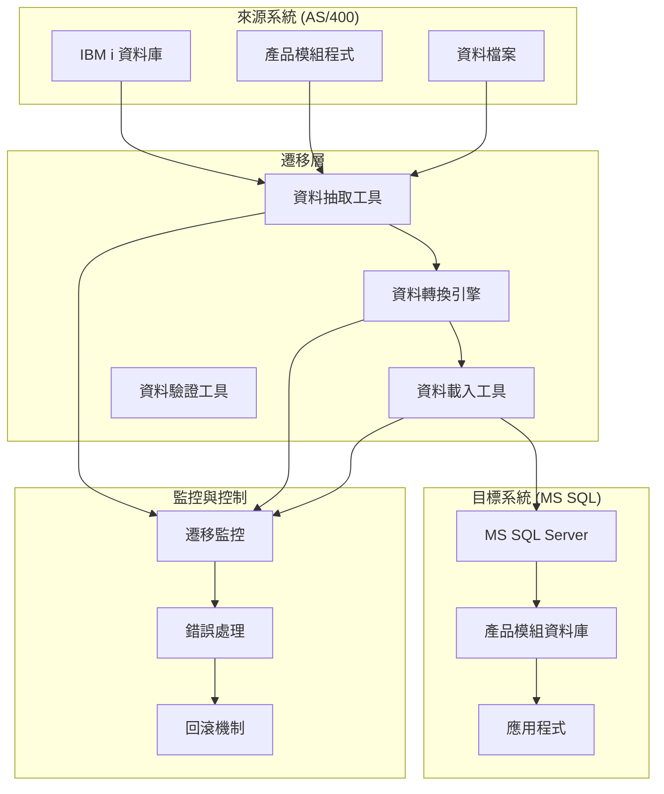
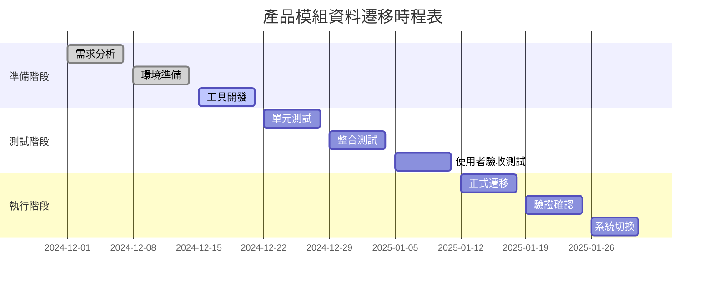
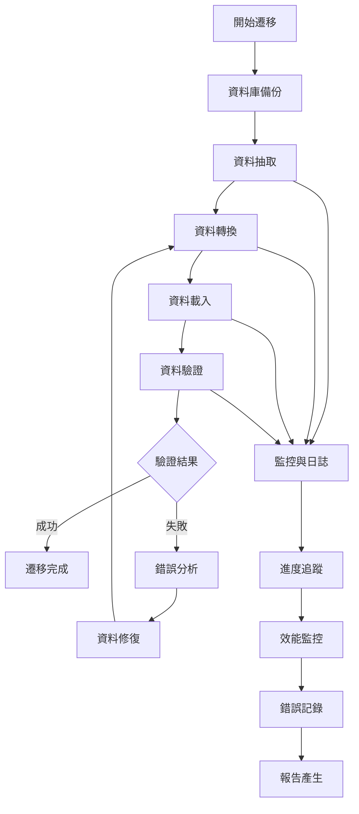
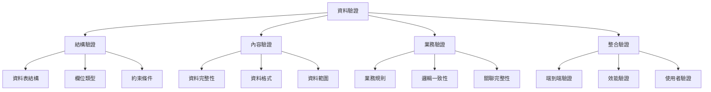
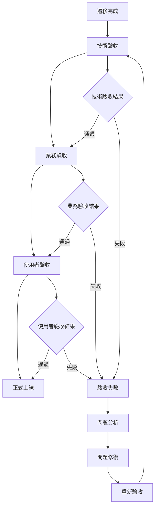

# 產品模組資料遷移策略文件

## 一、基本資訊

| 項目 | 說明 |
|------|------|
| **系統名稱** | 10.10.10.180 企業管理系統 |
| **模組名稱** | 產品模組 |
| **模組代號** | PT (Product) |
| **功能名稱** | 產品管理 |
| **功能代號** | PT001 |
| **撰寫人員** | 系統分析師 |
| **撰寫日期** | 2024/12/21 |
| **審核人員** | 專案經理 |
| **審核日期** | 2024/12/21 |
| **版本編號** | v1.0 |
| **文件類型** | 資料遷移策略 |
| **適用範圍** | 系統現代化轉型專案 |

---

## 二、遷移概述

### 2.1 遷移目標

#### 2.1.1 遷移範圍
- **來源系統**：IBM i (AS/400) 上的產品模組
- **目標系統**：C# .NET + MS SQL Server 的現代化產品系統
- **遷移資料**：產品主檔、產品分類、庫存資料、成本資料、品質資料等核心資料
- **遷移方式**：一次性完整遷移 + 增量同步

#### 2.1.2 遷移目標
- **資料完整性**：確保所有歷史產品資料完整遷移
- **資料一致性**：維持產品資料間的關聯性和完整性
- **業務連續性**：最小化業務中斷時間
- **資料品質**：提升產品資料品質和標準化程度

### 2.2 遷移策略

#### 2.2.1 遷移策略選擇



#### 2.2.2 推薦遷移策略：藍綠部署
- **優點**：業務連續性高、風險可控、可快速回滾
- **缺點**：資源需求高、成本較高
- **適用場景**：產品系統、業務連續性要求高的系統

---

## 三、資料分析與評估

### 3.1 資料量分析

#### 3.1.1 資料量統計

| 資料類型 | 預估記錄數 | 預估大小 | 增長率 | 說明 |
|----------|------------|----------|--------|------|
| **產品主檔 (PTAPF)** | 50,000 | 0.5 GB | 8%/年 | 包含所有產品資料 |
| **產品分類檔 (PTACPF)** | 2,000 | 0.1 GB | 5%/年 | 產品分類資料 |
| **庫存主檔 (PTAIPF)** | 150,000 | 1.5 GB | 12%/年 | 庫存記錄資料 |
| **庫存移動檔 (PTAMF)** | 1,500,000 | 6.0 GB | 15%/年 | 庫存移動記錄 |
| **成本資料檔 (PTACF)** | 100,000 | 1.0 GB | 10%/年 | 產品成本資料 |
| **品質資料檔 (PTAQF)** | 200,000 | 1.0 GB | 12%/年 | 產品品質資料 |
| **工作檔案 (PTWF01)** | 100,000 | 0.4 GB | 動態 | 處理中的暫存資料 |
| **總計** | **2,102,000** | **10.5 GB** | **12.5%/年** | **整體資料量** |

#### 3.1.2 資料增長趨勢



### 3.2 資料品質評估

#### 3.2.1 資料品質檢查項目

| 檢查項目 | 檢查內容 | 檢查方法 | 預期結果 |
|----------|----------|----------|----------|
| **資料完整性** | 必填欄位是否有值 | 資料庫查詢統計 | 完整率 > 99.5% |
| **資料一致性** | 產品分類是否有效 | 業務邏輯驗證 | 準確率 > 99.9% |
| **資料準確性** | 庫存數量是否正確 | 參照完整性檢查 | 準確率 > 99.9% |
| **資料時效性** | 資料是否為最新 | 時間戳記檢查 | 時效性 = 100% |

#### 3.2.2 資料品質問題識別

| 問題類型 | 問題描述 | 影響程度 | 解決方案 |
|----------|----------|----------|----------|
| **資料缺失** | 部分產品缺少分類資料 | 高 | 資料修復 + 驗證 |
| **資料重複** | 產品代碼重複 | 高 | 去重處理 + 重新編號 |
| **資料不一致** | 庫存數量與移動記錄不符 | 高 | 重新計算 + 調整 |
| **資料格式錯誤** | 規格資料格式不標準 | 中 | 格式轉換 + 驗證 |

### 3.3 資料依賴關係分析

#### 3.3.1 資料依賴圖



---

## 四、遷移架構設計

### 4.1 遷移架構圖

#### 4.1.1 整體遷移架構



### 4.2 遷移工具選擇

#### 4.2.1 遷移工具評估

| 工具名稱 | 類型 | 優點 | 缺點 | 適用場景 |
|----------|------|------|------|----------|
| **SQL Server Integration Services (SSIS)** | ETL 工具 | 功能強大、整合性好 | 學習曲線陡峭 | 企業級資料遷移 |
| **Azure Data Factory** | 雲端 ETL | 雲端原生、擴展性好 | 成本較高 | 雲端環境遷移 |
| **自訂 C# 程式** | 自開發 | 靈活性高、成本低 | 開發時間長 | 小規模遷移 |
| **第三方 ETL 工具** | 商業工具 | 功能完整、易用 | 授權成本高 | 複雜遷移需求 |

#### 4.2.2 推薦工具：SSIS + 自訂程式
- **SSIS**：處理標準化的資料抽取和載入
- **自訂程式**：處理複雜的業務邏輯轉換
- **組合優勢**：功能完整、成本可控、靈活性高

---

## 五、遷移執行計畫

### 5.1 遷移階段規劃

#### 5.1.1 遷移階段時間表



#### 5.1.2 詳細階段說明

| 階段 | 時間 | 主要活動 | 交付物 | 負責人 |
|------|------|----------|--------|--------|
| **準備階段** | 2024/12/01-21 | 需求分析、環境準備、工具開發 | 遷移工具、測試環境 | 系統分析師 |
| **測試階段** | 2024/12/22-2025/01/11 | 單元測試、整合測試、UAT | 測試報告、驗收確認 | 測試工程師 |
| **執行階段** | 2025/01/12-31 | 正式遷移、驗證確認、系統切換 | 遷移完成報告 | 專案經理 |

### 5.2 遷移執行步驟

#### 5.2.1 詳細執行步驟



#### 5.2.2 關鍵里程碑

| 里程碑 | 時間 | 完成標準 | 檢查項目 |
|--------|------|----------|----------|
| **M1: 工具開發完成** | 2024/12/21 | 遷移工具開發完成 | 功能測試通過 |
| **M2: 測試環境就緒** | 2024/12/28 | 測試環境搭建完成 | 環境驗收通過 |
| **M3: 測試完成** | 2025/01/11 | 所有測試通過 | 測試報告確認 |
| **M4: 遷移完成** | 2025/01/18 | 資料遷移完成 | 資料驗證通過 |
| **M5: 系統切換** | 2025/01/31 | 新系統正式上線 | 業務驗收通過 |

---

## 六、資料轉換規則

### 6.1 資料結構轉換

#### 6.1.1 資料表對應關係

| AS/400 檔案 | MS SQL 資料表 | 轉換說明 |
|-------------|----------------|----------|
| **PTAPF** | PT_Products | 產品主檔 |
| **PTACPF** | PT_ProductCategories | 產品分類 |
| **PTAIPF** | PT_Inventory | 庫存主檔 |
| **PTAMF** | PT_InventoryMovements | 庫存移動 |
| **PTACF** | PT_ProductCosts | 產品成本 |
| **PTAQF** | PT_ProductQuality | 產品品質 |
| **PTWF01** | PT_WorkFiles | 工作檔案 |

#### 6.1.2 欄位對應關係

##### 6.1.2.1 產品主檔轉換

| AS/400 欄位 | MS SQL 欄位 | 資料類型 | 轉換規則 | 說明 |
|-------------|-------------|----------|----------|------|
| **PT01** | CompanyCode | VARCHAR(3) | 直接對應 | 公司代碼 |
| **PT02** | ProductCode | VARCHAR(10) | 直接對應 | 產品代碼 |
| **PT03** | ProductName | NVARCHAR(100) | 編碼轉換 | 產品名稱 |
| **PT04** | CategoryCode | VARCHAR(10) | 直接對應 | 分類代碼 |
| **PT05** | ProductStatus | VARCHAR(1) | 狀態轉換 | 產品狀態 |
| **PT06** | StandardCost | DECIMAL(18,2) | 直接對應 | 標準成本 |
| **PT07** | StandardPrice | DECIMAL(18,2) | 直接對應 | 標準價格 |
| **PT08** | MinStock | INT | 直接對應 | 最小庫存 |
| **PT09** | MaxStock | INT | 直接對應 | 最大庫存 |
| **PT10** | SafetyStock | INT | 直接對應 | 安全庫存 |

##### 6.1.2.2 產品分類轉換

| AS/400 欄位 | MS SQL 欄位 | 資料類型 | 轉換規則 | 說明 |
|-------------|-------------|----------|----------|------|
| **AC01** | CategoryCode | VARCHAR(10) | 直接對應 | 分類代碼 |
| **AC02** | CategoryName | NVARCHAR(100) | 編碼轉換 | 分類名稱 |
| **AC03** | ParentCategoryCode | VARCHAR(10) | 直接對應 | 父分類代碼 |
| **AC04** | CategoryLevel | INT | 直接對應 | 分類層級 |
| **AC05** | CategoryStatus | VARCHAR(1) | 狀態轉換 | 分類狀態 |
| **AC06** | Description | NVARCHAR(500) | 編碼轉換 | 分類描述 |

### 6.2 資料轉換邏輯

#### 6.2.1 狀態碼轉換

| 原始狀態碼 | 新狀態碼 | 說明 |
|------------|----------|------|
| **A** | ACTIVE | 有效 |
| **D** | INACTIVE | 停用 |
| **P** | PENDING | 待處理 |
| **A** | APPROVED | 已核准 |
| **R** | REJECTED | 已拒絕 |
| **C** | COMPLETED | 已完成 |

#### 6.2.2 日期格式轉換

```sql
-- AS/400 日期格式轉換為 MS SQL 日期格式
-- 原始格式：YYYYMMDD (CHAR(8))
-- 目標格式：DATE

UPDATE PT_Products 
SET CreatedDate = CONVERT(DATE, 
    SUBSTRING(OriginalDate, 1, 4) + '-' + 
    SUBSTRING(OriginalDate, 5, 2) + '-' + 
    SUBSTRING(OriginalDate, 7, 2))
WHERE OriginalDate IS NOT NULL;
```

#### 6.2.3 金額格式轉換

```sql
-- AS/400 壓縮十進位轉換為 MS SQL DECIMAL
-- 原始格式：PACKED DECIMAL
-- 目標格式：DECIMAL(18,2)

UPDATE PT_Products 
SET StandardCost = CONVERT(DECIMAL(18,2), OriginalCost / 100),
    StandardPrice = CONVERT(DECIMAL(18,2), OriginalPrice / 100)
WHERE OriginalCost IS NOT NULL 
   OR OriginalPrice IS NOT NULL;
```

---

## 七、資料驗證策略

### 7.1 驗證方法

#### 7.1.1 驗證層級



### 7.2 驗證腳本

#### 7.2.1 資料完整性驗證

```sql
-- 驗證產品資料完整性
SELECT 
    'Product Count Check' AS CheckType,
    COUNT(*) AS SourceCount,
    (SELECT COUNT(*) FROM PT_Products) AS TargetCount,
    CASE 
        WHEN COUNT(*) = (SELECT COUNT(*) FROM PT_Products) 
        THEN 'PASS' 
        ELSE 'FAIL' 
    END AS Result
FROM PTAPF
WHERE PT05 = 'A'  -- 只檢查有效產品

UNION ALL

-- 驗證產品分類資料完整性
SELECT 
    'Category Count Check' AS CheckType,
    COUNT(*) AS SourceCount,
    (SELECT COUNT(*) FROM PT_ProductCategories) AS TargetCount,
    CASE 
        WHEN COUNT(*) = (SELECT COUNT(*) FROM PT_ProductCategories) 
        THEN 'PASS' 
        ELSE 'FAIL' 
    END AS Result
FROM PTACPF
WHERE AC05 = 'A'  -- 只檢查有效分類
```

#### 7.2.2 業務邏輯驗證

```sql
-- 驗證產品分類層級
SELECT 
    'Category Level Validation' AS CheckType,
    COUNT(*) AS InvalidLevels,
    CASE 
        WHEN COUNT(*) = 0 THEN 'PASS' 
        ELSE 'FAIL' 
    END AS Result
FROM (
    SELECT 
        c1.CategoryCode,
        c1.CategoryLevel,
        c2.CategoryLevel AS ParentLevel
    FROM PT_ProductCategories c1
    LEFT JOIN PT_ProductCategories c2 ON c1.ParentCategoryCode = c2.CategoryCode
    WHERE c1.ParentCategoryCode IS NOT NULL
      AND c1.CategoryLevel != c2.CategoryLevel + 1
) AS Invalid

-- 驗證庫存數量非負性
SELECT 
    'Inventory Non-Negative Check' AS CheckType,
    COUNT(*) AS NegativeStocks,
    CASE 
        WHEN COUNT(*) = 0 THEN 'PASS' 
        ELSE 'FAIL' 
    END AS Result
FROM PT_Inventory
WHERE CurrentStock < 0
```

---

## 八、風險管理與回滾策略

### 8.1 風險識別與評估

#### 8.1.1 主要風險清單

| 風險編號 | 風險描述 | 發生機率 | 影響程度 | 風險等級 | 應對策略 |
|----------|----------|----------|----------|----------|----------|
| **PT001** | 資料遷移失敗 | 中 | 高 | 高 | 完整備份 + 回滾機制 |
| **PT002** | 資料品質問題 | 中 | 中 | 中 | 資料驗證 + 修復流程 |
| **PT003** | 系統效能下降 | 低 | 中 | 中 | 效能測試 + 優化調整 |
| **PT004** | 業務中斷 | 低 | 高 | 高 | 藍綠部署 + 快速切換 |
| **PT005** | 資料遺失 | 低 | 高 | 高 | 多重備份 + 驗證確認 |

### 8.2 回滾策略

#### 8.2.1 回滾觸發條件

| 回滾條件 | 觸發時機 | 回滾範圍 | 回滾時間 |
|----------|----------|----------|----------|
| **資料完整性問題** | 資料驗證失敗 | 全部資料 | < 2 小時 |
| **系統效能問題** | 響應時間 > 5 秒 | 部分功能 | < 1 小時 |
| **業務邏輯錯誤** | 業務驗證失敗 | 相關模組 | < 4 小時 |
| **使用者體驗問題** | 使用者投訴 > 10% | 全部系統 | < 6 小時 |

---

## 九、監控與報告

### 9.1 遷移監控

#### 9.1.1 監控指標

| 監控類別 | 監控指標 | 監控頻率 | 警報閾值 | 監控工具 |
|----------|----------|----------|----------|----------|
| **進度監控** | 遷移進度百分比 | 每 5 分鐘 | < 80% | 自訂監控面板 |
| **效能監控** | 資料處理速度 | 每分鐘 | < 1000 筆/分鐘 | 效能監控工具 |
| **錯誤監控** | 錯誤發生次數 | 即時 | > 0 | 錯誤日誌系統 |
| **資源監控** | CPU、記憶體使用率 | 每分鐘 | > 80% | 系統監控工具 |

### 9.2 報告機制

#### 9.2.1 報告類型

| 報告類型 | 產生頻率 | 報告內容 | 接收對象 |
|----------|----------|----------|----------|
| **進度報告** | 每小時 | 遷移進度、完成狀態 | 專案團隊 |
| **狀態報告** | 每日 | 系統狀態、問題摘要 | 專案經理 |
| **品質報告** | 每階段 | 資料品質、驗證結果 | 品質保證團隊 |
| **總結報告** | 遷移完成 | 完整遷移總結 | 專案相關人員 |

---

## 十、成功標準與驗收

### 10.1 成功標準定義

#### 10.1.1 技術成功標準

| 標準類別 | 成功標準 | 驗證方法 | 驗證工具 |
|----------|----------|----------|----------|
| **資料完整性** | 資料遺失率 < 0.01% | 資料統計比對 | 資料驗證工具 |
| **資料準確性** | 資料錯誤率 < 0.1% | 業務邏輯驗證 | 業務驗證腳本 |
| **系統效能** | 響應時間 < 3 秒 | 效能測試 | 效能測試工具 |
| **系統穩定性** | 可用性 > 99.5% | 穩定性測試 | 監控工具 |

#### 10.1.2 業務成功標準

| 標準類別 | 成功標準 | 驗證方法 | 驗證工具 |
|----------|----------|----------|----------|
| **功能完整性** | 100% 業務功能正常 | 功能測試 | 測試案例 |
| **使用者體驗** | 使用者滿意度 > 90% | 使用者測試 | 問卷調查 |
| **業務連續性** | 業務中斷時間 < 4 小時 | 業務流程測試 | 業務驗證 |
| **資料一致性** | 業務邏輯 100% 符合 | 業務規則驗證 | 業務驗證腳本 |

### 10.2 驗收流程

#### 10.2.1 驗收階段



---

## 十一、修訂記錄

| 版本 | 修訂日期 | 修訂人員 | 修訂內容 | 修訂原因 |
|------|----------|----------|----------|----------|
| v1.0 | 2024/12/21 | 系統分析師 | 初始版本 | 文件建立 |

---

**文件建立日期**：2024年12月21日  
**最後更新日期**：2024年12月21日  
**文件狀態**：草稿  
**下次檢討日期**：2025年1月21日 