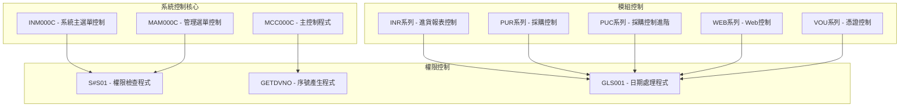
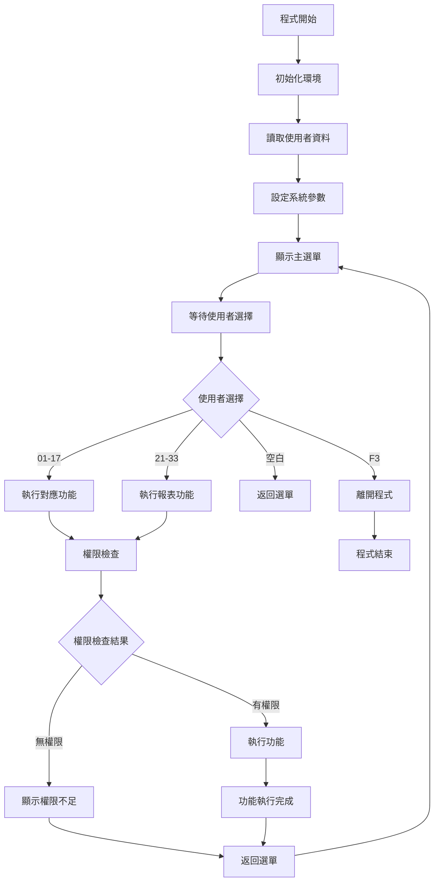
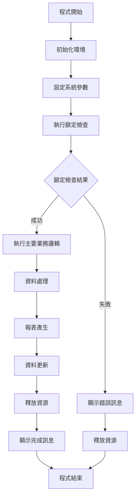
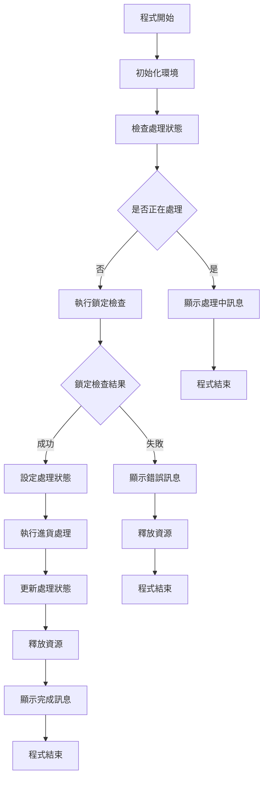
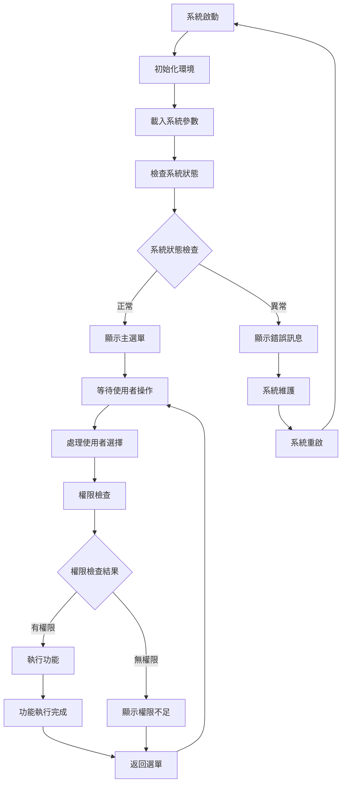
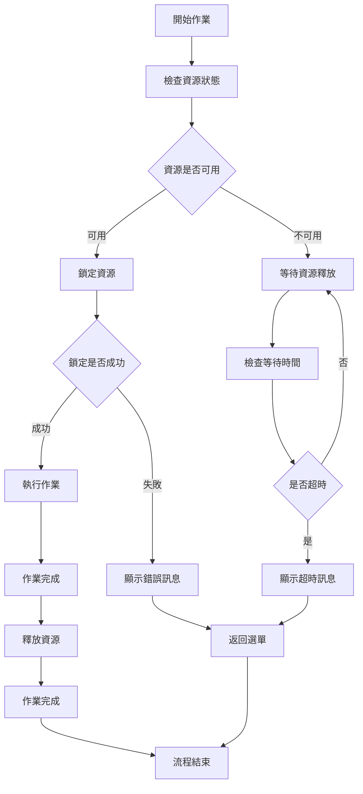
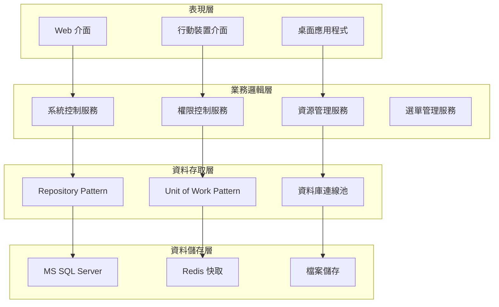

# 系統控制模組業務邏輯規格書 - CL程式分析

## 一、基本資訊

| 項目 | 說明 |
|------|------|
| **系統名稱** | 10.10.10.180 企業管理系統 |
| **模組名稱** | 系統控制模組 (System Control) |
| **模組代號** | SCP (System Control Program) |
| **功能名稱** | 系統控制與管理 |
| **功能代號** | SCP001 |
| **撰寫人員** | 系統分析師 |
| **撰寫日期** | 2024/12/21 |
| **審核人員** | 專案經理 |
| **審核日期** | 2024/12/21 |
| **版本編號** | v1.0 |
| **文件類型** | 業務邏輯規格書 - CL程式分析 |
| **適用範圍** | 系統現代化轉型專案 |

---

## 二、CL程式分析概述

### 2.1 程式目錄結構

#### 2.1.1 系統控制核心程式

| 程式代號 | 程式名稱 | 檔案大小 | 主要功能 |
|----------|----------|----------|----------|
| **INM000C** | 系統主選單控制 | 4.1KB | 系統主選單與權限控制 |
| **MAM000C** | 管理選單控制 | 4.1KB | 管理功能選單控制 |
| **MCC000C** | 主控制程式 | 4.1KB | 系統主要控制邏輯 |
| **INT006C** | 進貨控制程式 | 2.3KB | 進貨模組控制 |
| **INT007C** | 進貨控制程式2 | 2.3KB | 進貨模組控制進階版 |

#### 2.1.2 權限控制程式

| 程式代號 | 程式名稱 | 檔案大小 | 主要功能 |
|----------|----------|----------|----------|
| **S#S01** | 權限檢查程式 | - | 使用者權限驗證 |
| **GETDVNO** | 序號產生程式 | 339B | 序號自動產生 |
| **GLS001** | 日期處理程式 | 1.1KB | 日期格式處理 |

#### 2.1.3 模組控制程式

| 程式代號 | 程式名稱 | 檔案大小 | 主要功能 |
|----------|----------|----------|----------|
| **INR系列** | 進貨報表控制 | 1.3-2.3KB | 進貨相關報表控制 |
| **PUR系列** | 採購控制 | 1.9-6.3KB | 採購模組控制 |
| **PUC系列** | 採購控制進階 | 437B-4.1KB | 採購模組進階控制 |
| **WEB系列** | Web控制 | 446B-2.1KB | Web介面控制 |
| **VOU系列** | 憑證控制 | 1.8-5.8KB | 憑證模組控制 |

### 2.2 程式架構分析

#### 2.2.1 程式分類架構



---

## 三、核心業務邏輯分析

### 3.1 系統主選單控制業務邏輯 (INM000C)

#### 3.1.1 程式結構分析



#### 3.1.2 關鍵業務邏輯

##### 3.1.2.1 選單功能對應
```cl
* 選單功能對應邏輯
IF         COND(&DOPID *EQ '01') THEN(DO)
    CHGVAR VAR(&S0102I) VALUE('INT001')
ENDDO
IF         COND(&DOPID *EQ '02') THEN(DO)
    CHGVAR VAR(&S0102I) VALUE('INT002')
ENDDO
IF         COND(&DOPID *EQ '03') THEN(DO)
    CHGVAR VAR(&S0102I) VALUE('INT003')
ENDDO
IF         COND(&DOPID *EQ '04') THEN(DO)
    CHGVAR VAR(&S0102I) VALUE('INT008')
ENDDO
IF         COND(&DOPID *EQ '05') THEN(DO)
    CHGVAR VAR(&S0102I) VALUE('INT004')
ENDDO
IF         COND(&DOPID *EQ '06') THEN(DO)
    CHGVAR VAR(&S0102I) VALUE('INT005')
ENDDO
IF         COND(&DOPID *EQ '07') THEN(DO)
    CHGVAR VAR(&S0102I) VALUE('MCC666C')
ENDDO
IF         COND(&DOPID *EQ '08') THEN(DO)
    CHGVAR VAR(&S0102I) VALUE('INT007C')
ENDDO
IF         COND(&DOPID *EQ '10') THEN(DO)
    CHGVAR VAR(&S0102I) VALUE('PIMSC0C')
ENDDO
```

**業務邏輯說明**：
- **功能代碼對應**：根據使用者選擇的功能代碼，對應到具體的程式
- **模組化設計**：支援多種業務模組的功能選擇
- **彈性配置**：可以根據需求調整功能代碼對應

##### 3.1.2.2 權限控制邏輯
```cl
* 權限控制邏輯
CHKAUT:    CALL       PGM(S#S01) PARM(&S0101I &S0102I &S0101O)
IF         COND(&S0101O = 'Y') THEN(CALL PGM(&S0102I))
ELSE       CMD(CHGVAR VAR(&IN98) VALUE('1'))
GOTO       START
```

**業務邏輯說明**：
- **權限檢查**：呼叫權限檢查程式驗證使用者權限
- **條件執行**：只有通過權限檢查才能執行對應功能
- **錯誤處理**：權限不足時設定錯誤標記

### 3.2 主控制程式業務邏輯 (MCC000C)

#### 3.2.1 程式結構分析



#### 3.2.2 關鍵業務邏輯

##### 3.2.2.1 鎖定檢查機制
```cl
* 鎖定檢查機制
CHGVAR     VAR(&LCK) VALUE('1')
CALL       PGM(MCC000C1) PARM(&LCK &IN96)
IF         COND(&IN96 *EQ '1') THEN( GOTO CMDLBL(ERR) )
```

**業務邏輯說明**：
- **資源鎖定**：確保系統資源的獨占使用
- **衝突檢查**：避免多個作業同時存取相同資源
- **錯誤處理**：鎖定失敗時跳轉到錯誤處理

##### 3.2.2.2 主要業務邏輯執行
```cl
* 主要業務邏輯執行
CALL       PGM(MCC001) PARM(&WEH01)    * 清除 INTXPF 資料
CALL       PGM(MCC002) PARM(&WEH01)    * 從各模組匯入資料
CALL       PGM(MCC003) PARM(&WEH01)    * 更新 INTB 相關欄位
CALL       PGM(MCC004) PARM(&WEH01)    * 計算庫存相關數量
CALL       PGM(MCC005) PARM(&WEH01)    * 計算應付相關數量
CALL       PGM(MCC006) PARM(&WEH01)    * 計算庫存數量
CALL       PGM(MCC007) PARM(&WEH01)    * 更新庫存相關資料
CALL       PGM(MCC008) PARM(&WEH01)    * 計算庫存數量與應付
CALL       PGM(MCC009) PARM(&WEH01)    * 計算庫存數量與應付
CALL       PGM(MCC010) PARM(&WEH01)    * 計算庫存相關數量
CALL       PGM(MCC011) PARM(&WEH01)    * 計算庫存數量與應付
CALL       PGM(MCC012) PARM(&WEH01)    * 計算庫存相關數量
CALL       PGM(MCC013) PARM(&WEH01)    * 更新庫存相關資料
CALL       PGM(MCC014) PARM(&WEH01)    * 計算庫存數量
CALL       PGM(MCC015) PARM(&WEH01)    * 更新庫存相關資料
```

**業務邏輯說明**：
- **資料處理流程**：完整的資料處理和計算流程
- **模組化設計**：每個功能模組獨立，便於維護
- **順序執行**：確保資料處理的正確順序

### 3.3 進貨控制程式業務邏輯 (INT006C)

#### 3.3.1 程式結構分析



#### 3.3.2 關鍵業務邏輯

##### 3.3.2.1 處理狀態檢查
```cl
* 處理狀態檢查
RTVDTAARA  DTAARA(SCDA01 (2   1)) RTNVAR(&W#PROC)
IF         COND(&W#PROC *EQ '1') THEN(DO)
    SNDBRKMSG  MSG('進貨處理中，請稍後再試！') TOMSGQ(&JOB)
    RETURN
ENDDO
```

**業務邏輯說明**：
- **狀態檢查**：檢查系統是否正在處理進貨資料
- **衝突避免**：避免重複執行進貨處理
- **使用者通知**：及時通知使用者系統狀態

##### 3.3.2.2 資源鎖定機制
```cl
* 資源鎖定機制
CHGVAR     VAR(&LCK) VALUE('1')
CALL       PGM(INT006C2) PARM(&LCK &IN96)
IF         COND(&IN96 *EQ '1') THEN( GOTO CMDLBL(START) )
```

**業務邏輯說明**：
- **資源保護**：確保進貨處理期間資源不被其他作業佔用
- **重試機制**：鎖定失敗時自動重試
- **系統穩定性**：避免資料不一致的問題

---

## 四、業務規則提取

### 4.1 系統控制業務規則

| 規則編號 | 規則名稱 | 規則內容 | 實作位置 |
|----------|----------|----------|----------|
| **SCP001** | 選單功能對應 | 選單代碼必須對應到實際的程式 | INM000C 主程式 |
| **SCP002** | 權限控制 | 使用者必須有對應功能的權限 | INM000C CHKAUT |
| **SCP003** | 資源鎖定 | 重要作業必須先鎖定相關資源 | MCC000C 鎖定檢查 |
| **SCP004** | 狀態檢查 | 避免重複執行正在進行的作業 | INT006C 狀態檢查 |
| **SCP005** | 錯誤處理 | 統一的錯誤處理和資源釋放 | 各程式錯誤處理 |

### 4.2 權限控制業務規則

| 規則編號 | 規則名稱 | 規則內容 | 實作位置 |
|----------|----------|----------|----------|
| **SCP006** | 使用者驗證 | 必須驗證使用者的身份和權限 | S#S01 權限檢查 |
| **SCP007** | 功能權限 | 根據使用者權限控制功能可用性 | 各選單控制程式 |
| **SCP008** | 資料權限 | 根據使用者權限控制資料存取 | 各模組控制程式 |

### 4.3 系統管理業務規則

| 規則編號 | 規則名稱 | 規則內容 | 實作位置 |
|----------|----------|----------|----------|
| **SCP009** | 序號管理 | 自動產生和管理系統序號 | GETDVNO 序號產生 |
| **SCP010** | 日期處理 | 統一的日期格式處理和轉換 | GLS001 日期處理 |
| **SCP011** | 資源管理 | 統一的系統資源分配和釋放 | 各控制程式 |

---

## 五、資料結構分析

### 5.1 系統參數結構

#### 5.1.1 本地資料區 (LDA) 結構

| 欄位位置 | 欄位名稱 | 長度 | 說明 |
|----------|----------|------|------|
| 101-110 | $USER | 10 | 使用者代碼 |
| 119-124 | $EGMDY | 6 | 系統日期 |
| 125-127 | $CPY | 3 | 公司代碼 |
| 162 | $EVR | 1 | 環境標記 |
| 598-599 | $PRTID | 2 | 印表機識別碼 |
| 600 | $DOWNL | 1 | 下載標記 |
| 601-100 | 選單參數 | 100 | 選單相關參數 |

#### 5.1.2 資料區 (Data Area) 結構

| 資料區名稱 | 用途 | 結構說明 |
|------------|------|----------|
| **SCDA01** | 系統控制資料 | 包含處理狀態、鎖定標記等 |
| **DVNDNO** | 序號資料 | 包含序號計數和格式 |

### 5.2 參數傳遞結構

#### 5.2.1 程式呼叫參數

```cl
* 程式呼叫參數結構
CALL       PGM(S#S01) PARM(&S0101I &S0102I &S0101O)
* S0101I: 使用者代碼 (10位)
* S0102I: 功能代碼 (10位)
* S0101O: 權限結果 (1位，Y=有權限，N=無權限)
```

#### 5.2.2 鎖定檢查參數

```cl
* 鎖定檢查參數結構
CALL       PGM(INT006C2) PARM(&LCK &IN96)
* LCK: 鎖定標記 (1位，1=鎖定，空白=釋放)
* IN96: 鎖定結果 (1位，1=失敗，0=成功)
```

---

## 六、業務流程分析

### 6.1 系統啟動流程

#### 6.1.1 系統啟動生命週期



#### 6.1.2 選單處理流程

| 步驟 | 步驟名稱 | 步驟說明 | 對應程式 |
|------|----------|----------|----------|
| **1** | 選單顯示 | 顯示系統主選單 | INM000C 主程式 |
| **2** | 使用者選擇 | 使用者選擇功能選項 | INM000C 主程式 |
| **3** | 功能對應 | 將選單代碼對應到程式 | INM000C 主程式 |
| **4** | 權限檢查 | 檢查使用者是否有權限 | S#S01 權限檢查 |
| **5** | 功能執行 | 執行對應的功能程式 | 各功能程式 |
| **6** | 結果返回 | 返回選單等待下次選擇 | INM000C 主程式 |

### 6.2 資源管理流程

#### 6.2.1 資源鎖定流程



---

## 七、錯誤處理分析

### 7.1 錯誤代碼體系

#### 7.1.1 系統控制錯誤代碼

| 錯誤代碼 | 錯誤訊息 | 錯誤類型 | 處理方式 |
|----------|----------|----------|----------|
| **CPF1002** | 物件已被其他作業使用 | 資源衝突錯誤 | 等待資源釋放 |
| **CPF9801** | 物件不存在 | 物件錯誤 | 建立物件 |
| **IWS4010** | PC連線錯誤 | 連線錯誤 | 檢查網路連線 |

#### 7.1.2 錯誤處理機制

```cl
* 錯誤處理實作範例
ALCOBJ     OBJ((*LIBL/INTAPF *FILE *EXCL)) WAIT(0)
MONMSG     MSGID(CPF1002) EXEC(DO)
    CHGVAR VAR(&IN96) VALUE('1')
    GOTO  CMDLBL(RLSOBJ)
ENDDO
```

**業務邏輯說明**：
- **錯誤監控**：使用MONMSG監控特定錯誤訊息
- **錯誤處理**：設定錯誤標記並跳轉到錯誤處理
- **資源釋放**：確保錯誤發生時正確釋放資源

---

## 八、現代化轉型建議

### 8.1 架構轉型建議

#### 8.1.1 分層架構設計



#### 8.1.2 服務導向架構

| 服務名稱 | 服務職責 | 對應CL程式 | 轉換策略 |
|----------|----------|-------------|----------|
| **系統控制服務** | 系統啟動和關閉 | INM000C | 重構為C#服務 |
| **權限控制服務** | 使用者權限驗證 | S#S01 | 重構為C#服務 |
| **資源管理服務** | 系統資源分配 | 各控制程式 | 重構為C#服務 |
| **選單管理服務** | 系統選單控制 | 各選單程式 | 重構為C#服務 |

### 8.2 技術轉換建議

#### 8.2.1 程式語言轉換

| CL 結構 | C# 對應 | 轉換說明 |
|---------|----------|----------|
| **主程式** | Main Program | 使用 Program.cs 作為程式進入點 |
| **條件判斷** | If-Else Statements | 將 CL 條件判斷轉換為 C# 語法 |
| **程式呼叫** | Method Calls | 將 CL 程式呼叫轉換為 C# 方法呼叫 |
| **錯誤處理** | Exception Handling | 使用 C# 例外處理機制 |
| **資源管理** | Using Statements | 使用 C# 資源管理機制 |

#### 8.2.2 資料庫轉換

| AS/400 檔案 | MS SQL 資料表 | 轉換說明 |
|-------------|----------------|----------|
| **SCDA01** | SCP_SystemControl | 系統控制資料 |
| **DVNDNO** | SCP_SequenceNumbers | 序號管理資料 |

### 8.3 業務邏輯轉換建議

#### 8.3.1 系統控制服務轉換

```csharp
// 系統控制服務
public class SystemControlService : ISystemControlService
{
    public async Task<MenuResult> ProcessMenuSelectionAsync(MenuRequest request)
    {
        var result = new MenuResult();
        
        // 權限檢查
        var hasPermission = await _permissionService.CheckPermissionAsync(
            request.UserId, request.FunctionCode);
            
        if (!hasPermission)
        {
            result.Success = false;
            result.Message = "權限不足";
            return result;
        }
        
        // 功能對應
        var functionCode = MapFunctionCode(request.MenuCode);
        
        // 執行功能
        result = await ExecuteFunctionAsync(functionCode, request.Parameters);
        
        return result;
    }
    
    private string MapFunctionCode(string menuCode)
    {
        return menuCode switch
        {
            "01" => "INT001",
            "02" => "INT002",
            "03" => "INT003",
            "04" => "INT008",
            "05" => "INT004",
            "06" => "INT005",
            "07" => "MCC666C",
            "08" => "INT007C",
            "10" => "PIMSC0C",
            _ => throw new ArgumentException($"無效的選單代碼: {menuCode}")
        };
    }
}
```

#### 8.3.2 權限控制服務轉換

```csharp
// 權限控制服務
public class PermissionService : IPermissionService
{
    public async Task<bool> CheckPermissionAsync(string userId, string functionCode)
    {
        var user = await _userRepository.GetByIdAsync(userId);
        if (user == null)
            return false;
            
        var permission = await _permissionRepository
            .GetByUserAndFunctionAsync(userId, functionCode);
            
        return permission?.IsActive == true;
    }
    
    public async Task<IEnumerable<string>> GetUserPermissionsAsync(string userId)
    {
        var permissions = await _permissionRepository
            .GetByUserIdAsync(userId);
            
        return permissions
            .Where(p => p.IsActive)
            .Select(p => p.FunctionCode);
    }
}
```

#### 8.3.3 資源管理服務轉換

```csharp
// 資源管理服務
public class ResourceManagementService : IResourceManagementService
{
    public async Task<ResourceLockResult> LockResourceAsync(string resourceId, string userId)
    {
        try
        {
            var resource = await _resourceRepository.GetByIdAsync(resourceId);
            if (resource == null)
                throw new NotFoundException($"Resource {resourceId} not found");
                
            if (resource.IsLocked)
                return new ResourceLockResult 
                { 
                    Success = false, 
                    Message = "資源已被鎖定" 
                };
                
            resource.Lock(userId);
            await _resourceRepository.UpdateAsync(resource);
            await _unitOfWork.SaveChangesAsync();
            
            return new ResourceLockResult { Success = true };
        }
        catch (Exception ex)
        {
            _logger.LogError(ex, "Error locking resource {ResourceId}", resourceId);
            throw;
        }
    }
    
    public async Task ReleaseResourceAsync(string resourceId, string userId)
    {
        var resource = await _resourceRepository.GetByIdAsync(resourceId);
        if (resource != null && resource.LockedBy == userId)
        {
            resource.Release();
            await _resourceRepository.UpdateAsync(resource);
            await _unitOfWork.SaveChangesAsync();
        }
    }
}
```

---

## 九、總結與建議

### 9.1 業務邏輯分析總結

#### 9.1.1 核心業務邏輯

1. **系統控制邏輯**：完整的系統啟動、選單管理和權限控制
2. **資源管理邏輯**：嚴格的資源鎖定和釋放機制
3. **權限控制邏輯**：多層次的權限驗證和功能控制
4. **錯誤處理邏輯**：統一的錯誤處理和資源釋放機制

#### 9.1.2 技術特點

1. **模組化設計**：清晰的程式模組劃分和職責分離
2. **資源保護**：完善的資源鎖定和衝突避免機制
3. **權限管理**：嚴格的權限控制和功能限制
4. **錯誤處理**：統一的錯誤代碼和處理流程

### 9.2 現代化轉型建議

#### 9.2.1 短期目標

1. **業務邏輯提取**：完整提取現有系統控制邏輯
2. **架構分析**：分析現有系統架構和模組關係
3. **介面設計**：設計現代化的系統控制介面

#### 9.2.2 中期目標

1. **服務重構**：將系統控制邏輯重構為現代化服務
2. **權限系統**：建立現代化的權限管理系統
3. **資源管理**：實現現代化的資源管理機制

#### 9.2.3 長期目標

1. **系統現代化**：完成整個系統控制模組的現代化轉型
2. **效能提升**：提升系統控制效能和可擴展性
3. **維護簡化**：簡化系統控制維護和升級流程

### 9.3 風險控制建議

#### 9.3.1 技術風險

1. **權限轉換風險**：建立完整的權限驗證機制
2. **功能遺失風險**：確保所有系統控制功能完整轉換
3. **效能風險**：進行充分的系統控制效能測試

#### 9.3.2 業務風險

1. **系統中斷風險**：採用漸進式系統控制轉換策略
2. **權限混亂風險**：建立權限一致性檢查機制
3. **使用者適應風險**：提供充分的系統控制培訓和支援

---

## 十、修訂記錄

| 版本 | 修訂日期 | 修訂人員 | 修訂內容 | 修訂原因 |
|------|----------|----------|----------|----------|
| v1.0 | 2024/12/21 | 系統分析師 | 初始版本 | 文件建立 |

---

**文件建立日期**：2024年12月21日  
**最後更新日期**：2024年12月21日  
**文件狀態**：草稿  
**下次檢討日期**：2025年1月21日 