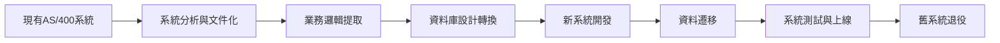
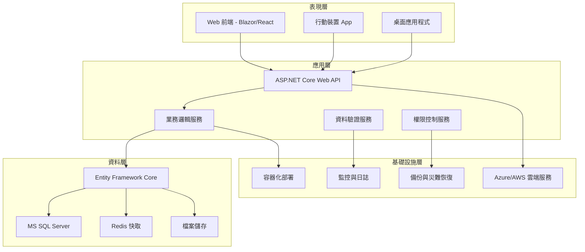
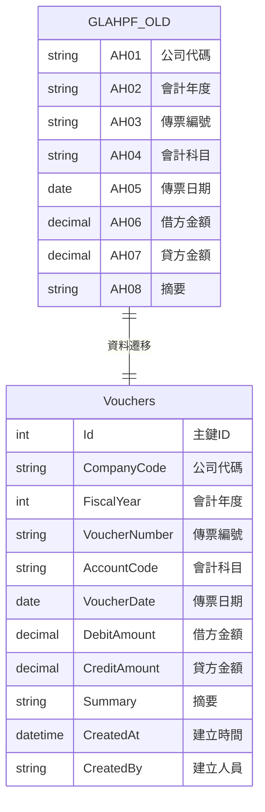

# 系統現代化轉型策略

## 一、專案背景與目標

### 1.1 專案背景
- **現有系統**：10.10.180 企業管理系統 (IBM i AS/400)
- **技術架構**：RPG/CL + DB2 for i + 終端機介面
- **系統年齡**：多年運行的企業級系統
- **業務價值**：核心業務流程，資料完整性高

### 1.2 轉型目標
- **技術現代化**：從 AS/400 轉型到 C# .NET 平台
- **架構現代化**：採用 MVC 架構，提升可維護性
- **資料庫現代化**：從 DB2 for i 轉型到 MS SQL Server
- **介面現代化**：從終端機介面轉型到 Web 介面

### 1.3 轉型效益
- **維護成本降低**：現代化技術棧，人才易得
- **擴展性提升**：雲端部署，水平擴展能力
- **使用者體驗改善**：Web 介面，行動裝置支援
- **整合能力增強**：標準化 API，第三方系統整合

---

## 二、轉型策略與路徑

### 2.1 轉型策略


### 2.2 轉型路徑選擇

#### 2.2.1 路徑A：完全重寫 (推薦)
- **優點**：技術架構最現代化，長期維護成本最低
- **缺點**：開發時間較長，初期投資較大
- **適用性**：業務邏輯相對穩定，有足夠的開發時間

#### 2.2.2 路徑B：漸進式轉換
- **優點**：風險較低，可以分階段驗證
- **缺點**：技術債務較多，維護複雜度增加
- **適用性**：業務邏輯複雜，需要降低轉型風險

#### 2.2.3 路徑C：混合架構
- **優點**：轉型風險最低，可以保留核心功能
- **缺點**：技術架構複雜，長期維護困難
- **適用性**：作為過渡方案，不建議長期使用

### 2.3 推薦轉型路徑：完全重寫
基於專案分析，推薦採用**完全重寫**的轉型路徑：

1. **第一階段**：系統分析與文件化 (已完成80%)
2. **第二階段**：業務邏輯提取與設計 (2025年1-3月)
3. **第三階段**：新系統開發 (2025年4-12月)
4. **第四階段**：資料遷移與測試 (2026年1-3月)
5. **第五階段**：系統上線與舊系統退役 (2026年4月)

---

## 三、技術架構設計

### 3.1 新系統技術架構

#### 3.1.1 整體架構圖


#### 3.1.2 技術棧選擇
| 層級 | 技術選擇 | 版本 | 說明 |
|------|----------|------|------|
| **前端** | Blazor Server | .NET 8 | 現代化 Web 介面，支援即時更新 |
| **後端** | ASP.NET Core | .NET 8 | 高效能 Web API 框架 |
| **資料庫** | MS SQL Server | 2022 | 企業級關聯式資料庫 |
| **ORM** | Entity Framework Core | 8.0 | 物件關聯對應框架 |
| **快取** | Redis | 7.0 | 高效能記憶體快取 |
| **部署** | Docker + Kubernetes | 最新 | 容器化部署，支援雲端擴展 |

### 3.2 資料庫設計轉換

#### 3.2.1 資料庫轉換策略


#### 3.2.2 資料庫轉換對照表
| AS/400 欄位 | MS SQL 欄位 | 資料型別 | 說明 |
|-------------|-------------|----------|------|
| AH01 | CompanyCode | NVARCHAR(3) | 公司代碼，保持原有格式 |
| AH02 | FiscalYear | INT | 會計年度，轉換為整數型別 |
| AH03 | VoucherNumber | NVARCHAR(8) | 傳票編號，保持原有格式 |
| AH04 | AccountCode | NVARCHAR(5) | 會計科目，保持原有格式 |
| AH05 | VoucherDate | DATE | 傳票日期，轉換為標準日期型別 |
| AH06 | DebitAmount | DECIMAL(12,2) | 借方金額，提升精度 |
| AH07 | CreditAmount | DECIMAL(12,2) | 貸方金額，提升精度 |
| AH08 | Summary | NVARCHAR(100) | 摘要，擴展長度支援中文 |

### 3.3 業務邏輯轉換

#### 3.3.1 業務邏輯提取策略
1. **分析現有 RPG 程式**：提取核心業務邏輯
2. **建立業務服務層**：將業務邏輯封裝為服務
3. **設計 API 介面**：定義標準化的 API 介面
4. **實作資料驗證**：使用現代化的驗證框架

#### 3.3.2 業務邏輯轉換範例

**現有 RPG 邏輯 (傳票借貸平衡檢查)**：
```rpgle
C                   IF        TotalDebit <> TotalCredit
C                   EVAL      ErrorMsg = '借貸不平衡'
C                   EVAL      *INLR = *ON
C                   RETURN
C                   ENDIF
```

**新 C# 邏輯**：
```csharp
public class VoucherValidationService
{
    public ValidationResult ValidateDebitCreditBalance(Voucher voucher)
    {
        var totalDebit = voucher.Details.Sum(d => d.DebitAmount);
        var totalCredit = voucher.Details.Sum(d => d.CreditAmount);
        
        if (Math.Abs(totalDebit - totalCredit) > 0.01m)
        {
            return ValidationResult.Failure(
                "傳票借貸不平衡，請檢查金額");
        }
        
        return ValidationResult.Success();
    }
}
```

---

## 四、轉型實施計畫

### 4.1 第一階段：系統分析與文件化 (2024年12月 - 2025年1月)

#### 4.1.1 已完成項目
- ✅ 建立文件範本體系
- ✅ 完成總帳模組文件
- ✅ 建立專案管理規範

#### 4.1.2 進行中項目
- 🔄 完成其他模組文件 (銷貨、採購、產品)
- 🔄 建立系統整合文件
- 🔄 建立資料庫設計文件

#### 4.1.3 新增項目
- [ ] 建立業務邏輯分析文件
- [ ] 建立 API 設計文件
- [ ] 建立資料遷移策略文件

### 4.2 第二階段：業務邏輯提取與設計 (2025年2月 - 3月)

#### 4.2.1 業務邏輯分析
- [ ] 分析現有 RPG 程式的業務邏輯
- [ ] 建立業務流程圖和狀態圖
- [ ] 識別核心業務規則和驗證邏輯
- [ ] 建立業務邏輯規格書

#### 4.2.2 新系統設計
- [ ] 設計新的系統架構
- [ ] 設計資料庫結構
- [ ] 設計 API 介面
- [ ] 設計使用者介面原型

### 4.3 第三階段：新系統開發 (2025年4月 - 12月)

#### 4.3.1 開發環境建立
- [ ] 建立開發環境和工具
- [ ] 建立專案結構和範本
- [ ] 建立開發規範和標準
- [ ] 建立測試環境

#### 4.3.2 核心功能開發
- [ ] 開發資料存取層 (Entity Framework)
- [ ] 開發業務邏輯服務
- [ ] 開發 Web API 介面
- [ ] 開發使用者介面

#### 4.3.3 模組開發順序
1. **總帳模組**：核心會計功能
2. **銷貨模組**：客戶管理和訂單處理
3. **採購模組**：供應商管理和採購流程
4. **產品模組**：產品管理和庫存控制
5. **報表模組**：各種業務報表

### 4.4 第四階段：資料遷移與測試 (2026年1月 - 3月)

#### 4.4.1 資料遷移
- [ ] 設計資料遷移腳本
- [ ] 執行資料遷移測試
- [ ] 驗證資料完整性
- [ ] 執行正式資料遷移

#### 4.4.2 系統測試
- [ ] 單元測試
- [ ] 整合測試
- [ ] 系統測試
- [ ] 使用者驗收測試

### 4.5 第五階段：系統上線與舊系統退役 (2026年4月)

#### 4.5.1 系統上線
- [ ] 部署新系統到生產環境
- [ ] 執行資料遷移
- [ ] 啟動新系統
- [ ] 監控系統運行狀況

#### 4.5.2 舊系統退役
- [ ] 確認新系統穩定運行
- [ ] 備份舊系統資料
- [ ] 停用舊系統
- [ ] 清理舊系統資源

---

## 五、風險管理與對策

### 5.1 主要風險

#### 5.1.1 技術風險
- **風險描述**：新技術棧的學習曲線和技術挑戰
- **風險等級**：高
- **對策**：加強技術培訓，建立技術專家團隊

#### 5.1.2 業務風險
- **風險描述**：業務邏輯轉換過程中可能遺漏重要功能
- **風險等級**：中
- **對策**：詳細的業務邏輯分析，建立完整的測試案例

#### 5.1.3 資料風險
- **風險描述**：資料遷移過程中可能遺失或損壞資料
- **風險等級**：高
- **對策**：建立完整的資料備份和驗證機制

#### 5.1.4 時程風險
- **風險描述**：轉型專案時程較長，可能影響業務運作
- **風險等級**：中
- **對策**：分階段實施，建立緩衝時間

### 5.2 風險控制措施

#### 5.2.1 技術風險控制
- 建立技術專家團隊
- 加強技術培訓和知識轉移
- 建立技術問題解決機制
- 定期進行技術評估和調整

#### 5.2.2 業務風險控制
- 建立完整的業務邏輯分析流程
- 建立業務專家審查機制
- 建立完整的測試案例
- 建立業務驗收標準

#### 5.2.3 資料風險控制
- 建立完整的資料備份策略
- 建立資料遷移驗證機制
- 建立資料完整性檢查工具
- 建立資料恢復計畫

---

## 六、資源需求與預算

### 6.1 人力資源需求

#### 6.1.1 核心團隊
| 角色 | 人數 | 技能要求 | 工作期間 |
|------|------|----------|----------|
| 專案經理 | 1 | 專案管理、系統分析 | 全程 |
| 系統分析師 | 2 | 業務分析、系統設計 | 全程 |
| 架構師 | 1 | 系統架構、技術選型 | 全程 |
| 資深開發工程師 | 3 | C# .NET、Web開發 | 開發階段 |
| 資料庫工程師 | 2 | MS SQL Server、資料遷移 | 全程 |
| 測試工程師 | 2 | 系統測試、自動化測試 | 測試階段 |
| 業務專家 | 2 | 會計、業務流程 | 分析階段 |

#### 6.1.2 支援團隊
| 角色 | 人數 | 技能要求 | 工作期間 |
|------|------|----------|----------|
| 技術支援 | 1 | 系統維護、問題解決 | 全程 |
| 使用者代表 | 3 | 業務操作、需求確認 | 全程 |
| 品質保證 | 1 | 品質控制、流程管理 | 全程 |

### 6.2 技術資源需求

#### 6.2.1 開發環境
- **開發工具**：Visual Studio 2022、SQL Server Management Studio
- **版本控制**：Git、Azure DevOps
- **專案管理**：Azure DevOps、Jira
- **測試工具**：NUnit、Selenium、Postman

#### 6.2.2 測試環境
- **測試資料庫**：MS SQL Server 2022
- **測試伺服器**：Windows Server 2022
- **負載測試**：JMeter、LoadRunner
- **監控工具**：Application Insights、Log Analytics

#### 6.2.3 生產環境
- **應用伺服器**：Azure App Service 或 AWS EC2
- **資料庫伺服器**：Azure SQL Database 或 AWS RDS
- **負載平衡器**：Azure Load Balancer 或 AWS ALB
- **監控服務**：Azure Monitor 或 AWS CloudWatch

### 6.3 預算估算

#### 6.3.1 人力成本
| 階段 | 人力成本 (萬元) | 說明 |
|------|----------------|------|
| 第一階段 | 50 | 系統分析與文件化 |
| 第二階段 | 80 | 業務邏輯提取與設計 |
| 第三階段 | 300 | 新系統開發 |
| 第四階段 | 100 | 資料遷移與測試 |
| 第五階段 | 50 | 系統上線與舊系統退役 |
| **總計** | **580** | 約 18 個月 |

#### 6.3.2 技術成本
| 項目 | 成本 (萬元) | 說明 |
|------|-------------|------|
| 開發工具授權 | 20 | Visual Studio、SQL Server 等 |
| 雲端服務費用 | 50 | 開發、測試、生產環境 |
| 硬體設備 | 30 | 測試伺服器、開發設備 |
| 第三方服務 | 20 | 監控、備份、安全服務 |
| **總計** | **120** | 一次性投入 |

#### 6.3.3 總預算
- **人力成本**：580 萬元
- **技術成本**：120 萬元
- **其他費用**：50 萬元
- **總預算**：**750 萬元**

---

## 七、成功標準與評估

### 7.1 技術成功標準

#### 7.1.1 系統效能
- **回應時間**：Web 頁面載入時間 < 3 秒
- **API 回應時間**：< 1 秒
- **資料庫查詢時間**：< 500 毫秒
- **系統可用性**：> 99.9%

#### 7.1.2 系統品質
- **程式碼覆蓋率**：> 80%
- **缺陷密度**：< 1 缺陷/千行程式碼
- **技術債務**：< 10%
- **文件完整性**：100%

### 7.2 業務成功標準

#### 7.2.1 功能完整性
- **業務功能覆蓋率**：100%
- **資料完整性**：100%
- **報表準確性**：100%
- **使用者滿意度**：> 90%

#### 7.2.2 業務效益
- **系統維護成本降低**：> 30%
- **使用者操作效率提升**：> 20%
- **系統擴展能力提升**：> 50%
- **新功能開發週期縮短**：> 40%

### 7.3 專案成功標準

#### 7.3.1 時程控制
- **專案準時完成率**：100%
- **里程碑達成率**：100%
- **變更控制有效性**：> 95%

#### 7.3.2 品質控制
- **文件品質等級**：A 級
- **程式碼品質等級**：A 級
- **測試通過率**：100%
- **使用者驗收通過率**：100%

---

## 八、結論與建議

### 8.1 轉型必要性

#### 8.1.1 技術必要性
- **技術老化**：AS/400 技術棧已逐漸老化，人才難得
- **維護困難**：RPG/CL 程式維護困難，擴展性差
- **整合困難**：與現代化系統整合困難，API 支援有限

#### 8.1.2 業務必要性
- **業務發展**：企業業務發展需要更靈活的系統支援
- **競爭優勢**：現代化系統能提供更好的使用者體驗
- **成本控制**：長期來看，現代化系統維護成本更低

### 8.2 轉型可行性

#### 8.2.1 技術可行性
- **技術成熟**：C# .NET 技術棧成熟穩定
- **人才充足**：市場上 .NET 開發人才充足
- **工具完善**：開發工具和框架完善

#### 8.2.2 業務可行性
- **業務穩定**：核心業務流程相對穩定
- **資料完整**：現有系統資料完整，業務邏輯清晰
- **使用者支援**：使用者對系統現代化有強烈需求

### 8.3 建議與下一步

#### 8.3.1 立即行動
1. **完成系統分析**：繼續完成其他模組的文件建立
2. **建立技術團隊**：開始組建 .NET 開發團隊
3. **技術培訓**：對現有團隊進行 .NET 技術培訓
4. **環境準備**：建立開發和測試環境

#### 8.3.2 長期規劃
1. **分階段實施**：按照轉型計畫分階段實施
2. **風險控制**：建立完整的風險控制機制
3. **品質保證**：建立完整的品質保證體系
4. **持續改善**：建立持續改善機制

---

**策略文件建立日期**：2024年12月19日  
**專案經理簽署**：[簽名]  
**技術總監確認**：[簽名] 