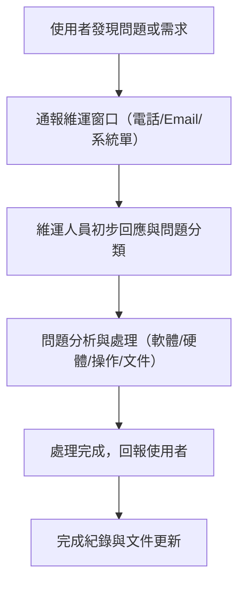

# 10.10.10.180 系統維護建議書

## 一、基本資料
- **系統名稱**：10.10.10.180 企業管理系統
- **建議書日期**：2024/07/04
- **維護對象**：茂世企業資訊系統
- **建議書編號**：20240704-01

## 二、服務內容
### 1. 維護範圍
- 系統日常運作監控與例行檢查
- 軟體異常排除與錯誤修正（含RPG、CL、報表、資料庫等）
- 使用者操作諮詢與教育訓練
- 系統功能優化與小幅度調整
- 定期備份與資料安全檢查
- 文件與操作手冊維護
- 硬體設備維運（伺服器、儲存設備、網路設備、終端機等之日常檢查、異常排除、零件更換、韌體更新、硬體資產管理）

### 2. 服務項目
- 緊急故障排除（如系統無法登入、資料異常等）
- 例行維護（每月/每季系統健康檢查）
- 功能調整與小型開發（依需求評估）
- 使用者諮詢（電話、Email、線上會議）
- 文件與紀錄管理（維護紀錄、異動紀錄、操作手冊更新）
- 硬體設備巡檢（定期檢查伺服器、儲存、網路、終端機等運作狀態）
- 硬體異常排除（故障診斷、零件更換、協助報修）
- 硬體資產管理（設備清冊、履歷維護、報廢建議）

## 三、Service Level 設計
### 1. 服務等級分類
- **Level 1（緊急）**：系統無法運作、資料遺失、重大安全事件
- **Level 2（重要）**：主要功能異常、影響多數使用者
- **Level 3（一般）**：單一功能異常、部分使用者受影響
- **Level 4（諮詢/建議）**：操作諮詢、文件需求、優化建議

### 2. 回應與處理時效
| 服務等級 | 回應時效 | 處理時效 |
|----------|----------|----------|
| Level 1  | 2小時內  | 8小時內  |
| Level 2  | 4小時內  | 24小時內 |
| Level 3  | 1工作日內| 3工作日內|
| Level 4  | 2工作日內| 5工作日內|

### 3. SLA 指標
- 年度系統可用率目標：99.5%
- 重大事件回報率：100%
- 問題結案率：95%（每月統計）
- 文件更新率：100%（每次異動後一週內）

## 四、成本結構
### 1. 人力成本
- 專案經理：負責溝通協調、進度追蹤
- 系統工程師：負責維護、開發、測試
- 文件管理人員：負責紀錄、手冊維護

### 2. 技術支援成本
- 線上支援（電話、Email、遠端桌面）
- 現場支援（依需求派遣）
- 定期教育訓練
- 硬體設備現場維修與巡檢（含零件更換、協助原廠報修、硬體資產盤點）

### 3. 預估費用結構
- 月維護費：NT$ XX,XXX（依合約議定）
- 緊急支援加班費：NT$ X,XXX/次（非上班時段）
- 功能擴充/專案開發：另行報價
- 硬體設備維運費：NT$ XX,XXX（依設備數量、型號、服務內容議定，含定期巡檢、異常排除、零件更換工時，不含材料費）
- 硬體零件材料費：依實際報價另計

## 五、其他建議
- **溝通機制**：建立專屬聯絡窗口，定期召開維運會議
- **持續改善**：每半年檢討維護成效，提出優化建議
- **文件管理**：所有維護紀錄、異動紀錄、操作手冊統一存放於指定資料夾，並定期備份

## 六、附錄
- 服務流程圖、聯絡窗口清單、常見問題處理SOP（如有需求可補充）

### 1. 服務流程圖（圖示與文字描述）

1. 使用者發現問題或需求 →
2. 通報維運窗口（電話/Email/系統單）→
3. 維運人員初步回應與問題分類 →
4. 問題分析與處理（軟體/硬體/操作/文件）→
5. 處理完成，回報使用者 →
6. 完成紀錄與文件更新

### 2. 聯絡窗口清單（範例）
| 單位/角色   | 姓名   | 職稱         | 聯絡電話      | Email                |
|-------------|--------|--------------|---------------|----------------------|
| 客戶窗口    | 王大明 | 資訊主管     | 09xx-xxx-xxx  | david.wang@xxx.com   |
| 維運窗口    | 李維修 | 系統工程師   | 09xx-xxx-xxx  | support@seedman.com  |
| 硬體支援    | 陳硬體 | 硬體工程師   | 09xx-xxx-xxx  | hardware@seedman.com |

### 3. 常見問題處理SOP（範例）
1. 使用者通報問題（記錄問題現象、時間、影響範圍）
2. 維運人員初步回應（2小時內）
3. 問題分類（緊急/重要/一般/諮詢）
4. 啟動對應處理流程（如需現場支援即時派遣）
5. 處理完成後回報並請使用者確認
6. 問題結案，紀錄於維護紀錄表
7. 若屬系統性問題，更新FAQ或操作手冊

### 4. 硬體設備清單（範例）
| 設備類型   | 品牌/型號     | 數量 | 主要用途     | 購置日期   | 保固到期日 | 備註         |
|------------|---------------|------|--------------|------------|------------|--------------|
| 伺服器     | DELL R740     | 2    | 主系統運算   | 2022/01/10 | 2025/01/10 |              |
| 儲存設備   | Synology RS   | 1    | 資料備份     | 2022/01/10 | 2025/01/10 | RAID5        |
| 網路交換器 | Cisco 2960    | 2    | 內部網路     | 2022/01/10 | 2025/01/10 |              |
| 終端機     | HP ProDesk    | 10   | 使用者端     | 2022/01/10 | 2025/01/10 |              |

### 5. 文件存放與異動紀錄管理說明
- 所有維護紀錄、異動紀錄、操作手冊、硬體資產清冊，統一存放於「10.10.10.180/茂世客服處理紀錄」及相關專案資料夾。
- 每次異動需填寫異動紀錄表，內容包含異動日期、異動人員、異動內容、影響範圍、備註。
- 定期（每月/每季）由專人檢查文件完整性與異動紀錄，確保資訊即時更新。

---

> 本建議書內容可依實際需求彈性調整，歡迎進一步討論細節。 