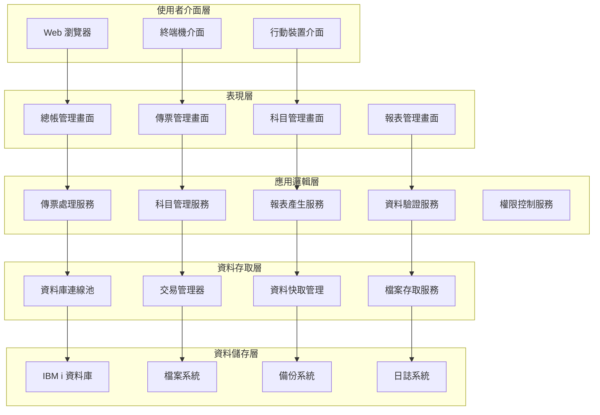
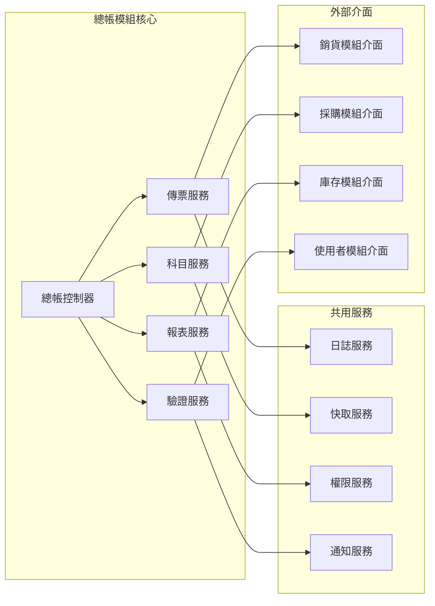
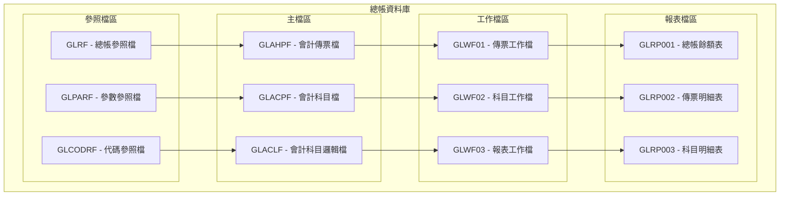
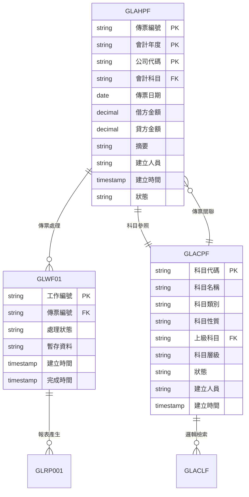
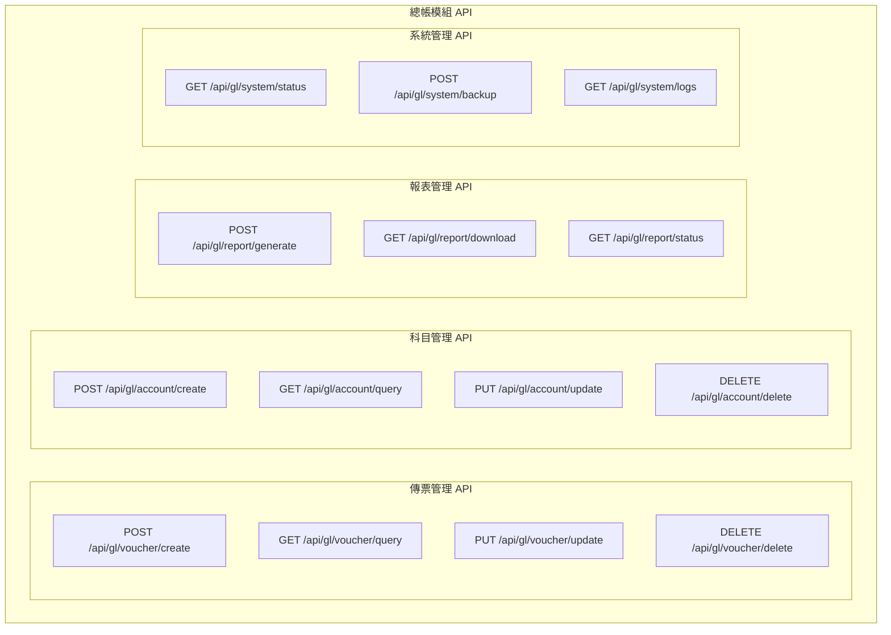
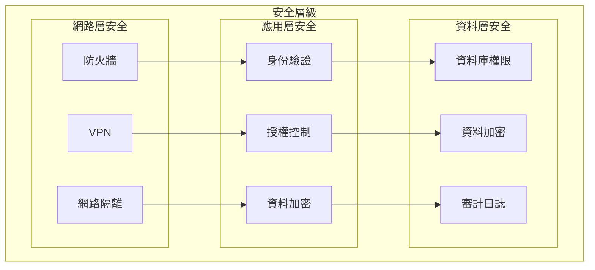

# 總帳模組技術文件

## 一、基本資訊

| 項目 | 說明 |
|------|------|
| **系統名稱** | 10.10.10.180 企業管理系統 |
| **模組名稱** | 總帳模組 |
| **模組代號** | GL (General Ledger) |
| **文件類型** | 技術文件 |
| **撰寫人員** | 系統分析師 |
| **撰寫日期** | 2024/12/19 |
| **審核人員** | 專案經理 |
| **審核日期** | 2024/12/19 |
| **版本編號** | v1.0 |
| **適用對象** | 系統開發人員、技術支援人員 |

---

## 二、系統架構

### 2.1 總帳模組整體架構圖



### 2.2 模組內部架構圖



### 2.3 技術架構說明

#### 2.3.1 開發技術
- **程式語言**：RPG、CL、SQL
- **開發平台**：IBM i (AS/400)
- **資料庫系統**：DB2 for i
- **作業系統**：IBM i 7.4

#### 2.3.2 架構特點
- **模組化設計**：各功能模組獨立，便於維護和擴充
- **分層架構**：清晰的層次結構，降低耦合度
- **可擴展性**：支援水平擴展和垂直擴展
- **高可用性**：具備故障恢復和負載平衡能力

---

## 三、資料庫設計

### 3.1 資料庫架構圖



### 3.2 資料表關聯圖



### 3.3 索引設計策略

#### 3.3.1 主要索引
| 索引名稱 | 索引類型 | 索引欄位 | 用途說明 |
|----------|----------|----------|----------|
| GLH001 | 主鍵索引 | AH01, AH02, AH03 | 傳票主要查詢索引 |
| GLH002 | 複合索引 | AH04, AH05 | 科目日期查詢優化 |
| GLH003 | 複合索引 | AH09, AH10 | 建立人員時間查詢 |
| GLC001 | 主鍵索引 | AC01 | 科目主要查詢索引 |
| GLC002 | 複合索引 | AC03, AC05 | 類別層級查詢優化 |

#### 3.3.2 索引優化建議
- **傳票查詢**：優先使用年度+日期的複合索引
- **科目查詢**：使用科目代碼的主鍵索引
- **報表查詢**：建立報表專用的統計索引
- **維護作業**：定期重建和更新索引統計

---

## 四、API 規格

### 4.1 API 架構圖



### 4.2 主要 API 端點

#### 4.2.1 傳票管理 API
```http
POST /api/gl/voucher/create
```

**請求參數**：
```json
{
    "companyCode": "001",
    "fiscalYear": "2024",
    "voucherDate": "20241219",
    "summary": "現金存入銀行",
    "details": [
        {
            "accountCode": "1001",
            "debitAmount": 0.00,
            "creditAmount": 10000.00,
            "summary": "現金減少"
        },
        {
            "accountCode": "1002",
            "debitAmount": 10000.00,
            "creditAmount": 0.00,
            "summary": "銀行存款增加"
        }
    ]
}
```

**回應格式**：
```json
{
    "status": "success",
    "message": "傳票建立成功",
    "data": {
        "voucherNo": "GL00000001",
        "createTime": "2024-12-19T10:30:00"
    }
}
```

#### 4.2.2 科目查詢 API
```http
GET /api/gl/account/query?category=1&status=A
```

**回應格式**：
```json
{
    "status": "success",
    "data": [
        {
            "accountCode": "1001",
            "accountName": "現金",
            "category": "1",
            "nature": "A",
            "level": "1",
            "status": "A"
        }
    ],
    "total": 1,
    "page": 1,
    "pageSize": 20
}
```

---

## 五、開發指南

### 5.1 開發環境設定

#### 5.1.1 必要軟體
- **開發工具**：IBM Rational Developer for i
- **程式語言**：RPG IV、CL、SQL
- **資料庫**：DB2 for i
- **作業系統**：IBM i 7.4

#### 5.1.2 專案結構
```
總帳模組/
├── src/                    # 原始碼目錄
│   ├── rpg/               # RPG 程式碼
│   │   ├── voucher/       # 傳票相關程式
│   │   ├── account/       # 科目相關程式
│   │   └── report/        # 報表相關程式
│   ├── cl/                # CL 程式碼
│   ├── sql/               # SQL 腳本
│   └── dds/               # DDS 檔案定義
├── docs/                  # 文件目錄
├── test/                  # 測試程式碼
└── build/                 # 建置輸出
```

### 5.2 程式碼規範

#### 5.2.1 RPG 程式碼規範
```rpgle
     H DATEDIT(*YMD)
     H DFTACTGRP(*NO)
     H ACTGRP(*NEW)
     
     D VoucherData      DS
     D  CompanyCode              3A
     D  FiscalYear               4A
     D  VoucherNo                8A
     D  VoucherDate              8A
     D  Summary                 40A
     
     C     *ENTRY        PLIST
     C                   PARM                    CompanyCode
     C                   PARM                    FiscalYear
     
     C                   EVAL      VoucherNo = GetNextVoucherNo()
     C                   EVAL      VoucherDate = %DATE()
     
     C                   CALL      'GLVCHR'    // 傳票處理程式
     C                   PARM                    VoucherData
     C                   PARM                    ReturnCode
     
     C                   EVAL      *INLR = *ON
```

#### 5.2.2 錯誤處理規範
```rpgle
     C                   IF        ReturnCode <> '0'
     C                   EVAL      ErrorMsg = GetErrorMessage(ReturnCode)
     C                   CALL      'GLLOG'     // 記錄錯誤日誌
     C                   PARM                    ErrorMsg
     C                   EVAL      *INLR = *ON
     C                   RETURN
     C                   ENDIF
```

---

## 六、部署指南

### 6.1 部署環境需求

#### 6.1.1 硬體需求
| 項目 | 最低需求 | 建議需求 |
|------|----------|----------|
| CPU | 4核心 | 8核心 |
| 記憶體 | 16GB | 32GB |
| 磁碟空間 | 100GB | 500GB |
| 網路頻寬 | 100Mbps | 1Gbps |

#### 6.1.2 軟體需求
- **作業系統**：IBM i 7.4 或更新版本
- **資料庫**：DB2 for i 7.4
- **開發工具**：IBM Rational Developer for i
- **備份工具**：IBM Backup, Recovery and Media Services

### 6.2 部署步驟

#### 6.2.1 準備階段
```bash
# 1. 建立部署目錄
CRTDIR DIR('/QSYS.LIB/GLMOD.LIB')
CRTDIR DIR('/QSYS.LIB/GLMOD.LIB/SRC')
CRTDIR DIR('/QSYS.LIB/GLMOD.LIB/OBJ')

# 2. 建立程式庫
CRTLIB LIB(GLMOD)
CRTLIB LIB(GLAPPS)
CRTLIB LIB(GLDATA)
```

#### 6.2.2 部署執行
```bash
# 1. 複製原始碼
CPYFRMSTMF FROMSTMF('/tmp/gl_source/*') TOMBR('/QSYS.LIB/GLMOD.LIB/SRC.MBR')

# 2. 編譯程式
CRTRPGMOD MODULE(GLAPPS/GLVCHR) SRCFILE(GLMOD/SRC) SRCMBR(GLVCHR)
CRTPGM PGM(GLAPPS/GLVCHR) MODULE(GLAPPS/GLVCHR)

# 3. 建立資料庫檔案
RUNSQLSTM SRCSTMF('/QSYS.LIB/GLMOD.LIB/SRC/GLTABLES.SQL')
```

---

## 七、效能優化

### 7.1 效能監控指標

#### 7.1.1 系統效能指標
- **回應時間**：傳票查詢 < 2秒，報表產生 < 30秒
- **吞吐量**：支援 100 個同時使用者
- **資源使用率**：CPU < 80%，記憶體 < 85%

#### 7.1.2 資料庫效能指標
- **查詢回應時間**：簡單查詢 < 1秒，複雜查詢 < 5秒
- **索引使用率**：> 90%
- **鎖定等待時間**：< 1秒

### 7.2 優化策略

#### 7.2.1 資料庫優化
```sql
-- 建立統計索引
CREATE INDEX GLH_STAT_IDX ON GLAHPF (AH02, AH05, AH04)
INCLUDE (AH06, AH07, AH08);

-- 更新統計資訊
RUNSTATS ON TABLE GLAHPF WITH DISTRIBUTION AND DETAILED INDEXES ALL;

-- 建立查詢優化提示
SELECT /*+ INDEX(GLAHPF GLH002) */
    AH03, AH05, AH06, AH07, AH08
FROM GLAHPF
WHERE AH02 = '2024' AND AH05 BETWEEN '20240101' AND '20241231';
```

#### 7.2.2 應用程式優化
- **連線池管理**：使用連線池減少連線建立時間
- **資料快取**：快取常用科目和參數資料
- **批次處理**：使用批次處理提升大量資料處理效能

---

## 八、安全考量

### 8.1 安全架構圖



### 8.2 安全機制

#### 8.2.1 身份驗證
- **多因子認證**：支援密碼 + 硬體 Token
- **單一登入**：整合企業 SSO 系統
- **密碼政策**：強制密碼複雜度和定期更換

#### 8.2.2 授權控制
- **角色基礎存取控制**：根據使用者角色設定權限
- **最小權限原則**：只授予必要的權限
- **權限審計**：定期審查使用者權限

---

## 九、故障排除

### 9.1 常見問題診斷

#### 9.1.1 系統問題
| 問題現象 | 可能原因 | 診斷方法 | 解決方案 |
|----------|----------|----------|----------|
| 傳票查詢緩慢 | 索引損壞或統計過期 | 檢查索引狀態和統計資訊 | 重建索引，更新統計 |
| 系統回應遲緩 | 記憶體不足或CPU過載 | 監控系統資源使用率 | 增加系統資源或優化程式 |

#### 9.1.2 資料庫問題
| 問題現象 | 可能原因 | 診斷方法 | 解決方案 |
|----------|----------|----------|----------|
| 連線逾時 | 連線池滿或網路問題 | 檢查連線池狀態和網路 | 調整連線池參數或檢查網路 |
| 鎖定衝突 | 長時間交易或死鎖 | 檢查鎖定狀態和交易 | 優化交易或調整鎖定策略 |

### 9.2 診斷工具

#### 9.2.1 系統診斷
- **WRKSYSSTS**：監控系統狀態
- **WRKACTJOB**：監控活動作業
- **WRKDSKSTS**：監控磁碟狀態

#### 9.2.2 資料庫診斷
- **WRKDBF**：檢查資料庫檔案狀態
- **WRKOBJLCK**：檢查物件鎖定狀態
- **DSPLOG**：檢視系統日誌

---

## 十、文件修訂記錄

| 版本 | 修訂日期 | 修訂人員 | 修訂內容 | 修訂原因 |
|------|----------|----------|----------|----------|
| v1.0 | 2024/12/19 | 系統分析師 | 初始版本 | 文件建立 |

---

**文件建立日期**：2024年12月19日  
**最後更新日期**：2024年12月19日  
**文件狀態**：草稿  
**下次檢討日期**：2025年1月19日 