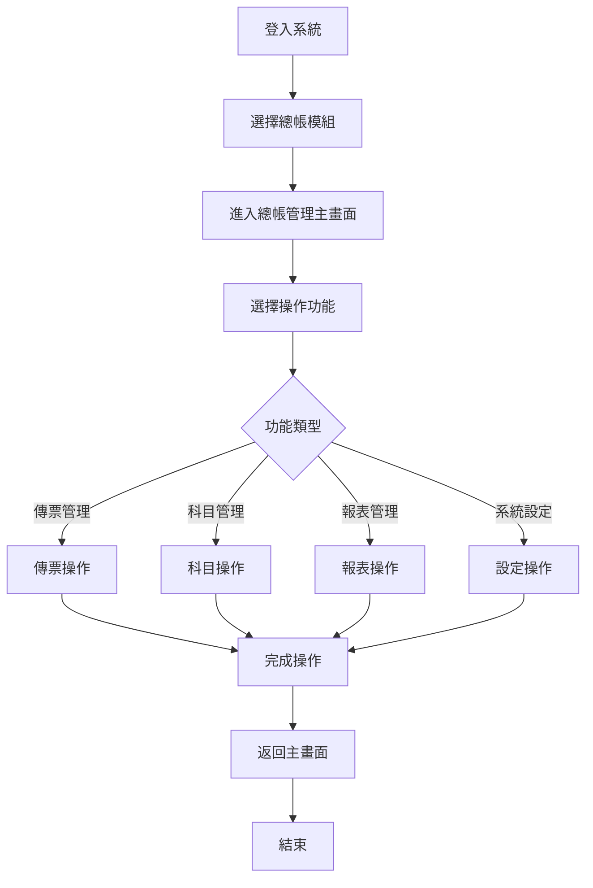
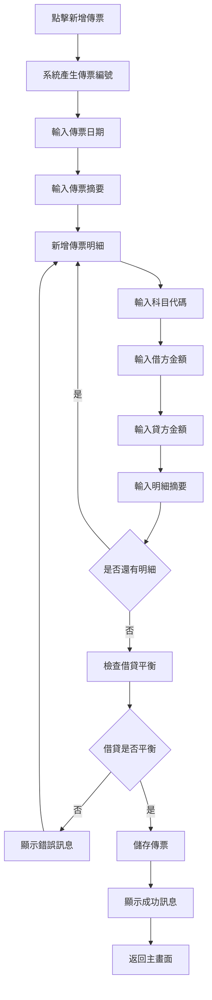
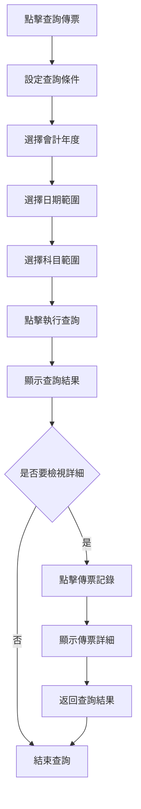
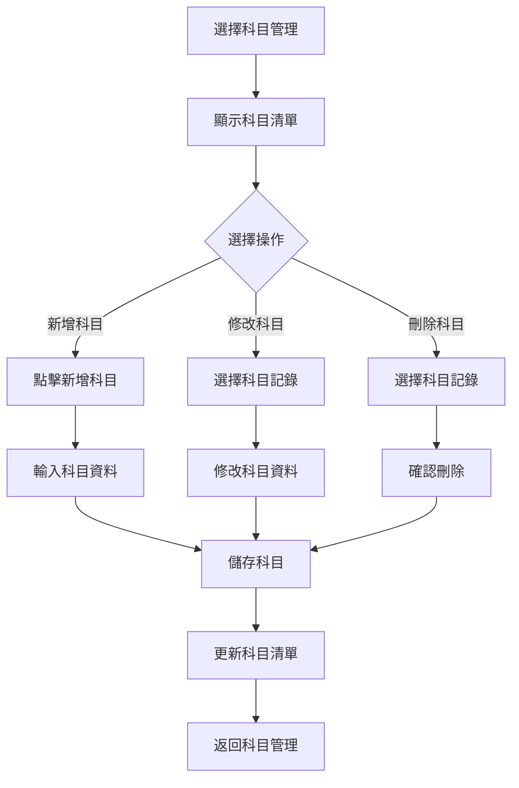

# 總帳模組操作手冊

## 一、基本資訊

| 項目 | 說明 |
|------|------|
| **系統名稱** | 10.10.10.180 企業管理系統 |
| **模組名稱** | 總帳模組 |
| **模組代號** | GL (General Ledger) |
| **功能名稱** | 總帳管理 |
| **功能代號** | GL001 |
| **撰寫人員** | 系統分析師 |
| **撰寫日期** | 2024/12/19 |
| **審核人員** | 專案經理 |
| **審核日期** | 2024/12/19 |
| **版本編號** | v1.0 |
| **適用對象** | 會計人員、財務人員、系統使用者 |

---

## 二、功能概述

### 2.1 功能目的
總帳模組是企業會計系統的核心，主要用於管理會計傳票、維護會計科目、產生財務報表，確保會計資料的準確性和完整性，為企業財務管理提供可靠的資料基礎。

### 2.2 功能範圍
- **主要功能**：傳票管理、科目管理、報表管理、系統設定
- **輔助功能**：資料查詢、資料匯出、資料備份、系統監控
- **限制功能**：已結帳年度不能修改、已刪除傳票不能恢復

### 2.3 使用時機
- **日常使用**：每日會計傳票輸入、科目餘額查詢
- **特殊情況**：月底結帳、年度結帳、財務報表產生
- **不適用情況**：系統維護期間、資料庫備份期間

---

## 三、操作流程

### 3.1 整體操作流程圖



### 3.2 傳票管理操作流程

#### 3.2.1 新增傳票流程


#### 3.2.2 查詢傳票流程


### 3.3 科目管理操作流程



---

## 四、畫面說明

### 4.1 總帳管理主畫面

#### 4.1.1 主畫面配置圖
```
┌─────────────────────────────────────────────────────────────┐
│                    總帳管理系統 - 主畫面                      │
├─────────────────────────────────────────────────────────────┤
│ 功能選單區域                                                │
│ ┌─────────────────────────────────────────────────────────┐ │
│ │ [總帳管理] [傳票管理] [科目管理] [報表管理] [系統設定]   │ │
│ └─────────────────────────────────────────────────────────┘ │
├─────────────────────────────────────────────────────────────┤
│ 查詢條件區域                                                │
│ ┌─────────────────────────────────────────────────────────┐ │
│ │ 年度選擇: [2024 ▼]    科目範圍: [全部科目 ▼]            │ │
│ │ 日期範圍: [2024/01/01] 至 [2024/12/31]                │ │
│ └─────────────────────────────────────────────────────────┘ │
├─────────────────────────────────────────────────────────────┤
│ 功能按鈕區域                                                │
│ [新增傳票] [查詢傳票] [科目維護] [報表產生] [資料匯出]    │
├─────────────────────────────────────────────────────────────┤
│ 傳票資料顯示區域                                            │
│ ┌─────────────────────────────────────────────────────────┐ │
│ │ 傳票編號 │ 傳票日期 │ 會計科目 │ 借方金額 │ 貸方金額 │ 摘要 │
│ ├─────────────────────────────────────────────────────────┤ │
│ │ GL001    │ 2024/12/19│ 1001    │ 10,000   │         │ 現金 │
│ │ GL002    │ 2024/12/19│ 2001    │         │ 10,000   │ 應付帳款│
│ └─────────────────────────────────────────────────────────┘ │
└─────────────────────────────────────────────────────────────┘
```

#### 4.1.2 區域說明
| 區域名稱 | 位置 | 功能說明 | 操作方式 |
|----------|------|----------|----------|
| **功能選單區域** | 畫面頂部 | 選擇主要功能模組 | 點擊對應功能選單 |
| **查詢條件區域** | 畫面上部 | 設定查詢條件 | 選擇或輸入查詢條件 |
| **功能按鈕區域** | 畫面中部 | 執行各種功能 | 點擊對應功能按鈕 |
| **資料顯示區域** | 畫面底部 | 顯示查詢結果 | 點擊記錄檢視詳細 |

### 4.2 傳票輸入畫面

#### 4.2.1 傳票輸入配置圖
```
┌─────────────────────────────────────────────────────────────┐
│                    傳票輸入 - 新增傳票                      │
├─────────────────────────────────────────────────────────────┤
│ 傳票標頭區域                                                │
│ ┌─────────────────────────────────────────────────────────┐ │
│ │ 傳票編號: [GL001        ] (系統自動產生)                │ │
│ │ 傳票日期: [2024/12/19 ▼]                               │ │
│ │ 摘要:     [現金存入銀行                                ] │ │
│ └─────────────────────────────────────────────────────────┘ │
├─────────────────────────────────────────────────────────────┤
│ 傳票明細區域                                                │
│ ┌─────────────────────────────────────────────────────────┐ │
│ │ 序號 │ 會計科目 │ 借方金額 │ 貸方金額 │ 摘要           │ │
│ ├─────────────────────────────────────────────────────────┤ │
│ │  1   │ [1001 ▼] │ [        ] │ [        ] │ [現金減少    ] │ │
│ │  2   │ [1002 ▼] │ [        ] │ [        ] │ [銀行存款增加] │ │
│ └─────────────────────────────────────────────────────────┘ │
├─────────────────────────────────────────────────────────────┤
│ 功能按鈕區域                                                │
│ [新增明細] [儲存傳票] [取消]                              │
└─────────────────────────────────────────────────────────────┘
```

---

## 五、功能鍵說明

### 5.1 功能鍵清單
| 功能鍵 | 功能名稱 | 使用時機 | 操作說明 |
|--------|----------|----------|----------|
| **F1** | 線上說明 | 需要協助時 | 顯示線上說明文件 |
| **F2** | 查詢 | 要執行查詢時 | 執行查詢作業 |
| **F3** | 新增 | 要新增資料時 | 進入新增畫面 |
| **F4** | 修改 | 要修改資料時 | 進入修改畫面 |
| **F5** | 刪除 | 要刪除資料時 | 執行刪除作業 |
| **F6** | 儲存 | 要儲存資料時 | 儲存輸入的資料 |
| **F7** | 取消 | 要取消操作時 | 取消當前操作 |
| **F8** | 列印 | 要列印資料時 | 執行列印作業 |
| **F9** | 匯出 | 要匯出資料時 | 執行資料匯出 |
| **F10** | 離開 | 要離開功能時 | 離開當前功能 |

### 5.2 常用功能鍵操作

#### 5.2.1 新增傳票 (F3)
- **使用時機**：需要新增會計傳票時
- **操作步驟**：
  1. 按 F3 鍵或點擊 [新增傳票] 按鈕
  2. 系統顯示傳票輸入畫面
  3. 輸入傳票標頭資料
  4. 輸入傳票明細資料
  5. 按 F6 儲存傳票

#### 5.2.2 查詢傳票 (F2)
- **使用時機**：需要查詢傳票資料時
- **操作步驟**：
  1. 設定查詢條件
  2. 按 F2 鍵或點擊 [查詢傳票] 按鈕
  3. 系統執行查詢並顯示結果

---

## 六、常見問題與解答

### 6.1 傳票相關問題

#### 6.1.1 傳票借貸不平衡
**問題描述**：儲存傳票時顯示借貸不平衡錯誤

**可能原因**：
- 借方金額總和不等於貸方金額總和
- 金額輸入錯誤
- 明細資料不完整

**解決方案**：
1. 檢查傳票明細的借方和貸方金額
2. 確保借方金額總和 = 貸方金額總和
3. 檢查是否有遺漏的明細資料

#### 6.1.2 科目代碼不存在
**問題描述**：輸入科目代碼時顯示科目不存在錯誤

**可能原因**：
- 科目代碼輸入錯誤
- 科目尚未建立
- 科目已停用

**解決方案**：
1. 檢查科目代碼是否正確
2. 使用科目查詢功能確認科目存在
3. 聯絡管理員新增科目或啟用停用科目

### 6.2 系統相關問題

#### 6.2.1 無法進入傳票功能
**問題描述**：點擊傳票管理後無法進入功能畫面

**可能原因**：
- 使用者權限不足
- 系統連線異常
- 功能暫時停用

**解決方案**：
1. 檢查使用者權限設定
2. 重新登入系統
3. 聯絡系統管理員

---

## 七、錯誤處理

### 7.1 錯誤訊息說明

#### 7.1.1 業務錯誤訊息
| 錯誤代碼 | 錯誤訊息 | 錯誤原因 | 解決方案 |
|----------|----------|----------|----------|
| GL101 | 傳票借貸不平衡，請檢查金額 | 借方金額總和不等於貸方金額總和 | 檢查傳票明細金額，確保借貸平衡 |
| GL102 | 會計科目不存在，請檢查科目代碼 | 輸入的科目代碼在系統中不存在 | 查詢正確的科目代碼，或聯絡管理員新增科目 |

#### 7.1.2 使用者錯誤訊息
| 錯誤代碼 | 錯誤訊息 | 錯誤原因 | 解決方案 |
|----------|----------|----------|----------|
| GL201 | 傳票日期格式錯誤，請使用YYYYMMDD格式 | 日期輸入格式不正確 | 使用正確的日期格式，如：20241219 |
| GL202 | 金額格式錯誤，請輸入正確的數字格式 | 金額輸入格式不正確 | 輸入正數，最多10位整數，2位小數 |

### 7.2 錯誤處理步驟

#### 7.2.1 一般錯誤處理流程
1. **記錄錯誤訊息**：記下錯誤代碼和錯誤訊息
2. **嘗試基本解決方案**：根據錯誤訊息嘗試解決
3. **尋求協助**：如無法解決，聯絡系統管理員

---

## 八、使用技巧

### 8.1 操作效率提升

#### 8.1.1 快速輸入技巧
- **使用科目代碼**：直接輸入科目代碼比選擇科目名稱快
- **複製傳票**：相似傳票可使用複製功能
- **使用範本**：建立常用傳票範本

#### 8.1.2 查詢技巧
- **組合查詢條件**：使用多個條件組合查詢
- **儲存查詢條件**：將常用查詢條件儲存起來
- **使用進階查詢**：利用進階查詢功能進行複雜查詢

### 8.2 資料庫操作技巧

#### 8.2.1 資料庫查詢優化
```sql
-- 基本查詢（推薦使用）
SELECT AH03, AH05, AH06, AH07, AH08
FROM GLAHPF
WHERE AH02 = '2024' 
  AND AH05 BETWEEN '20240101' AND '20241231'
  AND AH13 = 'A'
ORDER BY AH05 DESC, AH03;

-- 使用索引的查詢（效能最佳）
SELECT /*+ INDEX(GLAHPF GLH002) */
    AH03, AH05, AH06, AH07, AH08
FROM GLAHPF
WHERE AH02 = '2024' 
  AND AH05 = '20241219'
  AND AH04 = '1001';

-- 統計查詢（用於報表）
SELECT 
    AH04 AS ACCOUNT_CODE,
    COUNT(*) AS VOUCHER_COUNT,
    SUM(AH06) AS TOTAL_DEBIT,
    SUM(AH07) AS TOTAL_CREDIT
FROM GLAHPF
WHERE AH02 = '2024' 
  AND AH13 = 'A'
GROUP BY AH04
HAVING COUNT(*) > 0
ORDER BY AH04;
```

#### 8.2.2 資料庫維護操作
```sql
-- 檢查資料完整性
SELECT 
    AH02 AS FISCAL_YEAR,
    COUNT(*) AS TOTAL_RECORDS,
    COUNT(CASE WHEN AH13 = 'A' THEN 1 END) AS ACTIVE_RECORDS,
    COUNT(CASE WHEN AH13 = 'D' THEN 1 END) AS DELETED_RECORDS
FROM GLAHPF
GROUP BY AH02
ORDER BY AH02;

-- 檢查借貸平衡
SELECT 
    AH03 AS VOUCHER_NO,
    AH05 AS VOUCHER_DATE,
    SUM(AH06) AS TOTAL_DEBIT,
    SUM(AH07) AS TOTAL_CREDIT,
    ABS(SUM(AH06) - SUM(AH07)) AS DIFFERENCE
FROM GLAHPF
WHERE AH02 = '2024' 
  AND AH13 = 'A'
GROUP BY AH03, AH05
HAVING ABS(SUM(AH06) - SUM(AH07)) > 0.01;

-- 清理無效資料
DELETE FROM GLWF01 
WHERE WF0103 = 'E' 
  AND WF0105 < CURRENT_DATE - 30;
```

#### 8.2.3 資料庫效能監控
```sql
-- 監控查詢效能
SELECT 
    SUBSTR(EXECUTION_TIME, 1, 10) AS EXEC_DATE,
    COUNT(*) AS QUERY_COUNT,
    AVG(ELAPSED_TIME) AS AVG_ELAPSED_TIME,
    MAX(ELAPSED_TIME) AS MAX_ELAPSED_TIME
FROM GL_QUERY_LOG
WHERE EXECUTION_TIME >= CURRENT_DATE - 7
GROUP BY SUBSTR(EXECUTION_TIME, 1, 10)
ORDER BY EXEC_DATE DESC;

-- 監控資料表大小
SELECT 
    TABLE_NAME,
    TABLE_SCHEMA,
    ROUND(TABLE_SIZE/1024/1024, 2) AS SIZE_MB,
    ROW_COUNT
FROM GL_TABLE_STATS
WHERE TABLE_SCHEMA = 'GLDATA'
ORDER BY TABLE_SIZE DESC;

-- 監控索引使用情況
SELECT 
    INDEX_NAME,
    TABLE_NAME,
    INDEX_SIZE,
    INDEX_USAGE_COUNT,
    LAST_USED
FROM GL_INDEX_STATS
WHERE TABLE_SCHEMA = 'GLDATA'
ORDER BY INDEX_USAGE_COUNT DESC;
```

### 8.3 進階操作技巧

#### 8.3.1 批次處理操作
```sql
-- 批次更新傳票狀態
UPDATE GLAHPF 
SET AH13 = 'D', 
    AH11 = 'BATCH_USER', 
    AH12 = CURRENT_TIMESTAMP
WHERE AH02 = '2023' 
  AND AH13 = 'A'
  AND AH05 < '20240101';

-- 批次產生傳票編號
INSERT INTO GLWF01 (WF0101, WF0102, WF0103, WF0105)
SELECT 
    'WF' || RIGHT('0000000000' || ROW_NUMBER() OVER(), 10),
    'GL' || RIGHT('00000000' || ROW_NUMBER() OVER(), 8),
    'P',
    CURRENT_TIMESTAMP
FROM SYSIBM.SYSDUMMY1
CONNECT BY LEVEL <= 1000;
```

#### 8.3.2 資料匯出操作
```sql
-- 匯出傳票資料到CSV格式
SELECT 
    AH03 || ',' ||
    AH05 || ',' ||
    AH04 || ',' ||
    AH06 || ',' ||
    AH07 || ',' ||
    AH08 || ',' ||
    AH09 || ',' ||
    AH10
FROM GLAHPF
WHERE AH02 = '2024' 
  AND AH13 = 'A'
ORDER BY AH05, AH03;

-- 匯出科目餘額資料
SELECT 
    AC01 || ',' ||
    AC02 || ',' ||
    AC03 || ',' ||
    AC04 || ',' ||
    AC06 || ',' ||
    AC07
FROM GLACPF
WHERE AC07 = 'A'
ORDER BY AC01;
```

---

## 九、相關功能

### 9.1 相關功能清單
| 功能名稱 | 功能代號 | 關聯性 | 說明 |
|----------|----------|--------|------|
| 銷貨模組 | NP | 前置 | 銷貨傳票會產生應收帳款 |
| 採購模組 | PC | 前置 | 採購傳票會產生應付帳款 |
| 庫存模組 | PT | 前置 | 庫存異動會產生相關傳票 |

---

## 十、聯絡資訊

### 10.1 技術支援聯絡方式
| 支援類型 | 聯絡方式 | 聯絡時間 | 回應時間 |
|----------|----------|----------|----------|
| **一般問題** | 系統管理員 | 上班時間 | 2小時內 |
| **技術問題** | 技術支援 | 上班時間 | 4小時內 |
| **緊急問題** | 專案經理 | 24小時 | 立即回應 |

---

**文件建立日期**：2024年12月19日  
**最後更新日期**：2024年12月19日  
**文件狀態**：草稿  
**下次檢討日期**：2025年1月19日 