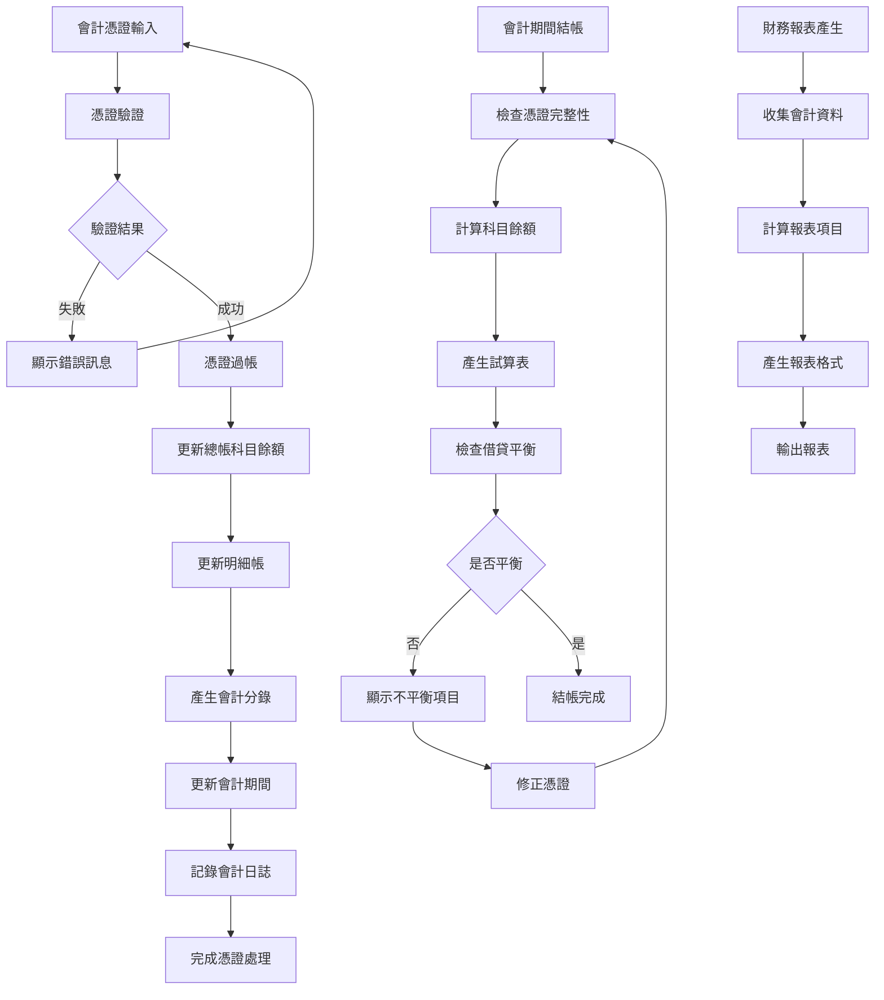
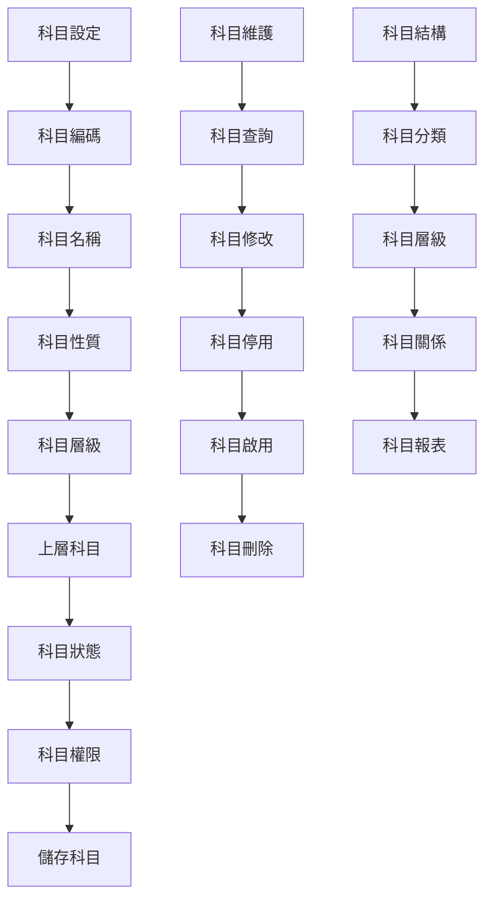
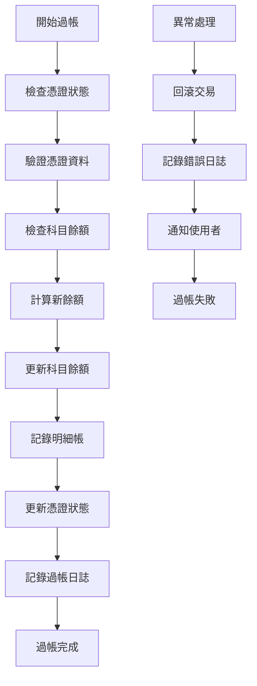
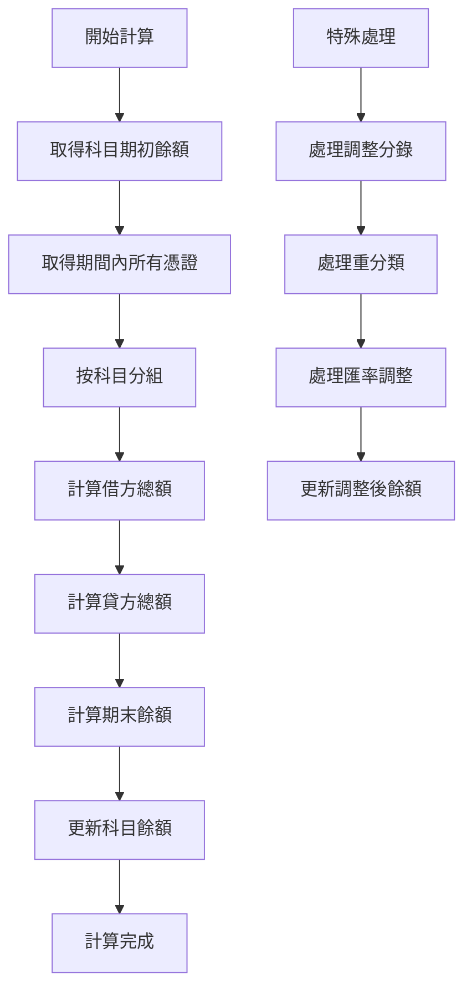
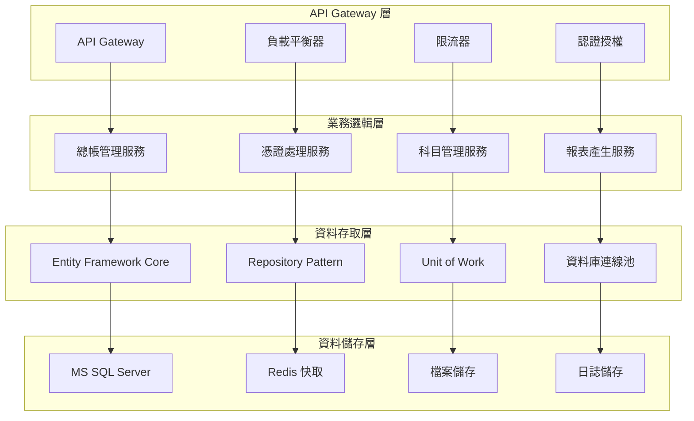

# 總帳模組業務邏輯分析與API設計文件

## 一、基本資訊

| 項目 | 說明 |
|------|------|
| **系統名稱** | 10.10.10.180 企業管理系統 |
| **模組名稱** | 總帳模組 |
| **模組代號** | GL (General Ledger) |
| **功能名稱** | 總帳管理 |
| **功能代號** | GL001 |
| **撰寫人員** | 系統分析師 |
| **撰寫日期** | 2024/12/21 |
| **審核人員** | 專案經理 |
| **審核日期** | 2024/12/21 |
| **版本編號** | v1.0 |
| **文件類型** | 業務邏輯分析與API設計 |
| **適用範圍** | 系統現代化轉型專案 |

---

## 二、業務邏輯分析

### 2.1 業務流程分析

#### 2.1.1 總帳管理核心業務流程



#### 2.1.2 會計科目管理業務流程



### 2.2 業務規則分析

#### 2.2.1 會計憑證業務規則

| 業務規則編號 | 規則名稱 | 規則內容 | 業務影響 |
|-------------|----------|----------|----------|
| **GL001** | 借貸平衡規則 | 每筆憑證的借方金額必須等於貸方金額 | 確保會計帳務的數學正確性 |
| **GL002** | 科目存在性規則 | 憑證中的科目必須存在於科目主檔中 | 防止使用不存在的科目 |
| **GL003** | 科目狀態規則 | 只能使用狀態為「有效」的科目 | 防止使用已停用的科目 |
| **GL004** | 會計期間規則 | 憑證日期必須在已開啟的會計期間內 | 確保會計期間的正確性 |
| **GL005** | 憑證編號規則 | 憑證編號必須唯一且連續 | 便於憑證追蹤和管理 |

#### 2.2.2 會計科目業務規則

| 業務規則編號 | 規則名稱 | 規則內容 | 業務影響 |
|-------------|----------|----------|----------|
| **GL006** | 科目編碼規則 | 科目編碼必須符合編碼規則且唯一 | 確保科目識別的唯一性 |
| **GL007** | 科目層級規則 | 子科目必須有對應的父科目 | 維護科目結構的完整性 |
| **GL008** | 科目性質規則 | 科目性質決定科目的借貸方向 | 影響會計分錄的借貸方向 |
| **GL009** | 科目停用規則 | 有餘額的科目不能停用 | 防止資料遺失和帳務錯誤 |
| **GL010** | 科目權限規則 | 不同使用者對不同科目有不同的操作權限 | 確保資料安全性 |

#### 2.2.3 會計期間業務規則

| 業務規則編號 | 規則名稱 | 規則內容 | 業務影響 |
|-------------|----------|----------|----------|
| **GL011** | 期間開啟規則 | 只有已開啟的會計期間才能輸入憑證 | 控制會計作業的時序性 |
| **GL012** | 期間結帳規則 | 會計期間必須按順序結帳 | 確保會計資料的完整性 |
| **GL013** | 期間調整規則 | 已結帳的期間不能修改，只能透過調整分錄 | 保護已結帳資料的完整性 |
| **GL014** | 期間重開規則 | 特殊情況下可以重新開啟已結帳期間 | 提供業務彈性但需嚴格控制 |

### 2.3 業務邏輯複雜度分析

#### 2.3.1 業務邏輯複雜度矩陣

| 業務功能 | 邏輯複雜度 | 資料複雜度 | 整合複雜度 | 總體複雜度 |
|----------|------------|------------|------------|------------|
| **憑證輸入** | 高 | 中 | 中 | 高 |
| **憑證過帳** | 高 | 高 | 高 | 高 |
| **科目管理** | 中 | 中 | 低 | 中 |
| **期間結帳** | 高 | 高 | 中 | 高 |
| **報表產生** | 中 | 高 | 中 | 中 |
| **資料查詢** | 低 | 中 | 低 | 低 |

#### 2.3.2 關鍵業務邏輯分析

##### 2.3.2.1 憑證過帳邏輯


##### 2.3.2.2 科目餘額計算邏輯


---

## 三、API 設計

### 3.1 API 架構設計

#### 3.1.1 API 分層架構



#### 3.1.2 API 設計原則

| 設計原則 | 說明 | 實作方式 |
|----------|------|----------|
| **RESTful 設計** | 遵循 REST 架構原則 | 使用標準 HTTP 方法和狀態碼 |
| **版本控制** | 支援 API 版本管理 | URL 路徑版本控制 |
| **標準化回應** | 統一的回應格式 | 標準化的 JSON 回應結構 |
| **錯誤處理** | 完整的錯誤處理機制 | HTTP 狀態碼 + 錯誤訊息 |
| **安全性** | 完整的認證授權 | JWT Token + Role-based Access Control |
| **效能優化** | 支援快取和分頁 | Redis 快取 + 分頁查詢 |

### 3.2 API 端點設計

#### 3.2.1 總帳管理 API

##### 3.2.1.1 會計憑證管理 API

```http
# 查詢會計憑證列表
GET /api/gl/v1/vouchers
Authorization: Bearer {token}
Content-Type: application/json

Query Parameters:
- company_code: string (required)
- voucher_date_from: string (optional)
- voucher_date_to: string (optional)
- voucher_status: string (optional)
- account_code: string (optional)
- page: integer (optional, default: 1)
- page_size: integer (optional, default: 20)
```

**回應格式**：
```json
{
  "status": "success",
  "data": {
    "vouchers": [
      {
        "voucher_id": "GL20241221001",
        "voucher_date": "2024-12-21",
        "voucher_type": "JV",
        "voucher_status": "POSTED",
        "description": "調整分錄",
        "debit_amount": 10000.00,
        "credit_amount": 10000.00,
        "created_by": "USER001",
        "created_time": "2024-12-21T10:00:00Z",
        "posted_time": "2024-12-21T10:05:00Z"
      }
    ],
    "pagination": {
      "current_page": 1,
      "total_pages": 5,
      "total_records": 100,
      "page_size": 20
    }
  }
}
```

```http
# 新增會計憑證
POST /api/gl/v1/vouchers
Authorization: Bearer {token}
Content-Type: application/json

Request Body:
{
  "company_code": "001",
  "voucher_date": "2024-12-21",
  "voucher_type": "JV",
  "description": "調整分錄",
  "entries": [
    {
      "account_code": "1101",
      "debit_amount": 10000.00,
      "credit_amount": 0.00,
      "description": "現金增加"
    },
    {
      "account_code": "2101",
      "debit_amount": 0.00,
      "credit_amount": 10000.00,
      "description": "應付帳款增加"
    }
  ]
}
```

**回應格式**：
```json
{
  "status": "success",
  "data": {
    "voucher_id": "GL20241221001",
    "message": "會計憑證建立成功"
  }
}
```

```http
# 過帳會計憑證
POST /api/gl/v1/vouchers/{voucher_id}/post
Authorization: Bearer {token}
Content-Type: application/json

Request Body:
{
  "posted_by": "USER001",
  "posted_time": "2024-12-21T10:05:00Z"
}
```

##### 3.2.1.2 會計科目管理 API

```http
# 查詢會計科目列表
GET /api/gl/v1/accounts
Authorization: Bearer {token}
Content-Type: application/json

Query Parameters:
- company_code: string (required)
- account_level: integer (optional)
- parent_account: string (optional)
- account_status: string (optional)
- account_type: string (optional)
```

**回應格式**：
```json
{
  "status": "success",
  "data": {
    "accounts": [
      {
        "account_code": "1101",
        "account_name": "現金",
        "account_level": 2,
        "parent_account": "1100",
        "account_type": "ASSET",
        "account_nature": "DEBIT",
        "account_status": "ACTIVE",
        "opening_balance": 50000.00,
        "current_balance": 60000.00
      }
    ]
  }
}
```

```http
# 新增會計科目
POST /api/gl/v1/accounts
Authorization: Bearer {token}
Content-Type: application/json

Request Body:
{
  "company_code": "001",
  "account_code": "1102",
  "account_name": "銀行存款",
  "account_level": 2,
  "parent_account": "1100",
  "account_type": "ASSET",
  "account_nature": "DEBIT",
  "opening_balance": 0.00
}
```

#### 3.2.2 會計期間管理 API

```http
# 查詢會計期間
GET /api/gl/v1/periods
Authorization: Bearer {token}
Content-Type: application/json

Query Parameters:
- company_code: string (required)
- fiscal_year: string (optional)
- period_status: string (optional)
```

```http
# 開啟會計期間
POST /api/gl/v1/periods/{period_id}/open
Authorization: Bearer {token}
Content-Type: application/json

Request Body:
{
  "opened_by": "USER001",
  "opened_time": "2024-12-21T09:00:00Z"
}
```

```http
# 結帳會計期間
POST /api/gl/v1/periods/{period_id}/close
Authorization: Bearer {token}
Content-Type: application/json

Request Body:
{
  "closed_by": "USER001",
  "closed_time": "2024-12-21T17:00:00Z"
}
```

### 3.3 API 資料模型設計

#### 3.3.1 會計憑證資料模型

```csharp
// 會計憑證主檔
public class Voucher
{
    public string VoucherId { get; set; }
    public string CompanyCode { get; set; }
    public DateTime VoucherDate { get; set; }
    public string VoucherType { get; set; }
    public string VoucherStatus { get; set; }
    public string Description { get; set; }
    public decimal DebitAmount { get; set; }
    public decimal CreditAmount { get; set; }
    public string CreatedBy { get; set; }
    public DateTime CreatedTime { get; set; }
    public string PostedBy { get; set; }
    public DateTime? PostedTime { get; set; }
    public string ApprovedBy { get; set; }
    public DateTime? ApprovedTime { get; set; }
    
    // 導航屬性
    public virtual ICollection<VoucherEntry> Entries { get; set; }
    public virtual Company Company { get; set; }
}

// 會計憑證明細
public class VoucherEntry
{
    public string EntryId { get; set; }
    public string VoucherId { get; set; }
    public string AccountCode { get; set; }
    public decimal DebitAmount { get; set; }
    public decimal CreditAmount { get; set; }
    public string Description { get; set; }
    public int SortOrder { get; set; }
    
    // 導航屬性
    public virtual Voucher Voucher { get; set; }
    public virtual Account Account { get; set; }
}
```

#### 3.3.2 會計科目資料模型

```csharp
// 會計科目主檔
public class Account
{
    public string AccountCode { get; set; }
    public string CompanyCode { get; set; }
    public string AccountName { get; set; }
    public int AccountLevel { get; set; }
    public string ParentAccount { get; set; }
    public string AccountType { get; set; }
    public string AccountNature { get; set; }
    public string AccountStatus { get; set; }
    public decimal OpeningBalance { get; set; }
    public decimal CurrentBalance { get; set; }
    public string CreatedBy { get; set; }
    public DateTime CreatedTime { get; set; }
    public string ModifiedBy { get; set; }
    public DateTime? ModifiedTime { get; set; }
    
    // 導航屬性
    public virtual ICollection<Account> ChildAccounts { get; set; }
    public virtual Account ParentAccountNavigation { get; set; }
    public virtual ICollection<VoucherEntry> VoucherEntries { get; set; }
}

// 會計科目餘額
public class AccountBalance
{
    public string AccountCode { get; set; }
    public string CompanyCode { get; set; }
    public string FiscalYear { get; set; }
    public string Period { get; set; }
    public decimal OpeningBalance { get; set; }
    public decimal DebitAmount { get; set; }
    public decimal CreditAmount { get; set; }
    public decimal EndingBalance { get; set; }
    public DateTime LastUpdated { get; set; }
}
```

### 3.4 API 安全性設計

#### 3.4.1 認證授權機制

```csharp
// JWT Token 認證
[Authorize]
[ApiController]
[Route("api/gl/v1/[controller]")]
public class VouchersController : ControllerBase
{
    [HttpGet]
    [Authorize(Roles = "GL_READER,GL_USER,GL_ADMIN")]
    public async Task<ActionResult<ApiResponse<PagedResult<VoucherDto>>>> GetVouchers(
        [FromQuery] VoucherQueryParameters parameters)
    {
        // 實作邏輯
    }
    
    [HttpPost]
    [Authorize(Roles = "GL_USER,GL_ADMIN")]
    public async Task<ActionResult<ApiResponse<VoucherDto>>> CreateVoucher(
        [FromBody] CreateVoucherRequest request)
    {
        // 實作邏輯
    }
    
    [HttpPost("{voucherId}/post")]
    [Authorize(Roles = "GL_ADMIN")]
    public async Task<ActionResult<ApiResponse<string>>> PostVoucher(
        string voucherId, [FromBody] PostVoucherRequest request)
    {
        // 實作邏輯
    }
}
```

#### 3.4.2 資料驗證機制

```csharp
// 資料驗證 DTO
public class CreateVoucherRequest
{
    [Required]
    [StringLength(3)]
    public string CompanyCode { get; set; }
    
    [Required]
    public DateTime VoucherDate { get; set; }
    
    [Required]
    [StringLength(2)]
    public string VoucherType { get; set; }
    
    [Required]
    [StringLength(200)]
    public string Description { get; set; }
    
    [Required]
    [MinLength(1)]
    public List<CreateVoucherEntryRequest> Entries { get; set; }
    
    // 自訂驗證
    [CustomValidation(typeof(VoucherValidation), nameof(ValidateDebitCreditBalance))]
    public bool IsValid => true;
}

// 自訂驗證邏輯
public static class VoucherValidation
{
    public static ValidationResult ValidateDebitCreditBalance(
        CreateVoucherRequest request, ValidationContext context)
    {
        var totalDebit = request.Entries.Sum(e => e.DebitAmount);
        var totalCredit = request.Entries.Sum(e => e.CreditAmount);
        
        if (Math.Abs(totalDebit - totalCredit) > 0.01m)
        {
            return new ValidationResult("借貸金額必須平衡");
        }
        
        return ValidationResult.Success;
    }
}
```

---

## 四、業務邏輯轉換策略

### 4.1 RPG 到 C# 轉換策略

#### 4.1.1 程式結構轉換

| RPG 結構 | C# 對應 | 轉換說明 |
|----------|----------|----------|
| **主程式** | Main Program | 使用 Program.cs 作為程式進入點 |
| **子程序** | Private Methods | 將 RPG 子程序轉換為 C# 私有方法 |
| **資料結構** | Classes/Models | 將 RPG 資料結構轉換為 C# 類別 |
| **檔案操作** | Repository Pattern | 使用 Repository 模式處理資料存取 |
| **錯誤處理** | Exception Handling | 使用 C# 例外處理機制 |

#### 4.1.2 業務邏輯轉換範例

**RPG 原始碼**：
```rpgle
     C     PostVoucher BEGSR
     C                   EVAL      VoucherStatus = 'P'
     C                   EVAL      PostedBy = %USER
     C                   EVAL      PostedTime = %TIMESTAMP
     C                   UPDATE     GLAHPF
     C                   EXSR      UpdateAccountBalance
     C                   EXSR      LogPosting
     C                   ENDSR
```

**C# 轉換後**：
```csharp
private async Task PostVoucherAsync(string voucherId, string postedBy)
{
    try
    {
        var voucher = await _voucherRepository.GetByIdAsync(voucherId);
        if (voucher == null)
            throw new NotFoundException($"Voucher {voucherId} not found");
        
        voucher.Post(postedBy);
        await _voucherRepository.UpdateAsync(voucher);
        
        await UpdateAccountBalanceAsync(voucher);
        await LogPostingAsync(voucher, postedBy);
        
        await _unitOfWork.SaveChangesAsync();
    }
    catch (Exception ex)
    {
        _logger.LogError(ex, "Error posting voucher {VoucherId}", voucherId);
        throw;
    }
}
```

### 4.2 資料庫轉換策略

#### 4.2.1 資料表結構轉換

| AS/400 檔案 | MS SQL 資料表 | 轉換說明 |
|-------------|----------------|----------|
| **GLAHPF** | GL_Vouchers | 會計憑證主檔 |
| **GLACPF** | GL_Accounts | 會計科目主檔 |
| **GLACLF** | GL_AccountBalances | 會計科目餘額 |
| **GLWF01** | GL_WorkFiles | 工作檔案 |

#### 4.2.2 資料類型轉換

| AS/400 型態 | MS SQL 型態 | 轉換說明 |
|-------------|-------------|----------|
| **CHAR(n)** | VARCHAR(n) | 固定長度字元轉換為可變長度 |
| **DECIMAL(p,s)** | DECIMAL(p,s) | 十進位數值保持不變 |
| **TIMESTAMP** | DATETIME2 | 時間戳記轉換為日期時間 |
| **PACKED** | DECIMAL | 壓縮十進位轉換為十進位 |

---

## 五、API 效能優化策略

### 5.1 快取策略

#### 5.1.1 Redis 快取設計

```csharp
// 快取服務介面
public interface ICacheService
{
    Task<T> GetAsync<T>(string key);
    Task SetAsync<T>(string key, T value, TimeSpan? expiry = null);
    Task RemoveAsync(string key);
    Task RemoveByPatternAsync(string pattern);
}

// 快取實作
public class RedisCacheService : ICacheService
{
    private readonly IDatabase _database;
    private readonly ILogger<RedisCacheService> _logger;
    
    public async Task<T> GetAsync<T>(string key)
    {
        var value = await _database.StringGetAsync(key);
        return value.HasValue ? JsonSerializer.Deserialize<T>(value) : default;
    }
    
    public async Task SetAsync<T>(string key, T value, TimeSpan? expiry = null)
    {
        var serializedValue = JsonSerializer.Serialize(value);
        await _database.StringSetAsync(key, serializedValue, expiry);
    }
}

// 在服務中使用快取
public class VoucherService : IVoucherService
{
    private readonly ICacheService _cacheService;
    
    public async Task<VoucherDto> GetVoucherAsync(string voucherId)
    {
        var cacheKey = $"voucher:{voucherId}";
        var cachedVoucher = await _cacheService.GetAsync<VoucherDto>(cacheKey);
        
        if (cachedVoucher != null)
            return cachedVoucher;
        
        var voucher = await _voucherRepository.GetByIdAsync(voucherId);
        var voucherDto = _mapper.Map<VoucherDto>(voucher);
        
        await _cacheService.SetAsync(cacheKey, voucherDto, TimeSpan.FromMinutes(30));
        return voucherDto;
    }
}
```

### 5.2 分頁查詢優化

#### 5.2.1 分頁查詢實作

```csharp
// 分頁查詢參數
public class PagedQueryParameters
{
    private int _page = 1;
    private int _pageSize = 20;
    
    public int Page
    {
        get => _page;
        set => _page = value < 1 ? 1 : value;
    }
    
    public int PageSize
    {
        get => _pageSize;
        set => _pageSize = value < 1 ? 20 : value > 100 ? 100 : value;
    }
    
    public int Skip => (Page - 1) * PageSize;
}

// 分頁結果
public class PagedResult<T>
{
    public List<T> Items { get; set; } = new();
    public int TotalCount { get; set; }
    public int Page { get; set; }
    public int PageSize { get; set; }
    public int TotalPages => (int)Math.Ceiling((double)TotalCount / PageSize);
    public bool HasPreviousPage => Page > 1;
    public bool HasNextPage => Page < TotalPages;
}

// 分頁查詢實作
public async Task<PagedResult<VoucherDto>> GetVouchersAsync(VoucherQueryParameters parameters)
{
    var query = _context.Vouchers.AsQueryable();
    
    // 套用查詢條件
    if (!string.IsNullOrEmpty(parameters.CompanyCode))
        query = query.Where(v => v.CompanyCode == parameters.CompanyCode);
    
    if (parameters.VoucherDateFrom.HasValue)
        query = query.Where(v => v.VoucherDate >= parameters.VoucherDateFrom.Value);
    
    if (parameters.VoucherDateTo.HasValue)
        query = query.Where(v => v.VoucherDate <= parameters.VoucherDateTo.Value);
    
    // 取得總數
    var totalCount = await query.CountAsync();
    
    // 分頁查詢
    var vouchers = await query
        .OrderByDescending(v => v.VoucherDate)
        .ThenBy(v => v.VoucherId)
        .Skip(parameters.Skip)
        .Take(parameters.PageSize)
        .Include(v => v.Entries)
        .ToListAsync();
    
    var voucherDtos = _mapper.Map<List<VoucherDto>>(vouchers);
    
    return new PagedResult<VoucherDto>
    {
        Items = voucherDtos,
        TotalCount = totalCount,
        Page = parameters.Page,
        PageSize = parameters.PageSize
    };
}
```

---

## 六、錯誤處理與日誌記錄

### 6.1 統一錯誤處理

#### 6.1.1 全域例外處理

```csharp
// 全域例外處理中介軟體
public class GlobalExceptionHandlerMiddleware
{
    private readonly RequestDelegate _next;
    private readonly ILogger<GlobalExceptionHandlerMiddleware> _logger;
    
    public async Task InvokeAsync(HttpContext context, RequestDelegate next)
    {
        try
        {
            await next(context);
        }
        catch (Exception ex)
        {
            _logger.LogError(ex, "An unhandled exception occurred");
            await HandleExceptionAsync(context, ex);
        }
    }
    
    private static async Task HandleExceptionAsync(HttpContext context, Exception exception)
    {
        context.Response.ContentType = "application/json";
        
        var response = new ApiResponse<object>
        {
            Status = "error",
            Message = "An error occurred while processing your request"
        };
        
        switch (exception)
        {
            case ValidationException validationEx:
                context.Response.StatusCode = StatusCodes.Status400BadRequest;
                response.Message = "Validation failed";
                response.Errors = validationEx.Errors;
                break;
                
            case NotFoundException notFoundEx:
                context.Response.StatusCode = StatusCodes.Status404NotFound;
                response.Message = notFoundEx.Message;
                break;
                
            case UnauthorizedAccessException:
                context.Response.StatusCode = StatusCodes.Status401Unauthorized;
                response.Message = "Unauthorized access";
                break;
                
            default:
                context.Response.StatusCode = StatusCodes.Status500InternalServerError;
                response.Message = "Internal server error";
                break;
        }
        
        await context.Response.WriteAsync(JsonSerializer.Serialize(response));
    }
}
```

#### 6.1.2 業務邏輯例外

```csharp
// 自訂例外類別
public class VoucherValidationException : Exception
{
    public List<string> ValidationErrors { get; }
    
    public VoucherValidationException(string message, List<string> errors = null) 
        : base(message)
    {
        ValidationErrors = errors ?? new List<string>();
    }
}

public class InsufficientBalanceException : Exception
{
    public string AccountCode { get; }
    public decimal RequiredAmount { get; }
    public decimal AvailableBalance { get; }
    
    public InsufficientBalanceException(string accountCode, decimal requiredAmount, decimal availableBalance)
        : base($"Insufficient balance for account {accountCode}")
    {
        AccountCode = accountCode;
        RequiredAmount = requiredAmount;
        AvailableBalance = availableBalance;
    }
}
```

### 6.2 結構化日誌記錄

#### 6.2.1 日誌記錄實作

```csharp
// 日誌記錄服務
public class LoggingService : ILoggingService
{
    private readonly ILogger<LoggingService> _logger;
    
    public void LogVoucherOperation(string operation, string voucherId, string userId, object data = null)
    {
        _logger.LogInformation("Voucher operation: {Operation} for voucher {VoucherId} by user {UserId}",
            operation, voucherId, userId);
        
        if (data != null)
        {
            _logger.LogDebug("Voucher operation data: {@Data}", data);
        }
    }
    
    public void LogAccountBalanceUpdate(string accountCode, decimal oldBalance, decimal newBalance, string reason)
    {
        _logger.LogInformation("Account balance updated: {AccountCode} from {OldBalance} to {NewBalance}, reason: {Reason}",
            accountCode, oldBalance, newBalance, reason);
    }
}

// 在服務中使用日誌
public class VoucherService : IVoucherService
{
    private readonly ILoggingService _loggingService;
    
    public async Task<VoucherDto> CreateVoucherAsync(CreateVoucherRequest request, string userId)
    {
        try
        {
            _loggingService.LogVoucherOperation("CREATE", "NEW", userId, request);
            
            // 實作邏輯...
            
            _loggingService.LogVoucherOperation("CREATED", voucher.VoucherId, userId);
            return voucherDto;
        }
        catch (Exception ex)
        {
            _loggingService.LogVoucherOperation("CREATE_FAILED", "NEW", userId, ex.Message);
            throw;
        }
    }
}
```

---

## 七、API 測試策略

### 7.1 單元測試

#### 7.1.1 服務層測試

```csharp
[TestClass]
public class VoucherServiceTests
{
    private Mock<IVoucherRepository> _mockVoucherRepository;
    private Mock<IAccountRepository> _mockAccountRepository;
    private Mock<IMapper> _mockMapper;
    private Mock<ILoggingService> _mockLoggingService;
    private VoucherService _voucherService;
    
    [TestInitialize]
    public void Setup()
    {
        _mockVoucherRepository = new Mock<IVoucherRepository>();
        _mockAccountRepository = new Mock<IAccountRepository>();
        _mockMapper = new Mock<IMapper>();
        _mockLoggingService = new Mock<ILoggingService>();
        
        _voucherService = new VoucherService(
            _mockVoucherRepository.Object,
            _mockAccountRepository.Object,
            _mockMapper.Object,
            _mockLoggingService.Object);
    }
    
    [TestMethod]
    public async Task CreateVoucher_ValidRequest_ReturnsVoucherDto()
    {
        // Arrange
        var request = new CreateVoucherRequest
        {
            CompanyCode = "001",
            VoucherDate = DateTime.Today,
            VoucherType = "JV",
            Description = "Test voucher",
            Entries = new List<CreateVoucherEntryRequest>
            {
                new() { AccountCode = "1101", DebitAmount = 1000, CreditAmount = 0 },
                new() { AccountCode = "2101", DebitAmount = 0, CreditAmount = 1000 }
            }
        };
        
        var voucher = new Voucher { VoucherId = "GL001" };
        var voucherDto = new VoucherDto { VoucherId = "GL001" };
        
        _mockVoucherRepository.Setup(r => r.AddAsync(It.IsAny<Voucher>()))
            .ReturnsAsync(voucher);
        _mockMapper.Setup(m => m.Map<VoucherDto>(voucher))
            .Returns(voucherDto);
        
        // Act
        var result = await _voucherService.CreateVoucherAsync(request, "USER001");
        
        // Assert
        Assert.IsNotNull(result);
        Assert.AreEqual("GL001", result.VoucherId);
        _mockVoucherRepository.Verify(r => r.AddAsync(It.IsAny<Voucher>()), Times.Once);
    }
}
```

### 7.2 整合測試

#### 7.2.1 API 控制器測試

```csharp
[TestClass]
public class VouchersControllerTests
{
    private Mock<IVoucherService> _mockVoucherService;
    private VouchersController _controller;
    
    [TestInitialize]
    public void Setup()
    {
        _mockVoucherService = new Mock<IVoucherService>();
        _controller = new VouchersController(_mockVoucherService.Object);
    }
    
    [TestMethod]
    public async Task GetVouchers_ReturnsOkResult()
    {
        // Arrange
        var parameters = new VoucherQueryParameters { CompanyCode = "001" };
        var expectedResult = new PagedResult<VoucherDto>
        {
            Items = new List<VoucherDto>(),
            TotalCount = 0,
            Page = 1,
            PageSize = 20
        };
        
        _mockVoucherService.Setup(s => s.GetVouchersAsync(parameters))
            .ReturnsAsync(expectedResult);
        
        // Act
        var result = await _controller.GetVouchers(parameters);
        
        // Assert
        var okResult = result.Result as OkObjectResult;
        Assert.IsNotNull(okResult);
        var response = okResult.Value as ApiResponse<PagedResult<VoucherDto>>;
        Assert.IsNotNull(response);
        Assert.AreEqual("success", response.Status);
    }
}
```

---

## 八、部署與監控

### 8.1 部署策略

#### 8.1.1 Docker 容器化

```dockerfile
# Dockerfile
FROM mcr.microsoft.com/dotnet/aspnet:7.0 AS base
WORKDIR /app
EXPOSE 80
EXPOSE 443

FROM mcr.microsoft.com/dotnet/sdk:7.0 AS build
WORKDIR /src
COPY ["GL.API/GL.API.csproj", "GL.API/"]
COPY ["GL.Core/GL.Core.csproj", "GL.Core/"]
COPY ["GL.Infrastructure/GL.Infrastructure.csproj", "GL.Infrastructure/"]
RUN dotnet restore "GL.API/GL.API.csproj"
COPY . .
WORKDIR "/src/GL.API"
RUN dotnet build "GL.API.csproj" -c Release -o /app/build

FROM build AS publish
RUN dotnet publish "GL.API.csproj" -c Release -o /app/publish

FROM base AS final
WORKDIR /app
COPY --from=publish /app/publish .
ENTRYPOINT ["dotnet", "GL.API.dll"]
```

#### 8.1.2 Kubernetes 部署

```yaml
# deployment.yaml
apiVersion: apps/v1
kind: Deployment
metadata:
  name: gl-api
  namespace: gl-module
spec:
  replicas: 3
  selector:
    matchLabels:
      app: gl-api
  template:
    metadata:
      labels:
        app: gl-api
    spec:
      containers:
      - name: gl-api
        image: gl-api:latest
        ports:
        - containerPort: 80
        env:
        - name: ConnectionStrings__DefaultConnection
          valueFrom:
            secretKeyRef:
              name: gl-db-secret
              key: connection-string
        - name: Redis__ConnectionString
          valueFrom:
            secretKeyRef:
              name: gl-redis-secret
              key: connection-string
        resources:
          requests:
            memory: "256Mi"
            cpu: "250m"
          limits:
            memory: "512Mi"
            cpu: "500m"
        livenessProbe:
          httpGet:
            path: /health
            port: 80
          initialDelaySeconds: 30
          periodSeconds: 10
        readinessProbe:
          httpGet:
            path: /ready
            port: 80
          initialDelaySeconds: 5
          periodSeconds: 5
```

### 8.2 監控與健康檢查

#### 8.2.1 健康檢查端點

```csharp
// 健康檢查服務
public class HealthCheckService : IHealthCheck
{
    public async Task<HealthCheckResult> CheckHealthAsync(
        HealthCheckContext context, 
        CancellationToken cancellationToken = default)
    {
        try
        {
            // 檢查資料庫連線
            var dbHealth = await CheckDatabaseHealthAsync();
            if (!dbHealth.IsHealthy)
                return HealthCheckResult.Unhealthy("Database connection failed");
            
            // 檢查 Redis 連線
            var redisHealth = await CheckRedisHealthAsync();
            if (!redisHealth.IsHealthy)
                return HealthCheckResult.Degraded("Redis connection failed");
            
            return HealthCheckResult.Healthy("All services are healthy");
        }
        catch (Exception ex)
        {
            return HealthCheckResult.Unhealthy("Health check failed", ex);
        }
    }
    
    private async Task<HealthCheckResult> CheckDatabaseHealthAsync()
    {
        // 實作資料庫健康檢查
        return HealthCheckResult.Healthy();
    }
    
    private async Task<HealthCheckResult> CheckRedisHealthAsync()
    {
        // 實作 Redis 健康檢查
        return HealthCheckResult.Healthy();
    }
}

// 在 Startup.cs 中註冊
public void ConfigureServices(IServiceCollection services)
{
    services.AddHealthChecks()
        .AddCheck<HealthCheckService>("gl_module_health_check")
        .AddSqlServer(Configuration.GetConnectionString("DefaultConnection"))
        .AddRedis(Configuration.GetConnectionString("Redis"));
}
```

---

## 九、修訂記錄

| 版本 | 修訂日期 | 修訂人員 | 修訂內容 | 修訂原因 |
|------|----------|----------|----------|----------|
| v1.0 | 2024/12/21 | 系統分析師 | 初始版本 | 文件建立 |

---

**文件建立日期**：2024年12月21日  
**最後更新日期**：2024年12月21日  
**文件狀態**：草稿  
**下次檢討日期**：2025年1月21日 