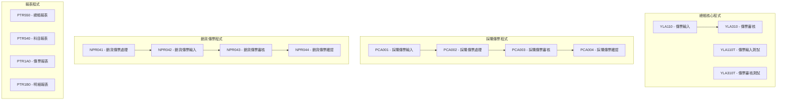
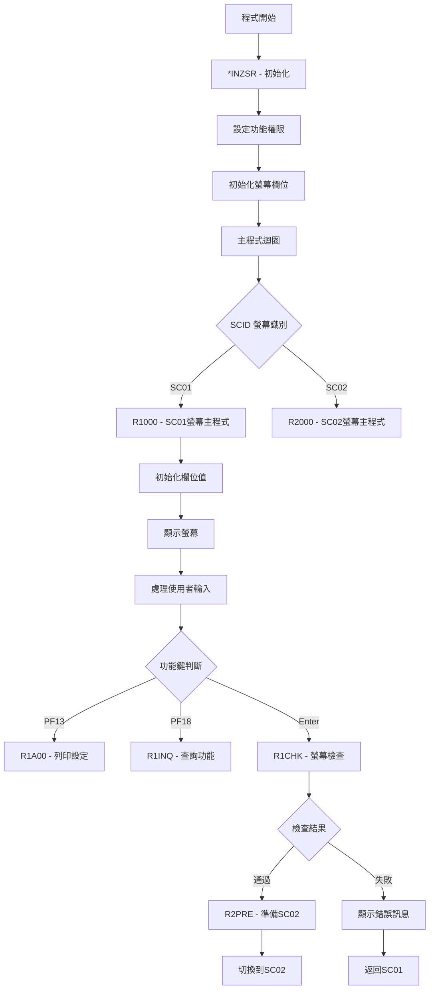
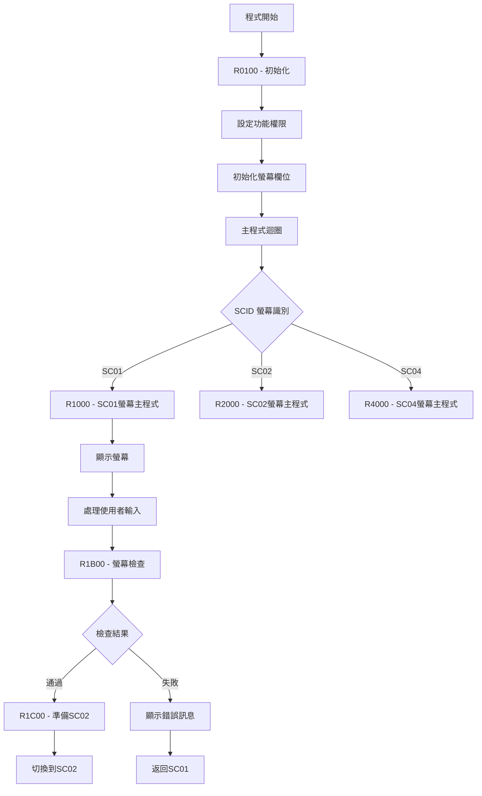
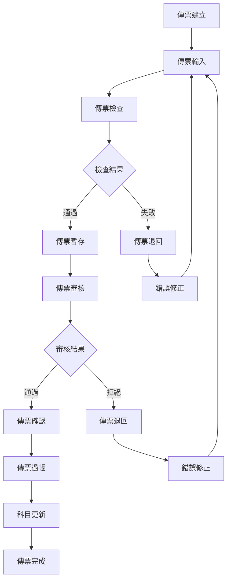
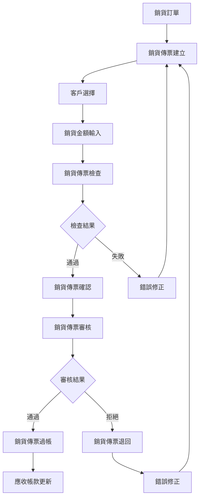
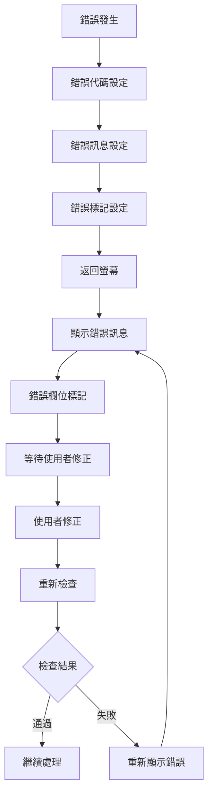
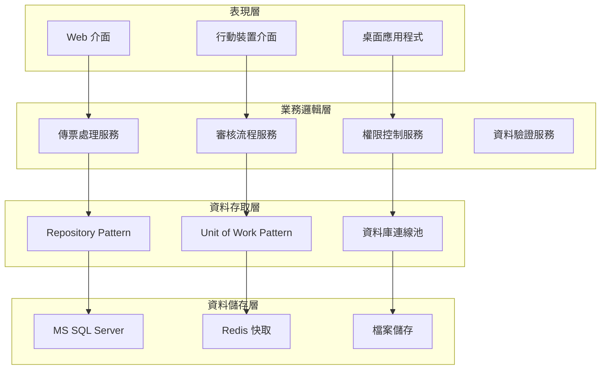

# 總帳模組業務邏輯規格書 - RPG程式分析

## 一、基本資訊

| 項目 | 說明 |
|------|------|
| **系統名稱** | 10.10.10.180 企業管理系統 |
| **模組名稱** | 總帳模組 |
| **模組代號** | GL (General Ledger) |
| **功能名稱** | 總帳管理 |
| **功能代號** | GL001 |
| **撰寫人員** | 系統分析師 |
| **撰寫日期** | 2024/12/21 |
| **審核人員** | 專案經理 |
| **審核日期** | 2024/12/21 |
| **版本編號** | v1.0 |
| **文件類型** | 業務邏輯規格書 - RPG程式分析 |
| **適用範圍** | 系統現代化轉型專案 |

---

## 二、RPG程式分析概述

### 2.1 程式目錄結構

#### 2.1.1 總帳模組核心程式

| 程式代號 | 程式名稱 | 檔案大小 | 行數 | 主要功能 |
|----------|----------|----------|------|----------|
| **YLA110** | 傳票輸入 | 74KB | 1802 | 會計傳票的輸入與處理 |
| **YLA110T** | 傳票輸入測試版 | 72KB | 1748 | 傳票輸入功能的測試版本 |
| **YLA310** | 傳票審核 | 55KB | 1337 | 會計傳票的審核與確認 |
| **YLA310T** | 傳票審核測試版 | 54KB | 1321 | 傳票審核功能的測試版本 |

#### 2.1.2 採購模組相關程式

| 程式代號 | 程式名稱 | 檔案大小 | 行數 | 主要功能 |
|----------|----------|----------|------|----------|
| **PCA001** | 採購傳票輸入 | 54KB | 1327 | 採購相關傳票的輸入 |
| **PCA001S** | 採購傳票輸入簡化版 | 53KB | 1327 | 採購傳票輸入的簡化版本 |
| **PCA002** | 採購傳票處理 | 57KB | 1327 | 採購傳票的處理邏輯 |
| **PCA002S** | 採購傳票處理簡化版 | 54KB | 1327 | 採購傳票處理的簡化版本 |

#### 2.1.3 銷貨模組相關程式

| 程式代號 | 程式名稱 | 檔案大小 | 行數 | 主要功能 |
|----------|----------|----------|------|----------|
| **NPR041** | 銷貨傳票處理 | 16KB | 370 | 銷貨相關傳票的處理 |
| **NPR042** | 銷貨傳票輸入 | 15KB | 344 | 銷貨傳票的輸入處理 |
| **NPR043** | 銷貨傳票審核 | 17KB | 344 | 銷貨傳票的審核邏輯 |
| **NPR044** | 銷貨傳票確認 | 30KB | 708 | 銷貨傳票的確認處理 |

### 2.2 程式架構分析

#### 2.2.1 程式分類架構



---

## 三、核心業務邏輯分析

### 3.1 傳票輸入業務邏輯 (YLA110)

#### 3.1.1 程式結構分析



#### 3.1.2 關鍵業務邏輯

##### 3.1.2.1 功能權限控制
```rpgle
* FUN AUT - 功能權限設定
MOVE $ADD      @A01,1    * 新增權限
MOVE $UPD      @A01,2    * 修改權限
MOVE $DLT      @A01,4    * 刪除權限
MOVE $INQ      @A01,5    * 查詢權限
```

**業務邏輯說明**：
- **權限控制機制**：程式透過LDA (Local Data Area) 取得使用者權限
- **功能權限映射**：將權限代碼映射到螢幕功能按鈕
- **動態權限顯示**：根據使用者權限動態顯示/隱藏功能按鈕

##### 3.1.2.2 螢幕欄位初始化
```rpgle
* SC01 欄位初始化
MOVEL*BLANK    DAH01     * 傳票編號
MOVEL*BLANK    #B02      * 公司代碼
Z-ADD0         DAH10     * 傳票金額
Z-ADD0         DAH21     * 借貸差額
Z-ADD0         DRSUM     * 借方合計
Z-ADD0         CRSUM     * 貸方合計
```

**業務邏輯說明**：
- **欄位清空**：所有輸入欄位初始化為空白
- **數值欄位歸零**：金額相關欄位初始化為零
- **狀態欄位重置**：借貸差額和合計欄位重置

##### 3.1.2.3 螢幕檢查邏輯
```rpgle
* 螢幕檢查流程
EXSR R1CHK                * 執行螢幕檢查
*IN99 IFEQ '0'            * 檢查結果
EXSR R2PRE                * 準備SC02
MOVEL'SC02'    SCID      * 切換螢幕
```

**業務邏輯說明**：
- **檢查順序**：先執行螢幕檢查，再決定下一步動作
- **成功處理**：檢查通過後準備下一螢幕
- **失敗處理**：檢查失敗後顯示錯誤訊息

### 3.2 傳票審核業務邏輯 (YLA310)

#### 3.2.1 程式結構分析


#### 3.2.2 關鍵業務邏輯

##### 3.2.2.1 審核狀態管理
```rpgle
* 審核狀態處理
CHAIN GLAOPF              * 讀取傳票主檔
IF %FOUND
    * 檢查傳票狀態
    IF AH05 = 'P'          * 待審核
        * 允許審核操作
    ELSE
        * 顯示狀態錯誤
    ENDIF
ENDIF
```

**業務邏輯說明**：
- **狀態檢查**：檢查傳票是否處於可審核狀態
- **權限驗證**：驗證使用者是否有審核權限
- **狀態更新**：審核完成後更新傳票狀態

### 3.3 採購傳票業務邏輯 (PCA001)

#### 3.3.1 程式結構分析



#### 3.3.2 關鍵業務邏輯

##### 3.3.2.1 資料驗證邏輯
```rpgle
* 資料驗證流程
* CHK 公司代碼是否存在 (PT#BPF)
DCA01 CHAIN#B0            * 檢查公司代碼
*IN40 IFEQ '1'
    MOVEL'UPT2010' ERRID  * 公司代碼不存在
    MOVEL'PTMF'    ERRF
    SETON 6799
ENDIF

* CHK 公司代碼是否有效 (GLAKPF)
DCA01 CHAINAK0            * 檢查公司狀態
*IN40 IFEQ '1'
    MOVEL'UPT2010' ERRID  * 公司代碼不存在
    MOVEL'PTMF'    ERRF
    SETON 6799
ENDIF
```

**業務邏輯說明**：
- **多重驗證**：對同一欄位進行多層級驗證
- **錯誤處理**：統一的錯誤代碼和訊息處理
- **狀態檢查**：檢查相關主檔的狀態有效性

##### 3.3.2.2 權限控制邏輯
```rpgle
* 權限控制檢查
* CHK FUN AUT - 檢查功能權限
DO   5         WI      30
WI    IFNE 3
@A01,WI ANDNE'Y'
    MOVEL'UPT2150' ERRID  * 權限不足
    MOVEL'PTMF'    ERRF
    SETON 99
ENDIF
END
```

**業務邏輯說明**：
- **權限陣列檢查**：檢查使用者權限陣列中的各項權限
- **動態權限驗證**：根據操作類型動態檢查對應權限
- **權限不足處理**：權限不足時顯示錯誤訊息

### 3.4 銷貨傳票業務邏輯 (NPR041)

#### 3.4.1 程式結構分析

```mermaid
flowchart TD
    A[程式開始] --> B{參數檢查}
    B -->|*IN10=1| C[R0200 - 初始化訊息]
    B -->|*IN10=0| D[R0100 - 初始化值]
    
    C --> E[主程式迴圈]
    D --> E
    
    E --> F{*IN03 檢查}
    F -->|*IN03=0| G{@PRT 檢查}
    F -->|*IN03=1| H[程式結束]
    
    G -->|@PRT=Y| I[R1000 - 螢幕處理]
    G -->|@PRT≠Y| J[列印處理]
    
    I --> K[顯示螢幕]
    K --> L[處理使用者輸入]
    L --> E
    
    J --> M[執行列印]
    M --> E
```

#### 3.4.2 關鍵業務邏輯

##### 3.4.2.1 參數化處理邏輯
```rpgle
* 參數化處理
*ENTRY    PLIST
*IN03     PARM *IN03     IN03    1
*IN10     PARM *IN10     IN10    1

* 主程式邏輯
10                EXSR R0200              * 初始化訊息
N10                EXSR R0100              * 初始化值

*IN03     DOUEQ'1'
@PRT      OREQ 'Y'
    EXSR R1000                            * 螢幕處理
END
```

**業務邏輯說明**：
- **參數化設計**：程式支援多種執行模式
- **條件初始化**：根據參數決定初始化方式
- **靈活執行**：支援螢幕模式和列印模式

---

## 四、業務規則提取

### 4.1 傳票處理業務規則

#### 4.1.1 傳票輸入規則

| 規則編號 | 規則名稱 | 規則內容 | 實作位置 |
|----------|----------|----------|----------|
| **GL001** | 傳票編號唯一性 | 傳票編號必須唯一 | YLA110 R1CHK |
| **GL002** | 借貸平衡檢查 | 借方合計必須等於貸方合計 | YLA110 R1CHK |
| **GL003** | 科目有效性檢查 | 傳票中的科目必須存在且有效 | YLA110 R1CHK |
| **GL004** | 日期有效性檢查 | 傳票日期必須在有效期間內 | YLA110 R1CHK |
| **GL005** | 金額非零檢查 | 傳票金額不能為零 | YLA110 R1CHK |

#### 4.1.2 傳票審核規則

| 規則編號 | 規則名稱 | 規則內容 | 實作位置 |
|----------|----------|----------|----------|
| **GL006** | 審核權限檢查 | 審核者必須有審核權限 | YLA310 R1CHK |
| **GL007** | 傳票狀態檢查 | 只能審核待審核狀態的傳票 | YLA310 R1CHK |
| **GL008** | 審核流程檢查 | 傳票必須經過輸入者確認 | YLA310 R1CHK |
| **GL009** | 審核時間記錄 | 記錄審核時間和審核者 | YLA310 R1CHK |

### 4.2 採購傳票業務規則

#### 4.2.1 採購傳票輸入規則

| 規則編號 | 規則名稱 | 規則內容 | 實作位置 |
|----------|----------|----------|----------|
| **PC001** | 公司代碼有效性 | 公司代碼必須存在且有效 | PCA001 R1B00 |
| **PC002** | 供應商有效性 | 供應商代碼必須存在且有效 | PCA001 R1B00 |
| **PC003** | 採購金額檢查 | 採購金額必須大於零 | PCA001 R1B00 |
| **PC004** | 採購日期檢查 | 採購日期不能超過系統日期 | PCA001 R1B00 |

#### 4.2.2 採購傳票處理規則

| 規則編號 | 規則名稱 | 規則內容 | 實作位置 |
|----------|----------|----------|----------|
| **PC005** | 採購權限檢查 | 使用者必須有採購權限 | PCA001 R1B00 |
| **PC006** | 採購狀態管理 | 採購傳票狀態必須按流程變更 | PCA001 R1B00 |
| **PC007** | 採購金額驗證 | 採購金額必須與明細金額一致 | PCA001 R1B00 |

### 4.3 銷貨傳票業務規則

#### 4.3.1 銷貨傳票處理規則

| 規則編號 | 規則名稱 | 規則內容 | 實作位置 |
|----------|----------|----------|----------|
| **NP001** | 客戶代碼有效性 | 客戶代碼必須存在且有效 | NPR041 R1000 |
| **NP002** | 銷貨金額檢查 | 銷貨金額必須大於零 | NPR041 R1000 |
| **NP003** | 銷貨日期檢查 | 銷貨日期不能超過系統日期 | NPR041 R1000 |
| **NP004** | 庫存檢查 | 銷貨數量不能超過可用庫存 | NPR041 R1000 |

---

## 五、資料結構分析

### 5.1 檔案結構分析

#### 5.1.1 總帳相關檔案

| 檔案代號 | 檔案名稱 | 檔案類型 | 主要用途 |
|----------|----------|----------|----------|
| **GLAHPF** | 傳票主檔 | 實體檔案 | 儲存傳票主要資訊 |
| **GLAFPF** | 傳票明細檔 | 實體檔案 | 儲存傳票明細資訊 |
| **GLAAPF** | 科目主檔 | 實體檔案 | 儲存會計科目資訊 |
| **GLADPF** | 科目明細檔 | 實體檔案 | 儲存科目明細資訊 |
| **GLAKPF** | 公司主檔 | 實體檔案 | 儲存公司基本資訊 |

#### 5.1.2 採購相關檔案

| 檔案代號 | 檔案名稱 | 檔案類型 | 主要用途 |
|----------|----------|----------|----------|
| **PCCAPF** | 採購傳票主檔 | 實體檔案 | 儲存採購傳票主要資訊 |
| **PCCCPF** | 採購傳票明細檔 | 實體檔案 | 儲存採購傳票明細資訊 |
| **PCA001D** | 採購傳票顯示檔 | 顯示檔案 | 採購傳票螢幕顯示 |

#### 5.1.3 銷貨相關檔案

| 檔案代號 | 檔案名稱 | 檔案類型 | 主要用途 |
|----------|----------|----------|----------|
| **NPR041D** | 銷貨傳票顯示檔 | 顯示檔案 | 銷貨傳票螢幕顯示 |
| **NPR041Z** | 銷貨傳票列印檔 | 列印檔案 | 銷貨傳票列印輸出 |

### 5.2 資料結構分析

#### 5.2.1 傳票主檔結構 (GLAHPF)

```rpgle
* 傳票主檔資料結構
D GLAHPF       DS
D  AH01                    1   10          * 傳票編號
D  AH02                    11  14          * 年度
D  AH03                    15  22          * 傳票日期
D  AH04                    23  30          * 科目代碼
D  AH05                    31  31          * 傳票狀態
D  AH06                    32  39          * 傳票金額
D  AH07                    40  47          * 借方金額
D  AH08                    48  55          * 貸方金額
D  AH09                    56  63          * 摘要
D  AH10                    64  71          * 建立者
D  AH11                    72  79          * 建立時間
D  AH12                    80  87          * 修改者
D  AH13                    88  95          * 修改時間
```

#### 5.2.2 傳票明細檔結構 (GLAFPF)

```rpgle
* 傳票明細檔資料結構
D GLAFPF       DS
D  AF01                    1   10          * 傳票編號
D  AF02                    11  18          * 明細序號
D  AF03                    19  26          * 科目代碼
D  AF04                    27  34          * 借方金額
D  AF05                    35  42          * 貸方金額
D  AF06                    43  50          * 摘要
D  AF07                    51  58          * 參考號碼
D  AF08                    59  66          * 建立者
D  AF09                    67  74          * 建立時間
```

---

## 六、業務流程分析

### 6.1 傳票處理完整流程

#### 6.1.1 傳票生命週期



#### 6.1.2 傳票狀態轉換

| 狀態代碼 | 狀態名稱 | 狀態說明 | 允許操作 |
|----------|----------|----------|----------|
| **D** | 草稿 | 傳票剛建立，未完成輸入 | 修改、刪除 |
| **P** | 待審核 | 傳票輸入完成，等待審核 | 審核、退回 |
| **A** | 已審核 | 傳票已審核通過 | 過帳、退回 |
| **C** | 已過帳 | 傳票已過帳到科目 | 查詢、報表 |
| **X** | 已作廢 | 傳票已作廢 | 查詢 |

### 6.2 採購傳票處理流程

#### 6.2.1 採購傳票流程


### 6.3 銷貨傳票處理流程

#### 6.3.1 銷貨傳票流程



---

## 七、錯誤處理分析

### 7.1 錯誤代碼體系

#### 7.1.1 總帳模組錯誤代碼

| 錯誤代碼 | 錯誤訊息 | 錯誤類型 | 處理方式 |
|----------|----------|----------|----------|
| **UPT0010** | 必填欄位不能為空白 | 資料驗證錯誤 | 使用者修正 |
| **UPT2010** | 代碼不存在 | 參照完整性錯誤 | 檢查代碼 |
| **UPT2150** | 權限不足 | 權限控制錯誤 | 申請權限 |
| **UGL0004** | 科目代碼無效 | 業務邏輯錯誤 | 檢查科目 |

#### 7.1.2 採購模組錯誤代碼

| 錯誤代碼 | 錯誤訊息 | 錯誤類型 | 處理方式 |
|----------|----------|----------|----------|
| **UPT0010** | 必填欄位不能為空白 | 資料驗證錯誤 | 使用者修正 |
| **UPT2010** | 代碼不存在 | 參照完整性錯誤 | 檢查代碼 |
| **UPT2072** | 新增權限不足 | 權限控制錯誤 | 申請權限 |

#### 7.1.3 銷貨模組錯誤代碼

| 錯誤代碼 | 錯誤訊息 | 錯誤類型 | 處理方式 |
|----------|----------|----------|----------|
| **UPT0010** | 必填欄位不能為空白 | 資料驗證錯誤 | 使用者修正 |
| **UPT2010** | 代碼不存在 | 參照完整性錯誤 | 檢查代碼 |

### 7.2 錯誤處理機制

#### 7.2.1 錯誤處理流程



#### 7.2.2 錯誤處理實作

```rpgle
* 錯誤處理實作範例
* 設定錯誤代碼和訊息
MOVEL'UPT0010' ERRID      * 錯誤代碼
MOVEL'PTMF'    ERRF       * 錯誤檔案
SETON 6799                * 錯誤標記

* 錯誤處理後的返回
99                GOTO E1B00    * 返回錯誤處理結束
```

---

## 八、效能優化分析

### 8.1 資料庫存取優化

#### 8.1.1 索引使用分析

```rpgle
* 索引鍵值定義
KEYAF     KLIST
    KFLD           DAH01          * 傳票編號
    KFLD           AF02           * 明細序號

KEYAA     KLIST
    KFLD           DAH01          * 傳票編號
    KFLD           W02,WI         * 公司代碼
```

**優化說明**：
- **複合索引**：使用複合索引提升查詢效能
- **鍵值順序**：按照查詢頻率排序索引鍵值
- **索引選擇**：根據查詢條件選擇適當的索引

#### 8.1.2 批次處理優化

```rpgle
* 批次處理實作
* 使用 CHAIN 進行單筆查詢
DCA01     CHAIN#B0               * 檢查公司代碼

* 使用 READ 進行批次查詢
READ DSPD1                       * 批次讀取資料
```

**優化說明**：
- **單筆查詢**：使用 CHAIN 進行精確查詢
- **批次查詢**：使用 READ 進行範圍查詢
- **查詢策略**：根據查詢需求選擇適當的查詢方式

### 8.2 記憶體使用優化

#### 8.2.1 資料結構優化

```rpgle
* 資料結構定義
* 使用適當的資料類型
D  DAH01                    1   10          * 傳票編號 (CHAR)
D  DAH10                    11  18          * 傳票金額 (PACKED)
D  DAH21                    19  26          * 借貸差額 (PACKED)
```

**優化說明**：
- **資料類型選擇**：根據資料特性選擇適當的資料類型
- **記憶體配置**：優化資料結構的記憶體配置
- **存取效率**：提升資料存取的效率

---

## 九、現代化轉型建議

### 9.1 架構轉型建議

#### 9.1.1 分層架構設計



#### 9.1.2 服務導向架構

| 服務名稱 | 服務職責 | 對應RPG程式 | 轉換策略 |
|----------|----------|-------------|----------|
| **傳票管理服務** | 傳票的CRUD操作 | YLA110, YLA310 | 重構為C#服務 |
| **採購傳票服務** | 採購傳票處理 | PCA001, PCA002 | 重構為C#服務 |
| **銷貨傳票服務** | 銷貨傳票處理 | NPR041, NPR042 | 重構為C#服務 |
| **權限控制服務** | 使用者權限管理 | 各程式中的權限檢查 | 重構為C#服務 |

### 9.2 技術轉型建議

#### 9.2.1 程式語言轉換

| RPG 結構 | C# 對應 | 轉換說明 |
|----------|----------|----------|
| **主程式** | Main Program | 使用 Program.cs 作為程式進入點 |
| **子程序** | Private Methods | 將 RPG 子程序轉換為 C# 私有方法 |
| **資料結構** | Classes/Models | 將 RPG 資料結構轉換為 C# 類別 |
| **檔案操作** | Repository Pattern | 使用 Repository 模式處理資料存取 |
| **錯誤處理** | Exception Handling | 使用 C# 例外處理機制 |

#### 9.2.2 資料庫轉換

| AS/400 檔案 | MS SQL 資料表 | 轉換說明 |
|-------------|----------------|----------|
| **GLAHPF** | GL_Vouchers | 傳票主檔 |
| **GLAFPF** | GL_VoucherEntries | 傳票明細檔 |
| **GLAAPF** | GL_Accounts | 科目主檔 |
| **GLADPF** | GL_AccountDetails | 科目明細檔 |
| **GLAKPF** | GL_Companies | 公司主檔 |

### 9.3 業務邏輯轉換建議

#### 9.3.1 業務規則轉換

```csharp
// 傳票借貸平衡檢查
public class VoucherBalanceValidator : IValidator<Voucher>
{
    public ValidationResult Validate(Voucher voucher)
    {
        var debitTotal = voucher.Entries
            .Where(e => e.EntryType == EntryType.Debit)
            .Sum(e => e.Amount);
            
        var creditTotal = voucher.Entries
            .Where(e => e.EntryType == EntryType.Credit)
            .Sum(e => e.Amount);
            
        if (Math.Abs(debitTotal - creditTotal) > 0.01m)
        {
            return ValidationResult.Failure("借貸不平衡");
        }
        
        return ValidationResult.Success();
    }
}
```

#### 9.3.2 權限控制轉換

```csharp
// 權限控制服務
public class PermissionService : IPermissionService
{
    public bool HasPermission(string userId, string function, string permission)
    {
        var userPermissions = _permissionRepository
            .GetUserPermissions(userId);
            
        return userPermissions
            .Any(p => p.Function == function && 
                     p.Permission == permission);
    }
}
```

---

## 十、總結與建議

### 10.1 業務邏輯分析總結

#### 10.1.1 核心業務邏輯

1. **傳票處理邏輯**：完整的傳票生命週期管理
2. **權限控制邏輯**：多層級的權限控制機制
3. **資料驗證邏輯**：完整的資料驗證和錯誤處理
4. **狀態管理邏輯**：清晰的狀態轉換和流程控制

#### 10.1.2 技術特點

1. **模組化設計**：清晰的程式模組劃分
2. **參數化處理**：支援多種執行模式
3. **錯誤處理機制**：統一的錯誤代碼和處理流程
4. **效能優化**：適當的索引和查詢策略

### 10.2 現代化轉型建議

#### 10.2.1 短期目標

1. **業務邏輯提取**：完整提取現有業務邏輯
2. **資料結構分析**：分析現有資料結構和關聯
3. **介面設計**：設計現代化的使用者介面

#### 10.2.2 中期目標

1. **服務重構**：將業務邏輯重構為現代化服務
2. **資料庫轉換**：完成資料庫結構轉換
3. **系統整合**：完成新舊系統的整合

#### 10.2.3 長期目標

1. **系統現代化**：完成整個系統的現代化轉型
2. **效能提升**：提升系統效能和可擴展性
3. **維護簡化**：簡化系統維護和升級流程

### 10.3 風險控制建議

#### 10.3.1 技術風險

1. **資料轉換風險**：建立完整的資料驗證機制
2. **功能遺失風險**：確保所有功能完整轉換
3. **效能風險**：進行充分的效能測試

#### 10.3.2 業務風險

1. **業務中斷風險**：採用漸進式轉換策略
2. **資料一致性風險**：建立資料一致性檢查機制
3. **使用者適應風險**：提供充分的培訓和支援

---

## 十一、修訂記錄

| 版本 | 修訂日期 | 修訂人員 | 修訂內容 | 修訂原因 |
|------|----------|----------|----------|----------|
| v1.0 | 2024/12/21 | 系統分析師 | 初始版本 | 文件建立 |

---

**文件建立日期**：2024年12月21日  
**最後更新日期**：2024年12月21日  
**文件狀態**：草稿  
**下次檢討日期**：2025年1月21日 