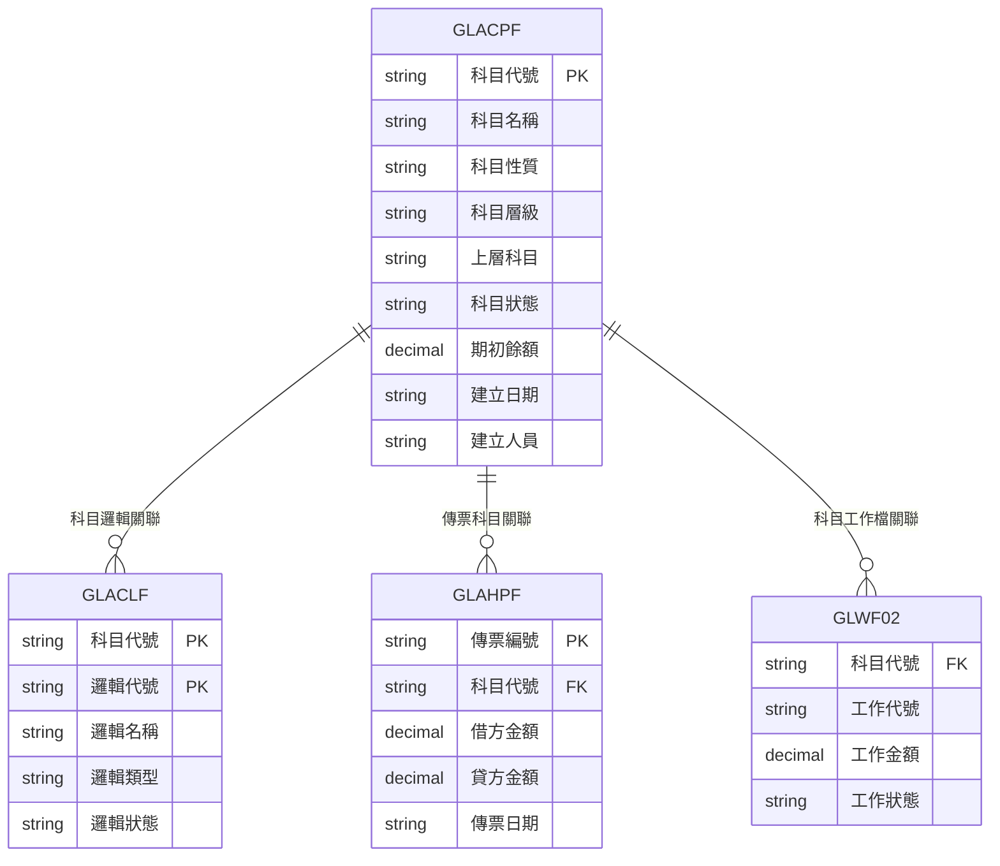
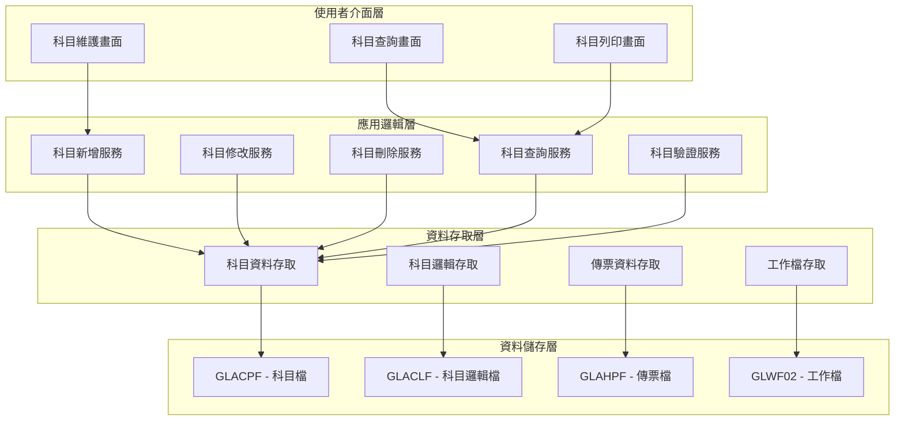
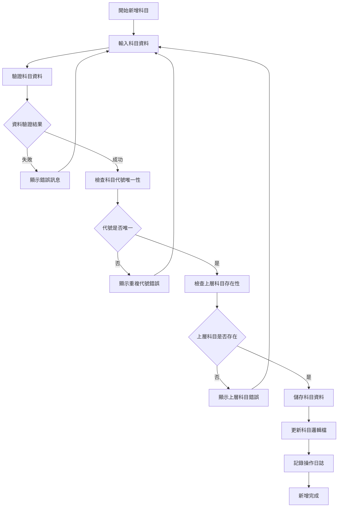
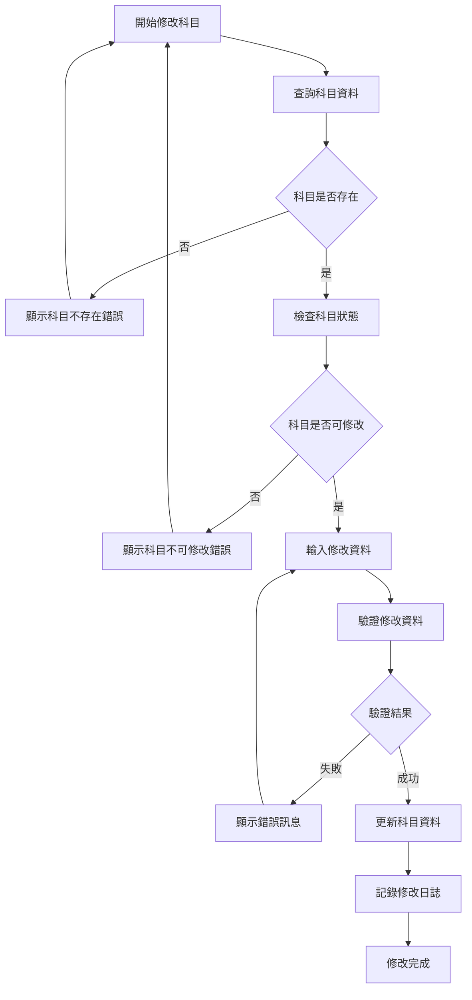
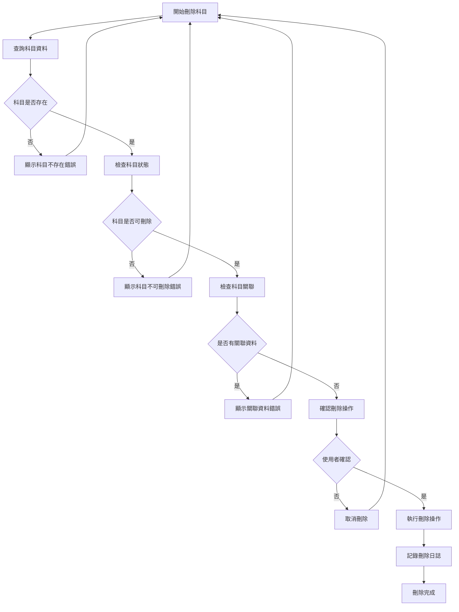
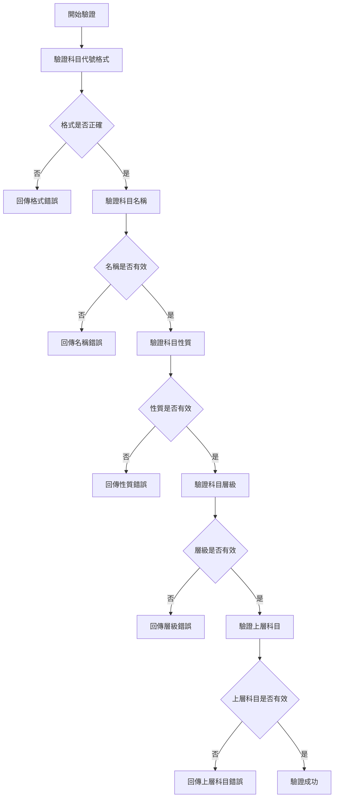
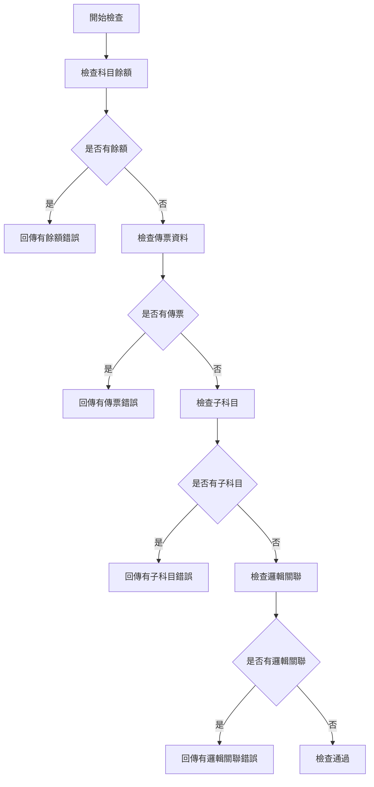
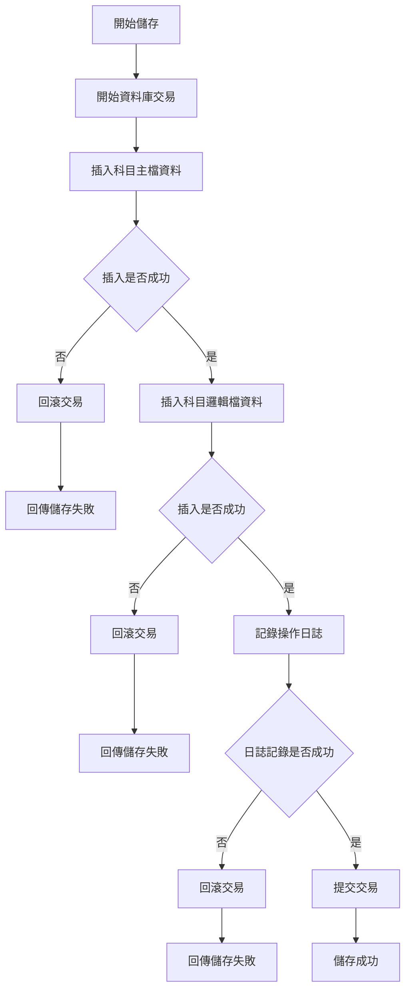
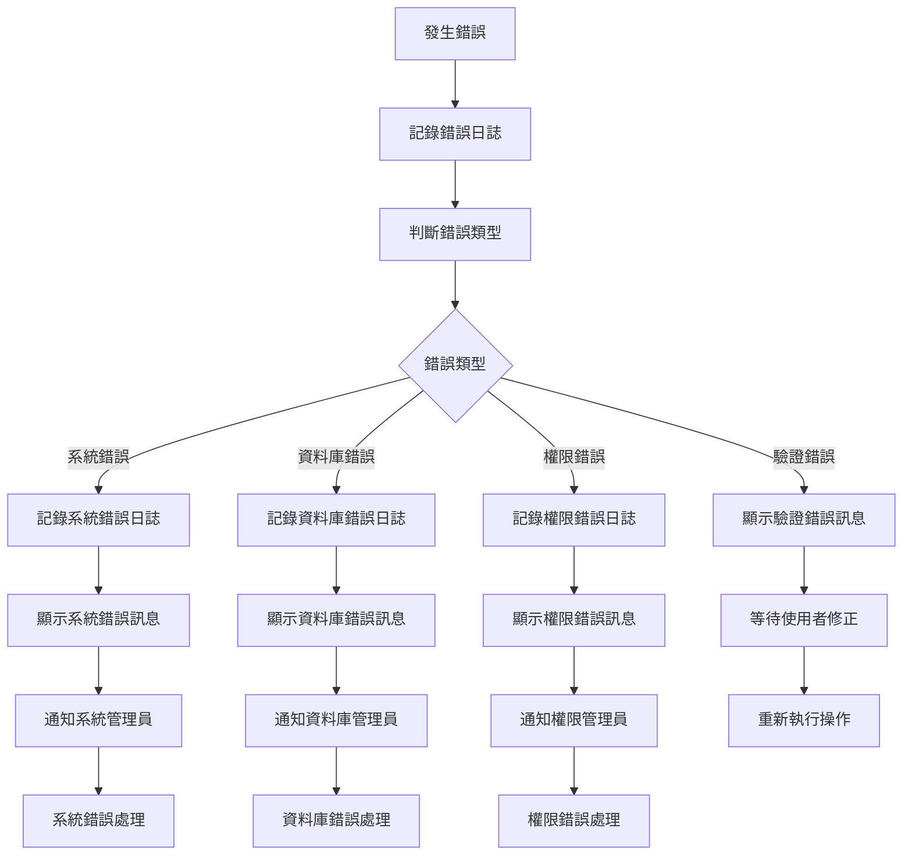

# 總帳模組 程式功能規格書 - 基本資料維護

## 文件基本資訊

| 項目 | 說明 |
|------|------|
| **文件名稱** | 總帳模組程式功能規格書 - 基本資料維護 |
| **模組代號** | GL |
| **版本** | v1.0 |
| **建立日期** | 2024年12月21日 |
| **建立人員** | 系統分析師 |
| **審核人員** | 專案經理 |
| **文件狀態** | 初稿 |
| **最後更新** | 2024年12月21日 |

---

## 目錄

1. [基本資料](#基本資料)
2. [檔案架構與關聯圖](#檔案架構與關聯圖)
3. [檔案名稱與欄位規格](#檔案名稱與欄位規格)
4. [輸出/入螢幕布局與說明](#輸出入螢幕布局與說明)
5. [處理流程程序說明](#處理流程程序說明)
6. [子程序處理邏輯說明](#子程序處理邏輯說明)
7. [錯誤處理程序說明與訊息清冊](#錯誤處理程序說明與訊息清冊)
8. [備註](#備註)

---

## 基本資料

### 1.1 模組概述

#### 1.1.1 模組功能說明
總帳模組的基本資料維護功能主要負責管理會計科目的基本資訊，包括科目的新增、修改、刪除、查詢等操作。此功能是總帳系統的基礎，為會計傳票處理、報表產生等後續作業提供必要的科目資料支援。

#### 1.1.2 模組特色
- **科目結構管理**：支援多層級的會計科目結構，便於財務報表的產生
- **科目狀態控制**：提供科目的啟用、停用、刪除等狀態管理功能
- **科目權限管理**：根據使用者角色設定不同的科目操作權限
- **科目驗證機制**：確保科目資料的完整性和正確性
- **科目關聯檢查**：防止誤刪有餘額或關聯資料的科目

#### 1.1.3 適用範圍
適用於企業會計系統中的科目管理作業，包括財務會計、管理會計、成本會計等各類會計科目的維護作業。

### 1.2 技術架構

#### 1.2.1 開發技術
- **程式語言**：RPG、CL、SQL
- **資料庫**：DB2 for i (IBM i)
- **開發工具**：IBM i 開發環境
- **部署環境**：IBM i 7.4

#### 1.2.2 系統需求
- **硬體需求**：IBM i 伺服器
- **軟體需求**：IBM i 作業系統、DB2 for i
- **網路需求**：企業內部網路連線

---

## 檔案架構與關聯圖

### 2.1 資料庫檔案架構

#### 2.1.1 主要資料表


#### 2.1.2 檔案關聯說明
- **GLACPF (會計科目檔)**：儲存會計科目的基本資訊，是科目維護的主要檔案
- **GLACLF (會計科目邏輯檔)**：儲存科目的邏輯分類和對應關係
- **GLAHPF (會計傳票檔)**：儲存會計傳票資料，與科目檔建立關聯
- **GLWF02 (科目工作檔)**：儲存科目處理過程中的臨時資料

### 2.2 系統架構圖

#### 2.2.1 基本資料維護系統架構


---

## 檔案名稱與欄位規格

### 3.1 主要檔案規格

#### 3.1.1 GLACPF - 會計科目檔

| 欄位代號 | 欄位名稱 | 位置 | 長度 | 型態 | 屬性 | 檢核說明 |
|----------|----------|------|------|------|------|----------|
| GLACCD | 科目代號 | 1-10 | 10 | A | PK | 必填，唯一值，格式：XXXX-XXXX |
| GLACNM | 科目名稱 | 11-50 | 40 | A | M | 必填，不能為空白 |
| GLACTP | 科目性質 | 51-52 | 2 | A | M | 必填，值：01-資產、02-負債、03-權益、04-收入、05-支出 |
| GLACLV | 科目層級 | 53-54 | 2 | N | M | 必填，值：01-4級，01為最上層 |
| GLACUP | 上層科目 | 55-64 | 10 | A | O | 選填，上層科目代號，最上層為空白 |
| GLACST | 科目狀態 | 65-66 | 2 | A | M | 必填，值：01-有效、02-停用、03-刪除 |
| GLACBD | 期初餘額 | 67-82 | 16 | P | O | 選填，期初餘額，小數點後2位 |
| GLACCR | 建立日期 | 83-90 | 8 | D | M | 必填，系統自動產生 |
| GLACUS | 建立人員 | 91-100 | 10 | A | M | 必填，使用者代號 |
| GLACUD | 更新日期 | 101-108 | 8 | D | O | 選填，最後更新日期 |
| GLACUU | 更新人員 | 109-118 | 10 | A | O | 選填，最後更新人員 |

#### 3.1.2 GLACLF - 會計科目邏輯檔

| 欄位代號 | 欄位名稱 | 位置 | 長度 | 型態 | 屬性 | 檢核說明 |
|----------|----------|------|------|------|------|----------|
| GLACCD | 科目代號 | 1-10 | 10 | A | PK,FK | 必填，參照GLACPF |
| GLLGCD | 邏輯代號 | 11-20 | 10 | A | PK | 必填，邏輯分類代號 |
| GLLGNM | 邏輯名稱 | 21-60 | 40 | A | M | 必填，邏輯分類名稱 |
| GLLGTP | 邏輯類型 | 61-62 | 2 | A | M | 必填，值：01-成本中心、02-專案、03-部門 |
| GLLGST | 邏輯狀態 | 63-64 | 2 | A | M | 必填，值：01-有效、02-停用 |
| GLLGCR | 建立日期 | 65-72 | 8 | D | M | 必填，系統自動產生 |
| GLLGUS | 建立人員 | 73-82 | 10 | A | M | 必填，使用者代號 |

### 3.2 索引資料

#### 3.2.1 主要索引
- **GLACPF 主鍵索引**：GLACCD (科目代號)
- **GLACPF 上層科目索引**：GLACUP (上層科目)
- **GLACPF 科目性質索引**：GLACTP (科目性質)
- **GLACPF 科目狀態索引**：GLACST (科目狀態)

#### 3.2.2 次要索引
- **GLACLF 主鍵索引**：GLACCD + GLLGCD (科目代號 + 邏輯代號)
- **GLACLF 邏輯類型索引**：GLLGTP (邏輯類型)

---

## 輸出/入螢幕布局與說明

### 4.1 科目維護主畫面

#### 4.1.1 畫面布局
```
┌─────────────────────────────────────────────────────────────┐
│                    會計科目維護系統                        │
├─────────────────────────────────────────────────────────────┤
│ 功能選項：                                                  │
│  [1]新增科目  [2]修改科目  [3]刪除科目  [4]查詢科目      │
│  [5]科目列印  [6]科目匯入  [7]科目匯出  [8]離開系統      │
├─────────────────────────────────────────────────────────────┤
│ 科目代號：[          ] 科目名稱：[                          ] │
│ 科目性質：[  ] 科目層級：[  ] 上層科目：[          ]        │
│ 科目狀態：[  ] 期初餘額：[                ]                │
├─────────────────────────────────────────────────────────────┤
│ 操作訊息：[                                                ] │
├─────────────────────────────────────────────────────────────┤
│ 功能鍵說明：                                                │
│  F1=說明  F3=離開  F4=提示  F9=重新整理  F12=取消        │
└─────────────────────────────────────────────────────────────┘
```

#### 4.1.2 畫面說明
- **功能選項區**：提供科目維護的主要功能選項
- **科目資料區**：顯示或輸入科目基本資料
- **操作訊息區**：顯示系統操作結果和錯誤訊息
- **功能鍵區**：說明可使用的功能鍵

### 4.2 科目查詢畫面

#### 4.2.1 畫面布局
```
┌─────────────────────────────────────────────────────────────┐
│                    會計科目查詢系統                        │
├─────────────────────────────────────────────────────────────┤
│ 查詢條件：                                                  │
│  科目代號：[          ] 科目名稱：[                          ] │
│  科目性質：[  ] 科目層級：[  ] 科目狀態：[  ]              │
├─────────────────────────────────────────────────────────────┤
│ 查詢結果：                                                  │
│ ┌─────┬──────────┬────────────────────┬─────┬─────┬─────┐ │
│ │序號 │科目代號  │科目名稱            │性質 │層級 │狀態 │ │
│ ├─────┼──────────┼────────────────────┼─────┼─────┼─────┤ │
│ │  1  │1000-0000│現金及約當現金      │01   │01   │01   │ │
│ │  2  │1000-1000│銀行存款            │01   │02   │01   │ │
│ │  3  │1000-2000│短期投資            │01   │02   │01   │ │
│ └─────┴──────────┴────────────────────┴─────┴─────┴─────┘ │
├─────────────────────────────────────────────────────────────┤
│ 功能鍵：F1=說明  F3=離開  F4=查詢  F9=重新整理  F12=取消  │
└─────────────────────────────────────────────────────────────┘
```

---

## 處理流程程序說明

### 5.1 科目新增流程

#### 5.1.1 主要處理流程


#### 5.1.2 資料驗證規則
1. **科目代號驗證**：必須符合編碼規則，長度為10位，格式為XXXX-XXXX
2. **科目名稱驗證**：不能為空白，長度不能超過40位
3. **科目性質驗證**：必須是有效的科目性質代碼
4. **科目層級驗證**：層級值必須在01-04之間
5. **上層科目驗證**：如果指定上層科目，該科目必須存在且有效

### 5.2 科目修改流程

#### 5.2.1 主要處理流程


#### 5.2.2 修改限制規則
1. **已刪除科目**：不能修改已刪除的科目
2. **有餘額科目**：有期初餘額的科目不能修改科目性質
3. **有傳票科目**：已有傳票資料的科目不能修改科目代號
4. **有子科目**：有子科目的科目不能修改科目層級

### 5.3 科目刪除流程

#### 5.3.1 主要處理流程


#### 5.3.2 刪除限制規則
1. **有餘額科目**：有期初餘額的科目不能刪除
2. **有傳票科目**：已有傳票資料的科目不能刪除
3. **有子科目**：有子科目的科目不能刪除
4. **系統科目**：系統預設的科目不能刪除

---

## 子程序處理邏輯說明

### 6.1 科目資料驗證子程序

#### 6.1.1 驗證邏輯


#### 6.1.2 驗證規則詳述
1. **科目代號格式驗證**
   - 長度必須為10位
   - 格式必須為XXXX-XXXX
   - 只能包含數字和連字號

2. **科目名稱驗證**
   - 不能為空白
   - 長度不能超過40位
   - 不能包含特殊字元

3. **科目性質驗證**
   - 必須是預定義的有效代碼
   - 01：資產類
   - 02：負債類
   - 03：權益類
   - 04：收入類
   - 05：支出類

4. **科目層級驗證**
   - 層級值必須在01-04之間
   - 01：最上層科目
   - 02：第二層科目
   - 03：第三層科目
   - 04：第四層科目

### 6.2 科目關聯檢查子程序

#### 6.2.1 檢查邏輯


#### 6.2.2 檢查項目詳述
1. **科目餘額檢查**
   - 檢查GLACPF.期初餘額欄位
   - 檢查GLWF02工作檔中的餘額資料
   - 檢查GLWF11-14等餘額相關工作檔

2. **傳票資料檢查**
   - 檢查GLAHPF傳票檔中的科目使用情況
   - 檢查GLWF01傳票工作檔中的科目使用情況
   - 檢查是否有未過帳的傳票資料

3. **子科目檢查**
   - 檢查GLACPF中是否有其他科目的上層科目欄位指向此科目
   - 檢查科目層級關係的完整性

4. **邏輯關聯檢查**
   - 檢查GLACLF科目邏輯檔中的關聯資料
   - 檢查是否有其他模組的邏輯分類指向此科目

### 6.3 科目資料儲存子程序

#### 6.3.1 儲存邏輯


#### 6.3.2 儲存注意事項
1. **交易控制**
   - 所有資料庫操作必須在交易控制下進行
   - 任何步驟失敗都必須回滾整個交易
   - 只有所有步驟成功才提交交易

2. **資料完整性**
   - 主檔和邏輯檔的資料必須保持一致性
   - 科目代號在主檔和邏輯檔中必須完全一致
   - 建立日期和建立人員必須正確記錄

3. **日誌記錄**
   - 必須記錄所有科目的新增、修改、刪除操作
   - 日誌記錄必須包含操作時間、操作人員、操作內容
   - 日誌記錄失敗不影響主要業務操作

---

## 錯誤處理程序說明與訊息清冊

### 7.1 錯誤處理程序

#### 7.1.1 錯誤處理流程


#### 7.1.2 錯誤處理原則
1. **使用者友善性**：錯誤訊息必須清楚易懂，提供修正建議
2. **日誌完整性**：所有錯誤都必須記錄詳細的日誌資訊
3. **錯誤分類**：根據錯誤類型採取不同的處理策略
4. **系統穩定性**：錯誤處理不能影響系統的正常運行

### 7.2 錯誤訊息清冊

#### 7.2.1 驗證錯誤訊息

| 錯誤代碼 | 錯誤訊息 | 錯誤原因 | 解決方法 |
|----------|----------|----------|----------|
| **GL001** | 科目代號格式錯誤 | 科目代號不符合XXXX-XXXX格式 | 請檢查科目代號格式，必須為10位數字和連字號組合 |
| **GL002** | 科目名稱不能為空白 | 科目名稱欄位為空白 | 請輸入科目名稱，長度不能超過40位 |
| **GL003** | 科目性質代碼無效 | 輸入的科目性質代碼不在有效範圍內 | 請選擇有效的科目性質：01-資產、02-負債、03-權益、04-收入、05-支出 |
| **GL004** | 科目層級值無效 | 科目層級值不在01-04範圍內 | 請輸入有效的科目層級值，範圍為01-04 |
| **GL005** | 上層科目不存在 | 指定的上層科目代號在系統中不存在 | 請檢查上層科目代號，或選擇不指定上層科目 |

#### 7.2.2 業務邏輯錯誤訊息

| 錯誤代碼 | 錯誤訊息 | 錯誤原因 | 解決方法 |
|----------|----------|----------|----------|
| **GL006** | 科目代號已存在 | 要新增的科目代號在系統中已存在 | 請使用不同的科目代號，或先刪除現有的科目 |
| **GL007** | 科目不可修改 | 科目狀態或業務規則不允許修改 | 請檢查科目狀態，或聯繫系統管理員 |
| **GL008** | 科目不可刪除 | 科目有餘額、傳票或子科目，不能刪除 | 請先處理相關資料，或聯繫會計人員 |
| **GL009** | 上層科目狀態無效 | 指定的上層科目已停用或刪除 | 請選擇有效的上層科目，或選擇不指定上層科目 |
| **GL010** | 科目層級關係錯誤 | 子科目的層級值小於或等於上層科目 | 請檢查科目層級設定，子科目層級必須大於上層科目 |

#### 7.2.3 系統錯誤訊息

| 錯誤代碼 | 錯誤訊息 | 錯誤原因 | 解決方法 |
|----------|----------|----------|----------|
| **GL901** | 資料庫連線失敗 | 無法連接到資料庫系統 | 請檢查網路連線，或聯繫系統管理員 |
| **GL902** | 資料庫交易失敗 | 資料庫交易執行失敗 | 請重新執行操作，或聯繫資料庫管理員 |
| **GL903** | 檔案存取權限不足 | 使用者沒有存取相關檔案的權限 | 請聯繫系統管理員檢查使用者權限 |
| **GL904** | 系統資源不足 | 系統記憶體或磁碟空間不足 | 請聯繫系統管理員檢查系統資源 |
| **GL905** | 程式執行異常 | 程式執行過程中發生未預期的錯誤 | 請記錄錯誤訊息，並聯繫系統管理員 |

### 7.3 錯誤處理建議

#### 7.3.1 使用者操作建議
1. **仔細檢查輸入資料**：在提交前仔細檢查所有輸入欄位的內容
2. **參考錯誤訊息**：根據錯誤訊息提供的建議進行修正
3. **記錄錯誤情況**：如果錯誤持續發生，請記錄詳細的錯誤情況
4. **尋求技術支援**：對於無法解決的錯誤，請聯繫技術支援人員

#### 7.3.2 系統管理建議
1. **定期檢查錯誤日誌**：定期檢查系統錯誤日誌，及時發現和處理問題
2. **監控系統資源**：定期監控系統資源使用情況，預防資源不足問題
3. **備份重要資料**：定期備份重要的科目資料，防止資料遺失
4. **更新系統版本**：及時更新系統版本，修復已知的錯誤和漏洞

---

## 備註

### 8.1 開發注意事項

#### 8.1.1 程式開發注意事項
1. **資料驗證**：所有使用者輸入都必須進行嚴格的資料驗證
2. **交易控制**：涉及多個檔案的操作必須使用交易控制
3. **錯誤處理**：必須提供完整的錯誤處理機制
4. **效能優化**：對於大量資料的查詢和處理，必須考慮效能優化
5. **安全性**：必須實施適當的權限控制和資料安全措施

#### 8.1.2 測試注意事項
1. **單元測試**：每個子程序都必須進行單元測試
2. **整合測試**：必須測試與其他模組的整合情況
3. **效能測試**：必須測試大量資料處理的效能表現
4. **安全性測試**：必須測試權限控制和資料安全機制
5. **使用者測試**：必須進行使用者接受度測試

### 8.2 維護注意事項

#### 8.2.1 日常維護注意事項
1. **定期備份**：定期備份科目資料和相關設定
2. **效能監控**：定期監控系統效能，及時發現和解決問題
3. **錯誤分析**：定期分析錯誤日誌，改進系統穩定性
4. **使用者培訓**：定期進行使用者培訓，提高操作效率
5. **文件更新**：及時更新相關技術文件和操作手冊

#### 8.2.2 版本更新注意事項
1. **相容性檢查**：更新前必須檢查與現有系統的相容性
2. **資料遷移**：必要時進行資料遷移和轉換
3. **回滾計畫**：制定詳細的回滾計畫，以應對更新失敗
4. **使用者通知**：提前通知使用者系統更新計畫
5. **測試驗證**：更新後必須進行充分的測試驗證

### 8.3 未來擴充建議

#### 8.3.1 功能擴充建議
1. **多語言支援**：增加多語言支援，滿足國際化需求
2. **行動裝置支援**：開發行動裝置應用程式，提供隨時隨地的科目維護功能
3. **進階查詢功能**：增加進階查詢功能，支援複雜的查詢條件
4. **報表功能**：增加科目相關的報表功能，提供更好的資料分析能力
5. **整合功能**：增加與其他系統的整合功能，提高資料一致性

#### 8.3.2 技術改進建議
1. **雲端部署**：考慮將系統部署到雲端，提高可用性和擴展性
2. **微服務架構**：考慮採用微服務架構，提高系統的模組化和可維護性
3. **人工智慧應用**：考慮在科目分類和驗證中應用人工智慧技術
4. **區塊鏈技術**：考慮使用區塊鏈技術提高資料的安全性和可追溯性
5. **API標準化**：制定標準的API規範，便於與其他系統的整合

---

## 附錄

### A.1 相關文件清單
- 總帳模組程式功能規格書 - 總帳管理
- 總帳模組操作手冊 - 基本資料維護
- 總帳模組技術文件 - 系統架構
- 總帳模組業務邏輯分析文件

### A.2 修訂記錄

| 版本 | 修訂日期 | 修訂人員 | 修訂內容 | 修訂原因 |
|------|----------|----------|----------|----------|
| v1.0 | 2024/12/21 | 系統分析師 | 初始版本建立 | 新功能開發 |

### A.3 聯絡資訊
- **專案經理**：[專案經理姓名]
- **系統分析師**：[系統分析師姓名]
- **技術支援**：[技術支援聯絡方式]
- **專案信箱**：[專案信箱地址]
