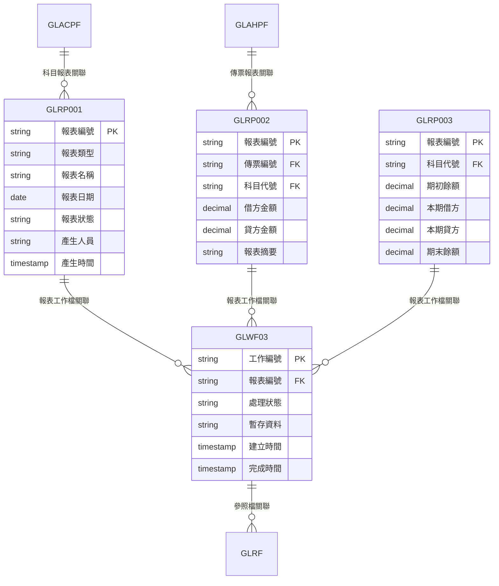
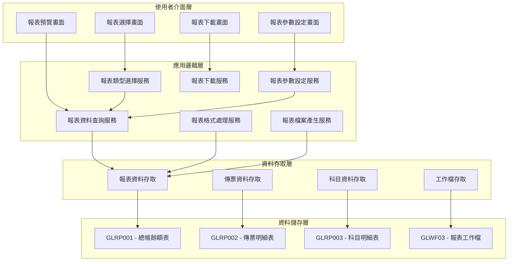
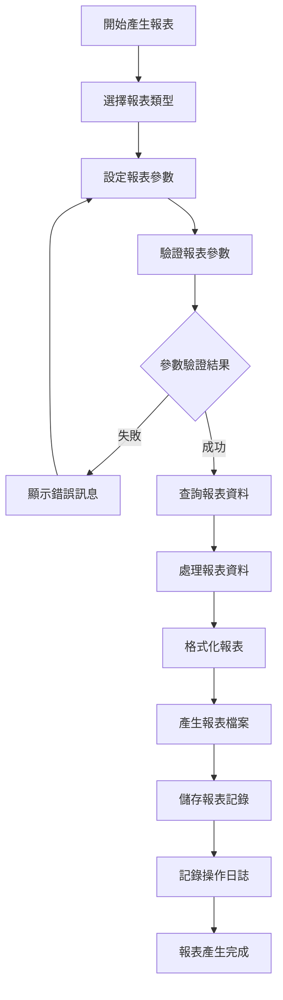
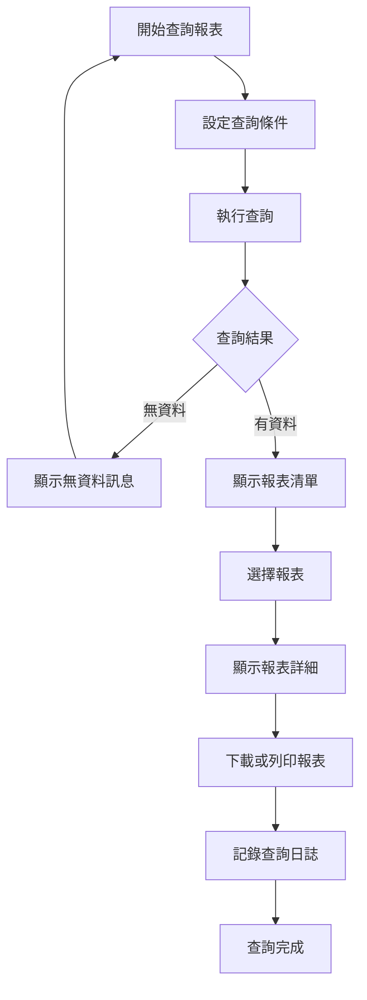
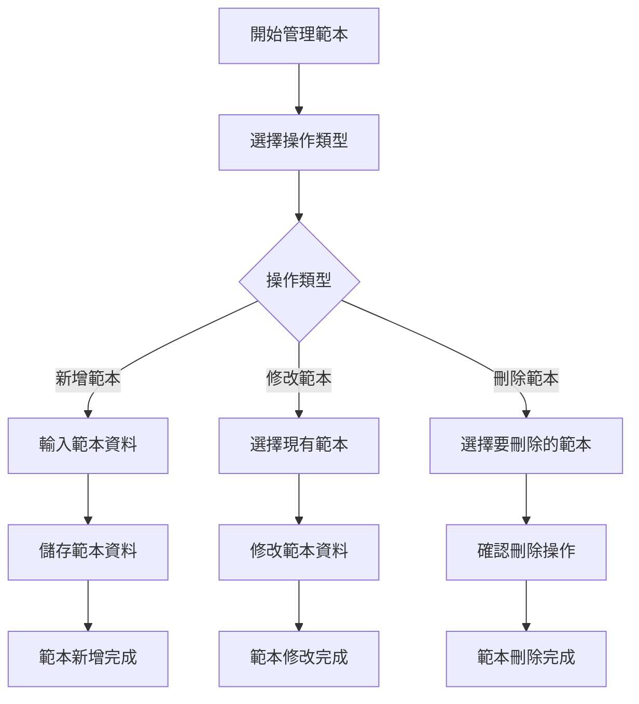
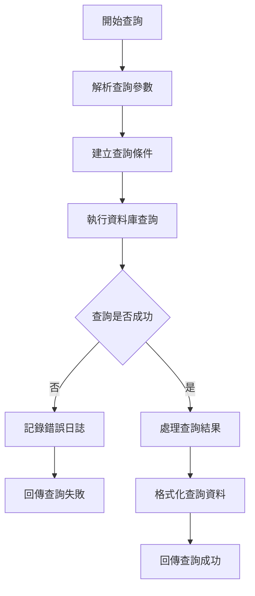
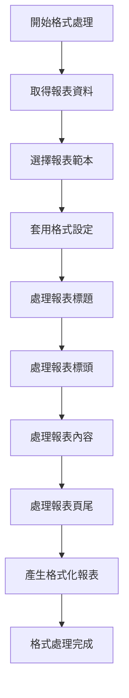
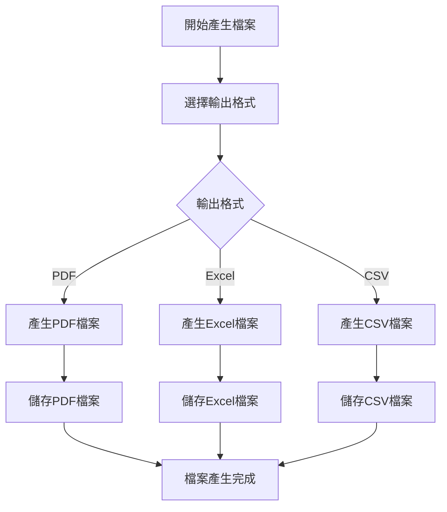
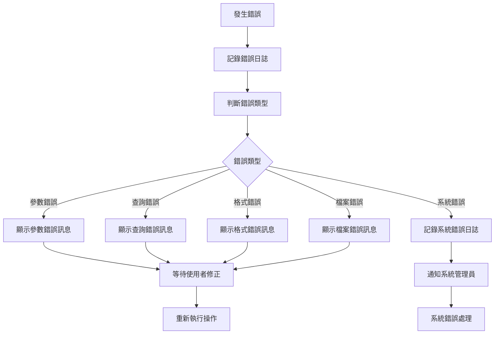

# 總帳模組 程式功能規格書 - 報表管理

## 文件基本資訊

| 項目 | 說明 |
|------|------|
| **文件名稱** | 總帳模組程式功能規格書 - 報表管理 |
| **模組代號** | GL |
| **版本** | v1.0 |
| **建立日期** | 2024年12月21日 |
| **建立人員** | 系統分析師 |
| **審核人員** | 專案經理 |
| **文件狀態** | 初稿 |
| **最後更新** | 2024年12月21日 |

---

## 目錄

1. [基本資料](#基本資料)
2. [檔案架構與關聯圖](#檔案架構與關聯圖)
3. [檔案名稱與欄位規格](#檔案名稱與欄位規格)
4. [輸出/入螢幕布局與說明](#輸出入螢幕布局與說明)
5. [處理流程程序說明](#處理流程程序說明)
6. [子程序處理邏輯說明](#子程序處理邏輯說明)
7. [錯誤處理程序說明與訊息清冊](#錯誤處理程序說明與訊息清冊)
8. [備註](#備註)

---

## 基本資料

### 1.1 模組概述

#### 1.1.1 模組功能說明
總帳模組的報表管理功能主要負責產生各種財務報表和會計報表，包括總帳餘額表、傳票明細表、科目明細表、損益表、資產負債表等。此功能為企業財務管理提供完整的報表支援，協助管理階層進行財務分析和決策制定。

#### 1.1.2 模組特色
- **多樣化報表類型**：支援各種財務報表和會計報表的產生
- **即時資料更新**：報表資料與會計系統即時同步，確保資料準確性
- **彈性參數設定**：支援多種報表參數設定，滿足不同需求
- **多種輸出格式**：支援PDF、Excel、CSV等多種輸出格式
- **批次報表處理**：支援大量報表的批次處理和排程執行
- **報表範本管理**：提供報表範本管理功能，便於報表格式維護

#### 1.1.3 適用範圍
適用於企業會計系統中的報表管理作業，包括日常財務報表、月度報表、季度報表、年度報表等各類財務報表的產生和管理。

### 1.2 技術架構

#### 1.2.1 開發技術
- **程式語言**：RPG、CL、SQL
- **資料庫**：DB2 for i (IBM i)
- **開發工具**：IBM i 開發環境
- **部署環境**：IBM i 7.4

#### 1.2.2 系統需求
- **硬體需求**：IBM i 伺服器
- **軟體需求**：IBM i 作業系統、DB2 for i
- **網路需求**：企業內部網路連線

---

## 檔案架構與關聯圖

### 2.1 資料庫檔案架構

#### 2.1.1 主要資料表


#### 2.1.2 檔案關聯說明
- **GLRP001 (總帳餘額表)**：儲存總帳科目的餘額資料，用於產生總帳餘額表
- **GLRP002 (傳票明細表)**：儲存傳票的明細資料，用於產生傳票明細表
- **GLRP003 (科目明細表)**：儲存科目的明細資料，用於產生科目明細表
- **GLWF03 (報表工作檔)**：儲存報表產生過程中的暫存資料和工作狀態

### 2.2 系統架構圖

#### 2.2.1 報表管理系統架構


---

## 檔案名稱與欄位規格

### 3.1 主要檔案規格

#### 3.1.1 GLRP001 - 總帳餘額表

| 欄位代號 | 欄位名稱 | 位置 | 長度 | 型態 | 屬性 | 檢核說明 |
|----------|----------|------|------|------|------|----------|
| RP0101 | 報表編號 | 1-10 | 10 | A | PK | 必填，系統自動產生 |
| RP0102 | 報表類型 | 11-12 | 2 | A | M | 必填，值：01-總帳餘額表、02-科目餘額表 |
| RP0103 | 報表名稱 | 13-52 | 40 | A | M | 必填，報表名稱 |
| RP0104 | 報表日期 | 53-60 | 8 | D | M | 必填，格式：YYYYMMDD |
| RP0105 | 報表狀態 | 61-62 | 2 | A | M | 必填，值：01-處理中、02-已完成、03-錯誤 |
| RP0106 | 產生人員 | 63-72 | 10 | A | M | 必填，產生報表的使用者代號 |
| RP0107 | 產生時間 | 73-80 | 8 | T | M | 必填，系統自動產生 |
| RP0108 | 報表檔案路徑 | 81-180 | 100 | A | O | 選填，報表檔案在系統中的路徑 |
| RP0109 | 報表檔案大小 | 181-188 | 8 | N | O | 選填，報表檔案大小（位元組） |
| RP0110 | 備註 | 189-228 | 40 | A | O | 選填，報表備註說明 |

#### 3.1.2 GLRP002 - 傳票明細表

| 欄位代號 | 欄位名稱 | 位置 | 長度 | 型態 | 屬性 | 檢核說明 |
|----------|----------|------|------|------|------|----------|
| RP0201 | 報表編號 | 1-10 | 10 | A | PK | 必填，參照GLRP001.RP0101 |
| RP0202 | 傳票編號 | 11-18 | 8 | A | FK | 必填，參照GLAHPF.AH03 |
| RP0203 | 科目代號 | 19-28 | 10 | A | FK | 必填，參照GLACPF.GLACCD |
| RP0204 | 借方金額 | 29-44 | 16 | P | O | 選填，借方金額，小數點後2位 |
| RP0205 | 貸方金額 | 45-60 | 16 | P | O | 選填，貸方金額，小數點後2位 |
| RP0206 | 報表摘要 | 61-100 | 40 | A | O | 選填，報表中的摘要說明 |
| RP0207 | 傳票日期 | 101-108 | 8 | D | M | 必填，傳票日期 |
| RP0208 | 建立人員 | 109-118 | 10 | A | M | 必填，建立傳票的人員代號 |

#### 3.1.3 GLRP003 - 科目明細表

| 欄位代號 | 欄位名稱 | 位置 | 長度 | 型態 | 屬性 | 檢核說明 |
|----------|----------|------|------|------|------|----------|
| RP0301 | 報表編號 | 1-10 | 10 | A | PK | 必填，參照GLRP001.RP0101 |
| RP0302 | 科目代號 | 11-20 | 10 | A | FK | 必填，參照GLACPF.GLACCD |
| RP0303 | 期初餘額 | 21-36 | 16 | P | M | 必填，期初餘額，小數點後2位 |
| RP0304 | 本期借方 | 37-52 | 16 | P | M | 必填，本期借方總額，小數點後2位 |
| RP0305 | 本期貸方 | 53-68 | 16 | P | M | 必填，本期貸方總額，小數點後2位 |
| RP0306 | 期末餘額 | 69-84 | 16 | P | M | 必填，期末餘額，小數點後2位 |
| RP0307 | 科目名稱 | 85-124 | 40 | A | M | 必填，科目名稱 |
| RP0308 | 科目性質 | 125-126 | 2 | A | M | 必填，科目性質代碼 |

#### 3.1.4 GLWF03 - 報表工作檔

| 欄位代號 | 欄位名稱 | 位置 | 長度 | 型態 | 屬性 | 檢核說明 |
|----------|----------|------|------|------|------|----------|
| WF0301 | 工作編號 | 1-10 | 10 | A | PK | 必填，系統自動產生 |
| WF0302 | 報表編號 | 11-20 | 10 | A | FK | 必填，參照GLRP001.RP0101 |
| WF0303 | 處理狀態 | 21-21 | 1 | A | M | 必填，值：P-處理中、C-完成、E-錯誤 |
| WF0304 | 暫存資料 | 22-121 | 100 | A | O | 選填，處理中的暫存資料 |
| WF0305 | 建立時間 | 122-129 | 8 | T | M | 必填，系統自動產生 |
| WF0306 | 完成時間 | 130-137 | 8 | T | O | 選填，處理完成時間 |
| WF0307 | 錯誤訊息 | 138-187 | 50 | A | O | 選填，處理錯誤時的錯誤訊息 |
| WF0308 | 處理人員 | 188-197 | 10 | A | O | 選填，處理工作的人員代號 |

### 3.2 索引資料

#### 3.2.1 主要索引
- **GLRP001 主鍵索引**：RP0101 (報表編號)
- **GLRP001 報表類型索引**：RP0102 (報表類型)
- **GLRP001 報表日期索引**：RP0104 (報表日期)
- **GLRP001 報表狀態索引**：RP0105 (報表狀態)

#### 3.2.2 次要索引
- **GLRP002 主鍵索引**：RP0201 + RP0202 (報表編號 + 傳票編號)
- **GLRP002 科目代號索引**：RP0203 (科目代號)
- **GLRP003 主鍵索引**：RP0301 + RP0302 (報表編號 + 科目代號)
- **GLWF03 主鍵索引**：WF0301 (工作編號)
- **GLWF03 報表編號索引**：WF0302 (報表編號)

---

## 輸出/入螢幕布局與說明

### 4.1 報表管理主畫面

#### 4.1.1 畫面布局
```
┌─────────────────────────────────────────────────────────────┐
│                    報表管理系統                            │
├─────────────────────────────────────────────────────────────┤
│ 功能選項：                                                  │
│  [1]總帳餘額表  [2]傳票明細表  [3]科目明細表  [4]損益表  │
│  [5]資產負債表 [6]報表範本管理 [7]報表排程  [8]離開系統  │
├─────────────────────────────────────────────────────────────┤
│ 報表參數設定：                                              │
│  報表類型：[總帳餘額表 ▼] 年度：[2024] 月份：[12]         │
│  科目範圍：[全部科目] 公司：[001] 幣別：[TWD]              │
│  日期範圍：[2024/01/01] 至 [2024/12/31]                  │
├─────────────────────────────────────────────────────────────┤
│ 報表清單：                                                  │
│ ┌─────┬──────────┬──────────┬──────────┬──────────┬────────┐ │
│ │序號 │報表編號  │報表名稱  │產生日期  │報表狀態  │檔案大小│ │
│ ├─────┼──────────┼──────────┼──────────┼──────────┼────────┤ │
│ │  1  │RP001     │總帳餘額表│2024/12/19│已完成    │ 256KB  │ │
│ │  2  │RP002     │傳票明細表│2024/12/19│已完成    │ 128KB  │ │
│ └─────┴──────────┴──────────┴──────────┴──────────┴────────┘ │
├─────────────────────────────────────────────────────────────┤
│ 功能鍵：F1=說明  F3=離開  F4=產生報表  F9=重新整理  F12=取消│
└─────────────────────────────────────────────────────────────┘
```

#### 4.1.2 畫面說明
- **功能選項區**：提供各種報表類型的選擇
- **報表參數設定區**：設定報表產生的相關參數
- **報表清單區**：顯示已產生的報表資料
- **功能鍵區**：說明可使用的功能鍵

### 4.2 報表參數設定畫面

#### 4.2.1 畫面布局
```
┌─────────────────────────────────────────────────────────────┐
│                    報表參數設定                            │
├─────────────────────────────────────────────────────────────┤
│ 基本參數：                                                  │
│  報表類型：[總帳餘額表 ▼] 報表名稱：[總帳餘額表_202412]    │
│  年度：[2024] 月份：[12] 公司代號：[001]                   │
│  幣別：[TWD ▼] 小數位數：[2] 負數顯示：[括號]              │
├─────────────────────────────────────────────────────────────┤
│ 科目參數：                                                  │
│  科目範圍：[全部科目 ▼] 起始科目：[1000] 結束科目：[9999]  │
│  科目層級：[全部層級] 科目狀態：[有效科目]                  │
│  包含零餘額：[是] 包含停用科目：[否]                       │
├─────────────────────────────────────────────────────────────┤
│ 格式參數：                                                  │
│  輸出格式：[PDF ▼] 紙張大小：[A4] 方向：[直向]             │
│  字體大小：[12pt] 行距：[1.5倍] 頁首頁尾：[顯示]           │
├─────────────────────────────────────────────────────────────┤
│ 操作：[預覽報表] [產生報表] [儲存範本] [取消]              │
│ 功能鍵：F1=說明  F3=離開  F4=預覽  F9=儲存  F12=取消      │
└─────────────────────────────────────────────────────────────┘
```

---

## 處理流程程序說明

### 5.1 報表產生流程

#### 5.1.1 主要處理流程


#### 5.1.2 資料驗證規則
1. **報表類型驗證**：必須選擇有效的報表類型
2. **年度月份驗證**：年度和月份必須在有效範圍內
3. **科目範圍驗證**：科目範圍必須有效且存在
4. **日期範圍驗證**：日期範圍必須合理且不超過系統限制
5. **格式參數驗證**：輸出格式和紙張大小必須支援

### 5.2 報表查詢流程

#### 5.2.1 主要處理流程


### 5.3 報表範本管理流程

#### 5.3.1 主要處理流程


---

## 子程序處理邏輯說明

### 6.1 報表資料查詢子程序

#### 6.1.1 查詢邏輯


#### 6.1.2 查詢優化策略
1. **索引使用**：優先使用適當的索引進行查詢
2. **分頁查詢**：大量資料使用分頁查詢，避免記憶體溢出
3. **查詢快取**：對常用查詢結果進行快取
4. **並行處理**：複雜查詢使用並行處理提高效能

### 6.2 報表格式處理子程序

#### 6.2.1 格式處理邏輯


#### 6.2.2 格式處理注意事項
1. **字體處理**：確保字體在不同環境下的一致性
2. **版面配置**：根據紙張大小和方向調整版面配置
3. **分頁處理**：自動處理分頁，避免內容被截斷
4. **樣式套用**：正確套用報表樣式和格式設定

### 6.3 報表檔案產生子程序

#### 6.3.1 檔案產生邏輯


#### 6.3.2 檔案產生注意事項
1. **檔案命名**：使用統一的檔案命名規則
2. **檔案路徑**：確保檔案儲存在正確的路徑下
3. **檔案權限**：設定適當的檔案存取權限
4. **檔案清理**：定期清理過期的報表檔案

---

## 錯誤處理程序說明與訊息清冊

### 7.1 錯誤處理程序

#### 7.1.1 錯誤處理流程


### 7.2 錯誤訊息清冊

#### 7.2.1 參數錯誤訊息

| 錯誤代碼 | 錯誤訊息 | 錯誤原因 | 解決方法 |
|----------|----------|----------|----------|
| **GL301** | 報表類型無效 | 選擇的報表類型不在支援範圍內 | 請選擇有效的報表類型 |
| **GL302** | 年度參數無效 | 年度參數不在有效範圍內 | 請輸入有效的年度，範圍為2000-2099 |
| **GL303** | 月份參數無效 | 月份參數不在1-12範圍內 | 請輸入有效的月份，範圍為1-12 |
| **GL304** | 科目範圍無效 | 起始科目大於結束科目 | 請檢查科目範圍設定，起始科目必須小於等於結束科目 |
| **GL305** | 日期範圍無效 | 開始日期大於結束日期 | 請檢查日期範圍設定，開始日期必須小於等於結束日期 |

#### 7.2.2 查詢錯誤訊息

| 錯誤代碼 | 錯誤訊息 | 錯誤原因 | 解決方法 |
|----------|----------|----------|----------|
| **GL401** | 查詢條件過於複雜 | 查詢條件組合過於複雜，可能影響效能 | 請簡化查詢條件，或聯繫系統管理員 |
| **GL402** | 查詢結果過多 | 查詢結果超過系統限制 | 請縮小查詢範圍，或使用分頁查詢 |
| **GL403** | 查詢逾時 | 查詢執行時間超過系統限制 | 請簡化查詢條件，或稍後再試 |
| **GL404** | 資料庫連線失敗 | 無法連接到資料庫系統 | 請檢查網路連線，或聯繫系統管理員 |
| **GL405** | 查詢權限不足 | 使用者沒有查詢相關資料的權限 | 請聯繫系統管理員檢查使用者權限 |

#### 7.2.3 格式錯誤訊息

| 錯誤代碼 | 錯誤訊息 | 錯誤原因 | 解決方法 |
|----------|----------|----------|----------|
| **GL501** | 報表範本不存在 | 指定的報表範本在系統中不存在 | 請選擇其他報表範本，或聯繫系統管理員 |
| **GL502** | 格式設定無效 | 報表格式設定參數無效 | 請檢查格式設定參數，或使用預設設定 |
| **GL503** | 字體檔案缺失 | 指定的字體檔案在系統中不存在 | 請使用系統預設字體，或聯繫系統管理員 |
| **GL504** | 版面配置錯誤 | 報表版面配置參數錯誤 | 請檢查版面配置參數，或使用預設配置 |
| **GL505** | 樣式套用失敗 | 無法套用指定的報表樣式 | 請使用預設樣式，或聯繫系統管理員 |

#### 7.2.4 檔案錯誤訊息

| 錯誤代碼 | 錯誤訊息 | 錯誤原因 | 解決方法 |
|----------|----------|----------|----------|
| **GL601** | 檔案產生失敗 | 報表檔案產生過程中發生錯誤 | 請重新執行報表產生，或聯繫系統管理員 |
| **GL602** | 檔案儲存失敗 | 無法將報表檔案儲存到指定路徑 | 請檢查磁碟空間，或聯繫系統管理員 |
| **GL603** | 檔案格式不支援 | 選擇的輸出格式不支援 | 請選擇支援的輸出格式 |
| **GL604** | 檔案權限不足 | 沒有權限在指定路徑建立檔案 | 請聯繫系統管理員檢查檔案權限 |
| **GL605** | 檔案名稱無效 | 報表檔案名稱包含無效字元 | 請使用有效的檔案名稱，避免特殊字元 |

### 7.3 錯誤處理建議

#### 7.3.1 使用者操作建議
1. **檢查參數設定**：在產生報表前仔細檢查所有參數設定
2. **簡化查詢條件**：避免使用過於複雜的查詢條件
3. **選擇適當格式**：根據需求選擇合適的輸出格式
4. **記錄錯誤情況**：如果錯誤持續發生，請記錄詳細的錯誤情況

#### 7.3.2 系統管理建議
1. **定期檢查錯誤日誌**：定期檢查系統錯誤日誌，及時發現和處理問題
2. **監控系統資源**：定期監控系統資源使用情況，預防資源不足問題
3. **備份重要資料**：定期備份重要的報表範本和設定
4. **更新系統版本**：及時更新系統版本，修復已知的錯誤和漏洞

---

## 備註

### 8.1 開發注意事項

#### 8.1.1 程式開發注意事項
1. **效能優化**：報表查詢和產生必須考慮效能優化
2. **記憶體管理**：大量資料處理時必須注意記憶體使用
3. **錯誤處理**：必須提供完整的錯誤處理機制
4. **格式標準化**：報表格式必須符合企業標準
5. **安全性**：必須實施適當的權限控制和資料安全措施

#### 8.1.2 測試注意事項
1. **單元測試**：每個子程序都必須進行單元測試
2. **整合測試**：必須測試與其他模組的整合情況
3. **效能測試**：必須測試大量資料處理的效能表現
4. **格式測試**：必須測試各種輸出格式的正確性
5. **使用者測試**：必須進行使用者接受度測試

### 8.2 維護注意事項

#### 8.2.1 日常維護注意事項
1. **定期備份**：定期備份報表範本和相關設定
2. **效能監控**：定期監控報表產生的效能表現
3. **錯誤分析**：定期分析錯誤日誌，改進系統穩定性
4. **範本維護**：定期維護和更新報表範本
5. **檔案清理**：定期清理過期的報表檔案

#### 8.2.2 版本更新注意事項
1. **相容性檢查**：更新前必須檢查與現有報表範本的相容性
2. **範本遷移**：必要時進行報表範本的遷移和轉換
3. **回滾計畫**：制定詳細的回滾計畫，以應對更新失敗
4. **使用者通知**：提前通知使用者報表系統更新計畫
5. **測試驗證**：更新後必須進行充分的測試驗證

### 8.3 未來擴充建議

#### 8.3.1 功能擴充建議
1. **多語言支援**：增加多語言支援，滿足國際化需求
2. **行動裝置支援**：開發行動裝置應用程式，提供隨時隨地的報表查詢功能
3. **進階分析功能**：增加報表資料的進階分析功能
4. **互動式報表**：開發互動式報表，提供更好的資料探索體驗
5. **報表排程功能**：增加報表自動排程和郵件發送功能

#### 8.3.2 技術改進建議
1. **雲端部署**：考慮將報表系統部署到雲端，提高可用性和擴展性
2. **微服務架構**：考慮採用微服務架構，提高系統的模組化和可維護性
3. **人工智慧應用**：考慮在報表分析和預測中應用人工智慧技術
4. **大數據處理**：考慮使用大數據技術處理大量報表資料
5. **API標準化**：制定標準的報表API規範，便於與其他系統的整合

---

## 附錄

### A.1 相關文件清單
- 總帳模組程式功能規格書 - 總帳管理
- 總帳模組程式功能規格書 - 基本資料維護
- 總帳模組程式功能規格書 - 會計傳票管理
- 總帳模組操作手冊 - 報表管理

### A.2 修訂記錄

| 版本 | 修訂日期 | 修訂人員 | 修訂內容 | 修訂原因 |
|------|----------|----------|----------|----------|
| v1.0 | 2024/12/21 | 系統分析師 | 初始版本建立 | 新功能開發 |

### A.3 聯絡資訊
- **專案經理**：[專案經理姓名]
- **系統分析師**：[系統分析師姓名]
- **技術支援**：[技術支援聯絡方式]
- **專案信箱**：[專案信箱地址]
