# 總帳模組 程式功能規格書 - 會計傳票管理

## 文件基本資訊

| 項目 | 說明 |
|------|------|
| **文件名稱** | 總帳模組程式功能規格書 - 會計傳票管理 |
| **模組代號** | GL |
| **版本** | v1.0 |
| **建立日期** | 2024年12月21日 |
| **建立人員** | 系統分析師 |
| **審核人員** | 專案經理 |
| **文件狀態** | 初稿 |
| **最後更新** | 2024年12月21日 |

---

## 目錄

1. [基本資料](#基本資料)
2. [檔案架構與關聯圖](#檔案架構與關聯圖)
3. [檔案名稱與欄位規格](#檔案名稱與欄位規格)
4. [輸出/入螢幕布局與說明](#輸出入螢幕布局與說明)
5. [處理流程程序說明](#處理流程程序說明)
6. [子程序處理邏輯說明](#子程序處理邏輯說明)
7. [錯誤處理程序說明與訊息清冊](#錯誤處理程序說明與訊息清冊)
8. [備註](#備註)

---

## 基本資料

### 1.1 模組概述

#### 1.1.1 模組功能說明
總帳模組的會計傳票管理功能主要負責處理企業會計傳票的完整生命週期，包括傳票的新增、修改、刪除、查詢、審核、過帳等操作。此功能是會計系統的核心，確保所有會計交易的記錄、驗證和處理都能正確執行，維護會計資料的完整性和準確性。

#### 1.1.2 模組特色
- **傳票生命週期管理**：完整的傳票從建立到過帳的全程管理
- **借貸平衡驗證**：自動檢查傳票的借貸平衡，確保會計資料正確性
- **科目餘額即時更新**：傳票過帳後即時更新相關科目的餘額
- **傳票狀態追蹤**：追蹤傳票的處理狀態，便於管理和稽核
- **批次處理能力**：支援大量傳票的批次處理和匯入功能
- **審核流程控制**：多層級的傳票審核機制，確保資料品質

#### 1.1.3 適用範圍
適用於企業會計系統中的傳票管理作業，包括日常會計傳票處理、期末調整傳票、結帳傳票等各類會計傳票的管理和處理。

### 1.2 技術架構

#### 1.2.1 開發技術
- **程式語言**：RPG、CL、SQL
- **資料庫**：DB2 for i (IBM i)
- **開發工具**：IBM i 開發環境
- **部署環境**：IBM i 7.4

#### 1.2.2 系統需求
- **硬體需求**：IBM i 伺服器
- **軟體需求**：IBM i 作業系統、DB2 for i
- **網路需求**：企業內部網路連線

---

## 檔案架構與關聯圖

### 2.1 資料庫檔案架構

#### 2.1.1 主要資料表
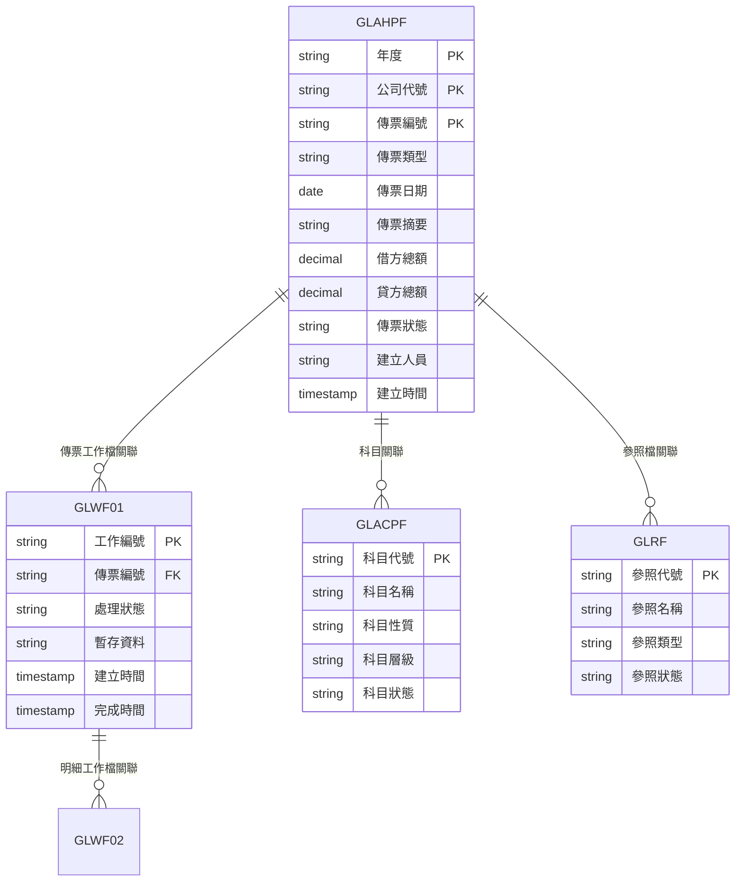

#### 2.1.2 檔案關聯說明
- **GLAHPF (會計傳票檔)**：儲存會計傳票的主要資料，包括傳票標頭和明細
- **GLWF01 (傳票工作檔)**：儲存傳票處理過程中的暫存資料和工作狀態
- **GLACPF (會計科目檔)**：儲存會計科目資料，與傳票建立關聯
- **GLRF (總帳參照檔)**：儲存系統參照資料，如傳票類型、狀態等

### 2.2 系統架構圖

#### 2.2.1 會計傳票管理系統架構
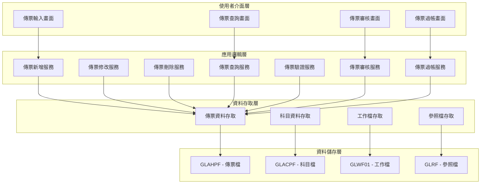

---

## 檔案名稱與欄位規格

### 3.1 主要檔案規格

#### 3.1.1 GLAHPF - 會計傳票檔

| 欄位代號 | 欄位名稱 | 位置 | 長度 | 型態 | 屬性 | 檢核說明 |
|----------|----------|------|------|------|------|----------|
| AH01 | 年度 | 1-4 | 4 | N | PK | 必填，會計年度，如：2024 |
| AH02 | 公司代號 | 5-7 | 3 | A | PK | 必填，公司代號，如：001 |
| AH03 | 傳票編號 | 8-15 | 8 | A | PK | 必填，系統自動產生，格式：GL001 |
| AH04 | 傳票類型 | 16-17 | 2 | A | M | 必填，值：01-一般、02-調整、03-結帳 |
| AH05 | 傳票日期 | 18-25 | 8 | D | M | 必填，格式：YYYYMMDD |
| AH06 | 傳票摘要 | 26-65 | 40 | A | M | 必填，傳票摘要說明 |
| AH07 | 借方總額 | 66-81 | 16 | P | M | 必填，借方金額總和，小數點後2位 |
| AH08 | 貸方總額 | 82-97 | 16 | P | M | 必填，貸方金額總和，小數點後2位 |
| AH09 | 傳票狀態 | 98-99 | 2 | A | M | 必填，值：01-草稿、02-審核中、03-已審核、04-已過帳、05-已刪除 |
| AH10 | 建立人員 | 100-109 | 10 | A | M | 必填，建立傳票的使用者代號 |
| AH11 | 建立時間 | 110-117 | 8 | T | M | 必填，系統自動產生 |
| AH12 | 審核人員 | 118-127 | 10 | A | O | 選填，審核傳票的人員代號 |
| AH13 | 審核時間 | 128-135 | 8 | T | O | 選填，傳票審核時間 |
| AH14 | 過帳人員 | 136-145 | 10 | A | O | 選填，過帳傳票的人員代號 |
| AH15 | 過帳時間 | 146-153 | 8 | T | O | 選填，傳票過帳時間 |
| AH16 | 備註 | 154-193 | 40 | A | O | 選填，傳票備註說明 |

#### 3.1.2 GLWF01 - 傳票工作檔

| 欄位代號 | 欄位名稱 | 位置 | 長度 | 型態 | 屬性 | 檢核說明 |
|----------|----------|------|------|------|------|----------|
| WF0101 | 工作編號 | 1-10 | 10 | A | PK | 必填，系統自動產生 |
| WF0102 | 傳票編號 | 11-18 | 8 | A | FK | 必填，參照GLAHPF.AH03 |
| WF0103 | 處理狀態 | 19-19 | 1 | A | M | 必填，值：P-處理中、C-完成、E-錯誤 |
| WF0104 | 暫存資料 | 20-119 | 100 | A | O | 選填，處理中的暫存資料 |
| WF0105 | 建立時間 | 120-127 | 8 | T | M | 必填，系統自動產生 |
| WF0106 | 完成時間 | 128-135 | 8 | T | O | 選填，處理完成時間 |
| WF0107 | 錯誤訊息 | 136-185 | 50 | A | O | 選填，處理錯誤時的錯誤訊息 |
| WF0108 | 處理人員 | 186-195 | 10 | A | O | 選填，處理工作的人員代號 |

#### 3.1.3 傳票明細檔 (GLAHPFD)

| 欄位代號 | 欄位名稱 | 位置 | 長度 | 型態 | 屬性 | 檢核說明 |
|----------|----------|------|------|------|------|----------|
| AHD01 | 年度 | 1-4 | 4 | N | PK | 必填，會計年度 |
| AHD02 | 公司代號 | 5-7 | 3 | A | PK | 必填，公司代號 |
| AHD03 | 傳票編號 | 8-15 | 8 | A | PK,FK | 必填，參照GLAHPF.AH03 |
| AHD04 | 明細序號 | 16-18 | 3 | N | PK | 必填，明細順序號，001-999 |
| AHD05 | 科目代號 | 19-28 | 10 | A | FK | 必填，參照GLACPF.GLACCD |
| AHD06 | 借方金額 | 29-44 | 16 | P | O | 選填，借方金額，小數點後2位 |
| AHD07 | 貸方金額 | 45-60 | 16 | P | O | 選填，貸方金額，小數點後2位 |
| AHD08 | 摘要 | 61-100 | 40 | A | O | 選填，明細摘要說明 |
| AHD09 | 部門代號 | 101-110 | 10 | A | O | 選填，部門代號 |
| AHD10 | 專案代號 | 111-120 | 10 | A | O | 選填，專案代號 |

### 3.2 索引資料

#### 3.2.1 主要索引
- **GLAHPF 主鍵索引**：AH01 + AH02 + AH03 (年度 + 公司代號 + 傳票編號)
- **GLAHPF 傳票日期索引**：AH05 (傳票日期)
- **GLAHPF 傳票狀態索引**：AH09 (傳票狀態)
- **GLAHPF 建立人員索引**：AH10 (建立人員)

#### 3.2.2 次要索引
- **GLWF01 主鍵索引**：WF0101 (工作編號)
- **GLWF01 傳票編號索引**：WF0102 (傳票編號)
- **GLWF01 處理狀態索引**：WF0103 (處理狀態)
- **GLAHPFD 主鍵索引**：AHD01 + AHD02 + AHD03 + AHD04 (年度 + 公司代號 + 傳票編號 + 明細序號)

---

## 輸出/入螢幕布局與說明

### 4.1 傳票管理主畫面

#### 4.1.1 畫面布局
```
┌─────────────────────────────────────────────────────────────┐
│                    會計傳票管理系統                        │
├─────────────────────────────────────────────────────────────┤
│ 功能選項：                                                  │
│  [1]新增傳票  [2]修改傳票  [3]刪除傳票  [4]查詢傳票      │
│  [5]傳票審核  [6]傳票過帳  [7]傳票列印  [8]離開系統      │
├─────────────────────────────────────────────────────────────┤
│ 查詢條件：                                                  │
│  年度：[2024] 公司：[001] 傳票類型：[全部 ▼] 狀態：[全部 ▼] │
│  日期範圍：[2024/01/01] 至 [2024/12/31]                  │
├─────────────────────────────────────────────────────────────┤
│ 傳票清單：                                                  │
│ ┌─────┬──────────┬──────────┬──────────┬──────────┬────────┐ │
│ │序號 │傳票編號  │傳票日期  │傳票摘要  │借方總額  │貸方總額│ │
│ ├─────┼──────────┼──────────┼──────────┼──────────┼────────┤ │
│ │  1  │GL001     │2024/12/19│現金收入  │ 10,000   │ 10,000 │ │
│ │  2  │GL002     │2024/12/19│費用支出  │  5,000   │  5,000 │ │
│ └─────┴──────────┴──────────┴──────────┴──────────┴────────┘ │
├─────────────────────────────────────────────────────────────┤
│ 功能鍵：F1=說明  F3=離開  F4=查詢  F9=重新整理  F12=取消  │
└─────────────────────────────────────────────────────────────┘
```

#### 4.1.2 畫面說明
- **功能選項區**：提供傳票管理的主要功能選項
- **查詢條件區**：設定傳票查詢的篩選條件
- **傳票清單區**：顯示符合條件的傳票資料
- **功能鍵區**：說明可使用的功能鍵

### 4.2 傳票輸入畫面

#### 4.2.1 畫面布局
```
┌─────────────────────────────────────────────────────────────┐
│                    傳票輸入 - 新增傳票                      │
├─────────────────────────────────────────────────────────────┤
│ 傳票標頭：                                                  │
│  傳票編號：[GL001        ] (系統自動產生)                  │
│  傳票類型：[01 ▼] 傳票日期：[2024/12/19 ▼]                │
│  傳票摘要：[                                              ] │
├─────────────────────────────────────────────────────────────┤
│ 傳票明細：                                                  │
│ ┌─────┬──────────┬──────────┬──────────┬──────────┬────────┐ │
│ │序號 │科目代號  │科目名稱  │借方金額  │貸方金額  │摘要    │ │
│ ├─────┼──────────┼──────────┼──────────┼──────────┼────────┤ │
│ │  1  │1001      │現金      │ 10,000   │          │        │ │
│ │  2  │4001      │銷貨收入  │          │ 10,000   │        │ │
│ └─────┴──────────┴──────────┴──────────┴──────────┴────────┘ │
├─────────────────────────────────────────────────────────────┤
│ 合計：借方總額：[ 10,000   ] 貸方總額：[ 10,000   ]        │
│ 狀態：[借貸平衡 ✓]                                         │
├─────────────────────────────────────────────────────────────┤
│ 操作：[新增明細] [儲存傳票] [取消]                         │
│ 功能鍵：F1=說明  F3=離開  F4=儲存  F9=重新整理  F12=取消  │
└─────────────────────────────────────────────────────────────┘
```

---

## 處理流程程序說明

### 5.1 傳票新增流程

#### 5.1.1 主要處理流程
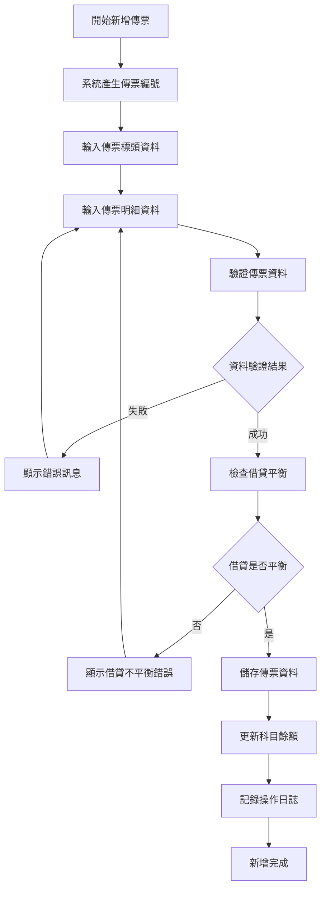

#### 5.1.2 資料驗證規則
1. **傳票編號驗證**：系統自動產生，確保唯一性
2. **傳票日期驗證**：不能超過當前日期，必須在會計年度內
3. **傳票摘要驗證**：不能為空白，長度不能超過40位
4. **科目代號驗證**：必須存在於科目主檔中，且狀態為有效
5. **借貸平衡驗證**：借方總額必須等於貸方總額

### 5.2 傳票修改流程

#### 5.2.1 主要處理流程
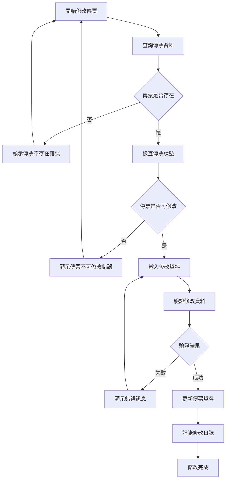

#### 5.2.2 修改限制規則
1. **已過帳傳票**：不能修改已過帳的傳票
2. **已刪除傳票**：不能修改已刪除的傳票
3. **已審核傳票**：只有審核人員能修改已審核的傳票
4. **系統傳票**：系統自動產生的傳票不能修改

### 5.3 傳票刪除流程

#### 5.3.1 主要處理流程
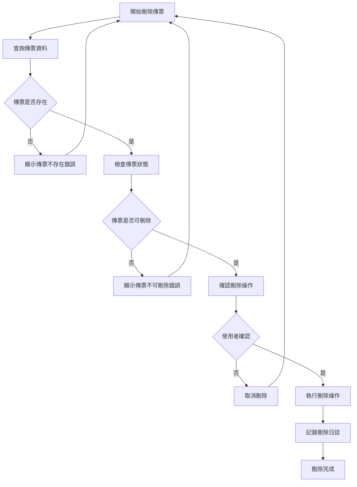

#### 5.3.2 刪除限制規則
1. **已過帳傳票**：不能刪除已過帳的傳票
2. **已審核傳票**：不能刪除已審核的傳票
3. **系統傳票**：系統自動產生的傳票不能刪除
4. **關聯傳票**：有相關關聯的傳票不能刪除

### 5.4 傳票審核流程

#### 5.4.1 主要處理流程
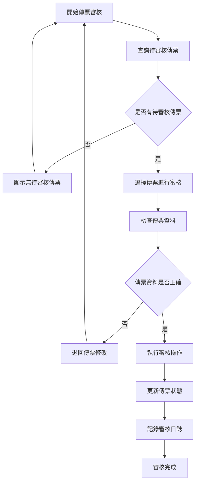

### 5.5 傳票過帳流程

#### 5.5.1 主要處理流程
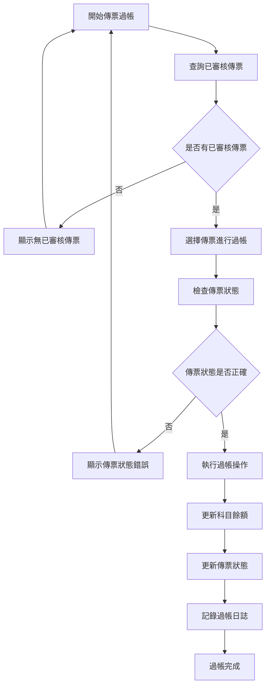

---

## 子程序處理邏輯說明

### 6.1 傳票資料驗證子程序

#### 6.1.1 驗證邏輯
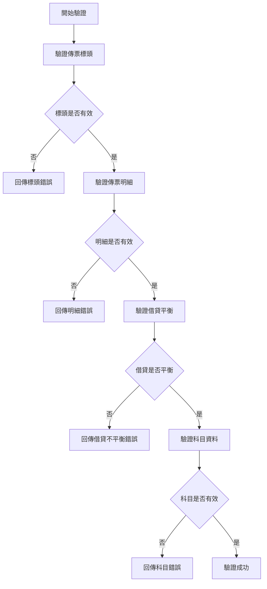

#### 6.1.2 驗證規則詳述
1. **傳票標頭驗證**
   - 傳票編號必須唯一
   - 傳票日期必須在有效範圍內
   - 傳票摘要不能為空白

2. **傳票明細驗證**
   - 至少必須有一筆明細
   - 每筆明細必須有科目代號
   - 每筆明細必須有借方或貸方金額

3. **借貸平衡驗證**
   - 借方總額必須等於貸方總額
   - 每筆明細的借方和貸方金額不能同時為零

4. **科目資料驗證**
   - 科目代號必須存在於科目主檔
   - 科目狀態必須為有效
   - 科目性質必須與借貸方向相符

### 6.2 傳票編號產生子程序

#### 6.2.1 產生邏輯
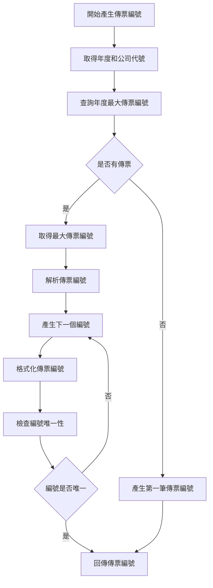

#### 6.2.2 編號產生規則
1. **編號格式**：GL + 年度後兩位 + 序號，如：GL24001
2. **序號範圍**：001-999，每年重新開始
3. **唯一性檢查**：確保在同一年度內傳票編號唯一
4. **自動遞增**：系統自動產生下一個可用的編號

### 6.3 科目餘額更新子程序

#### 6.3.1 更新邏輯
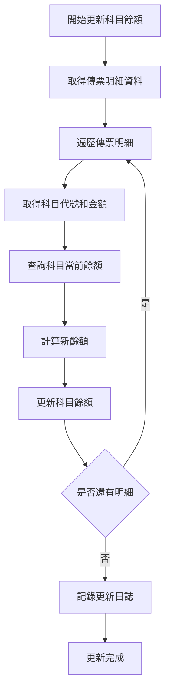

#### 6.3.2 更新注意事項
1. **交易控制**：所有餘額更新必須在交易控制下進行
2. **餘額計算**：根據科目性質計算正確的餘額方向
3. **日誌記錄**：記錄所有餘額變更的詳細資訊
4. **效能考量**：大量傳票過帳時考慮批次更新

---

## 錯誤處理程序說明與訊息清冊

### 7.1 錯誤處理程序

#### 7.1.1 錯誤處理流程
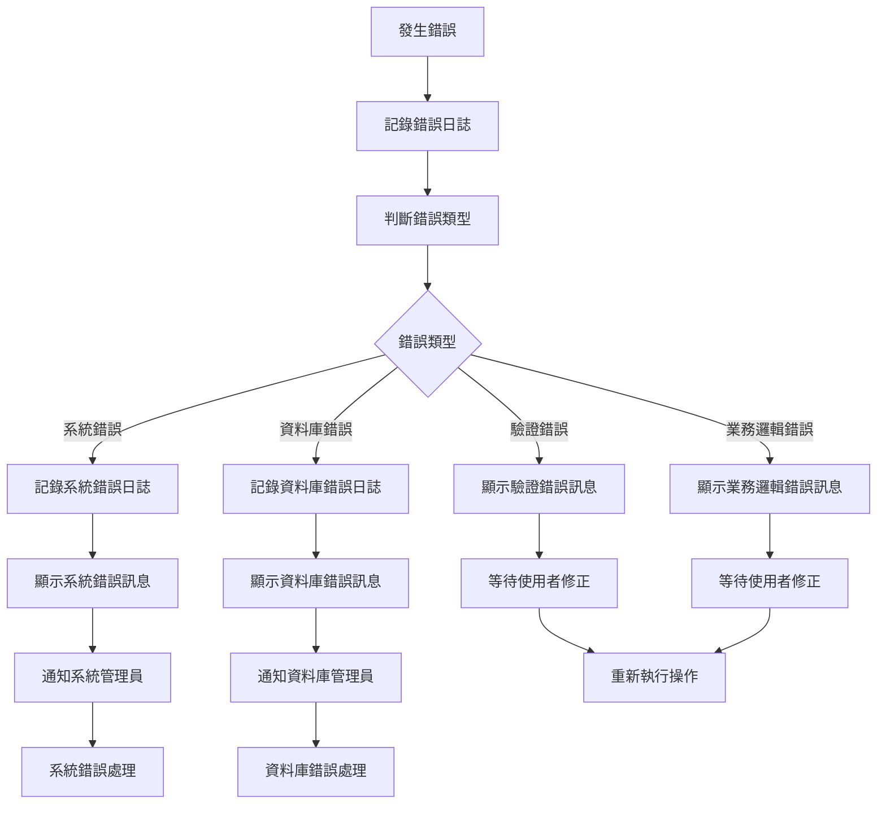

### 7.2 錯誤訊息清冊

#### 7.2.1 驗證錯誤訊息

| 錯誤代碼 | 錯誤訊息 | 錯誤原因 | 解決方法 |
|----------|----------|----------|----------|
| **GL101** | 傳票借貸不平衡，請檢查金額 | 借方總額不等於貸方總額 | 檢查傳票明細金額，確保借貸平衡 |
| **GL102** | 傳票日期格式錯誤，請使用YYYYMMDD格式 | 日期輸入格式不正確 | 使用正確的日期格式，如：20241219 |
| **GL103** | 傳票摘要不能為空白 | 傳票摘要欄位為空白 | 請輸入傳票摘要，長度不能超過40位 |
| **GL104** | 傳票日期超過系統年度限制 | 傳票日期超過系統設定的年度範圍 | 選擇正確的傳票日期，或聯絡管理員調整年度設定 |
| **GL105** | 科目代號不存在或已停用 | 輸入的科目代號在系統中不存在或已停用 | 請檢查科目代號，或選擇其他有效的科目 |

#### 7.2.2 業務邏輯錯誤訊息

| 錯誤代碼 | 錯誤訊息 | 錯誤原因 | 解決方法 |
|----------|----------|----------|----------|
| **GL201** | 傳票編號已存在 | 要新增的傳票編號在系統中已存在 | 請使用不同的傳票編號，或先刪除現有的傳票 |
| **GL202** | 傳票不可修改 | 傳票狀態或業務規則不允許修改 | 請檢查傳票狀態，或聯繫系統管理員 |
| **GL203** | 傳票不可刪除 | 傳票已過帳或審核，不能刪除 | 請先取消過帳或審核，或聯繫會計人員 |
| **GL204** | 傳票不可過帳 | 傳票尚未審核或狀態不正確 | 請先完成傳票審核，或檢查傳票狀態 |
| **GL205** | 傳票不可審核 | 傳票狀態不允許審核 | 請檢查傳票狀態，或聯繫系統管理員 |

#### 7.2.3 系統錯誤訊息

| 錯誤代碼 | 錯誤訊息 | 錯誤原因 | 解決方法 |
|----------|----------|----------|----------|
| **GL901** | 資料庫連線失敗 | 無法連接到資料庫系統 | 請檢查網路連線，或聯繫系統管理員 |
| **GL902** | 資料庫交易失敗 | 資料庫交易執行失敗 | 請重新執行操作，或聯繫資料庫管理員 |
| **GL903** | 檔案存取權限不足 | 使用者沒有存取相關檔案的權限 | 請聯繫系統管理員檢查使用者權限 |
| **GL904** | 系統資源不足 | 系統記憶體或磁碟空間不足 | 請聯繫系統管理員檢查系統資源 |
| **GL905** | 程式執行異常 | 程式執行過程中發生未預期的錯誤 | 請記錄錯誤訊息，並聯繫系統管理員 |

### 7.3 錯誤處理建議

#### 7.3.1 使用者操作建議
1. **仔細檢查輸入資料**：在提交前仔細檢查所有輸入欄位的內容
2. **參考錯誤訊息**：根據錯誤訊息提供的建議進行修正
3. **記錄錯誤情況**：如果錯誤持續發生，請記錄詳細的錯誤情況
4. **尋求技術支援**：對於無法解決的錯誤，請聯繫技術支援人員

#### 7.3.2 系統管理建議
1. **定期檢查錯誤日誌**：定期檢查系統錯誤日誌，及時發現和處理問題
2. **監控系統資源**：定期監控系統資源使用情況，預防資源不足問題
3. **備份重要資料**：定期備份重要的傳票資料，防止資料遺失
4. **更新系統版本**：及時更新系統版本，修復已知的錯誤和漏洞

---

## 備註

### 8.1 開發注意事項

#### 8.1.1 程式開發注意事項
1. **資料驗證**：所有使用者輸入都必須進行嚴格的資料驗證
2. **交易控制**：涉及多個檔案的操作必須使用交易控制
3. **錯誤處理**：必須提供完整的錯誤處理機制
4. **效能優化**：對於大量傳票的處理，必須考慮效能優化
5. **安全性**：必須實施適當的權限控制和資料安全措施

#### 8.1.2 測試注意事項
1. **單元測試**：每個子程序都必須進行單元測試
2. **整合測試**：必須測試與其他模組的整合情況
3. **效能測試**：必須測試大量傳票處理的效能表現
4. **安全性測試**：必須測試權限控制和資料安全機制
5. **使用者測試**：必須進行使用者接受度測試

### 8.2 維護注意事項

#### 8.2.1 日常維護注意事項
1. **定期備份**：定期備份傳票資料和相關設定
2. **效能監控**：定期監控系統效能，及時發現和解決問題
3. **錯誤分析**：定期分析錯誤日誌，改進系統穩定性
4. **使用者培訓**：定期進行使用者培訓，提高操作效率
5. **文件更新**：及時更新相關技術文件和操作手冊

#### 8.2.2 版本更新注意事項
1. **相容性檢查**：更新前必須檢查與現有系統的相容性
2. **資料遷移**：必要時進行資料遷移和轉換
3. **回滾計畫**：制定詳細的回滾計畫，以應對更新失敗
4. **使用者通知**：提前通知使用者系統更新計畫
5. **測試驗證**：更新後必須進行充分的測試驗證

### 8.3 未來擴充建議

#### 8.3.1 功能擴充建議
1. **多語言支援**：增加多語言支援，滿足國際化需求
2. **行動裝置支援**：開發行動裝置應用程式，提供隨時隨地的傳票管理功能
3. **進階查詢功能**：增加進階查詢功能，支援複雜的查詢條件
4. **報表功能**：增加傳票相關的報表功能，提供更好的資料分析能力
5. **整合功能**：增加與其他系統的整合功能，提高資料一致性

#### 8.3.2 技術改進建議
1. **雲端部署**：考慮將系統部署到雲端，提高可用性和擴展性
2. **微服務架構**：考慮採用微服務架構，提高系統的模組化和可維護性
3. **人工智慧應用**：考慮在傳票分類和驗證中應用人工智慧技術
4. **區塊鏈技術**：考慮使用區塊鏈技術提高資料的安全性和可追溯性
5. **API標準化**：制定標準的API規範，便於與其他系統的整合

---

## 附錄

### A.1 相關文件清單
- 總帳模組程式功能規格書 - 總帳管理
- 總帳模組程式功能規格書 - 基本資料維護
- 總帳模組操作手冊 - 會計傳票管理
- 總帳模組技術文件 - 系統架構

### A.2 修訂記錄

| 版本 | 修訂日期 | 修訂人員 | 修訂內容 | 修訂原因 |
|------|----------|----------|----------|----------|
| v1.0 | 2024/12/21 | 系統分析師 | 初始版本建立 | 新功能開發 |

### A.3 聯絡資訊
- **專案經理**：[專案經理姓名]
- **系統分析師**：[系統分析師姓名]
- **技術支援**：[技術支援聯絡方式]
- **專案信箱**：[專案信箱地址]
