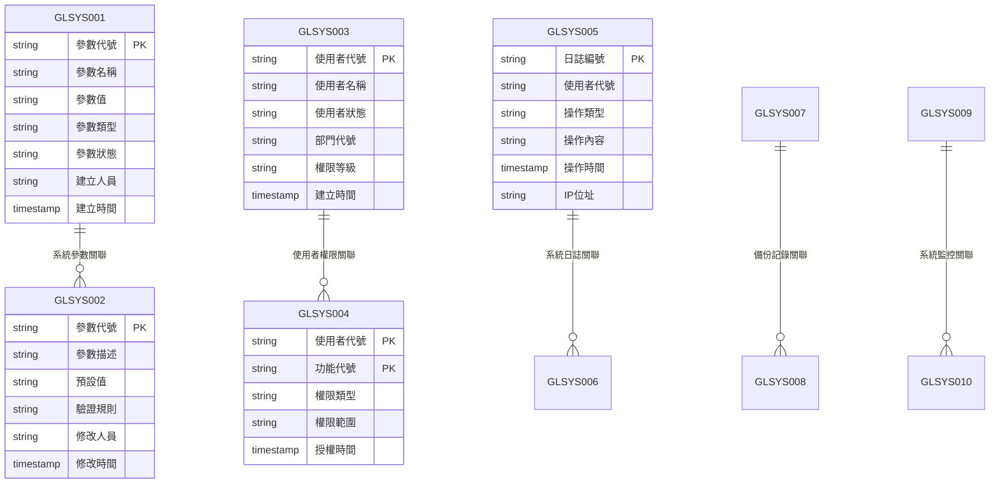
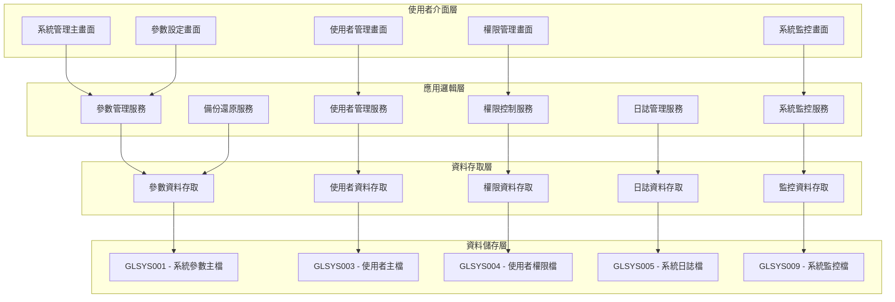
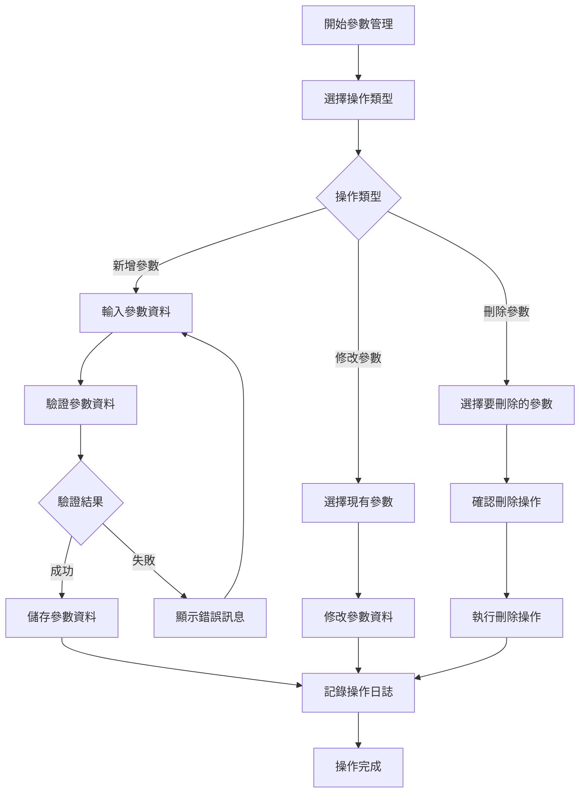
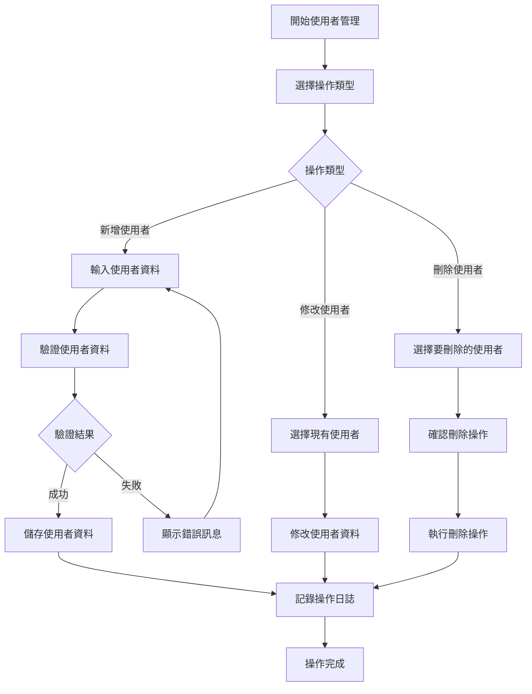
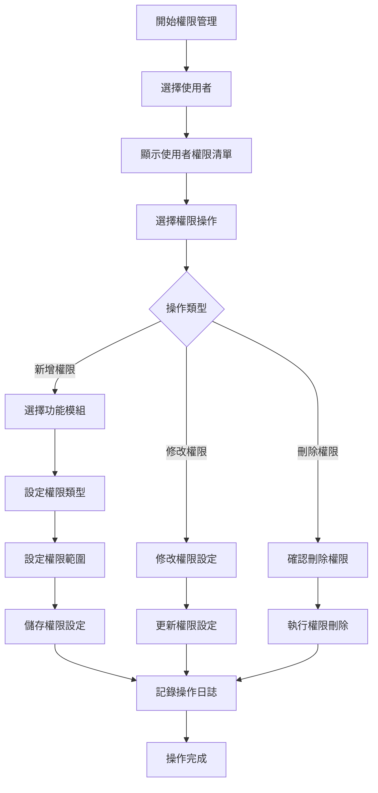
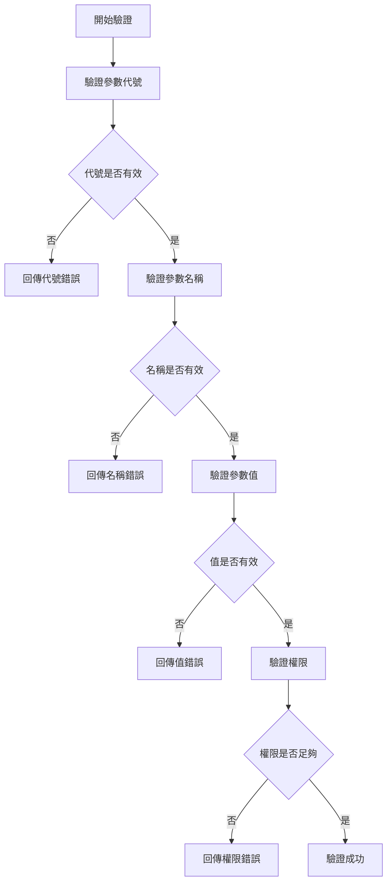
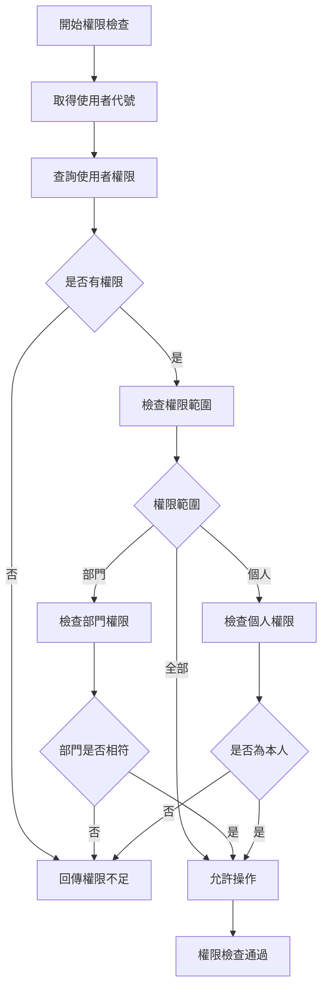
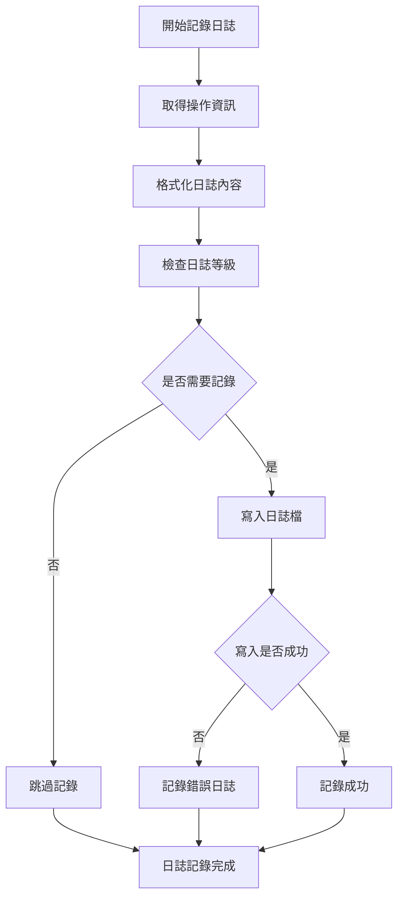
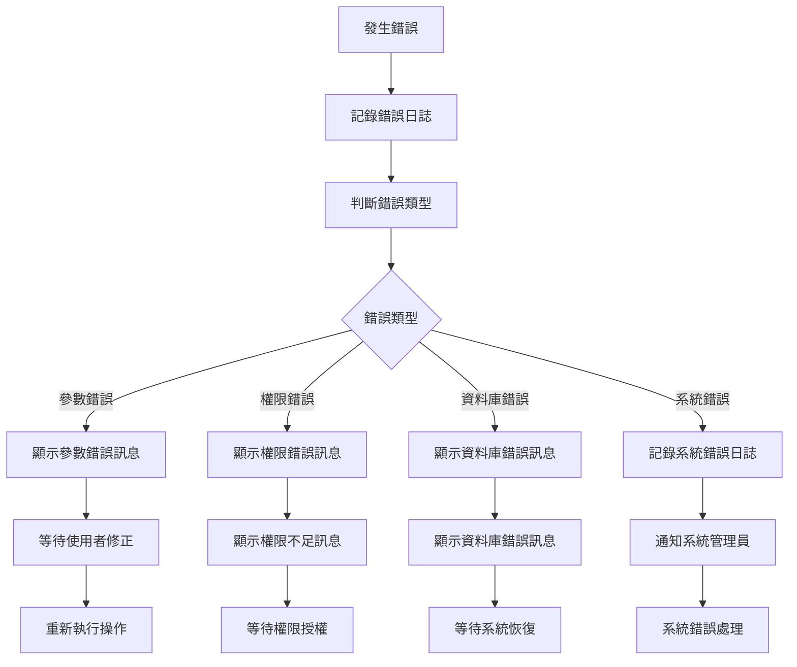

# 總帳模組 程式功能規格書 - 系統管理

## 文件基本資訊

| 項目 | 說明 |
|------|------|
| **文件名稱** | 總帳模組程式功能規格書 - 系統管理 |
| **模組代號** | GL |
| **版本** | v1.0 |
| **建立日期** | 2024年12月21日 |
| **建立人員** | 系統分析師 |
| **審核人員** | 專案經理 |
| **文件狀態** | 初稿 |
| **最後更新** | 2024年12月21日 |

---

## 目錄

1. [基本資料](#基本資料)
2. [檔案架構與關聯圖](#檔案架構與關聯圖)
3. [檔案名稱與欄位規格](#檔案名稱與欄位規格)
4. [輸出/入螢幕布局與說明](#輸出入螢幕布局與說明)
5. [處理流程程序說明](#處理流程程序說明)
6. [子程序處理邏輯說明](#子程序處理邏輯說明)
7. [錯誤處理程序說明與訊息清冊](#錯誤處理程序說明與訊息清冊)
8. [備註](#備註)

---

## 基本資料

### 1.1 模組概述

#### 1.1.1 模組功能說明
總帳模組的系統管理功能主要負責管理系統的各種設定、參數、權限控制、使用者管理、系統監控等核心管理功能。此功能為總帳系統提供穩定的運行環境，確保系統的安全性、可靠性和效能，並支援系統的日常維護和故障排除。

#### 1.1.2 模組特色
- **集中化管理**：提供統一的系統管理介面，便於管理員操作
- **權限控制**：實施多層級的權限控制機制，確保系統安全
- **參數設定**：支援靈活的系統參數設定，滿足不同業務需求
- **監控功能**：提供系統運行狀態監控，及時發現和處理問題
- **備份還原**：支援系統資料的備份和還原功能
- **日誌管理**：完整的系統操作日誌記錄和查詢功能

#### 1.1.3 適用範圍
適用於總帳模組的系統管理作業，包括系統設定、使用者管理、權限控制、系統監控、資料維護等各類系統管理功能。

### 1.2 技術架構

#### 1.2.1 開發技術
- **程式語言**：RPG、CL、SQL
- **資料庫**：DB2 for i (IBM i)
- **開發工具**：IBM i 開發環境
- **部署環境**：IBM i 7.4

#### 1.2.2 系統需求
- **硬體需求**：IBM i 伺服器
- **軟體需求**：IBM i 作業系統、DB2 for i
- **網路需求**：企業內部網路連線

---

## 檔案架構與關聯圖

### 2.1 資料庫檔案架構

#### 2.1.1 主要資料表


#### 2.1.2 檔案關聯說明
- **GLSYS001 (系統參數主檔)**：儲存系統的主要參數設定
- **GLSYS002 (系統參數明細檔)**：儲存參數的詳細說明和驗證規則
- **GLSYS003 (使用者主檔)**：儲存使用者的基本資料
- **GLSYS004 (使用者權限檔)**：儲存使用者的功能權限設定
- **GLSYS005 (系統日誌檔)**：儲存系統操作日誌

### 2.2 系統架構圖

#### 2.2.1 系統管理架構


---

## 檔案名稱與欄位規格

### 3.1 主要檔案規格

#### 3.1.1 GLSYS001 - 系統參數主檔

| 欄位代號 | 欄位名稱 | 位置 | 長度 | 型態 | 屬性 | 檢核說明 |
|----------|----------|------|------|------|------|----------|
| SY0101 | 參數代號 | 1-10 | 10 | A | PK | 必填，參數唯一識別碼 |
| SY0102 | 參數名稱 | 11-50 | 40 | A | M | 必填，參數的中文名稱 |
| SY0103 | 參數值 | 51-100 | 50 | A | M | 必填，參數的當前值 |
| SY0104 | 參數類型 | 101-102 | 2 | A | M | 必填，值：01-字串、02-數值、03-日期、04-布林 |
| SY0105 | 參數狀態 | 103-104 | 2 | A | M | 必填，值：01-啟用、02-停用、03-維護中 |
| SY0106 | 建立人員 | 105-114 | 10 | A | M | 必填，建立參數的使用者代號 |
| SY0107 | 建立時間 | 115-122 | 8 | T | M | 必填，系統自動產生 |
| SY0108 | 修改人員 | 123-132 | 10 | A | O | 選填，最後修改參數的使用者代號 |
| SY0109 | 修改時間 | 133-140 | 8 | T | O | 選填，最後修改時間 |
| SY0110 | 備註 | 141-180 | 40 | A | O | 選填，參數備註說明 |

#### 3.1.2 GLSYS002 - 系統參數明細檔

| 欄位代號 | 欄位名稱 | 位置 | 長度 | 型態 | 屬性 | 檢核說明 |
|----------|----------|------|------|------|------|----------|
| SY0201 | 參數代號 | 1-10 | 10 | A | PK,FK | 必填，參照GLSYS001.SY0101 |
| SY0202 | 參數描述 | 11-100 | 90 | A | M | 必填，參數的詳細描述 |
| SY0203 | 預設值 | 101-150 | 50 | A | M | 必填，參數的預設值 |
| SY0204 | 驗證規則 | 151-200 | 50 | A | O | 選填，參數值的驗證規則 |
| SY0205 | 最小值 | 201-250 | 50 | A | O | 選填，數值參數的最小值 |
| SY0206 | 最大值 | 251-300 | 50 | A | O | 選填，數值參數的最大值 |
| SY0207 | 允許值清單 | 301-400 | 100 | A | O | 選填，允許的參數值清單 |
| SY0208 | 修改人員 | 401-410 | 10 | A | O | 選填，修改明細的使用者代號 |
| SY0209 | 修改時間 | 411-418 | 8 | T | O | 選填，修改時間 |

#### 3.1.3 GLSYS003 - 使用者主檔

| 欄位代號 | 欄位名稱 | 位置 | 長度 | 型態 | 屬性 | 檢核說明 |
|----------|----------|------|------|------|------|----------|
| SY0301 | 使用者代號 | 1-10 | 10 | A | PK | 必填，使用者唯一識別碼 |
| SY0302 | 使用者名稱 | 11-50 | 40 | A | M | 必填，使用者的中文姓名 |
| SY0303 | 使用者狀態 | 51-52 | 2 | A | M | 必填，值：01-啟用、02-停用、03-鎖定 |
| SY0304 | 部門代號 | 53-62 | 10 | A | M | 必填，使用者所屬部門代號 |
| SY0305 | 權限等級 | 63-64 | 2 | A | M | 必填，值：01-一般使用者、02-主管、03-系統管理員 |
| SY0306 | 電子郵件 | 65-114 | 50 | A | O | 選填，使用者的電子郵件地址 |
| SY0307 | 電話號碼 | 115-134 | 20 | A | O | 選填，使用者的聯絡電話 |
| SY0308 | 建立人員 | 135-144 | 10 | A | M | 必填，建立使用者的管理員代號 |
| SY0309 | 建立時間 | 145-152 | 8 | T | M | 必填，系統自動產生 |
| SY0310 | 最後登入時間 | 153-160 | 8 | T | O | 選填，使用者最後登入系統的時間 |

#### 3.1.4 GLSYS004 - 使用者權限檔

| 欄位代號 | 欄位名稱 | 位置 | 長度 | 型態 | 屬性 | 檢核說明 |
|----------|----------|------|------|------|------|----------|
| SY0401 | 使用者代號 | 1-10 | 10 | A | PK,FK | 必填，參照GLSYS003.SY0301 |
| SY0402 | 功能代號 | 11-20 | 10 | A | PK | 必填，功能模組的代號 |
| SY0403 | 權限類型 | 21-22 | 2 | A | M | 必填，值：01-讀取、02-新增、03-修改、04-刪除、05-全部 |
| SY0404 | 權限範圍 | 23-24 | 2 | A | M | 必填，值：01-全部、02-部門、03-個人 |
| SY0405 | 授權人員 | 25-34 | 10 | A | M | 必填，授權的管理員代號 |
| SY0406 | 授權時間 | 35-42 | 8 | T | M | 必填，授權時間 |
| SY0407 | 權限狀態 | 43-44 | 2 | A | M | 必填，值：01-有效、02-無效、03-過期 |
| SY0408 | 備註 | 45-84 | 40 | A | O | 選填，權限備註說明 |

#### 3.1.5 GLSYS005 - 系統日誌檔

| 欄位代號 | 欄位名稱 | 位置 | 長度 | 型態 | 屬性 | 檢核說明 |
|----------|----------|------|------|------|------|----------|
| SY0501 | 日誌編號 | 1-15 | 15 | A | PK | 必填，日誌唯一識別碼 |
| SY0502 | 使用者代號 | 16-25 | 10 | A | FK | 必填，參照GLSYS003.SY0301 |
| SY0503 | 操作類型 | 26-27 | 2 | A | M | 必填，值：01-登入、02-登出、03-新增、04-修改、05-刪除、06-查詢 |
| SY0504 | 操作內容 | 28-77 | 50 | A | M | 必填，操作的詳細內容描述 |
| SY0505 | 操作時間 | 78-85 | 8 | T | M | 必填，操作發生的時間 |
| SY0506 | IP位址 | 86-105 | 20 | A | O | 選填，使用者操作的IP位址 |
| SY0507 | 模組代號 | 106-115 | 10 | A | M | 必填，操作所屬的模組代號 |
| SY0508 | 操作結果 | 116-117 | 2 | A | M | 必填，值：01-成功、02-失敗、03-部分成功 |
| SY0509 | 錯誤訊息 | 118-167 | 50 | A | O | 選填，操作失敗時的錯誤訊息 |

### 3.2 索引資料

#### 3.2.1 主要索引
- **GLSYS001 主鍵索引**：SY0101 (參數代號)
- **GLSYS001 參數名稱索引**：SY0102 (參數名稱)
- **GLSYS001 參數狀態索引**：SY0105 (參數狀態)
- **GLSYS003 主鍵索引**：SY0301 (使用者代號)
- **GLSYS003 使用者名稱索引**：SY0302 (使用者名稱)
- **GLSYS003 部門代號索引**：SY0304 (部門代號)

#### 3.2.2 次要索引
- **GLSYS002 主鍵索引**：SY0201 (參數代號)
- **GLSYS004 主鍵索引**：SY0401 + SY0402 (使用者代號 + 功能代號)
- **GLSYS004 使用者代號索引**：SY0401 (使用者代號)
- **GLSYS004 功能代號索引**：SY0402 (功能代號)
- **GLSYS005 主鍵索引**：SY0501 (日誌編號)
- **GLSYS005 使用者代號索引**：SY0502 (使用者代號)
- **GLSYS005 操作時間索引**：SY0505 (操作時間)

---

## 輸出/入螢幕布局與說明

### 4.1 系統管理主畫面

#### 4.1.1 畫面布局
```
┌─────────────────────────────────────────────────────────────┐
│                    系統管理系統                            │
├─────────────────────────────────────────────────────────────┤
│ 功能選項：                                                  │
│  [1]參數設定  [2]使用者管理  [3]權限管理  [4]系統監控    │
│  [5]日誌查詢  [6]備份還原  [7]系統維護  [8]離開系統    │
├─────────────────────────────────────────────────────────────┤
│ 系統狀態：                                                  │
│  系統版本：[v1.0] 資料庫狀態：[正常] 連線數：[15/100]    │
│  最後備份：[2024/12/19 02:00] 系統運行時間：[72小時]     │
│  記憶體使用率：[65%] 磁碟使用率：[45%] CPU使用率：[30%]  │
├─────────────────────────────────────────────────────────────┤
│ 最近操作日誌：                                              │
│ ┌─────┬──────────┬──────────┬──────────┬──────────┬────────┐ │
│ │時間 │使用者    │操作類型  │操作內容  │操作結果  │IP位址  │ │
│ ├─────┼──────────┼──────────┼──────────┼──────────┼────────┤ │
│ │12:30│張三      │登入系統  │總帳模組  │成功      │192.168.1.100│ │
│ │12:25│李四      │修改參數  │年度設定  │成功      │192.168.1.101│ │
│ └─────┴──────────┴──────────┴──────────┴──────────┴────────┘ │
├─────────────────────────────────────────────────────────────┤
│ 功能鍵：F1=說明  F3=離開  F4=重新整理  F9=系統狀態  F12=取消│
└─────────────────────────────────────────────────────────────┘
```

#### 4.1.2 畫面說明
- **功能選項區**：提供系統管理的主要功能選項
- **系統狀態區**：顯示系統的當前運行狀態
- **最近操作日誌區**：顯示最近的系統操作記錄
- **功能鍵區**：說明可使用的功能鍵

### 4.2 參數設定畫面

#### 4.2.1 畫面布局
```
┌─────────────────────────────────────────────────────────────┐
│                    系統參數設定                            │
├─────────────────────────────────────────────────────────────┤
│ 參數查詢：                                                  │
│  參數類型：[全部類型 ▼] 參數狀態：[全部狀態 ▼]            │
│  關鍵字：[                ] [查詢] [清除]                  │
├─────────────────────────────────────────────────────────────┤
│ 參數清單：                                                  │
│ ┌─────┬──────────┬──────────┬──────────┬──────────┬────────┐ │
│ │序號 │參數代號  │參數名稱  │參數值    │參數類型  │狀態    │ │
│ ├─────┼──────────┼──────────┼──────────┼──────────┼────────┤ │
│ │  1  │GL001     │會計年度  │2024      │數值      │啟用    │ │
│ │  2  │GL002     │公司代號  │001       │字串      │啟用    │ │
│ │  3  │GL003     │幣別      │TWD       │字串      │啟用    │ │
│ └─────┴──────────┴──────────┴──────────┴──────────┴────────┘ │
├─────────────────────────────────────────────────────────────┤
│ 操作：[新增參數] [修改參數] [刪除參數] [啟用/停用] [匯出]  │
│ 功能鍵：F1=說明  F3=離開  F4=新增  F6=修改  F8=刪除  F12=取消│
└─────────────────────────────────────────────────────────────┘
```

---

## 處理流程程序說明

### 5.1 參數管理流程

#### 5.1.1 主要處理流程


#### 5.1.2 資料驗證規則
1. **參數代號驗證**：必須唯一，長度不能超過10位
2. **參數名稱驗證**：不能為空白，長度不能超過40位
3. **參數值驗證**：根據參數類型進行相應的驗證
4. **參數類型驗證**：必須選擇有效的參數類型
5. **權限驗證**：只有系統管理員能進行參數管理

### 5.2 使用者管理流程

#### 5.2.1 主要處理流程


### 5.3 權限管理流程

#### 5.3.1 主要處理流程


---

## 子程序處理邏輯說明

### 6.1 參數驗證子程序

#### 6.1.1 驗證邏輯


#### 6.1.2 驗證規則詳述
1. **參數代號驗證**
   - 長度必須在1-10位之間
   - 只能包含字母、數字和底線
   - 不能與現有參數代號重複

2. **參數名稱驗證**
   - 不能為空白或null
   - 長度必須在1-40位之間
   - 不能包含特殊字元

3. **參數值驗證**
   - 根據參數類型進行相應驗證
   - 數值類型：必須為有效數字
   - 日期類型：必須為有效日期格式
   - 布林類型：必須為true/false

### 6.2 權限檢查子程序

#### 6.2.1 檢查邏輯


#### 6.2.2 權限檢查注意事項
1. **權限快取**：對常用權限進行快取，提高檢查效能
2. **權限繼承**：支援權限的繼承機制
3. **權限過期**：檢查權限是否過期
4. **權限衝突**：處理權限衝突的情況

### 6.3 日誌記錄子程序

#### 6.3.1 記錄邏輯


#### 6.3.2 日誌管理注意事項
1. **日誌輪替**：定期進行日誌檔案輪替
2. **日誌壓縮**：對舊日誌進行壓縮儲存
3. **日誌清理**：定期清理過期的日誌檔案
4. **日誌備份**：重要日誌進行備份

---

## 錯誤處理程序說明與訊息清冊

### 7.1 錯誤處理程序

#### 7.1.1 錯誤處理流程


### 7.2 錯誤訊息清冊

#### 7.2.1 參數管理錯誤訊息

| 錯誤代碼 | 錯誤訊息 | 錯誤原因 | 解決方法 |
|----------|----------|----------|----------|
| **GL701** | 參數代號已存在 | 要新增的參數代號在系統中已存在 | 請使用不同的參數代號，或先刪除現有的參數 |
| **GL702** | 參數代號格式無效 | 參數代號包含無效字元 | 請使用有效的字元，只能包含字母、數字和底線 |
| **GL703** | 參數名稱不能為空白 | 參數名稱欄位為空白 | 請輸入參數名稱，長度不能超過40位 |
| **GL704** | 參數值格式無效 | 參數值不符合參數類型的格式要求 | 請根據參數類型輸入正確格式的值 |
| **GL705** | 參數類型無效 | 選擇的參數類型不在支援範圍內 | 請選擇有效的參數類型 |

#### 7.2.2 使用者管理錯誤訊息

| 錯誤代碼 | 錯誤訊息 | 錯誤原因 | 解決方法 |
|----------|----------|----------|----------|
| **GL801** | 使用者代號已存在 | 要新增的使用者代號在系統中已存在 | 請使用不同的使用者代號，或先刪除現有的使用者 |
| **GL802** | 使用者名稱不能為空白 | 使用者名稱欄位為空白 | 請輸入使用者名稱，長度不能超過40位 |
| **GL803** | 部門代號不存在 | 輸入的部門代號在系統中不存在 | 請檢查部門代號，或選擇其他有效的部門 |
| **GL804** | 權限等級無效 | 選擇的權限等級不在支援範圍內 | 請選擇有效的權限等級 |
| **GL805** | 電子郵件格式無效 | 電子郵件地址格式不正確 | 請使用正確的電子郵件格式 |

#### 7.2.3 權限管理錯誤訊息

| 錯誤代碼 | 錯誤訊息 | 錯誤原因 | 解決方法 |
|----------|----------|----------|----------|
| **GL901** | 權限不足 | 使用者沒有執行該操作的權限 | 請聯繫系統管理員檢查使用者權限 |
| **GL902** | 功能代號不存在 | 指定的功能代號在系統中不存在 | 請檢查功能代號，或選擇其他有效的功能 |
| **GL903** | 權限類型無效 | 選擇的權限類型不在支援範圍內 | 請選擇有效的權限類型 |
| **GL904** | 權限範圍無效 | 選擇的權限範圍不在支援範圍內 | 請選擇有效的權限範圍 |
| **GL905** | 權限衝突 | 新權限與現有權限產生衝突 | 請檢查權限設定，解決權限衝突 |

#### 7.2.4 系統錯誤訊息

| 錯誤代碼 | 錯誤訊息 | 錯誤原因 | 解決方法 |
|----------|----------|----------|----------|
| **GL951** | 資料庫連線失敗 | 無法連接到資料庫系統 | 請檢查網路連線，或聯繫系統管理員 |
| **GL952** | 資料庫交易失敗 | 資料庫交易執行失敗 | 請重新執行操作，或聯繫資料庫管理員 |
| **GL953** | 檔案存取權限不足 | 使用者沒有存取相關檔案的權限 | 請聯繫系統管理員檢查使用者權限 |
| **GL954** | 系統資源不足 | 系統記憶體或磁碟空間不足 | 請聯繫系統管理員檢查系統資源 |
| **GL955** | 程式執行異常 | 程式執行過程中發生未預期的錯誤 | 請記錄錯誤訊息，並聯繫系統管理員 |

### 7.3 錯誤處理建議

#### 7.3.1 使用者操作建議
1. **檢查輸入資料**：在提交前仔細檢查所有輸入欄位的內容
2. **參考錯誤訊息**：根據錯誤訊息提供的建議進行修正
3. **記錄錯誤情況**：如果錯誤持續發生，請記錄詳細的錯誤情況
4. **尋求技術支援**：對於無法解決的錯誤，請聯繫技術支援人員

#### 7.3.2 系統管理建議
1. **定期檢查錯誤日誌**：定期檢查系統錯誤日誌，及時發現和處理問題
2. **監控系統資源**：定期監控系統資源使用情況，預防資源不足問題
3. **備份重要資料**：定期備份重要的系統設定和參數
4. **更新系統版本**：及時更新系統版本，修復已知的錯誤和漏洞

---

## 備註

### 8.1 開發注意事項

#### 8.1.1 程式開發注意事項
1. **安全性**：所有系統管理功能都必須實施嚴格的權限控制
2. **資料驗證**：所有使用者輸入都必須進行嚴格的資料驗證
3. **錯誤處理**：必須提供完整的錯誤處理機制
4. **日誌記錄**：所有重要操作都必須記錄詳細的日誌
5. **效能優化**：系統管理功能必須考慮效能影響

#### 8.1.2 測試注意事項
1. **單元測試**：每個子程序都必須進行單元測試
2. **整合測試**：必須測試與其他模組的整合情況
3. **安全性測試**：必須測試權限控制和資料安全機制
4. **效能測試**：必須測試系統管理功能的效能表現
5. **使用者測試**：必須進行使用者接受度測試

### 8.2 維護注意事項

#### 8.2.1 日常維護注意事項
1. **定期備份**：定期備份系統設定和參數資料
2. **效能監控**：定期監控系統管理功能的效能表現
3. **錯誤分析**：定期分析錯誤日誌，改進系統穩定性
4. **權限審查**：定期審查使用者權限，確保權限設定合理
5. **日誌維護**：定期維護和清理系統日誌

#### 8.2.2 版本更新注意事項
1. **相容性檢查**：更新前必須檢查與現有設定的相容性
2. **設定遷移**：必要時進行系統設定的遷移和轉換
3. **回滾計畫**：制定詳細的回滾計畫，以應對更新失敗
4. **使用者通知**：提前通知使用者系統更新計畫
5. **測試驗證**：更新後必須進行充分的測試驗證

### 8.3 未來擴充建議

#### 8.3.1 功能擴充建議
1. **多語言支援**：增加多語言支援，滿足國際化需求
2. **行動裝置支援**：開發行動裝置應用程式，提供隨時隨地的系統管理功能
3. **自動化管理**：增加系統自動化管理功能，減少人工操作
4. **進階監控**：增加更進階的系統監控和分析功能
5. **雲端管理**：考慮將系統管理功能部署到雲端

#### 8.3.2 技術改進建議
1. **微服務架構**：考慮採用微服務架構，提高系統的模組化和可維護性
2. **人工智慧應用**：考慮在系統監控和故障診斷中應用人工智慧技術
3. **大數據分析**：考慮使用大數據技術分析系統運行資料
4. **API標準化**：制定標準的系統管理API規範，便於與其他系統的整合
5. **容器化部署**：考慮使用容器技術進行系統部署

---

## 附錄

### A.1 相關文件清單
- 總帳模組程式功能規格書 - 總帳管理
- 總帳模組程式功能規格書 - 基本資料維護
- 總帳模組程式功能規格書 - 會計傳票管理
- 總帳模組程式功能規格書 - 報表管理
- 總帳模組操作手冊 - 系統管理

### A.2 修訂記錄

| 版本 | 修訂日期 | 修訂人員 | 修訂內容 | 修訂原因 |
|------|----------|----------|----------|----------|
| v1.0 | 2024/12/21 | 系統分析師 | 初始版本建立 | 新功能開發 |

### A.3 聯絡資訊
- **專案經理**：[專案經理姓名]
- **系統分析師**：[系統分析師姓名]
- **技術支援**：[技術支援聯絡方式]
- **專案信箱**：[專案信箱地址]
