# 總帳模組程式功能規格書

## 一、基本資料

| 項目 | 說明 |
|------|------|
| **系統名稱** | 10.10.10.180 企業管理系統 |
| **模組名稱** | 總帳模組 |
| **模組代號** | GL (General Ledger) |
| **程式名稱** | 總帳管理系統 |
| **程式代號** | GLMGT |
| **功能名稱** | 總帳管理 |
| **功能代號** | GL001 |
| **撰寫人員** | 系統分析師 |
| **撰寫日期** | 2024/12/19 |
| **審核人員** | 專案經理 |
| **審核日期** | 2024/12/19 |
| **版本編號** | v1.0 |
| **文件狀態** | 草稿 |

---

## 二、檔案架構與關聯圖

### 2.1 總帳模組檔案架構圖

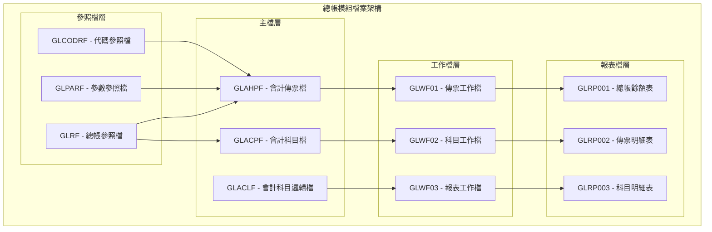

### 2.2 總帳模組系統架構圖

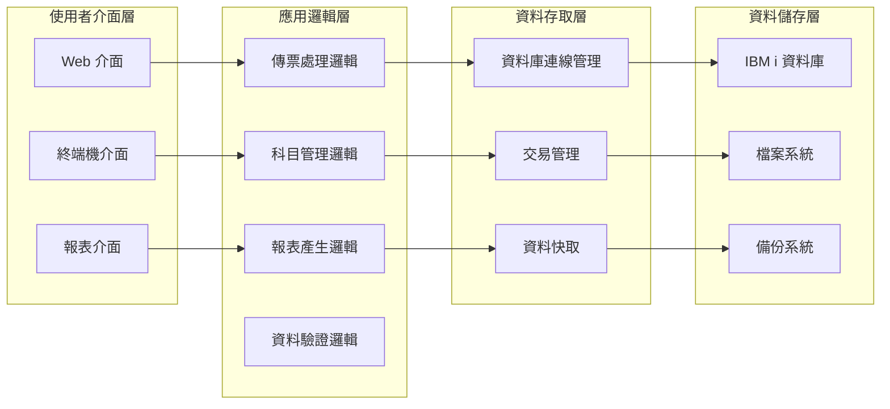

### 2.3 檔案關聯圖

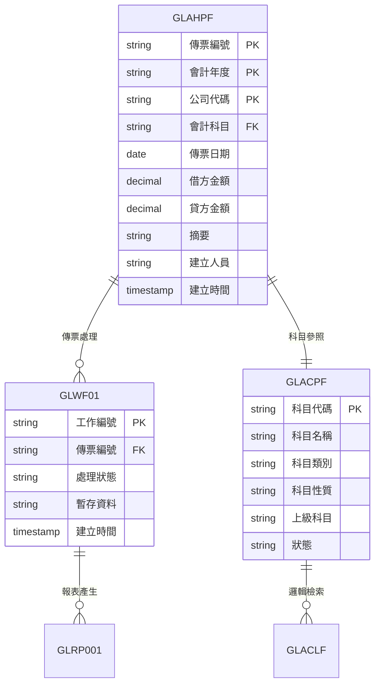

### 2.4 檔案清單

| 檔案類型 | 檔案名稱 | 檔案代號 | 用途說明 |
|----------|----------|----------|----------|
| 主檔 | 會計傳票檔 | GLAHPF | 儲存所有會計傳票的主檔資料 |
| 主檔 | 會計科目檔 | GLACPF | 儲存會計科目主檔資料 |
| 邏輯檔 | 會計科目邏輯檔 | GLACLF | 提供科目查詢和排序的邏輯檔案 |
| 工作檔 | 傳票工作檔 | GLWF01 | 傳票處理過程中的暫存資料 |
| 工作檔 | 科目工作檔 | GLWF02 | 科目管理過程中的暫存資料 |
| 工作檔 | 報表工作檔 | GLWF03 | 報表產生過程中的暫存資料 |
| 參照檔 | 總帳參照檔 | GLRF | 總帳模組的參照資料 |
| 參照檔 | 參數參照檔 | GLPARF | 總帳模組的參數設定 |
| 參照檔 | 代碼參照檔 | GLCODRF | 總帳模組的代碼對照 |

---

## 三、檔案名稱，欄位代號、名稱、位置、長度、屬性、檢核說明

### 3.1 會計傳票檔 (GLAHPF) 欄位規格

#### 3.1.1 記錄格式：GLAHPFR
| 欄位代號 | 欄位名稱 | 位置 | 長度 | 型態 | 屬性 | 檢核說明 |
|----------|----------|------|------|------|------|----------|
| AH01 | 公司代碼 | 1-3 | 3 | CHAR | PK | 必填，參照公司主檔 |
| AH02 | 會計年度 | 4-7 | 4 | CHAR | PK | 必填，格式：YYYY |
| AH03 | 傳票編號 | 8-15 | 8 | CHAR | PK | 必填，系統自動產生 |
| AH04 | 會計科目 | 16-20 | 5 | CHAR | FK | 必填，參照會計科目檔 |
| AH05 | 傳票日期 | 21-28 | 8 | DATE | - | 必填，格式：YYYYMMDD |
| AH06 | 借方金額 | 29-38 | 10 | DECIMAL | - | 必填，金額格式 |
| AH07 | 貸方金額 | 39-48 | 10 | DECIMAL | - | 必填，金額格式 |
| AH08 | 摘要 | 49-88 | 40 | CHAR | - | 必填，最多40字元 |
| AH09 | 建立人員 | 89-93 | 5 | CHAR | - | 必填，參照使用者檔 |
| AH10 | 建立時間 | 94-101 | 8 | TIMESTAMP | - | 系統自動產生 |
| AH11 | 修改人員 | 102-106 | 5 | CHAR | - | 可選，參照使用者檔 |
| AH12 | 修改時間 | 107-114 | 8 | TIMESTAMP | - | 系統自動產生 |
| AH13 | 狀態 | 115-115 | 1 | CHAR | - | 必填，A:有效 D:刪除 |

#### 3.1.2 主鍵欄位
- **主鍵1**：AH01 - 公司代碼 (CHAR(3))
- **主鍵2**：AH02 - 會計年度 (CHAR(4))
- **主鍵3**：AH03 - 傳票編號 (CHAR(8))

#### 3.1.3 索引資料
| 索引名稱 | 索引類型 | 索引欄位 | 說明 |
|----------|----------|----------|------|
| GLH001 | 主鍵索引 | AH01, AH02, AH03 | 主要查詢索引 |
| GLH002 | 一般索引 | AH04, AH05 | 科目日期查詢索引 |
| GLH003 | 一般索引 | AH09, AH10 | 建立人員時間索引 |

### 3.2 會計科目檔 (GLACPF) 欄位規格

#### 3.2.1 記錄格式：GLACPR
| 欄位代號 | 欄位名稱 | 位置 | 長度 | 型態 | 屬性 | 檢核說明 |
|----------|----------|------|------|------|------|----------|
| AC01 | 科目代碼 | 1-5 | 5 | CHAR | PK | 必填，唯一值 |
| AC02 | 科目名稱 | 6-35 | 30 | CHAR | - | 必填，最多30字元 |
| AC03 | 科目類別 | 36-36 | 1 | CHAR | - | 必填，1:資產 2:負債 3:權益 4:收入 5:支出 |
| AC04 | 科目性質 | 37-37 | 1 | CHAR | - | 必填，A:借餘 B:貸餘 |
| AC05 | 上級科目 | 38-42 | 5 | CHAR | FK | 可選，參照本身 |
| AC06 | 科目層級 | 43-43 | 1 | CHAR | - | 必填，1-9層級 |
| AC07 | 狀態 | 44-44 | 1 | CHAR | - | 必填，A:有效 D:停用 |
| AC08 | 建立人員 | 45-49 | 5 | CHAR | - | 必填，參照使用者檔 |
| AC09 | 建立時間 | 50-57 | 8 | TIMESTAMP | - | 系統自動產生 |

#### 3.2.2 主鍵欄位
- **主鍵1**：AC01 - 科目代碼 (CHAR(5))

#### 3.2.3 索引資料
| 索引名稱 | 索引類型 | 索引欄位 | 說明 |
|----------|----------|----------|------|
| GLC001 | 主鍵索引 | AC01 | 主要查詢索引 |
| GLC002 | 一般索引 | AC03, AC05 | 類別層級查詢索引 |
| GLC003 | 一般索引 | AC07 | 狀態查詢索引 |

### 3.3 傳票工作檔 (GLWF01) 欄位規格

#### 3.3.1 記錄格式：GLWF01R
| 欄位代號 | 欄位名稱 | 位置 | 長度 | 型態 | 屬性 | 檢核說明 |
|----------|----------|------|------|------|------|----------|
| WF0101 | 工作編號 | 1-10 | 10 | CHAR | PK | 必填，系統自動產生 |
| WF0102 | 傳票編號 | 11-18 | 8 | CHAR | FK | 必填，參照傳票檔 |
| WF0103 | 處理狀態 | 19-19 | 1 | CHAR | - | 必填，P:處理中 C:完成 E:錯誤 |
| WF0104 | 暫存資料 | 20-119 | 100 | CHAR | - | 可選，處理中的暫存資料 |
| WF0105 | 建立時間 | 120-127 | 8 | TIMESTAMP | - | 系統自動產生 |
| WF0106 | 完成時間 | 128-135 | 8 | TIMESTAMP | - | 可選，處理完成時間 |

#### 3.3.2 主鍵欄位
- **主鍵1**：WF0101 - 工作編號 (CHAR(10))

#### 3.3.3 外鍵關聯
- **關聯主檔**：會計傳票檔 (GLAHPF)
- **關聯欄位**：WF0102 → AH03

### 3.4 資料庫存取詳細說明

#### 3.4.1 資料表存取權限
| 資料表名稱 | 讀取權限 | 寫入權限 | 刪除權限 | 管理權限 | 說明 |
|------------|----------|----------|----------|----------|------|
| GLAHPF | 所有使用者 | 會計人員 | 系統管理員 | 系統管理員 | 會計傳票主檔，一般使用者只能讀取 |
| GLACPF | 所有使用者 | 會計主管 | 系統管理員 | 系統管理員 | 會計科目主檔，只有會計主管能修改 |
| GLWF01 | 會計人員 | 會計人員 | 會計人員 | 系統管理員 | 傳票工作檔，會計人員可讀寫刪除 |
| GLRF | 所有使用者 | 系統管理員 | 系統管理員 | 系統管理員 | 總帳參照檔，只有系統管理員能修改 |

#### 3.4.2 欄位存取控制
| 欄位類別 | 存取權限 | 加密方式 | 稽核記錄 | 說明 |
|----------|----------|----------|----------|------|
| 基本資料 | 一般使用者 | 無 | 記錄讀取 | 傳票編號、日期等基本資訊 |
| 金額資料 | 會計人員 | 無 | 記錄讀寫 | 借方金額、貸方金額等財務資料 |
| 人員資料 | 會計主管 | 無 | 記錄讀寫 | 建立人員、修改人員等敏感資訊 |
| 系統資料 | 系統管理員 | 無 | 記錄所有操作 | 建立時間、修改時間等系統資訊 |

#### 3.4.3 資料庫連線管理
```sql
-- 連線池設定
CREATE CONNECTION POOL GL_POOL
    INITIAL_SIZE = 5
    MAX_SIZE = 20
    MIN_SIZE = 5
    TIMEOUT = 300
    VALIDATION_QUERY = 'SELECT 1 FROM SYSIBM.SYSDUMMY1';

-- 使用者權限設定
GRANT SELECT ON GLAHPF TO PUBLIC;
GRANT INSERT, UPDATE ON GLAHPF TO GL_ACCOUNTANT;
GRANT DELETE ON GLAHPF TO GL_MANAGER;
GRANT ALL ON GLAHPF TO GL_ADMIN;

-- 資料庫角色定義
CREATE ROLE GL_ACCOUNTANT;
CREATE ROLE GL_MANAGER;
CREATE ROLE GL_ADMIN;
```

#### 3.4.4 資料庫效能優化
```sql
-- 建立統計索引
CREATE INDEX GLH_PERF_IDX ON GLAHPF (AH02, AH05, AH04, AH01)
INCLUDE (AH06, AH07, AH08, AH09, AH10);

-- 建立分區表（按年度分區）
CREATE TABLE GLAHPF_2024 PARTITION OF GLAHPF
FOR VALUES FROM ('2024') TO ('2025');

CREATE TABLE GLAHPF_2023 PARTITION OF GLAHPF
FOR VALUES FROM ('2023') TO ('2024');

-- 建立統計視圖
CREATE VIEW GL_VOUCHER_SUMMARY AS
SELECT 
    AH02 AS FISCAL_YEAR,
    AH05 AS VOUCHER_DATE,
    COUNT(*) AS VOUCHER_COUNT,
    SUM(AH06) AS TOTAL_DEBIT,
    SUM(AH07) AS TOTAL_CREDIT
FROM GLAHPF
WHERE AH13 = 'A'
GROUP BY AH02, AH05;
```

#### 3.4.5 資料庫備份策略
| 備份類型 | 頻率 | 保留期間 | 備份方式 | 說明 |
|----------|------|----------|----------|------|
| 完整備份 | 每日 | 30天 | 離線備份 | 每日凌晨2點執行完整備份 |
| 增量備份 | 每小時 | 7天 | 線上備份 | 每小時執行增量備份 |
| 交易日誌備份 | 每15分鐘 | 24小時 | 線上備份 | 每15分鐘備份交易日誌 |
| 差異備份 | 每週 | 90天 | 離線備份 | 每週日執行差異備份 |

#### 3.4.6 資料庫監控指標
| 監控項目 | 正常值 | 警告值 | 危險值 | 監控頻率 |
|----------|--------|--------|--------|----------|
| 連線數 | < 80% | 80-90% | > 90% | 每分鐘 |
| CPU使用率 | < 70% | 70-85% | > 85% | 每分鐘 |
| 記憶體使用率 | < 80% | 80-90% | > 90% | 每分鐘 |
| 磁碟使用率 | < 80% | 80-90% | > 90% | 每5分鐘 |
| 查詢回應時間 | < 2秒 | 2-5秒 | > 5秒 | 每分鐘 |
| 鎖定等待時間 | < 1秒 | 1-3秒 | > 3秒 | 每分鐘 |

---

## 四、輸出/入螢幕布局與說明

### 4.1 總帳管理主畫面布局

#### 4.1.1 主畫面配置圖

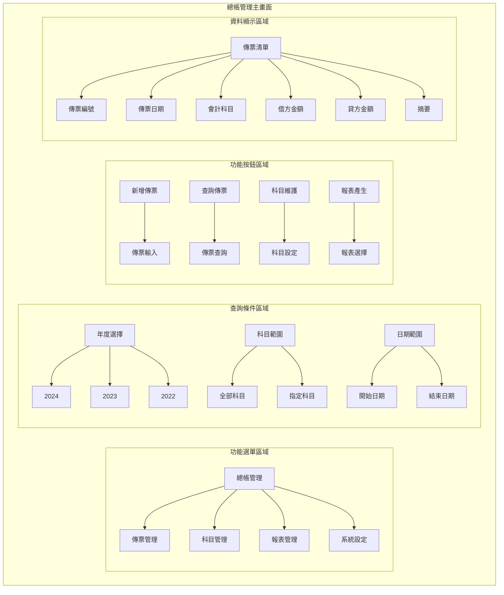

#### 4.1.2 主畫面詳細配置
```
┌─────────────────────────────────────────────────────────────┐
│                    總帳管理系統 - 主畫面                      │
├─────────────────────────────────────────────────────────────┤
│ 功能選單區域                                                │
│ ┌─────────────────────────────────────────────────────────┐ │
│ │ [總帳管理] [傳票管理] [科目管理] [報表管理] [系統設定]   │ │
│ └─────────────────────────────────────────────────────────┘ │
├─────────────────────────────────────────────────────────────┤
│ 查詢條件區域                                                │
│ ┌─────────────────────────────────────────────────────────┐ │
│ │ 年度選擇: [2024 ▼]    科目範圍: [全部科目 ▼]            │ │
│ │ 日期範圍: [2024/01/01] 至 [2024/12/31]                │ │
│ └─────────────────────────────────────────────────────────┘ │
├─────────────────────────────────────────────────────────────┤
│ 功能按鈕區域                                                │
│ [新增傳票] [查詢傳票] [科目維護] [報表產生] [資料匯出]    │
├─────────────────────────────────────────────────────────────┤
│ 傳票資料顯示區域                                            │
│ ┌─────────────────────────────────────────────────────────┐ │
│ │ 傳票編號 │ 傳票日期 │ 會計科目 │ 借方金額 │ 貸方金額 │ 摘要 │
│ ├─────────────────────────────────────────────────────────┤ │
│ │ GL001    │ 2024/12/19│ 1001    │ 10,000   │         │ 現金 │
│ │ GL002    │ 2024/12/19│ 2001    │         │ 10,000   │ 應付帳款│
│ └─────────────────────────────────────────────────────────┘ │
└─────────────────────────────────────────────────────────────┘
```

#### 4.1.3 欄位說明
| 欄位標籤 | 欄位名稱 | 欄位類型 | 必填 | 預設值 | 說明 |
|----------|----------|----------|------|--------|------|
| 年度選擇 | 會計年度 | 下拉選單 | 是 | 當前年度 | 選擇要查詢的會計年度 |
| 科目範圍 | 科目範圍 | 下拉選單 | 否 | 全部科目 | 選擇要查詢的科目範圍 |
| 開始日期 | 開始日期 | 日期選擇器 | 否 | 年度開始日 | 查詢的開始日期 |
| 結束日期 | 結束日期 | 日期選擇器 | 否 | 年度結束日 | 查詢的結束日期 |

### 4.2 傳票輸入畫面布局

#### 4.2.1 傳票輸入畫面配置圖

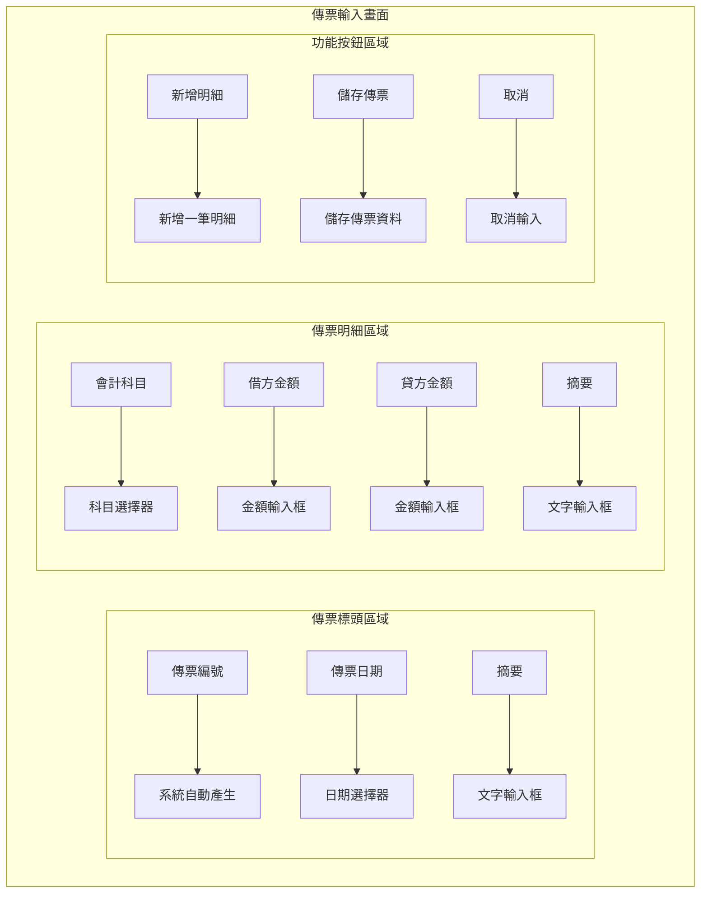

#### 4.2.2 傳票輸入詳細配置
```
┌─────────────────────────────────────────────────────────────┐
│                    傳票輸入 - 新增傳票                      │
├─────────────────────────────────────────────────────────────┤
│ 傳票標頭區域                                                │
│ ┌─────────────────────────────────────────────────────────┐ │
│ │ 傳票編號: [GL001        ] (系統自動產生)                │ │
│ │ 傳票日期: [2024/12/19 ▼]                               │ │
│ │ 摘要:     [現金存入銀行                                ] │ │
│ └─────────────────────────────────────────────────────────┘ │
├─────────────────────────────────────────────────────────────┤
│ 傳票明細區域                                                │
│ ┌─────────────────────────────────────────────────────────┐ │
│ │ 序號 │ 會計科目 │ 借方金額 │ 貸方金額 │ 摘要           │ │
│ ├─────────────────────────────────────────────────────────┤ │
│ │  1   │ [1001 ▼] │ [        ] │ [        ] │ [現金減少    ] │ │
│ │  2   │ [1002 ▼] │ [        ] │ [        ] │ [銀行存款增加] │ │
│ └─────────────────────────────────────────────────────────┘ │
├─────────────────────────────────────────────────────────────┤
│ 功能按鈕區域                                                │
│ [新增明細] [儲存傳票] [取消]                              │
└─────────────────────────────────────────────────────────────┘
```

---

## 五、處理流程程序說明

### 5.1 總帳管理主要處理流程

#### 5.1.1 傳票處理流程圖

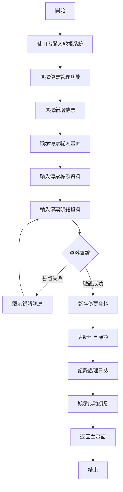

#### 5.1.2 科目管理流程圖

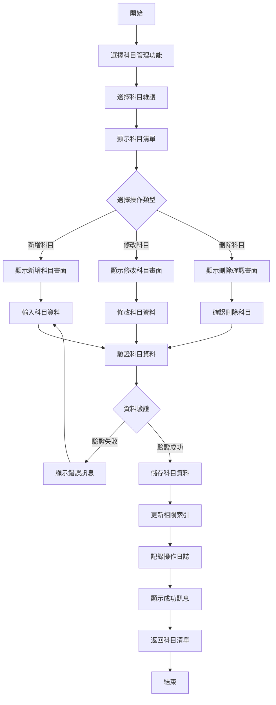

#### 5.1.3 報表產生流程圖

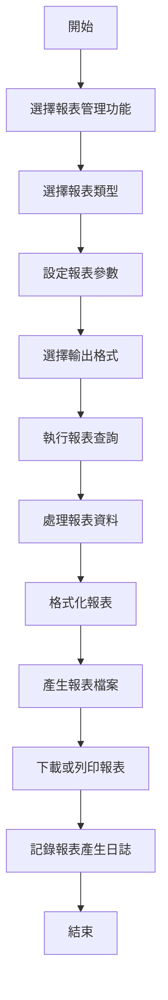

### 5.2 資料驗證流程

#### 5.2.1 傳票資料驗證流程

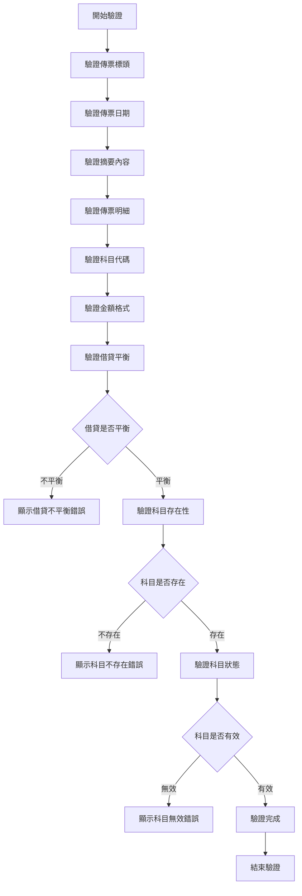

#### 5.2.2 欄位驗證規則
| 欄位名稱 | 驗證類型 | 驗證規則 | 錯誤訊息 |
|----------|----------|----------|----------|
| 傳票日期 | 日期驗證 | 日期格式：YYYYMMDD，不能超過當前日期 | 傳票日期格式錯誤或超過當前日期 |
| 會計科目 | 存在性驗證 | 科目代碼必須存在於會計科目檔中 | 會計科目不存在 |
| 借方金額 | 金額驗證 | 金額格式：正數，最多10位整數，2位小數 | 借方金額格式錯誤 |
| 貸方金額 | 金額驗證 | 金額格式：正數，最多10位整數，2位小數 | 貸方金額格式錯誤 |
| 摘要 | 長度驗證 | 摘要長度不能超過40個字元 | 摘要長度超過限制 |

#### 5.2.3 業務邏輯驗證
| 驗證項目 | 驗證邏輯 | 錯誤訊息 |
|----------|----------|----------|
| 借貸平衡 | 借方金額總和 = 貸方金額總和 | 傳票借貸不平衡，請檢查金額 |
| 科目狀態 | 科目狀態必須為有效(A) | 科目已停用，無法使用 |
| 年度限制 | 傳票年度不能超過系統年度 | 傳票年度超過系統限制 |
| 科目層級 | 明細科目不能有下級科目 | 明細科目不能有下級科目 |

---

## 六、子程序處理邏輯說明

### 6.1 子程序清單
| 子程序名稱 | 子程序代號 | 功能說明 | 呼叫時機 |
|------------|------------|----------|----------|
| 傳票編號產生 | GL001 | 自動產生傳票編號 | 新增傳票時 |
| 科目餘額更新 | GL002 | 更新科目餘額 | 儲存傳票後 |
| 借貸平衡檢查 | GL003 | 檢查傳票借貸平衡 | 儲存傳票前 |
| 科目驗證 | GL004 | 驗證科目代碼有效性 | 輸入科目時 |
| 報表資料處理 | GL005 | 處理報表查詢資料 | 產生報表時 |

### 6.2 子程序詳細說明

#### 6.2.1 傳票編號產生 (GL001)

**功能說明**：自動產生唯一的傳票編號，確保傳票編號的唯一性和連續性

**輸入參數**：
- 公司代碼 (COMPANY_CODE) - CHAR(3) - 公司代碼
- 會計年度 (FISCAL_YEAR) - CHAR(4) - 會計年度

**輸出參數**：
- 傳票編號 (VOUCHER_NO) - CHAR(8) - 產生的傳票編號
- 狀態碼 (STATUS) - CHAR(1) - 處理狀態：S成功，E失敗

**處理邏輯**：
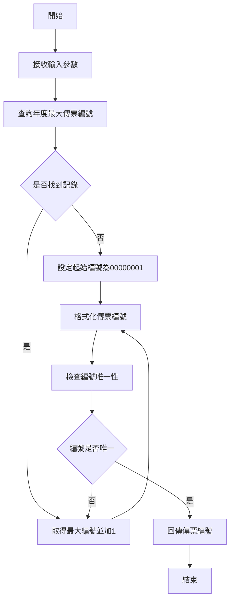

**錯誤處理**：
- 資料庫連線失敗：記錄錯誤日誌，回傳錯誤狀態
- 編號重複：自動重新產生編號
- 參數錯誤：回傳參數錯誤訊息

#### 6.2.2 科目餘額更新 (GL002)

**功能說明**：根據傳票資料更新相關科目的餘額，維護科目餘額的即時性和準確性

**輸入參數**：
- 傳票編號 (VOUCHER_NO) - CHAR(8) - 傳票編號
- 會計年度 (FISCAL_YEAR) - CHAR(4) - 會計年度
- 公司代碼 (COMPANY_CODE) - CHAR(3) - 公司代碼

**輸出參數**：
- 更新狀態 (UPDATE_STATUS) - CHAR(1) - 更新狀態：S成功，E失敗
- 更新筆數 (UPDATE_COUNT) - INTEGER - 更新的科目筆數

**處理邏輯**：
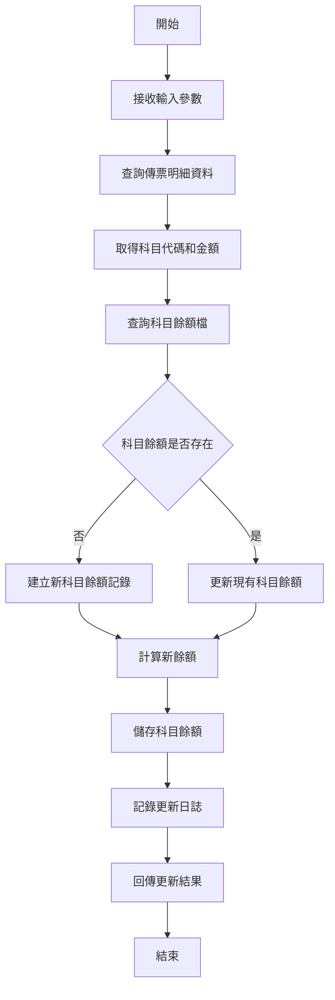

**錯誤處理**：
- 傳票資料不存在：回傳資料不存在錯誤
- 科目餘額更新失敗：回滾交易，回傳更新失敗錯誤
- 資料庫錯誤：記錄錯誤日誌，回傳系統錯誤

#### 6.2.3 借貸平衡檢查 (GL003)

**功能說明**：檢查傳票的借貸是否平衡，確保會計資料的正確性

**輸入參數**：
- 傳票明細資料 (VOUCHER_DETAILS) - ARRAY - 傳票明細陣列

**輸出參數**：
- 檢查結果 (CHECK_RESULT) - CHAR(1) - 檢查結果：P通過，F失敗
- 錯誤訊息 (ERROR_MESSAGE) - VARCHAR(200) - 錯誤訊息內容

**處理邏輯**：
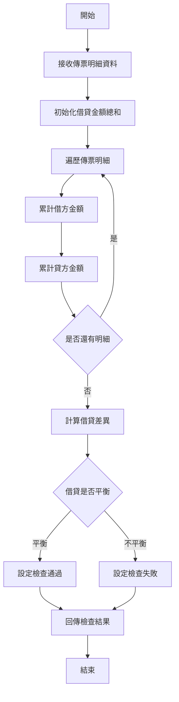

**錯誤處理**：
- 資料格式錯誤：回傳資料格式錯誤訊息
- 金額計算錯誤：回傳計算錯誤訊息
- 借貸不平衡：回傳借貸不平衡詳細訊息

---

## 七、錯誤處理程序說明與訊息清冊

### 7.1 錯誤處理流程

#### 7.1.1 錯誤處理架構圖

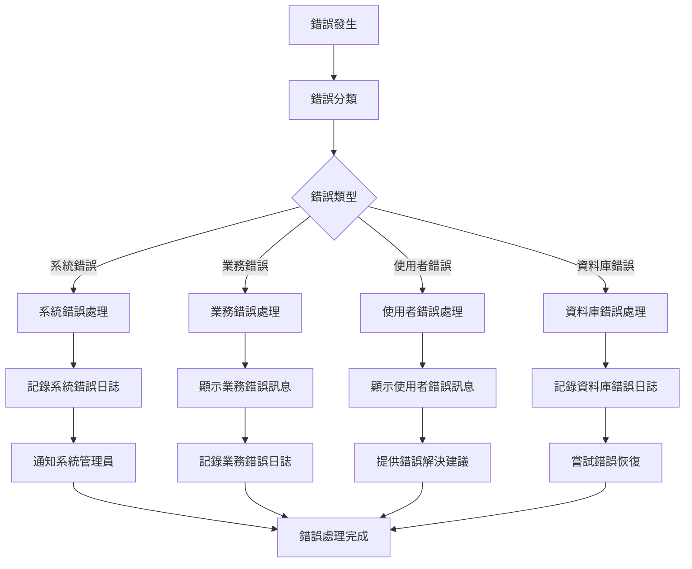

#### 7.1.2 錯誤處理策略
| 錯誤類型 | 處理策略 | 使用者通知 | 日誌記錄 |
|----------|----------|------------|----------|
| 系統錯誤 | 記錄錯誤日誌，通知管理員 | 顯示系統維護訊息 | 記錄詳細錯誤資訊 |
| 業務錯誤 | 顯示具體錯誤訊息，提供解決建議 | 顯示業務錯誤說明 | 記錄業務邏輯錯誤 |
| 使用者錯誤 | 顯示輸入錯誤，提供正確格式 | 顯示輸入格式說明 | 記錄使用者操作錯誤 |
| 資料庫錯誤 | 記錄資料庫錯誤，嘗試恢復 | 顯示系統忙碌訊息 | 記錄資料庫錯誤詳情 |

### 7.2 錯誤訊息清冊

#### 7.2.1 系統錯誤訊息
| 錯誤代碼 | 錯誤訊息 | 錯誤原因 | 解決方案 |
|----------|----------|----------|----------|
| GL001 | 系統連線失敗，請稍後再試 | 資料庫連線異常 | 檢查網路連線，聯絡系統管理員 |
| GL002 | 系統資源不足，請稍後再試 | 系統記憶體或CPU不足 | 等待系統負載降低，聯絡系統管理員 |
| GL003 | 系統維護中，請稍後再試 | 系統正在進行維護 | 等待維護完成，查看系統公告 |

#### 7.2.2 業務錯誤訊息
| 錯誤代碼 | 錯誤訊息 | 錯誤原因 | 解決方案 |
|----------|----------|----------|----------|
| GL101 | 傳票借貸不平衡，請檢查金額 | 借方金額總和不等於貸方金額總和 | 檢查傳票明細金額，確保借貸平衡 |
| GL102 | 會計科目不存在，請檢查科目代碼 | 輸入的科目代碼在系統中不存在 | 查詢正確的科目代碼，或聯絡管理員新增科目 |
| GL103 | 科目已停用，無法使用 | 選擇的科目狀態為停用 | 選擇其他有效科目，或聯絡管理員啟用科目 |
| GL104 | 傳票日期超過系統年度限制 | 傳票日期超過系統設定的年度範圍 | 選擇正確的傳票日期，或聯絡管理員調整年度設定 |

#### 7.2.3 使用者錯誤訊息
| 錯誤代碼 | 錯誤訊息 | 錯誤原因 | 解決方案 |
|----------|----------|----------|----------|
| GL201 | 傳票日期格式錯誤，請使用YYYYMMDD格式 | 日期輸入格式不正確 | 使用正確的日期格式，如：20241219 |
| GL202 | 金額格式錯誤，請輸入正確的數字格式 | 金額輸入格式不正確 | 輸入正數，最多10位整數，2位小數 |
| GL203 | 摘要長度超過限制，請縮短摘要內容 | 摘要內容超過40個字元 | 縮短摘要內容，或分段輸入 |
| GL204 | 必填欄位未輸入，請檢查輸入資料 | 必填欄位為空 | 檢查必填欄位，確保所有必要資料都已輸入 |

#### 7.2.4 資料庫錯誤訊息
| 錯誤代碼 | 錯誤訊息 | 錯誤原因 | 解決方案 |
|----------|----------|----------|----------|
| GL301 | 資料庫連線逾時，請稍後再試 | 資料庫連線超過時間限制 | 等待系統恢復，或聯絡系統管理員 |
| GL302 | 資料庫鎖定衝突，請稍後再試 | 資料被其他使用者鎖定 | 等待其他使用者完成操作，或聯絡系統管理員 |
| GL303 | 資料庫空間不足，無法儲存資料 | 資料庫磁碟空間不足 | 聯絡系統管理員清理資料庫空間 |
| GL304 | 資料庫索引損壞，請聯絡管理員 | 資料庫索引檔案損壞 | 立即聯絡系統管理員進行修復 |

---

## 八、備註

### 8.1 特殊說明
- **傳票編號規則**：傳票編號格式為 GL + 6位序號，每年重新開始編號
- **科目代碼規則**：科目代碼為5位數字，第1位代表科目類別，後4位為序號
- **金額精度**：所有金額欄位支援到小數點後2位，超過部分自動四捨五入
- **日期格式**：系統使用 YYYYMMDD 格式儲存日期，顯示時轉換為 YYYY/MM/DD 格式

### 8.2 限制條件
- **傳票數量限制**：每個公司每年最多可建立 999,999 張傳票
- **科目數量限制**：每個公司最多可建立 99,999 個會計科目
- **明細數量限制**：每張傳票最多可包含 99 筆明細
- **摘要長度限制**：傳票摘要最多 40 個字元，明細摘要最多 30 個字元

### 8.3 未來擴充
- **多幣別支援**：未來版本將支援多幣別傳票處理
- **批次傳票**：未來版本將支援批次傳票輸入和處理
- **傳票範本**：未來版本將支援傳票範本功能，提升輸入效率
- **智慧驗證**：未來版本將整合 AI 技術，提供智慧化的資料驗證

### 8.4 相關文件
- **總帳模組操作手冊**：詳細的操作步驟和畫面說明
- **總帳模組技術文件**：系統架構和技術實現細節
- **會計科目設定指南**：會計科目的設定和管理說明
- **報表產生使用手冊**：各種報表的產生和使用說明

---

## 九、文件修訂記錄

| 版本 | 修訂日期 | 修訂人員 | 修訂內容 | 修訂原因 |
|------|----------|----------|----------|----------|
| v1.0 | 2024/12/19 | 系統分析師 | 初始版本 | 文件建立 |

---

**文件建立日期**：2024年12月19日  
**最後更新日期**：2024年12月19日  
**文件狀態**：草稿  
**下次檢討日期**：2025年1月19日 