# 總帳模組資料遷移策略文件

## 一、基本資訊

| 項目 | 說明 |
|------|------|
| **系統名稱** | 10.10.10.180 企業管理系統 |
| **模組名稱** | 總帳模組 |
| **模組代號** | GL (General Ledger) |
| **功能名稱** | 總帳管理 |
| **功能代號** | GL001 |
| **撰寫人員** | 系統分析師 |
| **撰寫日期** | 2024/12/21 |
| **審核人員** | 專案經理 |
| **審核日期** | 2024/12/21 |
| **版本編號** | v1.0 |
| **文件類型** | 資料遷移策略 |
| **適用範圍** | 系統現代化轉型專案 |

---

## 二、遷移概述

### 2.1 遷移目標

#### 2.1.1 遷移範圍
- **來源系統**：IBM i (AS/400) 上的總帳模組
- **目標系統**：C# .NET + MS SQL Server 的現代化總帳系統
- **遷移資料**：會計憑證、會計科目、科目餘額、會計期間等核心資料
- **遷移方式**：一次性完整遷移 + 增量同步

#### 2.1.2 遷移目標
- **資料完整性**：確保所有歷史資料完整遷移
- **資料一致性**：維持資料間的關聯性和完整性
- **業務連續性**：最小化業務中斷時間
- **資料品質**：提升資料品質和標準化程度

### 2.2 遷移策略

#### 2.2.1 遷移策略選擇

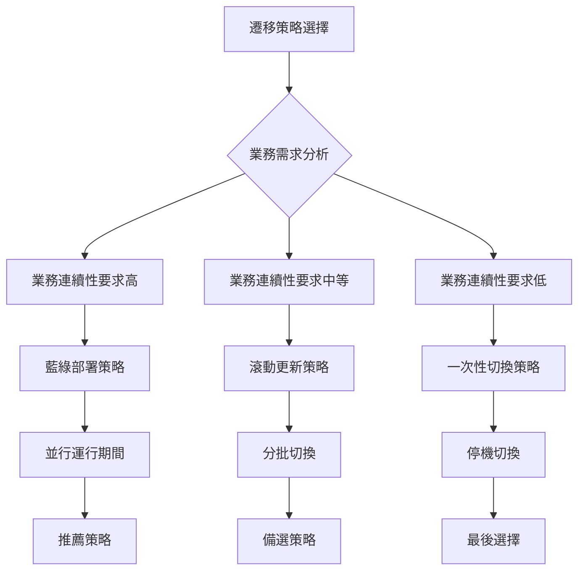

#### 2.2.2 推薦遷移策略：藍綠部署
- **優點**：業務連續性高、風險可控、可快速回滾
- **缺點**：資源需求高、成本較高
- **適用場景**：財務系統、業務連續性要求高的系統

---

## 三、資料分析與評估

### 3.1 資料量分析

#### 3.1.1 資料量統計

| 資料類型 | 預估記錄數 | 預估大小 | 增長率 | 說明 |
|----------|------------|----------|--------|------|
| **會計憑證主檔 (GLAHPF)** | 500,000 | 2.5 GB | 10%/年 | 包含所有會計憑證 |
| **會計憑證明細 (GLACPF)** | 2,000,000 | 8.0 GB | 10%/年 | 憑證明細資料 |
| **會計科目主檔 (GLACPF)** | 5,000 | 0.1 GB | 5%/年 | 會計科目設定 |
| **科目餘額檔 (GLACLF)** | 50,000 | 0.5 GB | 12%/年 | 各期間科目餘額 |
| **工作檔案 (GLWF01)** | 100,000 | 0.5 GB | 動態 | 處理中的暫存資料 |
| **總計** | **2,655,000** | **11.6 GB** | **10%/年** | **整體資料量** |

#### 3.1.2 資料增長趨勢

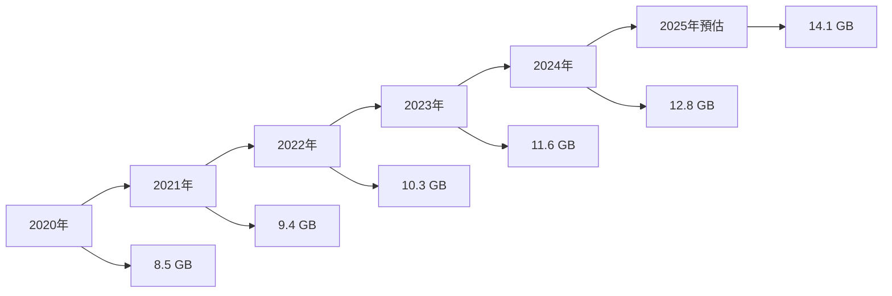

### 3.2 資料品質評估

#### 3.2.1 資料品質檢查項目

| 檢查項目 | 檢查內容 | 檢查方法 | 預期結果 |
|----------|----------|----------|----------|
| **資料完整性** | 必填欄位是否有值 | 資料庫查詢統計 | 完整率 > 99.5% |
| **資料一致性** | 借貸金額是否平衡 | 業務邏輯驗證 | 平衡率 = 100% |
| **資料準確性** | 科目代碼是否有效 | 參照完整性檢查 | 準確率 > 99.9% |
| **資料時效性** | 資料是否為最新 | 時間戳記檢查 | 時效性 = 100% |

#### 3.2.2 資料品質問題識別

| 問題類型 | 問題描述 | 影響程度 | 解決方案 |
|----------|----------|----------|----------|
| **資料缺失** | 部分憑證缺少明細資料 | 高 | 資料修復 + 驗證 |
| **資料重複** | 憑證編號重複 | 高 | 去重處理 + 重新編號 |
| **資料不一致** | 科目餘額與憑證不符 | 高 | 重新計算 + 調整 |
| **資料格式錯誤** | 日期格式不標準 | 中 | 格式轉換 + 驗證 |

### 3.3 資料依賴關係分析

#### 3.3.1 資料依賴圖

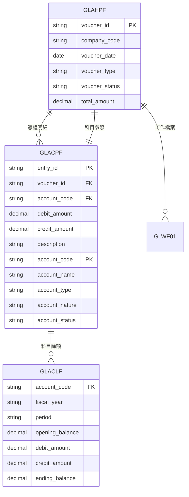

---

## 四、遷移架構設計

### 4.1 遷移架構圖

#### 4.1.1 整體遷移架構

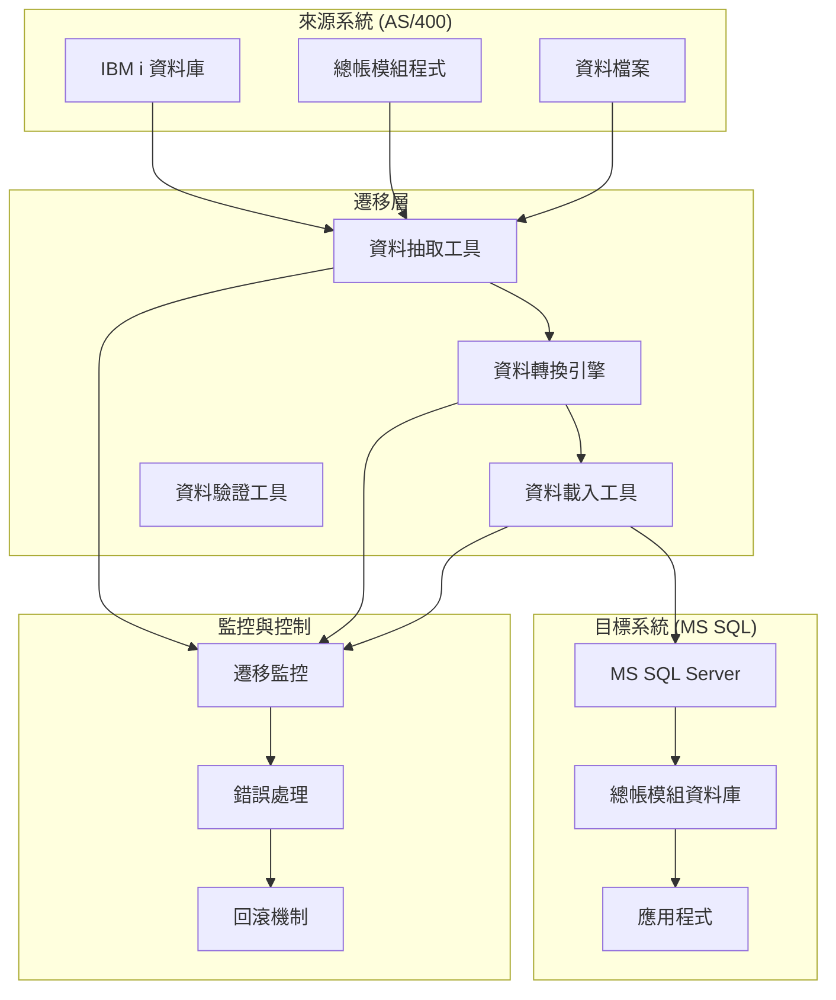

#### 4.1.2 資料流程架構

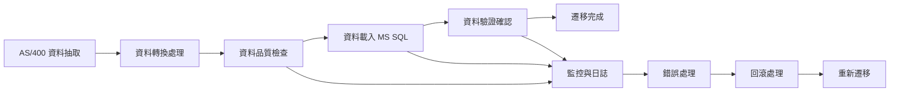

### 4.2 遷移工具選擇

#### 4.2.1 遷移工具評估

| 工具名稱 | 類型 | 優點 | 缺點 | 適用場景 |
|----------|------|------|------|----------|
| **SQL Server Integration Services (SSIS)** | ETL 工具 | 功能強大、整合性好 | 學習曲線陡峭 | 企業級資料遷移 |
| **Azure Data Factory** | 雲端 ETL | 雲端原生、擴展性好 | 成本較高 | 雲端環境遷移 |
| **自訂 C# 程式** | 自開發 | 靈活性高、成本低 | 開發時間長 | 小規模遷移 |
| **第三方 ETL 工具** | 商業工具 | 功能完整、易用 | 授權成本高 | 複雜遷移需求 |

#### 4.2.2 推薦工具：SSIS + 自訂程式
- **SSIS**：處理標準化的資料抽取和載入
- **自訂程式**：處理複雜的業務邏輯轉換
- **組合優勢**：功能完整、成本可控、靈活性高

---

## 五、遷移執行計畫

### 5.1 遷移階段規劃

#### 5.1.1 遷移階段時間表

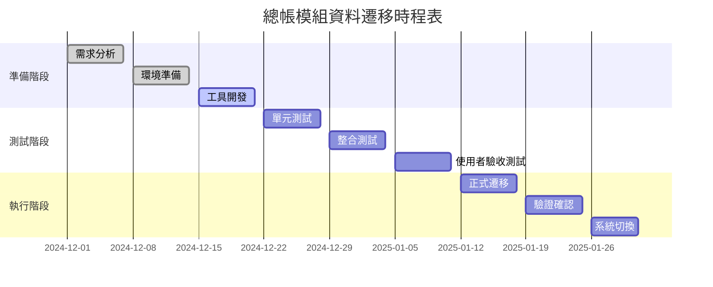

#### 5.1.2 詳細階段說明

| 階段 | 時間 | 主要活動 | 交付物 | 負責人 |
|------|------|----------|--------|--------|
| **準備階段** | 2024/12/01-21 | 需求分析、環境準備、工具開發 | 遷移工具、測試環境 | 系統分析師 |
| **測試階段** | 2024/12/22-2025/01/11 | 單元測試、整合測試、UAT | 測試報告、驗收確認 | 測試工程師 |
| **執行階段** | 2025/01/12-31 | 正式遷移、驗證確認、系統切換 | 遷移完成報告 | 專案經理 |

### 5.2 遷移執行步驟

#### 5.2.1 詳細執行步驟

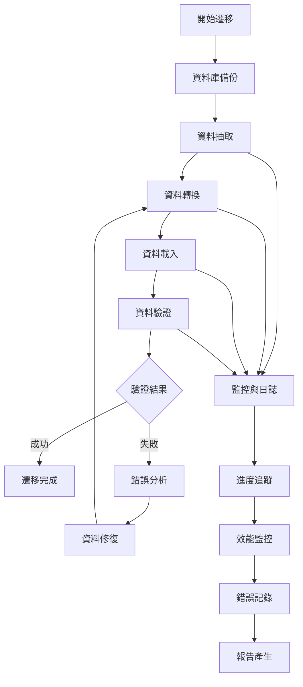

#### 5.2.2 關鍵里程碑

| 里程碑 | 時間 | 完成標準 | 檢查項目 |
|--------|------|----------|----------|
| **M1: 工具開發完成** | 2024/12/21 | 遷移工具開發完成 | 功能測試通過 |
| **M2: 測試環境就緒** | 2024/12/28 | 測試環境搭建完成 | 環境驗收通過 |
| **M3: 測試完成** | 2025/01/11 | 所有測試通過 | 測試報告確認 |
| **M4: 遷移完成** | 2025/01/18 | 資料遷移完成 | 資料驗證通過 |
| **M5: 系統切換** | 2025/01/31 | 新系統正式上線 | 業務驗收通過 |

---

## 六、資料轉換規則

### 6.1 資料結構轉換

#### 6.1.1 資料表對應關係

| AS/400 檔案 | MS SQL 資料表 | 轉換說明 |
|-------------|----------------|----------|
| **GLAHPF** | GL_Vouchers | 會計憑證主檔 |
| **GLACPF** | GL_VoucherEntries | 會計憑證明細 |
| **GLACPF** | GL_Accounts | 會計科目主檔 |
| **GLACLF** | GL_AccountBalances | 會計科目餘額 |
| **GLWF01** | GL_WorkFiles | 工作檔案 |

#### 6.1.2 欄位對應關係

##### 6.1.2.1 會計憑證主檔轉換

| AS/400 欄位 | MS SQL 欄位 | 資料類型 | 轉換規則 | 說明 |
|-------------|-------------|----------|----------|------|
| **GL01** | CompanyCode | VARCHAR(3) | 直接對應 | 公司代碼 |
| **GL02** | VoucherId | VARCHAR(20) | 直接對應 | 憑證編號 |
| **GL03** | VoucherDate | DATE | 格式轉換 | 憑證日期 |
| **GL04** | VoucherType | VARCHAR(2) | 直接對應 | 憑證類型 |
| **GL05** | VoucherStatus | VARCHAR(1) | 狀態轉換 | 憑證狀態 |
| **GL06** | Description | NVARCHAR(200) | 編碼轉換 | 憑證摘要 |
| **GL07** | TotalAmount | DECIMAL(18,2) | 直接對應 | 憑證金額 |
| **GL08** | CreatedBy | VARCHAR(10) | 直接對應 | 建立人員 |
| **GL09** | CreatedTime | DATETIME2 | 格式轉換 | 建立時間 |

##### 6.1.2.2 會計科目主檔轉換

| AS/400 欄位 | MS SQL 欄位 | 資料類型 | 轉換規則 | 說明 |
|-------------|-------------|----------|----------|------|
| **AC01** | AccountCode | VARCHAR(20) | 直接對應 | 科目代碼 |
| **AC02** | AccountName | NVARCHAR(100) | 編碼轉換 | 科目名稱 |
| **AC03** | AccountType | VARCHAR(10) | 類型轉換 | 科目類型 |
| **AC04** | AccountNature | VARCHAR(10) | 性質轉換 | 科目性質 |
| **AC05** | AccountLevel | INT | 直接對應 | 科目層級 |
| **AC06** | ParentAccount | VARCHAR(20) | 直接對應 | 父科目 |
| **AC07** | AccountStatus | VARCHAR(1) | 狀態轉換 | 科目狀態 |

### 6.2 資料轉換邏輯

#### 6.2.1 狀態碼轉換

| 原始狀態碼 | 新狀態碼 | 說明 |
|------------|----------|------|
| **A** | ACTIVE | 有效 |
| **D** | INACTIVE | 停用 |
| **P** | POSTED | 已過帳 |
| **U** | UNPOSTED | 未過帳 |
| **C** | CANCELLED | 已取消 |

#### 6.2.2 日期格式轉換

```sql
-- AS/400 日期格式轉換為 MS SQL 日期格式
-- 原始格式：YYYYMMDD (CHAR(8))
-- 目標格式：DATE

UPDATE GL_Vouchers 
SET VoucherDate = CONVERT(DATE, 
    SUBSTRING(OriginalDate, 1, 4) + '-' + 
    SUBSTRING(OriginalDate, 5, 2) + '-' + 
    SUBSTRING(OriginalDate, 7, 2))
WHERE OriginalDate IS NOT NULL;
```

#### 6.2.3 金額格式轉換

```sql
-- AS/400 壓縮十進位轉換為 MS SQL DECIMAL
-- 原始格式：PACKED DECIMAL
-- 目標格式：DECIMAL(18,2)

UPDATE GL_VoucherEntries 
SET DebitAmount = CONVERT(DECIMAL(18,2), OriginalDebitAmount / 100),
    CreditAmount = CONVERT(DECIMAL(18,2), OriginalCreditAmount / 100)
WHERE OriginalDebitAmount IS NOT NULL 
   OR OriginalCreditAmount IS NOT NULL;
```

---

## 七、資料驗證策略

### 7.1 驗證方法

#### 7.1.1 驗證層級

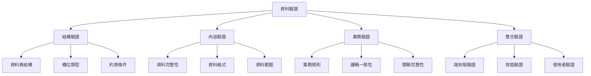

#### 7.1.2 驗證工具

| 驗證類型 | 工具/方法 | 驗證內容 | 驗證標準 |
|----------|------------|----------|----------|
| **結構驗證** | SQL 查詢 | 資料表結構、欄位類型 | 100% 符合設計規格 |
| **內容驗證** | 資料統計 | 記錄數量、欄位值 | 數量差異 < 0.1% |
| **業務驗證** | 業務邏輯 | 借貸平衡、科目有效性 | 業務規則 100% 符合 |
| **整合驗證** | 端到端測試 | 完整業務流程 | 功能 100% 正常 |

### 7.2 驗證腳本

#### 7.2.1 資料完整性驗證

```sql
-- 驗證會計憑證資料完整性
SELECT 
    'Voucher Count Check' AS CheckType,
    COUNT(*) AS SourceCount,
    (SELECT COUNT(*) FROM GL_Vouchers) AS TargetCount,
    CASE 
        WHEN COUNT(*) = (SELECT COUNT(*) FROM GL_Vouchers) 
        THEN 'PASS' 
        ELSE 'FAIL' 
    END AS Result
FROM GLAHPF
WHERE GL05 = 'A'  -- 只檢查有效憑證

UNION ALL

-- 驗證憑證明細資料完整性
SELECT 
    'Voucher Entry Count Check' AS CheckType,
    COUNT(*) AS SourceCount,
    (SELECT COUNT(*) FROM GL_VoucherEntries) AS TargetCount,
    CASE 
        WHEN COUNT(*) = (SELECT COUNT(*) FROM GL_VoucherEntries) 
        THEN 'PASS' 
        ELSE 'FAIL' 
    END AS Result
FROM GLACPF
WHERE GL02 IN (SELECT GL02 FROM GLAHPF WHERE GL05 = 'A')
```

#### 7.2.2 業務邏輯驗證

```sql
-- 驗證借貸平衡
SELECT 
    'Debit-Credit Balance Check' AS CheckType,
    COUNT(*) AS UnbalancedVouchers,
    CASE 
        WHEN COUNT(*) = 0 THEN 'PASS' 
        ELSE 'FAIL' 
    END AS Result
FROM (
    SELECT 
        v.VoucherId,
        ABS(SUM(e.DebitAmount) - SUM(e.CreditAmount)) AS BalanceDiff
    FROM GL_Vouchers v
    JOIN GL_VoucherEntries e ON v.VoucherId = e.VoucherId
    WHERE v.VoucherStatus = 'POSTED'
    GROUP BY v.VoucherId
    HAVING ABS(SUM(e.DebitAmount) - SUM(e.CreditAmount)) > 0.01
) AS Unbalanced

-- 驗證科目餘額計算
SELECT 
    'Account Balance Calculation Check' AS CheckType,
    COUNT(*) AS IncorrectBalances,
    CASE 
        WHEN COUNT(*) = 0 THEN 'PASS' 
        ELSE 'FAIL' 
    END AS Result
FROM (
    SELECT 
        a.AccountCode,
        a.OpeningBalance + a.DebitAmount - a.CreditAmount AS CalculatedBalance,
        a.EndingBalance AS StoredBalance
    FROM GL_AccountBalances a
    WHERE ABS((a.OpeningBalance + a.DebitAmount - a.CreditAmount) - a.EndingBalance) > 0.01
) AS Incorrect
```

---

## 八、風險管理與回滾策略

### 8.1 風險識別與評估

#### 8.1.1 主要風險清單

| 風險編號 | 風險描述 | 發生機率 | 影響程度 | 風險等級 | 應對策略 |
|----------|----------|----------|----------|----------|----------|
| **R001** | 資料遷移失敗 | 中 | 高 | 高 | 完整備份 + 回滾機制 |
| **R002** | 資料品質問題 | 中 | 中 | 中 | 資料驗證 + 修復流程 |
| **R003** | 系統效能下降 | 低 | 中 | 中 | 效能測試 + 優化調整 |
| **R004** | 業務中斷 | 低 | 高 | 高 | 藍綠部署 + 快速切換 |
| **R005** | 資料遺失 | 低 | 高 | 高 | 多重備份 + 驗證確認 |

#### 8.1.2 風險矩陣圖

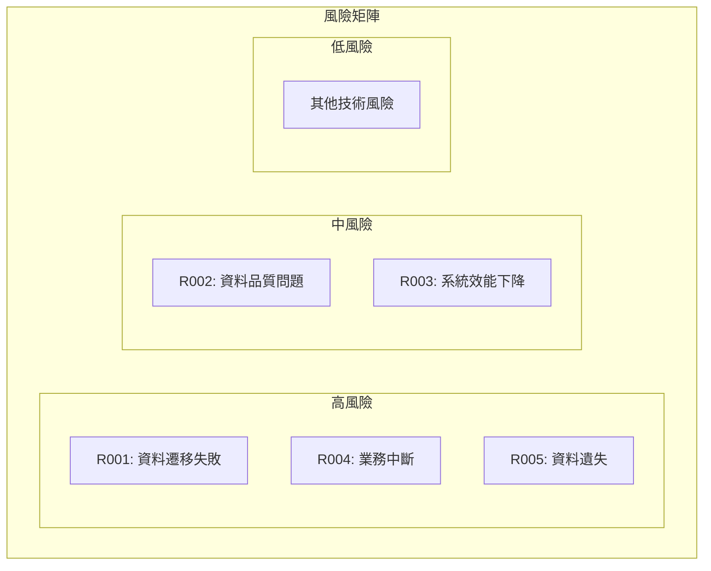

### 8.2 回滾策略

#### 8.2.1 回滾觸發條件

| 回滾條件 | 觸發時機 | 回滾範圍 | 回滾時間 |
|----------|----------|----------|----------|
| **資料完整性問題** | 資料驗證失敗 | 全部資料 | < 2 小時 |
| **系統效能問題** | 響應時間 > 5 秒 | 部分功能 | < 1 小時 |
| **業務邏輯錯誤** | 業務驗證失敗 | 相關模組 | < 4 小時 |
| **使用者體驗問題** | 使用者投訴 > 10% | 全部系統 | < 6 小時 |

#### 8.2.2 回滾執行步驟

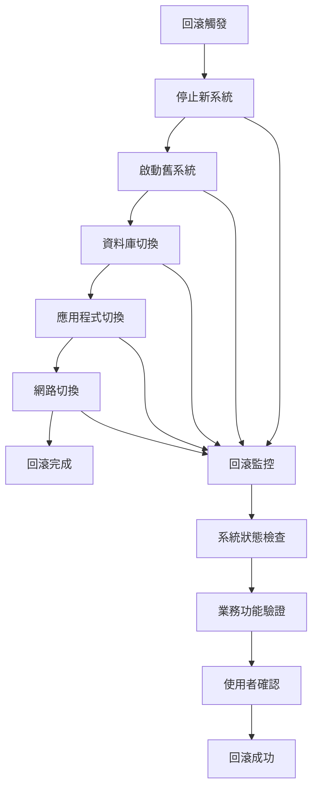

---

## 九、監控與報告

### 9.1 遷移監控

#### 9.1.1 監控指標

| 監控類別 | 監控指標 | 監控頻率 | 警報閾值 | 監控工具 |
|----------|----------|----------|----------|----------|
| **進度監控** | 遷移進度百分比 | 每 5 分鐘 | < 80% | 自訂監控面板 |
| **效能監控** | 資料處理速度 | 每分鐘 | < 1000 筆/分鐘 | 效能監控工具 |
| **錯誤監控** | 錯誤發生次數 | 即時 | > 0 | 錯誤日誌系統 |
| **資源監控** | CPU、記憶體使用率 | 每分鐘 | > 80% | 系統監控工具 |

#### 9.1.2 監控儀表板

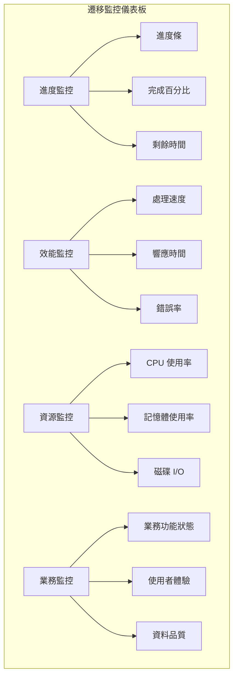

### 9.2 報告機制

#### 9.2.1 報告類型

| 報告類型 | 產生頻率 | 報告內容 | 接收對象 |
|----------|----------|----------|----------|
| **進度報告** | 每小時 | 遷移進度、完成狀態 | 專案團隊 |
| **狀態報告** | 每日 | 系統狀態、問題摘要 | 專案經理 |
| **品質報告** | 每階段 | 資料品質、驗證結果 | 品質保證團隊 |
| **總結報告** | 遷移完成 | 完整遷移總結 | 專案相關人員 |

#### 9.2.2 報告範本

```markdown
# 總帳模組資料遷移進度報告

## 報告日期：2025年1月15日
## 報告期間：2025年1月14日 00:00 - 23:59

### 遷移進度
- **整體進度**：75%
- **已完成項目**：會計科目、科目餘額
- **進行中項目**：會計憑證
- **待完成項目**：憑證明細、工作檔案

### 系統狀態
- **來源系統**：正常運行
- **目標系統**：正常運行
- **遷移工具**：正常運行

### 問題與風險
- **已解決問題**：科目代碼重複問題
- **進行中問題**：憑證日期格式轉換
- **新發現風險**：無

### 下一步計畫
- 完成憑證遷移
- 開始憑證明細遷移
- 進行資料驗證

### 建議事項
- 加強憑證資料的預處理
- 準備最終驗證環境
```

---

## 十、成功標準與驗收

### 10.1 成功標準定義

#### 10.1.1 技術成功標準

| 標準類別 | 成功標準 | 驗證方法 | 驗證工具 |
|----------|----------|----------|----------|
| **資料完整性** | 資料遺失率 < 0.01% | 資料統計比對 | 資料驗證工具 |
| **資料準確性** | 資料錯誤率 < 0.1% | 業務邏輯驗證 | 業務驗證腳本 |
| **系統效能** | 響應時間 < 3 秒 | 效能測試 | 效能測試工具 |
| **系統穩定性** | 可用性 > 99.5% | 穩定性測試 | 監控工具 |

#### 10.1.2 業務成功標準

| 標準類別 | 成功標準 | 驗證方法 | 驗證工具 |
|----------|----------|----------|----------|
| **功能完整性** | 100% 業務功能正常 | 功能測試 | 測試案例 |
| **使用者體驗** | 使用者滿意度 > 90% | 使用者測試 | 問卷調查 |
| **業務連續性** | 業務中斷時間 < 4 小時 | 業務流程測試 | 業務驗證 |
| **資料一致性** | 業務邏輯 100% 符合 | 業務規則驗證 | 業務驗證腳本 |

### 10.2 驗收流程

#### 10.2.1 驗收階段

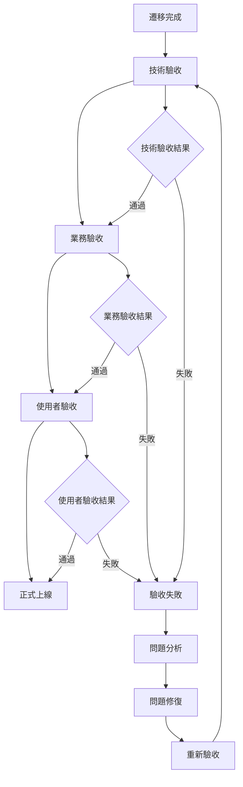

#### 10.2.2 驗收檢查清單

| 驗收項目 | 檢查內容 | 檢查方法 | 負責人 | 完成狀態 |
|----------|----------|----------|--------|----------|
| **資料完整性檢查** | 所有資料是否完整遷移 | 資料統計比對 | 資料工程師 | ⏳ |
| **資料準確性檢查** | 資料是否準確無誤 | 業務邏輯驗證 | 業務分析師 | ⏳ |
| **功能完整性檢查** | 所有功能是否正常 | 功能測試 | 測試工程師 | ⏳ |
| **效能檢查** | 系統效能是否達標 | 效能測試 | 效能工程師 | ⏳ |
| **使用者體驗檢查** | 使用者是否滿意 | 使用者測試 | 使用者代表 | ⏳ |

---

## 十一、修訂記錄

| 版本 | 修訂日期 | 修訂人員 | 修訂內容 | 修訂原因 |
|------|----------|----------|----------|----------|
| v1.0 | 2024/12/21 | 系統分析師 | 初始版本 | 文件建立 |

---

**文件建立日期**：2024年12月21日  
**最後更新日期**：2024年12月21日  
**文件狀態**：草稿  
**下次檢討日期**：2025年1月21日 