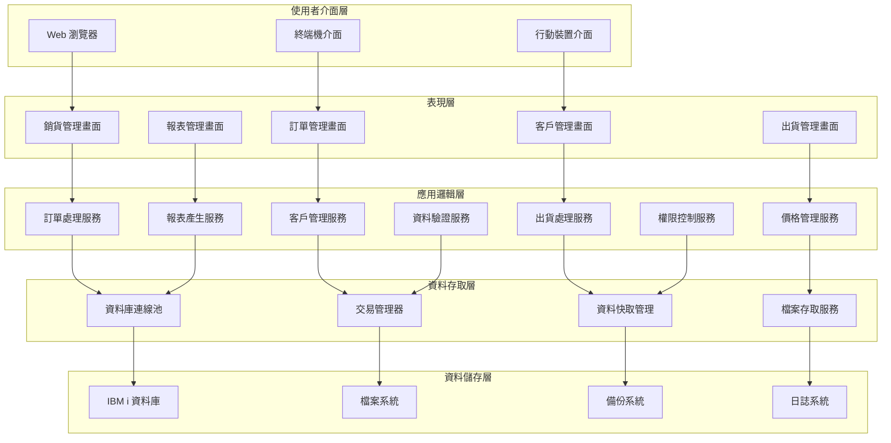
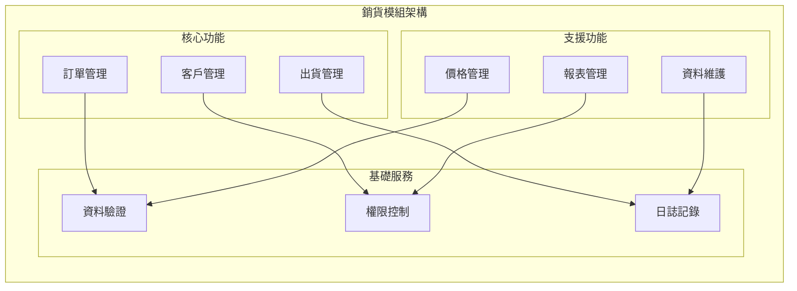

# 銷貨模組技術文件

## 一、基本資訊

| 項目 | 說明 |
|------|------|
| **系統名稱** | 10.10.10.180 企業管理系統 |
| **模組名稱** | 銷貨模組 |
| **模組代號** | NP (Sales) |
| **功能名稱** | 銷貨管理 |
| **功能代號** | NP001 |
| **撰寫人員** | 系統分析師 |
| **撰寫日期** | 2024/12/19 |
| **審核人員** | 專案經理 |
| **審核日期** | 2024/12/19 |
| **版本編號** | v1.0 |
| **技術架構** | IBM i (AS/400) + RPG/CL + DB2 for i |

---

## 二、系統架構

### 2.1 整體系統架構圖



### 2.2 模組架構圖



### 2.3 技術架構詳細說明

#### 2.3.1 技術棧組成
| 層級 | 技術選擇 | 版本 | 說明 |
|------|----------|------|------|
| **前端介面** | 5250 終端機 | IBM i 原生 | 傳統終端機介面 |
| **後端程式** | RPG/CL | IBM i 原生 | 業務邏輯處理 |
| **資料庫** | DB2 for i | IBM i 原生 | 資料儲存和查詢 |
| **作業系統** | IBM i | 最新版本 | 企業級伺服器作業系統 |

#### 2.3.2 系統整合架構
- **與總帳模組整合**：銷貨訂單產生應收帳款
- **與產品模組整合**：查詢產品資料和庫存
- **與採購模組整合**：影響庫存數量計算
- **與報表模組整合**：提供銷貨資料來源

---

## 三、資料庫設計

### 3.1 資料庫類型與配置

#### 3.1.1 資料庫類型
- **資料庫系統**：DB2 for i (IBM i 內建關聯式資料庫)
- **資料庫版本**：與 IBM i 作業系統版本同步
- **連線方式**：原生 IBM i 連線，支援 ODBC/JDBC

#### 3.1.2 資料庫配置
```sql
-- 資料庫連線設定
CREATE DATABASE NPDATA
    WITH ENCODING = 'UTF-8'
    COLLATION = 'UTF8_GENERAL_CI';

-- 銷貨模組專用 Schema
CREATE SCHEMA NP_SALES;

-- 使用者權限設定
GRANT ALL ON SCHEMA NP_SALES TO NP_USER;
GRANT SELECT ON SCHEMA NP_SALES TO NP_READER;
```

### 3.2 資料表結構

#### 3.2.1 銷貨訂單檔 (NPAHPF) 結構
```sql
-- 銷貨訂單主檔
CREATE TABLE NPAHPF (
    AH01 CHAR(3) NOT NULL,           -- 公司代碼
    AH02 CHAR(12) NOT NULL,          -- 訂單編號
    AH03 CHAR(5) NOT NULL,           -- 客戶代碼
    AH04 DATE NOT NULL,              -- 訂單日期
    AH05 CHAR(1) NOT NULL,           -- 訂單狀態
    AH06 DECIMAL(12,2) NOT NULL,     -- 訂單金額
    AH07 CHAR(2) NOT NULL,           -- 付款條件
    AH08 DATE NOT NULL,              -- 交貨日期
    AH09 VARCHAR(40) NOT NULL,       -- 交貨地址
    AH10 VARCHAR(40),                -- 備註
    AH11 CHAR(5) NOT NULL,           -- 建立人員
    AH12 TIMESTAMP NOT NULL,         -- 建立時間
    AH13 CHAR(5),                    -- 修改人員
    AH14 TIMESTAMP,                  -- 修改時間
    AH15 CHAR(1) NOT NULL DEFAULT 'A', -- 狀態
    PRIMARY KEY (AH01, AH02),
    FOREIGN KEY (AH03) REFERENCES NPACPF(AC01),
    CHECK (AH05 IN ('1','2','3','4','5')),
    CHECK (AH15 IN ('A','D'))
);

-- 建立索引
CREATE INDEX NPH002 ON NPAHPF(AH03, AH04);
CREATE INDEX NPH003 ON NPAHPF(AH05, AH04);
CREATE INDEX NPH004 ON NPAHPF(AH11, AH12);
```

#### 3.2.2 客戶主檔 (NPACPF) 結構
```sql
-- 客戶主檔
CREATE TABLE NPACPF (
    AC01 CHAR(5) NOT NULL,           -- 客戶代碼
    AC02 VARCHAR(30) NOT NULL,       -- 客戶名稱
    AC03 CHAR(1) NOT NULL,           -- 客戶類別
    AC04 VARCHAR(40) NOT NULL,       -- 聯絡地址
    AC05 VARCHAR(10) NOT NULL,       -- 聯絡電話
    AC06 VARCHAR(10) NOT NULL,       -- 聯絡人員
    AC07 DECIMAL(12,2) NOT NULL,     -- 信用額度
    AC08 CHAR(2) NOT NULL,           -- 付款條件
    AC09 VARCHAR(10),                -- 稅籍編號
    AC10 CHAR(1) NOT NULL DEFAULT 'A', -- 狀態
    AC11 CHAR(5) NOT NULL,           -- 建立人員
    AC12 TIMESTAMP NOT NULL,         -- 建立時間
    PRIMARY KEY (AC01),
    CHECK (AC03 IN ('1','2','3')),
    CHECK (AC10 IN ('A','D'))
);

-- 建立索引
CREATE INDEX NPC002 ON NPACPF(AC02);
CREATE INDEX NPC003 ON NPACPF(AC03, AC10);
CREATE INDEX NPC004 ON NPACPF(AC09);
```

#### 3.2.3 銷貨項目檔 (NPAIPF) 結構
```sql
-- 銷貨項目檔
CREATE TABLE NPAIPF (
    AI01 CHAR(12) NOT NULL,          -- 訂單編號
    AI02 INTEGER NOT NULL,           -- 序號
    AI03 CHAR(5) NOT NULL,           -- 產品代碼
    AI04 VARCHAR(30) NOT NULL,       -- 產品名稱
    AI05 VARCHAR(30),                -- 規格
    AI06 DECIMAL(8,0) NOT NULL,      -- 數量
    AI07 CHAR(2) NOT NULL,           -- 單位
    AI08 DECIMAL(10,2) NOT NULL,     -- 單價
    AI09 DECIMAL(3,2),               -- 折扣率
    AI10 DECIMAL(12,2) NOT NULL,     -- 金額
    AI11 VARCHAR(30),                -- 備註
    PRIMARY KEY (AI01, AI02),
    FOREIGN KEY (AI01) REFERENCES NPAHPF(AH02),
    FOREIGN KEY (AI03) REFERENCES PTAPF(PT01),
    CHECK (AI06 > 0),
    CHECK (AI08 > 0),
    CHECK (AI09 >= 0 AND AI09 <= 1)
);
```

### 3.3 索引策略

#### 3.3.1 主要索引
| 索引名稱 | 索引類型 | 索引欄位 | 說明 |
|----------|----------|----------|------|
| NPH001 | 主鍵索引 | AH01, AH02 | 主要查詢索引 |
| NPH002 | 一般索引 | AH03, AH04 | 客戶日期查詢索引 |
| NPH003 | 一般索引 | AH05, AH04 | 狀態日期查詢索引 |
| NPH004 | 一般索引 | AH11, AH12 | 建立人員時間索引 |

#### 3.3.2 索引優化策略
```sql
-- 統計索引（用於查詢優化）
CREATE INDEX NPH_PERF_IDX ON NPAHPF(AH04, AH05, AH15)
    WHERE AH15 = 'A';

-- 複合索引（用於複雜查詢）
CREATE INDEX NPH_COMPLEX_IDX ON NPAHPF(AH03, AH04, AH05, AH15)
    WHERE AH15 = 'A';

-- 部分索引（用於特定狀態查詢）
CREATE INDEX NPH_STATUS_IDX ON NPAHPF(AH04, AH06)
    WHERE AH05 = '2' AND AH15 = 'A';
```

### 3.4 資料關聯設計

#### 3.4.1 實體關聯圖 (ER Diagram)
```mermaid
erDiagram
    NPAHPF ||--o{ NPAIPF : "訂單明細"
    NPAHPF ||--|| NPACPF : "客戶參照"
    NPACPF ||--o{ NPACLF : "邏輯檢索"
    NPAHPF ||--o{ NPWF01 : "訂單處理"
    NPAHPF ||--o{ NPWF03 : "出貨處理"
    NPAIPF ||--|| PTAPF : "產品參照"
    
    NPAHPF {
        char(3) company_code PK
        char(12) order_number PK
        char(5) customer_code FK
        date order_date
        char(1) order_status
        decimal(12,2) order_amount
        char(2) payment_terms
        date delivery_date
        varchar(40) delivery_address
        varchar(40) remarks
        char(5) created_by
        timestamp created_time
        char(5) modified_by
        timestamp modified_time
        char(1) status
    }
    
    NPACPF {
        char(5) customer_code PK
        varchar(30) customer_name
        char(1) customer_type
        varchar(40) contact_address
        varchar(10) contact_phone
        varchar(10) contact_person
        decimal(12,2) credit_limit
        char(2) payment_terms
        varchar(10) tax_id
        char(1) status
        char(5) created_by
        timestamp created_time
    }
    
    NPAIPF {
        char(12) order_number FK
        int sequence_number PK
        char(5) product_code FK
        varchar(30) product_name
        varchar(30) specification
        decimal(8,0) quantity
        char(2) unit
        decimal(10,2) unit_price
        decimal(3,2) discount_rate
        decimal(12,2) amount
        varchar(30) remarks
    }
    
    NPWF01 {
        char(10) work_number PK
        char(12) order_number FK
        char(1) process_status
        char(1) process_type
        varchar(100) temp_data
        timestamp created_time
        timestamp completed_time
    }
```

---

## 四、API 規格

### 4.1 API 概述

#### 4.1.1 API 設計原則
- **RESTful 設計**：遵循 REST 架構原則
- **標準化回應**：統一的回應格式和錯誤處理
- **版本控制**：支援 API 版本管理
- **安全性**：完整的認證和授權機制

#### 4.1.2 API 基礎資訊
| 項目 | 說明 |
|------|------|
| **基礎 URL** | `/api/np/v1` |
| **認證方式** | JWT Token |
| **資料格式** | JSON |
| **編碼方式** | UTF-8 |
| **API 版本** | v1.0 |

### 4.2 API 端點規格

#### 4.2.1 訂單管理 API

##### 4.2.1.1 查詢訂單列表
```http
GET /api/np/v1/orders
```

**請求參數**：
```json
{
  "company_code": "001",
  "start_date": "2024-01-01",
  "end_date": "2024-12-31",
  "customer_code": "C001",
  "order_status": "2",
  "page": 1,
  "page_size": 20
}
```

**回應格式**：
```json
{
  "status": "success",
  "data": {
    "orders": [
      {
        "order_number": "NP001",
        "customer_code": "C001",
        "customer_name": "客戶A",
        "order_date": "2024-12-19",
        "order_amount": 50000.00,
        "order_status": "2",
        "delivery_date": "2024-12-25"
      }
    ],
    "pagination": {
      "current_page": 1,
      "total_pages": 5,
      "total_records": 100
    }
  }
}
```

##### 4.2.1.2 新增訂單
```http
POST /api/np/v1/orders
```

**請求格式**：
```json
{
  "company_code": "001",
  "customer_code": "C001",
  "order_date": "2024-12-19",
  "delivery_date": "2024-12-25",
  "payment_terms": "30",
  "delivery_address": "台北市信義區信義路五段7號",
  "remarks": "急件處理",
  "order_details": [
    {
      "product_code": "P001",
      "quantity": 100,
      "unit_price": 500.00,
      "discount_rate": 0.05,
      "remarks": "標準規格"
    }
  ]
}
```

**回應格式**：
```json
{
  "status": "success",
  "data": {
    "order_number": "NP001",
    "message": "訂單建立成功"
  }
}
```

#### 4.2.2 客戶管理 API

##### 4.2.2.1 查詢客戶列表
```http
GET /api/np/v1/customers
```

**請求參數**：
```json
{
  "customer_type": "1",
  "status": "A",
  "page": 1,
  "page_size": 20
}
```

**回應格式**：
```json
{
  "status": "success",
  "data": {
    "customers": [
      {
        "customer_code": "C001",
        "customer_name": "客戶A",
        "customer_type": "1",
        "contact_address": "台北市信義區信義路五段7號",
        "contact_phone": "02-23456789",
        "credit_limit": 1000000.00,
        "status": "A"
      }
    ]
  }
}
```

### 4.3 錯誤處理

#### 4.3.1 錯誤回應格式
```json
{
  "status": "error",
  "error_code": "NP001",
  "error_message": "客戶代碼不存在",
  "error_details": {
    "field": "customer_code",
    "value": "C999",
    "suggestion": "請檢查客戶代碼或聯絡管理員新增客戶"
  }
}
```

#### 4.3.2 常見錯誤代碼
| 錯誤代碼 | HTTP 狀態碼 | 錯誤訊息 | 說明 |
|----------|-------------|----------|------|
| NP001 | 400 | 客戶代碼不存在 | 請求的客戶代碼在系統中不存在 |
| NP002 | 400 | 產品代碼不存在 | 請求的產品代碼在系統中不存在 |
| NP003 | 400 | 庫存數量不足 | 訂購數量超過可用庫存 |
| NP004 | 400 | 客戶信用額度不足 | 訂單金額超過客戶信用額度 |
| NP005 | 500 | 系統內部錯誤 | 系統處理過程中發生錯誤 |

---

## 五、開發指南

### 5.1 環境設定

#### 5.1.1 開發環境需求
| 項目 | 版本 | 說明 |
|------|------|------|
| **IBM i 作業系統** | 7.4 或更新 | 支援最新的 RPG/CL 功能 |
| **IBM i Access Client Solutions** | 最新版本 | 開發和測試工具 |
| **RPG 編譯器** | 內建 | IBM i 系統內建 |
| **CL 編譯器** | 內建 | IBM i 系統內建 |

#### 5.1.2 開發工具設定
```bash
# 設定 IBM i 連線
# 在 ACS 中設定連線參數
HOST=10.10.10.180
USER=DEVELOPER
PASSWORD=****
LIBRARY=NPDEV

# 設定開發環境
CRTLIB LIB(NPDEV)
CRTSRCPF FILE(NPDEV/SOURCE)
CRTLIB LIB(NPTEST)
CRTSRCPF FILE(NPTEST/SOURCE)
```

### 5.2 程式碼標準

#### 5.2.1 RPG 程式碼標準
```rpgle
     H DATEDIT(*YMD)
     H OPTION(*SRCSTMT)
     H COPYRIGHT('Copyright 2024')
      
     FNPACPF   UF A E           K DISK
     FNPACLF   UF A E           K DISK
      
     D CustomerData     DS
     D  CustomerCode              1      5
     D  CustomerName              6     35
     D  CustomerType             36     36
     D  ContactAddress           37     76
     D  ContactPhone             77     86
     D  ContactPerson            87     96
     D  CreditLimit              97    106
     D  PaymentTerms            107    108
     D  TaxID                   109    118
     D  Status                  119    119
     D  CreatedBy               120    124
     D  CreatedTime             125    132
      
     C     *ENTRY        PLIST
     C                   PARM                    PCompanyCode
     C                   PARM                    PCustomerCode
     C                   PARM                    PAction
      
     C                   SELECT
     C                   WHEN      PAction = 'Q'
     C                   EXSR      QueryCustomer
     C                   WHEN      PAction = 'A'
     C                   EXSR      AddCustomer
     C                   WHEN      PAction = 'U'
     C                   EXSR      UpdateCustomer
     C                   WHEN      PAction = 'D'
     C                   EXSR      DeleteCustomer
     C                   OTHER
     C                   EXSR      InvalidAction
     C                   ENDSL
      
     C                   EVAL      *INLR = *ON
     C                   RETURN
      
     C     QueryCustomer BEGSR
     C                   CHAIN     (PCompanyCode:PCustomerCode) NPACPF
     C                   IF        %FOUND
     C                   EVAL      CustomerData = NPACPF
     C                   ELSE
     C                   EVAL      *INLR = *ON
     C                   ENDIF
     C                   ENDSR
```

#### 5.2.2 CL 程式碼標準
```cl
PGM        PARM(&COMPANY &CUSTOMER &ACTION)
            
            DCL        VAR(&COMPANY) TYPE(*CHAR) LEN(3)
            DCL        VAR(&CUSTOMER) TYPE(*CHAR) LEN(5)
            DCL        VAR(&ACTION) TYPE(*CHAR) LEN(1)
            DCL        VAR(&MSGID) TYPE(*CHAR) LEN(7)
            DCL        VAR(&MSGF) TYPE(*CHAR) LEN(10)
            DCL        VAR(&MSGLIB) TYPE(*CHAR) LEN(10)
            DCL        VAR(&MSGTXT) TYPE(*CHAR) LEN(132)
            
            SELECT
                WHEN    COND(&ACTION *EQ 'Q') THEN(DO)
                    CALL       PGM(NPCUST) PARM(&COMPANY &CUSTOMER 'Q')
                ENDDO
                WHEN    COND(&ACTION *EQ 'A') THEN(DO)
                    CALL       PGM(NPCUST) PARM(&COMPANY &CUSTOMER 'A')
                ENDDO
                WHEN    COND(&ACTION *EQ 'U') THEN(DO)
                    CALL       PGM(NPCUST) PARM(&COMPANY &CUSTOMER 'U')
                ENDDO
                WHEN    COND(&ACTION *EQ 'D') THEN(DO)
                    CALL       PGM(NPCUST) PARM(&COMPANY &CUSTOMER 'D')
                ENDDO
                OTHERWISE
                    SNDPGMMSG  MSGID(CPF9898) MSGF(QCPFMSG) MSGTYPE(*DIAG)
                    GOTO       CMDLBL(END)
            ENDSELECT
            
END:
            ENDPGM
```

### 5.3 測試標準

#### 5.3.1 單元測試
```rpgle
     C     TestCustomerQuery BEGSR
     C                   EVAL      PCompanyCode = '001'
     C                   EVAL      PCustomerCode = 'C001'
     C                   EVAL      PAction = 'Q'
     C                   EXSR      QueryCustomer
     C                   IF        %FOUND
     C                   EVAL      TestResult = 'PASS'
     C                   ELSE
     C                   EVAL      TestResult = 'FAIL'
     C                   ENDIF
     C                   ENDSR
```

#### 5.3.2 整合測試
- **資料庫連線測試**：測試與 DB2 for i 的連線
- **業務邏輯測試**：測試訂單處理的完整流程
- **效能測試**：測試大量資料的處理效能

---

## 六、部署指南

### 6.1 環境需求

#### 6.1.1 硬體需求
| 項目 | 最低需求 | 建議需求 | 說明 |
|------|----------|----------|------|
| **CPU** | Power7+ | Power9+ | IBM Power 處理器 |
| **記憶體** | 8GB | 16GB+ | 系統記憶體 |
| **磁碟空間** | 100GB | 500GB+ | 系統和資料儲存 |
| **網路** | 1Gbps | 10Gbps | 網路連線速度 |

#### 6.1.2 軟體需求
| 項目 | 版本 | 說明 |
|------|------|------|
| **IBM i 作業系統** | 7.4+ | 企業級伺服器作業系統 |
| **DB2 for i** | 內建 | 關聯式資料庫系統 |
| **IBM i Access** | 最新 | 系統管理和開發工具 |

### 6.2 部署步驟

#### 6.2.1 系統準備
```bash
# 1. 建立銷貨模組專用程式庫
CRTLIB LIB(NPPROD)
CRTSRCPF FILE(NPPROD/SOURCE)

# 2. 建立銷貨模組專用資料庫
CRTLIB LIB(NPDATA)
CRTSRCPF FILE(NPDATA/SOURCE)

# 3. 設定使用者權限
GRTOBJAUT OBJ(NPPROD) OBJTYPE(*LIB) USER(NPUSER) AUT(*ALL)
GRTOBJAUT OBJ(NPDATA) OBJTYPE(*LIB) USER(NPUSER) AUT(*ALL)
```

#### 6.2.2 程式部署
```bash
# 1. 編譯 RPG 程式
CRTRPGMOD MODULE(NPPROD/NPCUST) SRCFILE(NPPROD/SOURCE) SRCMBR(NPCUST)
CRTPGM PGM(NPPROD/NPCUST) MODULE(NPPROD/NPCUST)

# 2. 編譯 CL 程式
CRTCLMOD MODULE(NPPROD/NPCL) SRCFILE(NPPROD/SOURCE) SRCMBR(NPCL)
CRTPGM PGM(NPPROD/NPCL) MODULE(NPPROD/NPCL)

# 3. 建立服務程式
CRTSRVPGM SRVPGM(NPPROD/NPSRV) MODULE(NPPROD/NPCUST)
```

#### 6.2.3 資料庫部署
```sql
-- 1. 建立資料表
CREATE TABLE NPDATA.NPAHPF (...);
CREATE TABLE NPDATA.NPACPF (...);
CREATE TABLE NPDATA.NPAIPF (...);

-- 2. 建立索引
CREATE INDEX NPDATA.NPH001 ON NPDATA.NPAHPF(AH01, AH02);
CREATE INDEX NPDATA.NPH002 ON NPDATA.NPAHPF(AH03, AH04);

-- 3. 建立外鍵約束
ALTER TABLE NPDATA.NPAHPF 
ADD CONSTRAINT FK_NPAHPF_CUSTOMER 
FOREIGN KEY (AH03) REFERENCES NPDATA.NPACPF(AC01);
```

### 6.3 監控與維護

#### 6.3.1 系統監控
```bash
# 監控銷貨模組程式執行狀態
WRKACTJOB SBS(QINTER)
WRKUSRJOB USER(NPUSER)

# 監控資料庫效能
WRKSYSSTS
WRKDBF NPDATA/NPAHPF
```

#### 6.3.2 備份策略
```bash
# 每日備份銷貨資料
SAVLIB LIB(NPDATA) DEV(*SAVF) SAVF(NPDATA/DAILY_SAVE)
SAVOBJ OBJ(*ALL) LIB(NPPROD) DEV(*SAVF) SAVF(NPPROD/DAILY_SAVE)

# 每週完整備份
SAVLIB LIB(NPDATA) DEV(*SAVF) SAVF(NPDATA/WEEKLY_SAVE)
SAVLIB LIB(NPPROD) DEV(*SAVF) SAVF(NPPROD/WEEKLY_SAVE)
```

---

## 七、安全性考量

### 7.1 存取控制

#### 7.1.1 使用者權限管理
```sql
-- 建立銷貨模組專用角色
CREATE ROLE NP_READER;
CREATE ROLE NP_USER;
CREATE ROLE NP_ADMIN;

-- 設定資料表存取權限
GRANT SELECT ON NPDATA.NPAHPF TO NP_READER;
GRANT SELECT, INSERT, UPDATE ON NPDATA.NPAHPF TO NP_USER;
GRANT ALL ON NPDATA.NPAHPF TO NP_ADMIN;

-- 設定程式執行權限
GRTOBJAUT OBJ(NPPROD/NPCUST) OBJTYPE(*PGM) USER(NPUSER) AUT(*EXECUTE)
```

#### 7.1.2 資料加密
- **敏感資料加密**：客戶聯絡資訊、付款條件等敏感資料
- **傳輸加密**：使用 SSL/TLS 加密網路傳輸
- **儲存加密**：資料庫層級的資料加密

### 7.2 審計與日誌

#### 7.2.1 操作日誌
```rpgle
     C     LogOperation BEGSR
     C                   WRITE      NP_LOG
     C                   EVAL      LogTime = %TIMESTAMP
     C                   EVAL      LogUser = %USER
     C                   EVAL      LogAction = PAction
     C                   EVAL      LogData = LogData
     C                   ENDSR
```

#### 7.2.2 安全監控
- **登入記錄**：記錄所有使用者登入嘗試
- **操作記錄**：記錄所有重要業務操作
- **異常偵測**：偵測異常的存取模式

---

## 八、效能優化策略

### 8.1 資料庫優化

#### 8.1.1 查詢優化
```sql
-- 使用統計資訊優化查詢
RUNSTATS ON TABLE NPDATA.NPAHPF WITH DISTRIBUTION AND DETAILED INDEXES ALL;

-- 建立覆蓋索引
CREATE INDEX NPH_COVER_IDX ON NPDATA.NPAHPF(AH03, AH04, AH05, AH06)
    INCLUDE (AH02, AH08, AH11);

-- 使用查詢提示
SELECT /*+ INDEX(NPAHPF NPH002) */
    AH02, AH03, AH04, AH06
FROM NPDATA.NPAHPF
WHERE AH03 = 'C001' AND AH04 = '20241219';
```

#### 8.1.2 資料分割
```sql
-- 按年度分割訂單資料
CREATE TABLE NPDATA.NPAHPF_2024 
PARTITION OF NPDATA.NPAHPF
FOR VALUES FROM ('2024-01-01') TO ('2025-01-01');

CREATE TABLE NPDATA.NPAHPF_2023 
PARTITION OF NPDATA.NPAHPF
FOR VALUES FROM ('2023-01-01') TO ('2024-01-01');
```

### 8.2 應用程式優化

#### 8.2.1 程式碼優化
- **減少資料庫存取**：使用批次處理減少資料庫連線
- **快取機制**：實作記憶體快取減少重複查詢
- **非同步處理**：使用背景作業處理耗時操作

#### 8.2.2 資源管理
- **連線池管理**：管理資料庫連線池大小
- **記憶體管理**：優化記憶體使用和垃圾回收
- **CPU 使用**：平衡 CPU 負載分配

---

## 九、故障排除

### 9.1 常見問題

#### 9.1.1 資料庫連線問題
**問題描述**：無法連接到資料庫

**可能原因**：
- 資料庫服務未啟動
- 網路連線異常
- 使用者權限不足

**解決方案**：
1. 檢查資料庫服務狀態
2. 檢查網路連線
3. 檢查使用者權限設定

#### 9.1.2 程式執行錯誤
**問題描述**：程式執行時發生錯誤

**可能原因**：
- 程式編譯錯誤
- 資料庫結構變更
- 系統資源不足

**解決方案**：
1. 檢查程式編譯日誌
2. 檢查資料庫結構
3. 檢查系統資源使用

### 9.2 診斷工具

#### 9.2.1 系統診斷
```bash
# 檢查系統狀態
WRKSYSSTS
WRKACTJOB
WRKSPLF

# 檢查資料庫狀態
WRKDBF NPDATA/NPAHPF
WRKDBF NPDATA/NPACPF
```

#### 9.2.2 程式診斷
```rpgle
     C                   DUMP(A)
     C                   EVAL      *INLR = *ON
     C                   RETURN
```

---

## 十、修訂記錄

| 版本 | 修訂日期 | 修訂人員 | 修訂內容 | 修訂原因 |
|------|----------|----------|----------|----------|
| v1.0 | 2024/12/19 | 系統分析師 | 初始版本 | 文件建立 |

---

**文件建立日期**：2024年12月19日  
**最後更新日期**：2024年12月19日  
**文件狀態**：草稿  
**下次檢討日期**：2025年1月19日 