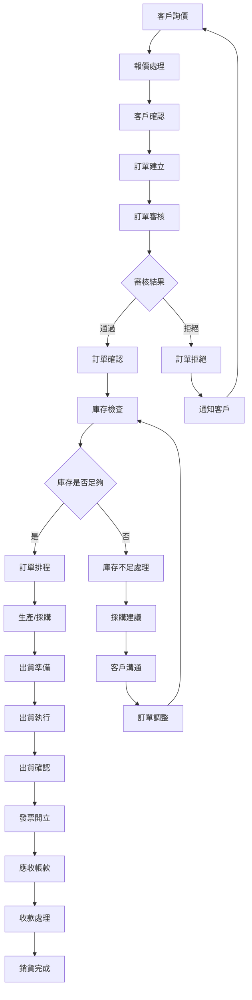
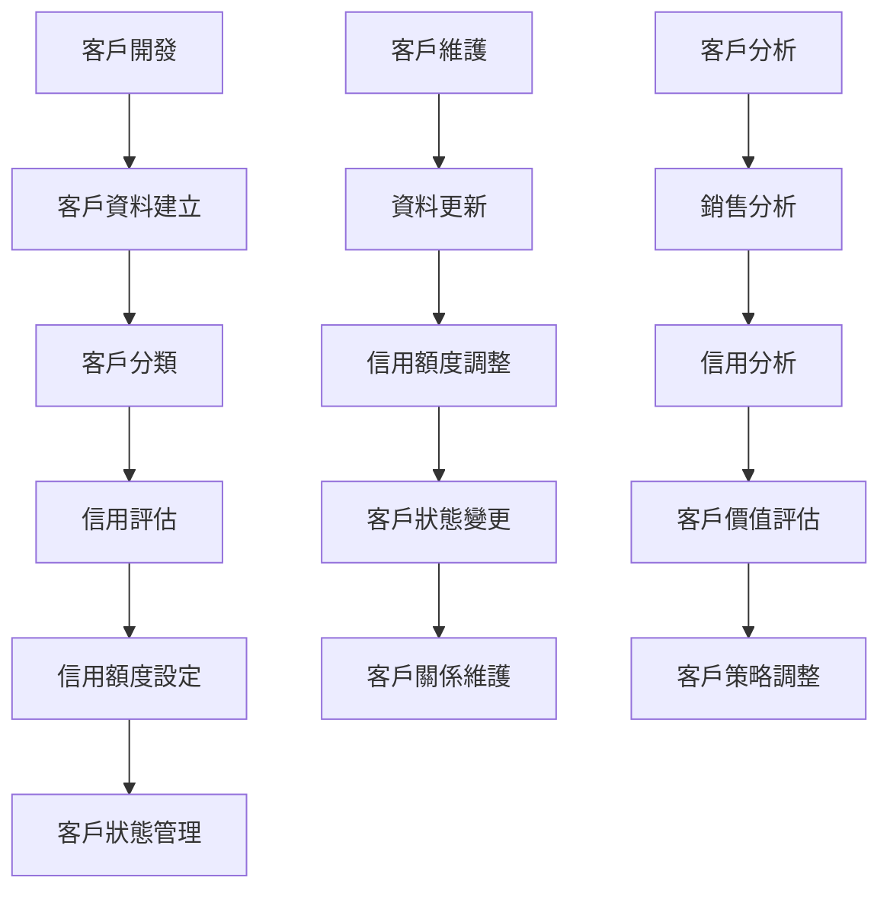
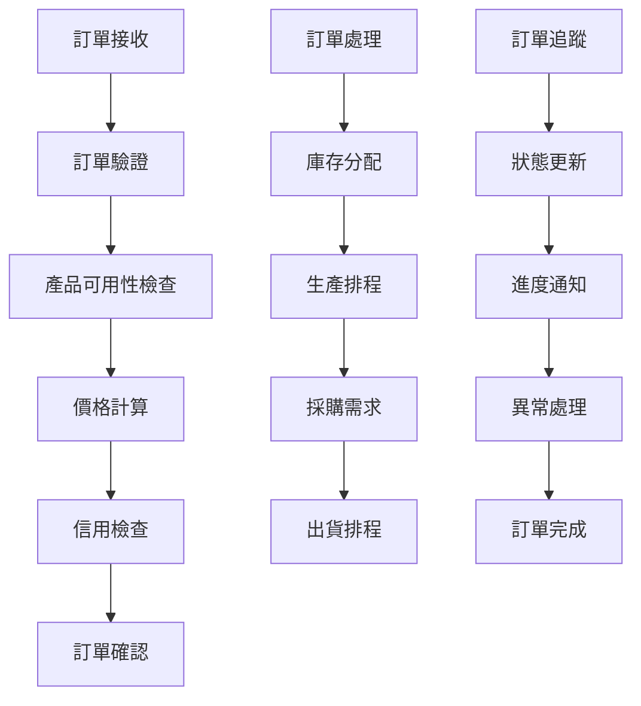
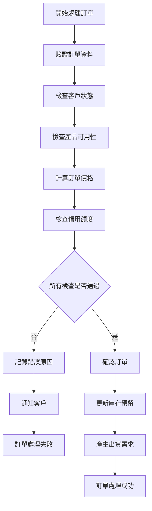
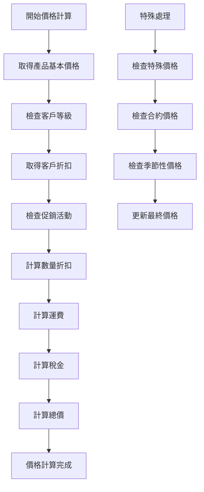
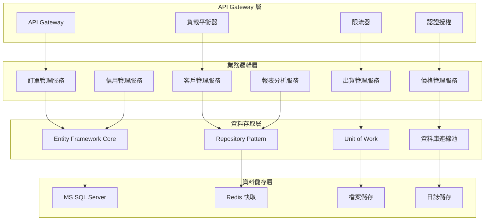

# 銷貨模組業務邏輯分析與API設計文件

## 一、基本資訊

| 項目 | 說明 |
|------|------|
| **系統名稱** | 10.10.10.180 企業管理系統 |
| **模組名稱** | 銷貨模組 |
| **模組代號** | NP (Sales) |
| **功能名稱** | 銷貨管理 |
| **功能代號** | NP001 |
| **撰寫人員** | 系統分析師 |
| **撰寫日期** | 2024/12/21 |
| **審核人員** | 專案經理 |
| **審核日期** | 2024/12/21 |
| **版本編號** | v1.0 |
| **文件類型** | 業務邏輯分析與API設計 |
| **適用範圍** | 系統現代化轉型專案 |

---

## 二、業務邏輯分析

### 2.1 業務流程分析

#### 2.1.1 銷貨管理核心業務流程



#### 2.1.2 客戶管理業務流程



#### 2.1.3 訂單處理業務流程



### 2.2 業務規則分析

#### 2.2.1 訂單管理業務規則

| 業務規則編號 | 規則名稱 | 規則內容 | 業務影響 |
|-------------|----------|----------|----------|
| **NP001** | 訂單編號唯一性 | 每個訂單必須有唯一的訂單編號 | 確保訂單識別的唯一性 |
| **NP002** | 客戶有效性檢查 | 訂單中的客戶必須存在且狀態有效 | 防止無效客戶的訂單 |
| **NP003** | 產品有效性檢查 | 訂單中的產品必須存在且可銷售 | 防止無效產品的訂單 |
| **NP004** | 價格驗證規則 | 訂單價格不能低於成本價 | 確保訂單的獲利性 |
| **NP005** | 信用額度檢查 | 訂單金額不能超過客戶信用額度 | 控制信用風險 |
| **NP006** | 庫存可用性檢查 | 訂單數量不能超過可用庫存 | 確保訂單可履行性 |

#### 2.2.2 客戶管理業務規則

| 業務規則編號 | 規則名稱 | 規則內容 | 業務影響 |
|-------------|----------|----------|----------|
| **NP007** | 客戶代碼唯一性 | 客戶代碼必須唯一 | 確保客戶識別的唯一性 |
| **NP008** | 客戶分類規則 | 客戶必須按業務規則進行分類 | 便於客戶管理和分析 |
| **NP009** | 信用額度管理 | 信用額度必須定期評估和調整 | 控制信用風險 |
| **NP010** | 客戶狀態管理 | 客戶狀態變更必須經過審核 | 確保客戶資料的準確性 |
| **NP011** | 客戶關係維護 | 重要客戶必須定期維護關係 | 提升客戶滿意度和忠誠度 |

#### 2.2.3 出貨管理業務規則

| 業務規則編號 | 規則名稱 | 規則內容 | 業務影響 |
|-------------|----------|----------|----------|
| **NP012** | 出貨單據完整性 | 出貨單據必須包含所有必要資訊 | 確保出貨記錄的完整性 |
| **NP013** | 庫存扣減規則 | 出貨時必須即時扣減庫存 | 確保庫存資料的準確性 |
| **NP014** | 出貨時效性 | 出貨必須在承諾時間內完成 | 提升客戶滿意度 |
| **NP015** | 出貨品質控制 | 出貨前必須進行品質檢查 | 確保產品品質 |
| **NP016** | 出貨追蹤 | 出貨後必須提供追蹤資訊 | 提升客戶服務品質 |

### 2.3 業務邏輯複雜度分析

#### 2.3.1 業務邏輯複雜度矩陣

| 業務功能 | 邏輯複雜度 | 資料複雜度 | 整合複雜度 | 總體複雜度 |
|----------|------------|------------|------------|------------|
| **訂單管理** | 高 | 高 | 高 | 高 |
| **客戶管理** | 中 | 中 | 中 | 中 |
| **出貨管理** | 中 | 中 | 高 | 高 |
| **價格管理** | 高 | 中 | 中 | 高 |
| **信用管理** | 中 | 中 | 低 | 中 |
| **報表分析** | 中 | 高 | 中 | 中 |

#### 2.3.2 關鍵業務邏輯分析

##### 2.3.2.1 訂單處理邏輯


##### 2.3.2.2 價格計算邏輯


---

## 三、API 設計

### 3.1 API 架構設計

#### 3.1.1 API 分層架構



#### 3.1.2 API 設計原則

| 設計原則 | 說明 | 實作方式 |
|----------|------|----------|
| **RESTful 設計** | 遵循 REST 架構原則 | 使用標準 HTTP 方法和狀態碼 |
| **版本控制** | 支援 API 版本管理 | URL 路徑版本控制 |
| **標準化回應** | 統一的回應格式 | 標準化的 JSON 回應結構 |
| **錯誤處理** | 完整的錯誤處理機制 | HTTP 狀態碼 + 錯誤訊息 |
| **安全性** | 完整的認證授權 | JWT Token + Role-based Access Control |
| **效能優化** | 支援快取和分頁 | Redis 快取 + 分頁查詢 |

### 3.2 API 端點設計

#### 3.2.1 訂單管理 API

##### 3.2.1.1 查詢訂單列表
```http
# 查詢訂單列表
GET /api/np/v1/orders
Authorization: Bearer {token}
Content-Type: application/json

Query Parameters:
- company_code: string (required)
- customer_code: string (optional)
- order_date_from: string (optional)
- order_date_to: string (optional)
- order_status: string (optional)
- page: integer (optional, default: 1)
- page_size: integer (optional, default: 20)
```

**回應格式**：
```json
{
  "status": "success",
  "data": {
    "orders": [
      {
        "order_id": "NP20241221001",
        "customer_code": "C001",
        "customer_name": "客戶A",
        "order_date": "2024-12-21",
        "order_status": "CONFIRMED",
        "total_amount": 50000.00,
        "currency": "TWD",
        "created_by": "USER001",
        "created_time": "2024-12-21T10:00:00Z"
      }
    ],
    "pagination": {
      "current_page": 1,
      "total_pages": 5,
      "total_records": 100,
      "page_size": 20
    }
  }
}
```

##### 3.2.1.2 新增訂單
```http
# 新增訂單
POST /api/np/v1/orders
Authorization: Bearer {token}
Content-Type: application/json

Request Body:
{
  "company_code": "001",
  "customer_code": "C001",
  "order_date": "2024-12-21",
  "delivery_date": "2024-12-25",
  "currency": "TWD",
  "remarks": "急件處理",
  "items": [
    {
      "product_code": "P001",
      "product_name": "產品A",
      "quantity": 100,
      "unit_price": 500.00,
      "discount_rate": 0.05,
      "remarks": "標準規格"
    }
  ]
}
```

**回應格式**：
```json
{
  "status": "success",
  "data": {
    "order_id": "NP20241221001",
    "message": "訂單建立成功"
  }
}
```

##### 3.2.1.3 訂單狀態更新
```http
# 更新訂單狀態
PUT /api/np/v1/orders/{order_id}/status
Authorization: Bearer {token}
Content-Type: application/json

Request Body:
{
  "order_status": "CONFIRMED",
  "updated_by": "USER001",
  "updated_time": "2024-12-21T10:05:00Z",
  "remarks": "訂單確認"
}
```

#### 3.2.2 客戶管理 API

##### 3.2.2.1 查詢客戶列表
```http
# 查詢客戶列表
GET /api/np/v1/customers
Authorization: Bearer {token}
Content-Type: application/json

Query Parameters:
- company_code: string (required)
- customer_type: string (optional)
- customer_status: string (optional)
- credit_rating: string (optional)
- page: integer (optional, default: 1)
- page_size: integer (optional, default: 20)
```

**回應格式**：
```json
{
  "status": "success",
  "data": {
    "customers": [
      {
        "customer_code": "C001",
        "customer_name": "客戶A",
        "customer_type": "CORPORATE",
        "customer_status": "ACTIVE",
        "credit_limit": 1000000.00,
        "credit_used": 250000.00,
        "credit_available": 750000.00,
        "contact_person": "張三",
        "contact_phone": "02-12345678",
        "contact_email": "contact@customer.com"
      }
    ]
  }
}
```

##### 3.2.2.2 新增客戶
```http
# 新增客戶
POST /api/np/v1/customers
Authorization: Bearer {token}
Content-Type: application/json

Request Body:
{
  "company_code": "001",
  "customer_name": "新客戶B",
  "customer_type": "CORPORATE",
  "customer_status": "ACTIVE",
  "credit_limit": 500000.00,
  "contact_person": "李四",
  "contact_phone": "02-87654321",
  "contact_email": "contact@newcustomer.com",
  "address": "台北市信義區信義路五段7號",
  "tax_id": "12345678"
}
```

#### 3.2.3 出貨管理 API

##### 3.2.3.1 查詢出貨列表
```http
# 查詢出貨列表
GET /api/np/v1/shipments
Authorization: Bearer {token}
Content-Type: application/json

Query Parameters:
- company_code: string (required)
- order_id: string (optional)
- shipment_date_from: string (optional)
- shipment_date_to: string (optional)
- shipment_status: string (optional)
```

##### 3.2.3.2 建立出貨單
```http
# 建立出貨單
POST /api/np/v1/shipments
Authorization: Bearer {token}
Content-Type: application/json

Request Body:
{
  "company_code": "001",
  "order_id": "NP20241221001",
  "shipment_date": "2024-12-25",
  "carrier_code": "CAR001",
  "tracking_number": "TN123456789",
  "items": [
    {
      "order_item_id": "OI001",
      "product_code": "P001",
      "quantity": 100,
      "unit_price": 500.00
    }
  ]
}
```

### 3.3 API 資料模型設計

#### 3.3.1 訂單資料模型

```csharp
// 訂單主檔
public class Order
{
    public string OrderId { get; set; }
    public string CompanyCode { get; set; }
    public string CustomerCode { get; set; }
    public DateTime OrderDate { get; set; }
    public DateTime DeliveryDate { get; set; }
    public string OrderStatus { get; set; }
    public string Currency { get; set; }
    public decimal TotalAmount { get; set; }
    public decimal DiscountAmount { get; set; }
    public decimal TaxAmount { get; set; }
    public decimal NetAmount { get; set; }
    public string Remarks { get; set; }
    public string CreatedBy { get; set; }
    public DateTime CreatedTime { get; set; }
    public string UpdatedBy { get; set; }
    public DateTime? UpdatedTime { get; set; }
    
    // 導航屬性
    public virtual Customer Customer { get; set; }
    public virtual ICollection<OrderItem> OrderItems { get; set; }
    public virtual ICollection<Shipment> Shipments { get; set; }
}

// 訂單明細
public class OrderItem
{
    public string OrderItemId { get; set; }
    public string OrderId { get; set; }
    public string ProductCode { get; set; }
    public string ProductName { get; set; }
    public int Quantity { get; set; }
    public decimal UnitPrice { get; set; }
    public decimal DiscountRate { get; set; }
    public decimal DiscountAmount { get; set; }
    public decimal NetPrice { get; set; }
    public decimal LineAmount { get; set; }
    public string Remarks { get; set; }
    
    // 導航屬性
    public virtual Order Order { get; set; }
    public virtual Product Product { get; set; }
}
```

#### 3.3.2 客戶資料模型

```csharp
// 客戶主檔
public class Customer
{
    public string CustomerCode { get; set; }
    public string CompanyCode { get; set; }
    public string CustomerName { get; set; }
    public string CustomerType { get; set; }
    public string CustomerStatus { get; set; }
    public string CreditRating { get; set; }
    public decimal CreditLimit { get; set; }
    public decimal CreditUsed { get; set; }
    public decimal CreditAvailable { get; set; }
    public string ContactPerson { get; set; }
    public string ContactPhone { get; set; }
    public string ContactEmail { get; set; }
    public string Address { get; set; }
    public string TaxId { get; set; }
    public string CreatedBy { get; set; }
    public DateTime CreatedTime { get; set; }
    public string UpdatedBy { get; set; }
    public DateTime? UpdatedTime { get; set; }
    
    // 導航屬性
    public virtual ICollection<Order> Orders { get; set; }
    public virtual ICollection<CustomerCreditHistory> CreditHistory { get; set; }
}

// 客戶信用歷史
public class CustomerCreditHistory
{
    public string HistoryId { get; set; }
    public string CustomerCode { get; set; }
    public DateTime ChangeDate { get; set; }
    public decimal OldCreditLimit { get; set; }
    public decimal NewCreditLimit { get; set; }
    public string ChangeReason { get; set; }
    public string ChangedBy { get; set; }
    
    // 導航屬性
    public virtual Customer Customer { get; set; }
}
```

### 3.4 API 安全性設計

#### 3.4.1 認證授權機制

```csharp
// JWT Token 認證
[Authorize]
[ApiController]
[Route("api/np/v1/[controller]")]
public class OrdersController : ControllerBase
{
    [HttpGet]
    [Authorize(Roles = "NP_READER,NP_USER,NP_ADMIN")]
    public async Task<ActionResult<ApiResponse<PagedResult<OrderDto>>>> GetOrders(
        [FromQuery] OrderQueryParameters parameters)
    {
        // 實作邏輯
    }
    
    [HttpPost]
    [Authorize(Roles = "NP_USER,NP_ADMIN")]
    public async Task<ActionResult<ApiResponse<OrderDto>>> CreateOrder(
        [FromBody] CreateOrderRequest request)
    {
        // 實作邏輯
    }
    
    [HttpPut("{orderId}/status")]
    [Authorize(Roles = "NP_ADMIN")]
    public async Task<ActionResult<ApiResponse<string>>> UpdateOrderStatus(
        string orderId, [FromBody] UpdateOrderStatusRequest request)
    {
        // 實作邏輯
    }
}
```

#### 3.4.2 資料驗證機制

```csharp
// 資料驗證 DTO
public class CreateOrderRequest
{
    [Required]
    [StringLength(3)]
    public string CompanyCode { get; set; }
    
    [Required]
    [StringLength(10)]
    public string CustomerCode { get; set; }
    
    [Required]
    public DateTime OrderDate { get; set; }
    
    [Required]
    public DateTime DeliveryDate { get; set; }
    
    [Required]
    [StringLength(3)]
    public string Currency { get; set; }
    
    [Required]
    [MinLength(1)]
    public List<CreateOrderItemRequest> Items { get; set; }
    
    // 自訂驗證
    [CustomValidation(typeof(OrderValidation), nameof(ValidateOrderItems))]
    public bool IsValid => true;
}

// 自訂驗證邏輯
public static class OrderValidation
{
    public static ValidationResult ValidateOrderItems(
        CreateOrderRequest request, ValidationContext context)
    {
        if (request.Items == null || request.Items.Count == 0)
        {
            return new ValidationResult("訂單必須包含至少一個項目");
        }
        
        var totalAmount = request.Items.Sum(item => 
            item.Quantity * item.UnitPrice * (1 - item.DiscountRate));
        
        if (totalAmount <= 0)
        {
            return new ValidationResult("訂單總金額必須大於零");
        }
        
        return ValidationResult.Success;
    }
}
```

---

## 四、業務邏輯轉換策略

### 4.1 RPG 到 C# 轉換策略

#### 4.1.1 程式結構轉換

| RPG 結構 | C# 對應 | 轉換說明 |
|----------|----------|----------|
| **主程式** | Main Program | 使用 Program.cs 作為程式進入點 |
| **子程序** | Private Methods | 將 RPG 子程序轉換為 C# 私有方法 |
| **資料結構** | Classes/Models | 將 RPG 資料結構轉換為 C# 類別 |
| **檔案操作** | Repository Pattern | 使用 Repository 模式處理資料存取 |
| **錯誤處理** | Exception Handling | 使用 C# 例外處理機制 |

#### 4.1.2 業務邏輯轉換範例

**RPG 原始碼**：
```rpgle
     C     ProcessOrder BEGSR
     C                   EVAL      OrderStatus = 'C'
     C                   EVAL      ProcessedBy = %USER
     C                   EVAL      ProcessedTime = %TIMESTAMP
     C                   UPDATE     NPAHPF
     C                   EXSR      UpdateInventory
     C                   EXSR      GenerateShipment
     C                   EXSR      LogOrderProcessing
     C                   ENDSR
```

**C# 轉換後**：
```csharp
private async Task ProcessOrderAsync(string orderId, string processedBy)
{
    try
    {
        var order = await _orderRepository.GetByIdAsync(orderId);
        if (order == null)
            throw new NotFoundException($"Order {orderId} not found");
        
        order.Process(processedBy);
        await _orderRepository.UpdateAsync(order);
        
        await UpdateInventoryAsync(order);
        await GenerateShipmentAsync(order);
        await LogOrderProcessingAsync(order, processedBy);
        
        await _unitOfWork.SaveChangesAsync();
    }
    catch (Exception ex)
    {
        _logger.LogError(ex, "Error processing order {OrderId}", orderId);
        throw;
    }
}
```

### 4.2 資料庫轉換策略

#### 4.2.1 資料表結構轉換

| AS/400 檔案 | MS SQL 資料表 | 轉換說明 |
|-------------|----------------|----------|
| **NPAHPF** | NP_Orders | 銷貨訂單主檔 |
| **NPACPF** | NP_OrderItems | 銷貨訂單明細 |
| **NPACPF** | NP_Customers | 客戶主檔 |
| **NPAIPF** | NP_Shipments | 出貨主檔 |
| **NPWF01** | NP_WorkFiles | 工作檔案 |

#### 4.2.2 資料類型轉換

| AS/400 型態 | MS SQL 型態 | 轉換說明 |
|-------------|-------------|----------|
| **CHAR(n)** | VARCHAR(n) | 固定長度字元轉換為可變長度 |
| **DECIMAL(p,s)** | DECIMAL(p,s) | 十進位數值保持不變 |
| **TIMESTAMP** | DATETIME2 | 時間戳記轉換為日期時間 |
| **PACKED** | DECIMAL | 壓縮十進位轉換為十進位 |

---

## 五、API 效能優化策略

### 5.1 快取策略

#### 5.1.1 Redis 快取設計

```csharp
// 快取服務介面
public interface ICacheService
{
    Task<T> GetAsync<T>(string key);
    Task SetAsync<T>(string key, T value, TimeSpan? expiry = null);
    Task RemoveAsync(string key);
    Task RemoveByPatternAsync(string pattern);
}

// 快取實作
public class RedisCacheService : ICacheService
{
    private readonly IDatabase _database;
    private readonly ILogger<RedisCacheService> _logger;
    
    public async Task<T> GetAsync<T>(string key)
    {
        var value = await _database.StringGetAsync(key);
        return value.HasValue ? JsonSerializer.Deserialize<T>(value) : default;
    }
    
    public async Task SetAsync<T>(string key, T value, TimeSpan? expiry = null)
    {
        var serializedValue = JsonSerializer.Serialize(value);
        await _database.StringSetAsync(key, serializedValue, expiry);
    }
}

// 在服務中使用快取
public class OrderService : IOrderService
{
    private readonly ICacheService _cacheService;
    
    public async Task<OrderDto> GetOrderAsync(string orderId)
    {
        var cacheKey = $"order:{orderId}";
        var cachedOrder = await _cacheService.GetAsync<OrderDto>(cacheKey);
        
        if (cachedOrder != null)
            return cachedOrder;
        
        var order = await _orderRepository.GetByIdAsync(orderId);
        var orderDto = _mapper.Map<OrderDto>(order);
        
        await _cacheService.SetAsync(cacheKey, orderDto, TimeSpan.FromMinutes(30));
        return orderDto;
    }
}
```

### 5.2 分頁查詢優化

#### 5.2.1 分頁查詢實作

```csharp
// 分頁查詢參數
public class PagedQueryParameters
{
    private int _page = 1;
    private int _pageSize = 20;
    
    public int Page
    {
        get => _page;
        set => _page = value < 1 ? 1 : value;
    }
    
    public int PageSize
    {
        get => _pageSize;
        set => _pageSize = value < 1 ? 20 : value > 100 ? 100 : value;
    }
    
    public int Skip => (Page - 1) * PageSize;
}

// 分頁結果
public class PagedResult<T>
{
    public List<T> Items { get; set; } = new();
    public int TotalCount { get; set; }
    public int Page { get; set; }
    public int PageSize { get; set; }
    public int TotalPages => (int)Math.Ceiling((double)TotalCount / PageSize);
    public bool HasPreviousPage => Page > 1;
    public bool HasNextPage => Page < TotalPages;
}

// 分頁查詢實作
public async Task<PagedResult<OrderDto>> GetOrdersAsync(OrderQueryParameters parameters)
{
    var query = _context.Orders.AsQueryable();
    
    // 套用查詢條件
    if (!string.IsNullOrEmpty(parameters.CompanyCode))
        query = query.Where(o => o.CompanyCode == parameters.CompanyCode);
    
    if (!string.IsNullOrEmpty(parameters.CustomerCode))
        query = query.Where(o => o.CustomerCode == parameters.CustomerCode);
    
    if (parameters.OrderDateFrom.HasValue)
        query = query.Where(o => o.OrderDate >= parameters.OrderDateFrom.Value);
    
    if (parameters.OrderDateTo.HasValue)
        query = query.Where(o => o.OrderDate <= parameters.OrderDateTo.Value);
    
    // 取得總數
    var totalCount = await query.CountAsync();
    
    // 分頁查詢
    var orders = await query
        .OrderByDescending(o => o.OrderDate)
        .ThenBy(o => o.OrderId)
        .Skip(parameters.Skip)
        .Take(parameters.PageSize)
        .Include(o => o.OrderItems)
        .Include(o => o.Customer)
        .ToListAsync();
    
    var orderDtos = _mapper.Map<List<OrderDto>>(orders);
    
    return new PagedResult<OrderDto>
    {
        Items = orderDtos,
        TotalCount = totalCount,
        Page = parameters.Page,
        PageSize = parameters.PageSize
    };
}
```

---

## 六、錯誤處理與日誌記錄

### 6.1 統一錯誤處理

#### 6.1.1 全域例外處理

```csharp
// 全域例外處理中介軟體
public class GlobalExceptionHandlerMiddleware
{
    private readonly RequestDelegate _next;
    private readonly ILogger<GlobalExceptionHandlerMiddleware> _logger;
    
    public async Task InvokeAsync(HttpContext context, RequestDelegate next)
    {
        try
        {
            await next(context);
        }
        catch (Exception ex)
        {
            _logger.LogError(ex, "An unhandled exception occurred");
            await HandleExceptionAsync(context, ex);
        }
    }
    
    private static async Task HandleExceptionAsync(HttpContext context, Exception exception)
    {
        context.Response.ContentType = "application/json";
        
        var response = new ApiResponse<object>
        {
            Status = "error",
            Message = "An error occurred while processing your request"
        };
        
        switch (exception)
        {
            case ValidationException validationEx:
                context.Response.StatusCode = StatusCodes.Status400BadRequest;
                response.Message = "Validation failed";
                response.Errors = validationEx.Errors;
                break;
                
            case NotFoundException notFoundEx:
                context.Response.StatusCode = StatusCodes.Status404NotFound;
                response.Message = notFoundEx.Message;
                break;
                
            case UnauthorizedAccessException:
                context.Response.StatusCode = StatusCodes.Status401Unauthorized;
                response.Message = "Unauthorized access";
                break;
                
            default:
                context.Response.StatusCode = StatusCodes.Status500InternalServerError;
                response.Message = "Internal server error";
                break;
        }
        
        await context.Response.WriteAsync(JsonSerializer.Serialize(response));
    }
}
```

#### 6.1.2 業務邏輯例外

```csharp
// 自訂例外類別
public class OrderValidationException : Exception
{
    public List<string> ValidationErrors { get; }
    
    public OrderValidationException(string message, List<string> errors = null) 
        : base(message)
    {
        ValidationErrors = errors ?? new List<string>();
    }
}

public class InsufficientInventoryException : Exception
{
    public string ProductCode { get; }
    public int RequiredQuantity { get; }
    public int AvailableQuantity { get; }
    
    public InsufficientInventoryException(string productCode, int requiredQuantity, int availableQuantity)
        : base($"Insufficient inventory for product {productCode}")
    {
        ProductCode = productCode;
        RequiredQuantity = requiredQuantity;
        AvailableQuantity = availableQuantity;
    }
}

public class CreditLimitExceededException : Exception
{
    public string CustomerCode { get; }
    public decimal OrderAmount { get; }
    public decimal AvailableCredit { get; }
    
    public CreditLimitExceededException(string customerCode, decimal orderAmount, decimal availableCredit)
        : base($"Credit limit exceeded for customer {customerCode}")
    {
        CustomerCode = customerCode;
        OrderAmount = orderAmount;
        AvailableCredit = availableCredit;
    }
}
```

### 6.2 結構化日誌記錄

#### 6.2.1 日誌記錄實作

```csharp
// 日誌記錄服務
public class LoggingService : ILoggingService
{
    private readonly ILogger<LoggingService> _logger;
    
    public void LogOrderOperation(string operation, string orderId, string userId, object data = null)
    {
        _logger.LogInformation("Order operation: {Operation} for order {OrderId} by user {UserId}",
            operation, orderId, userId);
        
        if (data != null)
        {
            _logger.LogDebug("Order operation data: {@Data}", data);
        }
    }
    
    public void LogCustomerOperation(string operation, string customerCode, string userId, object data = null)
    {
        _logger.LogInformation("Customer operation: {Operation} for customer {CustomerCode} by user {UserId}",
            operation, customerCode, userId);
        
        if (data != null)
        {
            _logger.LogDebug("Customer operation data: {@Data}", data);
        }
    }
    
    public void LogShipmentOperation(string operation, string shipmentId, string userId, object data = null)
    {
        _logger.LogInformation("Shipment operation: {Operation} for shipment {ShipmentId} by user {UserId}",
            operation, shipmentId, userId);
        
        if (data != null)
        {
            _logger.LogDebug("Shipment operation data: {@Data}", data);
        }
    }
}

// 在服務中使用日誌
public class OrderService : IOrderService
{
    private readonly ILoggingService _loggingService;
    
    public async Task<OrderDto> CreateOrderAsync(CreateOrderRequest request, string userId)
    {
        try
        {
            _loggingService.LogOrderOperation("CREATE", "NEW", userId, request);
            
            // 實作邏輯...
            
            _loggingService.LogOrderOperation("CREATED", order.OrderId, userId);
            return orderDto;
        }
        catch (Exception ex)
        {
            _loggingService.LogOrderOperation("CREATE_FAILED", "NEW", userId, ex.Message);
            throw;
        }
    }
}
```

---

## 七、API 測試策略

### 7.1 單元測試

#### 7.1.1 服務層測試

```csharp
[TestClass]
public class OrderServiceTests
{
    private Mock<IOrderRepository> _mockOrderRepository;
    private Mock<ICustomerRepository> _mockCustomerRepository;
    private Mock<IMapper> _mockMapper;
    private Mock<ILoggingService> _mockLoggingService;
    private OrderService _orderService;
    
    [TestInitialize]
    public void Setup()
    {
        _mockOrderRepository = new Mock<IOrderRepository>();
        _mockCustomerRepository = new Mock<ICustomerRepository>();
        _mockMapper = new Mock<IMapper>();
        _mockLoggingService = new Mock<ILoggingService>();
        
        _orderService = new OrderService(
            _mockOrderRepository.Object,
            _mockCustomerRepository.Object,
            _mockMapper.Object,
            _mockLoggingService.Object);
    }
    
    [TestMethod]
    public async Task CreateOrder_ValidRequest_ReturnsOrderDto()
    {
        // Arrange
        var request = new CreateOrderRequest
        {
            CompanyCode = "001",
            CustomerCode = "C001",
            OrderDate = DateTime.Today,
            DeliveryDate = DateTime.Today.AddDays(5),
            Currency = "TWD",
            Items = new List<CreateOrderItemRequest>
            {
                new() { ProductCode = "P001", Quantity = 100, UnitPrice = 500.00 }
            }
        };
        
        var order = new Order { OrderId = "NP001" };
        var orderDto = new OrderDto { OrderId = "NP001" };
        
        _mockOrderRepository.Setup(r => r.AddAsync(It.IsAny<Order>()))
            .ReturnsAsync(order);
        _mockMapper.Setup(m => m.Map<OrderDto>(order))
            .Returns(orderDto);
        
        // Act
        var result = await _orderService.CreateOrderAsync(request, "USER001");
        
        // Assert
        Assert.IsNotNull(result);
        Assert.AreEqual("NP001", result.OrderId);
        _mockOrderRepository.Verify(r => r.AddAsync(It.IsAny<Order>()), Times.Once);
    }
}
```

### 7.2 整合測試

#### 7.2.1 API 控制器測試

```csharp
[TestClass]
public class OrdersControllerTests
{
    private Mock<IOrderService> _mockOrderService;
    private OrdersController _controller;
    
    [TestInitialize]
    public void Setup()
    {
        _mockOrderService = new Mock<IOrderService>();
        _controller = new OrdersController(_mockOrderService.Object);
    }
    
    [TestMethod]
    public async Task GetOrders_ReturnsOkResult()
    {
        // Arrange
        var parameters = new OrderQueryParameters { CompanyCode = "001" };
        var expectedResult = new PagedResult<OrderDto>
        {
            Items = new List<OrderDto>(),
            TotalCount = 0,
            Page = 1,
            PageSize = 20
        };
        
        _mockOrderService.Setup(s => s.GetOrdersAsync(parameters))
            .ReturnsAsync(expectedResult);
        
        // Act
        var result = await _controller.GetOrders(parameters);
        
        // Assert
        var okResult = result.Result as OkObjectResult;
        Assert.IsNotNull(okResult);
        var response = okResult.Value as ApiResponse<PagedResult<OrderDto>>;
        Assert.IsNotNull(response);
        Assert.AreEqual("success", response.Status);
    }
}
```

---

## 八、部署與監控

### 8.1 部署策略

#### 8.1.1 Docker 容器化

```dockerfile
# Dockerfile
FROM mcr.microsoft.com/dotnet/aspnet:7.0 AS base
WORKDIR /app
EXPOSE 80
EXPOSE 443

FROM mcr.microsoft.com/dotnet/sdk:7.0 AS build
WORKDIR /src
COPY ["NP.API/NP.API.csproj", "NP.API/"]
COPY ["NP.Core/NP.Core.csproj", "NP.Core/"]
COPY ["NP.Infrastructure/NP.Infrastructure.csproj", "NP.Infrastructure/"]
RUN dotnet restore "NP.API/NP.API.csproj"
COPY . .
WORKDIR "/src/NP.API"
RUN dotnet build "NP.API.csproj" -c Release -o /app/build

FROM build AS publish
RUN dotnet publish "NP.API.csproj" -c Release -o /app/publish

FROM base AS final
WORKDIR /app
COPY --from=publish /app/publish .
ENTRYPOINT ["dotnet", "NP.API.dll"]
```

#### 8.1.2 Kubernetes 部署

```yaml
# deployment.yaml
apiVersion: apps/v1
kind: Deployment
metadata:
  name: np-api
  namespace: np-module
spec:
  replicas: 3
  selector:
    matchLabels:
      app: np-api
  template:
    metadata:
      labels:
        app: np-api
    spec:
      containers:
      - name: np-api
        image: np-api:latest
        ports:
        - containerPort: 80
        env:
        - name: ConnectionStrings__DefaultConnection
          valueFrom:
            secretKeyRef:
              name: np-db-secret
              key: connection-string
        - name: Redis__ConnectionString
          valueFrom:
            secretKeyRef:
              name: np-redis-secret
              key: connection-string
        resources:
          requests:
            memory: "256Mi"
            cpu: "250m"
          limits:
            memory: "512Mi"
            cpu: "500m"
        livenessProbe:
          httpGet:
            path: /health
            port: 80
          initialDelaySeconds: 30
          periodSeconds: 10
        readinessProbe:
          httpGet:
            path: /ready
            port: 80
          initialDelaySeconds: 5
          periodSeconds: 5
```

### 8.2 監控與健康檢查

#### 8.2.1 健康檢查端點

```csharp
// 健康檢查服務
public class HealthCheckService : IHealthCheck
{
    public async Task<HealthCheckResult> CheckHealthAsync(
        HealthCheckContext context, 
        CancellationToken cancellationToken = default)
    {
        try
        {
            // 檢查資料庫連線
            var dbHealth = await CheckDatabaseHealthAsync();
            if (!dbHealth.IsHealthy)
                return HealthCheckResult.Unhealthy("Database connection failed");
            
            // 檢查 Redis 連線
            var redisHealth = await CheckRedisHealthAsync();
            if (!redisHealth.IsHealthy)
                return HealthCheckResult.Degraded("Redis connection failed");
            
            return HealthCheckResult.Healthy("All services are healthy");
        }
        catch (Exception ex)
        {
            return HealthCheckResult.Unhealthy("Health check failed", ex);
        }
    }
    
    private async Task<HealthCheckResult> CheckDatabaseHealthAsync()
    {
        // 實作資料庫健康檢查
        return HealthCheckResult.Healthy();
    }
    
    private async Task<HealthCheckResult> CheckRedisHealthAsync()
    {
        // 實作 Redis 健康檢查
        return HealthCheckResult.Healthy();
    }
}

// 在 Startup.cs 中註冊
public void ConfigureServices(IServiceCollection services)
{
    services.AddHealthChecks()
        .AddCheck<HealthCheckService>("np_module_health_check")
        .AddSqlServer(Configuration.GetConnectionString("DefaultConnection"))
        .AddRedis(Configuration.GetConnectionString("Redis"));
}
```

---

## 九、修訂記錄

| 版本 | 修訂日期 | 修訂人員 | 修訂內容 | 修訂原因 |
|------|----------|----------|----------|----------|
| v1.0 | 2024/12/21 | 系統分析師 | 初始版本 | 文件建立 |

---

**文件建立日期**：2024年12月21日  
**最後更新日期**：2024年12月21日  
**文件狀態**：草稿  
**下次檢討日期**：2025年1月21日 