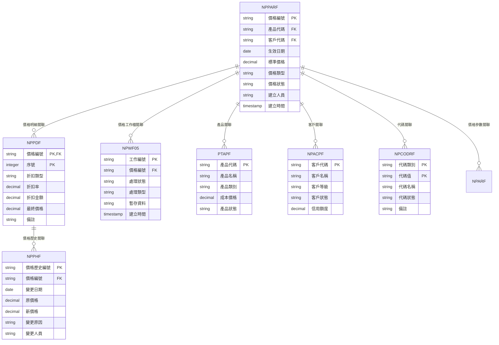
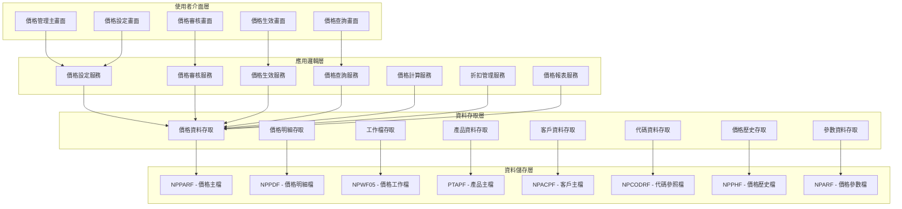
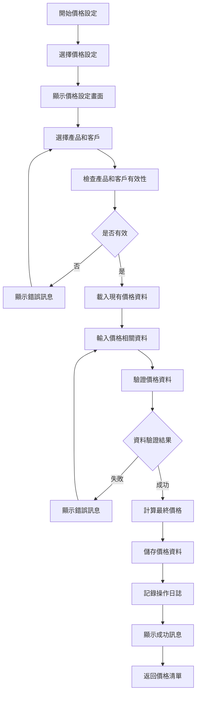
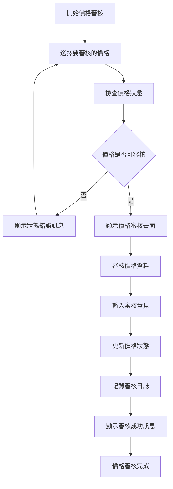
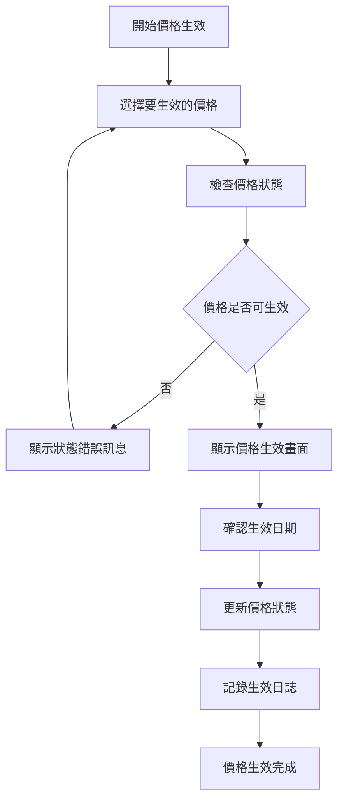
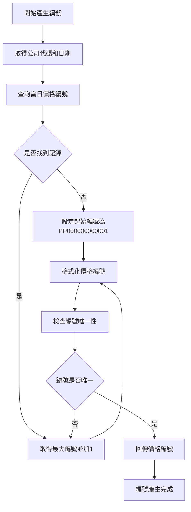
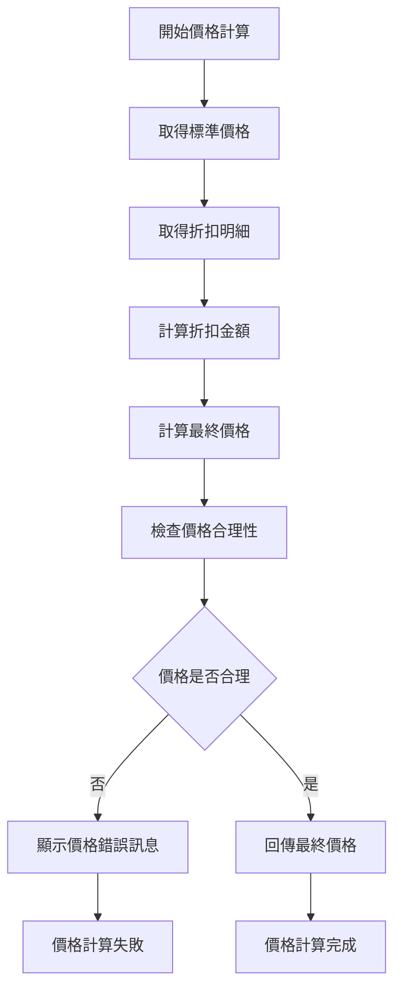
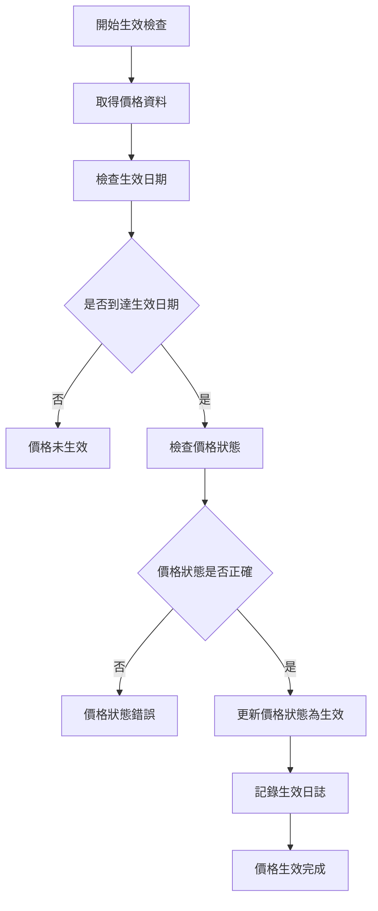
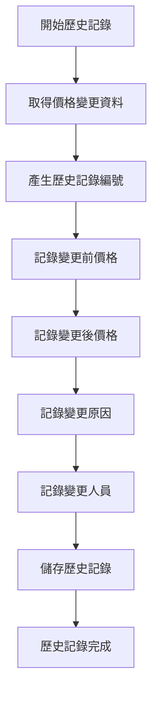
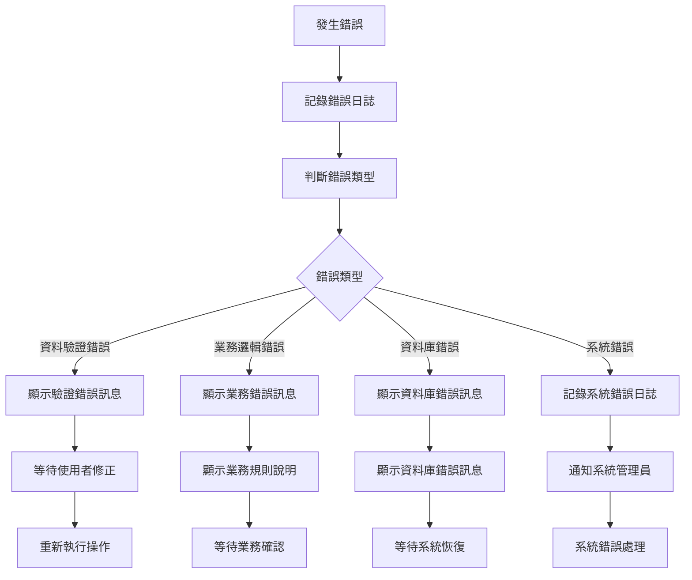

# 銷貨模組 程式功能規格書 - 價格管理

## 文件基本資訊

| 項目 | 說明 |
|------|------|
| **文件名稱** | 銷貨模組程式功能規格書 - 價格管理 |
| **模組代號** | NP |
| **版本** | v1.0 |
| **建立日期** | 2024年12月21日 |
| **建立人員** | 系統分析師 |
| **審核人員** | 專案經理 |
| **文件狀態** | 初稿 |
| **最後更新** | 2024年12月21日 |

---

## 目錄

1. [基本資料](#基本資料)
2. [檔案架構與關聯圖](#檔案架構與關聯圖)
3. [檔案名稱與欄位規格](#檔案名稱與欄位規格)
4. [輸出/入螢幕布局與說明](#輸出入螢幕布局與說明)
5. [處理流程程序說明](#處理流程程序說明)
6. [子程序處理邏輯說明](#子程序處理邏輯說明)
7. [錯誤處理程序說明與訊息清冊](#錯誤處理程序說明與訊息清冊)
8. [備註](#備註)

---

## 基本資料

### 1.1 模組概述

#### 1.1.1 模組功能說明
銷貨模組的價格管理功能主要負責管理企業的產品定價策略，包括標準價格設定、客戶等級價格、數量折扣、促銷價格、價格審核、價格生效管理、價格歷史追蹤、價格報表等。此功能為銷貨業務提供完整的價格生命週期管理，從價格制定到價格生效，再到價格調整，確保價格管理的準確性和靈活性。

#### 1.1.2 模組特色
- **完整價格生命週期管理**：涵蓋價格制定、價格審核、價格生效、價格調整、價格歷史追蹤等全流程
- **多層級價格策略**：支援標準價格、客戶等級價格、數量折扣、促銷價格等多種價格策略
- **自動化價格計算**：系統自動計算各種折扣和加價後的實際價格
- **即時價格生效**：價格變更可設定即時生效或延遲生效
- **價格歷史追蹤**：完整的價格變更歷史記錄和追蹤
- **多種價格類型支援**：支援單價、總價、折扣率、加價率等多種價格類型

#### 1.1.3 適用範圍
適用於企業銷貨業務中的價格管理作業，包括標準價格設定、客戶等級價格、數量折扣、促銷價格、價格審核、價格生效管理、價格歷史追蹤、價格報表等各類價格相關業務功能。

### 1.2 技術架構

#### 1.2.1 開發技術
- **程式語言**：RPG、CL、SQL
- **資料庫**：DB2 for i (IBM i)
- **開發工具**：IBM i 開發環境
- **部署環境**：IBM i 7.4

#### 1.2.2 系統需求
- **硬體需求**：IBM i 伺服器
- **軟體需求**：IBM i 作業系統、DB2 for i
- **網路需求**：企業內部網路連線

---

## 檔案架構與關聯圖

### 2.1 資料庫檔案架構

#### 2.1.1 主要資料表


#### 2.1.2 檔案關聯說明
- **NPPARF (價格主檔)**：儲存價格的基本資料和標頭資訊
- **NPPDF (價格明細檔)**：儲存價格的折扣和加價明細資料
- **NPWF05 (價格工作檔)**：儲存價格處理過程中的暫存資料和工作狀態
- **PTAPF (產品主檔)**：儲存產品的基本資料和成本資訊
- **NPACPF (客戶主檔)**：儲存客戶的基本資料和等級資訊
- **NPCODRF (代碼參照檔)**：儲存價格相關的代碼對照資料
- **NPPHF (價格歷史檔)**：儲存價格變更的歷史記錄
- **NPARF (價格參數檔)**：儲存價格管理相關的系統參數

### 2.2 系統架構圖

#### 2.2.1 價格管理系統架構


---

## 檔案名稱與欄位規格

### 3.1 主要檔案規格

#### 3.1.1 NPPARF - 價格主檔

| 欄位代號 | 欄位名稱 | 位置 | 長度 | 型態 | 屬性 | 檢核說明 |
|----------|----------|------|------|------|------|----------|
| PP01 | 公司代碼 | 1-3 | 3 | A | PK | 必填，公司唯一識別碼 |
| PP02 | 價格編號 | 4-15 | 12 | A | PK | 必填，價格唯一識別碼 |
| PP03 | 產品代碼 | 16-20 | 5 | A | FK | 必填，參照產品主檔 |
| PP04 | 客戶代碼 | 21-25 | 5 | A | FK | 必填，參照客戶主檔 |
| PP05 | 價格類型 | 26-27 | 2 | A | M | 必填，值：01-標準價格、02-客戶等級價格、03-數量折扣、04-促銷價格、05-特殊價格 |
| PP06 | 生效日期 | 28-35 | 8 | D | M | 必填，價格生效日期 |
| PP07 | 失效日期 | 36-43 | 8 | D | O | 選填，價格失效日期 |
| PP08 | 標準價格 | 44-53 | 10 | P | M | 必填，標準單價，小數點後2位 |
| PP09 | 最終價格 | 54-63 | 10 | P | M | 必填，折扣後最終價格，小數點後2位 |
| PP10 | 價格狀態 | 64-64 | 1 | A | M | 必填，值：D-草稿、P-待審核、A-已審核、E-生效中、X-已失效 |
| PP11 | 審核人員 | 65-69 | 5 | A | O | 選填，審核價格的人員代號 |
| PP12 | 審核日期 | 70-77 | 8 | D | O | 選填，價格審核日期 |
| PP13 | 生效人員 | 78-82 | 5 | A | O | 選填，價格生效的人員代號 |
| PP14 | 生效日期 | 83-90 | 8 | D | O | 選填，價格實際生效日期 |
| PP15 | 備註 | 91-130 | 40 | A | O | 選填，最多40字元 |
| PP16 | 建立人員 | 131-135 | 5 | A | M | 必填，參照使用者檔 |
| PP17 | 建立時間 | 136-143 | 8 | T | M | 必填，系統自動產生 |
| PP18 | 修改人員 | 144-148 | 5 | A | O | 選填，最後修改價格的使用者代號 |
| PP19 | 修改時間 | 149-156 | 8 | T | O | 選填，最後修改時間 |

#### 3.1.2 NPPDF - 價格明細檔

| 欄位代號 | 欄位名稱 | 位置 | 長度 | 型態 | 屬性 | 檢核說明 |
|----------|----------|------|------|------|------|----------|
| PPD01 | 價格編號 | 1-12 | 12 | A | PK,FK | 必填，參照NPPARF.PP02 |
| PPD02 | 序號 | 13-15 | 3 | I | PK | 必填，1-999 |
| PPD03 | 折扣類型 | 16-17 | 2 | A | M | 必填，值：01-數量折扣、02-客戶等級折扣、03-促銷折扣、04-季節折扣、05-其他折扣 |
| PPD04 | 折扣條件 | 18-27 | 10 | A | M | 必填，折扣的條件說明 |
| PPD05 | 折扣率 | 28-33 | 6 | P | M | 必填，折扣率，小數點後4位 |
| PPD06 | 折扣金額 | 34-43 | 10 | P | M | 必填，折扣金額，小數點後2位 |
| PPD07 | 最終價格 | 44-53 | 10 | P | M | 必填，折扣後最終價格，小數點後2位 |
| PPD08 | 生效日期 | 54-61 | 8 | D | M | 必填，折扣生效日期 |
| PPD09 | 失效日期 | 62-69 | 8 | D | O | 選填，折扣失效日期 |
| PPD10 | 備註 | 70-99 | 30 | A | O | 選填，最多30字元 |

#### 3.1.3 NPWF05 - 價格工作檔

| 欄位代號 | 欄位名稱 | 位置 | 長度 | 型態 | 屬性 | 檢核說明 |
|----------|----------|------|------|------|------|----------|
| WF0501 | 工作編號 | 1-10 | 10 | A | PK | 必填，工作唯一識別碼 |
| WF0502 | 價格編號 | 11-22 | 12 | A | FK | 必填，參照價格檔 |
| WF0503 | 處理狀態 | 23-23 | 1 | A | M | 必填，值：P-處理中、C-完成、E-錯誤 |
| WF0504 | 處理類型 | 24-24 | 1 | A | M | 必填，值：1-新增、2-修改、3-刪除、4-狀態變更 |
| WF0505 | 暫存資料 | 25-124 | 100 | A | O | 選填，處理中的暫存資料 |
| WF0506 | 建立時間 | 125-132 | 8 | T | M | 必填，系統自動產生 |
| WF0507 | 完成時間 | 133-140 | 8 | T | O | 選填，處理完成時間 |
| WF0508 | 錯誤訊息 | 141-190 | 50 | A | O | 選填，處理錯誤時的錯誤訊息 |
| WF0509 | 處理人員 | 191-195 | 5 | A | O | 選填，處理工作的人員代號 |

#### 3.1.4 NPPHF - 價格歷史檔

| 欄位代號 | 欄位名稱 | 位置 | 長度 | 型態 | 屬性 | 檢核說明 |
|----------|----------|------|------|------|------|----------|
| PH01 | 價格歷史編號 | 1-15 | 15 | A | PK | 必填，價格歷史唯一識別碼 |
| PH02 | 價格編號 | 16-27 | 12 | A | FK | 必填，參照價格檔 |
| PH03 | 變更日期 | 28-35 | 8 | D | M | 必填，價格變更日期 |
| PH04 | 變更類型 | 36-37 | 2 | A | M | 必填，值：01-新增、02-修改、03-刪除、04-生效、05-失效 |
| PH05 | 原價格 | 38-47 | 10 | P | O | 選填，變更前的價格 |
| PH06 | 新價格 | 48-57 | 10 | P | O | 選填，變更後的價格 |
| PH07 | 變更原因 | 58-77 | 20 | A | M | 必填，價格變更的原因 |
| PH08 | 變更人員 | 78-82 | 5 | A | M | 必填，執行價格變更的人員代號 |
| PH09 | 備註 | 83-122 | 40 | A | O | 選填，最多40字元 |
| PH10 | 建立時間 | 123-130 | 8 | T | M | 必填，系統自動產生 |

#### 3.1.5 NPARF - 價格參數檔

| 欄位代號 | 欄位名稱 | 位置 | 長度 | 型態 | 屬性 | 檢核說明 |
|----------|----------|------|------|------|------|----------|
| ARF01 | 參數代號 | 1-5 | 5 | A | PK | 必填，參數唯一識別碼 |
| ARF02 | 參數名稱 | 6-35 | 30 | A | M | 必填，參數的中文名稱 |
| ARF03 | 參數值 | 36-85 | 50 | A | M | 必填，參數的當前值 |
| ARF04 | 參數類型 | 86-87 | 2 | A | M | 必填，值：01-字串、02-數值、03-日期、04-布林 |
| ARF05 | 參數狀態 | 88-89 | 2 | A | M | 必填，值：01-啟用、02-停用、03-維護中 |
| ARF06 | 建立人員 | 90-94 | 5 | A | M | 必填，建立參數的使用者代號 |
| ARF07 | 建立時間 | 95-102 | 8 | T | M | 必填，系統自動產生 |
| ARF08 | 修改人員 | 103-107 | 5 | A | O | 選填，最後修改參數的使用者代號 |
| ARF09 | 修改時間 | 108-115 | 8 | T | O | 選填，最後修改時間 |
| ARF10 | 備註 | 116-155 | 40 | A | O | 選填，參數備註說明 |

### 3.2 索引資料

#### 3.2.1 主要索引
- **NPPARF 主鍵索引**：PP01 + PP02 (公司代碼 + 價格編號)
- **NPPARF 產品代碼索引**：PP03 (產品代碼)
- **NPPARF 客戶代碼索引**：PP04 (客戶代碼)
- **NPPARF 價格類型索引**：PP05 (價格類型)
- **NPPARF 生效日期索引**：PP06 (生效日期)
- **NPPARF 價格狀態索引**：PP10 (價格狀態)

#### 3.2.2 次要索引
- **NPPDF 主鍵索引**：PPD01 + PPD02 (價格編號 + 序號)
- **NPPDF 價格編號索引**：PPD01 (價格編號)
- **NPPDF 折扣類型索引**：PPD03 (折扣類型)
- **NPWF05 主鍵索引**：WF0501 (工作編號)
- **NPWF05 價格編號索引**：WF0502 (價格編號)
- **NPPHF 主鍵索引**：PH01 (價格歷史編號)
- **NPPHF 價格編號索引**：PH02 (價格編號)
- **NPARF 主鍵索引**：ARF01 (參數代號)

---

## 輸出/入螢幕布局與說明

### 4.1 價格管理主畫面

#### 4.1.1 畫面布局
```
┌─────────────────────────────────────────────────────────────┐
│                    價格管理系統                            │
├─────────────────────────────────────────────────────────────┤
│ 功能選項：                                                  │
│  [1]價格設定  [2]價格審核  [3]價格生效  [4]價格查詢      │
│  [5]價格歷史  [6]價格報表  [7]價格匯出  [8]離開系統      │
├─────────────────────────────────────────────────────────────┤
│ 查詢條件：                                                  │
│  日期範圍：[2024/01/01] 至 [2024/12/31]                  │
│  產品範圍：[全部產品 ▼] 客戶範圍：[全部客戶 ▼]            │
│  價格類型：[全部類型 ▼] 價格狀態：[全部狀態 ▼]            │
│  關鍵字：[                ] [查詢] [清除]                  │
├─────────────────────────────────────────────────────────────┤
│ 價格清單：                                                  │
│ ┌─────┬──────────┬──────────┬──────────┬──────────┬────────┐ │
│ │序號 │價格編號  │產品名稱  │客戶名稱  │標準價格  │狀態    │ │
│ ├─────┼──────────┼──────────┼──────────┼──────────┼────────┤ │
│ │  1  │PP001     │產品A     │客戶A     │500       │生效中  │ │
│ │  2  │PP002     │產品B     │客戶B     │750       │待審核  │ │
│ └─────┴──────────┴──────────┴──────────┴──────────┴────────┘ │
├─────────────────────────────────────────────────────────────┤
│ 功能鍵：F1=說明  F3=離開  F4=價格設定  F6=修改  F8=刪除  F12=取消│
└─────────────────────────────────────────────────────────────┘
```

#### 4.1.2 畫面說明
- **功能選項區**：提供價格管理的主要功能選項
- **查詢條件區**：設定價格查詢的相關條件
- **價格清單區**：顯示符合查詢條件的價格資料
- **功能鍵區**：說明可使用的功能鍵

### 4.2 價格設定畫面

#### 4.2.1 畫面布局
```
┌─────────────────────────────────────────────────────────────┐
│                      價格設定                              │
├─────────────────────────────────────────────────────────────┤
│ 價格標頭區域                                                │
│ ┌─────────────────────────────────────────────────────────┐ │
│ │ 價格編號: [PP001        ] (系統自動產生)                │ │
│ │ 產品代碼: [P001 ▼]      產品名稱: [產品A              ] │ │
│ │ 客戶代碼: [C001 ▼]      客戶名稱: [客戶A              ] │ │
│ │ 價格類型: [標準價格 ▼]   生效日期: [2024/12/21 ▼]       │ │
│ │ 標準價格: [500        ]  最終價格: [450              ] │ │
│ └─────────────────────────────────────────────────────────┘ │
├─────────────────────────────────────────────────────────────┤
│ 價格明細區域                                                │
│ ┌─────────────────────────────────────────────────────────┐ │
│ │ 序號 │ 折扣類型 │ 折扣條件 │ 折扣率 │ 折扣金額 │ 最終價格 │ │
│ ├─────────────────────────────────────────────────────────┤ │
│ │  1   │ [數量折扣] │ [100件以上] │ [10%] │ [50] │ [450] │ │
│ │  2   │ [客戶等級] │ [VIP客戶] │ [5%] │ [25] │ [425] │ │
│ └─────────────────────────────────────────────────────────┘ │
├─────────────────────────────────────────────────────────────┤
│ 價格總計: 425                                               │
│ 備註: [                                                    ] │
├─────────────────────────────────────────────────────────────┤
│ 操作：[新增明細] [儲存價格] [取消] [複製]                  │
│ 功能鍵：F1=說明  F3=離開  F4=新增明細  F9=儲存  F12=取消│
└─────────────────────────────────────────────────────────────┘
```

---

## 處理流程程序說明

### 5.1 價格設定流程

#### 5.1.1 主要處理流程


#### 5.1.2 資料驗證規則
1. **價格標頭驗證**：產品代碼和客戶代碼必須存在且有效，價格類型必須符合系統定義
2. **價格明細驗證**：折扣率必須在有效範圍內，折扣條件必須明確
3. **業務邏輯驗證**：最終價格計算正確，生效日期不能早於當前日期

### 5.2 價格審核流程

#### 5.2.1 主要處理流程


### 5.3 價格生效流程

#### 5.3.1 主要處理流程


---

## 子程序處理邏輯說明

### 6.1 價格編號產生子程序

#### 6.1.1 編號產生邏輯


#### 6.1.2 編號格式說明
- **編號格式**：PP + YYYYMMDD + 序號（4位）
- **範例**：PP20241221001
- **序號範圍**：0001-9999

### 6.2 最終價格計算子程序

#### 6.2.1 價格計算邏輯


#### 6.2.2 價格計算規則
1. **標準價格**：產品的基本定價
2. **數量折扣**：根據訂購數量給予的折扣
3. **客戶等級折扣**：根據客戶等級給予的折扣
4. **促銷折扣**：特殊促銷活動的折扣
5. **最終價格** = 標準價格 × (1 - 總折扣率)

### 6.3 價格生效檢查子程序

#### 6.3.1 生效檢查邏輯


#### 6.3.2 生效檢查規則
1. **生效日期檢查**：當前日期 ≥ 生效日期
2. **價格狀態檢查**：價格狀態必須為已審核
3. **自動生效**：系統可設定自動生效檢查

### 6.4 價格歷史記錄子程序

#### 6.4.1 歷史記錄邏輯


#### 6.4.2 歷史記錄規則
1. **變更記錄**：所有價格變更都必須記錄
2. **完整追蹤**：包含變更前後價格、變更原因、變更人員
3. **歷史查詢**：支援按時間、產品、客戶等條件查詢

---

## 錯誤處理程序說明與訊息清冊

### 7.1 錯誤處理程序

#### 7.1.1 錯誤處理流程


### 7.2 錯誤訊息清冊

#### 7.2.1 資料驗證錯誤訊息

| 錯誤代碼 | 錯誤訊息 | 錯誤原因 | 解決方法 |
|----------|----------|----------|----------|
| **NP701** | 產品代碼不存在 | 輸入的產品代碼在系統中不存在 | 請檢查產品代碼，或選擇其他有效的產品 |
| **NP702** | 客戶代碼不存在 | 輸入的客戶代碼在系統中不存在 | 請檢查客戶代碼，或選擇其他有效的客戶 |
| **NP703** | 生效日期格式錯誤 | 生效日期格式不正確 | 請使用正確的日期格式：YYYYMMDD |
| **NP704** | 生效日期不能早於當前日期 | 生效日期設定錯誤 | 請調整生效日期，不能早於當前日期 |
| **NP705** | 標準價格必須為正數 | 標準價格為負數或零 | 請輸入正數的標準價格 |

#### 7.2.2 業務邏輯錯誤訊息

| 錯誤代碼 | 錯誤訊息 | 錯誤原因 | 解決方法 |
|----------|----------|----------|----------|
| **NP801** | 最終價格計算錯誤 | 最終價格與折扣計算結果不符 | 請檢查折扣計算，或聯繫系統管理員 |
| **NP802** | 折扣率超出範圍 | 折扣率超出系統允許的範圍 | 請調整折扣率，不能超過100% |
| **NP803** | 價格類型不匹配 | 選擇的價格類型與產品或客戶不匹配 | 請檢查價格類型設定，或聯繫系統管理員 |
| **NP804** | 生效日期衝突 | 同一產品客戶組合在相同期間有多個生效價格 | 請調整生效日期，避免時間衝突 |
| **NP805** | 產品已停用 | 選擇的產品已停用，無法設定價格 | 請選擇其他有效的產品 |

#### 7.2.3 資料庫錯誤訊息

| 錯誤代碼 | 錯誤訊息 | 錯誤原因 | 解決方法 |
|----------|----------|----------|----------|
| **NP901** | 資料庫連線失敗 | 無法連接到資料庫系統 | 請檢查網路連線，或聯繫系統管理員 |
| **NP902** | 資料庫交易失敗 | 資料庫交易執行失敗 | 請重新執行操作，或聯繫資料庫管理員 |
| **NP903** | 檔案存取權限不足 | 使用者沒有存取相關檔案的權限 | 請聯繫系統管理員檢查使用者權限 |
| **NP904** | 系統資源不足 | 系統記憶體或磁碟空間不足 | 請聯繫系統管理員檢查系統資源 |
| **NP905** | 程式執行異常 | 程式執行過程中發生未預期的錯誤 | 請記錄錯誤訊息，並聯繫系統管理員 |

### 7.3 錯誤處理建議

#### 7.3.1 使用者操作建議
1. **檢查輸入資料**：在提交前仔細檢查所有輸入欄位的內容
2. **參考錯誤訊息**：根據錯誤訊息提供的建議進行修正
3. **記錄錯誤情況**：如果錯誤持續發生，請記錄詳細的錯誤情況
4. **尋求技術支援**：對於無法解決的錯誤，請聯繫技術支援人員

#### 7.3.2 系統管理建議
1. **定期檢查錯誤日誌**：定期檢查系統錯誤日誌，及時發現和處理問題
2. **監控系統資源**：定期監控系統資源使用情況，預防資源不足問題
3. **備份重要資料**：定期備份重要的價格資料和設定
4. **更新系統版本**：及時更新系統版本，修復已知的錯誤和漏洞

---

## 備註

### 8.1 開發注意事項

#### 8.1.1 程式開發注意事項
1. **資料完整性**：所有價格資料都必須進行嚴格的資料驗證
2. **業務邏輯**：必須嚴格遵循價格管理的業務規則
3. **錯誤處理**：必須提供完整的錯誤處理機制
4. **日誌記錄**：所有重要操作都必須記錄詳細的日誌
5. **效能優化**：價格查詢功能必須考慮效能影響

#### 8.1.2 測試注意事項
1. **單元測試**：每個子程序都必須進行單元測試
2. **整合測試**：必須測試與其他模組的整合情況
3. **業務邏輯測試**：必須測試價格管理的業務邏輯
4. **效能測試**：必須測試價格查詢功能的效能表現
5. **使用者測試**：必須進行使用者接受度測試

### 8.2 維護注意事項

#### 8.2.1 日常維護注意事項
1. **定期備份**：定期備份價格資料和相關設定
2. **效能監控**：定期監控價格管理功能的效能表現
3. **錯誤分析**：定期分析錯誤日誌，改進系統穩定性
4. **資料清理**：定期清理無效的價格資料
5. **狀態維護**：定期維護和更新價格狀態規則

#### 8.2.2 版本更新注意事項
1. **相容性檢查**：更新前必須檢查與現有價格資料的相容性
2. **資料遷移**：必要時進行價格資料的遷移和轉換
3. **回滾計畫**：制定詳細的回滾計畫，以應對更新失敗
4. **使用者通知**：提前通知使用者價格系統更新計畫
5. **測試驗證**：更新後必須進行充分的測試驗證

### 8.3 未來擴充建議

#### 8.3.1 功能擴充建議
1. **多語言支援**：增加多語言支援，滿足國際化需求
2. **行動裝置支援**：開發行動裝置應用程式，提供隨時隨地的價格管理功能
3. **進階價格分析**：增加更進階的價格分析和預測功能
4. **競爭價格監控**：考慮與競爭對手價格監控系統的整合
5. **動態定價**：增加根據市場需求和庫存情況的動態定價功能

#### 8.3.2 技術改進建議
1. **微服務架構**：考慮採用微服務架構，提高系統的模組化和可維護性
2. **人工智慧應用**：考慮在價格分析和預測中應用人工智慧技術
3. **大數據分析**：考慮使用大數據技術分析價格行為和趨勢
4. **API標準化**：制定標準的價格管理API規範，便於與其他系統的整合
5. **容器化部署**：考慮使用容器技術進行系統部署

---

## 附錄

### A.1 相關文件清單
- 銷貨模組程式功能規格書 - 銷貨管理
- 銷貨模組程式功能規格書 - 客戶管理
- 銷貨模組程式功能規格書 - 訂單管理
- 銷貨模組程式功能規格書 - 出貨管理
- 銷貨模組程式功能規格書 - 應收帳款管理
- 銷貨模組業務邏輯分析與API設計
- 銷貨模組操作手冊 - 價格管理

### A.2 修訂記錄

| 版本 | 修訂日期 | 修訂人員 | 修訂內容 | 修訂原因 |
|------|----------|----------|----------|----------|
| v1.0 | 2024/12/21 | 系統分析師 | 初始版本建立 | 新功能開發 |

### A.3 聯絡資訊
- **專案經理**：[專案經理姓名]
- **系統分析師**：[系統分析師姓名]
- **技術支援**：[技術支援聯絡方式]
- **專案信箱**：[專案信箱地址]
