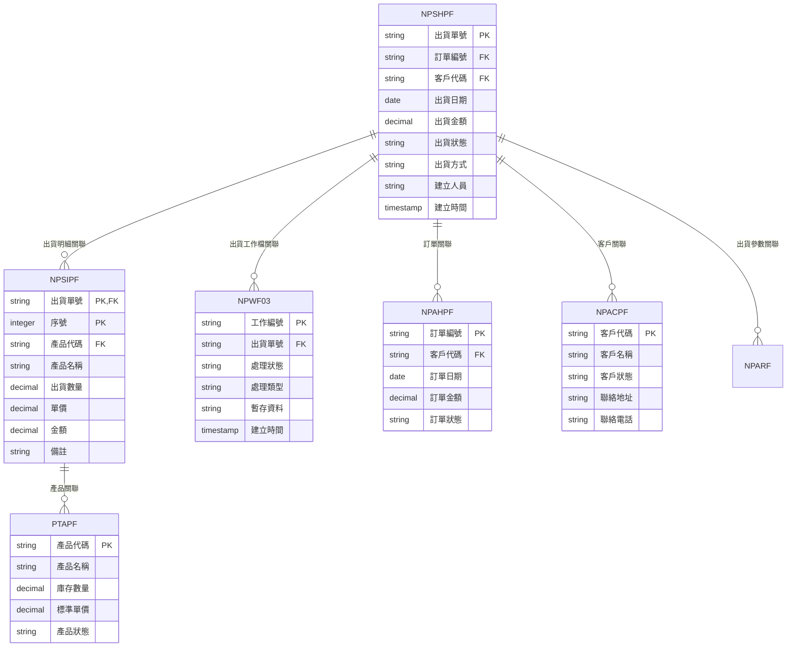
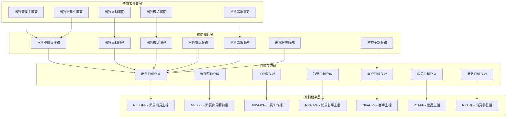
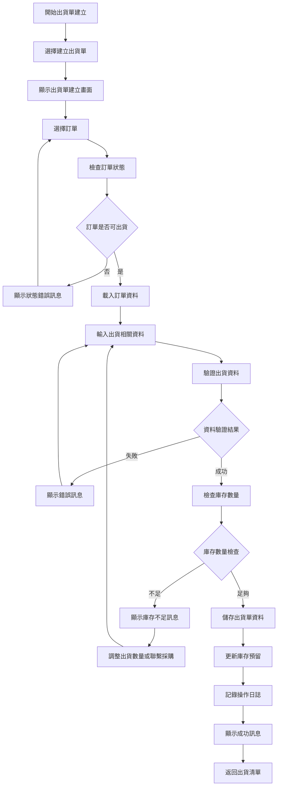
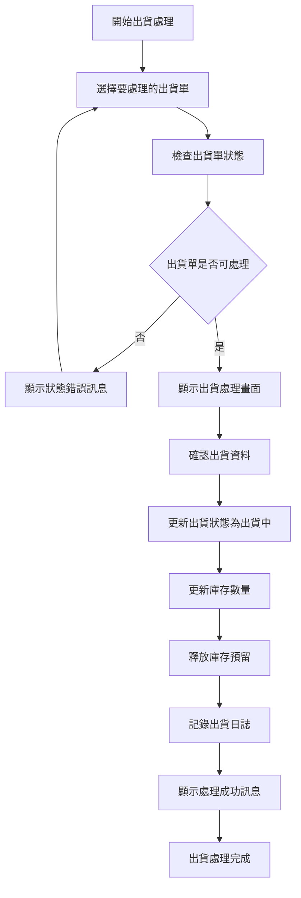
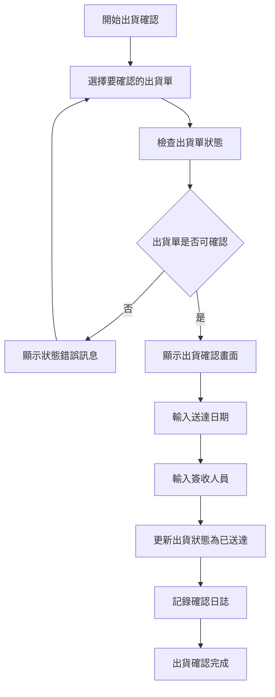
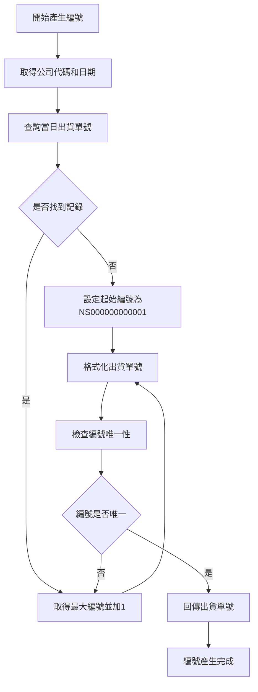
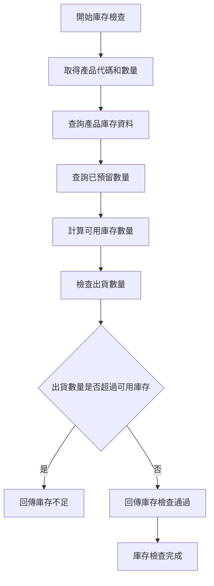
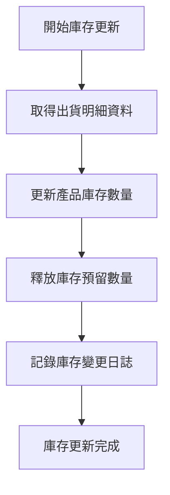
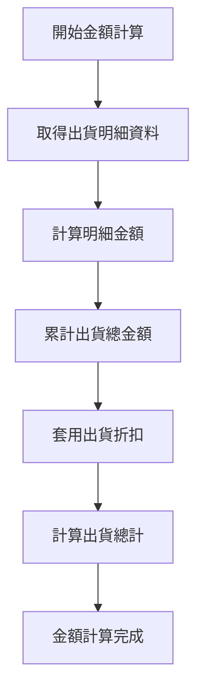
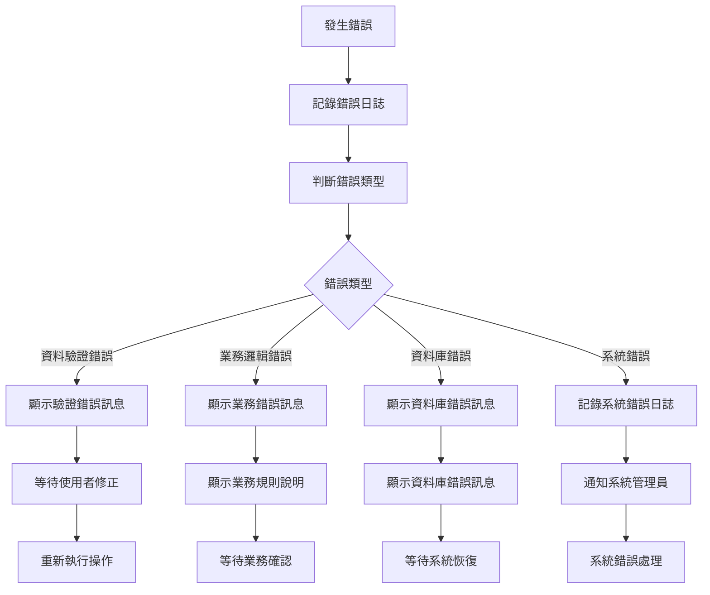

# 銷貨模組 程式功能規格書 - 出貨管理

## 文件基本資訊

| 項目 | 說明 |
|------|------|
| **文件名稱** | 銷貨模組程式功能規格書 - 出貨管理 |
| **模組代號** | NP |
| **版本** | v1.0 |
| **建立日期** | 2024年12月21日 |
| **建立人員** | 系統分析師 |
| **審核人員** | 專案經理 |
| **文件狀態** | 初稿 |
| **最後更新** | 2024年12月21日 |

---

## 目錄

1. [基本資料](#基本資料)
2. [檔案架構與關聯圖](#檔案架構與關聯圖)
3. [檔案名稱與欄位規格](#檔案名稱與欄位規格)
4. [輸出/入螢幕布局與說明](#輸出入螢幕布局與說明)
5. [處理流程程序說明](#處理流程程序說明)
6. [子程序處理邏輯說明](#子程序處理邏輯說明)
7. [錯誤處理程序說明與訊息清冊](#錯誤處理程序說明與訊息清冊)
8. [備註](#備註)

---

## 基本資料

### 1.1 模組概述

#### 1.1.1 模組功能說明
銷貨模組的出貨管理功能主要負責管理企業的銷貨出貨作業，包括出貨單建立、出貨處理、出貨確認、出貨追蹤、出貨報表等。此功能為銷貨業務提供完整的出貨生命週期管理，從訂單確認到出貨完成，再到客戶簽收，確保出貨作業的準確性和效率。

#### 1.1.2 模組特色
- **完整出貨生命週期管理**：涵蓋出貨單建立、出貨處理、出貨確認、出貨完成等全流程
- **多層級出貨狀態管理**：支援準備中、出貨中、已出貨、已送達、已簽收等狀態
- **自動化出貨單號產生**：系統自動產生唯一且連續的出貨單號
- **即時庫存更新**：出貨時自動更新庫存數量和預留數量
- **出貨進度追蹤**：完整的出貨處理進度追蹤和歷史記錄
- **多種出貨方式支援**：支援自提、送貨、快遞等多種出貨方式

#### 1.1.3 適用範圍
適用於企業銷貨業務中的出貨管理作業，包括出貨單建立、出貨處理、出貨確認、出貨追蹤、出貨報表等各類出貨相關業務功能。

### 1.2 技術架構

#### 1.2.1 開發技術
- **程式語言**：RPG、CL、SQL
- **資料庫**：DB2 for i (IBM i)
- **開發工具**：IBM i 開發環境
- **部署環境**：IBM i 7.4

#### 1.2.2 系統需求
- **硬體需求**：IBM i 伺服器
- **軟體需求**：IBM i 作業系統、DB2 for i
- **網路需求**：企業內部網路連線

---

## 檔案架構與關聯圖

### 2.1 資料庫檔案架構

#### 2.1.1 主要資料表


#### 2.1.2 檔案關聯說明
- **NPSHPF (銷貨出貨主檔)**：儲存出貨的基本資料和標頭資訊
- **NPSIPF (銷貨出貨明細檔)**：儲存出貨的明細項目資料
- **NPWF03 (出貨工作檔)**：儲存出貨處理過程中的暫存資料和工作狀態
- **NPAHPF (銷貨訂單主檔)**：儲存訂單的基本資料和狀態資訊
- **NPACPF (客戶主檔)**：儲存客戶的基本資料和聯絡資訊
- **PTAPF (產品主檔)**：儲存產品的基本資料和庫存資訊
- **NPARF (出貨參數檔)**：儲存出貨管理相關的系統參數

### 2.2 系統架構圖

#### 2.2.1 出貨管理系統架構


---

## 檔案名稱與欄位規格

### 3.1 主要檔案規格

#### 3.1.1 NPSHPF - 銷貨出貨主檔

| 欄位代號 | 欄位名稱 | 位置 | 長度 | 型態 | 屬性 | 檢核說明 |
|----------|----------|------|------|------|------|----------|
| SH01 | 公司代碼 | 1-3 | 3 | A | PK | 必填，公司唯一識別碼 |
| SH02 | 出貨單號 | 4-15 | 12 | A | PK | 必填，出貨唯一識別碼 |
| SH03 | 訂單編號 | 16-27 | 12 | A | FK | 必填，參照銷貨訂單檔 |
| SH04 | 客戶代碼 | 28-32 | 5 | A | FK | 必填，參照客戶主檔 |
| SH05 | 出貨日期 | 33-40 | 8 | D | M | 必填，出貨處理日期 |
| SH06 | 出貨狀態 | 41-41 | 1 | A | M | 必填，值：P-準備中、S-出貨中、D-已出貨、A-已送達、R-已簽收 |
| SH07 | 出貨方式 | 42-43 | 2 | A | M | 必填，值：01-自提、02-送貨、03-快遞、04-其他 |
| SH08 | 出貨金額 | 44-53 | 10 | P | M | 必填，出貨總金額，小數點後2位 |
| SH09 | 送貨地址 | 54-93 | 40 | A | M | 必填，最多40字元 |
| SH10 | 聯絡人員 | 94-103 | 10 | A | M | 必填，最多10字元 |
| SH11 | 聯絡電話 | 104-113 | 10 | A | M | 必填，最多10字元 |
| SH12 | 預計送達日期 | 114-121 | 8 | D | M | 必填，不能早於出貨日期 |
| SH13 | 實際送達日期 | 122-129 | 8 | D | O | 選填，實際送達日期 |
| SH14 | 簽收人員 | 130-139 | 10 | A | O | 選填，簽收人員姓名 |
| SH15 | 簽收日期 | 140-147 | 8 | D | O | 選填，簽收日期 |
| SH16 | 備註 | 148-187 | 40 | A | O | 選填，最多40字元 |
| SH17 | 建立人員 | 188-192 | 5 | A | M | 必填，參照使用者檔 |
| SH18 | 建立時間 | 193-200 | 8 | T | M | 必填，系統自動產生 |
| SH19 | 修改人員 | 201-205 | 5 | A | O | 選填，最後修改出貨的使用者代號 |
| SH20 | 修改時間 | 206-213 | 8 | T | O | 選填，最後修改時間 |

#### 3.1.2 NPSIPF - 銷貨出貨明細檔

| 欄位代號 | 欄位名稱 | 位置 | 長度 | 型態 | 屬性 | 檢核說明 |
|----------|----------|------|------|------|------|----------|
| SI01 | 出貨單號 | 1-12 | 12 | A | PK,FK | 必填，參照NPSHPF.SH02 |
| SI02 | 序號 | 13-15 | 3 | I | PK | 必填，1-999 |
| SI03 | 產品代碼 | 16-20 | 5 | A | FK | 必填，參照產品主檔 |
| SI04 | 產品名稱 | 21-50 | 30 | A | M | 必填，最多30字元 |
| SI05 | 規格 | 51-80 | 30 | A | O | 選填，最多30字元 |
| SI06 | 出貨數量 | 81-88 | 8 | P | M | 必填，正數，小數點後2位 |
| SI07 | 單位 | 89-90 | 2 | A | M | 必填，參照單位檔 |
| SI08 | 單價 | 91-100 | 10 | P | M | 必填，金額格式，小數點後2位 |
| SI09 | 金額 | 101-110 | 10 | P | M | 必填，出貨數量×單價，小數點後2位 |
| SI10 | 備註 | 111-140 | 30 | A | O | 選填，最多30字元 |
| SI11 | 庫存扣減 | 141-148 | 8 | P | O | 選填，扣減的庫存數量 |
| SI12 | 預留釋放 | 149-156 | 8 | P | O | 選填，釋放的預留數量 |

#### 3.1.3 NPWF03 - 出貨工作檔

| 欄位代號 | 欄位名稱 | 位置 | 長度 | 型態 | 屬性 | 檢核說明 |
|----------|----------|------|------|------|------|----------|
| WF0301 | 工作編號 | 1-10 | 10 | A | PK | 必填，工作唯一識別碼 |
| WF0302 | 出貨單號 | 11-22 | 12 | A | FK | 必填，參照銷貨出貨檔 |
| WF0303 | 處理狀態 | 23-23 | 1 | A | M | 必填，值：P-處理中、C-完成、E-錯誤 |
| WF0304 | 處理類型 | 24-24 | 1 | A | M | 必填，值：1-新增、2-修改、3-刪除、4-狀態變更 |
| WF0305 | 暫存資料 | 25-124 | 100 | A | O | 選填，處理中的暫存資料 |
| WF0306 | 建立時間 | 125-132 | 8 | T | M | 必填，系統自動產生 |
| WF0307 | 完成時間 | 133-140 | 8 | T | O | 選填，處理完成時間 |
| WF0308 | 錯誤訊息 | 141-190 | 50 | A | O | 選填，處理錯誤時的錯誤訊息 |
| WF0309 | 處理人員 | 191-195 | 5 | A | O | 選填，處理工作的人員代號 |

#### 3.1.4 NPARF - 出貨參數檔

| 欄位代號 | 欄位名稱 | 位置 | 長度 | 型態 | 屬性 | 檢核說明 |
|----------|----------|------|------|------|------|----------|
| AR01 | 參數代號 | 1-5 | 5 | A | PK | 必填，參數唯一識別碼 |
| AR02 | 參數名稱 | 6-35 | 30 | A | M | 必填，參數的中文名稱 |
| AR03 | 參數值 | 36-85 | 50 | A | M | 必填，參數的當前值 |
| AR04 | 參數類型 | 86-87 | 2 | A | M | 必填，值：01-字串、02-數值、03-日期、04-布林 |
| AR05 | 參數狀態 | 88-89 | 2 | A | M | 必填，值：01-啟用、02-停用、03-維護中 |
| AR06 | 建立人員 | 90-94 | 5 | A | M | 必填，建立參數的使用者代號 |
| AR07 | 建立時間 | 95-102 | 8 | T | M | 必填，系統自動產生 |
| AR08 | 修改人員 | 103-107 | 5 | A | O | 選填，最後修改參數的使用者代號 |
| AR09 | 修改時間 | 108-115 | 8 | T | O | 選填，最後修改時間 |
| AR10 | 備註 | 116-155 | 40 | A | O | 選填，參數備註說明 |

### 3.2 索引資料

#### 3.2.1 主要索引
- **NPSHPF 主鍵索引**：SH01 + SH02 (公司代碼 + 出貨單號)
- **NPSHPF 訂單編號索引**：SH03 (訂單編號)
- **NPSHPF 客戶代碼索引**：SH04 (客戶代碼)
- **NPSHPF 出貨日期索引**：SH05 (出貨日期)
- **NPSHPF 出貨狀態索引**：SH06 (出貨狀態)

#### 3.2.2 次要索引
- **NPSIPF 主鍵索引**：SI01 + SI02 (出貨單號 + 序號)
- **NPSIPF 出貨單號索引**：SI01 (出貨單號)
- **NPSIPF 產品代碼索引**：SI03 (產品代碼)
- **NPWF03 主鍵索引**：WF0301 (工作編號)
- **NPWF03 出貨單號索引**：WF0302 (出貨單號)
- **NPARF 主鍵索引**：AR01 (參數代號)

---

## 輸出/入螢幕布局與說明

### 4.1 出貨管理主畫面

#### 4.1.1 畫面布局
```
┌─────────────────────────────────────────────────────────────┐
│                    出貨管理系統                            │
├─────────────────────────────────────────────────────────────┤
│ 功能選項：                                                  │
│  [1]建立出貨單  [2]出貨處理  [3]出貨確認  [4]出貨查詢    │
│  [5]出貨追蹤  [6]出貨報表  [7]出貨匯出  [8]離開系統      │
├─────────────────────────────────────────────────────────────┤
│ 查詢條件：                                                  │
│  日期範圍：[2024/01/01] 至 [2024/12/31]                  │
│  客戶範圍：[全部客戶 ▼] 出貨狀態：[全部狀態 ▼]            │
│  關鍵字：[                ] [查詢] [清除]                  │
├─────────────────────────────────────────────────────────────┤
│ 出貨清單：                                                  │
│ ┌─────┬──────────┬──────────┬──────────┬──────────┬────────┐ │
│ │序號 │出貨單號  │客戶名稱  │出貨日期  │出貨金額  │狀態    │ │
│ ├─────┼──────────┼──────────┼──────────┼──────────┼────────┤ │
│ │  1  │NS001     │客戶A     │2024/12/19│50,000    │已出貨  │ │
│ │  2  │NS002     │客戶B     │2024/12/19│75,000    │準備中  │ │
│ └─────┴──────────┴──────────┴──────────┴──────────┴────────┘ │
├─────────────────────────────────────────────────────────────┤
│ 功能鍵：F1=說明  F3=離開  F4=建立出貨單  F6=修改  F8=刪除  F12=取消│
└─────────────────────────────────────────────────────────────┘
```

#### 4.1.2 畫面說明
- **功能選項區**：提供出貨管理的主要功能選項
- **查詢條件區**：設定出貨查詢的相關條件
- **出貨清單區**：顯示符合查詢條件的出貨資料
- **功能鍵區**：說明可使用的功能鍵

### 4.2 出貨單建立畫面

#### 4.2.1 畫面布局
```
┌─────────────────────────────────────────────────────────────┐
│                    出貨單建立                              │
├─────────────────────────────────────────────────────────────┤
│ 出貨標頭區域                                                │
│ ┌─────────────────────────────────────────────────────────┐ │
│ │ 出貨單號: [NS001        ] (系統自動產生)                │ │
│ │ 訂單編號: [NP001 ▼]      客戶名稱: [客戶A              ] │ │
│ │ 出貨日期: [2024/12/19 ▼]                               │ │
│ │ 出貨方式: [送貨 ▼]       預計送達: [2024/12/20 ▼]       │
│ │ 送貨地址: [台北市中山區中山路100號                    ] │ │
│ │ 聯絡人員: [張三        ] 聯絡電話: [02-12345678]        │
│ └─────────────────────────────────────────────────────────┘ │
├─────────────────────────────────────────────────────────────┤
│ 出貨明細區域                                                │
│ ┌─────────────────────────────────────────────────────────┐ │
│ │ 序號 │ 產品代碼 │ 產品名稱 │ 數量 │ 單價 │ 金額 │ 備註 │ │
│ ├─────────────────────────────────────────────────────────┤ │
│ │  1   │ [P001 ▼] │ [產品A  ] │ [100] │ [500] │ [50,000] │ [    ] │ │
│ │  2   │ [P002 ▼] │ [產品B  ] │ [ 50] │ [500] │ [25,000] │ [    ] │ │
│ └─────────────────────────────────────────────────────────┘ │
├─────────────────────────────────────────────────────────────┤
│ 出貨總計: 75,000                                           │
│ 備註: [                                                    ] │
├─────────────────────────────────────────────────────────────┤
│ 操作：[新增明細] [儲存出貨單] [取消] [複製]                │
│ 功能鍵：F1=說明  F3=離開  F4=新增明細  F9=儲存  F12=取消│
└─────────────────────────────────────────────────────────────┘
```

---

## 處理流程程序說明

### 5.1 出貨單建立流程

#### 5.1.1 主要處理流程


#### 5.1.2 資料驗證規則
1. **出貨標頭驗證**：訂單編號必須存在且狀態為確認，出貨日期不能超過當前日期
2. **出貨明細驗證**：產品代碼必須存在，出貨數量不能超過訂單數量
3. **業務邏輯驗證**：出貨金額計算正確，庫存數量足夠

### 5.2 出貨處理流程

#### 5.2.1 主要處理流程


### 5.3 出貨確認流程

#### 5.3.1 主要處理流程


---

## 子程序處理邏輯說明

### 6.1 出貨單號產生子程序

#### 6.1.1 編號產生邏輯


#### 6.1.2 編號格式說明
- **編號格式**：NS + YYYYMMDD + 序號（4位）
- **範例**：NS20241221001
- **序號範圍**：0001-9999

### 6.2 庫存數量檢查子程序

#### 6.2.1 庫存檢查邏輯


#### 6.2.2 庫存檢查規則
1. **可用庫存** = 總庫存數量 - 已預留數量 - 安全庫存
2. **出貨數量** ≤ 可用庫存數量
3. **安全庫存**可根據產品重要性設定

### 6.3 庫存更新子程序

#### 6.3.1 庫存更新邏輯


#### 6.3.2 庫存更新規則
1. **庫存數量** = 原庫存數量 - 出貨數量
2. **預留數量** = 原預留數量 - 出貨數量
3. **可用庫存** = 庫存數量 - 預留數量

### 6.4 出貨金額計算子程序

#### 6.4.1 金額計算邏輯


#### 6.4.2 金額計算公式
1. **明細金額** = 出貨數量 × 單價
2. **出貨總計** = Σ明細金額 × (1 - 出貨折扣率)
3. **折扣率**可根據客戶等級或出貨數量設定

---

## 錯誤處理程序說明與訊息清冊

### 7.1 錯誤處理程序

#### 7.1.1 錯誤處理流程


### 7.2 錯誤訊息清冊

#### 7.2.1 資料驗證錯誤訊息

| 錯誤代碼 | 錯誤訊息 | 錯誤原因 | 解決方法 |
|----------|----------|----------|----------|
| **NP701** | 訂單編號不存在 | 輸入的訂單編號在系統中不存在 | 請檢查訂單編號，或選擇其他有效的訂單 |
| **NP702** | 出貨日期格式錯誤 | 出貨日期格式不正確 | 請使用正確的日期格式：YYYYMMDD |
| **NP703** | 預計送達日期不能早於出貨日期 | 預計送達日期設定錯誤 | 請調整預計送達日期，不能早於出貨日期 |
| **NP704** | 產品代碼不存在 | 輸入的產品代碼在系統中不存在 | 請檢查產品代碼，或選擇其他有效的產品 |
| **NP705** | 出貨數量必須為正數 | 出貨數量為負數或零 | 請輸入正數的出貨數量 |

#### 7.2.2 業務邏輯錯誤訊息

| 錯誤代碼 | 錯誤訊息 | 錯誤原因 | 解決方法 |
|----------|----------|----------|----------|
| **NP801** | 出貨金額計算錯誤 | 出貨金額與明細金額總和不符 | 請檢查明細金額計算，或聯繫系統管理員 |
| **NP802** | 庫存數量不足 | 產品庫存數量不足以滿足出貨需求 | 請調整出貨數量，或聯繫採購部門 |
| **NP803** | 訂單狀態不允許出貨 | 訂單當前狀態不允許進行出貨操作 | 請檢查訂單狀態，或聯繫系統管理員 |
| **NP804** | 出貨數量超過訂單數量 | 出貨數量超過訂單的數量限制 | 請調整出貨數量，不能超過訂單數量 |
| **NP805** | 產品已停用 | 選擇的產品已停用，無法出貨 | 請選擇其他有效的產品 |

#### 7.2.3 資料庫錯誤訊息

| 錯誤代碼 | 錯誤訊息 | 錯誤原因 | 解決方法 |
|----------|----------|----------|----------|
| **NP901** | 資料庫連線失敗 | 無法連接到資料庫系統 | 請檢查網路連線，或聯繫系統管理員 |
| **NP902** | 資料庫交易失敗 | 資料庫交易執行失敗 | 請重新執行操作，或聯繫資料庫管理員 |
| **NP903** | 檔案存取權限不足 | 使用者沒有存取相關檔案的權限 | 請聯繫系統管理員檢查使用者權限 |
| **NP904** | 系統資源不足 | 系統記憶體或磁碟空間不足 | 請聯繫系統管理員檢查系統資源 |
| **NP905** | 程式執行異常 | 程式執行過程中發生未預期的錯誤 | 請記錄錯誤訊息，並聯繫系統管理員 |

### 7.3 錯誤處理建議

#### 7.3.1 使用者操作建議
1. **檢查輸入資料**：在提交前仔細檢查所有輸入欄位的內容
2. **參考錯誤訊息**：根據錯誤訊息提供的建議進行修正
3. **記錄錯誤情況**：如果錯誤持續發生，請記錄詳細的錯誤情況
4. **尋求技術支援**：對於無法解決的錯誤，請聯繫技術支援人員

#### 7.3.2 系統管理建議
1. **定期檢查錯誤日誌**：定期檢查系統錯誤日誌，及時發現和處理問題
2. **監控系統資源**：定期監控系統資源使用情況，預防資源不足問題
3. **備份重要資料**：定期備份重要的出貨資料和設定
4. **更新系統版本**：及時更新系統版本，修復已知的錯誤和漏洞

---

## 備註

### 8.1 開發注意事項

#### 8.1.1 程式開發注意事項
1. **資料完整性**：所有出貨資料都必須進行嚴格的資料驗證
2. **業務邏輯**：必須嚴格遵循出貨管理的業務規則
3. **錯誤處理**：必須提供完整的錯誤處理機制
4. **日誌記錄**：所有重要操作都必須記錄詳細的日誌
5. **效能優化**：出貨查詢功能必須考慮效能影響

#### 8.1.2 測試注意事項
1. **單元測試**：每個子程序都必須進行單元測試
2. **整合測試**：必須測試與其他模組的整合情況
3. **業務邏輯測試**：必須測試出貨管理的業務邏輯
4. **效能測試**：必須測試出貨查詢功能的效能表現
5. **使用者測試**：必須進行使用者接受度測試

### 8.2 維護注意事項

#### 8.2.1 日常維護注意事項
1. **定期備份**：定期備份出貨資料和相關設定
2. **效能監控**：定期監控出貨管理功能的效能表現
3. **錯誤分析**：定期分析錯誤日誌，改進系統穩定性
4. **資料清理**：定期清理無效的出貨資料
5. **狀態維護**：定期維護和更新出貨狀態規則

#### 8.2.2 版本更新注意事項
1. **相容性檢查**：更新前必須檢查與現有出貨資料的相容性
2. **資料遷移**：必要時進行出貨資料的遷移和轉換
3. **回滾計畫**：制定詳細的回滾計畫，以應對更新失敗
4. **使用者通知**：提前通知使用者出貨系統更新計畫
5. **測試驗證**：更新後必須進行充分的測試驗證

### 8.3 未來擴充建議

#### 8.3.1 功能擴充建議
1. **多語言支援**：增加多語言支援，滿足國際化需求
2. **行動裝置支援**：開發行動裝置應用程式，提供隨時隨地的出貨管理功能
3. **進階出貨分析**：增加更進階的出貨分析和預測功能
4. **物流整合**：考慮與物流系統的整合
5. **GPS追蹤**：增加GPS定位和路線追蹤功能

#### 8.3.2 技術改進建議
1. **微服務架構**：考慮採用微服務架構，提高系統的模組化和可維護性
2. **人工智慧應用**：考慮在出貨分析和預測中應用人工智慧技術
3. **大數據分析**：考慮使用大數據技術分析出貨行為和趨勢
4. **API標準化**：制定標準的出貨管理API規範，便於與其他系統的整合
5. **容器化部署**：考慮使用容器技術進行系統部署

---

## 附錄

### A.1 相關文件清單
- 銷貨模組程式功能規格書 - 銷貨管理
- 銷貨模組程式功能規格書 - 客戶管理
- 銷貨模組程式功能規格書 - 訂單管理
- 銷貨模組業務邏輯分析與API設計
- 銷貨模組操作手冊 - 出貨管理

### A.2 修訂記錄

| 版本 | 修訂日期 | 修訂人員 | 修訂內容 | 修訂原因 |
|------|----------|----------|----------|----------|
| v1.0 | 2024/12/21 | 系統分析師 | 初始版本建立 | 新功能開發 |

### A.3 聯絡資訊
- **專案經理**：[專案經理姓名]
- **系統分析師**：[系統分析師姓名]
- **技術支援**：[技術支援聯絡方式]
- **專案信箱**：[專案信箱地址]
