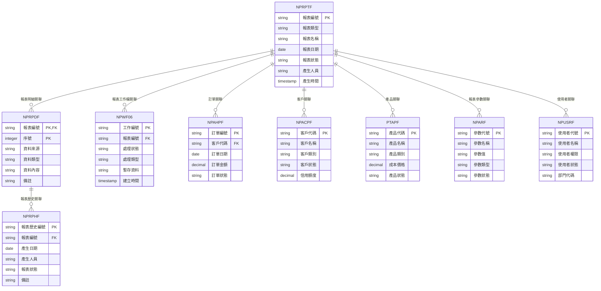
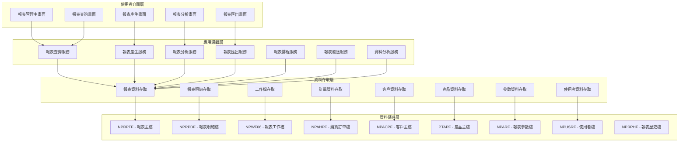
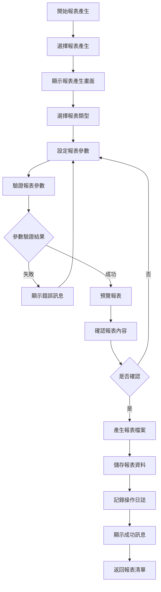
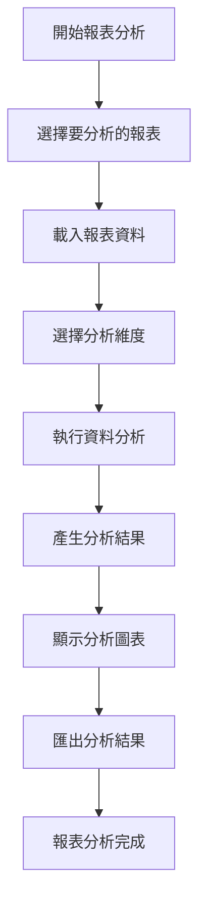
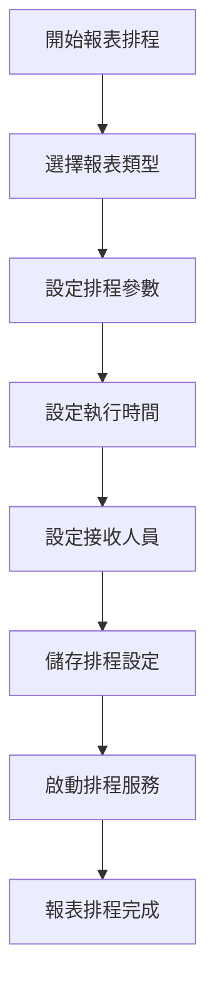
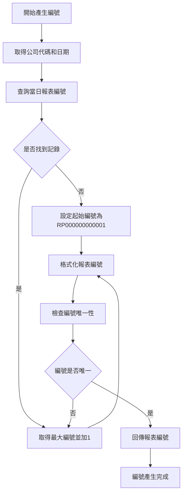
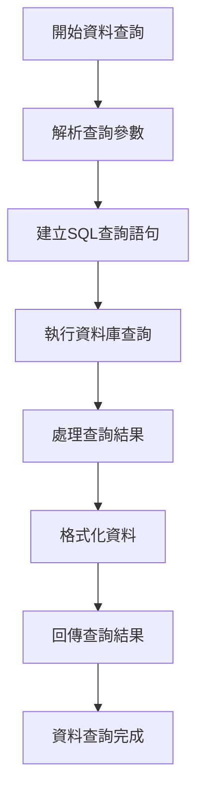
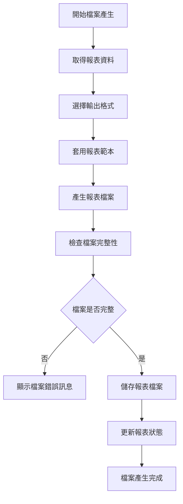
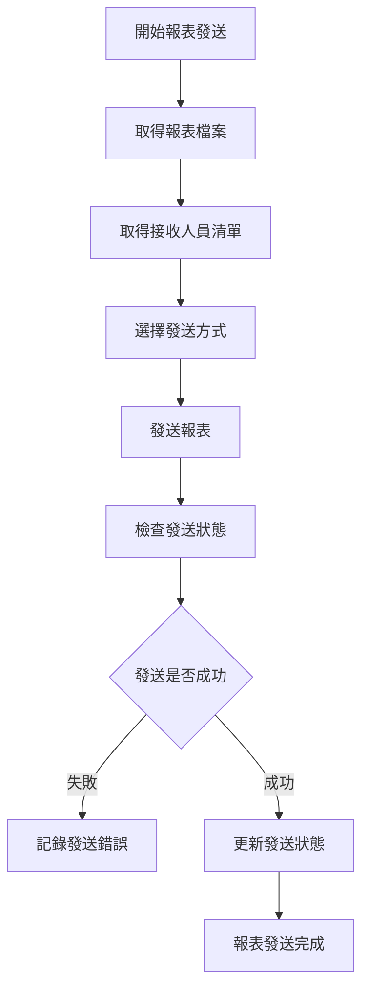
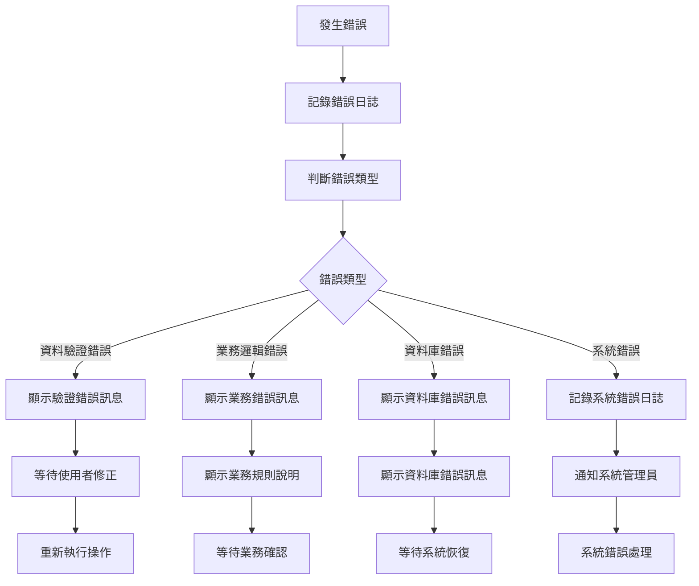

# 銷貨模組 程式功能規格書 - 報表分析

## 文件基本資訊

| 項目 | 說明 |
|------|------|
| **文件名稱** | 銷貨模組程式功能規格書 - 報表分析 |
| **模組代號** | NP |
| **版本** | v1.0 |
| **建立日期** | 2024年12月21日 |
| **建立人員** | 系統分析師 |
| **審核人員** | 專案經理 |
| **文件狀態** | 初稿 |
| **最後更新** | 2024年12月21日 |

---

## 目錄

1. [基本資料](#基本資料)
2. [檔案架構與關聯圖](#檔案架構與關聯圖)
3. [檔案名稱與欄位規格](#檔案名稱與欄位規格)
4. [輸出/入螢幕布局與說明](#輸出入螢幕布局與說明)
5. [處理流程程序說明](#處理流程程序說明)
6. [子程序處理邏輯說明](#子程序處理邏輯說明)
7. [錯誤處理程序說明與訊息清冊](#錯誤處理程序說明與訊息清冊)
8. [備註](#備註)

---

## 基本資料

### 1.1 模組概述

#### 1.1.1 模組功能說明
銷貨模組的報表分析功能主要負責產生和分析企業銷貨業務的各種報表，包括銷售報表、客戶分析報表、產品分析報表、業績統計報表、趨勢分析報表、比較分析報表、預測分析報表等。此功能為管理階層提供完整的業務洞察，支援決策制定和業務優化，確保企業能夠及時掌握市場動態和業務表現。

#### 1.1.2 模組特色
- **多維度報表分析**：支援按時間、地區、客戶、產品、業務員等多維度進行分析
- **即時數據更新**：報表數據與業務系統即時同步，確保數據的準確性和時效性
- **互動式報表介面**：支援鑽取、篩選、排序等互動式分析功能
- **多種報表格式**：支援PDF、Excel、Word、HTML等多種輸出格式
- **自動化報表產生**：支援定時自動產生報表並發送給相關人員
- **進階分析功能**：包含趨勢分析、比較分析、預測分析等進階功能

#### 1.1.3 適用範圍
適用於企業銷貨業務中的報表分析作業，包括銷售報表、客戶分析、產品分析、業績統計、趨勢分析、比較分析、預測分析、報表排程、報表發送等各類報表相關業務功能。

### 1.2 技術架構

#### 1.2.1 開發技術
- **程式語言**：RPG、CL、SQL
- **資料庫**：DB2 for i (IBM i)
- **開發工具**：IBM i 開發環境
- **報表工具**：IBM Cognos、Crystal Reports
- **部署環境**：IBM i 7.4

#### 1.2.2 系統需求
- **硬體需求**：IBM i 伺服器、報表伺服器
- **軟體需求**：IBM i 作業系統、DB2 for i、報表產生工具
- **網路需求**：企業內部網路連線、報表存取權限

---

## 檔案架構與關聯圖

### 2.1 資料庫檔案架構

#### 2.1.1 主要資料表


#### 2.1.2 檔案關聯說明
- **NPRPTF (報表主檔)**：儲存報表的基本資料和標頭資訊
- **NPRPDF (報表明細檔)**：儲存報表的詳細資料和內容
- **NPWF06 (報表工作檔)**：儲存報表處理過程中的暫存資料和工作狀態
- **NPAHPF (銷貨訂單檔)**：儲存訂單的基本資料和狀態資訊
- **NPACPF (客戶主檔)**：儲存客戶的基本資料和分類資訊
- **PTAPF (產品主檔)**：儲存產品的基本資料和成本資訊
- **NPARF (報表參數檔)**：儲存報表產生相關的系統參數
- **NPUSRF (使用者檔)**：儲存使用者的基本資料和權限資訊
- **NPRPHF (報表歷史檔)**：儲存報表產生的歷史記錄

### 2.2 系統架構圖

#### 2.2.1 報表分析系統架構


---

## 檔案名稱與欄位規格

### 3.1 主要檔案規格

#### 3.1.1 NPRPTF - 報表主檔

| 欄位代號 | 欄位名稱 | 位置 | 長度 | 型態 | 屬性 | 檢核說明 |
|----------|----------|------|------|------|------|----------|
| RP01 | 公司代碼 | 1-3 | 3 | A | PK | 必填，公司唯一識別碼 |
| RP02 | 報表編號 | 4-15 | 12 | A | PK | 必填，報表唯一識別碼 |
| RP03 | 報表類型 | 16-17 | 2 | A | M | 必填，值：01-銷售報表、02-客戶分析、03-產品分析、04-業績統計、05-趨勢分析、06-比較分析、07-預測分析 |
| RP04 | 報表名稱 | 18-47 | 30 | A | M | 必填，報表的中文名稱 |
| RP05 | 報表日期 | 48-55 | 8 | D | M | 必填，報表產生的日期 |
| RP06 | 報表期間 | 56-63 | 8 | A | M | 必填，報表涵蓋的期間 |
| RP07 | 報表狀態 | 64-64 | 1 | A | M | 必填，值：P-處理中、C-完成、E-錯誤、D-已刪除 |
| RP08 | 報表格式 | 65-66 | 2 | A | M | 必填，值：01-PDF、02-Excel、03-Word、04-HTML、05-CSV |
| RP09 | 檔案大小 | 67-76 | 10 | I | O | 選填，報表檔案大小（KB） |
| RP10 | 檔案路徑 | 77-126 | 50 | A | O | 選填，報表檔案儲存路徑 |
| RP11 | 產生人員 | 127-131 | 5 | A | M | 必填，參照使用者檔 |
| RP12 | 產生時間 | 132-139 | 8 | T | M | 必填，系統自動產生 |
| RP13 | 審核人員 | 140-144 | 5 | A | O | 選填，審核報表的人員代號 |
| RP14 | 審核日期 | 145-152 | 8 | D | O | 選填，報表審核日期 |
| RP15 | 備註 | 153-192 | 40 | A | O | 選填，最多40字元 |

#### 3.1.2 NPRPDF - 報表明細檔

| 欄位代號 | 欄位名稱 | 位置 | 長度 | 型態 | 屬性 | 檢核說明 |
|----------|----------|------|------|------|------|----------|
| RPD01 | 報表編號 | 1-12 | 12 | A | PK,FK | 必填，參照NPRPTF.RP02 |
| RPD02 | 序號 | 13-15 | 3 | I | PK | 必填，1-999 |
| RPD03 | 資料來源 | 16-17 | 2 | A | M | 必填，值：01-訂單檔、02-客戶檔、03-產品檔、04-出貨檔、05-應收帳款檔 |
| RPD04 | 資料類型 | 18-19 | 2 | A | M | 必填，值：01-標題、02-表頭、03-資料行、04-小計、05-總計、06-圖表、07-備註 |
| RPD05 | 資料內容 | 20-69 | 50 | A | M | 必填，報表資料的具體內容 |
| RPD06 | 資料格式 | 70-79 | 10 | A | O | 選填，資料的顯示格式 |
| RPD07 | 排序順序 | 80-82 | 3 | I | O | 選填，資料的排序順序 |
| RPD08 | 分組層級 | 83-84 | 2 | I | O | 選填，資料的分組層級 |
| RPD09 | 計算公式 | 85-134 | 50 | A | O | 選填，資料的計算公式 |
| RPD10 | 備註 | 135-164 | 30 | A | O | 選填，最多30字元 |

#### 3.1.3 NPWF06 - 報表工作檔

| 欄位代號 | 欄位名稱 | 位置 | 長度 | 型態 | 屬性 | 檢核說明 |
|----------|----------|------|------|------|------|----------|
| WF0601 | 工作編號 | 1-10 | 10 | A | PK | 必填，工作唯一識別碼 |
| WF0602 | 報表編號 | 11-22 | 12 | A | FK | 必填，參照報表檔 |
| WF0603 | 處理狀態 | 23-23 | 1 | A | M | 必填，值：P-處理中、C-完成、E-錯誤 |
| WF0604 | 處理類型 | 24-24 | 1 | A | M | 必填，值：1-新增、2-修改、3-刪除、4-產生、5-匯出 |
| WF0605 | 暫存資料 | 25-124 | 100 | A | O | 選填，處理中的暫存資料 |
| WF0606 | 建立時間 | 125-132 | 8 | T | M | 必填，系統自動產生 |
| WF0607 | 完成時間 | 133-140 | 8 | T | O | 選填，處理完成時間 |
| WF0608 | 錯誤訊息 | 141-190 | 50 | A | O | 選填，處理錯誤時的錯誤訊息 |
| WF0609 | 處理人員 | 191-195 | 5 | A | O | 選填，處理工作的人員代號 |

#### 3.1.4 NPRPHF - 報表歷史檔

| 欄位代號 | 欄位名稱 | 位置 | 長度 | 型態 | 屬性 | 檢核說明 |
|----------|----------|------|------|------|------|----------|
| RPH01 | 報表歷史編號 | 1-15 | 15 | A | PK | 必填，報表歷史唯一識別碼 |
| RPH02 | 報表編號 | 16-27 | 12 | A | FK | 必填，參照報表檔 |
| RPH03 | 產生日期 | 28-35 | 8 | D | M | 必填，報表產生日期 |
| RPH04 | 產生人員 | 36-40 | 5 | A | M | 必填，產生報表的人員代號 |
| RPH05 | 報表狀態 | 41-41 | 1 | A | M | 必填，值：P-處理中、C-完成、E-錯誤 |
| RPH06 | 檔案大小 | 42-51 | 10 | I | O | 選填，報表檔案大小（KB） |
| RPH07 | 檔案路徑 | 52-101 | 50 | A | O | 選填，報表檔案儲存路徑 |
| RPH08 | 備註 | 102-141 | 40 | A | O | 選填，最多40字元 |
| RPH09 | 建立時間 | 142-149 | 8 | T | M | 必填，系統自動產生 |

#### 3.1.5 NPARF - 報表參數檔

| 欄位代號 | 欄位名稱 | 位置 | 長度 | 型態 | 屬性 | 檢核說明 |
|----------|----------|------|------|------|------|----------|
| ARF01 | 參數代號 | 1-5 | 5 | A | PK | 必填，參數唯一識別碼 |
| ARF02 | 參數名稱 | 6-35 | 30 | A | M | 必填，參數的中文名稱 |
| ARF03 | 參數值 | 36-85 | 50 | A | M | 必填，參數的當前值 |
| ARF04 | 參數類型 | 86-87 | 2 | A | M | 必填，值：01-字串、02-數值、03-日期、04-布林、05-清單 |
| ARF05 | 參數狀態 | 88-89 | 2 | A | M | 必填，值：01-啟用、02-停用、03-維護中 |
| ARF06 | 建立人員 | 90-94 | 5 | A | M | 必填，建立參數的使用者代號 |
| ARF07 | 建立時間 | 95-102 | 8 | T | M | 必填，系統自動產生 |
| ARF08 | 修改人員 | 103-107 | 5 | A | O | 選填，最後修改參數的使用者代號 |
| ARF09 | 修改時間 | 108-115 | 8 | T | O | 選填，最後修改時間 |
| ARF10 | 備註 | 116-155 | 40 | A | O | 選填，參數備註說明 |

### 3.2 索引資料

#### 3.2.1 主要索引
- **NPRPTF 主鍵索引**：RP01 + RP02 (公司代碼 + 報表編號)
- **NPRPTF 報表類型索引**：RP03 (報表類型)
- **NPRPTF 報表日期索引**：RP05 (報表日期)
- **NPRPTF 報表狀態索引**：RP07 (報表狀態)
- **NPRPTF 產生人員索引**：RP11 (產生人員)

#### 3.2.2 次要索引
- **NPRPDF 主鍵索引**：RPD01 + RPD02 (報表編號 + 序號)
- **NPRPDF 報表編號索引**：RPD01 (報表編號)
- **NPRPDF 資料來源索引**：RPD03 (資料來源)
- **NPWF06 主鍵索引**：WF0601 (工作編號)
- **NPWF06 報表編號索引**：WF0602 (報表編號)
- **NPRPHF 主鍵索引**：RPH01 (報表歷史編號)
- **NPRPHF 報表編號索引**：RPH02 (報表編號)
- **NPARF 主鍵索引**：ARF01 (參數代號)

---

## 輸出/入螢幕布局與說明

### 4.1 報表管理主畫面

#### 4.1.1 畫面布局
```
┌─────────────────────────────────────────────────────────────┐
│                    報表分析系統                            │
├─────────────────────────────────────────────────────────────┤
│ 功能選項：                                                  │
│  [1]報表查詢  [2]報表產生  [3]報表分析  [4]報表匯出      │
│  [5]報表排程  [6]報表發送  [7]報表歷史  [8]離開系統      │
├─────────────────────────────────────────────────────────────┤
│ 查詢條件：                                                  │
│  日期範圍：[2024/01/01] 至 [2024/12/31]                  │
│  報表類型：[全部類型 ▼] 報表狀態：[全部狀態 ▼]            │
│  產生人員：[全部人員 ▼] 關鍵字：[                ]        │
│  [查詢] [清除]                                              │
├─────────────────────────────────────────────────────────────┤
│ 報表清單：                                                  │
│ ┌─────┬──────────┬──────────┬──────────┬──────────┬────────┐ │
│ │序號 │報表編號  │報表名稱  │報表類型  │產生日期  │狀態    │ │
│ ├─────┼──────────┼──────────┼──────────┼──────────┼────────┤ │
│ │  1  │RP001     │銷售月報  │銷售報表  │2024/12/21│完成    │ │
│ │  2  │RP002     │客戶分析  │客戶分析  │2024/12/21│處理中  │ │
│ └─────┴──────────┴──────────┴──────────┴──────────┴────────┘ │
├─────────────────────────────────────────────────────────────┤
│ 功能鍵：F1=說明  F3=離開  F4=報表產生  F6=修改  F8=刪除  F12=取消│
└─────────────────────────────────────────────────────────────┘
```

#### 4.1.2 畫面說明
- **功能選項區**：提供報表分析的主要功能選項
- **查詢條件區**：設定報表查詢的相關條件
- **報表清單區**：顯示符合查詢條件的報表資料
- **功能鍵區**：說明可使用的功能鍵

### 4.2 報表產生畫面

#### 4.2.1 畫面布局
```
┌─────────────────────────────────────────────────────────────┐
│                      報表產生                              │
├─────────────────────────────────────────────────────────────┤
│ 報表基本資料                                                │
│ ┌─────────────────────────────────────────────────────────┐ │
│ │ 報表編號: [RP001        ] (系統自動產生)                │ │
│ │ 報表類型: [銷售報表 ▼]   報表名稱: [銷售月報          ] │ │
│ │ 報表期間: [2024年12月 ▼] 報表格式: [PDF ▼]             │ │
│ │ 產生人員: [USER001     ] 產生日期: [2024/12/21 ▼]      │ │
│ └─────────────────────────────────────────────────────────┘ │
├─────────────────────────────────────────────────────────────┤
│ 報表參數設定                                                │
│ ┌─────────────────────────────────────────────────────────┐ │
│ │ 參數名稱 │ 參數值 │ 參數說明 │ 是否必填 │ 預設值 │ 備註 │ │
│ ├─────────────────────────────────────────────────────────┤ │
│ │ 開始日期 │ [2024/12/01] │ 報表開始日期 │ 是 │ 當月1日 │ [    ] │ │
│ │ 結束日期 │ [2024/12/31] │ 報表結束日期 │ 是 │ 當月末日 │ [    ] │ │
│ │ 客戶範圍 │ [全部客戶 ▼] │ 客戶篩選條件 │ 否 │ 全部 │ [    ] │ │
│ │ 產品範圍 │ [全部產品 ▼] │ 產品篩選條件 │ 否 │ 全部 │ [    ] │ │
│ └─────────────────────────────────────────────────────────┘ │
├─────────────────────────────────────────────────────────────┤
│ 操作：[預覽報表] [產生報表] [取消] [儲存範本]              │
│ 功能鍵：F1=說明  F3=離開  F4=預覽  F9=產生  F12=取消│
└─────────────────────────────────────────────────────────────┘
```

---

## 處理流程程序說明

### 5.1 報表產生流程

#### 5.1.1 主要處理流程


#### 5.1.2 資料驗證規則
1. **報表標頭驗證**：報表類型必須符合系統定義，報表名稱不能為空
2. **報表參數驗證**：必填參數必須有值，日期範圍必須有效
3. **業務邏輯驗證**：報表期間不能超過系統允許的範圍

### 5.2 報表分析流程

#### 5.2.1 主要處理流程


### 5.3 報表排程流程

#### 5.3.1 主要處理流程


---

## 子程序處理邏輯說明

### 6.1 報表編號產生子程序

#### 6.1.1 編號產生邏輯


#### 6.1.2 編號格式說明
- **編號格式**：RP + YYYYMMDD + 序號（4位）
- **範例**：RP20241221001
- **序號範圍**：0001-9999

### 6.2 報表資料查詢子程序

#### 6.2.1 資料查詢邏輯


#### 6.2.2 查詢優化規則
1. **索引使用**：優先使用已建立的索引進行查詢
2. **分頁查詢**：大量資料使用分頁查詢，避免記憶體溢出
3. **查詢快取**：常用查詢結果使用快取機制

### 6.3 報表檔案產生子程序

#### 6.3.1 檔案產生邏輯


#### 6.3.2 檔案格式支援
1. **PDF格式**：使用PDF產生引擎，支援圖表和表格
2. **Excel格式**：使用Excel COM元件，支援多工作表
3. **Word格式**：使用Word COM元件，支援格式化文字
4. **HTML格式**：使用HTML範本引擎，支援網頁瀏覽

### 6.4 報表發送子程序

#### 6.4.1 發送邏輯


#### 6.4.2 發送方式支援
1. **電子郵件**：透過SMTP伺服器發送郵件
2. **檔案分享**：上傳到檔案分享伺服器
3. **列印輸出**：透過印表機列印報表
4. **簡訊通知**：發送簡訊通知報表完成

---

## 錯誤處理程序說明與訊息清冊

### 7.1 錯誤處理程序

#### 7.1.1 錯誤處理流程


### 7.2 錯誤訊息清冊

#### 7.2.1 資料驗證錯誤訊息

| 錯誤代碼 | 錯誤訊息 | 錯誤原因 | 解決方法 |
|----------|----------|----------|----------|
| **NP701** | 報表類型不存在 | 選擇的報表類型在系統中不存在 | 請檢查報表類型，或選擇其他有效的報表類型 |
| **NP702** | 報表名稱不能為空 | 報表名稱為空或只包含空白字元 | 請輸入有效的報表名稱 |
| **NP703** | 報表期間格式錯誤 | 報表期間格式不正確 | 請使用正確的期間格式 |
| **NP704** | 報表期間超出範圍 | 報表期間超出系統允許的範圍 | 請調整報表期間，不能超過系統限制 |
| **NP705** | 必填參數未填寫 | 必填的報表參數未填寫 | 請填寫所有必填的報表參數 |

#### 7.2.2 業務邏輯錯誤訊息

| 錯誤代碼 | 錯誤訊息 | 錯誤原因 | 解決方法 |
|----------|----------|----------|----------|
| **NP801** | 報表資料查詢失敗 | 查詢報表資料時發生錯誤 | 請檢查查詢參數，或聯繫系統管理員 |
| **NP802** | 報表檔案產生失敗 | 產生報表檔案時發生錯誤 | 請檢查報表範本，或聯繫系統管理員 |
| **NP803** | 報表檔案儲存失敗 | 儲存報表檔案時發生錯誤 | 請檢查磁碟空間，或聯繫系統管理員 |
| **NP804** | 報表發送失敗 | 發送報表時發生錯誤 | 請檢查網路連線，或聯繫系統管理員 |
| **NP805** | 報表權限不足 | 使用者沒有產生該報表的權限 | 請聯繫系統管理員檢查使用者權限 |

#### 7.2.3 資料庫錯誤訊息

| 錯誤代碼 | 錯誤訊息 | 錯誤原因 | 解決方法 |
|----------|----------|----------|----------|
| **NP901** | 資料庫連線失敗 | 無法連接到資料庫系統 | 請檢查網路連線，或聯繫系統管理員 |
| **NP902** | 資料庫交易失敗 | 資料庫交易執行失敗 | 請重新執行操作，或聯繫資料庫管理員 |
| **NP903** | 檔案存取權限不足 | 使用者沒有存取相關檔案的權限 | 請聯繫系統管理員檢查使用者權限 |
| **NP904** | 系統資源不足 | 系統記憶體或磁碟空間不足 | 請聯繫系統管理員檢查系統資源 |
| **NP905** | 程式執行異常 | 程式執行過程中發生未預期的錯誤 | 請記錄錯誤訊息，並聯繫系統管理員 |

### 7.3 錯誤處理建議

#### 7.3.1 使用者操作建議
1. **檢查輸入資料**：在提交前仔細檢查所有輸入欄位的內容
2. **參考錯誤訊息**：根據錯誤訊息提供的建議進行修正
3. **記錄錯誤情況**：如果錯誤持續發生，請記錄詳細的錯誤情況
4. **尋求技術支援**：對於無法解決的錯誤，請聯繫技術支援人員

#### 7.3.2 系統管理建議
1. **定期檢查錯誤日誌**：定期檢查系統錯誤日誌，及時發現和處理問題
2. **監控系統資源**：定期監控系統資源使用情況，預防資源不足問題
3. **備份重要資料**：定期備份重要的報表資料和設定
4. **更新系統版本**：及時更新系統版本，修復已知的錯誤和漏洞

---

## 備註

### 8.1 開發注意事項

#### 8.1.1 程式開發注意事項
1. **資料完整性**：所有報表資料都必須進行嚴格的資料驗證
2. **業務邏輯**：必須嚴格遵循報表產生的業務規則
3. **錯誤處理**：必須提供完整的錯誤處理機制
4. **日誌記錄**：所有重要操作都必須記錄詳細的日誌
5. **效能優化**：報表查詢和產生功能必須考慮效能影響

#### 8.1.2 測試注意事項
1. **單元測試**：每個子程序都必須進行單元測試
2. **整合測試**：必須測試與其他模組的整合情況
3. **業務邏輯測試**：必須測試報表產生的業務邏輯
4. **效能測試**：必須測試報表查詢和產生的效能表現
5. **使用者測試**：必須進行使用者接受度測試

### 8.2 維護注意事項

#### 8.2.1 日常維護注意事項
1. **定期備份**：定期備份報表資料和相關設定
2. **效能監控**：定期監控報表功能的效能表現
3. **錯誤分析**：定期分析錯誤日誌，改進系統穩定性
4. **資料清理**：定期清理無效的報表資料
5. **範本維護**：定期維護和更新報表範本

#### 8.2.2 版本更新注意事項
1. **相容性檢查**：更新前必須檢查與現有報表資料的相容性
2. **資料遷移**：必要時進行報表資料的遷移和轉換
3. **回滾計畫**：制定詳細的回滾計畫，以應對更新失敗
4. **使用者通知**：提前通知使用者報表系統更新計畫
5. **測試驗證**：更新後必須進行充分的測試驗證

### 8.3 未來擴充建議

#### 8.3.1 功能擴充建議
1. **多語言支援**：增加多語言支援，滿足國際化需求
2. **行動裝置支援**：開發行動裝置應用程式，提供隨時隨地的報表查詢功能
3. **進階分析功能**：增加更進階的資料分析和預測功能
4. **即時報表**：考慮增加即時報表功能，提供即時的業務洞察
5. **自助式報表**：增加自助式報表功能，讓使用者自行設計報表

#### 8.3.2 技術改進建議
1. **微服務架構**：考慮採用微服務架構，提高系統的模組化和可維護性
2. **人工智慧應用**：考慮在報表分析和預測中應用人工智慧技術
3. **大數據分析**：考慮使用大數據技術分析業務行為和趨勢
4. **雲端部署**：考慮使用雲端技術進行系統部署和擴展
5. **API標準化**：制定標準的報表API規範，便於與其他系統的整合

---

## 附錄

### A.1 相關文件清單
- 銷貨模組程式功能規格書 - 銷貨管理
- 銷貨模組程式功能規格書 - 客戶管理
- 銷貨模組程式功能規格書 - 訂單管理
- 銷貨模組程式功能規格書 - 出貨管理
- 銷貨模組程式功能規格書 - 應收帳款管理
- 銷貨模組程式功能規格書 - 價格管理
- 銷貨模組業務邏輯分析與API設計
- 銷貨模組操作手冊 - 報表分析

### A.2 修訂記錄

| 版本 | 修訂日期 | 修訂人員 | 修訂內容 | 修訂原因 |
|------|----------|----------|----------|----------|
| v1.0 | 2024/12/21 | 系統分析師 | 初始版本建立 | 新功能開發 |

### A.3 聯絡資訊
- **專案經理**：[專案經理姓名]
- **系統分析師**：[系統分析師姓名]
- **技術支援**：[技術支援聯絡方式]
- **專案信箱**：[專案信箱地址]
