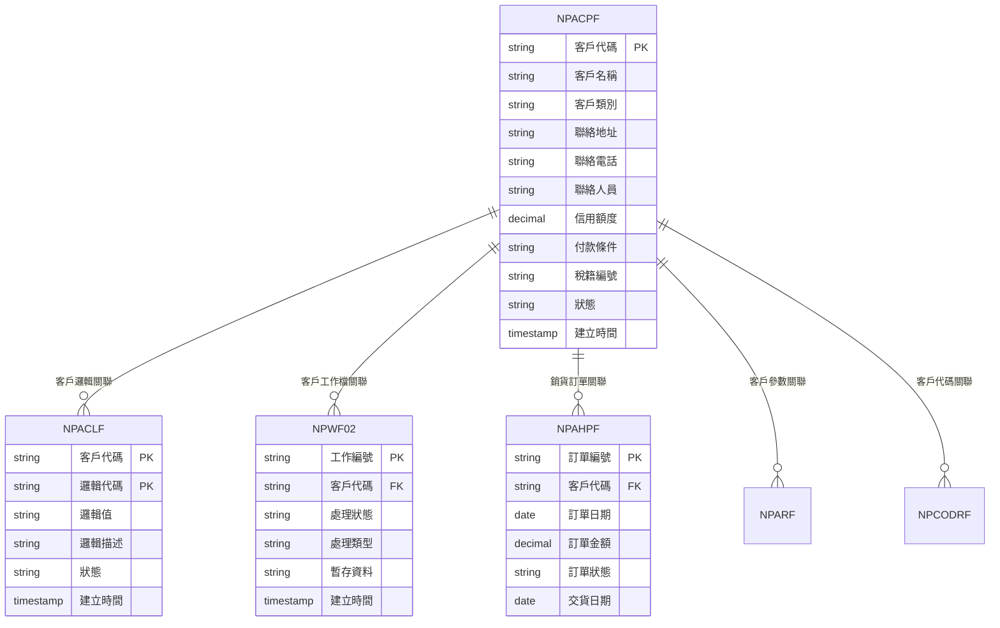
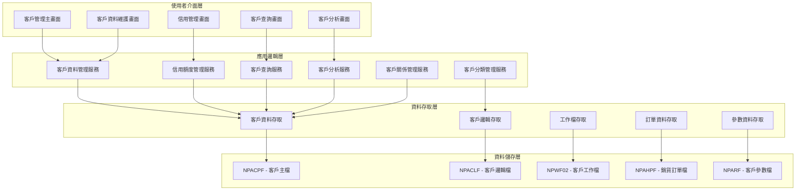
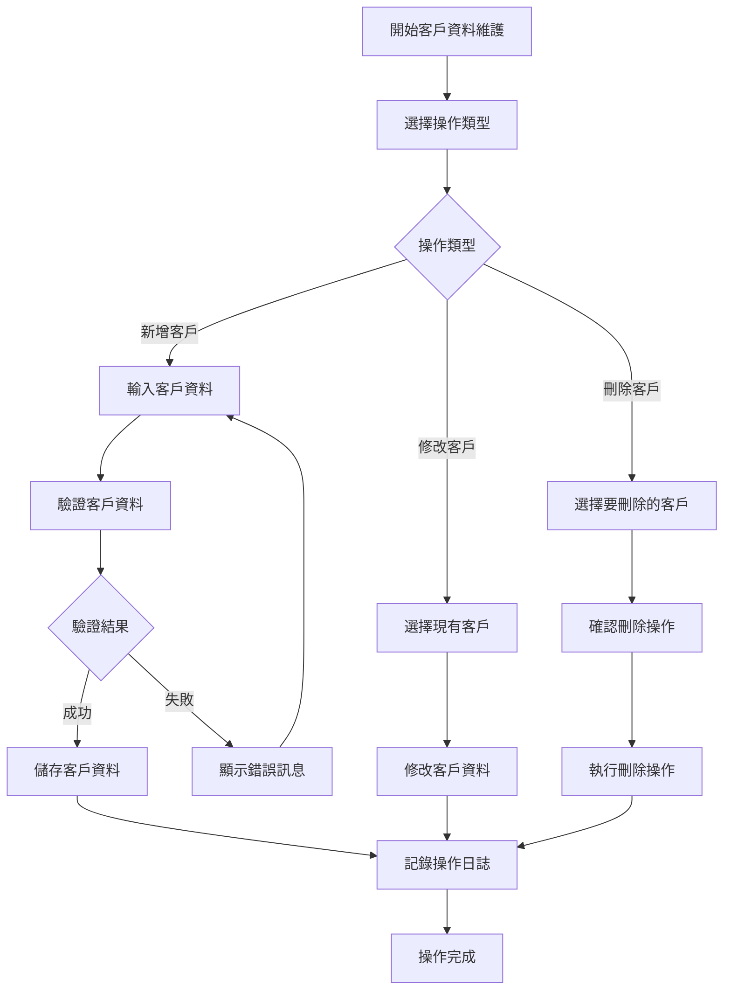
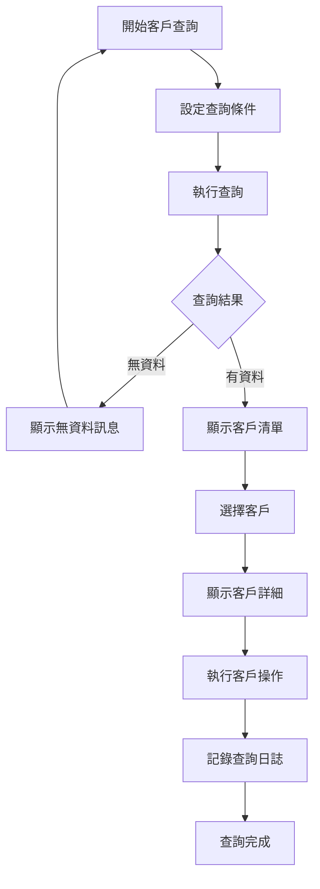
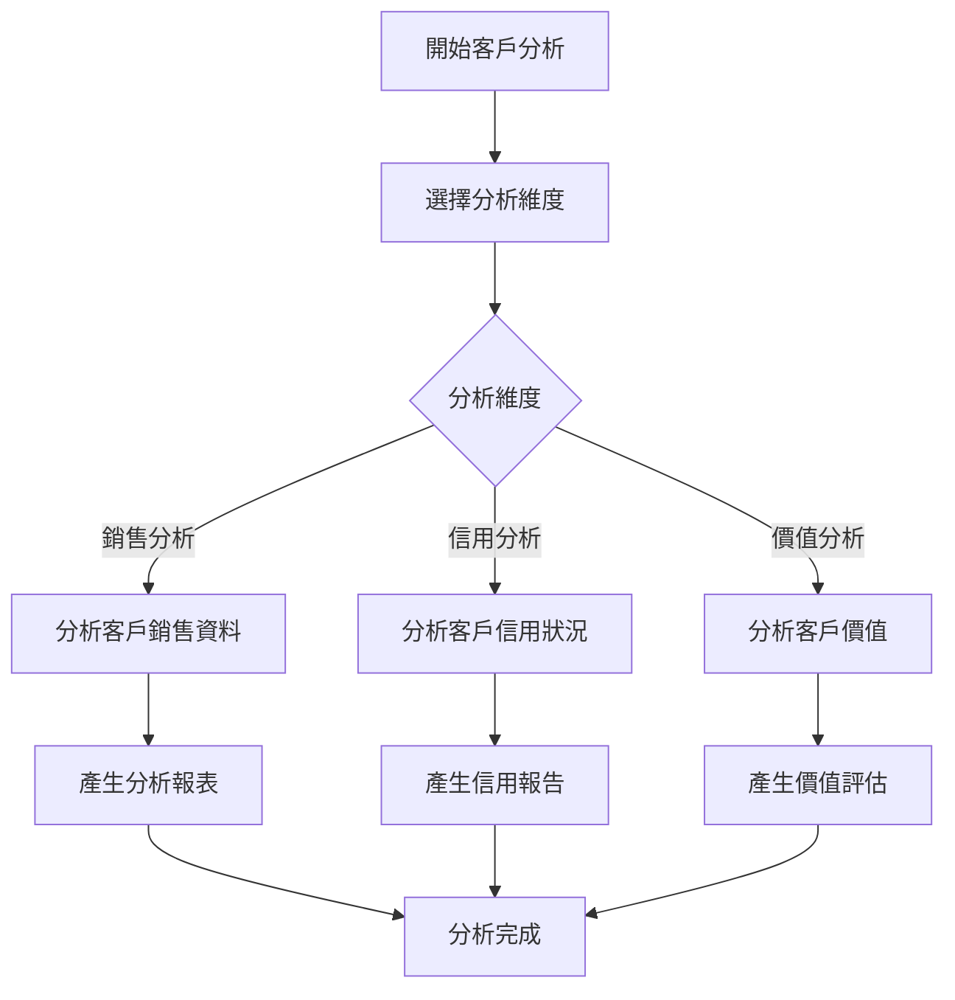
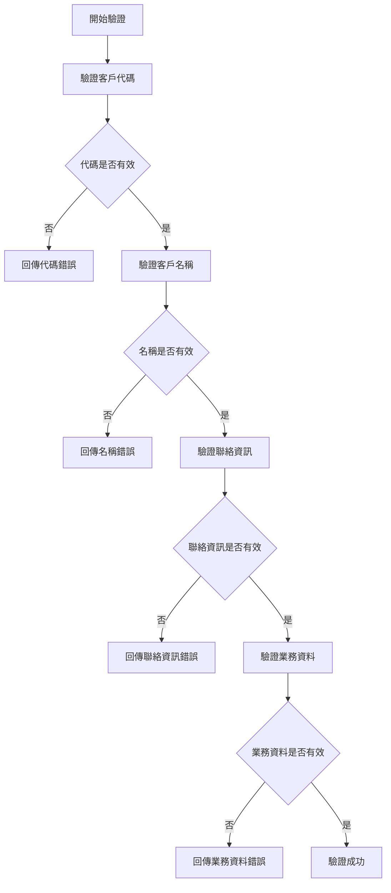
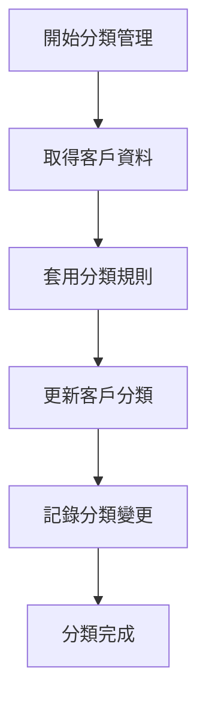
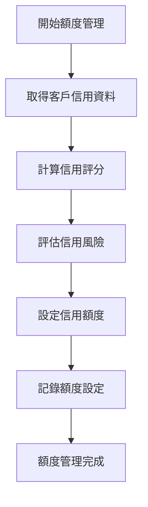
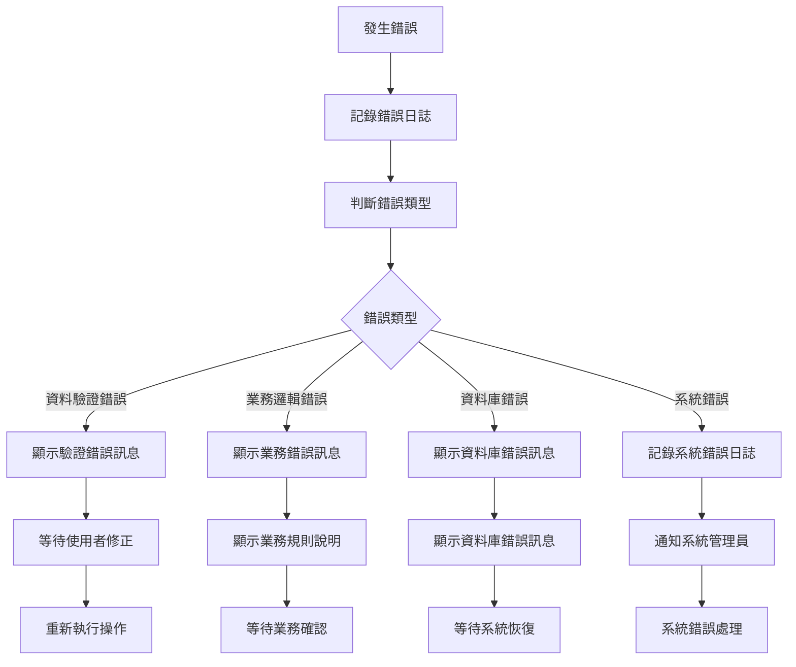

# 銷貨模組 程式功能規格書 - 客戶管理

## 文件基本資訊

| 項目 | 說明 |
|------|------|
| **文件名稱** | 銷貨模組程式功能規格書 - 客戶管理 |
| **模組代號** | NP |
| **版本** | v1.0 |
| **建立日期** | 2024年12月21日 |
| **建立人員** | 系統分析師 |
| **審核人員** | 專案經理 |
| **文件狀態** | 初稿 |
| **最後更新** | 2024年12月21日 |

---

## 目錄

1. [基本資料](#基本資料)
2. [檔案架構與關聯圖](#檔案架構與關聯圖)
3. [檔案名稱與欄位規格](#檔案名稱與欄位規格)
4. [輸出/入螢幕布局與說明](#輸出入螢幕布局與說明)
5. [處理流程程序說明](#處理流程程序說明)
6. [子程序處理邏輯說明](#子程序處理邏輯說明)
7. [錯誤處理程序說明與訊息清冊](#錯誤處理程序說明與訊息清冊)
8. [備註](#備註)

---

## 基本資料

### 1.1 模組概述

#### 1.1.1 模組功能說明
銷貨模組的客戶管理功能主要負責管理企業的客戶資料，包括客戶基本資料維護、客戶分類管理、信用額度管理、客戶關係維護等。此功能為銷貨業務提供完整的客戶資訊支援，協助業務人員進行客戶開發、維護和分析，提升客戶服務品質和業務效率。

#### 1.1.2 模組特色
- **完整客戶資料管理**：涵蓋客戶基本資料、聯絡資訊、業務資訊等全方位管理
- **客戶分類管理**：支援多層級客戶分類，便於客戶策略制定
- **信用額度控制**：完整的信用評估和額度管理機制
- **客戶關係維護**：記錄客戶互動歷史，支援客戶關係管理
- **客戶分析功能**：提供客戶價值分析和業務統計功能
- **多管道客戶開發**：支援各種客戶開發管道和方式

#### 1.1.3 適用範圍
適用於企業銷貨業務中的客戶管理作業，包括客戶開發、客戶維護、客戶分析、信用管理等各類客戶相關業務功能。

### 1.2 技術架構

#### 1.2.1 開發技術
- **程式語言**：RPG、CL、SQL
- **資料庫**：DB2 for i (IBM i)
- **開發工具**：IBM i 開發環境
- **部署環境**：IBM i 7.4

#### 1.2.2 系統需求
- **硬體需求**：IBM i 伺服器
- **軟體需求**：IBM i 作業系統、DB2 for i
- **網路需求**：企業內部網路連線

---

## 檔案架構與關聯圖

### 2.1 資料庫檔案架構

#### 2.1.1 主要資料表


#### 2.1.2 檔案關聯說明
- **NPACPF (客戶主檔)**：儲存客戶的基本資料和業務資訊
- **NPACLF (客戶邏輯檔)**：儲存客戶的邏輯分類和屬性設定
- **NPWF02 (客戶工作檔)**：儲存客戶資料處理過程中的暫存資料和工作狀態
- **NPAHPF (銷貨訂單檔)**：儲存與客戶相關的銷貨訂單資料
- **NPARF (客戶參數檔)**：儲存客戶管理相關的系統參數

### 2.2 系統架構圖

#### 2.2.1 客戶管理系統架構


---

## 檔案名稱與欄位規格

### 3.1 主要檔案規格

#### 3.1.1 NPACPF - 客戶主檔

| 欄位代號 | 欄位名稱 | 位置 | 長度 | 型態 | 屬性 | 檢核說明 |
|----------|----------|------|------|------|------|----------|
| AC01 | 客戶代碼 | 1-5 | 5 | A | PK | 必填，客戶唯一識別碼 |
| AC02 | 客戶名稱 | 6-35 | 30 | A | M | 必填，客戶的中文名稱 |
| AC03 | 客戶類別 | 36-36 | 1 | A | M | 必填，值：1-一般、2-VIP、3-經銷商、4-代理商 |
| AC04 | 聯絡地址 | 37-76 | 40 | A | M | 必填，客戶的聯絡地址 |
| AC05 | 聯絡電話 | 77-86 | 10 | A | M | 必填，客戶的聯絡電話 |
| AC06 | 聯絡人員 | 87-96 | 10 | A | M | 必填，客戶的聯絡人員姓名 |
| AC07 | 信用額度 | 97-106 | 10 | P | M | 必填，客戶的信用額度，小數點後2位 |
| AC08 | 付款條件 | 107-108 | 2 | A | M | 必填，參照付款條件檔 |
| AC09 | 稅籍編號 | 109-118 | 10 | A | O | 選填，統一編號或稅籍編號 |
| AC10 | 電子郵件 | 119-168 | 50 | A | O | 選填，客戶的電子郵件地址 |
| AC11 | 傳真號碼 | 169-178 | 10 | A | O | 選填，客戶的傳真號碼 |
| AC12 | 網址 | 179-228 | 50 | A | O | 選填，客戶的網站網址 |
| AC13 | 客戶狀態 | 229-229 | 1 | A | M | 必填，值：A-有效、D-停用、S-暫停 |
| AC14 | 建立人員 | 230-234 | 5 | A | M | 必填，建立客戶的使用者代號 |
| AC15 | 建立時間 | 235-242 | 8 | T | M | 必填，系統自動產生 |
| AC16 | 修改人員 | 243-247 | 5 | A | O | 選填，最後修改客戶的使用者代號 |
| AC17 | 修改時間 | 248-255 | 8 | T | O | 選填，最後修改時間 |
| AC18 | 備註 | 256-295 | 40 | A | O | 選填，客戶備註說明 |

#### 3.1.2 NPACLF - 客戶邏輯檔

| 欄位代號 | 欄位名稱 | 位置 | 長度 | 型態 | 屬性 | 檢核說明 |
|----------|----------|------|------|------|------|----------|
| CL01 | 客戶代碼 | 1-5 | 5 | A | PK,FK | 必填，參照NPACPF.AC01 |
| CL02 | 邏輯代碼 | 6-8 | 3 | A | PK | 必填，邏輯分類代碼 |
| CL03 | 邏輯值 | 9-18 | 10 | A | M | 必填，邏輯分類的值 |
| CL04 | 邏輯描述 | 19-58 | 40 | A | M | 必填，邏輯分類的描述 |
| CL05 | 邏輯狀態 | 59-59 | 1 | A | M | 必填，值：A-有效、D-無效 |
| CL06 | 建立人員 | 60-64 | 5 | A | M | 必填，建立邏輯的使用者代號 |
| CL07 | 建立時間 | 65-72 | 8 | T | M | 必填，系統自動產生 |
| CL08 | 修改人員 | 73-77 | 5 | A | O | 選填，修改邏輯的使用者代號 |
| CL09 | 修改時間 | 78-85 | 8 | T | O | 選填，修改時間 |

#### 3.1.3 NPWF02 - 客戶工作檔

| 欄位代號 | 欄位名稱 | 位置 | 長度 | 型態 | 屬性 | 檢核說明 |
|----------|----------|------|------|------|------|----------|
| WF0201 | 工作編號 | 1-10 | 10 | A | PK | 必填，工作唯一識別碼 |
| WF0202 | 客戶代碼 | 11-15 | 5 | A | FK | 必填，參照NPACPF.AC01 |
| WF0203 | 處理狀態 | 16-16 | 1 | A | M | 必填，值：P-處理中、C-完成、E-錯誤 |
| WF0204 | 處理類型 | 17-17 | 1 | A | M | 必填，值：1-新增、2-修改、3-刪除、4-狀態變更 |
| WF0205 | 暫存資料 | 18-117 | 100 | A | O | 選填，處理中的暫存資料 |
| WF0206 | 建立時間 | 118-125 | 8 | T | M | 必填，系統自動產生 |
| WF0207 | 完成時間 | 126-133 | 8 | T | O | 選填，處理完成時間 |
| WF0208 | 錯誤訊息 | 134-183 | 50 | A | O | 選填，處理錯誤時的錯誤訊息 |
| WF0209 | 處理人員 | 184-188 | 5 | A | O | 選填，處理工作的人員代號 |

#### 3.1.4 NPARF - 客戶參數檔

| 欄位代號 | 欄位名稱 | 位置 | 長度 | 型態 | 屬性 | 檢核說明 |
|----------|----------|------|------|------|------|----------|
| AR01 | 參數代號 | 1-5 | 5 | A | PK | 必填，參數唯一識別碼 |
| AR02 | 參數名稱 | 6-35 | 30 | A | M | 必填，參數的中文名稱 |
| AR03 | 參數值 | 36-85 | 50 | A | M | 必填，參數的當前值 |
| AR04 | 參數類型 | 86-87 | 2 | A | M | 必填，值：01-字串、02-數值、03-日期、04-布林 |
| AR05 | 參數狀態 | 88-89 | 2 | A | M | 必填，值：01-啟用、02-停用、03-維護中 |
| AR06 | 建立人員 | 90-94 | 5 | A | M | 必填，建立參數的使用者代號 |
| AR07 | 建立時間 | 95-102 | 8 | T | M | 必填，系統自動產生 |
| AR08 | 修改人員 | 103-107 | 5 | A | O | 選填，最後修改參數的使用者代號 |
| AR09 | 修改時間 | 108-115 | 8 | T | O | 選填，最後修改時間 |
| AR10 | 備註 | 116-155 | 40 | A | O | 選填，參數備註說明 |

### 3.2 索引資料

#### 3.2.1 主要索引
- **NPACPF 主鍵索引**：AC01 (客戶代碼)
- **NPACPF 客戶名稱索引**：AC02 (客戶名稱)
- **NPACPF 客戶類別索引**：AC03 (客戶類別)
- **NPACPF 客戶狀態索引**：AC13 (客戶狀態)
- **NPACPF 稅籍編號索引**：AC09 (稅籍編號)

#### 3.2.2 次要索引
- **NPACLF 主鍵索引**：CL01 + CL02 (客戶代碼 + 邏輯代碼)
- **NPACLF 客戶代碼索引**：CL01 (客戶代碼)
- **NPACLF 邏輯代碼索引**：CL02 (邏輯代碼)
- **NPWF02 主鍵索引**：WF0201 (工作編號)
- **NPWF02 客戶代碼索引**：WF0202 (客戶代碼)
- **NPARF 主鍵索引**：AR01 (參數代號)

---

## 輸出/入螢幕布局與說明

### 4.1 客戶管理主畫面

#### 4.1.1 畫面布局
```
┌─────────────────────────────────────────────────────────────┐
│                    客戶管理系統                            │
├─────────────────────────────────────────────────────────────┤
│ 功能選項：                                                  │
│  [1]客戶資料維護  [2]客戶查詢  [3]客戶分析  [4]信用管理  │
│  [5]客戶分類管理 [6]客戶匯入  [7]客戶匯出  [8]離開系統  │
├─────────────────────────────────────────────────────────────┤
│ 查詢條件：                                                  │
│  客戶類別：[全部類別 ▼] 客戶狀態：[全部狀態 ▼]            │
│  關鍵字：[                ] [查詢] [清除]                  │
├─────────────────────────────────────────────────────────────┤
│ 客戶清單：                                                  │
│ ┌─────┬──────────┬──────────┬──────────┬──────────┬────────┐ │
│ │序號 │客戶代碼  │客戶名稱  │客戶類別  │聯絡電話  │狀態    │ │
│ ├─────┼──────────┼──────────┼──────────┼──────────┼────────┤ │
│ │  1  │C001      │客戶A     │一般客戶  │02-12345678│有效    │ │
│ │  2  │C002      │客戶B     │VIP客戶   │02-87654321│有效    │ │
│ └─────┴──────────┴──────────┴──────────┴──────────┴────────┘ │
├─────────────────────────────────────────────────────────────┤
│ 功能鍵：F1=說明  F3=離開  F4=新增客戶  F6=修改  F8=刪除  F12=取消│
└─────────────────────────────────────────────────────────────┘
```

#### 4.1.2 畫面說明
- **功能選項區**：提供客戶管理的主要功能選項
- **查詢條件區**：設定客戶查詢的相關條件
- **客戶清單區**：顯示符合查詢條件的客戶資料
- **功能鍵區**：說明可使用的功能鍵

### 4.2 客戶資料維護畫面

#### 4.2.1 畫面布局
```
┌─────────────────────────────────────────────────────────────┐
│                    客戶資料維護                            │
├─────────────────────────────────────────────────────────────┤
│ 基本資料：                                                  │
│  客戶代碼：[C001    ] 客戶名稱：[客戶A                ]    │
│  客戶類別：[一般客戶 ▼] 客戶狀態：[有效 ▼]                │
│  聯絡地址：[台北市中山區中山路100號                    ]    │
│  聯絡電話：[02-12345678] 聯絡人員：[張三              ]    │
├─────────────────────────────────────────────────────────────┤
│ 業務資料：                                                  │
│  信用額度：[1000000.00] 付款條件：[30天 ▼]               │
│  稅籍編號：[12345678  ] 電子郵件：[abc@company.com]       │
│  傳真號碼：[02-12345679] 網址：[www.company.com]          │
├─────────────────────────────────────────────────────────────┤
│ 邏輯分類：                                                  │
│  產業別：[製造業 ▼] 地區：[北區 ▼] 規模：[大型 ▼]         │
│  客戶等級：[A級 ▼] 開發管道：[業務開發 ▼]                 │
├─────────────────────────────────────────────────────────────┤
│ 操作：[儲存] [取消] [刪除] [複製]                          │
│ 功能鍵：F1=說明  F3=離開  F9=儲存  F12=取消              │
└─────────────────────────────────────────────────────────────┘
```

---

## 處理流程程序說明

### 5.1 客戶資料維護流程

#### 5.1.1 主要處理流程


#### 5.1.2 資料驗證規則
1. **客戶代碼驗證**：必須唯一，長度不能超過5位
2. **客戶名稱驗證**：不能為空白，長度不能超過30位
3. **聯絡電話驗證**：必須符合電話格式
4. **信用額度驗證**：必須為正數，小數點後2位
5. **稅籍編號驗證**：必須符合統一編號格式（如果填寫）

### 5.2 客戶查詢流程

#### 5.2.1 主要處理流程


### 5.3 客戶分析流程

#### 5.3.1 主要處理流程


---

## 子程序處理邏輯說明

### 6.1 客戶資料驗證子程序

#### 6.1.1 驗證邏輯


#### 6.1.2 驗證規則詳述
1. **客戶代碼驗證**
   - 長度必須在1-5位之間
   - 只能包含字母和數字
   - 不能與現有客戶代碼重複

2. **客戶名稱驗證**
   - 不能為空白或null
   - 長度必須在1-30位之間
   - 不能包含特殊字元

3. **聯絡資訊驗證**
   - 聯絡電話必須符合電話格式
   - 電子郵件必須符合郵件格式（如果填寫）
   - 網址必須符合URL格式（如果填寫）

### 6.2 客戶分類管理子程序

#### 6.2.1 分類邏輯


#### 6.2.2 分類規則
1. **客戶類別分類**
   - 一般客戶：新開發客戶
   - VIP客戶：年採購金額超過100萬
   - 經銷商：有經銷合約的客戶
   - 代理商：有代理合約的客戶

2. **客戶等級分類**
   - A級：年採購金額超過500萬
   - B級：年採購金額100-500萬
   - C級：年採購金額50-100萬
   - D級：年採購金額50萬以下

### 6.3 信用額度管理子程序

#### 6.3.1 額度管理邏輯


#### 6.3.2 信用評估標準
1. **信用評分計算**
   - 付款記錄：40%
   - 交易金額：30%
   - 合作時間：20%
   - 其他因素：10%

2. **信用額度設定**
   - 高信用評分：額度為年採購金額的50%
   - 中信用評分：額度為年採購金額的30%
   - 低信用評分：額度為年採購金額的20%

---

## 錯誤處理程序說明與訊息清冊

### 7.1 錯誤處理程序

#### 7.1.1 錯誤處理流程


### 7.2 錯誤訊息清冊

#### 7.2.1 資料驗證錯誤訊息

| 錯誤代碼 | 錯誤訊息 | 錯誤原因 | 解決方法 |
|----------|----------|----------|----------|
| **NP701** | 客戶代碼已存在 | 要新增的客戶代碼在系統中已存在 | 請使用不同的客戶代碼，或先刪除現有的客戶 |
| **NP702** | 客戶代碼格式無效 | 客戶代碼包含無效字元 | 請使用有效的字元，只能包含字母和數字 |
| **NP703** | 客戶名稱不能為空白 | 客戶名稱欄位為空白 | 請輸入客戶名稱，長度不能超過30位 |
| **NP704** | 聯絡電話格式無效 | 聯絡電話格式不正確 | 請使用正確的電話格式 |
| **NP705** | 信用額度必須為正數 | 信用額度為負數或零 | 請輸入正數的信用額度 |

#### 7.2.2 業務邏輯錯誤訊息

| 錯誤代碼 | 錯誤訊息 | 錯誤原因 | 解決方法 |
|----------|----------|----------|----------|
| **NP801** | 客戶狀態不允許修改 | 客戶當前狀態不允許進行修改操作 | 請檢查客戶狀態，或聯繫系統管理員 |
| **NP802** | 信用額度超過限制 | 設定的信用額度超過系統限制 | 請調整信用額度，或聯繫系統管理員 |
| **NP803** | 客戶分類規則衝突 | 客戶分類設定與業務規則衝突 | 請檢查分類設定，或聯繫業務人員 |
| **NP804** | 客戶資料不完整 | 客戶必填欄位資料不完整 | 請檢查並填寫所有必填欄位 |
| **NP805** | 客戶邏輯分類無效 | 客戶邏輯分類設定無效 | 請檢查邏輯分類設定 |

#### 7.2.3 資料庫錯誤訊息

| 錯誤代碼 | 錯誤訊息 | 錯誤原因 | 解決方法 |
|----------|----------|----------|----------|
| **NP901** | 資料庫連線失敗 | 無法連接到資料庫系統 | 請檢查網路連線，或聯繫系統管理員 |
| **NP902** | 資料庫交易失敗 | 資料庫交易執行失敗 | 請重新執行操作，或聯繫資料庫管理員 |
| **NP903** | 檔案存取權限不足 | 使用者沒有存取相關檔案的權限 | 請聯繫系統管理員檢查使用者權限 |
| **NP904** | 系統資源不足 | 系統記憶體或磁碟空間不足 | 請聯繫系統管理員檢查系統資源 |
| **NP905** | 程式執行異常 | 程式執行過程中發生未預期的錯誤 | 請記錄錯誤訊息，並聯繫系統管理員 |

### 7.3 錯誤處理建議

#### 7.3.1 使用者操作建議
1. **檢查輸入資料**：在提交前仔細檢查所有輸入欄位的內容
2. **參考錯誤訊息**：根據錯誤訊息提供的建議進行修正
3. **記錄錯誤情況**：如果錯誤持續發生，請記錄詳細的錯誤情況
4. **尋求技術支援**：對於無法解決的錯誤，請聯繫技術支援人員

#### 7.3.2 系統管理建議
1. **定期檢查錯誤日誌**：定期檢查系統錯誤日誌，及時發現和處理問題
2. **監控系統資源**：定期監控系統資源使用情況，預防資源不足問題
3. **備份重要資料**：定期備份重要的客戶資料和設定
4. **更新系統版本**：及時更新系統版本，修復已知的錯誤和漏洞

---

## 備註

### 8.1 開發注意事項

#### 8.1.1 程式開發注意事項
1. **資料完整性**：所有客戶資料都必須進行嚴格的資料驗證
2. **業務邏輯**：必須嚴格遵循客戶管理的業務規則
3. **錯誤處理**：必須提供完整的錯誤處理機制
4. **日誌記錄**：所有重要操作都必須記錄詳細的日誌
5. **效能優化**：客戶查詢功能必須考慮效能影響

#### 8.1.2 測試注意事項
1. **單元測試**：每個子程序都必須進行單元測試
2. **整合測試**：必須測試與其他模組的整合情況
3. **業務邏輯測試**：必須測試客戶管理的業務邏輯
4. **效能測試**：必須測試客戶查詢功能的效能表現
5. **使用者測試**：必須進行使用者接受度測試

### 8.2 維護注意事項

#### 8.2.1 日常維護注意事項
1. **定期備份**：定期備份客戶資料和相關設定
2. **效能監控**：定期監控客戶管理功能的效能表現
3. **錯誤分析**：定期分析錯誤日誌，改進系統穩定性
4. **資料清理**：定期清理無效的客戶資料
5. **分類維護**：定期維護和更新客戶分類規則

#### 8.2.2 版本更新注意事項
1. **相容性檢查**：更新前必須檢查與現有客戶資料的相容性
2. **資料遷移**：必要時進行客戶資料的遷移和轉換
3. **回滾計畫**：制定詳細的回滾計畫，以應對更新失敗
4. **使用者通知**：提前通知使用者客戶系統更新計畫
5. **測試驗證**：更新後必須進行充分的測試驗證

### 8.3 未來擴充建議

#### 8.3.1 功能擴充建議
1. **多語言支援**：增加多語言支援，滿足國際化需求
2. **行動裝置支援**：開發行動裝置應用程式，提供隨時隨地的客戶管理功能
3. **客戶關係管理**：增加更完整的客戶關係管理功能
4. **進階分析功能**：增加更進階的客戶分析和預測功能
5. **雲端整合**：考慮與雲端CRM系統的整合

#### 8.3.2 技術改進建議
1. **微服務架構**：考慮採用微服務架構，提高系統的模組化和可維護性
2. **人工智慧應用**：考慮在客戶分析和預測中應用人工智慧技術
3. **大數據分析**：考慮使用大數據技術分析客戶行為和趨勢
4. **API標準化**：制定標準的客戶管理API規範，便於與其他系統的整合
5. **容器化部署**：考慮使用容器技術進行系統部署

---

## 附錄

### A.1 相關文件清單
- 銷貨模組程式功能規格書 - 銷貨管理
- 銷貨模組業務邏輯分析與API設計
- 銷貨模組操作手冊 - 客戶管理

### A.2 修訂記錄

| 版本 | 修訂日期 | 修訂人員 | 修訂內容 | 修訂原因 |
|------|----------|----------|----------|----------|
| v1.0 | 2024/12/21 | 系統分析師 | 初始版本建立 | 新功能開發 |

### A.3 聯絡資訊
- **專案經理**：[專案經理姓名]
- **系統分析師**：[系統分析師姓名]
- **技術支援**：[技術支援聯絡方式]
- **專案信箱**：[專案信箱地址]
