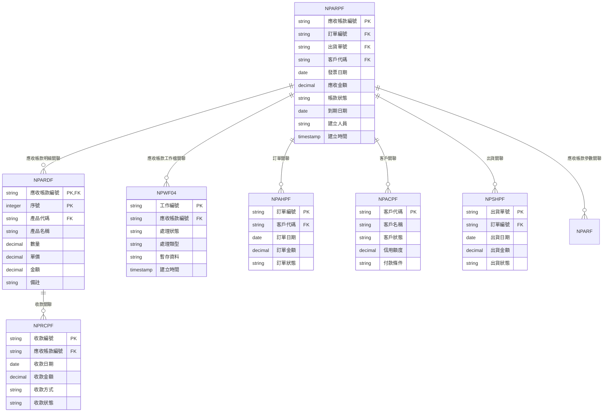
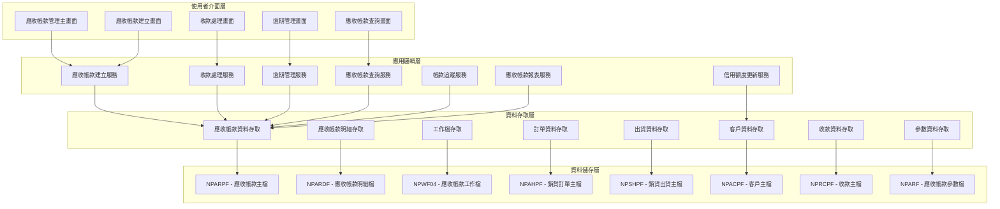
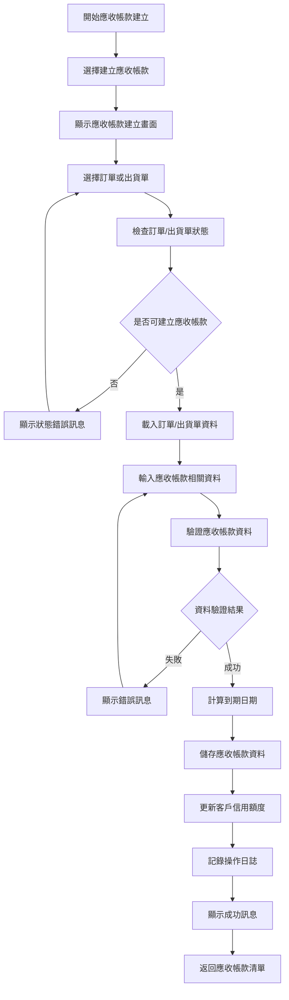
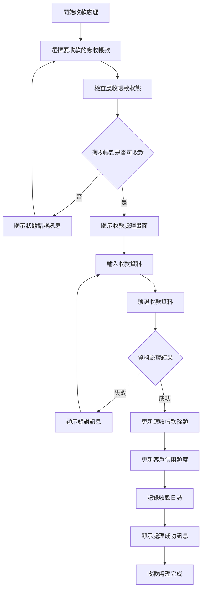
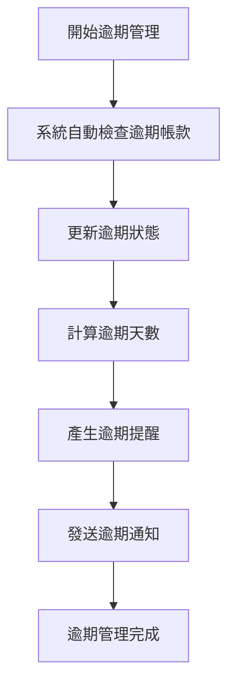
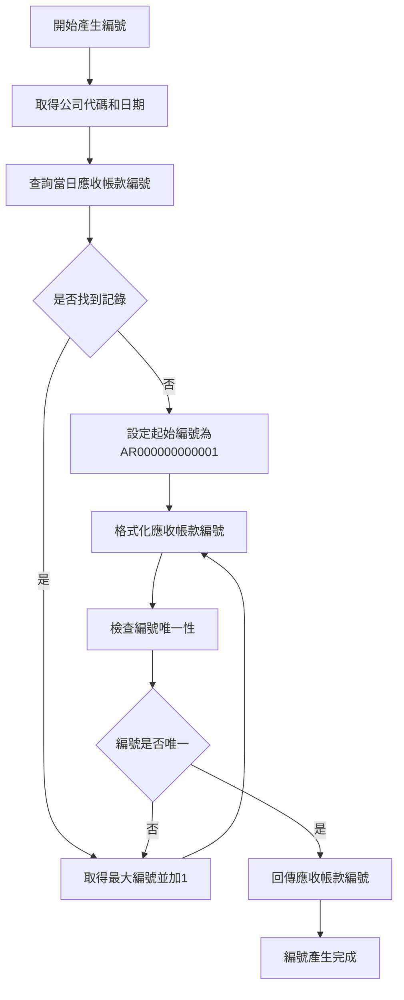
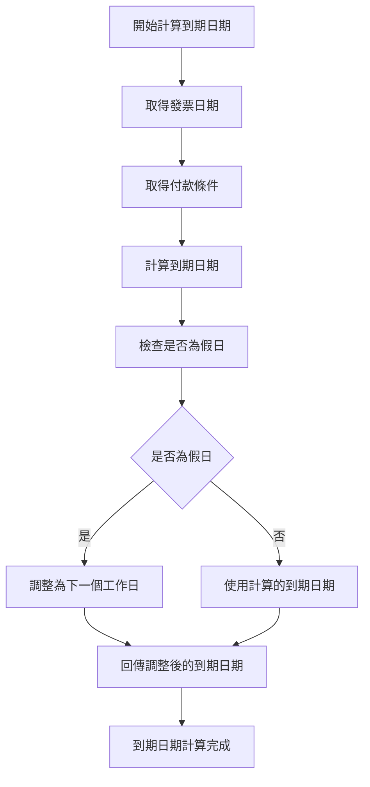
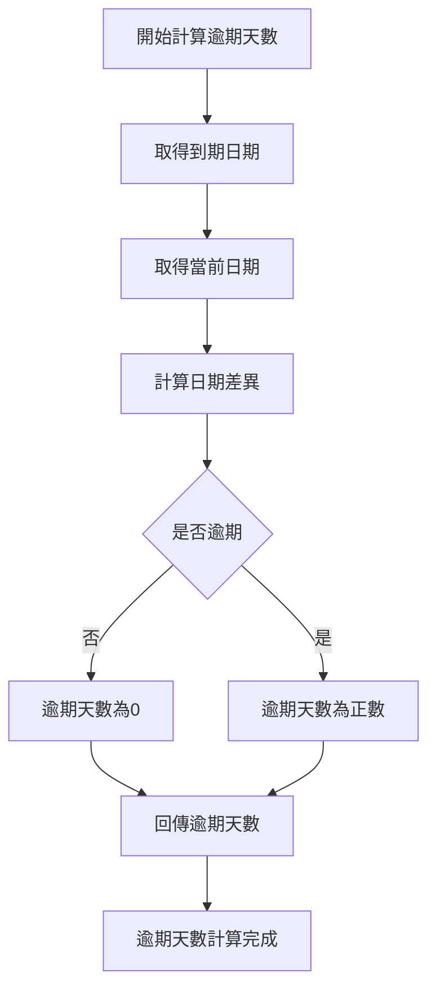
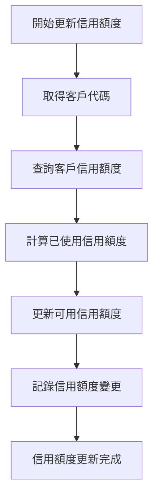
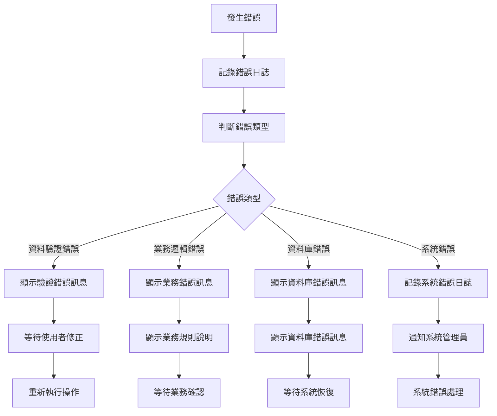

# 銷貨模組 程式功能規格書 - 應收帳款管理

## 文件基本資訊

| 項目 | 說明 |
|------|------|
| **文件名稱** | 銷貨模組程式功能規格書 - 應收帳款管理 |
| **模組代號** | NP |
| **版本** | v1.0 |
| **建立日期** | 2024年12月21日 |
| **建立人員** | 系統分析師 |
| **審核人員** | 專案經理 |
| **文件狀態** | 初稿 |
| **最後更新** | 2024年12月21日 |

---

## 目錄

1. [基本資料](#基本資料)
2. [檔案架構與關聯圖](#檔案架構與關聯圖)
3. [檔案名稱與欄位規格](#檔案名稱與欄位規格)
4. [輸出/入螢幕布局與說明](#輸出入螢幕布局與說明)
5. [處理流程程序說明](#處理流程程序說明)
6. [子程序處理邏輯說明](#子程序處理邏輯說明)
7. [錯誤處理程序說明與訊息清冊](#錯誤處理程序說明與訊息清冊)
8. [備註](#備註)

---

## 基本資料

### 1.1 模組概述

#### 1.1.1 模組功能說明
銷貨模組的應收帳款管理功能主要負責管理企業的應收帳款作業，包括應收帳款建立、帳款追蹤、收款處理、逾期管理、呆帳處理、應收帳款報表等。此功能為銷貨業務提供完整的應收帳款生命週期管理，從發票開立到收款完成，再到逾期處理，確保應收帳款管理的準確性和效率。

#### 1.1.2 模組特色
- **完整應收帳款生命週期管理**：涵蓋應收帳款建立、帳款追蹤、收款處理、逾期管理、呆帳處理等全流程
- **多層級帳款狀態管理**：支援未到期、已到期、逾期、部分收款、完全收款、呆帳等狀態
- **自動化帳款編號產生**：系統自動產生唯一且連續的應收帳款編號
- **即時帳款餘額更新**：收款時自動更新應收帳款餘額和客戶信用額度
- **逾期帳款自動提醒**：系統自動提醒逾期帳款，支援多級逾期管理
- **多種收款方式支援**：支援現金、支票、匯款、信用卡等多種收款方式

#### 1.1.3 適用範圍
適用於企業銷貨業務中的應收帳款管理作業，包括應收帳款建立、帳款追蹤、收款處理、逾期管理、呆帳處理、應收帳款報表等各類應收帳款相關業務功能。

### 1.2 技術架構

#### 1.2.1 開發技術
- **程式語言**：RPG、CL、SQL
- **資料庫**：DB2 for i (IBM i)
- **開發工具**：IBM i 開發環境
- **部署環境**：IBM i 7.4

#### 1.2.2 系統需求
- **硬體需求**：IBM i 伺服器
- **軟體需求**：IBM i 作業系統、DB2 for i
- **網路需求**：企業內部網路連線

---

## 檔案架構與關聯圖

### 2.1 資料庫檔案架構

#### 2.1.1 主要資料表


#### 2.1.2 檔案關聯說明
- **NPARPF (應收帳款主檔)**：儲存應收帳款的基本資料和標頭資訊
- **NPARDF (應收帳款明細檔)**：儲存應收帳款的明細項目資料
- **NPWF04 (應收帳款工作檔)**：儲存應收帳款處理過程中的暫存資料和工作狀態
- **NPAHPF (銷貨訂單主檔)**：儲存訂單的基本資料和狀態資訊
- **NPSHPF (銷貨出貨主檔)**：儲存出貨的基本資料和狀態資訊
- **NPACPF (客戶主檔)**：儲存客戶的基本資料和信用資訊
- **NPRCPF (收款主檔)**：儲存收款的基本資料和狀態資訊
- **NPARF (應收帳款參數檔)**：儲存應收帳款管理相關的系統參數

### 2.2 系統架構圖

#### 2.2.1 應收帳款管理系統架構


---

## 檔案名稱與欄位規格

### 3.1 主要檔案規格

#### 3.1.1 NPARPF - 應收帳款主檔

| 欄位代號 | 欄位名稱 | 位置 | 長度 | 型態 | 屬性 | 檢核說明 |
|----------|----------|------|------|------|------|----------|
| AR01 | 公司代碼 | 1-3 | 3 | A | PK | 必填，公司唯一識別碼 |
| AR02 | 應收帳款編號 | 4-15 | 12 | A | PK | 必填，應收帳款唯一識別碼 |
| AR03 | 訂單編號 | 16-27 | 12 | A | FK | 必填，參照銷貨訂單檔 |
| AR04 | 出貨單號 | 28-39 | 12 | A | FK | 必填，參照銷貨出貨檔 |
| AR05 | 客戶代碼 | 40-44 | 5 | A | FK | 必填，參照客戶主檔 |
| AR06 | 發票日期 | 45-52 | 8 | D | M | 必填，發票開立日期 |
| AR07 | 到期日期 | 53-60 | 8 | D | M | 必填，應收帳款到期日期 |
| AR08 | 應收金額 | 61-70 | 10 | P | M | 必填，應收帳款總金額，小數點後2位 |
| AR09 | 已收金額 | 71-80 | 10 | P | M | 必填，已收款金額，小數點後2位 |
| AR10 | 未收金額 | 81-90 | 10 | P | M | 必填，未收款金額，小數點後2位 |
| AR11 | 帳款狀態 | 91-91 | 1 | A | M | 必填，值：N-未到期、D-已到期、O-逾期、P-部分收款、C-完全收款、B-呆帳 |
| AR12 | 逾期天數 | 92-95 | 4 | I | O | 選填，逾期天數 |
| AR13 | 付款條件 | 96-97 | 2 | A | M | 必填，參照付款條件檔 |
| AR14 | 備註 | 98-137 | 40 | A | O | 選填，最多40字元 |
| AR15 | 建立人員 | 138-142 | 5 | A | M | 必填，參照使用者檔 |
| AR16 | 建立時間 | 143-150 | 8 | T | M | 必填，系統自動產生 |
| AR17 | 修改人員 | 151-155 | 5 | A | O | 選填，最後修改應收帳款的使用者代號 |
| AR18 | 修改時間 | 156-163 | 8 | T | O | 選填，最後修改時間 |

#### 3.1.2 NPARDF - 應收帳款明細檔

| 欄位代號 | 欄位名稱 | 位置 | 長度 | 型態 | 屬性 | 檢核說明 |
|----------|----------|------|------|------|------|----------|
| ARD01 | 應收帳款編號 | 1-12 | 12 | A | PK,FK | 必填，參照NPARPF.AR02 |
| ARD02 | 序號 | 13-15 | 3 | I | PK | 必填，1-999 |
| ARD03 | 產品代碼 | 16-20 | 5 | A | FK | 必填，參照產品主檔 |
| ARD04 | 產品名稱 | 21-50 | 30 | A | M | 必填，最多30字元 |
| ARD05 | 規格 | 51-80 | 30 | A | O | 選填，最多30字元 |
| ARD06 | 數量 | 81-88 | 8 | P | M | 必填，正數，小數點後2位 |
| ARD07 | 單位 | 89-90 | 2 | A | M | 必填，參照單位檔 |
| ARD08 | 單價 | 91-100 | 10 | P | M | 必填，金額格式，小數點後2位 |
| ARD09 | 金額 | 101-110 | 10 | P | M | 必填，數量×單價，小數點後2位 |
| ARD10 | 備註 | 111-140 | 30 | A | O | 選填，最多30字元 |

#### 3.1.3 NPRCPF - 收款主檔

| 欄位代號 | 欄位名稱 | 位置 | 長度 | 型態 | 屬性 | 檢核說明 |
|----------|----------|------|------|------|------|----------|
| RC01 | 收款編號 | 1-12 | 12 | A | PK | 必填，收款唯一識別碼 |
| RC02 | 應收帳款編號 | 13-24 | 12 | A | FK | 必填，參照應收帳款檔 |
| RC03 | 客戶代碼 | 25-29 | 5 | A | FK | 必填，參照客戶主檔 |
| RC04 | 收款日期 | 30-37 | 8 | D | M | 必填，收款處理日期 |
| RC05 | 收款金額 | 38-47 | 10 | P | M | 必填，收款金額，小數點後2位 |
| RC06 | 收款方式 | 48-49 | 2 | A | M | 必填，值：01-現金、02-支票、03-匯款、04-信用卡、05-其他 |
| RC07 | 收款狀態 | 50-50 | 1 | A | M | 必填，值：P-處理中、C-完成、E-錯誤 |
| RC08 | 支票號碼 | 51-60 | 10 | A | O | 選填，支票收款時填寫 |
| RC09 | 匯款帳號 | 61-80 | 20 | A | O | 選填，匯款收款時填寫 |
| RC10 | 備註 | 81-120 | 40 | A | O | 選填，最多40字元 |
| RC11 | 建立人員 | 121-125 | 5 | A | M | 必填，參照使用者檔 |
| RC12 | 建立時間 | 126-133 | 8 | T | M | 必填，系統自動產生 |

#### 3.1.4 NPWF04 - 應收帳款工作檔

| 欄位代號 | 欄位名稱 | 位置 | 長度 | 型態 | 屬性 | 檢核說明 |
|----------|----------|------|------|------|------|----------|
| WF0401 | 工作編號 | 1-10 | 10 | A | PK | 必填，工作唯一識別碼 |
| WF0402 | 應收帳款編號 | 11-22 | 12 | A | FK | 必填，參照應收帳款檔 |
| WF0403 | 處理狀態 | 23-23 | 1 | A | M | 必填，值：P-處理中、C-完成、E-錯誤 |
| WF0404 | 處理類型 | 24-24 | 1 | A | M | 必填，值：1-新增、2-修改、3-刪除、4-狀態變更 |
| WF0405 | 暫存資料 | 25-124 | 100 | A | O | 選填，處理中的暫存資料 |
| WF0406 | 建立時間 | 125-132 | 8 | T | M | 必填，系統自動產生 |
| WF0407 | 完成時間 | 133-140 | 8 | T | O | 選填，處理完成時間 |
| WF0408 | 錯誤訊息 | 141-190 | 50 | A | O | 選填，處理錯誤時的錯誤訊息 |
| WF0409 | 處理人員 | 191-195 | 5 | A | O | 選填，處理工作的人員代號 |

#### 3.1.5 NPARF - 應收帳款參數檔

| 欄位代號 | 欄位名稱 | 位置 | 長度 | 型態 | 屬性 | 檢核說明 |
|----------|----------|------|------|------|------|----------|
| ARF01 | 參數代號 | 1-5 | 5 | A | PK | 必填，參數唯一識別碼 |
| ARF02 | 參數名稱 | 6-35 | 30 | A | M | 必填，參數的中文名稱 |
| ARF03 | 參數值 | 36-85 | 50 | A | M | 必填，參數的當前值 |
| ARF04 | 參數類型 | 86-87 | 2 | A | M | 必填，值：01-字串、02-數值、03-日期、04-布林 |
| ARF05 | 參數狀態 | 88-89 | 2 | A | M | 必填，值：01-啟用、02-停用、03-維護中 |
| ARF06 | 建立人員 | 90-94 | 5 | A | M | 必填，建立參數的使用者代號 |
| ARF07 | 建立時間 | 95-102 | 8 | T | M | 必填，系統自動產生 |
| ARF08 | 修改人員 | 103-107 | 5 | A | O | 選填，最後修改參數的使用者代號 |
| ARF09 | 修改時間 | 108-115 | 8 | T | O | 選填，最後修改時間 |
| ARF10 | 備註 | 116-155 | 40 | A | O | 選填，參數備註說明 |

### 3.2 索引資料

#### 3.2.1 主要索引
- **NPARPF 主鍵索引**：AR01 + AR02 (公司代碼 + 應收帳款編號)
- **NPARPF 訂單編號索引**：AR03 (訂單編號)
- **NPARPF 出貨單號索引**：AR04 (出貨單號)
- **NPARPF 客戶代碼索引**：AR05 (客戶代碼)
- **NPARPF 到期日期索引**：AR07 (到期日期)
- **NPARPF 帳款狀態索引**：AR11 (帳款狀態)

#### 3.2.2 次要索引
- **NPARDF 主鍵索引**：ARD01 + ARD02 (應收帳款編號 + 序號)
- **NPARDF 應收帳款編號索引**：ARD01 (應收帳款編號)
- **NPARDF 產品代碼索引**：ARD03 (產品代碼)
- **NPRCPF 主鍵索引**：RC01 (收款編號)
- **NPRCPF 應收帳款編號索引**：RC02 (應收帳款編號)
- **NPRCPF 客戶代碼索引**：RC03 (客戶代碼)
- **NPWF04 主鍵索引**：WF0401 (工作編號)
- **NPWF04 應收帳款編號索引**：WF0402 (應收帳款編號)
- **NPARF 主鍵索引**：ARF01 (參數代號)

---

## 輸出/入螢幕布局與說明

### 4.1 應收帳款管理主畫面

#### 4.1.1 畫面布局
```
┌─────────────────────────────────────────────────────────────┐
│                  應收帳款管理系統                          │
├─────────────────────────────────────────────────────────────┤
│ 功能選項：                                                  │
│  [1]建立應收帳款  [2]收款處理  [3]逾期管理  [4]帳款查詢  │
│  [5]帳款追蹤  [6]應收帳款報表  [7]帳款匯出  [8]離開系統  │
├─────────────────────────────────────────────────────────────┤
│ 查詢條件：                                                  │
│  日期範圍：[2024/01/01] 至 [2024/12/31]                  │
│  客戶範圍：[全部客戶 ▼] 帳款狀態：[全部狀態 ▼]            │
│  關鍵字：[                ] [查詢] [清除]                  │
├─────────────────────────────────────────────────────────────┤
│ 應收帳款清單：                                              │
│ ┌─────┬──────────┬──────────┬──────────┬──────────┬────────┐ │
│ │序號 │應收帳款號│客戶名稱  │到期日期  │應收金額  │狀態    │ │
│ ├─────┼──────────┼──────────┼──────────┼──────────┼────────┤ │
│ │  1  │AR001     │客戶A     │2024/12/25│50,000    │未到期  │ │
│ │  2  │AR002     │客戶B     │2024/12/20│75,000    │逾期    │ │
│ └─────┴──────────┴──────────┴──────────┴──────────┴────────┘ │
├─────────────────────────────────────────────────────────────┤
│ 功能鍵：F1=說明  F3=離開  F4=建立應收帳款  F6=修改  F8=刪除  F12=取消│
└─────────────────────────────────────────────────────────────┘
```

#### 4.1.2 畫面說明
- **功能選項區**：提供應收帳款管理的主要功能選項
- **查詢條件區**：設定應收帳款查詢的相關條件
- **應收帳款清單區**：顯示符合查詢條件的應收帳款資料
- **功能鍵區**：說明可使用的功能鍵

### 4.2 應收帳款建立畫面

#### 4.2.1 畫面布局
```
┌─────────────────────────────────────────────────────────────┐
│                    應收帳款建立                            │
├─────────────────────────────────────────────────────────────┤
│ 應收帳款標頭區域                                            │
│ ┌─────────────────────────────────────────────────────────┐ │
│ │ 應收帳款編號: [AR001        ] (系統自動產生)            │ │
│ │ 訂單編號: [NP001 ▼]      出貨單號: [NS001 ▼]           │ │
│ │ 客戶代碼: [C001 ▼]      客戶名稱: [客戶A              ] │ │
│ │ 發票日期: [2024/12/19 ▼] 到期日期: [2024/12/25 ▼]      │ │
│ │ 付款條件: [30天 ▼]      應收金額: [75,000           ] │ │
│ └─────────────────────────────────────────────────────────┘ │
├─────────────────────────────────────────────────────────────┤
│ 應收帳款明細區域                                            │
│ ┌─────────────────────────────────────────────────────────┐ │
│ │ 序號 │ 產品代碼 │ 產品名稱 │ 數量 │ 單價 │ 金額 │ 備註 │ │
│ ├─────────────────────────────────────────────────────────┤ │
│ │  1   │ [P001 ▼] │ [產品A  ] │ [100] │ [500] │ [50,000] │ [    ] │ │
│ │  2   │ [P002 ▼] │ [產品B  ] │ [ 50] │ [500] │ [25,000] │ [    ] │ │
│ └─────────────────────────────────────────────────────────┘ │
├─────────────────────────────────────────────────────────────┤
│ 應收帳款總計: 75,000                                       │
│ 備註: [                                                    ] │
├─────────────────────────────────────────────────────────────┤
│ 操作：[新增明細] [儲存應收帳款] [取消] [複製]              │
│ 功能鍵：F1=說明  F3=離開  F4=新增明細  F9=儲存  F12=取消│
└─────────────────────────────────────────────────────────────┘
```

---

## 處理流程程序說明

### 5.1 應收帳款建立流程

#### 5.1.1 主要處理流程


#### 5.1.2 資料驗證規則
1. **應收帳款標頭驗證**：訂單編號或出貨單號必須存在且狀態為完成，客戶代碼必須存在
2. **應收帳款明細驗證**：產品代碼必須存在，數量和單價必須為正數
3. **業務邏輯驗證**：應收金額計算正確，到期日期不能早於發票日期

### 5.2 收款處理流程

#### 5.2.1 主要處理流程


### 5.3 逾期管理流程

#### 5.3.1 主要處理流程


---

## 子程序處理邏輯說明

### 6.1 應收帳款編號產生子程序

#### 6.1.1 編號產生邏輯


#### 6.1.2 編號格式說明
- **編號格式**：AR + YYYYMMDD + 序號（4位）
- **範例**：AR20241221001
- **序號範圍**：0001-9999

### 6.2 到期日期計算子程序

#### 6.2.1 到期日期計算邏輯


#### 6.2.2 到期日期計算規則
1. **標準付款條件**：發票日期 + 付款天數
2. **假日調整**：如果到期日期為假日，自動調整為下一個工作日
3. **付款條件**：支援30天、60天、90天等標準付款條件

### 6.3 逾期天數計算子程序

#### 6.3.1 逾期天數計算邏輯


#### 6.3.2 逾期天數計算規則
1. **逾期天數** = 當前日期 - 到期日期
2. **未逾期**：逾期天數為0或負數
3. **已逾期**：逾期天數為正數

### 6.4 信用額度更新子程序

#### 6.4.1 信用額度更新邏輯


#### 6.4.2 信用額度更新規則
1. **已使用信用額度** = 應收帳款餘額總和
2. **可用信用額度** = 客戶信用額度 - 已使用信用額度
3. **信用額度檢查**：新應收帳款不能超過可用信用額度

---

## 錯誤處理程序說明與訊息清冊

### 7.1 錯誤處理程序

#### 7.1.1 錯誤處理流程


### 7.2 錯誤訊息清冊

#### 7.2.1 資料驗證錯誤訊息

| 錯誤代碼 | 錯誤訊息 | 錯誤原因 | 解決方法 |
|----------|----------|----------|----------|
| **NP701** | 訂單編號不存在 | 輸入的訂單編號在系統中不存在 | 請檢查訂單編號，或選擇其他有效的訂單 |
| **NP702** | 出貨單號不存在 | 輸入的出貨單號在系統中不存在 | 請檢查出貨單號，或選擇其他有效的出貨單 |
| **NP703** | 發票日期格式錯誤 | 發票日期格式不正確 | 請使用正確的日期格式：YYYYMMDD |
| **NP704** | 到期日期不能早於發票日期 | 到期日期設定錯誤 | 請調整到期日期，不能早於發票日期 |
| **NP705** | 應收金額必須為正數 | 應收金額為負數或零 | 請輸入正數的應收金額 |

#### 7.2.2 業務邏輯錯誤訊息

| 錯誤代碼 | 錯誤訊息 | 錯誤原因 | 解決方法 |
|----------|----------|----------|----------|
| **NP801** | 應收金額計算錯誤 | 應收金額與明細金額總和不符 | 請檢查明細金額計算，或聯繫系統管理員 |
| **NP802** | 客戶信用額度不足 | 應收帳款金額超過客戶可用信用額度 | 請調整應收帳款金額，或聯繫客戶增加信用額度 |
| **NP803** | 訂單狀態不允許建立應收帳款 | 訂單當前狀態不允許建立應收帳款 | 請檢查訂單狀態，或聯繫系統管理員 |
| **NP804** | 出貨狀態不允許建立應收帳款 | 出貨單當前狀態不允許建立應收帳款 | 請檢查出貨單狀態，或聯繫系統管理員 |
| **NP805** | 客戶已停用 | 選擇的客戶已停用，無法建立應收帳款 | 請選擇其他有效的客戶 |

#### 7.2.3 資料庫錯誤訊息

| 錯誤代碼 | 錯誤訊息 | 錯誤原因 | 解決方法 |
|----------|----------|----------|----------|
| **NP901** | 資料庫連線失敗 | 無法連接到資料庫系統 | 請檢查網路連線，或聯繫系統管理員 |
| **NP902** | 資料庫交易失敗 | 資料庫交易執行失敗 | 請重新執行操作，或聯繫資料庫管理員 |
| **NP903** | 檔案存取權限不足 | 使用者沒有存取相關檔案的權限 | 請聯繫系統管理員檢查使用者權限 |
| **NP904** | 系統資源不足 | 系統記憶體或磁碟空間不足 | 請聯繫系統管理員檢查系統資源 |
| **NP905** | 程式執行異常 | 程式執行過程中發生未預期的錯誤 | 請記錄錯誤訊息，並聯繫系統管理員 |

### 7.3 錯誤處理建議

#### 7.3.1 使用者操作建議
1. **檢查輸入資料**：在提交前仔細檢查所有輸入欄位的內容
2. **參考錯誤訊息**：根據錯誤訊息提供的建議進行修正
3. **記錄錯誤情況**：如果錯誤持續發生，請記錄詳細的錯誤情況
4. **尋求技術支援**：對於無法解決的錯誤，請聯繫技術支援人員

#### 7.3.2 系統管理建議
1. **定期檢查錯誤日誌**：定期檢查系統錯誤日誌，及時發現和處理問題
2. **監控系統資源**：定期監控系統資源使用情況，預防資源不足問題
3. **備份重要資料**：定期備份重要的應收帳款資料和設定
4. **更新系統版本**：及時更新系統版本，修復已知的錯誤和漏洞

---

## 備註

### 8.1 開發注意事項

#### 8.1.1 程式開發注意事項
1. **資料完整性**：所有應收帳款資料都必須進行嚴格的資料驗證
2. **業務邏輯**：必須嚴格遵循應收帳款管理的業務規則
3. **錯誤處理**：必須提供完整的錯誤處理機制
4. **日誌記錄**：所有重要操作都必須記錄詳細的日誌
5. **效能優化**：應收帳款查詢功能必須考慮效能影響

#### 8.1.2 測試注意事項
1. **單元測試**：每個子程序都必須進行單元測試
2. **整合測試**：必須測試與其他模組的整合情況
3. **業務邏輯測試**：必須測試應收帳款管理的業務邏輯
4. **效能測試**：必須測試應收帳款查詢功能的效能表現
5. **使用者測試**：必須進行使用者接受度測試

### 8.2 維護注意事項

#### 8.2.1 日常維護注意事項
1. **定期備份**：定期備份應收帳款資料和相關設定
2. **效能監控**：定期監控應收帳款管理功能的效能表現
3. **錯誤分析**：定期分析錯誤日誌，改進系統穩定性
4. **資料清理**：定期清理無效的應收帳款資料
5. **狀態維護**：定期維護和更新應收帳款狀態規則

#### 8.2.2 版本更新注意事項
1. **相容性檢查**：更新前必須檢查與現有應收帳款資料的相容性
2. **資料遷移**：必要時進行應收帳款資料的遷移和轉換
3. **回滾計畫**：制定詳細的回滾計畫，以應對更新失敗
4. **使用者通知**：提前通知使用者應收帳款系統更新計畫
5. **測試驗證**：更新後必須進行充分的測試驗證

### 8.3 未來擴充建議

#### 8.3.1 功能擴充建議
1. **多語言支援**：增加多語言支援，滿足國際化需求
2. **行動裝置支援**：開發行動裝置應用程式，提供隨時隨地的應收帳款管理功能
3. **進階應收帳款分析**：增加更進階的應收帳款分析和預測功能
4. **電子發票整合**：考慮與電子發票系統的整合
5. **自動化收款**：增加自動化收款和對帳功能

#### 8.3.2 技術改進建議
1. **微服務架構**：考慮採用微服務架構，提高系統的模組化和可維護性
2. **人工智慧應用**：考慮在應收帳款分析和預測中應用人工智慧技術
3. **大數據分析**：考慮使用大數據技術分析應收帳款行為和趨勢
4. **API標準化**：制定標準的應收帳款管理API規範，便於與其他系統的整合
5. **容器化部署**：考慮使用容器技術進行系統部署

---

## 附錄

### A.1 相關文件清單
- 銷貨模組程式功能規格書 - 銷貨管理
- 銷貨模組程式功能規格書 - 客戶管理
- 銷貨模組程式功能規格書 - 訂單管理
- 銷貨模組程式功能規格書 - 出貨管理
- 銷貨模組業務邏輯分析與API設計
- 銷貨模組操作手冊 - 應收帳款管理

### A.2 修訂記錄

| 版本 | 修訂日期 | 修訂人員 | 修訂內容 | 修訂原因 |
|------|----------|----------|----------|----------|
| v1.0 | 2024/12/21 | 系統分析師 | 初始版本建立 | 新功能開發 |

### A.3 聯絡資訊
- **專案經理**：[專案經理姓名]
- **系統分析師**：[系統分析師姓名]
- **技術支援**：[技術支援聯絡方式]
- **專案信箱**：[專案信箱地址]
