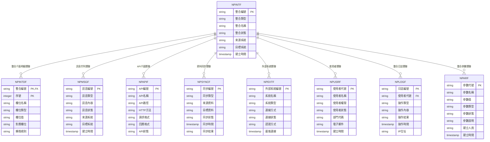

# 銷貨模組 程式功能規格書 - 整合介面

## 文件基本資訊

| 項目 | 說明 |
|------|------|
| **文件名稱** | 銷貨模組程式功能規格書 - 整合介面 |
| **模組代號** | NP |
| **版本** | v1.0 |
| **建立日期** | 2024年12月21日 |
| **建立人員** | 系統分析師 |
| **審核人員** | 專案經理 |
| **文件狀態** | 初稿 |
| **最後更新** | 2024年12月21日 |

---

## 目錄

1. [基本資料](#基本資料)
2. [檔案架構與關聯圖](#檔案架構與關聯圖)
3. [檔案名稱與欄位規格](#檔案名稱與欄位規格)
4. [輸出/入螢幕布局與說明](#輸出入螢幕布局與說明)
5. [處理流程程序說明](#處理流程程序說明)
6. [子程序處理邏輯說明](#子程序處理邏輯說明)
7. [錯誤處理程序說明與訊息清冊](#錯誤處理程序說明與訊息清冊)
8. [備註](#備註)

---

## 基本資料

### 1.1 模組概述

#### 1.1.1 模組功能說明
銷貨模組的整合介面功能主要負責處理銷貨系統與其他模組、外部系統、第三方服務之間的資料交換、API介面、訊息傳遞、資料同步等。此功能為企業管理系統提供統一的整合平台，確保各模組間的資料一致性和業務流程的順暢運行，支援系統的現代化轉型和數位化整合。

#### 1.1.2 模組特色
- **統一API介面**：提供標準化的RESTful API介面，支援多種資料格式
- **多模組整合**：與總帳、採購、庫存、生產、財務等模組無縫整合
- **外部系統連接**：支援與ERP、CRM、SCM等外部系統的資料交換
- **即時資料同步**：確保各系統間的資料即時同步和一致性
- **訊息佇列處理**：使用訊息佇列機制處理非同步資料交換
- **安全認證機制**：提供JWT Token認證和角色基礎的存取控制

#### 1.1.3 適用範圍
適用於銷貨系統的整合介面作業，包括API介面管理、資料交換處理、訊息傳遞、資料同步、外部系統整合、第三方服務連接、資料格式轉換、錯誤處理等各類整合相關業務功能。

### 1.2 技術架構

#### 1.2.1 開發技術
- **程式語言**：RPG、CL、SQL、C#、JavaScript
- **資料庫**：DB2 for i (IBM i)、SQL Server
- **開發工具**：IBM i 開發環境、Visual Studio、.NET Core
- **整合技術**：RESTful API、SOAP、Message Queue、WebSocket
- **部署環境**：IBM i 7.4、Windows Server、Docker

#### 1.2.2 系統需求
- **硬體需求**：IBM i 伺服器、API伺服器、訊息佇列伺服器
- **軟體需求**：IBM i 作業系統、DB2 for i、.NET Core、Redis、RabbitMQ
- **網路需求**：企業內部網路連線、外部系統網路連線、API存取權限

---

## 檔案架構與關聯圖

### 2.1 資料庫檔案架構

#### 2.1.1 主要資料表


#### 2.1.2 檔案關聯說明
- **NPINTF (整合介面檔)**：儲存整合介面的基本資料和設定資訊
- **NPINTDF (整合介面明細檔)**：儲存整合介面的詳細欄位對應和轉換規則
- **NPMSGF (訊息佇列檔)**：儲存系統間訊息傳遞的佇列資料
- **NPAPIF (API介面檔)**：儲存API介面的設定和狀態資訊
- **NPSYNCF (資料同步檔)**：儲存資料同步的記錄和狀態
- **NPEXTF (外部系統檔)**：儲存外部系統的連線和認證資訊
- **NPUSRF (使用者檔)**：儲存使用者的基本資料和權限資訊
- **NPLOGF (整合日誌檔)**：儲存整合操作的日誌記錄
- **NPARF (整合參數檔)**：儲存整合相關的系統參數

### 2.2 系統架構圖

#### 2.2.1 整合介面系統架構


---

## 檔案名稱與欄位規格

### 3.1 主要檔案規格

#### 3.1.1 NPINTF - 整合介面檔

| 欄位代號 | 欄位名稱 | 位置 | 長度 | 型態 | 屬性 | 檢核說明 |
|----------|----------|------|------|------|------|----------|
| INT01 | 公司代碼 | 1-3 | 3 | A | PK | 必填，公司唯一識別碼 |
| INT02 | 整合編號 | 4-15 | 12 | A | PK | 必填，整合介面唯一識別碼 |
| INT03 | 整合類型 | 16-17 | 2 | A | M | 必填，值：01-API介面、02-資料同步、03-訊息傳遞、04-檔案交換、05-資料庫連線 |
| INT04 | 整合名稱 | 18-47 | 30 | A | M | 必填，整合介面的中文名稱 |
| INT05 | 整合狀態 | 48-48 | 1 | A | M | 必填，值：A-啟用、I-停用、M-維護中 |
| INT06 | 來源系統 | 49-58 | 10 | A | M | 必填，資料來源系統的代號 |
| INT07 | 目標系統 | 59-68 | 10 | A | M | 必填，資料目標系統的代號 |
| INT08 | 整合頻率 | 69-70 | 2 | A | M | 必填，值：01-即時、02-每分鐘、03-每小時、04-每日、05-每週、06-手動 |
| INT09 | 資料格式 | 71-72 | 2 | A | M | 必填，值：01-JSON、02-XML、03-CSV、04-固定長度、05-分隔符號 |
| INT10 | 認證方式 | 73-74 | 2 | A | M | 必填，值：01-無認證、02-基本認證、03-JWT Token、04-OAuth2、05-API Key |
| INT11 | 連線逾時 | 75-77 | 3 | I | O | 選填，連線逾時時間（秒） |
| INT12 | 重試次數 | 78-79 | 2 | I | O | 選填，連線失敗時的重試次數 |
| INT13 | 建立人員 | 80-84 | 5 | A | M | 必填，建立整合介面的使用者代號 |
| INT14 | 建立時間 | 85-92 | 8 | T | M | 必填，系統自動產生 |
| INT15 | 修改人員 | 93-97 | 5 | A | O | 選填，最後修改整合介面的使用者代號 |
| INT16 | 修改時間 | 98-105 | 8 | T | O | 選填，最後修改時間 |
| INT17 | 備註 | 106-145 | 40 | A | O | 選填，最多40字元 |

#### 3.1.2 NPINTDF - 整合介面明細檔

| 欄位代號 | 欄位名稱 | 位置 | 長度 | 型態 | 屬性 | 檢核說明 |
|----------|----------|------|------|------|------|----------|
| INTD01 | 整合編號 | 1-12 | 12 | A | PK,FK | 必填，參照NPINTF.INT02 |
| INTD02 | 序號 | 13-15 | 3 | I | PK | 必填，1-999 |
| INTD03 | 欄位名稱 | 16-45 | 30 | A | M | 必填，來源系統的欄位名稱 |
| INTD04 | 欄位類型 | 46-47 | 2 | A | M | 必填，值：01-字串、02-數值、03-日期、04-時間、05-布林、06-物件 |
| INTD05 | 欄位值 | 48-97 | 50 | A | O | 選填，欄位的預設值或常數值 |
| INTD06 | 對應欄位 | 98-127 | 30 | A | M | 必填，目標系統的對應欄位名稱 |
| INTD07 | 轉換規則 | 128-177 | 50 | A | O | 選填，資料轉換的規則或公式 |
| INTD08 | 是否必填 | 178-178 | 1 | A | M | 必填，值：Y-是、N-否 |
| INTD09 | 驗證規則 | 179-228 | 50 | A | O | 選填，資料驗證的規則 |
| INTD10 | 排序順序 | 229-231 | 3 | I | O | 選填，欄位的排序順序 |
| INTD11 | 備註 | 232-261 | 30 | A | O | 選填，最多30字元 |

#### 3.1.3 NPMSGF - 訊息佇列檔

| 欄位代號 | 欄位名稱 | 位置 | 長度 | 型態 | 屬性 | 檢核說明 |
|----------|----------|------|------|------|------|----------|
| MSG01 | 訊息編號 | 1-15 | 15 | A | PK | 必填，訊息唯一識別碼 |
| MSG02 | 公司代碼 | 16-18 | 3 | A | M | 必填，公司代碼 |
| MSG03 | 訊息類型 | 19-20 | 2 | A | M | 必填，值：01-新增、02-修改、03-刪除、04-查詢、05-通知、06-錯誤 |
| MSG04 | 訊息內容 | 21-70 | 50 | A | M | 必填，訊息的具體內容 |
| MSG05 | 訊息狀態 | 71-71 | 1 | A | M | 必填，值：P-待處理、P-處理中、C-完成、E-錯誤、T-逾時 |
| MSG06 | 來源系統 | 72-81 | 10 | A | M | 必填，訊息來源系統的代號 |
| MSG07 | 目標系統 | 82-91 | 10 | A | M | 必填，訊息目標系統的代號 |
| MSG08 | 優先等級 | 92-92 | 1 | A | M | 必填，值：1-高、2-中、3-低 |
| MSG09 | 重試次數 | 93-94 | 2 | I | O | 選填，訊息處理失敗時的重試次數 |
| MSG10 | 建立時間 | 95-102 | 8 | T | M | 必填，系統自動產生 |
| MSG11 | 處理時間 | 103-110 | 8 | T | O | 選填，訊息處理完成的時間 |
| MSG12 | 錯誤訊息 | 111-160 | 50 | A | O | 選填，處理失敗時的錯誤訊息 |
| MSG13 | 備註 | 161-190 | 30 | A | O | 選填，最多30字元 |

#### 3.1.4 NPAPIF - API介面檔

| 欄位代號 | 欄位名稱 | 位置 | 長度 | 型態 | 屬性 | 檢核說明 |
|----------|----------|------|------|------|------|----------|
| API01 | 公司代碼 | 1-3 | 3 | A | PK | 必填，公司唯一識別碼 |
| API02 | API編號 | 4-15 | 12 | A | PK | 必填，API介面唯一識別碼 |
| API03 | API名稱 | 16-45 | 30 | A | M | 必填，API介面的中文名稱 |
| API04 | API路徑 | 46-95 | 50 | A | M | 必填，API的URL路徑 |
| API05 | HTTP方法 | 96-97 | 2 | A | M | 必填，值：GET、POST、PUT、DELETE、PATCH |
| API06 | 請求格式 | 98-99 | 2 | A | M | 必填，值：01-JSON、02-XML、03-Form、04-Query String |
| API07 | 回應格式 | 100-101 | 2 | A | M | 必填，值：01-JSON、02-XML、03-CSV、04-Text |
| API08 | API狀態 | 102-102 | 1 | A | M | 必填，值：A-啟用、I-停用、M-維護中 |
| API09 | 版本號碼 | 103-112 | 10 | A | M | 必填，API的版本號碼 |
| API10 | 存取權限 | 113-117 | 5 | A | M | 必填，可存取此API的權限等級 |
| API11 | 速率限制 | 118-127 | 10 | A | O | 選填，API的速率限制（次/分鐘） |
| API12 | 建立人員 | 128-132 | 5 | A | M | 必填，建立API介面的使用者代號 |
| API13 | 建立時間 | 133-140 | 8 | T | M | 必填，系統自動產生 |
| API14 | 修改人員 | 141-145 | 5 | A | O | 選填，最後修改API介面的使用者代號 |
| API15 | 修改時間 | 146-153 | 8 | T | O | 選填，最後修改時間 |
| API16 | 備註 | 154-193 | 40 | A | O | 選填，最多40字元 |

#### 3.1.5 NPSYNCF - 資料同步檔

| 欄位代號 | 欄位名稱 | 位置 | 長度 | 型態 | 屬性 | 檢核說明 |
|----------|----------|------|------|------|------|----------|
| SYNC01 | 同步編號 | 1-15 | 15 | A | PK | 必填，同步記錄唯一識別碼 |
| SYNC02 | 公司代碼 | 16-18 | 3 | A | M | 必填，公司代碼 |
| SYNC03 | 同步類型 | 19-20 | 2 | A | M | 必填，值：01-客戶資料、02-訂單資料、03-出貨資料、04-應收帳款、05-產品資料 |
| SYNC04 | 來源系統 | 21-30 | 10 | A | M | 必填，資料來源系統的代號 |
| SYNC05 | 目標系統 | 31-40 | 10 | A | M | 必填，資料目標系統的代號 |
| SYNC06 | 同步狀態 | 41-41 | 1 | A | M | 必填，值：P-待同步、S-同步中、C-同步完成、E-同步失敗 |
| SYNC07 | 同步時間 | 42-49 | 8 | T | M | 必填，同步執行的時間 |
| SYNC08 | 同步結果 | 50-51 | 2 | A | M | 必填，值：01-成功、02-部分成功、03-失敗 |
| SYNC09 | 處理筆數 | 52-59 | 8 | I | O | 選填，處理的資料筆數 |
| SYNC10 | 成功筆數 | 60-67 | 8 | I | O | 選填，成功同步的資料筆數 |
| SYNC11 | 失敗筆數 | 68-75 | 8 | I | O | 選填，同步失敗的資料筆數 |
| SYNC12 | 錯誤訊息 | 76-125 | 50 | A | O | 選填，同步失敗時的錯誤訊息 |
| SYNC13 | 備註 | 126-155 | 30 | A | O | 選填，最多30字元 |

### 3.2 索引資料

#### 3.2.1 主要索引
- **NPINTF 主鍵索引**：INT01 + INT02 (公司代碼 + 整合編號)
- **NPINTF 整合類型索引**：INT03 (整合類型)
- **NPINTF 整合狀態索引**：INT05 (整合狀態)
- **NPINTF 來源系統索引**：INT06 (來源系統)
- **NPINTF 目標系統索引**：INT07 (目標系統)

#### 3.2.2 次要索引
- **NPINTDF 主鍵索引**：INTD01 + INTD02 (整合編號 + 序號)
- **NPINTDF 整合編號索引**：INTD01 (整合編號)
- **NPMSGF 主鍵索引**：MSG01 (訊息編號)
- **NPMSGF 訊息狀態索引**：MSG05 (訊息狀態)
- **NPMSGF 來源系統索引**：MSG06 (來源系統)
- **NPAPIF 主鍵索引**：API01 + API02 (公司代碼 + API編號)
- **NPAPIF API狀態索引**：API08 (API狀態)
- **NPSYNCF 主鍵索引**：SYNC01 (同步編號)
- **NPSYNCF 同步類型索引**：SYNC03 (同步類型)

---

## 輸出/入螢幕布局與說明

### 4.1 整合介面管理主畫面

#### 4.1.1 畫面布局
```
┌─────────────────────────────────────────────────────────────┐
│                    整合介面管理系統                        │
├─────────────────────────────────────────────────────────────┤
│ 功能選項：                                                  │
│  [1]API介面管理  [2]資料同步管理  [3]訊息佇列管理          │
│  [4]外部系統管理  [5]整合監控  [6]日誌查詢  [7]離開系統   │
├─────────────────────────────────────────────────────────────┤
│ 系統狀態：                                                  │
│  整合介面總數：[25] 啟用中：[20] 停用中：[3] 維護中：[2]  │
│  今日API呼叫：[1,234] 今日同步次數：[89] 今日訊息數：[456] │
│  最後更新：[2024/12/21 14:30:00] 更新人員：[ADMIN]        │
├─────────────────────────────────────────────────────────────┤
│ 快速功能：                                                  │
│  [新增API] [啟動同步] [檢查連線] [清理日誌]                │
├─────────────────────────────────────────────────────────────┤
│ 功能鍵：F1=說明  F3=離開  F4=API管理  F6=同步管理  F12=取消│
└─────────────────────────────────────────────────────────────┘
```

#### 4.1.2 畫面說明
- **功能選項區**：提供整合介面管理的主要功能選項
- **系統狀態區**：顯示當前整合介面的狀態和統計資訊
- **快速功能區**：提供常用的快速操作功能
- **功能鍵區**：說明可使用的功能鍵

### 4.2 API介面管理畫面

#### 4.2.1 畫面布局
```
┌─────────────────────────────────────────────────────────────┐
│                       API介面管理                          │
├─────────────────────────────────────────────────────────────┤
│ 查詢條件：                                                  │
│  API名稱：[        ] API狀態：[全部 ▼] HTTP方法：[全部 ▼]   │
│  版本號碼：[    ] 存取權限：[全部 ▼] [查詢] [清除]          │
├─────────────────────────────────────────────────────────────┤
│ API介面清單：                                                │
│ ┌─────┬──────────┬──────────┬──────────┬──────────┬────────┐ │
│ │序號 │API編號   │API名稱   │HTTP方法  │API狀態   │版本    │ │
│ ├─────┼──────────┼──────────┼──────────┼──────────┼────────┤ │
│ │  1  │API001    │客戶查詢  │GET       │啟用      │v1.0    │ │
│ │  2  │API002    │訂單新增  │POST      │啟用      │v1.0    │ │
│ └─────┴──────────┴──────────┴──────────┴──────────┴────────┘ │
├─────────────────────────────────────────────────────────────┤
│ 操作：[新增API] [修改API] [停用API] [測試API]              │
│ 功能鍵：F1=說明  F3=離開  F4=新增  F6=修改  F8=停用  F12=取消│
└─────────────────────────────────────────────────────────────┘
```

---

## 處理流程程序說明

### 5.1 API介面處理流程

#### 5.1.1 主要處理流程


#### 5.1.2 資料驗證規則
1. **API請求驗證**：HTTP方法必須正確，請求格式必須符合規範
2. **認證驗證**：JWT Token必須有效且未過期
3. **權限驗證**：使用者必須具有存取該API的權限
4. **業務邏輯驗證**：請求參數必須符合業務規則

### 5.2 資料同步處理流程

#### 5.2.1 主要處理流程


### 5.3 訊息佇列處理流程

#### 5.3.1 主要處理流程


---

## 子程序處理邏輯說明

### 6.1 JWT Token驗證子程序

#### 6.1.1 Token驗證邏輯


#### 6.1.2 Token安全規則
1. **Token有效期**：Access Token有效期為1小時，Refresh Token有效期為7天
2. **Token簽名**：使用強加密演算法進行簽名驗證
3. **Token黑名單**：已登出的Token會加入黑名單，無法再次使用

### 6.2 資料格式轉換子程序

#### 6.2.1 格式轉換邏輯


#### 6.2.2 支援的資料格式
1. **JSON格式**：支援巢狀物件和陣列結構
2. **XML格式**：支援複雜的標籤結構和屬性
3. **CSV格式**：支援表格資料的匯入匯出
4. **固定長度格式**：支援固定欄位長度的資料
5. **分隔符號格式**：支援自訂分隔符號的資料

### 6.3 連線池管理子程序

#### 6.3.1 連線池邏輯


#### 6.3.2 連線池設定
1. **最小連線數**：保持最少5個連線
2. **最大連線數**：最多允許50個連線
3. **連線逾時**：連線閒置超過30分鐘自動關閉
4. **連線重試**：連線失敗時最多重試3次

### 6.4 錯誤處理與重試子程序

#### 6.4.1 錯誤處理邏輯


---

## 錯誤處理程序說明與訊息清冊

### 7.1 錯誤處理程序

#### 7.1.1 錯誤處理流程


### 7.2 錯誤訊息清冊

#### 7.2.1 API介面錯誤訊息

| 錯誤代碼 | 錯誤訊息 | 錯誤原因 | 解決方法 |
|----------|----------|----------|----------|
| **NP701** | API路徑不存在 | 請求的API路徑在系統中不存在 | 請檢查API路徑，或聯繫系統管理員確認API設定 |
| **NP702** | HTTP方法不支援 | 使用的HTTP方法不被該API支援 | 請使用正確的HTTP方法，如GET、POST、PUT、DELETE |
| **NP703** | 請求格式錯誤 | 請求的資料格式不符合API要求 | 請檢查請求格式，確保符合API的資料格式規範 |
| **NP704** | 回應格式不支援 | 請求的回應格式不被API支援 | 請選擇支援的回應格式，如JSON、XML、CSV |
| **NP705** | API版本不支援 | 請求的API版本不被系統支援 | 請使用支援的API版本，或聯繫系統管理員升級API |

#### 7.2.2 認證與權限錯誤訊息

| 錯誤代碼 | 錯誤訊息 | 錯誤原因 | 解決方法 |
|----------|----------|----------|----------|
| **NP801** | Token無效 | 提供的JWT Token無效或已損壞 | 請重新登入取得有效的Token |
| **NP802** | Token已過期 | 提供的JWT Token已超過有效期 | 請使用Refresh Token更新Access Token |
| **NP803** | 權限不足 | 使用者沒有存取該API的權限 | 請聯繫系統管理員檢查使用者權限設定 |
| **NP804** | 角色不符 | 使用者的角色不符合API存取要求 | 請聯繫系統管理員調整使用者角色 |
| **NP805** | 存取被拒絕 | 系統拒絕該使用者的存取請求 | 請檢查使用者狀態，或聯繫系統管理員 |

#### 7.2.3 資料同步錯誤訊息

| 錯誤代碼 | 錯誤訊息 | 錯誤原因 | 解決方法 |
|----------|----------|----------|----------|
| **NP901** | 連線失敗 | 無法連接到目標系統 | 請檢查網路連線，或聯繫系統管理員檢查系統連線狀態 |
| **NP902** | 認證失敗 | 目標系統認證失敗 | 請檢查認證資訊，或聯繫系統管理員更新認證設定 |
| **NP903** | 資料格式錯誤 | 來源資料格式不符合目標系統要求 | 請檢查資料格式，或聯繫系統管理員調整資料轉換規則 |
| **NP904** | 同步逾時 | 資料同步操作超過時間限制 | 請檢查系統效能，或聯繫系統管理員調整同步設定 |
| **NP905** | 目標系統忙碌 | 目標系統目前無法處理同步請求 | 請稍後再試，或聯繫系統管理員檢查目標系統狀態 |

### 7.3 錯誤處理建議

#### 7.3.1 開發者操作建議
1. **檢查API文件**：使用API前請仔細閱讀API文件，了解正確的使用方法
2. **驗證請求格式**：確保請求的資料格式和參數符合API要求
3. **檢查認證狀態**：確保使用有效的認證Token，並注意Token的有效期
4. **監控錯誤日誌**：定期檢查錯誤日誌，及時發現和處理問題

#### 7.3.2 系統管理建議
1. **定期檢查連線狀態**：定期檢查與外部系統的連線狀態
2. **監控API效能**：定期監控API的響應時間和錯誤率
3. **更新認證資訊**：定期更新與外部系統的認證資訊
4. **備份整合設定**：定期備份整合介面的設定和規則

---

## 備註

### 8.1 開發注意事項

#### 8.1.1 程式開發注意事項
1. **API設計原則**：遵循RESTful API設計原則，確保API的一致性和易用性
2. **安全性考量**：實作適當的認證和授權機制，保護API的安全性
3. **效能優化**：使用連線池、快取等技術優化API效能
4. **錯誤處理**：提供完整的錯誤處理機制，確保系統的穩定性
5. **日誌記錄**：記錄詳細的操作日誌，便於問題診斷和系統監控

#### 8.1.2 測試注意事項
1. **單元測試**：每個API端點都必須進行單元測試
2. **整合測試**：必須測試與其他系統的整合情況
3. **效能測試**：必須測試API的響應時間和並發處理能力
4. **安全性測試**：必須測試API的認證和授權機制
5. **錯誤處理測試**：必須測試各種錯誤情況的處理機制

### 8.2 維護注意事項

#### 8.2.1 日常維護注意事項
1. **監控系統狀態**：定期監控整合介面的運行狀態和效能表現
2. **檢查連線狀態**：定期檢查與外部系統的連線狀態
3. **更新認證資訊**：定期更新與外部系統的認證資訊
4. **清理日誌資料**：定期清理過期的日誌資料，釋放儲存空間
5. **備份設定資料**：定期備份整合介面的設定和規則

#### 8.2.2 版本更新注意事項
1. **相容性檢查**：更新前必須檢查與現有系統的相容性
2. **API版本管理**：實作API版本管理機制，確保向後相容性
3. **漸進式更新**：採用漸進式更新策略，降低更新風險
4. **回滾計畫**：制定詳細的回滾計畫，以應對更新失敗
5. **使用者通知**：提前通知使用者API更新計畫

### 8.3 未來擴充建議

#### 8.3.1 功能擴充建議
1. **GraphQL支援**：考慮增加GraphQL支援，提供更靈活的資料查詢能力
2. **WebSocket支援**：考慮增加WebSocket支援，提供即時資料推送功能
3. **事件驅動架構**：考慮採用事件驅動架構，提高系統的擴展性
4. **微服務架構**：考慮採用微服務架構，提高系統的模組化程度
5. **API網關**：考慮實作API網關，統一管理所有API的存取和監控

#### 8.3.2 技術改進建議
1. **容器化部署**：考慮使用Docker等容器技術進行系統部署
2. **雲端原生**：考慮採用雲端原生技術，提高系統的彈性和可擴展性
3. **自動化部署**：考慮實作CI/CD流程，自動化系統的部署和測試
4. **監控告警**：考慮實作完整的監控告警系統，及時發現和處理問題
5. **災難恢復**：考慮實作災難恢復機制，確保系統的高可用性

---

## 附錄

### A.1 相關文件清單
- 銷貨模組程式功能規格書 - 銷貨管理
- 銷貨模組程式功能規格書 - 客戶管理
- 銷貨模組程式功能規格書 - 訂單管理
- 銷貨模組程式功能規格書 - 出貨管理
- 銷貨模組程式功能規格書 - 應收帳款管理
- 銷貨模組程式功能規格書 - 價格管理
- 銷貨模組程式功能規格書 - 報表分析
- 銷貨模組程式功能規格書 - 系統管理
- 銷貨模組業務邏輯分析與API設計
- 銷貨模組操作手冊 - 整合介面

### A.2 修訂記錄

| 版本 | 修訂日期 | 修訂人員 | 修訂內容 | 修訂原因 |
|------|----------|----------|----------|----------|
| v1.0 | 2024/12/21 | 系統分析師 | 初始版本建立 | 新功能開發 |

### A.3 聯絡資訊
- **專案經理**：[專案經理姓名]
- **系統分析師**：[系統分析師姓名]
- **技術支援**：[技術支援聯絡方式]
- **專案信箱**：[專案信箱地址]
