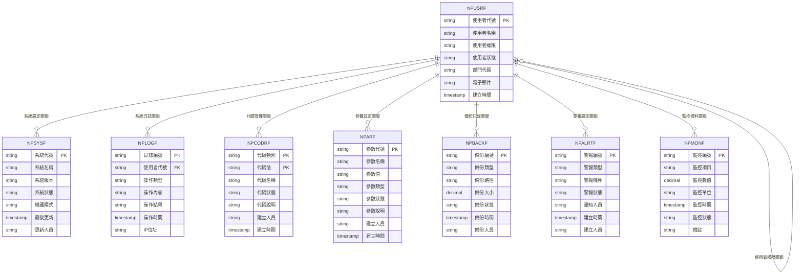
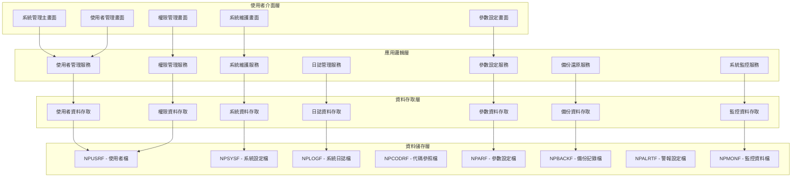
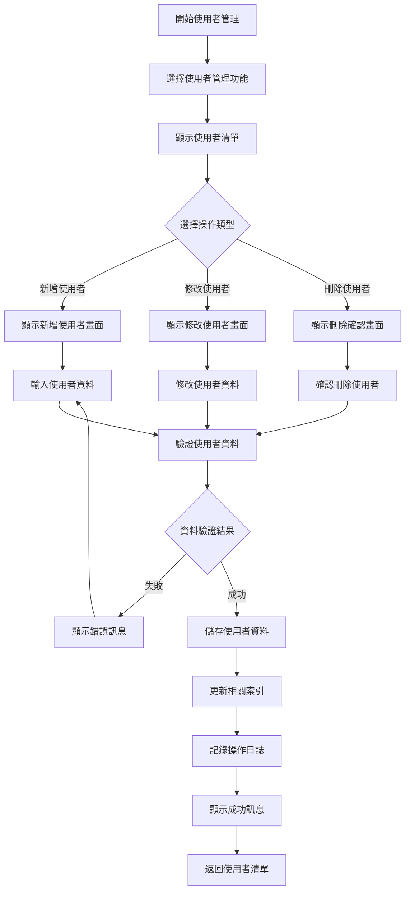
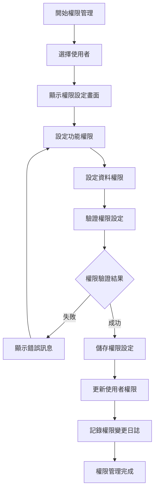
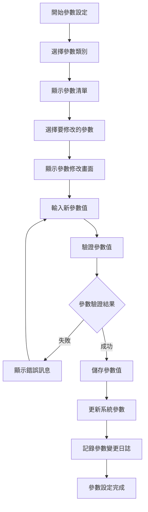
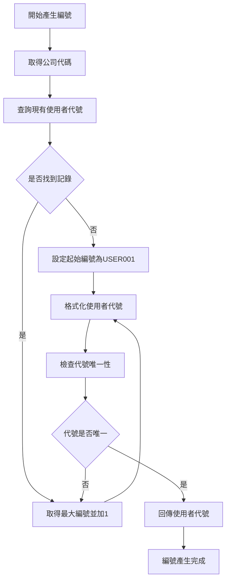
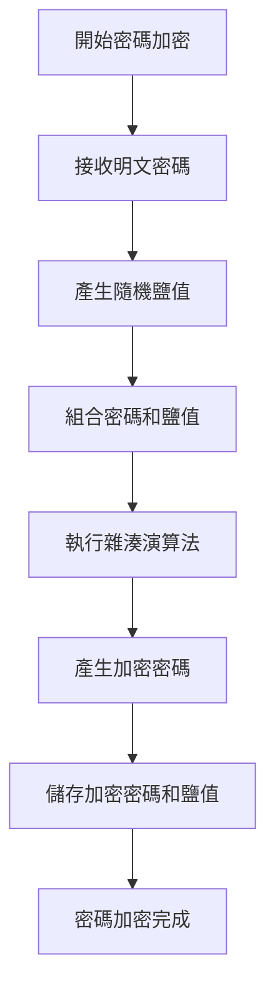
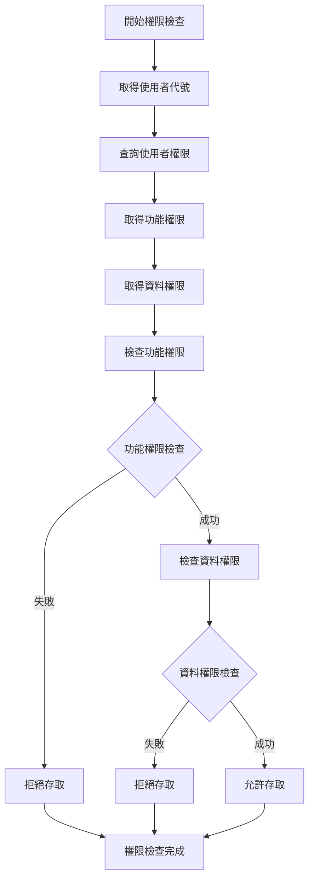
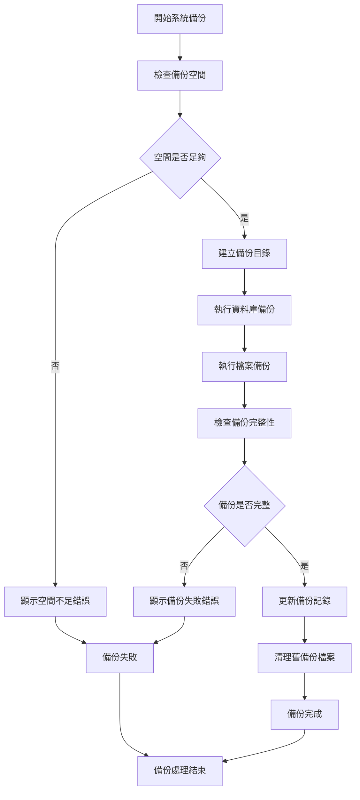
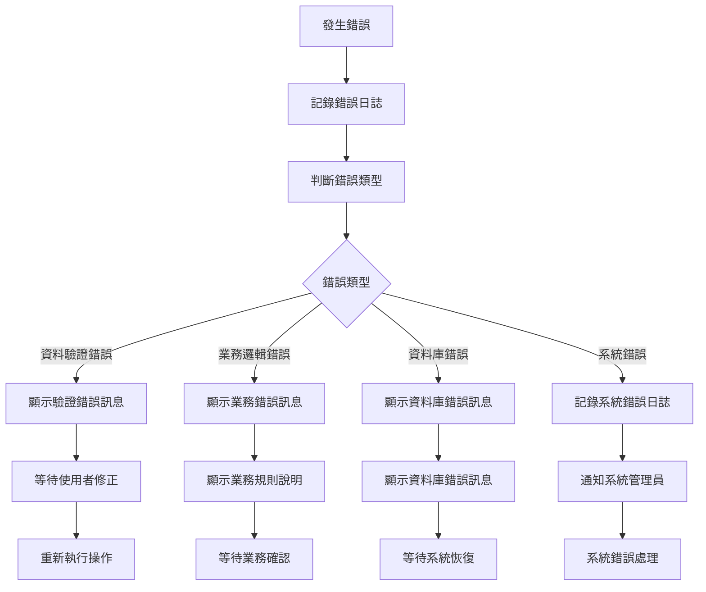

# 銷貨模組 程式功能規格書 - 系統管理

## 文件基本資訊

| 項目 | 說明 |
|------|------|
| **文件名稱** | 銷貨模組程式功能規格書 - 系統管理 |
| **模組代號** | NP |
| **版本** | v1.0 |
| **建立日期** | 2024年12月21日 |
| **建立人員** | 系統分析師 |
| **審核人員** | 專案經理 |
| **文件狀態** | 初稿 |
| **最後更新** | 2024年12月21日 |

---

## 目錄

1. [基本資料](#基本資料)
2. [檔案架構與關聯圖](#檔案架構與關聯圖)
3. [檔案名稱與欄位規格](#檔案名稱與欄位規格)
4. [輸出/入螢幕布局與說明](#輸出入螢幕布局與說明)
5. [處理流程程序說明](#處理流程程序說明)
6. [子程序處理邏輯說明](#子程序處理邏輯說明)
7. [錯誤處理程序說明與訊息清冊](#錯誤處理程序說明與訊息清冊)
8. [備註](#備註)

---

## 基本資料

### 1.1 模組概述

#### 1.1.1 模組功能說明
銷貨模組的系統管理功能主要負責管理銷貨系統的各種系統設定、參數配置、權限管理、使用者管理、代碼管理、系統維護、日誌管理、備份還原等。此功能為系統管理員提供完整的系統管理工具，確保銷貨系統的穩定運行、安全性和可維護性，支援系統的日常運維和故障排除。

#### 1.1.2 模組特色
- **集中化系統管理**：提供統一的系統管理介面，集中管理所有系統功能
- **多層級權限控制**：支援角色基礎的權限管理，確保系統安全性
- **參數化配置管理**：支援系統參數的動態配置，無需重新啟動系統
- **完整的日誌追蹤**：記錄所有系統操作和錯誤，便於問題診斷
- **自動化維護功能**：支援定時備份、清理、檢查等自動化維護作業
- **系統監控與警報**：即時監控系統狀態，異常時自動發送警報

#### 1.1.3 適用範圍
適用於銷貨系統的系統管理作業，包括使用者管理、權限管理、參數設定、代碼管理、系統維護、日誌管理、備份還原、系統監控、效能調校、故障排除等各類系統管理相關業務功能。

### 1.2 技術架構

#### 1.2.1 開發技術
- **程式語言**：RPG、CL、SQL
- **資料庫**：DB2 for i (IBM i)
- **開發工具**：IBM i 開發環境
- **系統管理工具**：IBM i 系統管理工具
- **部署環境**：IBM i 7.4

#### 1.2.2 系統需求
- **硬體需求**：IBM i 伺服器
- **軟體需求**：IBM i 作業系統、DB2 for i、系統管理工具
- **網路需求**：企業內部網路連線、管理員存取權限

---

## 檔案架構與關聯圖

### 2.1 資料庫檔案架構

#### 2.1.1 主要資料表


#### 2.1.2 檔案關聯說明
- **NPUSRF (使用者檔)**：儲存使用者的基本資料和權限資訊
- **NPSYSF (系統設定檔)**：儲存系統的基本設定和狀態資訊
- **NPLOGF (系統日誌檔)**：儲存系統操作和錯誤的日誌記錄
- **NPCODRF (代碼參照檔)**：儲存系統使用的各種代碼對照資料
- **NPARF (參數設定檔)**：儲存系統的各種參數設定
- **NPBACKF (備份記錄檔)**：儲存系統備份的記錄和狀態
- **NPALRTF (警報設定檔)**：儲存系統警報的設定和條件
- **NPMONF (監控資料檔)**：儲存系統監控的資料和狀態

### 2.2 系統架構圖

#### 2.2.1 系統管理架構


---

## 檔案名稱與欄位規格

### 3.1 主要檔案規格

#### 3.1.1 NPUSRF - 使用者檔

| 欄位代號 | 欄位名稱 | 位置 | 長度 | 型態 | 屬性 | 檢核說明 |
|----------|----------|------|------|------|------|----------|
| USR01 | 公司代碼 | 1-3 | 3 | A | PK | 必填，公司唯一識別碼 |
| USR02 | 使用者代號 | 4-8 | 5 | A | PK | 必填，使用者唯一識別碼 |
| USR03 | 使用者名稱 | 9-38 | 30 | A | M | 必填，使用者的中文姓名 |
| USR04 | 使用者帳號 | 39-48 | 10 | A | M | 必填，登入用的帳號 |
| USR05 | 使用者密碼 | 49-68 | 20 | A | M | 必填，登入用的密碼（加密） |
| USR06 | 使用者權限 | 69-73 | 5 | A | M | 必填，使用者的權限等級 |
| USR07 | 使用者狀態 | 74-74 | 1 | A | M | 必填，值：A-啟用、I-停用、L-鎖定 |
| USR08 | 部門代碼 | 75-77 | 3 | A | O | 選填，使用者所屬部門代碼 |
| USR09 | 電子郵件 | 78-107 | 30 | A | O | 選填，使用者的電子郵件地址 |
| USR10 | 電話號碼 | 108-127 | 20 | A | O | 選填，使用者的聯絡電話 |
| USR11 | 最後登入時間 | 128-135 | 8 | T | O | 選填，使用者最後登入的時間 |
| USR12 | 登入失敗次數 | 136-138 | 3 | I | O | 選填，登入失敗的次數 |
| USR13 | 密碼到期日期 | 139-146 | 8 | D | O | 選填，密碼到期的日期 |
| USR14 | 建立人員 | 147-151 | 5 | A | M | 必填，建立使用者的管理員代號 |
| USR15 | 建立時間 | 152-159 | 8 | T | M | 必填，系統自動產生 |
| USR16 | 修改人員 | 160-164 | 5 | A | O | 選填，最後修改使用者的管理員代號 |
| USR17 | 修改時間 | 165-172 | 8 | T | O | 選填，最後修改時間 |
| USR18 | 備註 | 173-212 | 40 | A | O | 選填，最多40字元 |

#### 3.1.2 NPSYSF - 系統設定檔

| 欄位代號 | 欄位名稱 | 位置 | 長度 | 型態 | 屬性 | 檢核說明 |
|----------|----------|------|------|------|------|----------|
| SYS01 | 公司代碼 | 1-3 | 3 | A | PK | 必填，公司唯一識別碼 |
| SYS02 | 系統代號 | 4-6 | 3 | A | PK | 必填，系統唯一識別碼 |
| SYS03 | 系統名稱 | 7-36 | 30 | A | M | 必填，系統的中文名稱 |
| SYS04 | 系統版本 | 37-46 | 10 | A | M | 必填，系統的版本號碼 |
| SYS05 | 系統狀態 | 47-47 | 1 | A | M | 必填，值：A-正常、M-維護、E-錯誤 |
| SYS06 | 維護模式 | 48-48 | 1 | A | O | 選填，值：Y-是、N-否 |
| SYS07 | 維護開始時間 | 49-56 | 8 | T | O | 選填，維護開始的時間 |
| SYS08 | 維護結束時間 | 57-64 | 8 | T | O | 選填，維護結束的時間 |
| SYS09 | 維護原因 | 65-104 | 40 | A | O | 選填，維護的原因說明 |
| SYS10 | 系統參數 | 105-154 | 50 | A | O | 選填，系統的參數設定 |
| SYS11 | 最後更新 | 155-162 | 8 | T | M | 必填，系統自動產生 |
| SYS12 | 更新人員 | 163-167 | 5 | A | M | 必填，執行更新的管理員代號 |
| SYS13 | 備註 | 168-207 | 40 | A | O | 選填，最多40字元 |

#### 3.1.3 NPLOGF - 系統日誌檔

| 欄位代號 | 欄位名稱 | 位置 | 長度 | 型態 | 屬性 | 檢核說明 |
|----------|----------|------|------|------|------|----------|
| LOG01 | 日誌編號 | 1-15 | 15 | A | PK | 必填，日誌唯一識別碼 |
| LOG02 | 公司代碼 | 16-18 | 3 | A | M | 必填，公司代碼 |
| LOG03 | 使用者代號 | 19-23 | 5 | A | FK | 必填，參照使用者檔 |
| LOG04 | 操作類型 | 24-25 | 2 | A | M | 必填，值：01-登入、02-登出、03-新增、04-修改、05-刪除、06-查詢、07-匯出、08-備份、09-還原、10-系統錯誤 |
| LOG05 | 操作內容 | 26-75 | 50 | A | M | 必填，操作的具體內容 |
| LOG06 | 操作結果 | 76-76 | 1 | A | M | 必填，值：S-成功、F-失敗、W-警告 |
| LOG07 | 操作時間 | 77-84 | 8 | T | M | 必填，操作執行的時間 |
| LOG08 | IP位址 | 85-104 | 20 | A | O | 選填，使用者登入的IP位址 |
| LOG09 | 錯誤訊息 | 105-154 | 50 | A | O | 選填，操作失敗時的錯誤訊息 |
| LOG10 | 備註 | 155-184 | 30 | A | O | 選填，最多30字元 |

#### 3.1.4 NPCODRF - 代碼參照檔

| 欄位代號 | 欄位名稱 | 位置 | 長度 | 型態 | 屬性 | 檢核說明 |
|----------|----------|------|------|------|------|----------|
| COD01 | 公司代碼 | 1-3 | 3 | A | PK | 必填，公司唯一識別碼 |
| COD02 | 代碼類別 | 4-5 | 2 | A | PK | 必填，代碼的分類 |
| COD03 | 代碼值 | 6-10 | 5 | A | PK | 必填，代碼的具體值 |
| COD04 | 代碼名稱 | 11-40 | 30 | A | M | 必填，代碼的中文名稱 |
| COD05 | 代碼狀態 | 41-41 | 1 | A | M | 必填，值：A-啟用、I-停用 |
| COD06 | 代碼說明 | 42-91 | 50 | A | O | 選填，代碼的詳細說明 |
| COD07 | 排序順序 | 92-94 | 3 | I | O | 選填，代碼的顯示順序 |
| COD08 | 建立人員 | 95-99 | 5 | A | M | 必填，建立代碼的管理員代號 |
| COD09 | 建立時間 | 100-107 | 8 | T | M | 必填，系統自動產生 |
| COD10 | 修改人員 | 108-112 | 5 | A | O | 選填，最後修改代碼的管理員代號 |
| COD11 | 修改時間 | 113-120 | 8 | T | O | 選填，最後修改時間 |
| COD12 | 備註 | 121-160 | 40 | A | O | 選填，最多40字元 |

#### 3.1.5 NPARF - 參數設定檔

| 欄位代號 | 欄位名稱 | 位置 | 長度 | 型態 | 屬性 | 檢核說明 |
|----------|----------|------|------|------|------|----------|
| PAR01 | 公司代碼 | 1-3 | 3 | A | PK | 必填，公司唯一識別碼 |
| PAR02 | 參數代號 | 4-8 | 5 | A | PK | 必填，參數唯一識別碼 |
| PAR03 | 參數名稱 | 9-38 | 30 | A | M | 必填，參數的中文名稱 |
| PAR04 | 參數值 | 39-88 | 50 | A | M | 必填，參數的當前值 |
| PAR05 | 參數類型 | 89-90 | 2 | A | M | 必填，值：01-字串、02-數值、03-日期、04-布林、05-清單 |
| PAR06 | 參數狀態 | 91-92 | 2 | A | M | 必填，值：01-啟用、02-停用、03-維護中 |
| PAR07 | 參數說明 | 93-142 | 50 | A | O | 選填，參數的詳細說明 |
| PAR08 | 預設值 | 143-192 | 50 | A | O | 選填，參數的預設值 |
| PAR09 | 最小值 | 193-202 | 10 | A | O | 選填，數值參數的最小值 |
| PAR10 | 最大值 | 203-212 | 10 | A | O | 選填，數值參數的最大值 |
| PAR11 | 建立人員 | 213-217 | 5 | A | M | 必填，建立參數的管理員代號 |
| PAR12 | 建立時間 | 218-225 | 8 | T | M | 必填，系統自動產生 |
| PAR13 | 修改人員 | 226-230 | 5 | A | O | 選填，最後修改參數的管理員代號 |
| PAR14 | 修改時間 | 231-238 | 8 | T | O | 選填，最後修改時間 |
| PAR15 | 備註 | 239-278 | 40 | A | O | 選填，最多40字元 |

### 3.2 索引資料

#### 3.2.1 主要索引
- **NPUSRF 主鍵索引**：USR01 + USR02 (公司代碼 + 使用者代號)
- **NPUSRF 使用者帳號索引**：USR04 (使用者帳號)
- **NPUSRF 使用者權限索引**：USR06 (使用者權限)
- **NPUSRF 使用者狀態索引**：USR07 (使用者狀態)
- **NPSYSF 主鍵索引**：SYS01 + SYS02 (公司代碼 + 系統代號)
- **NPSYSF 系統狀態索引**：SYS05 (系統狀態)

#### 3.2.2 次要索引
- **NPLOGF 主鍵索引**：LOG01 (日誌編號)
- **NPLOGF 使用者代號索引**：LOG03 (使用者代號)
- **NPLOGF 操作類型索引**：LOG04 (操作類型)
- **NPLOGF 操作時間索引**：LOG07 (操作時間)
- **NPCODRF 主鍵索引**：COD01 + COD02 + COD03 (公司代碼 + 代碼類別 + 代碼值)
- **NPCODRF 代碼類別索引**：COD02 (代碼類別)
- **NPARF 主鍵索引**：PAR01 + PAR02 (公司代碼 + 參數代號)
- **NPARF 參數類型索引**：PAR05 (參數類型)

---

## 輸出/入螢幕布局與說明

### 4.1 系統管理主畫面

#### 4.1.1 畫面布局
```
┌─────────────────────────────────────────────────────────────┐
│                    系統管理系統                            │
├─────────────────────────────────────────────────────────────┤
│ 功能選項：                                                  │
│  [1]使用者管理  [2]權限管理  [3]參數設定  [4]代碼管理      │
│  [5]系統維護  [6]日誌查詢  [7]備份還原  [8]系統監控      │
│  [9]離開系統                                              │
├─────────────────────────────────────────────────────────────┤
│ 系統狀態：                                                  │
│  系統名稱：[銷貨管理系統] 系統版本：[v1.0.0]              │
│  系統狀態：[正常運行] 維護模式：[否]                      │
│  最後更新：[2024/12/21 14:30:00] 更新人員：[ADMIN]        │
├─────────────────────────────────────────────────────────────┤
│ 快速功能：                                                  │
│  [使用者新增] [參數修改] [系統備份] [日誌清理]            │
├─────────────────────────────────────────────────────────────┤
│ 功能鍵：F1=說明  F3=離開  F4=使用者管理  F6=參數設定  F12=取消│
└─────────────────────────────────────────────────────────────┘
```

#### 4.1.2 畫面說明
- **功能選項區**：提供系統管理的主要功能選項
- **系統狀態區**：顯示當前系統的狀態和版本資訊
- **快速功能區**：提供常用的快速操作功能
- **功能鍵區**：說明可使用的功能鍵

### 4.2 使用者管理畫面

#### 4.2.1 畫面布局
```
┌─────────────────────────────────────────────────────────────┐
│                      使用者管理                            │
├─────────────────────────────────────────────────────────────┤
│ 查詢條件：                                                  │
│  使用者代號：[    ] 使用者名稱：[        ] 權限等級：[  ▼] │
│  使用者狀態：[全部 ▼] 部門代碼：[  ▼] [查詢] [清除]        │
├─────────────────────────────────────────────────────────────┤
│ 使用者清單：                                                │
│ ┌─────┬──────────┬──────────┬──────────┬──────────┬────────┐ │
│ │序號 │使用者代號│使用者名稱│使用者帳號│權限等級  │狀態    │ │
│ ├─────┼──────────┼──────────┼──────────┼──────────┼────────┤ │
│ │  1  │USER001   │系統管理員│ADMIN     │SUPER     │啟用    │ │
│ │  2  │USER002   │業務經理  │SALES001  │MANAGER   │啟用    │ │
│ └─────┴──────────┴──────────┴──────────┴──────────┴────────┘ │
├─────────────────────────────────────────────────────────────┤
│ 操作：[新增使用者] [修改使用者] [刪除使用者] [重設密碼]      │
│ 功能鍵：F1=說明  F3=離開  F4=新增  F6=修改  F8=刪除  F12=取消│
└─────────────────────────────────────────────────────────────┘
```

---

## 處理流程程序說明

### 5.1 使用者管理流程

#### 5.1.1 主要處理流程


#### 5.1.2 資料驗證規則
1. **使用者標頭驗證**：使用者代號必須唯一，使用者帳號不能重複
2. **使用者資料驗證**：必填欄位必須有值，密碼必須符合安全要求
3. **業務邏輯驗證**：權限等級必須符合系統定義，部門代碼必須有效

### 5.2 權限管理流程

#### 5.2.1 主要處理流程


### 5.3 參數設定流程

#### 5.3.1 主要處理流程


---

## 子程序處理邏輯說明

### 6.1 使用者代號產生子程序

#### 6.1.1 編號產生邏輯


#### 6.1.2 編號格式說明
- **編號格式**：USER + 序號（3位）
- **範例**：USER001、USER002、USER999
- **序號範圍**：001-999

### 6.2 密碼加密子程序

#### 6.2.1 密碼加密邏輯


#### 6.2.2 密碼安全規則
1. **密碼長度**：最少8個字元
2. **密碼複雜度**：必須包含大小寫字母、數字、特殊字元
3. **密碼有效期**：90天後必須更換
4. **密碼歷史**：不能重複使用最近5次的密碼

### 6.3 權限檢查子程序

#### 6.3.1 權限檢查邏輯


#### 6.3.2 權限等級說明
1. **SUPER**：超級管理員，擁有所有權限
2. **ADMIN**：系統管理員，擁有系統管理權限
3. **MANAGER**：部門經理，擁有部門管理權限
4. **USER**：一般使用者，擁有基本操作權限
5. **GUEST**：訪客，只有查詢權限

### 6.4 系統備份子程序

#### 6.4.1 備份邏輯


#### 6.4.2 備份策略
1. **完整備份**：每週執行一次完整備份
2. **增量備份**：每日執行增量備份
3. **差異備份**：每3天執行差異備份
4. **備份保留**：保留最近30天的備份檔案

---

## 錯誤處理程序說明與訊息清冊

### 7.1 錯誤處理程序

#### 7.1.1 錯誤處理流程


### 7.2 錯誤訊息清冊

#### 7.2.1 資料驗證錯誤訊息

| 錯誤代碼 | 錯誤訊息 | 錯誤原因 | 解決方法 |
|----------|----------|----------|----------|
| **NP701** | 使用者代號已存在 | 輸入的使用者代號在系統中已存在 | 請使用其他使用者代號，或檢查現有使用者清單 |
| **NP702** | 使用者帳號已存在 | 輸入的使用者帳號在系統中已存在 | 請使用其他使用者帳號，或檢查現有使用者清單 |
| **NP703** | 密碼不符合安全要求 | 密碼不符合系統的安全要求 | 請設定符合要求的密碼：最少8字元，包含大小寫字母、數字、特殊字元 |
| **NP704** | 權限等級不存在 | 選擇的權限等級在系統中不存在 | 請檢查權限等級設定，或選擇其他有效的權限等級 |
| **NP705** | 部門代碼不存在 | 輸入的部門代碼在系統中不存在 | 請檢查部門代碼，或選擇其他有效的部門 |

#### 7.2.2 業務邏輯錯誤訊息

| 錯誤代碼 | 錯誤訊息 | 錯誤原因 | 解決方法 |
|----------|----------|----------|----------|
| **NP801** | 無法刪除系統管理員 | 嘗試刪除系統管理員使用者 | 系統管理員使用者不能刪除，請使用停用功能 |
| **NP802** | 權限設定衝突 | 權限設定存在邏輯衝突 | 請檢查權限設定，確保邏輯一致性 |
| **NP803** | 參數值超出範圍 | 參數值超出允許的範圍 | 請調整參數值，確保在有效範圍內 |
| **NP804** | 系統維護中 | 系統正在進行維護作業 | 請等待維護完成，或聯繫系統管理員 |
| **NP805** | 備份空間不足 | 系統備份空間不足 | 請清理舊備份檔案，或聯繫系統管理員增加備份空間 |

#### 7.2.3 資料庫錯誤訊息

| 錯誤代碼 | 錯誤訊息 | 錯誤原因 | 解決方法 |
|----------|----------|----------|----------|
| **NP901** | 資料庫連線失敗 | 無法連接到資料庫系統 | 請檢查網路連線，或聯繫系統管理員 |
| **NP902** | 資料庫交易失敗 | 資料庫交易執行失敗 | 請重新執行操作，或聯繫資料庫管理員 |
| **NP903** | 檔案存取權限不足 | 使用者沒有存取相關檔案的權限 | 請聯繫系統管理員檢查使用者權限 |
| **NP904** | 系統資源不足 | 系統記憶體或磁碟空間不足 | 請聯繫系統管理員檢查系統資源 |
| **NP905** | 程式執行異常 | 程式執行過程中發生未預期的錯誤 | 請記錄錯誤訊息，並聯繫系統管理員 |

### 7.3 錯誤處理建議

#### 7.3.1 使用者操作建議
1. **檢查輸入資料**：在提交前仔細檢查所有輸入欄位的內容
2. **參考錯誤訊息**：根據錯誤訊息提供的建議進行修正
3. **記錄錯誤情況**：如果錯誤持續發生，請記錄詳細的錯誤情況
4. **尋求技術支援**：對於無法解決的錯誤，請聯繫技術支援人員

#### 7.3.2 系統管理建議
1. **定期檢查錯誤日誌**：定期檢查系統錯誤日誌，及時發現和處理問題
2. **監控系統資源**：定期監控系統資源使用情況，預防資源不足問題
3. **備份重要資料**：定期備份重要的系統設定和使用者資料
4. **更新系統版本**：及時更新系統版本，修復已知的錯誤和漏洞

---

## 備註

### 8.1 開發注意事項

#### 8.1.1 程式開發注意事項
1. **資料完整性**：所有系統管理資料都必須進行嚴格的資料驗證
2. **業務邏輯**：必須嚴格遵循系統管理的業務規則
3. **錯誤處理**：必須提供完整的錯誤處理機制
4. **日誌記錄**：所有重要操作都必須記錄詳細的日誌
5. **安全性**：必須確保使用者權限和密碼的安全性

#### 8.1.2 測試注意事項
1. **單元測試**：每個子程序都必須進行單元測試
2. **整合測試**：必須測試與其他模組的整合情況
3. **業務邏輯測試**：必須測試系統管理的業務邏輯
4. **安全性測試**：必須測試使用者權限和密碼的安全性
5. **使用者測試**：必須進行使用者接受度測試

### 8.2 維護注意事項

#### 8.2.1 日常維護注意事項
1. **定期備份**：定期備份系統設定和使用者資料
2. **效能監控**：定期監控系統管理功能的效能表現
3. **錯誤分析**：定期分析錯誤日誌，改進系統穩定性
4. **資料清理**：定期清理無效的系統資料和日誌
5. **權限審查**：定期審查使用者權限，確保權限的合理性

#### 8.2.2 版本更新注意事項
1. **相容性檢查**：更新前必須檢查與現有系統設定的相容性
2. **資料遷移**：必要時進行系統設定的遷移和轉換
3. **回滾計畫**：制定詳細的回滾計畫，以應對更新失敗
4. **使用者通知**：提前通知使用者系統更新計畫
5. **測試驗證**：更新後必須進行充分的測試驗證

### 8.3 未來擴充建議

#### 8.3.1 功能擴充建議
1. **多語言支援**：增加多語言支援，滿足國際化需求
2. **行動裝置支援**：開發行動裝置應用程式，提供隨時隨地的系統管理功能
3. **進階監控功能**：增加更進階的系統監控和警報功能
4. **自動化維護**：增加更多自動化的系統維護功能
5. **雲端管理**：考慮增加雲端管理功能，支援遠端系統管理

#### 8.3.2 技術改進建議
1. **微服務架構**：考慮採用微服務架構，提高系統的模組化和可維護性
2. **人工智慧應用**：考慮在系統監控和故障診斷中應用人工智慧技術
3. **大數據分析**：考慮使用大數據技術分析系統行為和效能趨勢
4. **容器化部署**：考慮使用容器技術進行系統部署
5. **API標準化**：制定標準的系統管理API規範，便於與其他系統的整合

---

## 附錄

### A.1 相關文件清單
- 銷貨模組程式功能規格書 - 銷貨管理
- 銷貨模組程式功能規格書 - 客戶管理
- 銷貨模組程式功能規格書 - 訂單管理
- 銷貨模組程式功能規格書 - 出貨管理
- 銷貨模組程式功能規格書 - 應收帳款管理
- 銷貨模組程式功能規格書 - 價格管理
- 銷貨模組程式功能規格書 - 報表分析
- 銷貨模組業務邏輯分析與API設計
- 銷貨模組操作手冊 - 系統管理

### A.2 修訂記錄

| 版本 | 修訂日期 | 修訂人員 | 修訂內容 | 修訂原因 |
|------|----------|----------|----------|----------|
| v1.0 | 2024/12/21 | 系統分析師 | 初始版本建立 | 新功能開發 |

### A.3 聯絡資訊
- **專案經理**：[專案經理姓名]
- **系統分析師**：[系統分析師姓名]
- **技術支援**：[技術支援聯絡方式]
- **專案信箱**：[專案信箱地址]
