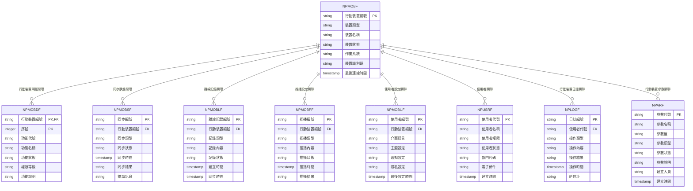

# 銷貨模組 程式功能規格書 - 行動裝置

## 文件基本資訊

| 項目 | 說明 |
|------|------|
| **文件名稱** | 銷貨模組程式功能規格書 - 行動裝置 |
| **模組代號** | NP |
| **版本** | v1.0 |
| **建立日期** | 2024年12月21日 |
| **建立人員** | 系統分析師 |
| **審核人員** | 專案經理 |
| **文件狀態** | 初稿 |
| **最後更新** | 2024年12月21日 |

---

## 目錄

1. [基本資料](#基本資料)
2. [檔案架構與關聯圖](#檔案架構與關聯圖)
3. [檔案名稱與欄位規格](#檔案名稱與欄位規格)
4. [輸出/入螢幕布局與說明](#輸出入螢幕布局與說明)
5. [處理流程程序說明](#處理流程程序說明)
6. [子程序處理邏輯說明](#子程序處理邏輯說明)
7. [錯誤處理程序說明與訊息清冊](#錯誤處理程序說明與訊息清冊)
8. [備註](#備註)

---

## 基本資料

### 1.1 模組概述

#### 1.1.1 模組功能說明
銷貨模組的行動裝置功能主要負責提供銷貨系統的行動化應用，讓業務人員、客戶服務人員、管理人員能夠隨時隨地透過智慧型手機、平板電腦等行動裝置進行銷貨相關業務操作。此功能支援離線作業、即時同步、推播通知等行動化特性，提升業務效率和使用者體驗，實現真正的行動辦公環境。

#### 1.1.2 模組特色
- **跨平台支援**：支援iOS、Android、Windows等主流行動作業系統
- **離線作業能力**：支援離線資料存取和業務處理，連線後自動同步
- **即時推播通知**：重要業務事件即時推播通知，提升回應速度
- **多裝置同步**：支援多裝置間的資料同步和狀態一致性
- **觸控友善介面**：專為觸控操作設計的使用者介面
- **安全性保障**：支援生物識別認證、資料加密等安全機制

#### 1.1.3 適用範圍
適用於銷貨系統的行動化作業，包括客戶查詢、訂單處理、出貨追蹤、報表查看、庫存查詢、價格查詢、客戶拜訪記錄、業務報表等各類行動化業務功能。

### 1.2 技術架構

#### 1.2.1 開發技術
- **前端技術**：React Native、Flutter、Swift (iOS)、Kotlin (Android)
- **後端技術**：RESTful API、WebSocket、Push Notification
- **資料庫**：SQLite (本地)、DB2 for i (伺服器)
- **開發工具**：Xcode、Android Studio、Visual Studio Code
- **部署環境**：App Store、Google Play、企業內部分發

#### 1.2.2 系統需求
- **硬體需求**：智慧型手機、平板電腦、行動裝置
- **軟體需求**：iOS 12.0+、Android 8.0+、Windows 10+
- **網路需求**：4G/5G行動網路、Wi-Fi網路、企業VPN連線

---

## 檔案架構與關聯圖

### 2.1 資料庫檔案架構

#### 2.1.1 主要資料表


#### 2.1.2 檔案關聯說明
- **NPMOBF (行動裝置檔)**：儲存行動裝置的基本資料和狀態資訊
- **NPMOBDF (行動裝置明細檔)**：儲存行動裝置的功能權限和設定資訊
- **NPMOBSF (同步狀態檔)**：儲存行動裝置的資料同步狀態和記錄
- **NPMOBLF (離線記錄檔)**：儲存行動裝置的離線作業記錄
- **NPMOBPF (推播設定檔)**：儲存行動裝置的推播通知設定和記錄
- **NPMOBUF (使用者設定檔)**：儲存使用者的行動裝置個人化設定
- **NPUSRF (使用者檔)**：儲存使用者的基本資料和權限資訊
- **NPLOGF (行動裝置日誌檔)**：儲存行動裝置的操作日誌記錄
- **NPARF (行動裝置參數檔)**：儲存行動裝置相關的系統參數

### 2.2 系統架構圖

#### 2.2.1 行動裝置系統架構


---

## 檔案名稱與欄位規格

### 3.1 主要檔案規格

#### 3.1.1 NPMOBF - 行動裝置檔

| 欄位代號 | 欄位名稱 | 位置 | 長度 | 型態 | 屬性 | 檢核說明 |
|----------|----------|------|------|------|------|----------|
| MOB01 | 公司代碼 | 1-3 | 3 | A | PK | 必填，公司唯一識別碼 |
| MOB02 | 行動裝置編號 | 4-15 | 12 | A | PK | 必填，行動裝置唯一識別碼 |
| MOB03 | 裝置類型 | 16-17 | 2 | A | M | 必填，值：01-智慧型手機、02-平板電腦、03-筆記型電腦、04-穿戴裝置 |
| MOB04 | 裝置名稱 | 18-47 | 30 | A | M | 必填，行動裝置的中文名稱 |
| MOB05 | 裝置狀態 | 48-48 | 1 | A | M | 必填，值：A-啟用、I-停用、M-維護中、L-鎖定 |
| MOB06 | 作業系統 | 49-58 | 10 | A | M | 必填，裝置的作業系統版本 |
| MOB07 | 裝置識別碼 | 59-98 | 40 | A | M | 必填，裝置的唯一識別碼（IMEI、MAC等） |
| MOB08 | 裝置型號 | 99-128 | 30 | A | O | 選填，裝置的具體型號 |
| MOB09 | 製造商 | 129-158 | 30 | A | O | 選填，裝置的製造商名稱 |
| MOB10 | 螢幕解析度 | 159-178 | 20 | A | O | 選填，裝置螢幕的解析度 |
| MOB11 | 最後連線時間 | 179-186 | 8 | T | O | 選填，裝置最後連線的時間 |
| MOB12 | 連線IP位址 | 187-206 | 20 | A | O | 選填，裝置連線的IP位址 |
| MOB13 | 建立人員 | 207-211 | 5 | A | M | 必填，建立行動裝置的使用者代號 |
| MOB14 | 建立時間 | 212-219 | 8 | T | M | 必填，系統自動產生 |
| MOB15 | 修改人員 | 220-224 | 5 | A | O | 選填，最後修改行動裝置的使用者代號 |
| MOB16 | 修改時間 | 225-232 | 8 | T | O | 選填，最後修改時間 |
| MOB17 | 備註 | 233-272 | 40 | A | O | 選填，最多40字元 |

#### 3.1.2 NPMOBDF - 行動裝置明細檔

| 欄位代號 | 欄位名稱 | 位置 | 長度 | 型態 | 屬性 | 檢核說明 |
|----------|----------|------|------|------|------|----------|
| MOBD01 | 行動裝置編號 | 1-12 | 12 | A | PK,FK | 必填，參照NPMOBF.MOB02 |
| MOBD02 | 序號 | 13-15 | 3 | I | PK | 必填，1-999 |
| MOBD03 | 功能代號 | 16-20 | 5 | A | M | 必填，功能模組的代號 |
| MOBD04 | 功能名稱 | 21-50 | 30 | A | M | 必填，功能模組的中文名稱 |
| MOBD05 | 功能狀態 | 51-51 | 1 | A | M | 必填，值：A-啟用、I-停用 |
| MOBD06 | 權限等級 | 52-56 | 5 | A | M | 必填，功能的使用權限等級 |
| MOBD07 | 功能說明 | 57-106 | 50 | A | O | 選填，功能的詳細說明 |
| MOBD08 | 排序順序 | 107-109 | 3 | I | O | 選填，功能的顯示順序 |
| MOBD09 | 是否離線 | 110-110 | 1 | A | M | 必填，值：Y-支援、N-不支援 |
| MOBD10 | 同步頻率 | 111-112 | 2 | A | O | 選填，值：01-即時、02-每分鐘、03-每小時、04-每日 |
| MOBD11 | 備註 | 113-142 | 30 | A | O | 選填，最多30字元 |

#### 3.1.3 NPMOBSF - 同步狀態檔

| 欄位代號 | 欄位名稱 | 位置 | 長度 | 型態 | 屬性 | 檢核說明 |
|----------|----------|------|------|------|------|----------|
| MOBS01 | 同步編號 | 1-15 | 15 | A | PK | 必填，同步記錄唯一識別碼 |
| MOBS02 | 公司代碼 | 16-18 | 3 | A | M | 必填，公司代碼 |
| MOBS03 | 行動裝置編號 | 19-30 | 12 | A | FK | 必填，參照行動裝置檔 |
| MOBS04 | 同步類型 | 31-32 | 2 | A | M | 必填，值：01-客戶資料、02-訂單資料、03-出貨資料、04-報表資料、05-設定資料 |
| MOBS05 | 同步狀態 | 33-33 | 1 | A | M | 必填，值：P-待同步、S-同步中、C-同步完成、E-同步失敗 |
| MOBS06 | 同步時間 | 34-41 | 8 | T | M | 必填，同步執行的時間 |
| MOBS07 | 同步結果 | 42-43 | 2 | A | M | 必填，值：01-成功、02-部分成功、03-失敗 |
| MOBS08 | 處理筆數 | 44-51 | 8 | I | O | 選填，處理的資料筆數 |
| MOBS09 | 成功筆數 | 52-59 | 8 | I | O | 選填，成功同步的資料筆數 |
| MOBS10 | 失敗筆數 | 60-67 | 8 | I | O | 選填，同步失敗的資料筆數 |
| MOBS11 | 錯誤訊息 | 68-117 | 50 | A | O | 選填，同步失敗時的錯誤訊息 |
| MOBS12 | 備註 | 118-147 | 30 | A | O | 選填，最多30字元 |

#### 3.1.4 NPMOBLF - 離線記錄檔

| 欄位代號 | 欄位名稱 | 位置 | 長度 | 型態 | 屬性 | 檢核說明 |
|----------|----------|------|------|------|------|----------|
| MOBL01 | 離線記錄編號 | 1-15 | 15 | A | PK | 必填，離線記錄唯一識別碼 |
| MOBL02 | 公司代碼 | 16-18 | 3 | A | M | 必填，公司代碼 |
| MOBL03 | 行動裝置編號 | 19-30 | 12 | A | FK | 必填，參照行動裝置檔 |
| MOBL04 | 記錄類型 | 31-32 | 2 | A | M | 必填，值：01-新增、02-修改、03-刪除、04-查詢、05-上傳 |
| MOBL05 | 記錄內容 | 33-82 | 50 | A | M | 必填，離線作業的具體內容 |
| MOBL06 | 記錄狀態 | 83-83 | 1 | A | M | 必填，值：P-待同步、S-同步中、C-同步完成、E-同步失敗 |
| MOBL07 | 建立時間 | 84-91 | 8 | T | M | 必填，離線記錄建立的時間 |
| MOBL08 | 同步時間 | 92-99 | 8 | T | O | 選填，離線記錄同步的時間 |
| MOBL09 | 資料大小 | 100-109 | 10 | I | O | 選填，記錄資料的大小（位元組） |
| MOBL10 | 優先等級 | 110-110 | 1 | A | M | 必填，值：1-高、2-中、3-低 |
| MOBL11 | 錯誤訊息 | 111-160 | 50 | A | O | 選填，同步失敗時的錯誤訊息 |
| MOBL12 | 備註 | 161-190 | 30 | A | O | 選填，最多30字元 |

#### 3.1.5 NPMOBPF - 推播設定檔

| 欄位代號 | 欄位名稱 | 位置 | 長度 | 型態 | 屬性 | 檢核說明 |
|----------|----------|------|------|------|------|----------|
| MOBP01 | 推播編號 | 1-15 | 15 | A | PK | 必填，推播記錄唯一識別碼 |
| MOBP02 | 公司代碼 | 16-18 | 3 | A | M | 必填，公司代碼 |
| MOBP03 | 行動裝置編號 | 19-30 | 12 | A | FK | 必填，參照行動裝置檔 |
| MOBP04 | 推播類型 | 31-32 | 2 | A | M | 必填，值：01-新訂單、02-出貨通知、03-系統維護、04-業務提醒、05-安全警報 |
| MOBP05 | 推播內容 | 33-82 | 50 | A | M | 必填，推播通知的具體內容 |
| MOBP06 | 推播狀態 | 83-83 | 1 | A | M | 必填，值：P-待推播、S-推播中、C-推播完成、E-推播失敗 |
| MOBP07 | 推播時間 | 84-91 | 8 | T | M | 必填，推播執行的時間 |
| MOBP08 | 推播結果 | 92-93 | 2 | A | M | 必填，值：01-成功、02-失敗、03-逾時 |
| MOBP09 | 推播目標 | 94-103 | 10 | A | M | 必填，推播的目標使用者或群組 |
| MOBP10 | 推播優先級 | 104-104 | 1 | A | M | 必填，值：1-高、2-中、3-低 |
| MOBP11 | 錯誤訊息 | 105-154 | 50 | A | O | 選填，推播失敗時的錯誤訊息 |
| MOBP12 | 備註 | 155-184 | 30 | A | O | 選填，最多30字元 |

### 3.2 索引資料

#### 3.2.1 主要索引
- **NPMOBF 主鍵索引**：MOB01 + MOB02 (公司代碼 + 行動裝置編號)
- **NPMOBF 裝置類型索引**：MOB03 (裝置類型)
- **NPMOBF 裝置狀態索引**：MOB05 (裝置狀態)
- **NPMOBF 作業系統索引**：MOB06 (作業系統)
- **NPMOBF 裝置識別碼索引**：MOB07 (裝置識別碼)

#### 3.2.2 次要索引
- **NPMOBDF 主鍵索引**：MOBD01 + MOBD02 (行動裝置編號 + 序號)
- **NPMOBDF 行動裝置編號索引**：MOBD01 (行動裝置編號)
- **NPMOBDF 功能代號索引**：MOBD03 (功能代號)
- **NPMOBSF 主鍵索引**：MOBS01 (同步編號)
- **NPMOBSF 行動裝置編號索引**：MOBS03 (行動裝置編號)
- **NPMOBSF 同步類型索引**：MOBS04 (同步類型)
- **NPMOBLF 主鍵索引**：MOBL01 (離線記錄編號)
- **NPMOBLF 行動裝置編號索引**：MOBL03 (行動裝置編號)
- **NPMOBPF 主鍵索引**：MOBP01 (推播編號)
- **NPMOBPF 行動裝置編號索引**：MOBP03 (行動裝置編號)

---

## 輸出/入螢幕布局與說明

### 4.1 行動裝置主畫面

#### 4.1.1 畫面布局
```
┌─────────────────────────────────────────────────────────────┐
│                    銷貨管理系統 - 行動版                    │
├─────────────────────────────────────────────────────────────┤
│ 使用者資訊：                                                │
│  [使用者名稱] [部門] [最後登入時間] [連線狀態]              │
├─────────────────────────────────────────────────────────────┤
│ 主要功能：                                                  │
│  ┌─────────┬─────────┬─────────┬─────────┐                  │
│  │ 客戶管理│ 訂單管理│ 出貨管理│ 報表查詢│                  │
│  ├─────────┼─────────┼─────────┼─────────┤                  │
│  │ 庫存查詢│ 價格查詢│ 拜訪記錄│ 系統設定│                  │
│  └─────────┴─────────┴─────────┴─────────┘                  │
├─────────────────────────────────────────────────────────────┤
│ 快速功能：                                                  │
│  [新增訂單] [客戶查詢] [出貨追蹤] [庫存檢查]                │
├─────────────────────────────────────────────────────────────┤
│ 同步狀態：                                                  │
│  最後同步：[2024/12/21 14:30:00] 同步狀態：[正常]          │
│  離線記錄：[5筆] 推播通知：[3筆]                            │
├─────────────────────────────────────────────────────────────┤
│ 功能鍵：選單=≡ 搜尋=🔍 通知=🔔 設定=⚙️ 同步=🔄              │
└─────────────────────────────────────────────────────────────┘
```

#### 4.1.2 畫面說明
- **使用者資訊區**：顯示當前登入使用者的基本資訊和連線狀態
- **主要功能區**：提供8個主要功能模組的快速存取
- **快速功能區**：提供常用的快速操作功能
- **同步狀態區**：顯示資料同步狀態和離線記錄數量
- **功能鍵區**：說明可使用的觸控功能鍵

### 4.2 客戶管理畫面

#### 4.2.1 畫面布局
```
┌─────────────────────────────────────────────────────────────┐
│                        客戶管理                            │
├─────────────────────────────────────────────────────────────┤
│ 搜尋功能：                                                  │
│  [搜尋客戶] [篩選條件] [最近瀏覽] [我的客戶]                │
├─────────────────────────────────────────────────────────────┤
│ 客戶清單：                                                  │
│ ┌─────────────────────────────────────────────────────────┐ │
│ │ 客戶代號：C001    客戶名稱：ABC企業有限公司              │ │
│ │ 聯絡人：張經理    電話：02-1234-5678                    │ │
│ │ 地址：台北市信義區信義路五段7號                        │ │
│ │ 信用額度：$1,000,000  應收帳款：$250,000               │ │
│ │ [查看詳情] [編輯資料] [新增訂單] [拜訪記錄]             │ │
│ └─────────────────────────────────────────────────────────┘ │
│ ┌─────────────────────────────────────────────────────────┐ │
│ │ 客戶代號：C002    客戶名稱：XYZ貿易股份有限公司          │ │
│ │ 聯絡人：李小姐    電話：02-2345-6789                    │ │
│ │ 地址：台北市大安區忠孝東路四段1號                      │ │
│ │ 信用額度：$500,000   應收帳款：$75,000                 │ │
│ │ [查看詳情] [編輯資料] [新增訂單] [拜訪記錄]             │ │
│ └─────────────────────────────────────────────────────────┘ │
├─────────────────────────────────────────────────────────────┤
│ 操作：[新增客戶] [匯出清單] [同步資料] [離線模式]          │
│ 功能鍵：返回=← 新增=+ 搜尋=🔍 篩選=⚡ 同步=🔄              │
└─────────────────────────────────────────────────────────────┘
```

---

## 處理流程程序說明

### 5.1 行動裝置登入流程

#### 5.1.1 主要處理流程


#### 5.1.2 資料驗證規則
1. **使用者身分驗證**：帳號密碼必須正確，使用者狀態必須為啟用
2. **裝置驗證**：裝置必須已註冊，裝置狀態必須為啟用
3. **權限驗證**：使用者必須具有行動裝置存取權限
4. **網路驗證**：網路連線必須穩定，能夠連接到伺服器

### 5.2 資料同步處理流程

#### 5.2.1 主要處理流程


### 5.3 離線作業處理流程

#### 5.3.1 主要處理流程


---

## 子程序處理邏輯說明

### 6.1 裝置註冊子程序

#### 6.1.1 註冊邏輯


#### 6.1.2 裝置資訊收集
1. **硬體資訊**：裝置型號、製造商、螢幕解析度、記憶體容量
2. **作業系統資訊**：作業系統版本、系統語言、時區設定
3. **網路資訊**：網路類型、連線品質、IP位址
4. **應用程式資訊**：應用程式版本、安裝時間、權限設定

### 6.2 推播通知子程序

#### 6.2.1 推播邏輯


#### 6.2.2 推播類型
1. **新訂單通知**：客戶下單時即時推播給相關業務人員
2. **出貨通知**：出貨完成時推播給客戶和業務人員
3. **系統維護通知**：系統維護時推播給所有使用者
4. **業務提醒通知**：重要業務事件提醒
5. **安全警報通知**：系統安全相關警報

### 6.3 離線資料管理子程序

#### 6.3.1 離線資料邏輯


#### 6.3.2 離線資料策略
1. **資料優先級**：根據業務重要性設定資料同步優先級
2. **資料過期處理**：設定資料有效期，過期資料自動清理
3. **資料壓縮**：離線資料進行壓縮，節省儲存空間
4. **資料加密**：敏感資料進行加密，保護資料安全

### 6.4 多裝置同步子程序

#### 6.4.1 同步邏輯


---

## 錯誤處理程序說明與訊息清冊

### 7.1 錯誤處理程序

#### 7.1.1 錯誤處理流程


### 7.2 錯誤訊息清冊

#### 7.2.1 網路連線錯誤訊息

| 錯誤代碼 | 錯誤訊息 | 錯誤原因 | 解決方法 |
|----------|----------|----------|----------|
| **NP701** | 網路連線失敗 | 無法連接到伺服器 | 請檢查網路連線，或切換網路環境 |
| **NP702** | 連線逾時 | 網路連線超過時間限制 | 請檢查網路品質，或稍後再試 |
| **NP703** | 伺服器無回應 | 伺服器暫時無法回應 | 請稍後再試，或聯繫系統管理員 |
| **NP704** | VPN連線失敗 | 企業VPN連線失敗 | 請檢查VPN設定，或聯繫網路管理員 |
| **NP705** | 網路權限不足 | 網路存取權限不足 | 請聯繫網路管理員檢查網路權限 |

#### 7.2.2 認證與權限錯誤訊息

| 錯誤代碼 | 錯誤訊息 | 錯誤原因 | 解決方法 |
|----------|----------|----------|----------|
| **NP801** | 登入失敗 | 使用者帳號或密碼錯誤 | 請檢查帳號密碼，或聯繫系統管理員 |
| **NP802** | 帳號已鎖定 | 使用者帳號已被鎖定 | 請聯繫系統管理員解除帳號鎖定 |
| **NP803** | 權限不足 | 使用者沒有存取該功能的權限 | 請聯繫系統管理員檢查使用者權限 |
| **NP804** | 裝置未註冊 | 行動裝置尚未註冊 | 請完成裝置註冊程序 |
| **NP805** | 裝置已停用 | 行動裝置已被停用 | 請聯繫系統管理員啟用裝置 |

#### 7.2.3 資料同步錯誤訊息

| 錯誤代碼 | 錯誤訊息 | 錯誤原因 | 解決方法 |
|----------|----------|----------|----------|
| **NP901** | 同步失敗 | 資料同步操作失敗 | 請檢查網路連線，或稍後再試 |
| **NP902** | 資料衝突 | 本地資料與伺服器資料存在衝突 | 請選擇資料版本，或聯繫系統管理員 |
| **NP903** | 資料損壞 | 本地資料已損壞 | 請重新同步資料，或重新安裝應用程式 |
| **NP904** | 儲存空間不足 | 裝置儲存空間不足 | 請清理裝置儲存空間，或刪除不必要的資料 |
| **NP905** | 同步逾時 | 資料同步超過時間限制 | 請檢查網路品質，或稍後再試 |

### 7.3 錯誤處理建議

#### 7.3.1 使用者操作建議
1. **檢查網路連線**：確保網路連線穩定，必要時切換網路環境
2. **重新啟動應用程式**：遇到問題時嘗試重新啟動應用程式
3. **檢查裝置設定**：確保裝置時間、語言等設定正確
4. **清理快取資料**：定期清理應用程式快取，釋放儲存空間

#### 7.3.2 系統管理建議
1. **監控網路品質**：定期監控網路連線品質和穩定性
2. **檢查伺服器狀態**：定期檢查伺服器運行狀態和效能
3. **更新應用程式**：及時更新應用程式版本，修復已知問題
4. **備份重要資料**：定期備份重要的行動裝置設定和資料

---

## 備註

### 8.1 開發注意事項

#### 8.1.1 程式開發注意事項
1. **跨平台相容性**：確保應用程式在不同作業系統上的相容性
2. **觸控介面設計**：專為觸控操作設計使用者介面，確保操作便利性
3. **離線功能支援**：實作完整的離線功能，支援離線作業和資料同步
4. **效能優化**：優化應用程式效能，減少記憶體使用和電池消耗
5. **安全性考量**：實作資料加密、安全認證等安全機制

#### 8.1.2 測試注意事項
1. **多裝置測試**：在不同品牌和型號的裝置上進行測試
2. **網路環境測試**：在不同網路環境下測試連線和同步功能
3. **離線功能測試**：測試離線作業和資料同步功能
4. **效能測試**：測試應用程式的啟動時間、回應時間和記憶體使用
5. **使用者體驗測試**：進行使用者體驗測試，收集使用者回饋

### 8.2 維護注意事項

#### 8.2.1 日常維護注意事項
1. **監控應用程式狀態**：定期監控應用程式的運行狀態和錯誤率
2. **檢查網路連線**：定期檢查網路連線的穩定性和品質
3. **更新應用程式**：及時發布應用程式更新，修復問題和新增功能
4. **清理過期資料**：定期清理過期的離線資料和快取資料
5. **備份使用者設定**：定期備份使用者的個人化設定和偏好

#### 8.2.2 版本更新注意事項
1. **向後相容性**：確保新版本與舊版本的資料格式相容
2. **漸進式更新**：採用漸進式更新策略，降低更新風險
3. **使用者通知**：提前通知使用者版本更新計畫和重要變更
4. **回滾計畫**：制定詳細的回滾計畫，以應對更新失敗
5. **測試驗證**：更新後必須進行充分的測試驗證

### 8.3 未來擴充建議

#### 8.3.1 功能擴充建議
1. **人工智慧應用**：整合AI功能，提供智慧化的業務建議和預測
2. **擴增實境支援**：支援AR功能，提供更直觀的資料視覺化
3. **語音操作支援**：支援語音操作，提升操作便利性
4. **穿戴裝置整合**：支援智慧手錶等穿戴裝置
5. **多語言支援**：增加多語言支援，滿足國際化需求

#### 8.3.2 技術改進建議
1. **雲端原生架構**：採用雲端原生技術，提高系統的彈性和可擴展性
2. **微服務架構**：考慮採用微服務架構，提高系統的模組化程度
3. **容器化部署**：使用容器技術進行應用程式部署
4. **自動化測試**：實作CI/CD流程，自動化測試和部署
5. **監控告警**：實作完整的監控告警系統，及時發現和處理問題

---

## 附錄

### A.1 相關文件清單
- 銷貨模組程式功能規格書 - 銷貨管理
- 銷貨模組程式功能規格書 - 客戶管理
- 銷貨模組程式功能規格書 - 訂單管理
- 銷貨模組程式功能規格書 - 出貨管理
- 銷貨模組程式功能規格書 - 應收帳款管理
- 銷貨模組程式功能規格書 - 價格管理
- 銷貨模組程式功能規格書 - 報表分析
- 銷貨模組程式功能規格書 - 系統管理
- 銷貨模組程式功能規格書 - 整合介面
- 銷貨模組業務邏輯分析與API設計
- 銷貨模組操作手冊 - 行動裝置

### A.2 修訂記錄

| 版本 | 修訂日期 | 修訂人員 | 修訂內容 | 修訂原因 |
|------|----------|----------|----------|----------|
| v1.0 | 2024/12/21 | 系統分析師 | 初始版本建立 | 新功能開發 |

### A.3 聯絡資訊
- **專案經理**：[專案經理姓名]
- **系統分析師**：[系統分析師姓名]
- **技術支援**：[技術支援聯絡方式]
- **專案信箱**：[專案信箱地址]
