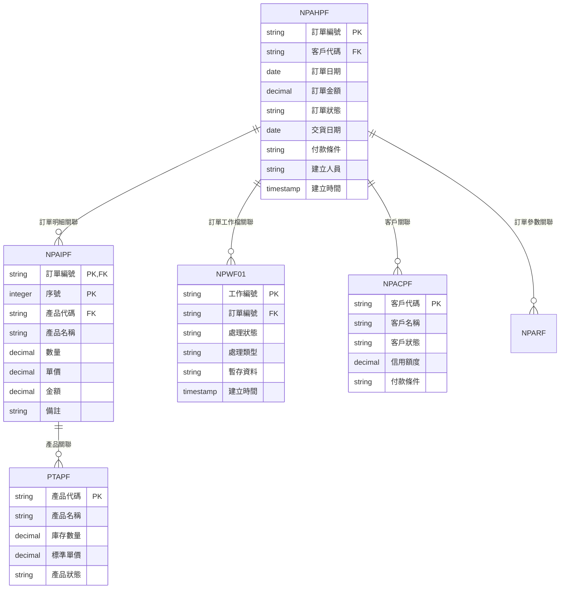
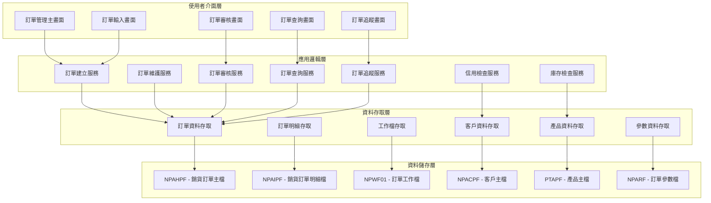
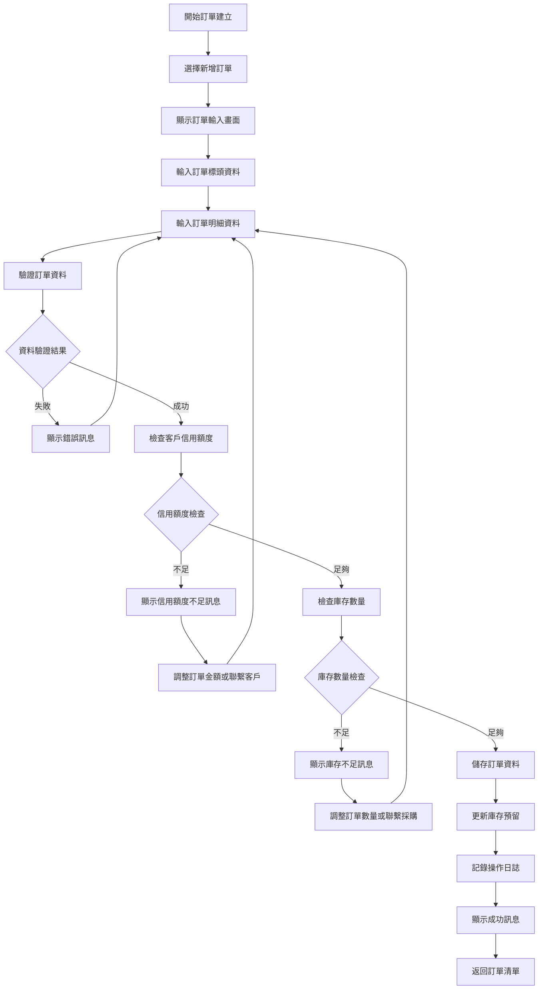
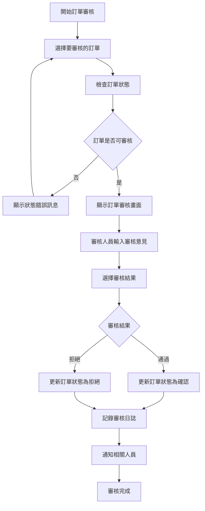
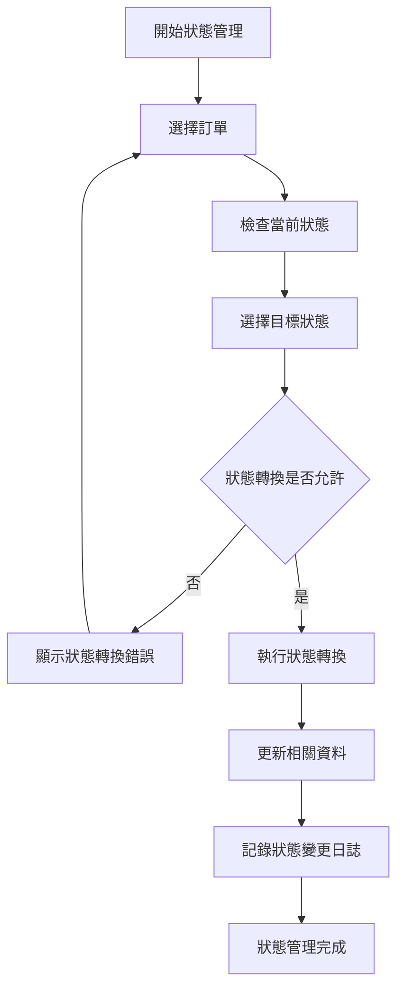
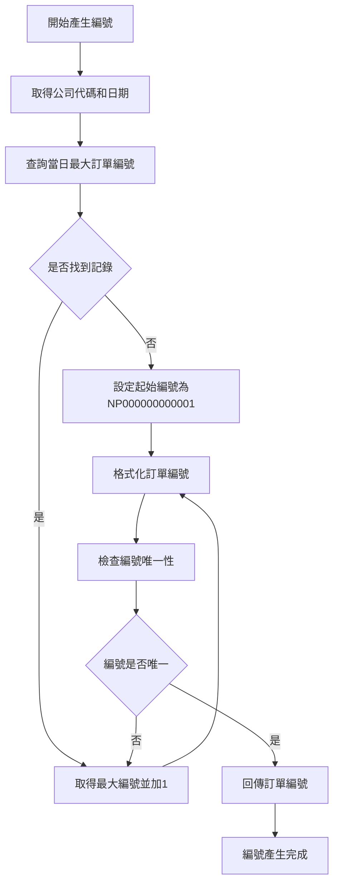
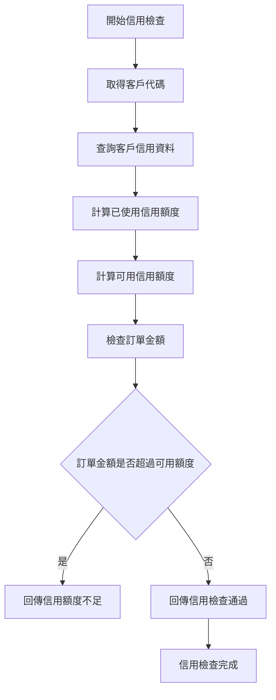
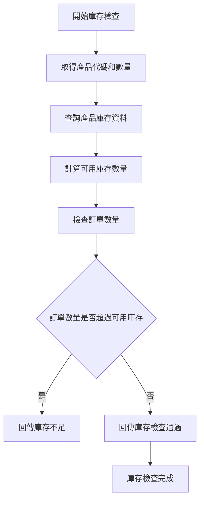
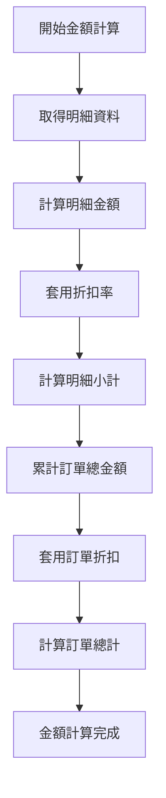
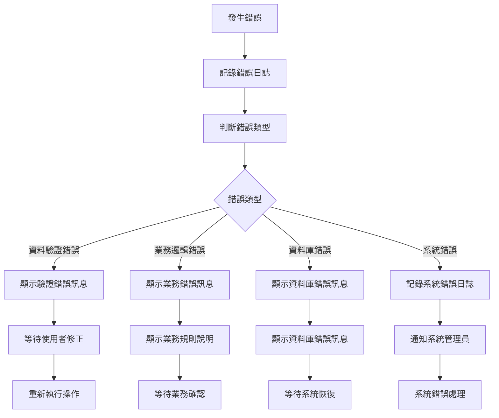

# 銷貨模組 程式功能規格書 - 訂單管理

## 文件基本資訊

| 項目 | 說明 |
|------|------|
| **文件名稱** | 銷貨模組程式功能規格書 - 訂單管理 |
| **模組代號** | NP |
| **版本** | v1.0 |
| **建立日期** | 2024年12月21日 |
| **建立人員** | 系統分析師 |
| **審核人員** | 專案經理 |
| **文件狀態** | 初稿 |
| **最後更新** | 2024年12月21日 |

---

## 目錄

1. [基本資料](#基本資料)
2. [檔案架構與關聯圖](#檔案架構與關聯圖)
3. [檔案名稱與欄位規格](#檔案名稱與欄位規格)
4. [輸出/入螢幕布局與說明](#輸出入螢幕布局與說明)
5. [處理流程程序說明](#處理流程程序說明)
6. [子程序處理邏輯說明](#子程序處理邏輯說明)
7. [錯誤處理程序說明與訊息清冊](#錯誤處理程序說明與訊息清冊)
8. [備註](#備註)

---

## 基本資料

### 1.1 模組概述

#### 1.1.1 模組功能說明
銷貨模組的訂單管理功能主要負責管理企業的銷貨訂單，包括訂單建立、訂單維護、訂單審核、訂單狀態管理、訂單追蹤等。此功能為銷貨業務提供完整的訂單生命週期管理，從客戶詢價到訂單確認，再到出貨完成，確保訂單處理的準確性和效率。

#### 1.1.2 模組特色
- **完整訂單生命週期管理**：涵蓋訂單建立、審核、確認、出貨、完成等全流程
- **多層級訂單狀態管理**：支援草稿、確認、出貨中、完成、取消等狀態
- **自動化訂單編號產生**：系統自動產生唯一且連續的訂單編號
- **即時庫存檢查**：訂單建立時自動檢查庫存可用性
- **信用額度控制**：自動檢查客戶信用額度，防止超額訂單
- **訂單追蹤功能**：完整的訂單處理進度追蹤和歷史記錄

#### 1.1.3 適用範圍
適用於企業銷貨業務中的訂單管理作業，包括訂單建立、訂單維護、訂單審核、訂單狀態管理、訂單追蹤等各類訂單相關業務功能。

### 1.2 技術架構

#### 1.2.1 開發技術
- **程式語言**：RPG、CL、SQL
- **資料庫**：DB2 for i (IBM i)
- **開發工具**：IBM i 開發環境
- **部署環境**：IBM i 7.4

#### 1.2.2 系統需求
- **硬體需求**：IBM i 伺服器
- **軟體需求**：IBM i 作業系統、DB2 for i
- **網路需求**：企業內部網路連線

---

## 檔案架構與關聯圖

### 2.1 資料庫檔案架構

#### 2.1.1 主要資料表


#### 2.1.2 檔案關聯說明
- **NPAHPF (銷貨訂單主檔)**：儲存訂單的基本資料和標頭資訊
- **NPAIPF (銷貨訂單明細檔)**：儲存訂單的明細項目資料
- **NPWF01 (訂單工作檔)**：儲存訂單處理過程中的暫存資料和工作狀態
- **NPACPF (客戶主檔)**：儲存客戶的基本資料和信用資訊
- **PTAPF (產品主檔)**：儲存產品的基本資料和庫存資訊
- **NPARF (訂單參數檔)**：儲存訂單管理相關的系統參數

### 2.2 系統架構圖

#### 2.2.1 訂單管理系統架構


---

## 檔案名稱與欄位規格

### 3.1 主要檔案規格

#### 3.1.1 NPAHPF - 銷貨訂單主檔

| 欄位代號 | 欄位名稱 | 位置 | 長度 | 型態 | 屬性 | 檢核說明 |
|----------|----------|------|------|------|------|----------|
| AH01 | 公司代碼 | 1-3 | 3 | A | PK | 必填，公司唯一識別碼 |
| AH02 | 訂單編號 | 4-15 | 12 | A | PK | 必填，訂單唯一識別碼 |
| AH03 | 客戶代碼 | 16-20 | 5 | A | FK | 必填，參照客戶主檔 |
| AH04 | 訂單日期 | 21-28 | 8 | D | M | 必填，訂單建立日期 |
| AH05 | 訂單狀態 | 29-29 | 1 | A | M | 必填，值：D-草稿、C-確認、S-出貨中、F-完成、X-取消 |
| AH06 | 訂單金額 | 30-39 | 10 | P | M | 必填，訂單總金額，小數點後2位 |
| AH07 | 付款條件 | 40-41 | 2 | A | M | 必填，參照付款條件檔 |
| AH08 | 交貨日期 | 42-49 | 8 | D | M | 必填，不能早於訂單日期 |
| AH09 | 交貨地址 | 50-89 | 40 | A | M | 必填，最多40字元 |
| AH10 | 備註 | 90-129 | 40 | A | O | 選填，最多40字元 |
| AH11 | 建立人員 | 130-134 | 5 | A | M | 必填，參照使用者檔 |
| AH12 | 建立時間 | 135-142 | 8 | T | M | 必填，系統自動產生 |
| AH13 | 修改人員 | 143-147 | 5 | A | O | 選填，最後修改訂單的使用者代號 |
| AH14 | 修改時間 | 148-155 | 8 | T | O | 選填，最後修改時間 |
| AH15 | 審核人員 | 156-160 | 5 | A | O | 選填，審核訂單的人員代號 |
| AH16 | 審核時間 | 161-168 | 8 | T | O | 選填，訂單審核時間 |
| AH17 | 審核備註 | 169-208 | 40 | A | O | 選填，審核備註說明 |

#### 3.1.2 NPAIPF - 銷貨訂單明細檔

| 欄位代號 | 欄位名稱 | 位置 | 長度 | 型態 | 屬性 | 檢核說明 |
|----------|----------|------|------|------|------|----------|
| AI01 | 訂單編號 | 1-12 | 12 | A | PK,FK | 必填，參照NPAHPF.AH02 |
| AI02 | 序號 | 13-15 | 3 | I | PK | 必填，1-999 |
| AI03 | 產品代碼 | 16-20 | 5 | A | FK | 必填，參照產品主檔 |
| AI04 | 產品名稱 | 21-50 | 30 | A | M | 必填，最多30字元 |
| AI05 | 規格 | 51-80 | 30 | A | O | 選填，最多30字元 |
| AI06 | 數量 | 81-88 | 8 | P | M | 必填，正數，小數點後2位 |
| AI07 | 單位 | 89-90 | 2 | A | M | 必填，參照單位檔 |
| AI08 | 單價 | 91-100 | 10 | P | M | 必填，金額格式，小數點後2位 |
| AI09 | 折扣率 | 101-103 | 3 | P | O | 選填，0-100%，小數點後2位 |
| AI10 | 金額 | 104-113 | 10 | P | M | 必填，數量×單價×(1-折扣率)，小數點後2位 |
| AI11 | 備註 | 114-143 | 30 | A | O | 選填，最多30字元 |
| AI12 | 庫存預留 | 144-151 | 8 | P | O | 選填，預留的庫存數量 |
| AI13 | 出貨數量 | 152-159 | 8 | P | O | 選填，已出貨的數量 |
| AI14 | 剩餘數量 | 160-167 | 8 | P | O | 選填，剩餘未出貨數量 |

#### 3.1.3 NPWF01 - 訂單工作檔

| 欄位代號 | 欄位名稱 | 位置 | 長度 | 型態 | 屬性 | 檢核說明 |
|----------|----------|------|------|------|------|----------|
| WF0101 | 工作編號 | 1-10 | 10 | A | PK | 必填，工作唯一識別碼 |
| WF0102 | 訂單編號 | 11-22 | 12 | A | FK | 必填，參照銷貨訂單檔 |
| WF0103 | 處理狀態 | 23-23 | 1 | A | M | 必填，值：P-處理中、C-完成、E-錯誤 |
| WF0104 | 處理類型 | 24-24 | 1 | A | M | 必填，值：1-新增、2-修改、3-刪除、4-狀態變更 |
| WF0105 | 暫存資料 | 25-124 | 100 | A | O | 選填，處理中的暫存資料 |
| WF0106 | 建立時間 | 125-132 | 8 | T | M | 必填，系統自動產生 |
| WF0107 | 完成時間 | 133-140 | 8 | T | O | 選填，處理完成時間 |
| WF0108 | 錯誤訊息 | 141-190 | 50 | A | O | 選填，處理錯誤時的錯誤訊息 |
| WF0109 | 處理人員 | 191-195 | 5 | A | O | 選填，處理工作的人員代號 |

#### 3.1.4 NPARF - 訂單參數檔

| 欄位代號 | 欄位名稱 | 位置 | 長度 | 型態 | 屬性 | 檢核說明 |
|----------|----------|------|------|------|------|----------|
| AR01 | 參數代號 | 1-5 | 5 | A | PK | 必填，參數唯一識別碼 |
| AR02 | 參數名稱 | 6-35 | 30 | A | M | 必填，參數的中文名稱 |
| AR03 | 參數值 | 36-85 | 50 | A | M | 必填，參數的當前值 |
| AR04 | 參數類型 | 86-87 | 2 | A | M | 必填，值：01-字串、02-數值、03-日期、04-布林 |
| AR05 | 參數狀態 | 88-89 | 2 | A | M | 必填，值：01-啟用、02-停用、03-維護中 |
| AR06 | 建立人員 | 90-94 | 5 | A | M | 必填，建立參數的使用者代號 |
| AR07 | 建立時間 | 95-102 | 8 | T | M | 必填，系統自動產生 |
| AR08 | 修改人員 | 103-107 | 5 | A | O | 選填，最後修改參數的使用者代號 |
| AR09 | 修改時間 | 108-115 | 8 | T | O | 選填，最後修改時間 |
| AR10 | 備註 | 116-155 | 40 | A | O | 選填，參數備註說明 |

### 3.2 索引資料

#### 3.2.1 主要索引
- **NPAHPF 主鍵索引**：AH01 + AH02 (公司代碼 + 訂單編號)
- **NPAHPF 客戶代碼索引**：AH03 (客戶代碼)
- **NPAHPF 訂單日期索引**：AH04 (訂單日期)
- **NPAHPF 訂單狀態索引**：AH05 (訂單狀態)
- **NPAHPF 建立人員索引**：AH11 (建立人員)

#### 3.2.2 次要索引
- **NPAIPF 主鍵索引**：AI01 + AI02 (訂單編號 + 序號)
- **NPAIPF 訂單編號索引**：AI01 (訂單編號)
- **NPAIPF 產品代碼索引**：AI03 (產品代碼)
- **NPWF01 主鍵索引**：WF0101 (工作編號)
- **NPWF01 訂單編號索引**：WF0102 (訂單編號)
- **NPARF 主鍵索引**：AR01 (參數代號)

---

## 輸出/入螢幕布局與說明

### 4.1 訂單管理主畫面

#### 4.1.1 畫面布局
```
┌─────────────────────────────────────────────────────────────┐
│                    訂單管理系統                            │
├─────────────────────────────────────────────────────────────┤
│ 功能選項：                                                  │
│  [1]新增訂單  [2]訂單查詢  [3]訂單維護  [4]訂單審核      │
│  [5]訂單追蹤  [6]訂單報表  [7]訂單匯出  [8]離開系統      │
├─────────────────────────────────────────────────────────────┤
│ 查詢條件：                                                  │
│  日期範圍：[2024/01/01] 至 [2024/12/31]                  │
│  客戶範圍：[全部客戶 ▼] 訂單狀態：[全部狀態 ▼]            │
│  關鍵字：[                ] [查詢] [清除]                  │
├─────────────────────────────────────────────────────────────┤
│ 訂單清單：                                                  │
│ ┌─────┬──────────┬──────────┬──────────┬──────────┬────────┐ │
│ │序號 │訂單編號  │客戶名稱  │訂單日期  │訂單金額  │狀態    │ │
│ ├─────┼──────────┼──────────┼──────────┼──────────┼────────┤ │
│ │  1  │NP001     │客戶A     │2024/12/19│50,000    │確認    │ │
│ │  2  │NP002     │客戶B     │2024/12/19│75,000    │草稿    │ │
│ └─────┴──────────┴──────────┴──────────┴──────────┴────────┘ │
├─────────────────────────────────────────────────────────────┤
│ 功能鍵：F1=說明  F3=離開  F4=新增訂單  F6=修改  F8=刪除  F12=取消│
└─────────────────────────────────────────────────────────────┘
```

#### 4.1.2 畫面說明
- **功能選項區**：提供訂單管理的主要功能選項
- **查詢條件區**：設定訂單查詢的相關條件
- **訂單清單區**：顯示符合查詢條件的訂單資料
- **功能鍵區**：說明可使用的功能鍵

### 4.2 訂單輸入畫面

#### 4.2.1 畫面布局
```
┌─────────────────────────────────────────────────────────────┐
│                    訂單輸入 - 新增訂單                      │
├─────────────────────────────────────────────────────────────┤
│ 訂單標頭區域                                                │
│ ┌─────────────────────────────────────────────────────────┐ │
│ │ 訂單編號: [NP001        ] (系統自動產生)                │ │
│ │ 客戶代碼: [C001 ▼]      客戶名稱: [客戶A              ] │ │
│ │ 訂單日期: [2024/12/19 ▼]                               │ │
│ │ 交貨日期: [2024/12/25 ▼]                               │ │
│ │ 付款條件: [30天 ▼]      交貨地址: [台北市中山區...    ] │ │
│ └─────────────────────────────────────────────────────────┘ │
├─────────────────────────────────────────────────────────────┤
│ 訂單明細區域                                                │
│ ┌─────────────────────────────────────────────────────────┐ │
│ │ 序號 │ 產品代碼 │ 產品名稱 │ 數量 │ 單價 │ 金額 │ 備註 │ │
│ ├─────────────────────────────────────────────────────────┤ │
│ │  1   │ [P001 ▼] │ [產品A  ] │ [100] │ [500] │ [50,000] │ [    ] │ │
│ │  2   │ [P002 ▼] │ [產品B  ] │ [ 50] │ [500] │ [25,000] │ [    ] │ │
│ └─────────────────────────────────────────────────────────┘ │
├─────────────────────────────────────────────────────────────┤
│ 訂單總計: 75,000                                           │
│ 備註: [                                                    ] │
├─────────────────────────────────────────────────────────────┤
│ 操作：[新增明細] [儲存訂單] [取消] [複製]                  │
│ 功能鍵：F1=說明  F3=離開  F4=新增明細  F9=儲存  F12=取消│
└─────────────────────────────────────────────────────────────┘
```

---

## 處理流程程序說明

### 5.1 訂單建立流程

#### 5.1.1 主要處理流程


#### 5.1.2 資料驗證規則
1. **訂單標頭驗證**：客戶代碼必須存在，訂單日期不能超過當前日期
2. **訂單明細驗證**：產品代碼必須存在，數量和單價必須為正數
3. **業務邏輯驗證**：訂單金額計算正確，庫存數量足夠，信用額度足夠

### 5.2 訂單審核流程

#### 5.2.1 主要處理流程


### 5.3 訂單狀態管理流程

#### 5.3.1 主要處理流程


---

## 子程序處理邏輯說明

### 6.1 訂單編號產生子程序

#### 6.1.1 編號產生邏輯


#### 6.1.2 編號格式說明
- **編號格式**：NP + YYYYMMDD + 序號（4位）
- **範例**：NP20241221001
- **序號範圍**：0001-9999

### 6.2 客戶信用檢查子程序

#### 6.2.1 信用檢查邏輯


#### 6.2.2 信用檢查規則
1. **可用信用額度** = 客戶信用額度 - 已使用信用額度
2. **訂單金額** ≤ 可用信用額度 × 信用係數（預設1.0）
3. **信用係數**可根據客戶等級調整

### 6.3 庫存數量檢查子程序

#### 6.3.1 庫存檢查邏輯


#### 6.3.2 庫存檢查規則
1. **可用庫存** = 總庫存數量 - 已預留數量 - 安全庫存
2. **訂單數量** ≤ 可用庫存數量
3. **安全庫存**可根據產品重要性設定

### 6.4 訂單金額計算子程序

#### 6.4.1 金額計算邏輯


#### 6.4.2 金額計算公式
1. **明細金額** = 數量 × 單價 × (1 - 折扣率)
2. **訂單總計** = Σ明細金額 × (1 - 訂單折扣率)
3. **折扣率**以百分比表示，如5%表示0.05

---

## 錯誤處理程序說明與訊息清冊

### 7.1 錯誤處理程序

#### 7.1.1 錯誤處理流程


### 7.2 錯誤訊息清冊

#### 7.2.1 資料驗證錯誤訊息

| 錯誤代碼 | 錯誤訊息 | 錯誤原因 | 解決方法 |
|----------|----------|----------|----------|
| **NP701** | 客戶代碼不存在 | 輸入的客戶代碼在系統中不存在 | 請檢查客戶代碼，或選擇其他有效的客戶 |
| **NP702** | 訂單日期格式錯誤 | 訂單日期格式不正確 | 請使用正確的日期格式：YYYYMMDD |
| **NP703** | 交貨日期不能早於訂單日期 | 交貨日期早於訂單日期 | 請調整交貨日期，不能早於訂單日期 |
| **NP704** | 產品代碼不存在 | 輸入的產品代碼在系統中不存在 | 請檢查產品代碼，或選擇其他有效的產品 |
| **NP705** | 數量必須為正數 | 產品數量為負數或零 | 請輸入正數的產品數量 |

#### 7.2.2 業務邏輯錯誤訊息

| 錯誤代碼 | 錯誤訊息 | 錯誤原因 | 解決方法 |
|----------|----------|----------|----------|
| **NP801** | 訂單金額計算錯誤 | 訂單金額與明細金額總和不符 | 請檢查明細金額計算，或聯繫系統管理員 |
| **NP802** | 庫存數量不足 | 產品庫存數量不足以滿足訂單需求 | 請調整訂單數量，或聯繫採購部門 |
| **NP803** | 客戶信用額度不足 | 訂單金額超過客戶可用信用額度 | 請調整訂單金額，或聯繫客戶增加信用額度 |
| **NP804** | 訂單狀態不允許修改 | 訂單當前狀態不允許進行修改操作 | 請檢查訂單狀態，或聯繫系統管理員 |
| **NP805** | 產品已停用 | 選擇的產品已停用，無法建立訂單 | 請選擇其他有效的產品 |

#### 7.2.3 資料庫錯誤訊息

| 錯誤代碼 | 錯誤訊息 | 錯誤原因 | 解決方法 |
|----------|----------|----------|----------|
| **NP901** | 資料庫連線失敗 | 無法連接到資料庫系統 | 請檢查網路連線，或聯繫系統管理員 |
| **NP902** | 資料庫交易失敗 | 資料庫交易執行失敗 | 請重新執行操作，或聯繫資料庫管理員 |
| **NP903** | 檔案存取權限不足 | 使用者沒有存取相關檔案的權限 | 請聯繫系統管理員檢查使用者權限 |
| **NP904** | 系統資源不足 | 系統記憶體或磁碟空間不足 | 請聯繫系統管理員檢查系統資源 |
| **NP905** | 程式執行異常 | 程式執行過程中發生未預期的錯誤 | 請記錄錯誤訊息，並聯繫系統管理員 |

### 7.3 錯誤處理建議

#### 7.3.1 使用者操作建議
1. **檢查輸入資料**：在提交前仔細檢查所有輸入欄位的內容
2. **參考錯誤訊息**：根據錯誤訊息提供的建議進行修正
3. **記錄錯誤情況**：如果錯誤持續發生，請記錄詳細的錯誤情況
4. **尋求技術支援**：對於無法解決的錯誤，請聯繫技術支援人員

#### 7.3.2 系統管理建議
1. **定期檢查錯誤日誌**：定期檢查系統錯誤日誌，及時發現和處理問題
2. **監控系統資源**：定期監控系統資源使用情況，預防資源不足問題
3. **備份重要資料**：定期備份重要的訂單資料和設定
4. **更新系統版本**：及時更新系統版本，修復已知的錯誤和漏洞

---

## 備註

### 8.1 開發注意事項

#### 8.1.1 程式開發注意事項
1. **資料完整性**：所有訂單資料都必須進行嚴格的資料驗證
2. **業務邏輯**：必須嚴格遵循訂單管理的業務規則
3. **錯誤處理**：必須提供完整的錯誤處理機制
4. **日誌記錄**：所有重要操作都必須記錄詳細的日誌
5. **效能優化**：訂單查詢功能必須考慮效能影響

#### 8.1.2 測試注意事項
1. **單元測試**：每個子程序都必須進行單元測試
2. **整合測試**：必須測試與其他模組的整合情況
3. **業務邏輯測試**：必須測試訂單管理的業務邏輯
4. **效能測試**：必須測試訂單查詢功能的效能表現
5. **使用者測試**：必須進行使用者接受度測試

### 8.2 維護注意事項

#### 8.2.1 日常維護注意事項
1. **定期備份**：定期備份訂單資料和相關設定
2. **效能監控**：定期監控訂單管理功能的效能表現
3. **錯誤分析**：定期分析錯誤日誌，改進系統穩定性
4. **資料清理**：定期清理無效的訂單資料
5. **狀態維護**：定期維護和更新訂單狀態規則

#### 8.2.2 版本更新注意事項
1. **相容性檢查**：更新前必須檢查與現有訂單資料的相容性
2. **資料遷移**：必要時進行訂單資料的遷移和轉換
3. **回滾計畫**：制定詳細的回滾計畫，以應對更新失敗
4. **使用者通知**：提前通知使用者訂單系統更新計畫
5. **測試驗證**：更新後必須進行充分的測試驗證

### 8.3 未來擴充建議

#### 8.3.1 功能擴充建議
1. **多語言支援**：增加多語言支援，滿足國際化需求
2. **行動裝置支援**：開發行動裝置應用程式，提供隨時隨地的訂單管理功能
3. **進階訂單分析**：增加更進階的訂單分析和預測功能
4. **電子商務整合**：考慮與電子商務平台的整合
5. **供應鏈管理**：增加供應鏈管理和協作功能

#### 8.3.2 技術改進建議
1. **微服務架構**：考慮採用微服務架構，提高系統的模組化和可維護性
2. **人工智慧應用**：考慮在訂單分析和預測中應用人工智慧技術
3. **大數據分析**：考慮使用大數據技術分析訂單行為和趨勢
4. **API標準化**：制定標準的訂單管理API規範，便於與其他系統的整合
5. **容器化部署**：考慮使用容器技術進行系統部署

---

## 附錄

### A.1 相關文件清單
- 銷貨模組程式功能規格書 - 銷貨管理
- 銷貨模組程式功能規格書 - 客戶管理
- 銷貨模組業務邏輯分析與API設計
- 銷貨模組操作手冊 - 訂單管理

### A.2 修訂記錄

| 版本 | 修訂日期 | 修訂人員 | 修訂內容 | 修訂原因 |
|------|----------|----------|----------|----------|
| v1.0 | 2024/12/21 | 系統分析師 | 初始版本建立 | 新功能開發 |

### A.3 聯絡資訊
- **專案經理**：[專案經理姓名]
- **系統分析師**：[系統分析師姓名]
- **技術支援**：[技術支援聯絡方式]
- **專案信箱**：[專案信箱地址]
