# 採購模組 程式功能規格書 - 付款管理

## 文件基本資訊

| 項目 | 說明 |
|------|------|
| **文件名稱** | 採購模組程式功能規格書 - 付款管理 |
| **模組代號** | PR |
| **版本** | v1.0 |
| **建立日期** | 2024年12月21日 |
| **建立人員** | 系統分析師 |
| **審核人員** | 專案經理 |
| **文件狀態** | 初稿 |
| **最後更新** | 2024年12月21日 |

---

## 目錄

1. [基本資料](#基本資料)
2. [檔案架構與關聯圖](#檔案架構與關聯圖)
3. [檔案名稱與欄位規格](#檔案名稱與欄位規格)
4. [輸出/入螢幕布局與說明](#輸出入螢幕布局與說明)
5. [處理流程程序說明](#處理流程程序說明)
6. [子程序處理邏輯說明](#子程序處理邏輯說明)
7. [錯誤處理程序說明與訊息清冊](#錯誤處理程序說明與訊息清冊)
8. [備註](#備註)

---

## 基本資料

### 1.1 模組概述

#### 1.1.1 模組功能說明
採購模組的付款管理功能主要負責管理企業的付款條件設定、付款流程控制、財務對帳、付款記錄追蹤等業務。此功能為企業提供完整的付款生命週期管理，從付款條件協商、付款申請、付款審核、付款執行到財務對帳，確保付款流程的準確性和效率，支援企業的財務管理和現金流控制目標。

#### 1.1.2 模組特色
- **完整付款生命週期管理**：從付款條件設定到財務對帳的完整流程
- **多層級付款審核**：部門審核、財務審核、主管審核等多層級審核機制
- **付款條件管理**：支援多種付款條件和付款方式
- **財務對帳機制**：自動化財務對帳和差異處理
- **現金流預測**：付款計劃和現金流預測分析
- **供應商付款績效**：付款準時性、付款條件遵守等績效指標追蹤

#### 1.1.3 適用範圍
適用於採購系統的付款管理作業，包括付款條件設定、付款申請、付款審核、付款執行、財務對帳、付款記錄追蹤、現金流管理等各類付款管理相關業務功能。

### 1.2 技術架構

#### 1.2.1 開發技術
- **程式語言**：RPG、CL、SQL
- **資料庫**：DB2 for i (IBM i)
- **開發工具**：IBM i 開發環境
- **報表工具**：IBM Cognos、Crystal Reports
- **部署環境**：IBM i 7.4

#### 1.2.2 系統需求
- **硬體需求**：IBM i 伺服器、終端機、印表機
- **軟體需求**：IBM i 作業系統、DB2 for i、IBM i 開發環境
- **網路需求**：企業內部網路連線、終端機連線

---

## 檔案架構與關聯圖

### 2.1 資料庫檔案架構

#### 2.1.1 主要資料表
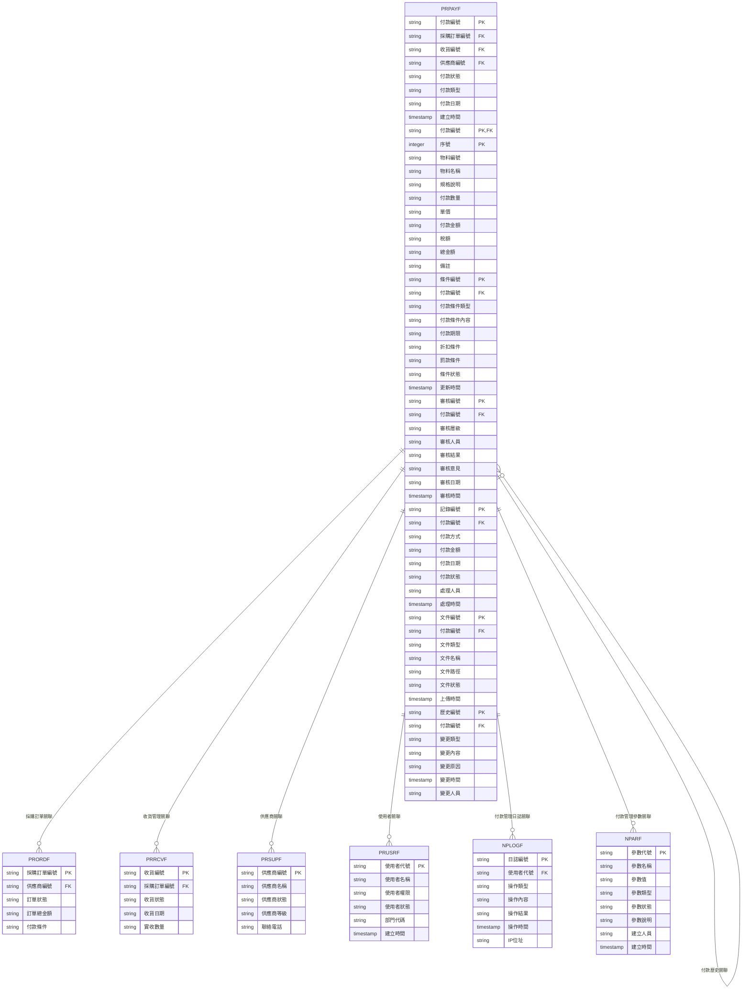

#### 2.1.2 檔案關聯說明
- **PRPAYF (付款管理主檔)**：儲存付款的基本資料和狀態資訊
- **PRPAYF (付款管理明細檔)**：儲存付款的詳細物料資訊
- **PRPAYF (付款管理條件檔)**：儲存付款條件設定
- **PRPAYF (付款管理審核檔)**：儲存付款審核記錄
- **PRPAYF (付款管理記錄檔)**：儲存付款執行記錄
- **PRPAYF (付款管理文件檔)**：儲存付款相關文件
- **PRPAYF (付款管理歷史檔)**：儲存付款變更歷史記錄
- **PRORDF (採購訂單檔)**：儲存採購訂單的基本資料
- **PRRCVF (收貨管理檔)**：儲存收貨管理的基本資料
- **PRSUPF (供應商檔)**：儲存供應商的基本資料
- **PRUSRF (使用者檔)**：儲存使用者的基本資料和權限資訊
- **NPLOGF (付款管理日誌檔)**：儲存付款管理相關的操作日誌記錄
- **NPARF (付款管理參數檔)**：儲存付款管理相關的系統參數

### 2.2 系統架構圖

#### 2.2.1 付款管理系統架構
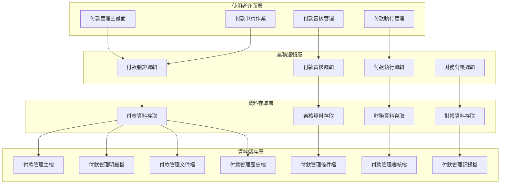

---

## 檔案名稱與欄位規格

### 3.1 主要檔案規格

#### 3.1.1 PRPAYF - 付款管理主檔

| 欄位代號 | 欄位名稱 | 位置 | 長度 | 型態 | 屬性 | 檢核說明 |
|----------|----------|------|------|------|------|----------|
| PAY01 | 公司代碼 | 1-3 | 3 | A | PK | 必填，公司唯一識別碼 |
| PAY02 | 付款編號 | 4-19 | 16 | A | PK | 必填，付款記錄唯一識別碼 |
| PAY03 | 採購訂單編號 | 20-35 | 16 | A | FK | 必填，參照採購訂單檔 |
| PAY04 | 收貨編號 | 36-51 | 16 | A | FK | 必填，參照收貨管理檔 |
| PAY05 | 供應商編號 | 52-66 | 15 | A | FK | 必填，參照供應商檔 |
| PAY06 | 付款狀態 | 67-67 | 1 | A | M | 必填，值：A-申請中、R-審核中、P-已核准、E-執行中、C-已完成、X-已取消 |
| PAY07 | 付款類型 | 68-69 | 2 | A | M | 必填，值：01-預付款、02-貨到付款、03-月結付款、04-分期付款 |
| PAY08 | 付款日期 | 70-77 | 8 | D | M | 必填，預定付款日期 |
| PAY09 | 付款總金額 | 78-87 | 10 | I | M | 必填，付款總金額（元） |
| PAY10 | 付款條件 | 88-92 | 5 | A | M | 必填，付款條件代碼 |
| PAY11 | 付款方式 | 93-94 | 2 | A | M | 必填，值：01-現金、02-支票、03-電匯、04-信用狀 |
| PAY12 | 付款銀行 | 95-114 | 20 | A | M | 必填，付款銀行名稱 |
| PAY13 | 付款帳號 | 115-134 | 20 | A | M | 必填，付款帳號 |
| PAY14 | 付款備註 | 135-174 | 40 | A | O | 選填，付款相關備註 |
| PAY15 | 建立人員 | 175-179 | 5 | A | M | 必填，建立付款記錄的使用者代號 |
| PAY16 | 建立時間 | 180-187 | 8 | T | M | 必填，系統自動產生 |
| PAY17 | 修改人員 | 188-192 | 5 | A | O | 選填，最後修改付款記錄的使用者代號 |
| PAY18 | 修改時間 | 193-200 | 8 | T | O | 選填，最後修改時間 |

#### 3.1.2 PRPAYF - 付款管理明細檔

| 欄位代號 | 欄位名稱 | 位置 | 長度 | 型態 | 屬性 | 檢核說明 |
|----------|----------|------|------|------|------|----------|
| PAYD01 | 付款編號 | 1-16 | 16 | A | PK,FK | 必填，參照PRPAYF.PAY02 |
| PAYD02 | 序號 | 17-19 | 3 | I | PK | 必填，1-999 |
| PAYD03 | 物料編號 | 20-39 | 20 | A | M | 必填，物料編號 |
| PAYD04 | 物料名稱 | 40-69 | 30 | A | M | 必填，物料中文名稱 |
| PAYD05 | 規格說明 | 70-119 | 50 | A | O | 選填，物料規格說明 |
| PAYD06 | 付款數量 | 120-129 | 10 | I | M | 必填，付款數量 |
| PAYD07 | 單價 | 130-139 | 10 | I | M | 必填，單價（元） |
| PAYD08 | 付款金額 | 140-149 | 10 | I | M | 必填，付款金額（元） |
| PAYD09 | 稅額 | 150-159 | 10 | I | M | 必填，稅額（元） |
| PAYD10 | 總金額 | 160-169 | 10 | I | M | 必填，總金額（元） |
| PAYD11 | 備註 | 170-199 | 30 | A | O | 選填，最多30字元 |

#### 3.1.3 PRPAYF - 付款管理條件檔

| 欄位代號 | 欄位名稱 | 位置 | 長度 | 型態 | 屬性 | 檢核說明 |
|----------|----------|------|------|------|------|----------|
| PAYC01 | 條件編號 | 1-15 | 15 | A | PK | 必填，條件記錄唯一識別碼 |
| PAYC02 | 公司代碼 | 16-18 | 3 | A | M | 必填，公司代碼 |
| PAYC03 | 付款編號 | 19-34 | 16 | A | FK | 必填，參照付款管理主檔 |
| PAYC04 | 付款條件類型 | 35-36 | 2 | A | M | 必填，值：01-付款期限、02-折扣條件、03-罰款條件、04-其他條件 |
| PAYC05 | 付款條件內容 | 37-86 | 50 | A | M | 必填，條件詳細內容 |
| PAYC06 | 付款期限 | 87-94 | 8 | D | M | 必填，付款期限日期 |
| PAYC07 | 折扣條件 | 95-104 | 10 | A | O | 選填，折扣條件說明 |
| PAYC08 | 罰款條件 | 105-114 | 10 | A | O | 選填，罰款條件說明 |
| PAYC09 | 條件狀態 | 115-115 | 1 | A | M | 必填，值：A-有效、I-無效、D-已刪除 |
| PAYC10 | 更新人員 | 116-120 | 5 | A | M | 必填，更新條件資料的使用者代號 |
| PAYC11 | 更新時間 | 121-128 | 8 | T | M | 必填，系統自動產生 |
| PAYC12 | 備註 | 129-158 | 30 | A | O | 選填，最多30字元 |

#### 3.1.4 PRPAYF - 付款管理審核檔

| 欄位代號 | 欄位名稱 | 位置 | 長度 | 型態 | 屬性 | 檢核說明 |
|----------|----------|------|------|------|------|----------|
| PAYA01 | 審核編號 | 1-15 | 15 | A | PK | 必填，審核記錄唯一識別碼 |
| PAYA02 | 公司代碼 | 16-18 | 3 | A | M | 必填，公司代碼 |
| PAYA03 | 付款編號 | 19-34 | 16 | A | FK | 必填，參照付款管理主檔 |
| PAYA04 | 審核層級 | 35-36 | 2 | A | M | 必填，值：01-部門審核、02-財務審核、03-主管審核、04-最終審核 |
| PAYA05 | 審核人員 | 37-41 | 5 | A | M | 必填，審核人員代號 |
| PAYA06 | 審核結果 | 42-42 | 1 | A | M | 必填，值：A-核准、R-拒絕、H-保留 |
| PAYA07 | 審核意見 | 43-92 | 50 | A | O | 選填，審核意見說明 |
| PAYA08 | 審核日期 | 93-100 | 8 | D | M | 必填，審核執行日期 |
| PAYA09 | 審核時間 | 101-108 | 8 | T | M | 必填，系統自動產生 |
| PAYA10 | 備註 | 109-138 | 30 | A | O | 選填，最多30字元 |

#### 3.1.5 PRPAYF - 付款管理記錄檔

| 欄位代號 | 欄位名稱 | 位置 | 長度 | 型態 | 屬性 | 檢核說明 |
|----------|----------|------|------|------|------|----------|
| PAYR01 | 記錄編號 | 1-15 | 15 | A | PK | 必填，記錄唯一識別碼 |
| PAYR02 | 公司代碼 | 16-18 | 3 | A | M | 必填，公司代碼 |
| PAYR03 | 付款編號 | 19-34 | 16 | A | FK | 必填，參照付款管理主檔 |
| PAYR04 | 付款方式 | 35-36 | 2 | A | M | 必填，值：01-現金、02-支票、03-電匯、04-信用狀 |
| PAYR05 | 付款金額 | 37-46 | 10 | I | M | 必填，實際付款金額（元） |
| PAYR06 | 付款日期 | 47-54 | 8 | D | M | 必填，實際付款日期 |
| PAYR07 | 付款狀態 | 55-55 | 1 | A | M | 必填，值：P-處理中、S-成功、F-失敗、C-已取消 |
| PAYR08 | 處理人員 | 56-60 | 5 | A | M | 必填，處理付款的人員代號 |
| PAYR09 | 處理時間 | 61-68 | 8 | T | M | 必填，系統自動產生 |
| PAYR10 | 備註 | 69-98 | 30 | A | O | 選填，最多30字元 |

### 3.2 索引資料

#### 3.2.1 主要索引
- **PRPAYF 主鍵索引**：PAY01 + PAY02 (公司代碼 + 付款編號)
- **PRPAYF 採購訂單編號索引**：PAY03 (採購訂單編號)
- **PRPAYF 收貨編號索引**：PAY04 (收貨編號)
- **PRPAYF 供應商編號索引**：PAY05 (供應商編號)
- **PRPAYF 付款狀態索引**：PAY06 (付款狀態)
- **PRPAYF 付款日期索引**：PAY08 (付款日期)

#### 3.2.2 次要索引
- **PRPAYF 主鍵索引**：PAYD01 + PAYD02 (付款編號 + 序號)
- **PRPAYF 付款編號索引**：PAYD01 (付款編號)
- **PRPAYF 物料編號索引**：PAYD03 (物料編號)
- **PRPAYC 主鍵索引**：PAYC01 (條件編號)
- **PRPAYC 付款編號索引**：PAYC03 (付款編號)
- **PRPAYA 主鍵索引**：PAYA01 (審核編號)
- **PRPAYA 付款編號索引**：PAYA03 (付款編號)
- **PRPAYR 主鍵索引**：PAYR01 (記錄編號)
- **PRPAYR 付款編號索引**：PAYR03 (付款編號)

---

## 輸出/入螢幕布局與說明

### 4.1 付款管理主畫面

#### 4.1.1 畫面布局
```
┌─────────────────────────────────────────────────────────────┐
│                    付款管理系統                            │
├─────────────────────────────────────────────────────────────┤
│ 功能選項：                                                  │
│  [1]付款申請作業  [2]付款審核管理  [3]付款執行管理  [4]財務對帳│
│  [5]付款查詢  [6]報表分析  [7]系統設定  [8]離開            │
├─────────────────────────────────────────────────────────────┤
│ 系統狀態：                                                  │
│  付款總數：[156] 申請中：[23] 審核中：[45] 已核准：[34]      │
│  執行中：[28] 已完成：[26] 已取消：[0]                      │
│  最後更新：[2024/12/21 14:30:00] 更新人員：[ADMIN]        │
├─────────────────────────────────────────────────────────────┤
│ 快速功能：                                                  │
│  [付款申請] [付款審核] [付款執行] [財務對帳]                │
├─────────────────────────────────────────────────────────────┤
│ 功能鍵：F1=說明  F3=離開  F4=申請  F6=審核  F8=執行  F12=取消│
└─────────────────────────────────────────────────────────────┘
```

#### 4.1.2 畫面說明
- **功能選項區**：提供付款管理的主要功能選項
- **系統狀態區**：顯示當前付款的狀態和統計資訊
- **快速功能區**：提供常用的快速操作功能
- **功能鍵區**：說明可使用的功能鍵

### 4.2 付款申請作業畫面

#### 4.2.1 畫面布局
```
┌─────────────────────────────────────────────────────────────┐
│                      付款申請作業                          │
├─────────────────────────────────────────────────────────────┤
│ 查詢條件：                                                  │
│  付款編號：[                ] 供應商：[               ▼]    │
│  付款狀態：[全部 ▼] 付款日期：[        ] [查詢] [清除]        │
├─────────────────────────────────────────────────────────────┤
│ 付款清單：                                                  │
│ ┌─────┬────────────────┬──────────┬──────────┬──────────┬────────┐ │
│ │序號 │付款編號        │供應商    │付款狀態  │付款金額  │付款日期 │ │
│ ├─────┼────────────────┼──────────┼──────────┼──────────┼────────┤ │
│ │  1  │PAY202412210001 │ABC供應商 │申請中    │$50,000   │2024/12/25│ │
│ │  2  │PAY202412210002 │XYZ供應商 │審核中    │$25,000   │2024/12/30│ │
│ └─────┴────────────────┴──────────┴──────────┴──────────┴────────┘ │
├─────────────────────────────────────────────────────────────┤
│ 操作：[付款申請] [付款修改] [付款取消] [付款查詢]            │
│ 功能鍵：F1=說明  F3=離開  F4=申請  F6=修改  F8=取消  F12=取消│
└─────────────────────────────────────────────────────────────┘
```

---

## 處理流程程序說明

### 5.1 付款申請流程

#### 5.1.1 主要處理流程
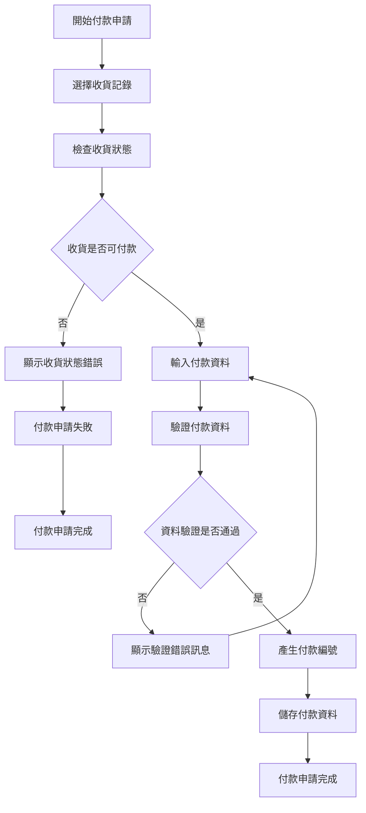

#### 5.1.2 資料驗證規則
1. **收貨狀態驗證**：檢查收貨記錄是否為可付款狀態
2. **付款金額驗證**：檢查付款金額是否與收貨金額相符
3. **付款條件驗證**：檢查付款條件是否符合約定
4. **權限驗證**：檢查使用者是否有付款申請權限

### 5.2 付款審核流程

#### 5.2.1 主要處理流程
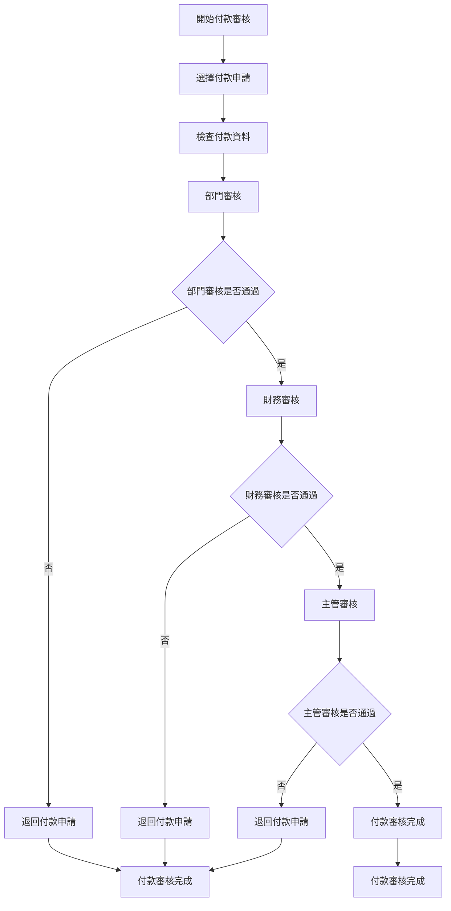

### 5.3 付款執行流程

#### 5.3.1 主要處理流程
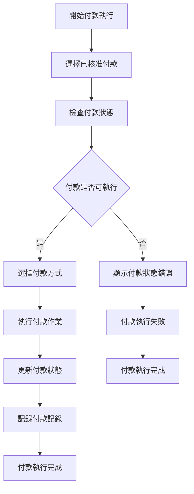

### 5.4 財務對帳流程

#### 5.4.1 主要處理流程
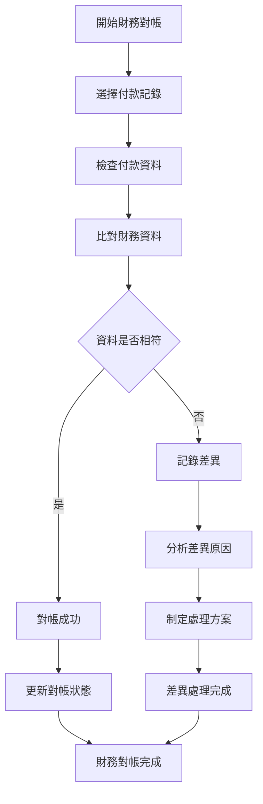

---

## 子程序處理邏輯說明

### 6.1 付款編號產生子程序

#### 6.1.1 編號產生邏輯
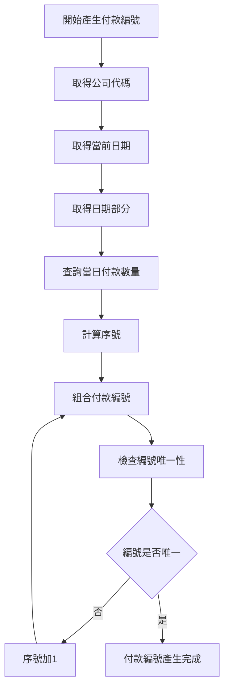

#### 6.1.2 編號格式說明
- **付款編號格式**：PAY + 日期(8位) + 序號(4位)
- **範例**：PAY + 20241221 + 0001 = PAY202412210001

### 6.2 付款審核子程序

#### 6.2.1 付款審核邏輯
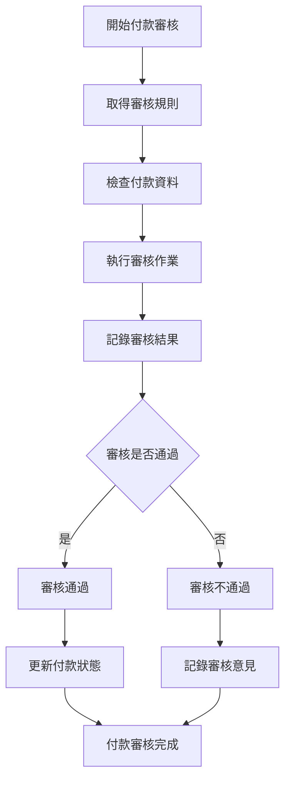

### 6.3 付款執行子程序

#### 6.3.1 付款執行邏輯
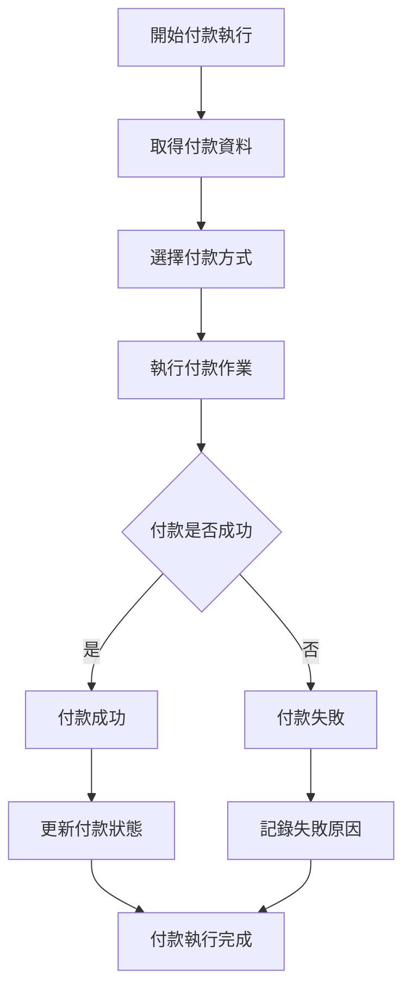

### 6.4 財務對帳子程序

#### 6.4.1 財務對帳邏輯
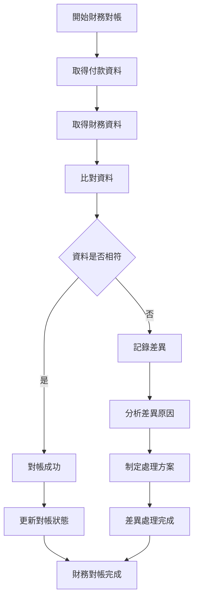

---

## 錯誤處理程序說明與訊息清冊

### 7.1 錯誤處理程序

#### 7.1.1 錯誤處理流程
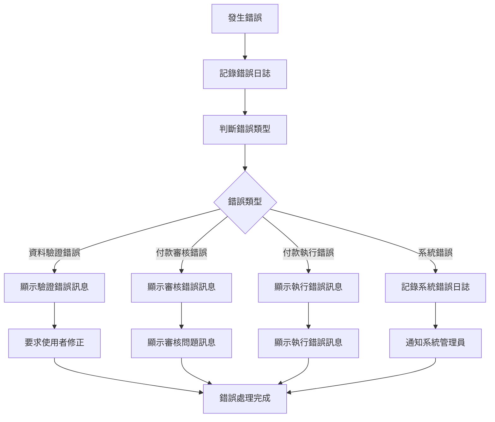

### 7.2 錯誤訊息清冊

#### 7.2.1 資料驗證錯誤訊息

| 錯誤代碼 | 錯誤訊息 | 錯誤原因 | 解決方法 |
|----------|----------|----------|----------|
| **PR701** | 付款編號不能為空 | 付款編號為必填欄位 | 請輸入付款編號 |
| **PR702** | 採購訂單編號不能為空 | 採購訂單編號為必填欄位 | 請選擇採購訂單 |
| **PR703** | 收貨編號不能為空 | 收貨編號為必填欄位 | 請選擇收貨記錄 |
| **PR704** | 供應商編號不能為空 | 供應商編號為必填欄位 | 請選擇供應商 |
| **PR705** | 付款金額不能為空 | 付款金額為必填欄位 | 請輸入付款金額 |

#### 7.2.2 付款審核錯誤訊息

| 錯誤代碼 | 錯誤訊息 | 錯誤原因 | 解決方法 |
|----------|----------|----------|----------|
| **PR801** | 審核規則不存在 | 審核規則未設定 | 請先設定審核規則 |
| **PR802** | 審核人員權限不足 | 審核人員沒有審核權限 | 請選擇有審核權限的人員 |
| **PR803** | 審核結果不能為空 | 審核結果為必填欄位 | 請輸入審核結果 |
| **PR804** | 審核層級不存在 | 審核層級未設定 | 請先設定審核層級 |
| **PR805** | 審核記錄儲存失敗 | 審核記錄儲存操作失敗 | 請聯繫系統管理員 |

#### 7.2.3 付款執行錯誤訊息

| 錯誤代碼 | 錯誤訊息 | 錯誤原因 | 解決方法 |
|----------|----------|----------|----------|
| **PR901** | 付款記錄不存在 | 付款記錄未建立 | 請先建立付款記錄 |
| **PR902** | 付款狀態不正確 | 付款狀態不允許執行 | 請檢查付款狀態 |
| **PR903** | 付款執行失敗 | 付款執行操作失敗 | 請聯繫系統管理員 |
| **PR904** | 付款記錄鎖定失敗 | 付款記錄被鎖定 | 請等待付款記錄解鎖 |
| **PR905** | 付款記錄損壞 | 付款記錄資料損壞 | 請聯繫系統管理員 |

### 7.3 錯誤處理建議

#### 7.3.1 使用者操作建議
1. **檢查必填欄位**：確保所有必填欄位都已填寫
2. **驗證資料格式**：檢查資料格式是否符合要求
3. **檢查權限設定**：確認有執行該操作的權限
4. **檢查系統狀態**：確認系統運行正常

#### 7.3.2 系統管理建議
1. **監控系統錯誤**：定期檢查系統錯誤日誌
2. **檢查審核規則**：定期檢查付款審核規則設定
3. **檢查付款設定**：定期檢查付款相關設定
4. **備份重要資料**：定期備份付款管理相關資料

---

## 備註

### 8.1 開發注意事項

#### 8.1.1 程式開發注意事項
1. **資料完整性**：確保付款管理資料的完整性和一致性
2. **審核機制**：實作完整的付款審核機制
3. **付款執行**：實作準確的付款執行機制
4. **財務對帳**：提供完整的財務對帳機制
5. **日誌記錄**：記錄詳細的操作日誌，便於問題診斷

#### 8.1.2 測試注意事項
1. **單元測試**：每個功能模組都必須進行單元測試
2. **整合測試**：測試各模組間的整合情況
3. **付款審核測試**：測試付款審核功能的完整性
4. **付款執行測試**：測試付款執行功能的準確性
5. **使用者接受度測試**：進行使用者接受度測試

### 8.2 維護注意事項

#### 8.2.1 日常維護注意事項
1. **監控系統狀態**：定期監控系統的運行狀態
2. **檢查審核規則**：定期檢查付款審核規則設定
3. **檢查付款設定**：定期檢查付款相關設定
4. **清理過期資料**：定期清理過期的歷史資料
5. **備份重要資料**：定期備份重要的付款管理資料

#### 8.2.2 版本更新注意事項
1. **相容性檢查**：更新前必須檢查與現有系統的相容性
2. **資料遷移**：制定詳細的資料遷移計畫
3. **使用者通知**：提前通知使用者版本更新計畫
4. **回滾計畫**：制定詳細的回滾計畫
5. **測試驗證**：更新後必須進行充分的測試驗證

### 8.3 未來擴充建議

#### 8.3.1 功能擴充建議
1. **電子化付款**：實作電子化付款流程
2. **行動化支援**：支援行動裝置付款作業
3. **自動化審核**：實作自動化付款審核
4. **智慧化對帳**：整合AI功能，提供智慧化對帳建議
5. **供應商付款績效分析**：增加供應商付款績效分析功能

#### 8.3.2 技術改進建議
1. **雲端部署**：考慮採用雲端部署模式
2. **微服務架構**：考慮採用微服務架構
3. **API整合**：提供標準化的API介面
4. **資料分析**：整合資料分析功能
5. **區塊鏈整合**：整合區塊鏈技術，實現安全付款

---

## 附錄

### A.1 相關文件清單
- 採購模組程式功能規格書 - 採購管理
- 採購模組程式功能規格書 - 供應商管理
- 採購模組程式功能規格書 - 採購申請
- 採購模組程式功能規格書 - 採購訂單
- 採購模組程式功能規格書 - 收貨管理
- 採購模組程式功能規格書 - 庫存管理
- 採購模組程式功能規格書 - 報表分析
- 採購模組程式功能規格書 - 系統管理
- 採購模組業務邏輯分析與API設計
- 採購模組操作手冊 - 付款管理

### A.2 修訂記錄

| 版本 | 修訂日期 | 修訂人員 | 修訂內容 | 修訂原因 |
|------|----------|----------|----------|----------|
| v1.0 | 2024/12/21 | 系統分析師 | 初始版本建立 | 新功能開發 |

### A.3 聯絡資訊
- **專案經理**：[專案經理姓名]
- **系統分析師**：[系統分析師姓名]
- **技術支援**：[技術支援聯絡方式]
- **專案信箱**：[專案信箱地址]
