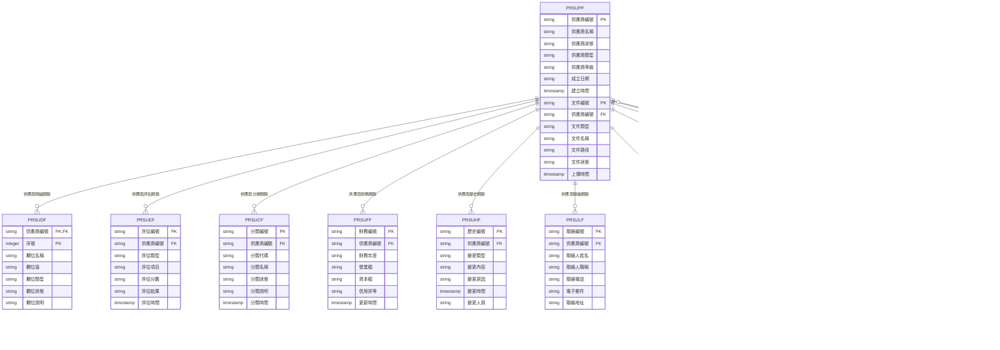
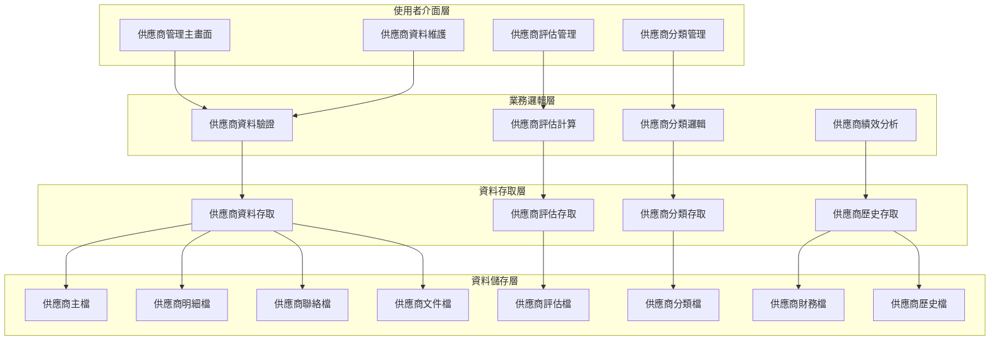
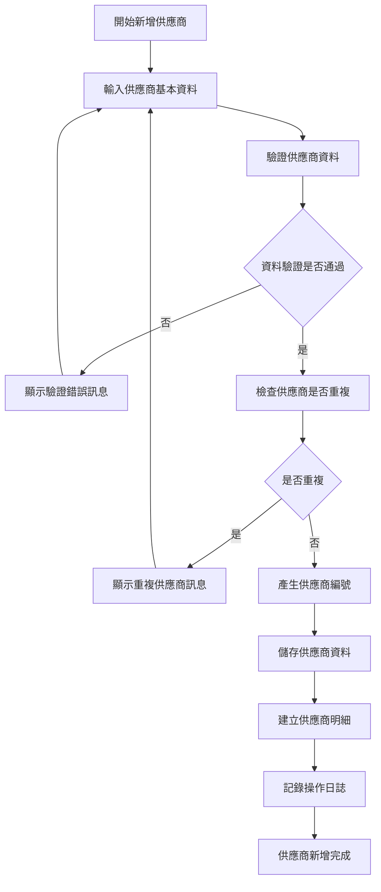
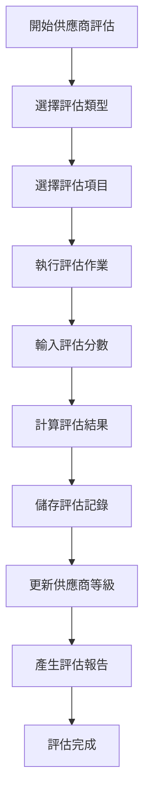
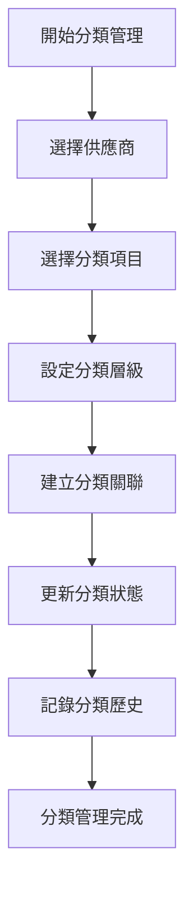
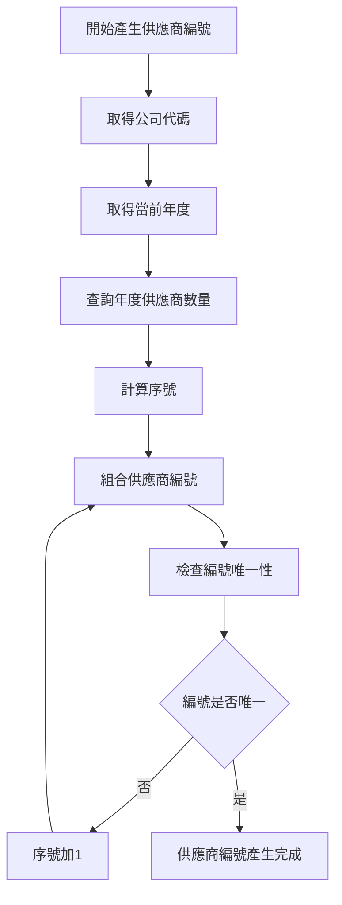
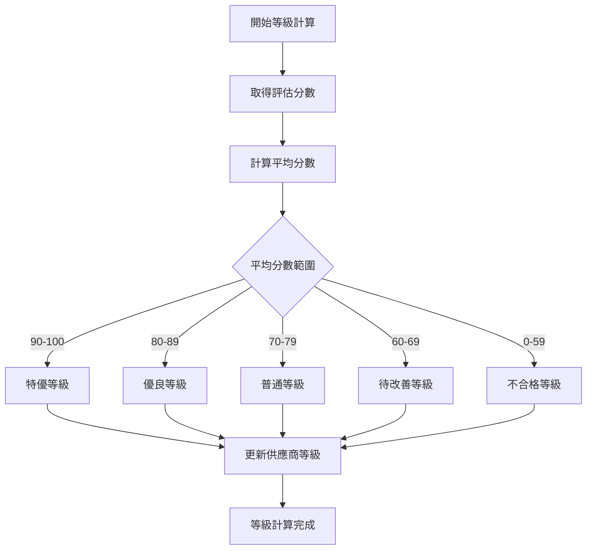
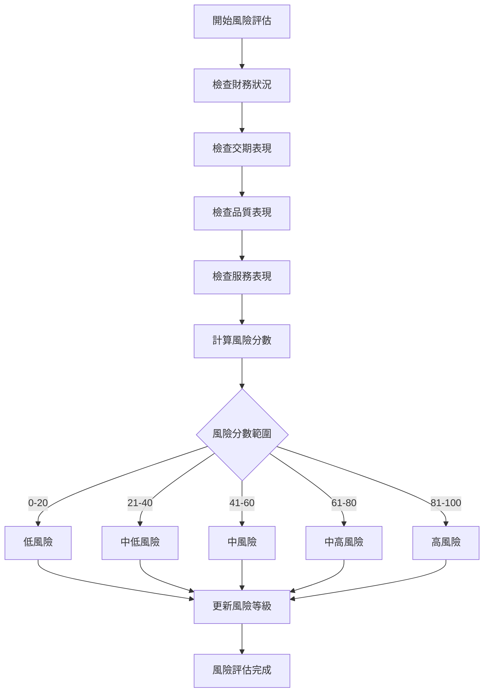
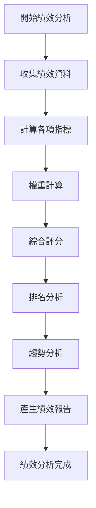
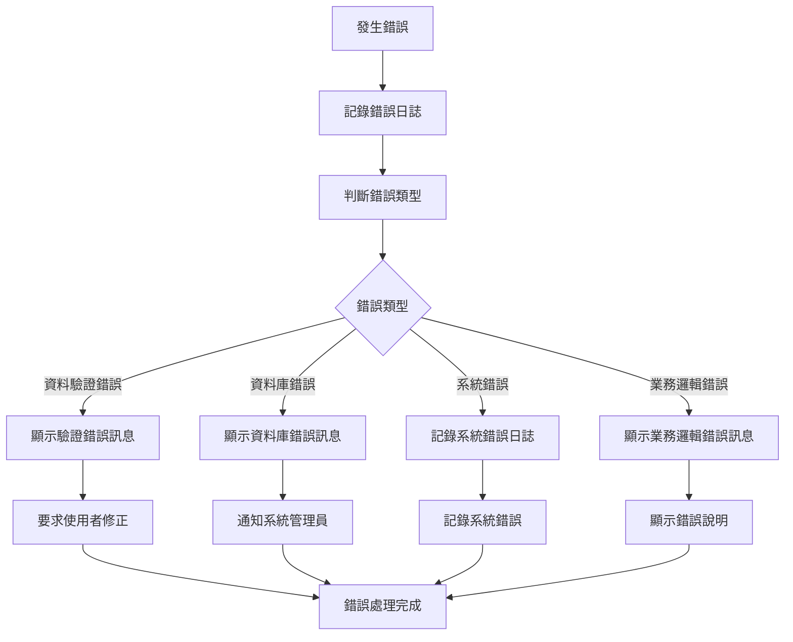

# 採購模組 程式功能規格書 - 供應商管理

## 文件基本資訊

| 項目 | 說明 |
|------|------|
| **文件名稱** | 採購模組程式功能規格書 - 供應商管理 |
| **模組代號** | PR |
| **版本** | v1.0 |
| **建立日期** | 2024年12月21日 |
| **建立人員** | 系統分析師 |
| **審核人員** | 專案經理 |
| **文件狀態** | 初稿 |
| **最後更新** | 2024年12月21日 |

---

## 目錄

1. [基本資料](#基本資料)
2. [檔案架構與關聯圖](#檔案架構與關聯圖)
3. [檔案名稱與欄位規格](#檔案名稱與欄位規格)
4. [輸出/入螢幕布局與說明](#輸出入螢幕布局與說明)
5. [處理流程程序說明](#處理流程程序說明)
6. [子程序處理邏輯說明](#子程序處理邏輯說明)
7. [錯誤處理程序說明與訊息清冊](#錯誤處理程序說明與訊息清冊)
8. [備註](#備註)

---

## 基本資料

### 1.1 模組概述

#### 1.1.1 模組功能說明
採購模組的供應商管理功能主要負責管理企業的供應商基本資料、供應商評估、供應商分類、供應商關係維護等業務。此功能為企業提供完整的供應商生命週期管理，從供應商開發、資格審查、績效評估到關係維護，確保供應商品質和供應鏈的穩定性，支援企業的採購策略和成本控制目標。

#### 1.1.2 模組特色
- **完整供應商生命週期管理**：從開發、審查、評估到維護的完整流程
- **多維度供應商評估**：品質、交期、價格、服務等多面向評估體系
- **供應商分類管理**：根據業務需求和供應商能力進行分類管理
- **供應商績效追蹤**：即時監控供應商績效，支援決策分析
- **供應商關係維護**：建立長期合作關係，提升供應鏈穩定性
- **風險管理與預警**：識別供應商風險，建立預警機制

#### 1.1.3 適用範圍
適用於採購系統的供應商管理作業，包括供應商基本資料維護、供應商資格審查、供應商績效評估、供應商分類管理、供應商關係維護、供應商風險管理等各類供應商相關業務功能。

### 1.2 技術架構

#### 1.2.1 開發技術
- **程式語言**：RPG、CL、SQL
- **資料庫**：DB2 for i (IBM i)
- **開發工具**：IBM i 開發環境
- **報表工具**：IBM Cognos、Crystal Reports
- **部署環境**：IBM i 7.4

#### 1.2.2 系統需求
- **硬體需求**：IBM i 伺服器、終端機、印表機
- **軟體需求**：IBM i 作業系統、DB2 for i、IBM i 開發環境
- **網路需求**：企業內部網路連線、終端機連線

---

## 檔案架構與關聯圖

### 2.1 資料庫檔案架構

#### 2.1.1 主要資料表


#### 2.1.2 檔案關聯說明
- **PRSUPF (供應商主檔)**：儲存供應商的基本資料和狀態資訊
- **PRSUDF (供應商明細檔)**：儲存供應商的詳細欄位資料
- **PRSUEF (供應商評估檔)**：儲存供應商的評估記錄和分數
- **PRSUCF (供應商分類檔)**：儲存供應商的分類資訊
- **PRSUFF (供應商財務檔)**：儲存供應商的財務相關資料
- **PRSUHF (供應商歷史檔)**：儲存供應商的變更歷史記錄
- **PRSULF (供應商聯絡檔)**：儲存供應商的聯絡人資訊
- **PRSUPF (供應商文件檔)**：儲存供應商的相關文件
- **PRUSRF (使用者檔)**：儲存使用者的基本資料和權限資訊
- **NPLOGF (供應商日誌檔)**：儲存供應商相關的操作日誌記錄
- **NPARF (供應商參數檔)**：儲存供應商相關的系統參數

### 2.2 系統架構圖

#### 2.2.1 供應商管理系統架構


---

## 檔案名稱與欄位規格

### 3.1 主要檔案規格

#### 3.1.1 PRSUPF - 供應商主檔

| 欄位代號 | 欄位名稱 | 位置 | 長度 | 型態 | 屬性 | 檢核說明 |
|----------|----------|------|------|------|------|----------|
| SUP01 | 公司代碼 | 1-3 | 3 | A | PK | 必填，公司唯一識別碼 |
| SUP02 | 供應商編號 | 4-15 | 12 | A | PK | 必填，供應商唯一識別碼 |
| SUP03 | 供應商名稱 | 16-45 | 30 | A | M | 必填，供應商的中文名稱 |
| SUP04 | 供應商簡稱 | 46-65 | 20 | A | O | 選填，供應商的簡稱 |
| SUP05 | 統一編號 | 66-73 | 8 | A | M | 必填，統一編號格式驗證 |
| SUP06 | 供應商狀態 | 74-74 | 1 | A | M | 必填，值：A-啟用、I-停用、S-暫停、T-終止 |
| SUP07 | 供應商類型 | 75-76 | 2 | A | M | 必填，值：01-製造商、02-代理商、03-貿易商、04-服務商、05-其他 |
| SUP08 | 供應商等級 | 77-77 | 1 | A | M | 必填，值：A-特優、B-優良、C-普通、D-待改善、E-不合格 |
| SUP09 | 成立日期 | 78-85 | 8 | D | O | 選填，供應商成立日期 |
| SUP10 | 資本額 | 86-95 | 10 | I | O | 選填，供應商資本額（萬元） |
| SUP11 | 營業額 | 96-105 | 10 | I | O | 選填，供應商年營業額（萬元） |
| SUP12 | 員工數 | 106-110 | 5 | I | O | 選填，供應商員工數 |
| SUP13 | 主要產品 | 111-140 | 30 | A | O | 選填，供應商主要產品或服務 |
| SUP14 | 供應商地址 | 141-200 | 60 | A | M | 必填，供應商完整地址 |
| SUP15 | 供應商電話 | 201-215 | 15 | A | M | 必填，供應商主要聯絡電話 |
| SUP16 | 供應商傳真 | 216-230 | 15 | A | O | 選填，供應商傳真號碼 |
| SUP17 | 供應商網址 | 231-280 | 50 | A | O | 選填，供應商官方網站 |
| SUP18 | 付款條件 | 281-285 | 5 | A | M | 必填，付款條件代碼 |
| SUP19 | 信用額度 | 286-295 | 10 | I | O | 選填，供應商信用額度（萬元） |
| SUP20 | 信用評等 | 296-296 | 1 | A | O | 選填，值：A-優、B-良、C-中、D-差 |
| SUP21 | 供應商備註 | 297-336 | 40 | A | O | 選填，供應商相關備註 |
| SUP22 | 建立人員 | 337-341 | 5 | A | M | 必填，建立供應商的使用者代號 |
| SUP23 | 建立時間 | 342-349 | 8 | T | M | 必填，系統自動產生 |
| SUP24 | 修改人員 | 350-354 | 5 | A | O | 選填，最後修改供應商的使用者代號 |
| SUP25 | 修改時間 | 355-362 | 8 | T | O | 選填，最後修改時間 |

#### 3.1.2 PRSUDF - 供應商明細檔

| 欄位代號 | 欄位名稱 | 位置 | 長度 | 型態 | 屬性 | 檢核說明 |
|----------|----------|------|------|------|------|----------|
| SUD01 | 供應商編號 | 1-12 | 12 | A | PK,FK | 必填，參照PRSUPF.SUP02 |
| SUD02 | 序號 | 13-15 | 3 | I | PK | 必填，1-999 |
| SUD03 | 欄位名稱 | 16-45 | 30 | A | M | 必填，明細欄位的名稱 |
| SUD04 | 欄位值 | 46-95 | 50 | A | O | 選填，明細欄位的值 |
| SUD05 | 欄位類型 | 96-97 | 2 | A | M | 必填，值：01-文字、02-數值、03-日期、04-布林、05-選項 |
| SUD06 | 欄位狀態 | 98-98 | 1 | A | M | 必填，值：A-啟用、I-停用 |
| SUD07 | 欄位說明 | 99-148 | 50 | A | O | 選填，明細欄位的說明 |
| SUD08 | 排序順序 | 149-151 | 3 | I | O | 選填，明細欄位的顯示順序 |
| SUD09 | 是否必填 | 152-152 | 1 | A | M | 必填，值：Y-是、N-否 |
| SUD10 | 驗證規則 | 153-202 | 50 | A | O | 選填，明細欄位的驗證規則 |
| SUD11 | 備註 | 203-232 | 30 | A | O | 選填，最多30字元 |

#### 3.1.3 PRSUEF - 供應商評估檔

| 欄位代號 | 欄位名稱 | 位置 | 長度 | 型態 | 屬性 | 檢核說明 |
|----------|----------|------|------|------|------|----------|
| SUE01 | 評估編號 | 1-15 | 15 | A | PK | 必填，評估記錄唯一識別碼 |
| SUE02 | 公司代碼 | 16-18 | 3 | A | M | 必填，公司代碼 |
| SUE03 | 供應商編號 | 19-30 | 12 | A | FK | 必填，參照供應商主檔 |
| SUE04 | 評估類型 | 31-32 | 2 | A | M | 必填，值：01-資格評估、02-績效評估、03-風險評估、04-年度評估 |
| SUE05 | 評估項目 | 33-62 | 30 | A | M | 必填，評估的具體項目 |
| SUE06 | 評估分數 | 63-65 | 3 | I | M | 必填，評估分數（0-100） |
| SUE07 | 評估結果 | 66-66 | 1 | A | M | 必填，值：A-優、B-良、C-中、D-差、E-不合格 |
| SUE08 | 評估標準 | 67-116 | 50 | A | O | 選填，評估的標準說明 |
| SUE09 | 評估人員 | 117-121 | 5 | A | M | 必填，執行評估的使用者代號 |
| SUE10 | 評估時間 | 122-129 | 8 | T | M | 必填，評估執行的時間 |
| SUE11 | 評估備註 | 130-179 | 50 | A | O | 選填，評估相關備註 |
| SUE12 | 下次評估日期 | 180-187 | 8 | D | O | 選填，下次評估的預定日期 |
| SUE13 | 備註 | 188-217 | 30 | A | O | 選填，最多30字元 |

#### 3.1.4 PRSUCF - 供應商分類檔

| 欄位代號 | 欄位名稱 | 位置 | 長度 | 型態 | 屬性 | 檢核說明 |
|----------|----------|------|------|------|------|----------|
| SUC01 | 分類編號 | 1-15 | 15 | A | PK | 必填，分類記錄唯一識別碼 |
| SUC02 | 公司代碼 | 16-18 | 3 | A | M | 必填，公司代碼 |
| SUC03 | 供應商編號 | 19-30 | 12 | A | FK | 必填，參照供應商主檔 |
| SUC04 | 分類代碼 | 31-35 | 5 | A | M | 必填，分類的代碼 |
| SUC05 | 分類名稱 | 36-65 | 30 | A | M | 必填，分類的中文名稱 |
| SUC06 | 分類層級 | 66-67 | 2 | I | M | 必填，分類的層級（1-9） |
| SUC07 | 上層分類 | 68-72 | 5 | A | O | 選填，上層分類的代碼 |
| SUC08 | 分類狀態 | 73-73 | 1 | A | M | 必填，值：A-啟用、I-停用 |
| SUC09 | 分類說明 | 74-123 | 50 | A | O | 選填，分類的詳細說明 |
| SUC10 | 排序順序 | 124-126 | 3 | I | O | 選填，分類的顯示順序 |
| SUC11 | 建立人員 | 127-131 | 5 | A | M | 必填，建立分類的使用者代號 |
| SUC12 | 建立時間 | 132-139 | 8 | T | M | 必填，系統自動產生 |
| SUC13 | 備註 | 140-169 | 30 | A | O | 選填，最多30字元 |

#### 3.1.5 PRSUFF - 供應商財務檔

| 欄位代號 | 欄位名稱 | 位置 | 長度 | 型態 | 屬性 | 檢核說明 |
|----------|----------|------|------|------|------|----------|
| SUF01 | 財務編號 | 1-15 | 15 | A | PK | 必填，財務記錄唯一識別碼 |
| SUF02 | 公司代碼 | 16-18 | 3 | A | M | 必填，公司代碼 |
| SUF03 | 供應商編號 | 19-30 | 12 | A | FK | 必填，參照供應商主檔 |
| SUF04 | 財務年度 | 31-34 | 4 | I | M | 必填，財務資料的年度 |
| SUF05 | 營業額 | 35-44 | 10 | I | O | 選填，年度營業額（萬元） |
| SUF06 | 資本額 | 45-54 | 10 | I | O | 選填，資本額（萬元） |
| SUF07 | 淨利潤 | 55-64 | 10 | I | O | 選填，年度淨利潤（萬元） |
| SUF08 | 資產總額 | 65-74 | 10 | I | O | 選填，資產總額（萬元） |
| SUF09 | 負債總額 | 75-84 | 10 | I | O | 選填，負債總額（萬元） |
| SUF10 | 信用評等 | 85-85 | 1 | A | O | 選填，值：A-優、B-良、C-中、D-差 |
| SUF11 | 信用額度 | 86-95 | 10 | I | O | 選填，信用額度（萬元） |
| SUF12 | 付款條件 | 96-100 | 5 | A | O | 選填，付款條件代碼 |
| SUF13 | 更新人員 | 101-105 | 5 | A | M | 必填，更新財務資料的使用者代號 |
| SUF14 | 更新時間 | 106-113 | 8 | T | M | 必填，系統自動產生 |
| SUF15 | 備註 | 114-143 | 30 | A | O | 選填，最多30字元 |

### 3.2 索引資料

#### 3.2.1 主要索引
- **PRSUPF 主鍵索引**：SUP01 + SUP02 (公司代碼 + 供應商編號)
- **PRSUPF 統一編號索引**：SUP05 (統一編號)
- **PRSUPF 供應商狀態索引**：SUP06 (供應商狀態)
- **PRSUPF 供應商類型索引**：SUP07 (供應商類型)
- **PRSUPF 供應商等級索引**：SUP08 (供應商等級)

#### 3.2.2 次要索引
- **PRSUDF 主鍵索引**：SUD01 + SUD02 (供應商編號 + 序號)
- **PRSUDF 供應商編號索引**：SUD01 (供應商編號)
- **PRSUEF 主鍵索引**：SUE01 (評估編號)
- **PRSUEF 供應商編號索引**：SUE03 (供應商編號)
- **PRSUEF 評估類型索引**：SUE04 (評估類型)
- **PRSUCF 主鍵索引**：SUC01 (分類編號)
- **PRSUCF 供應商編號索引**：SUC03 (供應商編號)
- **PRSUCF 分類代碼索引**：SUC04 (分類代碼)
- **PRSUFF 主鍵索引**：SUF01 (財務編號)
- **PRSUFF 供應商編號索引**：SUF03 (供應商編號)
- **PRSUFF 財務年度索引**：SUF04 (財務年度)

---

## 輸出/入螢幕布局與說明

### 4.1 供應商管理主畫面

#### 4.1.1 畫面布局
```
┌─────────────────────────────────────────────────────────────┐
│                    供應商管理系統                          │
├─────────────────────────────────────────────────────────────┤
│ 功能選項：                                                  │
│  [1]供應商資料維護  [2]供應商評估管理  [3]供應商分類管理    │
│  [4]供應商績效分析  [5]供應商風險管理  [6]報表查詢  [7]離開│
├─────────────────────────────────────────────────────────────┤
│ 系統狀態：                                                  │
│  供應商總數：[1,234] 啟用中：[1,156] 停用中：[45] 暫停中：[33]│
│  特優等級：[89] 優良等級：[234] 普通等級：[567] 待改善：[234] │
│  最後更新：[2024/12/21 14:30:00] 更新人員：[ADMIN]        │
├─────────────────────────────────────────────────────────────┤
│ 快速功能：                                                  │
│  [新增供應商] [供應商查詢] [評估報告] [風險預警]            │
├─────────────────────────────────────────────────────────────┤
│ 功能鍵：F1=說明  F3=離開  F4=新增  F6=查詢  F8=評估  F12=取消│
└─────────────────────────────────────────────────────────────┘
```

#### 4.1.2 畫面說明
- **功能選項區**：提供供應商管理的主要功能選項
- **系統狀態區**：顯示當前供應商的狀態和統計資訊
- **快速功能區**：提供常用的快速操作功能
- **功能鍵區**：說明可使用的功能鍵

### 4.2 供應商資料維護畫面

#### 4.2.1 畫面布局
```
┌─────────────────────────────────────────────────────────────┐
│                      供應商資料維護                        │
├─────────────────────────────────────────────────────────────┤
│ 查詢條件：                                                  │
│  供應商編號：[        ] 供應商名稱：[                    ]  │
│  供應商狀態：[全部 ▼] 供應商類型：[全部 ▼] [查詢] [清除]    │
├─────────────────────────────────────────────────────────────┤
│ 供應商清單：                                                │
│ ┌─────┬──────────┬──────────┬──────────┬──────────┬────────┐ │
│ │序號 │供應商編號│供應商名稱│供應商類型│供應商等級│狀態    │ │
│ ├─────┼──────────┼──────────┼──────────┼──────────┼────────┤ │
│ │  1  │SUP001    │ABC製造商 │製造商    │特優      │啟用    │ │
│ │  2  │SUP002    │XYZ代理商 │代理商    │優良      │啟用    │ │
│ └─────┴──────────┴──────────┴──────────┴──────────┴────────┘ │
├─────────────────────────────────────────────────────────────┤
│ 操作：[新增供應商] [修改供應商] [停用供應商] [啟用供應商]    │
│ 功能鍵：F1=說明  F3=離開  F4=新增  F6=修改  F8=停用  F12=取消│
└─────────────────────────────────────────────────────────────┘
```

---

## 處理流程程序說明

### 5.1 供應商新增流程

#### 5.1.1 主要處理流程


#### 5.1.2 資料驗證規則
1. **必填欄位驗證**：供應商名稱、統一編號、供應商狀態、供應商類型、供應商等級等必填欄位
2. **統一編號驗證**：統一編號必須符合8位數字格式
3. **電話號碼驗證**：電話號碼必須符合台灣電話號碼格式
4. **重複性驗證**：統一編號和供應商名稱不能重複

### 5.2 供應商評估流程

#### 5.2.1 主要處理流程


### 5.3 供應商分類管理流程

#### 5.3.1 主要處理流程


---

## 子程序處理邏輯說明

### 6.1 供應商編號產生子程序

#### 6.1.1 編號產生邏輯


#### 6.1.2 編號格式說明
- **供應商編號格式**：公司代碼(3位) + 年度(2位) + 序號(7位)
- **範例**：001 + 24 + 0000001 = 001240000001

### 6.2 供應商等級計算子程序

#### 6.2.1 等級計算邏輯


#### 6.2.2 等級計算規則
1. **特優等級**：平均分數90分以上
2. **優良等級**：平均分數80-89分
3. **普通等級**：平均分數70-79分
4. **待改善等級**：平均分數60-69分
5. **不合格等級**：平均分數60分以下

### 6.3 供應商風險評估子程序

#### 6.3.1 風險評估邏輯


### 6.4 供應商績效分析子程序

#### 6.4.1 績效分析邏輯


---

## 錯誤處理程序說明與訊息清冊

### 7.1 錯誤處理程序

#### 7.1.1 錯誤處理流程


### 7.2 錯誤訊息清冊

#### 7.2.1 資料驗證錯誤訊息

| 錯誤代碼 | 錯誤訊息 | 錯誤原因 | 解決方法 |
|----------|----------|----------|----------|
| **PR701** | 供應商名稱不能為空 | 供應商名稱為必填欄位 | 請輸入供應商名稱 |
| **PR702** | 統一編號格式錯誤 | 統一編號必須為8位數字 | 請檢查統一編號格式 |
| **PR703** | 統一編號重複 | 該統一編號已存在 | 請使用不同的統一編號 |
| **PR704** | 供應商名稱重複 | 該供應商名稱已存在 | 請使用不同的供應商名稱 |
| **PR705** | 電話號碼格式錯誤 | 電話號碼格式不正確 | 請檢查電話號碼格式 |

#### 7.2.2 資料庫錯誤訊息

| 錯誤代碼 | 錯誤訊息 | 錯誤原因 | 解決方法 |
|----------|----------|----------|----------|
| **PR801** | 資料庫連線失敗 | 無法連接到資料庫 | 請聯繫系統管理員檢查資料庫連線 |
| **PR802** | 資料儲存失敗 | 資料儲存操作失敗 | 請檢查資料格式，或聯繫系統管理員 |
| **PR803** | 資料查詢失敗 | 資料查詢操作失敗 | 請檢查查詢條件，或聯繫系統管理員 |
| **PR804** | 資料更新失敗 | 資料更新操作失敗 | 請檢查更新資料，或聯繫系統管理員 |
| **PR805** | 資料刪除失敗 | 資料刪除操作失敗 | 請檢查刪除條件，或聯繫系統管理員 |

#### 7.2.3 業務邏輯錯誤訊息

| 錯誤代碼 | 錯誤訊息 | 錯誤原因 | 解決方法 |
|----------|----------|----------|----------|
| **PR901** | 供應商狀態不允許修改 | 當前狀態不允許進行該操作 | 請先變更供應商狀態 |
| **PR902** | 評估分數超出範圍 | 評估分數必須在0-100之間 | 請輸入正確的評估分數 |
| **PR903** | 分類層級超出限制 | 分類層級不能超過9層 | 請調整分類層級 |
| **PR904** | 財務年度不正確 | 財務年度格式或範圍不正確 | 請輸入正確的財務年度 |
| **PR905** | 操作權限不足 | 使用者沒有執行該操作的權限 | 請聯繫系統管理員檢查權限 |

### 7.3 錯誤處理建議

#### 7.3.1 使用者操作建議
1. **檢查必填欄位**：確保所有必填欄位都已填寫
2. **驗證資料格式**：檢查資料格式是否符合要求
3. **避免重複資料**：確認供應商編號和名稱不重複
4. **檢查操作權限**：確認有執行該操作的權限

#### 7.3.2 系統管理建議
1. **監控系統錯誤**：定期檢查系統錯誤日誌
2. **檢查資料庫連線**：定期檢查資料庫連線狀態
3. **備份重要資料**：定期備份供應商相關資料
4. **更新系統參數**：及時更新系統參數設定

---

## 備註

### 8.1 開發注意事項

#### 8.1.1 程式開發注意事項
1. **資料完整性**：確保供應商資料的完整性和一致性
2. **效能優化**：優化查詢效能，特別是大資料量的查詢
3. **安全性考量**：實作適當的權限控制和資料存取限制
4. **錯誤處理**：提供完整的錯誤處理機制
5. **日誌記錄**：記錄詳細的操作日誌，便於問題診斷

#### 8.1.2 測試注意事項
1. **單元測試**：每個功能模組都必須進行單元測試
2. **整合測試**：測試各模組間的整合情況
3. **效能測試**：測試系統的效能表現
4. **安全性測試**：測試系統的安全性機制
5. **使用者接受度測試**：進行使用者接受度測試

### 8.2 維護注意事項

#### 8.2.1 日常維護注意事項
1. **監控系統狀態**：定期監控系統的運行狀態
2. **檢查資料完整性**：定期檢查資料的完整性
3. **清理過期資料**：定期清理過期的歷史資料
4. **備份重要資料**：定期備份重要的供應商資料
5. **更新系統參數**：及時更新系統參數設定

#### 8.2.2 版本更新注意事項
1. **相容性檢查**：更新前必須檢查與現有系統的相容性
2. **資料遷移**：制定詳細的資料遷移計畫
3. **使用者通知**：提前通知使用者版本更新計畫
4. **回滾計畫**：制定詳細的回滾計畫
5. **測試驗證**：更新後必須進行充分的測試驗證

### 8.3 未來擴充建議

#### 8.3.1 功能擴充建議
1. **供應商門戶**：建立供應商自助服務門戶
2. **電子化評估**：實作電子化的供應商評估系統
3. **供應商協作**：增加供應商協作功能
4. **供應鏈管理**：整合供應鏈管理功能
5. **行動化支援**：支援行動裝置存取

#### 8.3.2 技術改進建議
1. **雲端部署**：考慮採用雲端部署模式
2. **微服務架構**：考慮採用微服務架構
3. **API整合**：提供標準化的API介面
4. **資料分析**：整合資料分析功能
5. **人工智慧**：整合AI功能，提供智慧化建議

---

## 附錄

### A.1 相關文件清單
- 採購模組程式功能規格書 - 採購管理
- 採購模組程式功能規格書 - 採購申請
- 採購模組程式功能規格書 - 採購訂單
- 採購模組程式功能規格書 - 收貨管理
- 採購模組程式功能規格書 - 付款管理
- 採購模組程式功能規格書 - 庫存管理
- 採購模組程式功能規格書 - 報表分析
- 採購模組程式功能規格書 - 系統管理
- 採購模組業務邏輯分析與API設計
- 採購模組操作手冊 - 供應商管理

### A.2 修訂記錄

| 版本 | 修訂日期 | 修訂人員 | 修訂內容 | 修訂原因 |
|------|----------|----------|----------|----------|
| v1.0 | 2024/12/21 | 系統分析師 | 初始版本建立 | 新功能開發 |

### A.3 聯絡資訊
- **專案經理**：[專案經理姓名]
- **系統分析師**：[系統分析師姓名]
- **技術支援**：[技術支援聯絡方式]
- **專案信箱**：[專案信箱地址]
