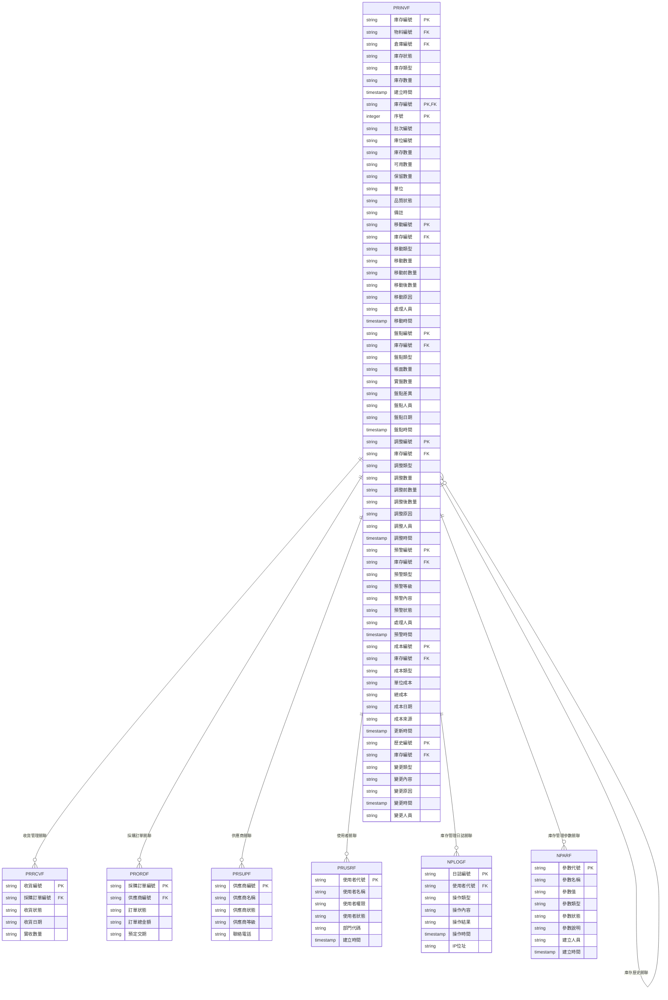

# 採購模組 程式功能規格書 - 庫存管理

## 文件基本資訊

| 項目 | 說明 |
|------|------|
| **文件名稱** | 採購模組程式功能規格書 - 庫存管理 |
| **模組代號** | PR |
| **版本** | v1.0 |
| **建立日期** | 2024年12月21日 |
| **建立人員** | 系統分析師 |
| **審核人員** | 專案經理 |
| **文件狀態** | 初稿 |
| **最後更新** | 2024年12月21日 |

---

## 目錄

1. [基本資料](#基本資料)
2. [檔案架構與關聯圖](#檔案架構與關聯圖)
3. [檔案名稱與欄位規格](#檔案名稱與欄位規格)
4. [輸出/入螢幕布局與說明](#輸出入螢幕布局與說明)
5. [處理流程程序說明](#處理流程程序說明)
6. [子程序處理邏輯說明](#子程序處理邏輯說明)
7. [錯誤處理程序說明與訊息清冊](#錯誤處理程序說明與訊息清冊)
8. [備註](#備註)

---

## 基本資料

### 1.1 模組概述

#### 1.1.1 模組功能說明
採購模組的庫存管理功能主要負責管理企業的庫存查詢、庫存分析、庫存預警、庫存調整、庫存盤點等業務。此功能為企業提供完整的庫存生命週期管理，從入庫作業、庫存查詢、庫存分析、庫存預警到庫存調整，確保庫存資料的準確性和即時性，支援企業的庫存控制和成本管理目標。

#### 1.1.2 模組特色
- **完整庫存生命週期管理**：從入庫作業到庫存調整的完整流程
- **多維度庫存查詢**：支援多種查詢條件和查詢方式
- **智慧化庫存分析**：庫存週轉率、庫存成本、庫存趨勢等分析
- **自動化庫存預警**：庫存不足、庫存過剩、呆滯料等預警機制
- **精準庫存盤點**：定期盤點、循環盤點、動態盤點等盤點方式
- **庫存成本控制**：平均成本、標準成本、實際成本等成本管理

#### 1.1.3 適用範圍
適用於採購系統的庫存管理作業，包括庫存查詢、庫存分析、庫存預警、庫存調整、庫存盤點、庫存成本管理、庫存報表等各類庫存管理相關業務功能。

### 1.2 技術架構

#### 1.2.1 開發技術
- **程式語言**：RPG、CL、SQL
- **資料庫**：DB2 for i (IBM i)
- **開發工具**：IBM i 開發環境
- **報表工具**：IBM Cognos、Crystal Reports
- **部署環境**：IBM i 7.4

#### 1.2.2 系統需求
- **硬體需求**：IBM i 伺服器、終端機、印表機、條碼掃描器
- **軟體需求**：IBM i 作業系統、DB2 for i、IBM i 開發環境
- **網路需求**：企業內部網路連線、終端機連線

---

## 檔案架構與關聯圖

### 2.1 資料庫檔案架構

#### 2.1.1 主要資料表


#### 2.1.2 檔案關聯說明
- **PRINVF (庫存管理主檔)**：儲存庫存的基本資料和狀態資訊
- **PRINVF (庫存管理明細檔)**：儲存庫存的詳細批次和庫位資訊
- **PRINVF (庫存管理移動檔)**：儲存庫存移動記錄
- **PRINVF (庫存管理盤點檔)**：儲存庫存盤點記錄
- **PRINVF (庫存管理調整檔)**：儲存庫存調整記錄
- **PRINVF (庫存管理預警檔)**：儲存庫存預警記錄
- **PRINVF (庫存管理成本檔)**：儲存庫存成本記錄
- **PRINVF (庫存管理歷史檔)**：儲存庫存變更歷史記錄
- **PRRCVF (收貨管理檔)**：儲存收貨管理的基本資料
- **PRORDF (採購訂單檔)**：儲存採購訂單的基本資料
- **PRSUPF (供應商檔)**：儲存供應商的基本資料
- **PRUSRF (使用者檔)**：儲存使用者的基本資料和權限資訊
- **NPLOGF (庫存管理日誌檔)**：儲存庫存管理相關的操作日誌記錄
- **NPARF (庫存管理參數檔)**：儲存庫存管理相關的系統參數

### 2.2 系統架構圖

#### 2.2.1 庫存管理系統架構


---

## 檔案名稱與欄位規格

### 3.1 主要檔案規格

#### 3.1.1 PRINVF - 庫存管理主檔

| 欄位代號 | 欄位名稱 | 位置 | 長度 | 型態 | 屬性 | 檢核說明 |
|----------|----------|------|------|------|------|----------|
| INV01 | 公司代碼 | 1-3 | 3 | A | PK | 必填，公司唯一識別碼 |
| INV02 | 庫存編號 | 4-19 | 16 | A | PK | 必填，庫存記錄唯一識別碼 |
| INV03 | 物料編號 | 20-39 | 20 | A | FK | 必填，物料編號 |
| INV04 | 倉庫編號 | 40-54 | 15 | A | FK | 必填，倉庫編號 |
| INV05 | 庫存狀態 | 55-55 | 1 | A | M | 必填，值：A-正常、H-保留、B-封存、X-廢棄 |
| INV06 | 庫存類型 | 56-57 | 2 | A | M | 必填，值：01-原材料、02-半成品、03-成品、04-包裝材料、05-耗材 |
| INV07 | 庫存數量 | 58-67 | 10 | I | M | 必填，當前庫存數量 |
| INV08 | 可用數量 | 68-77 | 10 | I | M | 必填，可用庫存數量 |
| INV09 | 保留數量 | 78-87 | 10 | I | M | 必填，保留庫存數量 |
| INV10 | 安全庫存 | 88-97 | 10 | I | M | 必填，安全庫存數量 |
| INV11 | 最大庫存 | 98-107 | 10 | I | M | 必填，最大庫存數量 |
| INV12 | 庫存單位 | 108-112 | 5 | A | M | 必填，庫存計量單位 |
| INV13 | 最後入庫日期 | 113-120 | 8 | D | M | 必填，最後入庫日期 |
| INV14 | 最後出庫日期 | 121-128 | 8 | D | M | 必填，最後出庫日期 |
| INV15 | 庫存備註 | 129-168 | 40 | A | O | 選填，庫存相關備註 |
| INV16 | 建立人員 | 169-173 | 5 | A | M | 必填，建立庫存記錄的使用者代號 |
| INV17 | 建立時間 | 174-181 | 8 | T | M | 必填，系統自動產生 |
| INV18 | 修改人員 | 182-186 | 5 | A | O | 選填，最後修改庫存記錄的使用者代號 |
| INV19 | 修改時間 | 187-194 | 8 | T | O | 選填，最後修改時間 |

#### 3.1.2 PRINVF - 庫存管理明細檔

| 欄位代號 | 欄位名稱 | 位置 | 長度 | 型態 | 屬性 | 檢核說明 |
|----------|----------|------|------|------|------|----------|
| INVD01 | 庫存編號 | 1-16 | 16 | A | PK,FK | 必填，參照PRINVF.INV02 |
| INVD02 | 序號 | 17-19 | 3 | I | PK | 必填，1-999 |
| INVD03 | 批次編號 | 20-39 | 20 | A | M | 必填，批次編號 |
| INVD04 | 庫位編號 | 40-59 | 20 | A | M | 必填，庫位編號 |
| INVD05 | 庫存數量 | 60-69 | 10 | I | M | 必填，該批次庫存數量 |
| INVD06 | 可用數量 | 70-79 | 10 | I | M | 必填，該批次可用數量 |
| INVD07 | 保留數量 | 80-89 | 10 | I | M | 必填，該批次保留數量 |
| INVD08 | 單位 | 90-94 | 5 | A | M | 必填，計量單位 |
| INVD09 | 品質狀態 | 95-95 | 1 | A | M | 必填，值：A-合格、B-待檢驗、C-不合格、D-待處理 |
| INVD10 | 生產日期 | 96-103 | 8 | D | M | 必填，生產日期 |
| INVD11 | 有效期限 | 104-111 | 8 | D | M | 必填，有效期限 |
| INVD12 | 備註 | 112-141 | 30 | A | O | 選填，最多30字元 |

#### 3.1.3 PRINVF - 庫存管理移動檔

| 欄位代號 | 欄位名稱 | 位置 | 長度 | 型態 | 屬性 | 檢核說明 |
|----------|----------|------|------|------|------|----------|
| INVM01 | 移動編號 | 1-15 | 15 | A | PK | 必填，移動記錄唯一識別碼 |
| INVM02 | 公司代碼 | 16-18 | 3 | A | M | 必填，公司代碼 |
| INVM03 | 庫存編號 | 19-34 | 16 | A | FK | 必填，參照庫存管理主檔 |
| INVM04 | 移動類型 | 35-36 | 2 | A | M | 必填，值：01-入庫、02-出庫、03-移庫、04-調整、05-盤點 |
| INVM05 | 移動數量 | 37-46 | 10 | I | M | 必填，移動數量 |
| INVM06 | 移動前數量 | 47-56 | 10 | I | M | 必填，移動前庫存數量 |
| INVM07 | 移動後數量 | 57-66 | 10 | I | M | 必填，移動後庫存數量 |
| INVM08 | 移動原因 | 67-116 | 50 | A | M | 必填，移動原因說明 |
| INVM09 | 來源庫位 | 117-136 | 20 | A | O | 選填，來源庫位編號 |
| INVM10 | 目標庫位 | 137-156 | 20 | A | O | 選填，目標庫位編號 |
| INVM11 | 處理人員 | 157-161 | 5 | A | M | 必填，處理移動的人員代號 |
| INVM12 | 移動時間 | 162-169 | 8 | T | M | 必填，系統自動產生 |
| INVM13 | 備註 | 170-199 | 30 | A | O | 選填，最多30字元 |

#### 3.1.4 PRINVF - 庫存管理盤點檔

| 欄位代號 | 欄位名稱 | 位置 | 長度 | 型態 | 屬性 | 檢核說明 |
|----------|----------|------|------|------|------|----------|
| INVP01 | 盤點編號 | 1-15 | 15 | A | PK | 必填，盤點記錄唯一識別碼 |
| INVP02 | 公司代碼 | 16-18 | 3 | A | M | 必填，公司代碼 |
| INVP03 | 庫存編號 | 19-34 | 16 | A | FK | 必填，參照庫存管理主檔 |
| INVP04 | 盤點類型 | 35-36 | 2 | A | M | 必填，值：01-定期盤點、02-循環盤點、03-動態盤點、04-抽樣盤點 |
| INVP05 | 帳面數量 | 37-46 | 10 | I | M | 必填，系統帳面數量 |
| INVP06 | 實盤數量 | 47-56 | 10 | I | M | 必填，實際盤點數量 |
| INVP07 | 盤點差異 | 57-66 | 10 | I | M | 必填，盤點差異數量 |
| INVP08 | 差異原因 | 67-116 | 50 | A | O | 選填，差異原因說明 |
| INVP09 | 盤點人員 | 117-121 | 5 | A | M | 必填，盤點人員代號 |
| INVP10 | 盤點日期 | 122-129 | 8 | D | M | 必填，盤點執行日期 |
| INVP11 | 盤點時間 | 130-137 | 8 | T | M | 必填，系統自動產生 |
| INVP12 | 備註 | 138-167 | 30 | A | O | 選填，最多30字元 |

#### 3.1.5 PRINVF - 庫存管理調整檔

| 欄位代號 | 欄位名稱 | 位置 | 長度 | 型態 | 屬性 | 檢核說明 |
|----------|----------|------|------|------|------|----------|
| INVA01 | 調整編號 | 1-15 | 15 | A | PK | 必填，調整記錄唯一識別碼 |
| INVA02 | 公司代碼 | 16-18 | 3 | A | M | 必填，公司代碼 |
| INVA03 | 庫存編號 | 19-34 | 16 | A | FK | 必填，參照庫存管理主檔 |
| INVA04 | 調整類型 | 35-36 | 2 | A | M | 必填，值：01-數量調整、02-品質調整、03-狀態調整、04-成本調整 |
| INVA05 | 調整數量 | 37-46 | 10 | I | M | 必填，調整數量 |
| INVA06 | 調整前數量 | 47-56 | 10 | I | M | 必填，調整前庫存數量 |
| INVA07 | 調整後數量 | 57-66 | 10 | I | M | 必填，調整後庫存數量 |
| INVA08 | 調整原因 | 67-116 | 50 | A | M | 必填，調整原因說明 |
| INVA09 | 調整依據 | 117-166 | 50 | A | O | 選填，調整依據說明 |
| INVA10 | 調整人員 | 167-171 | 5 | A | M | 必填，調整人員代號 |
| INVA11 | 調整時間 | 172-179 | 8 | T | M | 必填，系統自動產生 |
| INVA12 | 備註 | 180-209 | 30 | A | O | 選填，最多30字元 |

### 3.2 索引資料

#### 3.2.1 主要索引
- **PRINVF 主鍵索引**：INV01 + INV02 (公司代碼 + 庫存編號)
- **PRINVF 物料編號索引**：INV03 (物料編號)
- **PRINVF 倉庫編號索引**：INV04 (倉庫編號)
- **PRINVF 庫存狀態索引**：INV05 (庫存狀態)
- **PRINVF 庫存類型索引**：INV06 (庫存類型)

#### 3.2.2 次要索引
- **PRINVF 主鍵索引**：INVD01 + INVD02 (庫存編號 + 序號)
- **PRINVF 庫存編號索引**：INVD01 (庫存編號)
- **PRINVF 批次編號索引**：INVD03 (批次編號)
- **PRINVF 庫位編號索引**：INVD04 (庫位編號)
- **PRINVM 主鍵索引**：INVM01 (移動編號)
- **PRINVM 庫存編號索引**：INVM03 (庫存編號)
- **PRINVP 主鍵索引**：INVP01 (盤點編號)
- **PRINVP 庫存編號索引**：INVP03 (庫存編號)
- **PRINVA 主鍵索引**：INVA01 (調整編號)
- **PRINVA 庫存編號索引**：INVA03 (庫存編號)

---

## 輸出/入螢幕布局與說明

### 4.1 庫存管理主畫面

#### 4.1.1 畫面布局
```
┌─────────────────────────────────────────────────────────────┐
│                    庫存管理系統                            │
├─────────────────────────────────────────────────────────────┤
│ 功能選項：                                                  │
│  [1]庫存查詢作業  [2]庫存分析管理  [3]庫存預警管理  [4]庫存調整│
│  [5]庫存盤點  [6]庫存報表  [7]系統設定  [8]離開            │
├─────────────────────────────────────────────────────────────┤
│ 系統狀態：                                                  │
│  庫存總數：[1,234] 正常：[1,100] 保留：[89] 封存：[35]      │
│  廢棄：[10] 預警：[45] 盤點中：[23]                        │
│  最後更新：[2024/12/21 14:30:00] 更新人員：[ADMIN]        │
├─────────────────────────────────────────────────────────────┤
│ 快速功能：                                                  │
│  [庫存查詢] [庫存分析] [庫存預警] [庫存調整]                │
├─────────────────────────────────────────────────────────────┤
│ 功能鍵：F1=說明  F3=離開  F4=查詢  F6=分析  F8=調整  F12=取消│
└─────────────────────────────────────────────────────────────┘
```

#### 4.1.2 畫面說明
- **功能選項區**：提供庫存管理的主要功能選項
- **系統狀態區**：顯示當前庫存的狀態和統計資訊
- **快速功能區**：提供常用的快速操作功能
- **功能鍵區**：說明可使用的功能鍵

### 4.2 庫存查詢作業畫面

#### 4.2.1 畫面布局
```
┌─────────────────────────────────────────────────────────────┐
│                      庫存查詢作業                          │
├─────────────────────────────────────────────────────────────┤
│ 查詢條件：                                                  │
│  物料編號：[                ] 倉庫：[               ▼]    │
│  庫存狀態：[全部 ▼] 庫存類型：[全部 ▼] [查詢] [清除]        │
├─────────────────────────────────────────────────────────────┤
│ 庫存清單：                                                  │
│ ┌─────┬────────────────┬──────────┬──────────┬──────────┬────────┐ │
│ │序號 │物料編號        │物料名稱  │庫存數量  │可用數量  │庫存狀態 │ │
│ ├─────┼────────────────┼──────────┼──────────┼──────────┼────────┤ │
│ │  1  │M001            │鋼材      │1,000     │800       │正常     │ │
│ │  2  │M002            │鋁材      │500       │300       │正常     │ │
│ └─────┴────────────────┴──────────┴──────────┴──────────┴────────┘ │
├─────────────────────────────────────────────────────────────┤
│ 操作：[庫存查詢] [庫存分析] [庫存調整] [庫存盤點]            │
│ 功能鍵：F1=說明  F3=離開  F4=查詢  F6=分析  F8=調整  F12=取消│
└─────────────────────────────────────────────────────────────┘
```

---

## 處理流程程序說明

### 5.1 庫存查詢流程

#### 5.1.1 主要處理流程


#### 5.1.2 資料驗證規則
1. **查詢條件驗證**：檢查查詢條件是否有效
2. **權限驗證**：檢查使用者是否有庫存查詢權限
3. **資料範圍驗證**：檢查查詢資料範圍是否合理
4. **系統狀態驗證**：檢查系統是否正常運行

### 5.2 庫存分析流程

#### 5.2.1 主要處理流程


### 5.3 庫存預警流程

#### 5.3.1 主要處理流程


### 5.4 庫存調整流程

#### 5.4.1 主要處理流程


---

## 子程序處理邏輯說明

### 6.1 庫存編號產生子程序

#### 6.1.1 編號產生邏輯


#### 6.1.2 編號格式說明
- **庫存編號格式**：INV + 物料編號(20位) + 倉庫編號(15位)
- **範例**：INV + M001 + WH001 = INVM001WH001

### 6.2 庫存分析子程序

#### 6.2.1 庫存分析邏輯


### 6.3 庫存預警子程序

#### 6.3.1 庫存預警邏輯


### 6.4 庫存調整子程序

#### 6.4.1 庫存調整邏輯


---

## 錯誤處理程序說明與訊息清冊

### 7.1 錯誤處理程序

#### 7.1.1 錯誤處理流程


### 7.2 錯誤訊息清冊

#### 7.2.1 資料驗證錯誤訊息

| 錯誤代碼 | 錯誤訊息 | 錯誤原因 | 解決方法 |
|----------|----------|----------|----------|
| **PR701** | 庫存編號不能為空 | 庫存編號為必填欄位 | 請輸入庫存編號 |
| **PR702** | 物料編號不能為空 | 物料編號為必填欄位 | 請選擇物料 |
| **PR703** | 倉庫編號不能為空 | 倉庫編號為必填欄位 | 請選擇倉庫 |
| **PR704** | 庫存數量不能為空 | 庫存數量為必填欄位 | 請輸入庫存數量 |
| **PR705** | 庫存數量不能為負數 | 庫存數量不能小於0 | 請輸入正確的庫存數量 |

#### 7.2.2 庫存查詢錯誤訊息

| 錯誤代碼 | 錯誤訊息 | 錯誤原因 | 解決方法 |
|----------|----------|----------|----------|
| **PR801** | 查詢條件無效 | 查詢條件設定不正確 | 請檢查查詢條件 |
| **PR802** | 查詢權限不足 | 使用者沒有查詢權限 | 請聯繫系統管理員 |
| **PR803** | 查詢結果為空 | 沒有符合條件的庫存記錄 | 請調整查詢條件 |
| **PR804** | 查詢執行失敗 | 查詢操作執行失敗 | 請聯繫系統管理員 |
| **PR805** | 查詢超時 | 查詢執行時間過長 | 請縮小查詢範圍 |

#### 7.2.3 庫存調整錯誤訊息

| 錯誤代碼 | 錯誤訊息 | 錯誤原因 | 解決方法 |
|----------|----------|----------|----------|
| **PR901** | 庫存記錄不存在 | 庫存記錄未建立 | 請先建立庫存記錄 |
| **PR902** | 庫存數量不足 | 庫存數量不足以調整 | 請檢查庫存數量 |
| **PR903** | 庫存調整失敗 | 庫存調整操作失敗 | 請聯繫系統管理員 |
| **PR904** | 庫存記錄鎖定失敗 | 庫存記錄被鎖定 | 請等待庫存記錄解鎖 |
| **PR905** | 庫存記錄損壞 | 庫存記錄資料損壞 | 請聯繫系統管理員 |

### 7.3 錯誤處理建議

#### 7.3.1 使用者操作建議
1. **檢查必填欄位**：確保所有必填欄位都已填寫
2. **驗證資料格式**：檢查資料格式是否符合要求
3. **檢查權限設定**：確認有執行該操作的權限
4. **檢查系統狀態**：確認系統運行正常

#### 7.3.2 系統管理建議
1. **監控系統錯誤**：定期檢查系統錯誤日誌
2. **檢查庫存設定**：定期檢查庫存相關設定
3. **檢查預警規則**：定期檢查庫存預警規則設定
4. **備份重要資料**：定期備份庫存管理相關資料

---

## 備註

### 8.1 開發注意事項

#### 8.1.1 程式開發注意事項
1. **資料完整性**：確保庫存管理資料的完整性和一致性
2. **庫存準確性**：實作準確的庫存計算和更新機制
3. **預警機制**：提供完整的庫存預警機制
4. **分析功能**：實作豐富的庫存分析功能
5. **日誌記錄**：記錄詳細的操作日誌，便於問題診斷

#### 8.1.2 測試注意事項
1. **單元測試**：每個功能模組都必須進行單元測試
2. **整合測試**：測試各模組間的整合情況
3. **庫存準確性測試**：測試庫存計算的準確性
4. **預警功能測試**：測試庫存預警功能的完整性
5. **使用者接受度測試**：進行使用者接受度測試

### 8.2 維護注意事項

#### 8.2.1 日常維護注意事項
1. **監控系統狀態**：定期監控系統的運行狀態
2. **檢查庫存設定**：定期檢查庫存相關設定
3. **檢查預警規則**：定期檢查庫存預警規則設定
4. **清理過期資料**：定期清理過期的歷史資料
5. **備份重要資料**：定期備份重要的庫存管理資料

#### 8.2.2 版本更新注意事項
1. **相容性檢查**：更新前必須檢查與現有系統的相容性
2. **資料遷移**：制定詳細的資料遷移計畫
3. **使用者通知**：提前通知使用者版本更新計畫
4. **回滾計畫**：制定詳細的回滾計畫
5. **測試驗證**：更新後必須進行充分的測試驗證

### 8.3 未來擴充建議

#### 8.3.1 功能擴充建議
1. **智慧化庫存管理**：整合AI功能，提供智慧化庫存管理建議
2. **行動化支援**：支援行動裝置庫存作業
3. **自動化預警**：實作自動化庫存預警機制
4. **預測分析**：增加庫存需求預測分析功能
5. **供應鏈整合**：整合供應鏈管理功能

#### 8.3.2 技術改進建議
1. **雲端部署**：考慮採用雲端部署模式
2. **微服務架構**：考慮採用微服務架構
3. **API整合**：提供標準化的API介面
4. **資料分析**：整合資料分析功能
5. **物聯網整合**：整合IoT設備，實現自動化庫存管理

---

## 附錄

### A.1 相關文件清單
- 採購模組程式功能規格書 - 採購管理
- 採購模組程式功能規格書 - 供應商管理
- 採購模組程式功能規格書 - 採購申請
- 採購模組程式功能規格書 - 採購訂單
- 採購模組程式功能規格書 - 收貨管理
- 採購模組程式功能規格書 - 付款管理
- 採購模組程式功能規格書 - 報表分析
- 採購模組程式功能規格書 - 系統管理
- 採購模組業務邏輯分析與API設計
- 採購模組操作手冊 - 庫存管理

### A.2 修訂記錄

| 版本 | 修訂日期 | 修訂人員 | 修訂內容 | 修訂原因 |
|------|----------|----------|----------|----------|
| v1.0 | 2024/12/21 | 系統分析師 | 初始版本建立 | 新功能開發 |

### A.3 聯絡資訊
- **專案經理**：[專案經理姓名]
- **系統分析師**：[系統分析師姓名]
- **技術支援**：[技術支援聯絡方式]
- **專案信箱**：[專案信箱地址]
