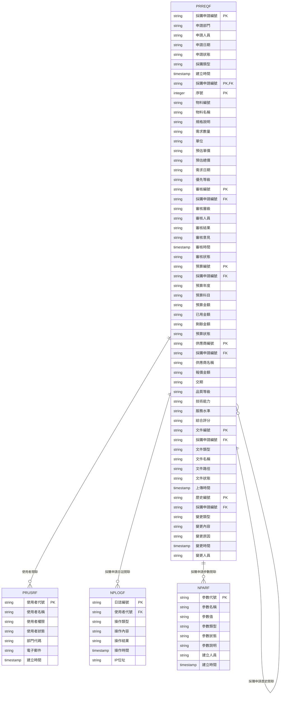
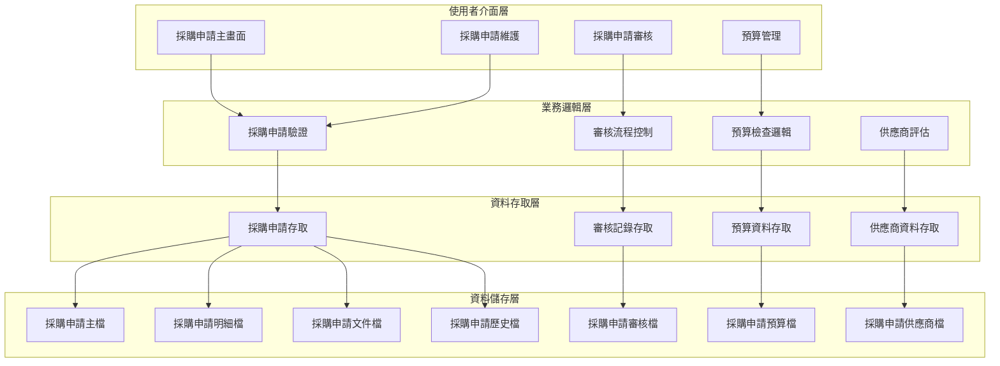
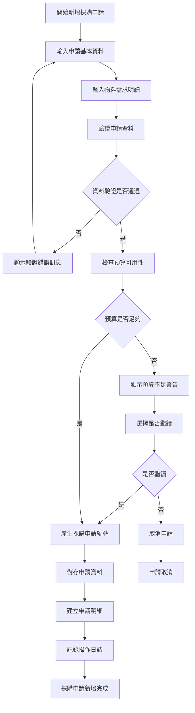
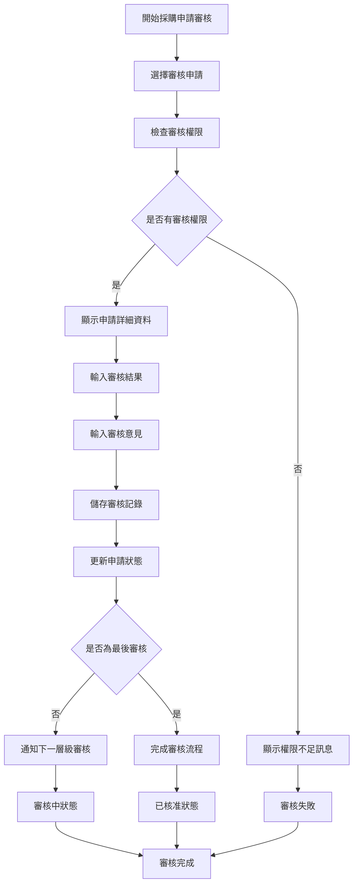
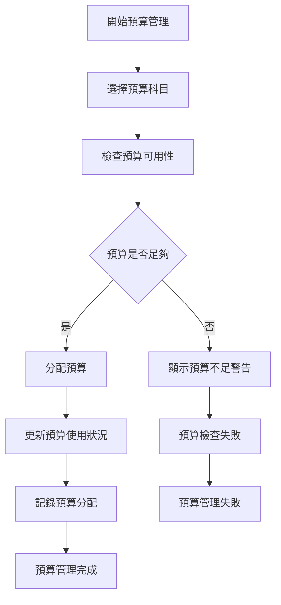
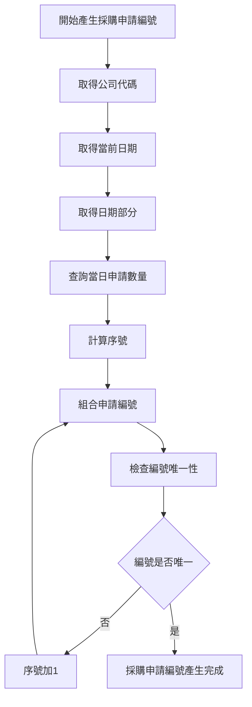
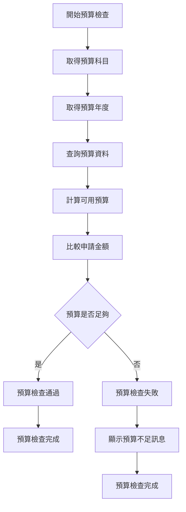
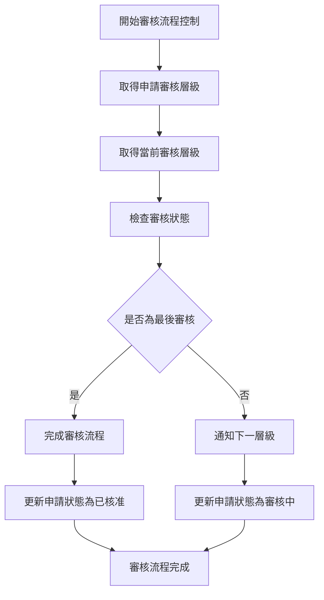
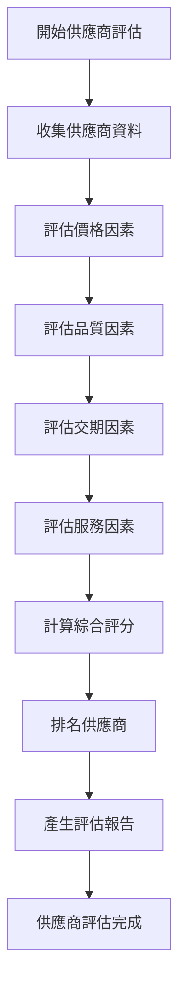
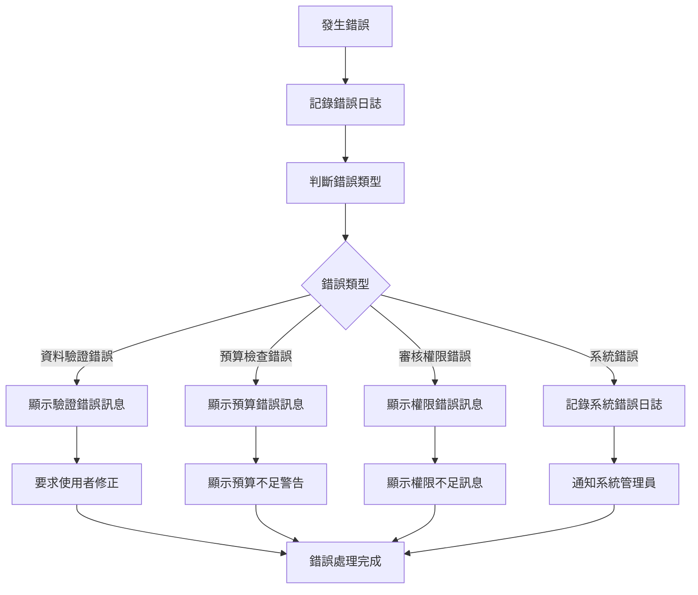

# 採購模組 程式功能規格書 - 採購申請

## 文件基本資訊

| 項目 | 說明 |
|------|------|
| **文件名稱** | 採購模組程式功能規格書 - 採購申請 |
| **模組代號** | PR |
| **版本** | v1.0 |
| **建立日期** | 2024年12月21日 |
| **建立人員** | 系統分析師 |
| **審核人員** | 專案經理 |
| **文件狀態** | 初稿 |
| **最後更新** | 2024年12月21日 |

---

## 目錄

1. [基本資料](#基本資料)
2. [檔案架構與關聯圖](#檔案架構與關聯圖)
3. [檔案名稱與欄位規格](#檔案名稱與欄位規格)
4. [輸出/入螢幕布局與說明](#輸出入螢幕布局與說明)
5. [處理流程程序說明](#處理流程程序說明)
6. [子程序處理邏輯說明](#子程序處理邏輯說明)
7. [錯誤處理程序說明與訊息清冊](#錯誤處理程序說明與訊息清冊)
8. [備註](#備註)

---

## 基本資料

### 1.1 模組概述

#### 1.1.1 模組功能說明
採購模組的採購申請功能主要負責管理企業的採購需求申請、預算控制、審核流程、供應商選擇等業務。此功能為企業提供完整的採購申請生命週期管理，從需求提出、預算審查、技術規格確認、供應商評估到採購決策，確保採購流程的規範性和成本控制的有效性，支援企業的採購策略和營運目標。

#### 1.1.2 模組特色
- **完整採購申請生命週期管理**：從需求提出到採購決策的完整流程
- **多層級審核機制**：部門主管、採購主管、財務主管等多層級審核
- **預算控制與管理**：即時預算檢查、超預算預警、預算調整機制
- **供應商評估與選擇**：多維度供應商評估、價格比較、品質考量
- **技術規格管理**：詳細的技術規格定義、標準化規格庫
- **採購策略支援**：集中採購、策略採購、緊急採購等策略支援

#### 1.1.3 適用範圍
適用於採購系統的採購申請作業，包括採購需求申請、預算審查、技術規格確認、供應商評估、採購決策、採購申請追蹤等各類採購申請相關業務功能。

### 1.2 技術架構

#### 1.2.1 開發技術
- **程式語言**：RPG、CL、SQL
- **資料庫**：DB2 for i (IBM i)
- **開發工具**：IBM i 開發環境
- **報表工具**：IBM Cognos、Crystal Reports
- **部署環境**：IBM i 7.4

#### 1.2.2 系統需求
- **硬體需求**：IBM i 伺服器、終端機、印表機
- **軟體需求**：IBM i 作業系統、DB2 for i、IBM i 開發環境
- **網路需求**：企業內部網路連線、終端機連線

---

## 檔案架構與關聯圖

### 2.1 資料庫檔案架構

#### 2.1.1 主要資料表


#### 2.1.2 檔案關聯說明
- **PRREQF (採購申請主檔)**：儲存採購申請的基本資料和狀態資訊
- **PRREQF (採購申請明細檔)**：儲存採購申請的詳細物料需求
- **PRREQF (採購申請審核檔)**：儲存採購申請的審核記錄
- **PRREQF (採購申請預算檔)**：儲存採購申請的預算相關資料
- **PRREQF (採購申請供應商檔)**：儲存採購申請的供應商評估資料
- **PRREQF (採購申請文件檔)**：儲存採購申請的相關文件
- **PRREQF (採購申請歷史檔)**：儲存採購申請的變更歷史記錄
- **PRUSRF (使用者檔)**：儲存使用者的基本資料和權限資訊
- **NPLOGF (採購申請日誌檔)**：儲存採購申請相關的操作日誌記錄
- **NPARF (採購申請參數檔)**：儲存採購申請相關的系統參數

### 2.2 系統架構圖

#### 2.2.1 採購申請系統架構


---

## 檔案名稱與欄位規格

### 3.1 主要檔案規格

#### 3.1.1 PRREQF - 採購申請主檔

| 欄位代號 | 欄位名稱 | 位置 | 長度 | 型態 | 屬性 | 檢核說明 |
|----------|----------|------|------|------|------|----------|
| REQ01 | 公司代碼 | 1-3 | 3 | A | PK | 必填，公司唯一識別碼 |
| REQ02 | 採購申請編號 | 4-19 | 16 | A | PK | 必填，採購申請唯一識別碼 |
| REQ03 | 申請部門 | 20-24 | 5 | A | M | 必填，申請部門代碼 |
| REQ04 | 申請人員 | 25-29 | 5 | A | M | 必填，申請人員代號 |
| REQ05 | 申請日期 | 30-37 | 8 | D | M | 必填，申請日期 |
| REQ06 | 申請狀態 | 38-38 | 1 | A | M | 必填，值：D-草稿、S-已送出、A-審核中、P-已核准、R-已拒絕、C-已取消 |
| REQ07 | 採購類型 | 39-40 | 2 | A | M | 必填，值：01-一般採購、02-緊急採購、03-策略採購、04-集中採購 |
| REQ08 | 優先等級 | 41-41 | 1 | A | M | 必填，值：1-高、2-中、3-低 |
| REQ09 | 預估總金額 | 42-51 | 10 | I | M | 必填，預估總金額（元） |
| REQ10 | 需求日期 | 52-59 | 8 | D | M | 必填，物料需求日期 |
| REQ11 | 採購原因 | 60-109 | 50 | A | M | 必填，採購原因說明 |
| REQ12 | 技術規格 | 110-159 | 50 | A | O | 選填，技術規格要求 |
| REQ13 | 品質要求 | 160-209 | 50 | A | O | 選填，品質要求說明 |
| REQ14 | 交期要求 | 210-259 | 50 | A | O | 選填，交期要求說明 |
| REQ15 | 預算來源 | 260-264 | 5 | A | M | 必填，預算來源代碼 |
| REQ16 | 預算年度 | 265-268 | 4 | I | M | 必填，預算年度 |
| REQ17 | 預算科目 | 269-273 | 5 | A | M | 必填，預算科目代碼 |
| REQ18 | 審核層級 | 274-275 | 2 | I | M | 必填，審核層級（1-9） |
| REQ19 | 當前審核層級 | 276-277 | 2 | I | M | 必填，當前審核層級 |
| REQ20 | 申請備註 | 278-317 | 40 | A | O | 選填，申請相關備註 |
| REQ21 | 建立人員 | 318-322 | 5 | A | M | 必填，建立採購申請的使用者代號 |
| REQ22 | 建立時間 | 323-330 | 8 | T | M | 必填，系統自動產生 |
| REQ23 | 修改人員 | 331-335 | 5 | A | O | 選填，最後修改採購申請的使用者代號 |
| REQ24 | 修改時間 | 336-343 | 8 | T | O | 選填，最後修改時間 |

#### 3.1.2 PRREQF - 採購申請明細檔

| 欄位代號 | 欄位名稱 | 位置 | 長度 | 型態 | 屬性 | 檢核說明 |
|----------|----------|------|------|------|------|----------|
| REQD01 | 採購申請編號 | 1-16 | 16 | A | PK,FK | 必填，參照PRREQF.REQ02 |
| REQD02 | 序號 | 17-19 | 3 | I | PK | 必填，1-999 |
| REQD03 | 物料編號 | 20-39 | 20 | A | M | 必填，物料編號 |
| REQD04 | 物料名稱 | 40-69 | 30 | A | M | 必填，物料中文名稱 |
| REQD05 | 規格說明 | 70-119 | 50 | A | O | 選填，物料規格說明 |
| REQD06 | 需求數量 | 120-129 | 10 | I | M | 必填，需求數量 |
| REQD07 | 單位 | 130-134 | 5 | A | M | 必填，計量單位 |
| REQD08 | 預估單價 | 135-144 | 10 | I | O | 選填，預估單價（元） |
| REQD09 | 預估總價 | 145-154 | 10 | I | O | 選填，預估總價（元） |
| REQD10 | 需求日期 | 155-162 | 8 | D | M | 必填，物料需求日期 |
| REQD11 | 優先等級 | 163-163 | 1 | A | M | 必填，值：1-高、2-中、3-低 |
| REQD12 | 技術規格 | 164-213 | 50 | A | O | 選填，技術規格要求 |
| REQD13 | 品質要求 | 214-263 | 50 | A | O | 選填，品質要求說明 |
| REQD14 | 備註 | 264-293 | 30 | A | O | 選填，最多30字元 |

#### 3.1.3 PRREQF - 採購申請審核檔

| 欄位代號 | 欄位名稱 | 位置 | 長度 | 型態 | 屬性 | 檢核說明 |
|----------|----------|------|------|------|------|----------|
| REQA01 | 審核編號 | 1-15 | 15 | A | PK | 必填，審核記錄唯一識別碼 |
| REQA02 | 公司代碼 | 16-18 | 3 | A | M | 必填，公司代碼 |
| REQA03 | 採購申請編號 | 19-34 | 16 | A | FK | 必填，參照採購申請主檔 |
| REQA04 | 審核層級 | 35-36 | 2 | I | M | 必填，審核層級（1-9） |
| REQA05 | 審核人員 | 37-41 | 5 | A | M | 必填，審核人員代號 |
| REQA06 | 審核結果 | 42-42 | 1 | A | M | 必填，值：A-核准、R-拒絕、H-保留 |
| REQA07 | 審核意見 | 43-92 | 50 | A | O | 選填，審核意見說明 |
| REQA08 | 審核時間 | 93-100 | 8 | T | M | 必填，審核執行的時間 |
| REQA09 | 審核狀態 | 101-101 | 1 | A | M | 必填，值：P-待審核、S-審核中、C-已完成 |
| REQA10 | 下次審核人員 | 102-106 | 5 | A | O | 選填，下次審核人員代號 |
| REQA11 | 審核備註 | 107-156 | 50 | A | O | 選填，審核相關備註 |
| REQA12 | 備註 | 157-186 | 30 | A | O | 選填，最多30字元 |

#### 3.1.4 PRREQF - 採購申請預算檔

| 欄位代號 | 欄位名稱 | 位置 | 長度 | 型態 | 屬性 | 檢核說明 |
|----------|----------|------|------|------|------|----------|
| REQB01 | 預算編號 | 1-15 | 15 | A | PK | 必填，預算記錄唯一識別碼 |
| REQB02 | 公司代碼 | 16-18 | 3 | A | M | 必填，公司代碼 |
| REQB03 | 採購申請編號 | 19-34 | 16 | A | FK | 必填，參照採購申請主檔 |
| REQB04 | 預算年度 | 35-38 | 4 | I | M | 必填，預算年度 |
| REQB05 | 預算科目 | 39-43 | 5 | A | M | 必填，預算科目代碼 |
| REQB06 | 預算金額 | 44-53 | 10 | I | M | 必填，預算金額（元） |
| REQB07 | 已用金額 | 54-63 | 10 | I | M | 必填，已使用金額（元） |
| REQB08 | 剩餘金額 | 64-73 | 10 | I | M | 必填，剩餘金額（元） |
| REQB09 | 預算狀態 | 74-74 | 1 | A | M | 必填，值：A-可用、I-不可用、E-已用完 |
| REQB10 | 預算說明 | 75-124 | 50 | A | O | 選填，預算相關說明 |
| REQB11 | 更新人員 | 125-129 | 5 | A | M | 必填，更新預算資料的使用者代號 |
| REQB12 | 更新時間 | 130-137 | 8 | T | M | 必填，系統自動產生 |
| REQB13 | 備註 | 138-167 | 30 | A | O | 選填，最多30字元 |

#### 3.1.5 PRREQF - 採購申請供應商檔

| 欄位代號 | 欄位名稱 | 位置 | 長度 | 型態 | 屬性 | 檢核說明 |
|----------|----------|------|------|------|------|----------|
| REQS01 | 供應商編號 | 1-15 | 15 | A | PK | 必填，供應商記錄唯一識別碼 |
| REQS02 | 公司代碼 | 16-18 | 3 | A | M | 必填，公司代碼 |
| REQS03 | 採購申請編號 | 19-34 | 16 | A | FK | 必填，參照採購申請主檔 |
| REQS04 | 供應商名稱 | 35-64 | 30 | A | M | 必填，供應商名稱 |
| REQS05 | 報價金額 | 65-74 | 10 | I | M | 必填，供應商報價金額（元） |
| REQS06 | 交期 | 75-82 | 8 | D | M | 必填，供應商承諾交期 |
| REQS07 | 品質等級 | 83-83 | 1 | A | M | 必填，值：A-優、B-良、C-中、D-差 |
| REQS08 | 技術能力 | 84-84 | 1 | A | M | 必填，值：A-優、B-良、C-中、D-差 |
| REQS09 | 服務水準 | 85-85 | 1 | A | M | 必填，值：A-優、B-良、C-中、D-差 |
| REQS10 | 綜合評分 | 86-88 | 3 | I | M | 必填，綜合評分（0-100） |
| REQS11 | 供應商備註 | 89-138 | 50 | A | O | 選填，供應商相關備註 |
| REQS12 | 更新人員 | 139-143 | 5 | A | M | 必填，更新供應商資料的使用者代號 |
| REQS13 | 更新時間 | 144-151 | 8 | T | M | 必填，系統自動產生 |
| REQS14 | 備註 | 152-181 | 30 | A | O | 選填，最多30字元 |

### 3.2 索引資料

#### 3.2.1 主要索引
- **PRREQF 主鍵索引**：REQ01 + REQ02 (公司代碼 + 採購申請編號)
- **PRREQF 申請部門索引**：REQ03 (申請部門)
- **PRREQF 申請人員索引**：REQ04 (申請人員)
- **PRREQF 申請狀態索引**：REQ06 (申請狀態)
- **PRREQF 採購類型索引**：REQ07 (採購類型)

#### 3.2.2 次要索引
- **PRREQF 主鍵索引**：REQD01 + REQD02 (採購申請編號 + 序號)
- **PRREQF 採購申請編號索引**：REQD01 (採購申請編號)
- **PRREQF 物料編號索引**：REQD03 (物料編號)
- **PRREQA 主鍵索引**：REQA01 (審核編號)
- **PRREQA 採購申請編號索引**：REQA03 (採購申請編號)
- **PRREQA 審核層級索引**：REQA04 (審核層級)
- **PRREQB 主鍵索引**：REQB01 (預算編號)
- **PRREQB 採購申請編號索引**：REQB03 (採購申請編號)
- **PRREQB 預算科目索引**：REQB05 (預算科目)
- **PRREQS 主鍵索引**：REQS01 (供應商編號)
- **PRREQS 採購申請編號索引**：REQS03 (採購申請編號)

---

## 輸出/入螢幕布局與說明

### 4.1 採購申請主畫面

#### 4.1.1 畫面布局
```
┌─────────────────────────────────────────────────────────────┐
│                    採購申請系統                            │
├─────────────────────────────────────────────────────────────┤
│ 功能選項：                                                  │
│  [1]採購申請維護  [2]採購申請審核  [3]預算管理  [4]供應商評估│
│  [5]採購申請查詢  [6]報表分析  [7]系統設定  [8]離開        │
├─────────────────────────────────────────────────────────────┤
│ 系統狀態：                                                  │
│  採購申請總數：[567] 草稿中：[45] 審核中：[123] 已核准：[234] │
│  已拒絕：[89] 已取消：[76] 預算不足：[12] 緊急採購：[23]    │
│  最後更新：[2024/12/21 14:30:00] 更新人員：[ADMIN]        │
├─────────────────────────────────────────────────────────────┤
│ 快速功能：                                                  │
│  [新增申請] [申請查詢] [審核作業] [預算檢查]                │
├─────────────────────────────────────────────────────────────┤
│ 功能鍵：F1=說明  F3=離開  F4=新增  F6=查詢  F8=審核  F12=取消│
└─────────────────────────────────────────────────────────────┘
```

#### 4.1.2 畫面說明
- **功能選項區**：提供採購申請的主要功能選項
- **系統狀態區**：顯示當前採購申請的狀態和統計資訊
- **快速功能區**：提供常用的快速操作功能
- **功能鍵區**：說明可使用的功能鍵

### 4.2 採購申請維護畫面

#### 4.2.1 畫面布局
```
┌─────────────────────────────────────────────────────────────┐
│                      採購申請維護                          │
├─────────────────────────────────────────────────────────────┤
│ 查詢條件：                                                  │
│  申請編號：[                ] 申請部門：[     ▼]            │
│  申請人員：[     ] 申請狀態：[全部 ▼] [查詢] [清除]          │
├─────────────────────────────────────────────────────────────┤
│ 採購申請清單：                                              │
│ ┌─────┬────────────────┬──────────┬──────────┬──────────┬────────┐ │
│ │序號 │申請編號        │申請部門  │申請人員  │申請狀態  │預估金額 │ │
│ ├─────┼────────────────┼──────────┼──────────┼──────────┼────────┤ │
│ │  1  │PR202412210001  │採購部    │張經理    │審核中    │$50,000 │ │
│ │  2  │PR202412210002  │資訊部    │李工程師  │已核准    │$25,000 │ │
│ └─────┴────────────────┴──────────┴──────────┴──────────┴────────┘ │
├─────────────────────────────────────────────────────────────┤
│ 操作：[新增申請] [修改申請] [取消申請] [複製申請]            │
│ 功能鍵：F1=說明  F3=離開  F4=新增  F6=修改  F8=取消  F12=取消│
└─────────────────────────────────────────────────────────────┘
```

---

## 處理流程程序說明

### 5.1 採購申請新增流程

#### 5.1.1 主要處理流程


#### 5.1.2 資料驗證規則
1. **必填欄位驗證**：申請部門、申請人員、申請日期、採購類型、優先等級、預估總金額、需求日期、採購原因等必填欄位
2. **預算檢查**：檢查預算科目和金額是否足夠
3. **物料規格驗證**：檢查物料規格是否完整
4. **日期驗證**：需求日期不能早於申請日期

### 5.2 採購申請審核流程

#### 5.2.1 主要處理流程


### 5.3 預算管理流程

#### 5.3.1 主要處理流程


---

## 子程序處理邏輯說明

### 6.1 採購申請編號產生子程序

#### 6.1.1 編號產生邏輯


#### 6.1.2 編號格式說明
- **採購申請編號格式**：PR + 日期(8位) + 序號(4位)
- **範例**：PR + 20241221 + 0001 = PR202412210001

### 6.2 預算檢查子程序

#### 6.2.1 預算檢查邏輯


### 6.3 審核流程控制子程序

#### 6.3.1 審核流程邏輯


### 6.4 供應商評估子程序

#### 6.4.1 供應商評估邏輯


---

## 錯誤處理程序說明與訊息清冊

### 7.1 錯誤處理程序

#### 7.1.1 錯誤處理流程


### 7.2 錯誤訊息清冊

#### 7.2.1 資料驗證錯誤訊息

| 錯誤代碼 | 錯誤訊息 | 錯誤原因 | 解決方法 |
|----------|----------|----------|----------|
| **PR701** | 申請部門不能為空 | 申請部門為必填欄位 | 請選擇申請部門 |
| **PR702** | 申請人員不能為空 | 申請人員為必填欄位 | 請選擇申請人員 |
| **PR703** | 需求日期不能早於申請日期 | 需求日期設定錯誤 | 請調整需求日期 |
| **PR704** | 預估總金額必須大於0 | 預估總金額設定錯誤 | 請輸入正確的金額 |
| **PR705** | 採購原因不能為空 | 採購原因為必填欄位 | 請輸入採購原因 |

#### 7.2.2 預算檢查錯誤訊息

| 錯誤代碼 | 錯誤訊息 | 錯誤原因 | 解決方法 |
|----------|----------|----------|----------|
| **PR801** | 預算科目不存在 | 預算科目代碼錯誤 | 請檢查預算科目設定 |
| **PR802** | 預算金額不足 | 預算餘額不足 | 請調整申請金額或選擇其他預算科目 |
| **PR803** | 預算年度不正確 | 預算年度設定錯誤 | 請檢查預算年度設定 |
| **PR804** | 預算狀態不可用 | 預算已被凍結或停用 | 請聯繫財務部門檢查預算狀態 |
| **PR805** | 預算分配失敗 | 預算分配操作失敗 | 請聯繫系統管理員 |

#### 7.2.3 審核流程錯誤訊息

| 錯誤代碼 | 錯誤訊息 | 錯誤原因 | 解決方法 |
|----------|----------|----------|----------|
| **PR901** | 審核權限不足 | 使用者沒有審核權限 | 請聯繫系統管理員檢查權限設定 |
| **PR902** | 申請狀態不允許審核 | 當前狀態不允許審核 | 請檢查申請狀態 |
| **PR903** | 審核層級不正確 | 審核層級設定錯誤 | 請檢查審核層級設定 |
| **PR904** | 審核流程異常 | 審核流程設定錯誤 | 請聯繫系統管理員檢查審核流程 |
| **PR905** | 審核記錄儲存失敗 | 審核記錄儲存操作失敗 | 請聯繫系統管理員 |

### 7.3 錯誤處理建議

#### 7.3.1 使用者操作建議
1. **檢查必填欄位**：確保所有必填欄位都已填寫
2. **驗證資料格式**：檢查資料格式是否符合要求
3. **檢查預算狀況**：確認預算科目和金額是否足夠
4. **檢查審核權限**：確認有執行該操作的權限

#### 7.3.2 系統管理建議
1. **監控系統錯誤**：定期檢查系統錯誤日誌
2. **檢查預算設定**：定期檢查預算科目和金額設定
3. **檢查審核流程**：定期檢查審核流程設定
4. **備份重要資料**：定期備份採購申請相關資料

---

## 備註

### 8.1 開發注意事項

#### 8.1.1 程式開發注意事項
1. **資料完整性**：確保採購申請資料的完整性和一致性
2. **預算控制**：實作完整的預算檢查和控制機制
3. **審核流程**：實作靈活的審核流程控制
4. **錯誤處理**：提供完整的錯誤處理機制
5. **日誌記錄**：記錄詳細的操作日誌，便於問題診斷

#### 8.1.2 測試注意事項
1. **單元測試**：每個功能模組都必須進行單元測試
2. **整合測試**：測試各模組間的整合情況
3. **預算測試**：測試預算檢查和控制功能
4. **審核流程測試**：測試審核流程的完整性
5. **使用者接受度測試**：進行使用者接受度測試

### 8.2 維護注意事項

#### 8.2.1 日常維護注意事項
1. **監控系統狀態**：定期監控系統的運行狀態
2. **檢查預算設定**：定期檢查預算科目和金額設定
3. **檢查審核流程**：定期檢查審核流程設定
4. **清理過期資料**：定期清理過期的歷史資料
5. **備份重要資料**：定期備份重要的採購申請資料

#### 8.2.2 版本更新注意事項
1. **相容性檢查**：更新前必須檢查與現有系統的相容性
2. **資料遷移**：制定詳細的資料遷移計畫
3. **使用者通知**：提前通知使用者版本更新計畫
4. **回滾計畫**：制定詳細的回滾計畫
5. **測試驗證**：更新後必須進行充分的測試驗證

### 8.3 未來擴充建議

#### 8.3.1 功能擴充建議
1. **電子化審核**：實作電子化的審核流程
2. **行動化支援**：支援行動裝置存取
3. **工作流程整合**：整合工作流程管理系統
4. **預算預警**：實作預算使用預警機制
5. **採購分析**：增加採購分析功能

#### 8.3.2 技術改進建議
1. **雲端部署**：考慮採用雲端部署模式
2. **微服務架構**：考慮採用微服務架構
3. **API整合**：提供標準化的API介面
4. **資料分析**：整合資料分析功能
5. **人工智慧**：整合AI功能，提供智慧化建議

---

## 附錄

### A.1 相關文件清單
- 採購模組程式功能規格書 - 採購管理
- 採購模組程式功能規格書 - 供應商管理
- 採購模組程式功能規格書 - 採購訂單
- 採購模組程式功能規格書 - 收貨管理
- 採購模組程式功能規格書 - 付款管理
- 採購模組程式功能規格書 - 庫存管理
- 採購模組程式功能規格書 - 報表分析
- 採購模組程式功能規格書 - 系統管理
- 採購模組業務邏輯分析與API設計
- 採購模組操作手冊 - 採購申請

### A.2 修訂記錄

| 版本 | 修訂日期 | 修訂人員 | 修訂內容 | 修訂原因 |
|------|----------|----------|----------|----------|
| v1.0 | 2024/12/21 | 系統分析師 | 初始版本建立 | 新功能開發 |

### A.3 聯絡資訊
- **專案經理**：[專案經理姓名]
- **系統分析師**：[系統分析師姓名]
- **技術支援**：[技術支援聯絡方式]
- **專案信箱**：[專案信箱地址]
