# 採購模組 程式功能規格書 - 收貨管理

## 文件基本資訊

| 項目 | 說明 |
|------|------|
| **文件名稱** | 採購模組程式功能規格書 - 收貨管理 |
| **模組代號** | PR |
| **版本** | v1.0 |
| **建立日期** | 2024年12月21日 |
| **建立人員** | 系統分析師 |
| **審核人員** | 專案經理 |
| **文件狀態** | 初稿 |
| **最後更新** | 2024年12月21日 |

---

## 目錄

1. [基本資料](#基本資料)
2. [檔案架構與關聯圖](#檔案架構與關聯圖)
3. [檔案名稱與欄位規格](#檔案名稱與欄位規格)
4. [輸出/入螢幕布局與說明](#輸出入螢幕布局與說明)
5. [處理流程程序說明](#處理流程程序說明)
6. [子程序處理邏輯說明](#子程序處理邏輯說明)
7. [錯誤處理程序說明與訊息清冊](#錯誤處理程序說明與訊息清冊)
8. [備註](#備註)

---

## 基本資料

### 1.1 模組概述

#### 1.1.1 模組功能說明
採購模組的收貨管理功能主要負責管理企業的收貨驗收、品質檢驗、入庫管理、異常處理等業務。此功能為企業提供完整的收貨生命週期管理，從收貨通知、實物驗收、品質檢驗、數量確認、入庫作業到異常處理，確保收貨流程的準確性和效率，支援企業的庫存管理和品質控制目標。

#### 1.1.2 模組特色
- **完整收貨生命週期管理**：從收貨通知到入庫完成的完整流程
- **多層級品質檢驗**：外觀檢驗、功能測試、品質抽樣等多層級檢驗
- **即時庫存更新**：收貨完成後即時更新庫存數量
- **異常處理機制**：品質異常、數量不符、包裝損壞等異常處理
- **供應商績效追蹤**：收貨品質、交期準確性等績效指標追蹤
- **文件管理**：收貨單、檢驗報告、異常報告等文件管理

#### 1.1.3 適用範圍
適用於採購系統的收貨管理作業，包括收貨通知、實物驗收、品質檢驗、數量確認、入庫作業、異常處理、供應商績效評估等各類收貨管理相關業務功能。

### 1.2 技術架構

#### 1.2.1 開發技術
- **程式語言**：RPG、CL、SQL
- **資料庫**：DB2 for i (IBM i)
- **開發工具**：IBM i 開發環境
- **報表工具**：IBM Cognos、Crystal Reports
- **部署環境**：IBM i 7.4

#### 1.2.2 系統需求
- **硬體需求**：IBM i 伺服器、終端機、印表機、條碼掃描器
- **軟體需求**：IBM i 作業系統、DB2 for i、IBM i 開發環境
- **網路需求**：企業內部網路連線、終端機連線

---

## 檔案架構與關聯圖

### 2.1 資料庫檔案架構

#### 2.1.1 主要資料表
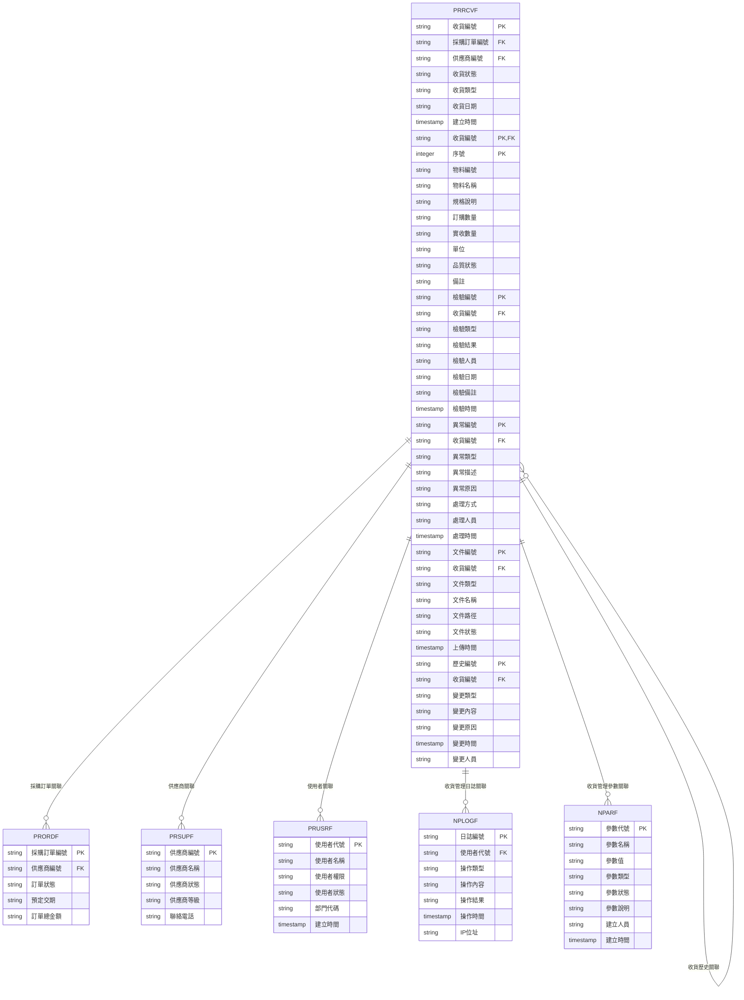

#### 2.1.2 檔案關聯說明
- **PRRCVF (收貨管理主檔)**：儲存收貨的基本資料和狀態資訊
- **PRRCVF (收貨管理明細檔)**：儲存收貨的詳細物料資訊
- **PRRCVF (收貨管理檢驗檔)**：儲存品質檢驗記錄
- **PRRCVF (收貨管理異常檔)**：儲存收貨異常記錄
- **PRRCVF (收貨管理文件檔)**：儲存收貨相關文件
- **PRRCVF (收貨管理歷史檔)**：儲存收貨變更歷史記錄
- **PRORDF (採購訂單檔)**：儲存採購訂單的基本資料
- **PRSUPF (供應商檔)**：儲存供應商的基本資料
- **PRUSRF (使用者檔)**：儲存使用者的基本資料和權限資訊
- **NPLOGF (收貨管理日誌檔)**：儲存收貨管理相關的操作日誌記錄
- **NPARF (收貨管理參數檔)**：儲存收貨管理相關的系統參數

### 2.2 系統架構圖

#### 2.2.1 收貨管理系統架構
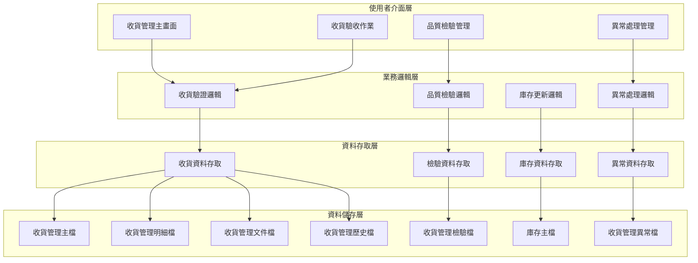

---

## 檔案名稱與欄位規格

### 3.1 主要檔案規格

#### 3.1.1 PRRCVF - 收貨管理主檔

| 欄位代號 | 欄位名稱 | 位置 | 長度 | 型態 | 屬性 | 檢核說明 |
|----------|----------|------|------|------|------|----------|
| RCV01 | 公司代碼 | 1-3 | 3 | A | PK | 必填，公司唯一識別碼 |
| RCV02 | 收貨編號 | 4-19 | 16 | A | PK | 必填，收貨記錄唯一識別碼 |
| RCV03 | 採購訂單編號 | 20-35 | 16 | A | FK | 必填，參照採購訂單檔 |
| RCV04 | 供應商編號 | 36-50 | 15 | A | FK | 必填，參照供應商檔 |
| RCV05 | 收貨狀態 | 51-51 | 1 | A | M | 必填，值：N-通知、R-已收貨、I-檢驗中、Q-品質異常、A-已核准、C-已入庫、X-已取消 |
| RCV06 | 收貨類型 | 52-53 | 2 | A | M | 必填，值：01-正常收貨、02-緊急收貨、03-部分收貨、04-超量收貨 |
| RCV07 | 收貨日期 | 54-61 | 8 | D | M | 必填，實際收貨日期 |
| RCV08 | 預定收貨日期 | 62-69 | 8 | D | M | 必填，預定收貨日期 |
| RCV09 | 收貨地點 | 70-129 | 60 | A | M | 必填，收貨地點 |
| RCV10 | 收貨人員 | 130-134 | 5 | A | M | 必填，收貨人員代號 |
| RCV11 | 運輸方式 | 135-136 | 2 | A | M | 必填，值：01-自提、02-供應商送貨、03-第三方物流 |
| RCV12 | 包裝狀況 | 137-137 | 1 | A | M | 必填，值：A-良好、B-一般、C-破損、D-嚴重破損 |
| RCV13 | 收貨備註 | 138-177 | 40 | A | O | 選填，收貨相關備註 |
| RCV14 | 建立人員 | 178-182 | 5 | A | M | 必填，建立收貨記錄的使用者代號 |
| RCV15 | 建立時間 | 183-190 | 8 | T | M | 必填，系統自動產生 |
| RCV16 | 修改人員 | 191-195 | 5 | A | O | 選填，最後修改收貨記錄的使用者代號 |
| RCV17 | 修改時間 | 196-203 | 8 | T | O | 選填，最後修改時間 |

#### 3.1.2 PRRCVF - 收貨管理明細檔

| 欄位代號 | 欄位名稱 | 位置 | 長度 | 型態 | 屬性 | 檢核說明 |
|----------|----------|------|------|------|------|----------|
| RCVD01 | 收貨編號 | 1-16 | 16 | A | PK,FK | 必填，參照PRRCVF.RCV02 |
| RCVD02 | 序號 | 17-19 | 3 | I | PK | 必填，1-999 |
| RCVD03 | 物料編號 | 20-39 | 20 | A | M | 必填，物料編號 |
| RCVD04 | 物料名稱 | 40-69 | 30 | A | M | 必填，物料中文名稱 |
| RCVD05 | 規格說明 | 70-119 | 50 | A | O | 選填，物料規格說明 |
| RCVD06 | 訂購數量 | 120-129 | 10 | I | M | 必填，訂購數量 |
| RCVD07 | 實收數量 | 130-139 | 10 | I | M | 必填，實際收貨數量 |
| RCVD08 | 單位 | 140-144 | 5 | A | M | 必填，計量單位 |
| RCVD09 | 品質狀態 | 145-145 | 1 | A | M | 必填，值：A-合格、B-待檢驗、C-不合格、D-待處理 |
| RCVD10 | 檢驗結果 | 146-195 | 50 | A | O | 選填，檢驗結果說明 |
| RCVD11 | 備註 | 196-225 | 30 | A | O | 選填，最多30字元 |

#### 3.1.3 PRRCVF - 收貨管理檢驗檔

| 欄位代號 | 欄位名稱 | 位置 | 長度 | 型態 | 屬性 | 檢核說明 |
|----------|----------|------|------|------|------|----------|
| RCVQ01 | 檢驗編號 | 1-15 | 15 | A | PK | 必填，檢驗記錄唯一識別碼 |
| RCVQ02 | 公司代碼 | 16-18 | 3 | A | M | 必填，公司代碼 |
| RCVQ03 | 收貨編號 | 19-34 | 16 | A | FK | 必填，參照收貨管理主檔 |
| RCVQ04 | 檢驗類型 | 35-36 | 2 | A | M | 必填，值：01-外觀檢驗、02-功能測試、03-品質抽樣、04-全數檢驗 |
| RCVQ05 | 檢驗結果 | 37-37 | 1 | A | M | 必填，值：P-通過、F-不通過、H-保留 |
| RCVQ06 | 檢驗人員 | 38-42 | 5 | A | M | 必填，檢驗人員代號 |
| RCVQ07 | 檢驗日期 | 43-50 | 8 | D | M | 必填，檢驗執行日期 |
| RCVQ08 | 檢驗標準 | 51-100 | 50 | A | O | 選填，檢驗標準說明 |
| RCVQ09 | 檢驗方法 | 101-150 | 50 | A | O | 選填，檢驗方法說明 |
| RCVQ10 | 檢驗備註 | 151-200 | 50 | A | O | 選填，檢驗相關備註 |
| RCVQ11 | 更新人員 | 201-205 | 5 | A | M | 必填，更新檢驗資料的使用者代號 |
| RCVQ12 | 更新時間 | 206-213 | 8 | T | M | 必填，系統自動產生 |
| RCVQ13 | 備註 | 214-243 | 30 | A | O | 選填，最多30字元 |

#### 3.1.4 PRRCVF - 收貨管理異常檔

| 欄位代號 | 欄位名稱 | 位置 | 長度 | 型態 | 屬性 | 檢核說明 |
|----------|----------|------|------|------|------|----------|
| RCVE01 | 異常編號 | 1-15 | 15 | A | PK | 必填，異常記錄唯一識別碼 |
| RCVE02 | 公司代碼 | 16-18 | 3 | A | M | 必填，公司代碼 |
| RCVE03 | 收貨編號 | 19-34 | 16 | A | FK | 必填，參照收貨管理主檔 |
| RCVE04 | 異常類型 | 35-36 | 2 | A | M | 必填，值：01-品質異常、02-數量不符、03-包裝損壞、04-規格不符、05-交期延遲 |
| RCVE05 | 異常描述 | 37-86 | 50 | A | M | 必填，異常詳細描述 |
| RCVE06 | 異常原因 | 87-136 | 50 | A | M | 必填，異常發生原因 |
| RCVE07 | 處理方式 | 137-186 | 50 | A | M | 必填，異常處理方式 |
| RCVE08 | 處理人員 | 187-191 | 5 | A | M | 必填，處理異常的人員代號 |
| RCVE09 | 處理狀態 | 192-192 | 1 | A | M | 必填，值：P-待處理、I-處理中、C-已處理、R-已拒絕 |
| RCVE10 | 處理結果 | 193-242 | 50 | A | O | 選填，處理結果說明 |
| RCVE11 | 處理時間 | 243-250 | 8 | T | M | 必填，系統自動產生 |
| RCVE12 | 備註 | 251-280 | 30 | A | O | 選填，最多30字元 |

#### 3.1.5 PRRCVF - 收貨管理文件檔

| 欄位代號 | 欄位名稱 | 位置 | 長度 | 型態 | 屬性 | 檢核說明 |
|----------|----------|------|------|------|------|----------|
| RCVF01 | 文件編號 | 1-15 | 15 | A | PK | 必填，文件記錄唯一識別碼 |
| RCVF02 | 公司代碼 | 16-18 | 3 | A | M | 必填，公司代碼 |
| RCVF03 | 收貨編號 | 19-34 | 16 | A | FK | 必填，參照收貨管理主檔 |
| RCVF04 | 文件類型 | 35-36 | 2 | A | M | 必填，值：01-收貨單、02-檢驗報告、03-異常報告、04-入庫單、05-其他 |
| RCVF05 | 文件名稱 | 37-86 | 50 | A | M | 必填，文件名稱 |
| RCVF06 | 文件路徑 | 87-186 | 100 | A | M | 必填，文件儲存路徑 |
| RCVF07 | 文件狀態 | 187-187 | 1 | A | M | 必填，值：A-有效、I-無效、D-已刪除 |
| RCVF08 | 上傳人員 | 188-192 | 5 | A | M | 必填，上傳文件的使用者代號 |
| RCVF09 | 上傳時間 | 193-200 | 8 | T | M | 必填，系統自動產生 |
| RCVF10 | 備註 | 201-230 | 30 | A | O | 選填，最多30字元 |

### 3.2 索引資料

#### 3.2.1 主要索引
- **PRRCVF 主鍵索引**：RCV01 + RCV02 (公司代碼 + 收貨編號)
- **PRRCVF 採購訂單編號索引**：RCV03 (採購訂單編號)
- **PRRCVF 供應商編號索引**：RCV04 (供應商編號)
- **PRRCVF 收貨狀態索引**：RCV05 (收貨狀態)
- **PRRCVF 收貨日期索引**：RCV07 (收貨日期)

#### 3.2.2 次要索引
- **PRRCVF 主鍵索引**：RCVD01 + RCVD02 (收貨編號 + 序號)
- **PRRCVF 收貨編號索引**：RCVD01 (收貨編號)
- **PRRCVF 物料編號索引**：RCVD03 (物料編號)
- **PRRCVQ 主鍵索引**：RCVQ01 (檢驗編號)
- **PRRCVQ 收貨編號索引**：RCVQ03 (收貨編號)
- **PRRCVE 主鍵索引**：RCVE01 (異常編號)
- **PRRCVE 收貨編號索引**：RCVE03 (收貨編號)
- **PRRCVF 主鍵索引**：RCVF01 (文件編號)
- **PRRCVF 收貨編號索引**：RCVF03 (收貨編號)

---

## 輸出/入螢幕布局與說明

### 4.1 收貨管理主畫面

#### 4.1.1 畫面布局
```
┌─────────────────────────────────────────────────────────────┐
│                    收貨管理系統                            │
├─────────────────────────────────────────────────────────────┤
│ 功能選項：                                                  │
│  [1]收貨驗收作業  [2]品質檢驗管理  [3]異常處理管理  [4]入庫作業│
│  [5]收貨查詢  [6]報表分析  [7]系統設定  [8]離開            │
├─────────────────────────────────────────────────────────────┤
│ 系統狀態：                                                  │
│  收貨總數：[234] 通知中：[12] 已收貨：[45] 檢驗中：[67]      │
│  品質異常：[23] 已核准：[56] 已入庫：[31] 已取消：[0]        │
│  最後更新：[2024/12/21 14:30:00] 更新人員：[ADMIN]        │
├─────────────────────────────────────────────────────────────┤
│ 快速功能：                                                  │
│  [收貨通知] [收貨驗收] [品質檢驗] [異常處理]                │
├─────────────────────────────────────────────────────────────┤
│ 功能鍵：F1=說明  F3=離開  F4=通知  F6=驗收  F8=檢驗  F12=取消│
└─────────────────────────────────────────────────────────────┘
```

#### 4.1.2 畫面說明
- **功能選項區**：提供收貨管理的主要功能選項
- **系統狀態區**：顯示當前收貨的狀態和統計資訊
- **快速功能區**：提供常用的快速操作功能
- **功能鍵區**：說明可使用的功能鍵

### 4.2 收貨驗收作業畫面

#### 4.2.1 畫面布局
```
┌─────────────────────────────────────────────────────────────┐
│                      收貨驗收作業                          │
├─────────────────────────────────────────────────────────────┤
│ 查詢條件：                                                  │
│  收貨編號：[                ] 供應商：[               ▼]    │
│  收貨狀態：[全部 ▼] 收貨日期：[        ] [查詢] [清除]        │
├─────────────────────────────────────────────────────────────┤
│ 收貨清單：                                                  │
│ ┌─────┬────────────────┬──────────┬──────────┬──────────┬────────┐ │
│ │序號 │收貨編號        │供應商    │收貨狀態  │收貨日期  │收貨人員 │ │
│ ├─────┼────────────────┼──────────┼──────────┼──────────┼────────┤ │
│ │  1  │RCV202412210001 │ABC供應商 │已收貨    │2024/12/21│張收貨員│ │
│ │  2  │RCV202412210002 │XYZ供應商 │檢驗中    │2024/12/21│李收貨員│ │
│ └─────┴────────────────┴──────────┴──────────┴──────────┴────────┘ │
├─────────────────────────────────────────────────────────────┤
│ 操作：[收貨通知] [收貨驗收] [品質檢驗] [異常處理]            │
│ 功能鍵：F1=說明  F3=離開  F4=通知  F6=驗收  F8=檢驗  F12=取消│
└─────────────────────────────────────────────────────────────┘
```

---

## 處理流程程序說明

### 5.1 收貨通知流程

#### 5.1.1 主要處理流程
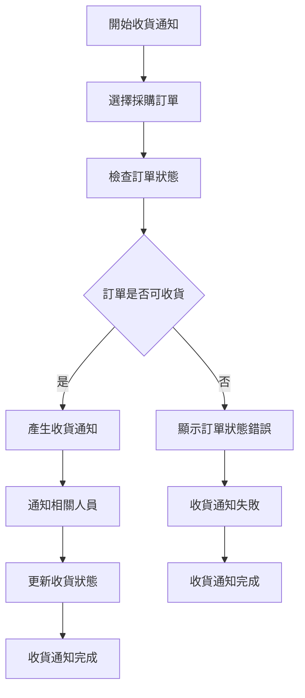

#### 5.1.2 資料驗證規則
1. **訂單狀態驗證**：檢查採購訂單是否為可收貨狀態
2. **交期驗證**：檢查是否已到預定交期
3. **供應商驗證**：檢查供應商是否為啟用狀態
4. **權限驗證**：檢查使用者是否有收貨通知權限

### 5.2 收貨驗收流程

#### 5.2.1 主要處理流程
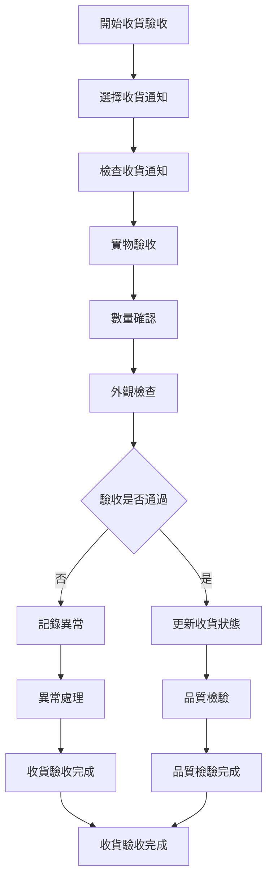

### 5.3 品質檢驗流程

#### 5.3.1 主要處理流程
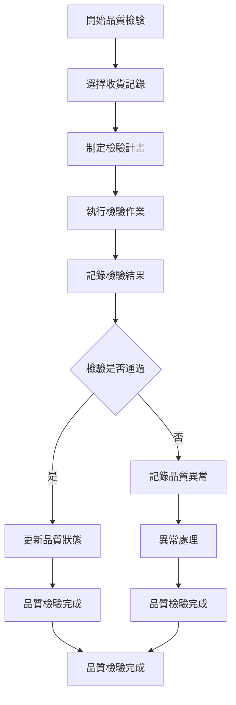

### 5.4 入庫作業流程

#### 5.4.1 主要處理流程
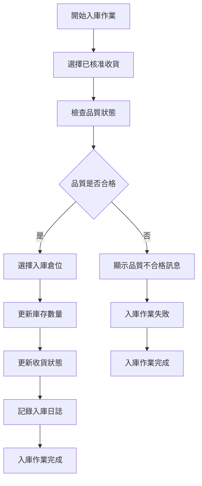

---

## 子程序處理邏輯說明

### 6.1 收貨編號產生子程序

#### 6.1.1 編號產生邏輯
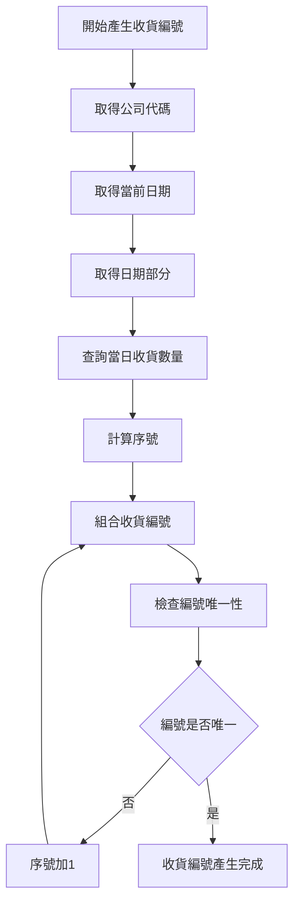

#### 6.1.2 編號格式說明
- **收貨編號格式**：RCV + 日期(8位) + 序號(4位)
- **範例**：RCV + 20241221 + 0001 = RCV202412210001

### 6.2 品質檢驗子程序

#### 6.2.1 品質檢驗邏輯
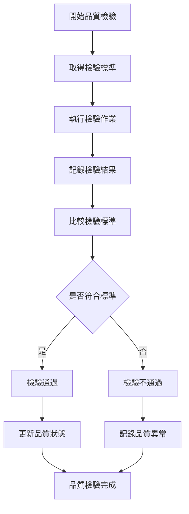

### 6.3 庫存更新子程序

#### 6.3.1 庫存更新邏輯
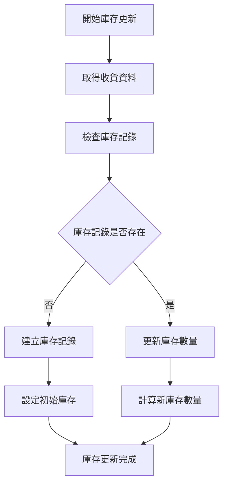

### 6.4 異常處理子程序

#### 6.4.1 異常處理邏輯
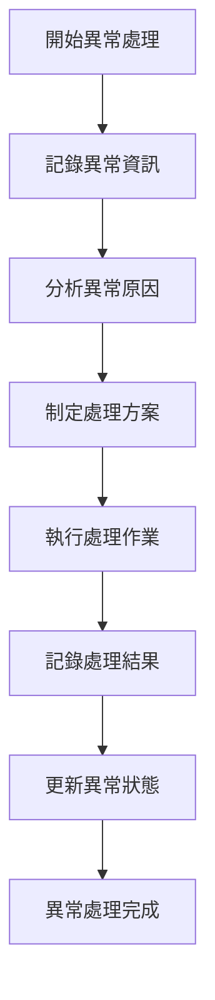

---

## 錯誤處理程序說明與訊息清冊

### 7.1 錯誤處理程序

#### 7.1.1 錯誤處理流程
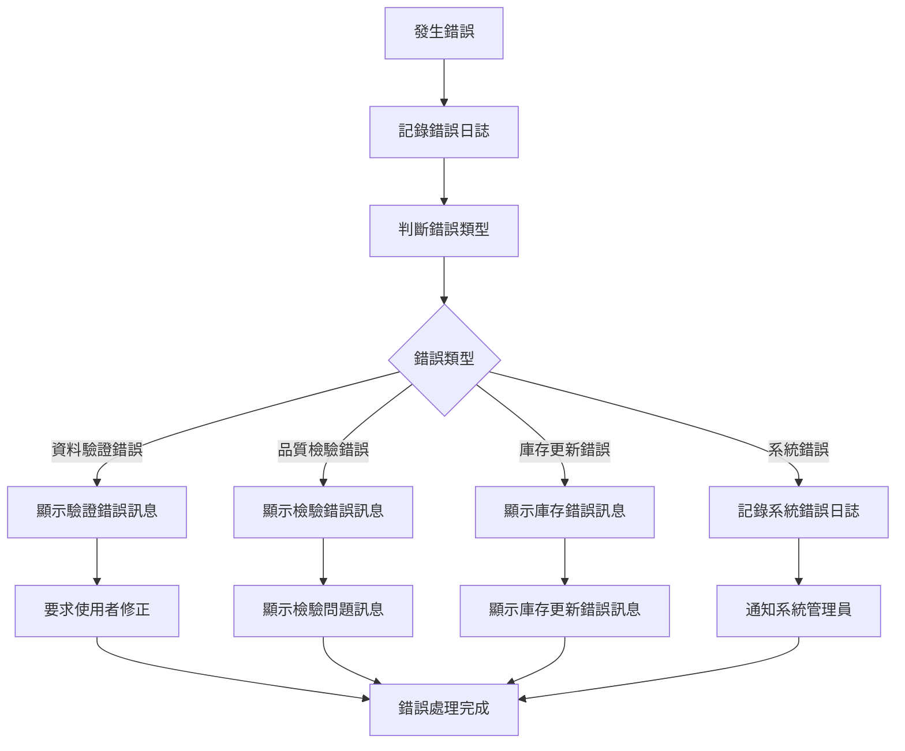

### 7.2 錯誤訊息清冊

#### 7.2.1 資料驗證錯誤訊息

| 錯誤代碼 | 錯誤訊息 | 錯誤原因 | 解決方法 |
|----------|----------|----------|----------|
| **PR701** | 收貨編號不能為空 | 收貨編號為必填欄位 | 請輸入收貨編號 |
| **PR702** | 採購訂單編號不能為空 | 採購訂單編號為必填欄位 | 請選擇採購訂單 |
| **PR703** | 供應商編號不能為空 | 供應商編號為必填欄位 | 請選擇供應商 |
| **PR704** | 收貨日期不能為空 | 收貨日期為必填欄位 | 請輸入收貨日期 |
| **PR705** | 收貨人員不能為空 | 收貨人員為必填欄位 | 請選擇收貨人員 |

#### 7.2.2 品質檢驗錯誤訊息

| 錯誤代碼 | 錯誤訊息 | 錯誤原因 | 解決方法 |
|----------|----------|----------|----------|
| **PR801** | 檢驗標準不存在 | 檢驗標準未設定 | 請先設定檢驗標準 |
| **PR802** | 檢驗人員權限不足 | 檢驗人員沒有檢驗權限 | 請選擇有檢驗權限的人員 |
| **PR803** | 檢驗結果不能為空 | 檢驗結果為必填欄位 | 請輸入檢驗結果 |
| **PR804** | 檢驗方法不存在 | 檢驗方法未設定 | 請先設定檢驗方法 |
| **PR805** | 檢驗記錄儲存失敗 | 檢驗記錄儲存操作失敗 | 請聯繫系統管理員 |

#### 7.2.3 庫存更新錯誤訊息

| 錯誤代碼 | 錯誤訊息 | 錯誤原因 | 解決方法 |
|----------|----------|----------|----------|
| **PR901** | 庫存記錄不存在 | 庫存記錄未建立 | 請先建立庫存記錄 |
| **PR902** | 庫存數量不足 | 庫存數量不足以更新 | 請檢查庫存數量 |
| **PR903** | 庫存更新失敗 | 庫存更新操作失敗 | 請聯繫系統管理員 |
| **PR904** | 庫存鎖定失敗 | 庫存記錄被鎖定 | 請等待庫存記錄解鎖 |
| **PR905** | 庫存記錄損壞 | 庫存記錄資料損壞 | 請聯繫系統管理員 |

### 7.3 錯誤處理建議

#### 7.3.1 使用者操作建議
1. **檢查必填欄位**：確保所有必填欄位都已填寫
2. **驗證資料格式**：檢查資料格式是否符合要求
3. **檢查權限設定**：確認有執行該操作的權限
4. **檢查系統狀態**：確認系統運行正常

#### 7.3.2 系統管理建議
1. **監控系統錯誤**：定期檢查系統錯誤日誌
2. **檢查檢驗標準**：定期檢查品質檢驗標準設定
3. **檢查庫存設定**：定期檢查庫存相關設定
4. **備份重要資料**：定期備份收貨管理相關資料

---

## 備註

### 8.1 開發注意事項

#### 8.1.1 程式開發注意事項
1. **資料完整性**：確保收貨管理資料的完整性和一致性
2. **品質控制**：實作完整的品質檢驗機制
3. **庫存管理**：實作準確的庫存更新機制
4. **異常處理**：提供完整的異常處理機制
5. **日誌記錄**：記錄詳細的操作日誌，便於問題診斷

#### 8.1.2 測試注意事項
1. **單元測試**：每個功能模組都必須進行單元測試
2. **整合測試**：測試各模組間的整合情況
3. **品質檢驗測試**：測試品質檢驗功能的完整性
4. **庫存更新測試**：測試庫存更新功能的準確性
5. **使用者接受度測試**：進行使用者接受度測試

### 8.2 維護注意事項

#### 8.2.1 日常維護注意事項
1. **監控系統狀態**：定期監控系統的運行狀態
2. **檢查檢驗標準**：定期檢查品質檢驗標準設定
3. **檢查庫存設定**：定期檢查庫存相關設定
4. **清理過期資料**：定期清理過期的歷史資料
5. **備份重要資料**：定期備份重要的收貨管理資料

#### 8.2.2 版本更新注意事項
1. **相容性檢查**：更新前必須檢查與現有系統的相容性
2. **資料遷移**：制定詳細的資料遷移計畫
3. **使用者通知**：提前通知使用者版本更新計畫
4. **回滾計畫**：制定詳細的回滾計畫
5. **測試驗證**：更新後必須進行充分的測試驗證

### 8.3 未來擴充建議

#### 8.3.1 功能擴充建議
1. **行動化收貨**：支援行動裝置收貨作業
2. **條碼掃描**：整合條碼掃描功能
3. **自動化檢驗**：實作自動化品質檢驗
4. **智慧化異常處理**：整合AI功能，提供智慧化異常處理建議
5. **供應商績效分析**：增加供應商績效分析功能

#### 8.3.2 技術改進建議
1. **雲端部署**：考慮採用雲端部署模式
2. **微服務架構**：考慮採用微服務架構
3. **API整合**：提供標準化的API介面
4. **資料分析**：整合資料分析功能
5. **物聯網整合**：整合IoT設備，實現自動化收貨

---

## 附錄

### A.1 相關文件清單
- 採購模組程式功能規格書 - 採購管理
- 採購模組程式功能規格書 - 供應商管理
- 採購模組程式功能規格書 - 採購申請
- 採購模組程式功能規格書 - 採購訂單
- 採購模組程式功能規格書 - 付款管理
- 採購模組程式功能規格書 - 庫存管理
- 採購模組程式功能規格書 - 報表分析
- 採購模組程式功能規格書 - 系統管理
- 採購模組業務邏輯分析與API設計
- 採購模組操作手冊 - 收貨管理

### A.2 修訂記錄

| 版本 | 修訂日期 | 修訂人員 | 修訂內容 | 修訂原因 |
|------|----------|----------|----------|----------|
| v1.0 | 2024/12/21 | 系統分析師 | 初始版本建立 | 新功能開發 |

### A.3 聯絡資訊
- **專案經理**：[專案經理姓名]
- **系統分析師**：[系統分析師姓名]
- **技術支援**：[技術支援聯絡方式]
- **專案信箱**：[專案信箱地址]
